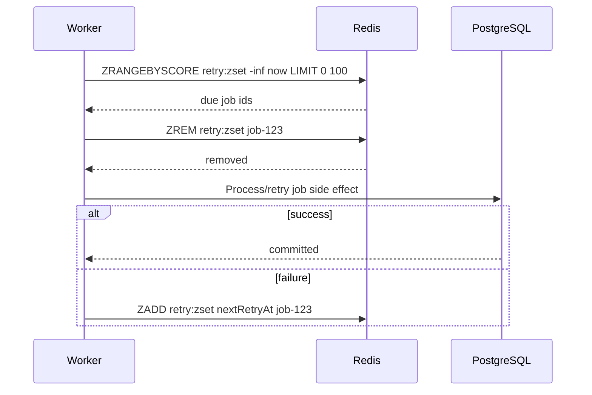

# Part 018 — Redis Sorted Sets

Redis Sorted Sets are Sets where every unique member has a numeric score.

They answer questions like:

```text
What are the top N items by score?
Which items have score between A and B?
Which jobs are due before now?
How many requests happened in this time window?
```

Sorted Sets are one of Redis' most useful structures for production backend systems because they combine:

- uniqueness of Set members
- numeric ordering by score
- efficient range queries
- efficient rank/range retrieval
- useful primitives for time-indexed workflows

They are commonly used for:

- rankings
- leaderboards
- delayed jobs
- sliding-window rate limiters
- time-based indexes
- retry scheduling
- cleanup queues
- priority queues

But Sorted Sets can also become expensive when they grow without cleanup, when range queries return too much data, or when score semantics are imprecise.

---

## 1. Core Mental Model

A Redis Sorted Set is:

```text
redis key -> { member -> score }
```

Example:

```text
quote:pricing:retry-schedule
  job-001 -> 1720681200000
  job-002 -> 1720681260000
  job-003 -> 1720681800000
```

The score defines ordering.

For time-based use cases, the score is often:

```text
epoch milliseconds or epoch seconds
```

For ranking use cases, the score is often:

```text
points, count, weight, priority, timestamp, business score
```

Sorted Set members are unique. Adding the same member again updates its score.

---

## 2. Why Sorted Sets Exist

A normal Set can answer:

```text
Is member X present?
```

A Sorted Set can answer:

```text
Is member X present, and where does it sit in an ordered space?
```

That ordered space may represent:

- time
- priority
- ranking
- cost
- retry attempt schedule
- request timestamp
- score assigned by business logic

This makes Sorted Sets useful for systems that need lightweight scheduling or rolling-window decisions without immediately reaching for a full broker or database query.

---

## 3. Basic Commands

### 3.1 ZADD

Add or update a member with a score:

```redis
ZADD quote:pricing:retry-schedule 1720681200000 job-001
```

If `job-001` already exists, its score is updated.

Useful options include `NX`, `XX`, `GT`, `LT`, and `CH`, depending on Redis version/support.

Example insert only if new:

```redis
ZADD quote:pricing:retry-schedule NX 1720681200000 job-001
```

---

### 3.2 ZREM

Remove a member:

```redis
ZREM quote:pricing:retry-schedule job-001
```

Often used after claiming/processing delayed jobs or cleaning limiter entries.

---

### 3.3 ZCARD

Count all members:

```redis
ZCARD quote:pricing:retry-schedule
```

This is useful for backlog/cardinality monitoring.

---

### 3.4 ZCOUNT

Count members with score in a range:

```redis
ZCOUNT api:rate:user:U-123 1720681140000 1720681200000
```

This is useful for sliding-window rate limiters.

---

### 3.5 ZRANGE

Read members by rank/range:

```redis
ZRANGE leaderboard:tenant:T-123 0 9 REV WITHSCORES
```

This returns the top 10 if using `REV` with high-score-first ranking.

---

### 3.6 ZRANGEBYSCORE

Read members by score range:

```redis
ZRANGEBYSCORE quote:pricing:retry-schedule -inf 1720681200000 LIMIT 0 100
```

This is useful for finding due jobs.

Newer Redis versions also support `ZRANGE ... BYSCORE` syntax.

---

### 3.7 ZREMRANGEBYSCORE

Remove members by score range:

```redis
ZREMRANGEBYSCORE api:rate:user:U-123 -inf 1720681140000
```

This is commonly used to clean old sliding-window entries.

---

### 3.8 ZPOPMIN and ZPOPMAX

Pop lowest/highest scored members:

```redis
ZPOPMIN quote:pricing:retry-schedule 10
```

Useful for priority queues or time-ordered processing, but be careful with crash behavior after pop.

---

### 3.9 BZPOPMIN and BZPOPMAX

Blocking pop variants:

```redis
BZPOPMIN quote:pricing:retry-schedule 5
```

These are useful in some worker models, but blocking commands need dedicated connections and careful timeout configuration.

---

## 4. Sorted Set Lifecycle

Example: delayed retry queue.



This is useful, but the failure window is obvious:

```text
Worker removes job from zset, then crashes before processing.
```

For critical jobs, you need a claim/processing state, idempotency, or a more durable queue system.

---

## 5. Score Semantics

The score is the heart of a Sorted Set.

Common score meanings:

| Use case | Score meaning |
|---|---|
| Leaderboard | points or rank score |
| Delayed job | due timestamp |
| Retry schedule | next retry timestamp |
| Sliding-window limiter | request timestamp |
| Time index | event timestamp |
| Priority queue | priority value |
| Cleanup index | expiry timestamp |

Score must be documented.

A reviewer should not have to guess whether `1720681200000` means created time, due time, expiry time, or priority.

---

## 6. Score Precision

Redis Sorted Set scores are floating-point numbers.

For most backend use cases, integer values up to a safe range are fine, but precision should still be understood.

Common safe choices:

```text
epoch seconds      -> compact, lower precision
epoch milliseconds -> common for rate limiters and delayed jobs
integer points     -> ranking/leaderboard
```

Be careful with:

- nanosecond timestamps
- extremely large integers
- monetary values
- composite values packed into a score
- business decisions requiring exact decimal precision

Do not store currency as a Sorted Set score unless precision loss is acceptable and documented.

For currency, PostgreSQL numeric/BigDecimal is usually the source of truth.

---

## 7. Ranking Pattern

Sorted Sets are often used for ranking.

Example:

```redis
ZADD quote:tenant:T-123:active-score 98 quote:Q-100
ZADD quote:tenant:T-123:active-score 84 quote:Q-101
ZADD quote:tenant:T-123:active-score 91 quote:Q-102
```

Top quotes:

```redis
ZRANGE quote:tenant:T-123:active-score 0 9 REV WITHSCORES
```

This is good for:

- dashboards
- prioritization
- non-authoritative ranking views
- operational queues

But if ranking must be auditable, reproducible, and joined with many fields, PostgreSQL or analytics storage may be more appropriate.

---

## 8. Leaderboard Pattern

Classic leaderboard:

```redis
ZINCRBY leaderboard:pricing-workers 1 worker-A
ZRANGE leaderboard:pricing-workers 0 9 REV WITHSCORES
```

This can track:

- worker processed count
- API consumer usage
- tenant activity
- endpoint hit ranking
- temporary operational ranking

Cautions:

- define reset period
- use time-bucketed keys if needed
- avoid unbounded member growth
- do not expose sensitive tenant/user IDs casually
- decide whether approximate operational ranking is acceptable

Example time bucket:

```text
leaderboard:api-usage:2026-07-11
```

---

## 9. Delayed Queue Pattern

Sorted Sets can implement delayed jobs.

Add job with due time:

```redis
ZADD quote:pricing:delayed 1720681200000 job-123
```

Poll due jobs:

```redis
ZRANGEBYSCORE quote:pricing:delayed -inf 1720681200000 LIMIT 0 100
```

Remove before processing:

```redis
ZREM quote:pricing:delayed job-123
```

Or remove atomically with Lua to avoid multiple workers claiming the same job.

The key design concern:

```text
Claiming and processing are not the same operation.
```

If business correctness matters, add:

- processing state
- retry count
- idempotent worker
- poison job handling
- visibility-timeout-like recovery
- durable backing store

---

## 10. Priority Queue Pattern

Sorted Set can model priority.

```redis
ZADD quote:work:priority 10 job-low
ZADD quote:work:priority 100 job-high
```

Pop highest priority:

```redis
ZPOPMAX quote:work:priority 1
```

This is simple, but consider:

- starvation of low-priority jobs
- priority inversion
- crash after pop
- lack of broker routing
- retry/poison job state

For serious enterprise work routing, RabbitMQ may be more appropriate.

For lightweight internal scheduling, Sorted Set can be enough.

---

## 11. Sliding-Window Rate Limiter Pattern

Sorted Sets are a common backend for sliding-window limiters.

For each request:

```text
1. Remove entries older than window.
2. Count remaining entries.
3. If count >= limit, reject.
4. Add current request timestamp.
5. Set TTL on limiter key.
```

Pseudo Redis:

```redis
ZREMRANGEBYSCORE rate:user:U-123 -inf 1720681140000
ZCOUNT rate:user:U-123 1720681140000 1720681200000
ZADD rate:user:U-123 1720681200000 req-abc-123
EXPIRE rate:user:U-123 120
```

This must be atomic in production, usually via Lua.

Without atomicity, concurrent requests can all observe count below limit and exceed the limit together.

---

## 12. Sliding Log vs Sliding Window Counter

Sorted Set limiter is often a sliding log:

```text
one entry per request
```

Pros:

- accurate within the window
- clear cleanup by timestamp
- supports inspection/debugging

Cons:

- memory grows with request rate
- high-throughput endpoints generate many entries
- requires cleanup
- needs unique member per request

Sliding window counter uses buckets instead:

```text
one counter per time bucket
```

Pros:

- lower memory
- faster under high traffic

Cons:

- approximate
- more complex boundary logic

For enterprise systems, choose based on:

- fairness requirement
- traffic volume
- memory budget
- acceptable approximation
- operational simplicity

---

## 13. Time-Based Index Pattern

Sorted Sets are useful as lightweight time indexes.

Example:

```redis
ZADD quote:expires-at 1720681200000 quote:Q-123
ZADD quote:expires-at 1720684800000 quote:Q-456
```

Find expired quotes:

```redis
ZRANGEBYSCORE quote:expires-at -inf 1720681200000 LIMIT 0 100
```

This pattern is useful for:

- expiry workflows
- retry scheduling
- cleanup tasks
- pending item scanning
- SLA breach detection

But remember:

```text
Redis is the index. PostgreSQL is usually the source of truth.
```

If Redis loses the index, the system should be able to rebuild it from durable data.

---

## 14. Expiry-Like Cleanup

Sorted Sets can implement member-level expiry-like behavior.

Example:

```redis
ZADD recent:request-fingerprints 1720681200000 fp-123
ZREMRANGEBYSCORE recent:request-fingerprints -inf 1720594800000
```

This solves the Set limitation that members do not have individual TTL.

But cleanup is explicit.

If cleanup does not run:

```text
The sorted set grows forever.
```

Use one or more:

- cleanup on every write
- scheduled cleanup worker
- time-bucketed keys
- max cardinality trim
- alert on `ZCARD`

---

## 15. Trimming Strategies

For ranking/leaderboards:

```redis
ZREMRANGEBYRANK leaderboard:api-usage 0 -1001
```

This keeps only top N depending on rank direction and command semantics.

For time windows:

```redis
ZREMRANGEBYSCORE rate:user:U-123 -inf cutoffTimestamp
```

For delayed queues:

```text
Do not trim blindly. You may delete unprocessed work.
```

For retry schedules:

```text
Remove only completed, invalid, or expired jobs with explicit business rules.
```

Trimming must match the meaning of the score.

---

## 16. Large Sorted Set Risk

Large Sorted Sets are common production hazards.

Risks:

- memory growth
- slow range queries
- expensive cleanup
- network amplification
- Java heap pressure
- cluster slot hotspot
- long-running Lua scripts
- high CPU from constant insert/remove

Danger signs:

```text
ZCARD keeps growing
ZREMRANGEBYSCORE removes huge batches
ZRANGE returns too many members
slowlog shows zset commands
single key dominates memory
```

Design controls:

- bounded cardinality
- time buckets
- cleanup frequency
- range limits
- sampling/debug commands
- per-tenant sharding
- hot key mitigation

---

## 17. Range Query Discipline

Always limit range query size when possible.

Risky:

```redis
ZRANGEBYSCORE quote:pricing:delayed -inf 1720681200000
```

Safer:

```redis
ZRANGEBYSCORE quote:pricing:delayed -inf 1720681200000 LIMIT 0 100
```

But `LIMIT` does not solve everything.

If the query is repeated in a tight loop, it can still overload Redis.

Worker loops need:

- batch size
- sleep/backoff
- max processing concurrency
- idempotency
- metrics
- graceful shutdown
- stuck job recovery

---

## 18. Atomic Claiming with Lua

For delayed jobs, multiple workers may fetch the same due jobs.

Naive flow:

```text
Worker A reads due job.
Worker B reads same due job.
Both try to process.
```

A safer claim operation needs to atomically:

```text
1. Find due member.
2. Remove it or move it to processing state.
3. Return claimed member.
```

Redis Lua can help.

Conceptual script:

```lua
local key = KEYS[1]
local now = tonumber(ARGV[1])
local limit = tonumber(ARGV[2])

local jobs = redis.call('ZRANGEBYSCORE', key, '-inf', now, 'LIMIT', 0, limit)
for _, job in ipairs(jobs) do
  redis.call('ZREM', key, job)
end
return jobs
```

This avoids double-claim, but not crash-after-claim.

For stronger recovery, move claimed jobs to a processing Sorted Set with claim expiry.

---

## 19. Visibility-Timeout-Like Pattern

To recover worker crashes, use two structures:

```text
ready zset      -> jobs scheduled by due time
processing zset -> claimed jobs scored by claim-expiry time
```

Flow:

```text
1. Claim due job from ready.
2. Add job to processing with claim expiry.
3. Worker processes job.
4. On success, remove from processing.
5. Reaper moves expired processing jobs back to ready.
```

This approximates broker visibility timeout.

But it increases complexity.

At that point, ask:

```text
Should this be RabbitMQ, Kafka, Redis Streams, or a durable DB workflow instead?
```

---

## 20. Sorted Set vs List

| Requirement | List | Sorted Set |
|---|---:|---:|
| FIFO queue | Strong | Possible but less direct |
| Blocking pop | Strong | Available with BZPOP* |
| Delayed scheduling | Weak | Strong |
| Priority queue | Weak | Strong |
| Time-window queries | Weak | Strong |
| Range by timestamp | Weak | Strong |
| Simplicity | Strong | Medium |
| Crash recovery | Weak without pattern | Weak/medium with pattern |

Use List for simple FIFO work.

Use Sorted Set when ordering by time/score matters.

Use Stream/RabbitMQ/Kafka when delivery semantics and operational tooling matter more.

---

## 21. Sorted Set vs Stream

| Requirement | Sorted Set | Redis Stream |
|---|---:|---:|
| Time-based scheduling | Strong | Not native but possible |
| Consumer groups | No | Yes |
| Pending entry tracking | Manual | Built-in |
| Replay | Manual | Better |
| Ordered event log | Limited | Stronger |
| Delayed retry | Strong | Needs extra logic |
| Worker crash recovery | Manual | PEL/claim helps |

Sorted Set is excellent for schedule/index.

Stream is better for event-like processing and consumer groups.

A common combined pattern:

```text
Sorted Set: when should job run?
Stream: deliver job to worker group once due
```

But this requires careful failure handling.

---

## 22. Sorted Set vs Kafka/RabbitMQ

Sorted Set is not a full broker.

Use Kafka when:

- replay matters
- event log matters
- multiple independent consumers exist
- ordering/partitioning is central
- audit trail matters

Use RabbitMQ when:

- work queue semantics matter
- routing matters
- acknowledgement/requeue matters
- DLQ tooling matters
- backpressure and delivery controls matter

Use Redis Sorted Set when:

- lightweight scheduling is enough
- jobs are internal and bounded
- idempotency is handled
- recovery limitations are understood
- operational load is manageable

---

## 23. Java/JAX-RS Integration Pattern

Do not expose Sorted Set details directly to resource classes.

Poor abstraction:

```java
redis.zadd("quote:pricing:delayed", dueAtMillis, jobId);
```

Better abstraction:

```java
pricingRetryScheduler.scheduleRetry(jobId, dueAt);
```

The abstraction should own:

- key naming
- score meaning
- time source
- serialization
- Lua script usage
- timeout
- metrics
- retry policy
- idempotency
- fallback behavior

JAX-RS resource should know the business action, not the Redis structure.

---

## 24. PostgreSQL/MyBatis/JDBC Interaction

Sorted Sets often index PostgreSQL state.

Example:

```text
PostgreSQL: quote_retry_job(id, status, next_retry_at)
Redis ZSet: quote:retry:due -> id scored by next_retry_at
```

Good design:

```text
PostgreSQL remains authoritative.
Redis is a fast due-time index.
```

Failure windows:

```text
DB insert succeeds, Redis ZADD fails -> job durable but not scheduled in Redis
Redis ZADD succeeds, DB insert fails -> Redis points to missing job
Worker claims Redis job, DB row already completed -> worker must no-op
```

Mitigations:

- transactional outbox
- reconciliation job
- worker verifies DB state
- idempotent processing
- rebuild Redis index from DB
- metrics for DB/Redis mismatch

---

## 25. Kafka/RabbitMQ Interaction

Sorted Sets can be used with messaging for scheduling or throttling.

Examples:

```text
Kafka event arrives -> schedule delayed Redis job
Redis due job -> publish RabbitMQ command
RabbitMQ failure -> reschedule in Redis ZSet
```

Failure modes:

- duplicate event schedules same job
- out-of-order event updates due time incorrectly
- Redis schedule exists but broker publish fails
- broker publish succeeds but Redis cleanup fails
- consumer lag delays scheduling

Use stable job IDs as Sorted Set members to make rescheduling idempotent:

```redis
ZADD quote:retry:due 1720681200000 job-123
```

Calling `ZADD` again for the same job updates the schedule rather than creating duplicates.

---

## 26. Kubernetes and Worker Scaling

Sorted Set workers in Kubernetes need careful coordination.

Risk:

```text
10 worker pods poll the same due zset and race to claim jobs.
```

Controls:

- atomic claim script
- bounded batch size
- backoff on empty result
- per-worker concurrency limit
- graceful shutdown
- processing state
- claim timeout/reaper
- metrics by pod and globally

Also check:

- Redis connection pool per worker pod
- CPU throttling affecting schedule accuracy
- clock synchronization across pods
- rolling update and in-flight work
- pod termination grace period

---

## 27. Clock Source

Time-based Sorted Set patterns depend on time.

Options:

```text
Application time
Redis server time
Database time
```

For distributed rate limiting, using app pod time can be risky if clocks drift.

Redis `TIME` can provide server-side time, often used inside Lua scripts.

But think carefully:

- Is Redis server time authoritative enough?
- Are app clocks synchronized via NTP?
- Does PostgreSQL use a different time source?
- What happens during clock skew?

For billing, compliance, and audit, PostgreSQL timestamps may be more authoritative.

For limiter windows, Redis server time may be acceptable.

---

## 28. Security and Privacy Concerns

Sorted Set members often contain IDs.

Avoid:

```text
email address as member
raw token as member
full customer identifier in key without policy approval
PII in debug-visible structures
```

For delayed jobs, prefer opaque job IDs:

```text
job-123
```

Then load sensitive details from PostgreSQL using controlled access.

This reduces:

- Redis memory exposure
- log leakage
- snapshot/backup privacy risk
- accidental support-tool disclosure

For rate limiters, avoid raw IP/user identifiers if internal policy requires hashing or tokenization.

---

## 29. Observability

Useful Sorted Set metrics:

### For delayed jobs

- `ZCARD` ready queue
- oldest due timestamp
- due job count
- processing queue size
- retry count
- poison job count
- claim latency
- job age

### For rate limiters

- limiter key count
- rejects per endpoint/tenant/user class
- zset cardinality distribution
- cleanup count
- Lua script latency
- memory growth

### Redis-level

- commandstats for `zadd`, `zrem`, `zrange`, `zrangebyscore`, `zremrangebyscore`
- slowlog
- latency spikes
- memory usage
- hot key detection

For time-based queues, a critical metric is:

```text
oldest due item age
```

Queue length alone is not enough.

---

## 30. Common Failure Modes

### 30.1 Sorted Set grows forever

Cause:

```text
No cleanup, no trim, no TTL, unbounded members.
```

Impact:

- memory pressure
- eviction
- slow range queries

Detection:

- rising `ZCARD`
- memory growth
- big key reports

---

### 30.2 Duplicate processing

Cause:

```text
Multiple workers read due members before removal.
```

Impact:

- repeated side effects
- duplicate external calls
- inconsistent state

Mitigation:

- atomic claim script
- idempotent worker
- DB-level uniqueness

---

### 30.3 Lost job after claim

Cause:

```text
Worker removes member then crashes before processing.
```

Impact:

- work disappears
- customer action stuck

Mitigation:

- processing zset
- claim timeout/reaper
- durable DB backing state
- reconciliation job

---

### 30.4 Limiter memory blow-up

Cause:

```text
One zset entry per request with poor cleanup.
```

Impact:

- Redis memory pressure
- limiter latency
- eviction of unrelated data

Mitigation:

- Lua cleanup
- TTL on limiter keys
- bucketed limiter
- limit high-cardinality dimensions

---

### 30.5 Score precision bug

Cause:

```text
Using unsafe numeric precision or mixing seconds/milliseconds.
```

Impact:

- jobs run too early/late
- limiter window wrong
- cleanup deletes wrong entries

Mitigation:

- document score unit
- centralize time conversion
- test boundary values
- use strong typing in Java wrapper

---

### 30.6 Cross-slot issue in Cluster

Cause:

```text
Lua script or multi-key operation touches keys in different slots.
```

Impact:

- Redis Cluster errors
- worker/limiter failure

Mitigation:

- key hash tags
- single-key design
- cluster-aware testing

---

## 31. Production-Safe Debugging

Safe-ish commands:

```redis
TYPE key
ZCARD key
ZRANGE key 0 10 WITHSCORES
ZRANGE key 0 10 REV WITHSCORES
ZCOUNT key min max
TTL key
```

Be careful with:

```redis
ZRANGE key 0 -1
ZRANGEBYSCORE key -inf +inf
ZREMRANGEBYSCORE key -inf +inf
ZUNIONSTORE huge operations
```

Debug flow for delayed queue:

```text
1. Check ZCARD.
2. Check earliest due item with ZRANGE 0 0 WITHSCORES.
3. Compare score with current time.
4. Check worker logs.
5. Check claim/removal script metrics.
6. Check processing zset if present.
7. Check PostgreSQL source row.
8. Check retry/poison policy.
```

Debug flow for limiter:

```text
1. Identify limiter key dimensions.
2. Check ZCARD for a sample key.
3. Check ZCOUNT inside current window.
4. Check TTL.
5. Check cleanup behavior.
6. Check Lua script latency/errors.
7. Check response 429 logs.
```

---

## 32. PR Review Checklist

### Data model

- Is Sorted Set the right structure?
- What does the score mean?
- Is the score unit documented?
- Is member uniqueness intentional?
- Is ordering by score sufficient?

### Cardinality and cleanup

- What is expected `ZCARD`?
- What is worst-case `ZCARD`?
- How are old members removed?
- Is cleanup atomic with write path?
- Is TTL used where appropriate?

### Range queries

- Are range reads bounded with `LIMIT`?
- Could range query return too much data?
- Is this command on request path or worker path?
- Is slowlog monitored?

### Concurrency

- Can multiple workers claim same member?
- Is claim atomic?
- What happens after crash post-claim?
- Is processing idempotent?

### Rate limiting

- Is limiter logic atomic?
- Is cleanup included?
- Is clock source defined?
- Is memory growth bounded?
- Is fairness requirement documented?

### PostgreSQL/messaging

- Is Redis index rebuildable from DB?
- What happens if DB commit succeeds but Redis update fails?
- What happens if broker publish succeeds but Redis cleanup fails?
- Are duplicate/out-of-order events handled?

### Cluster and operations

- Are keys cluster-safe?
- Are hash tags needed?
- Are hot keys likely?
- Are queue age/cardinality metrics present?
- Is runbook defined?

### Security/privacy

- Are members opaque IDs instead of sensitive payloads?
- Are key names free from PII?
- Are snapshots/backups considered?
- Are ACLs appropriate?

---

## 33. Internal Verification Checklist

Use this checklist against the real codebase, Redis runtime, and platform configuration.

### Codebase

- Search for `ZADD`, `ZREM`, `ZRANGE`, `ZRANGEBYSCORE`, `ZCOUNT`, `ZCARD`, `ZPOPMIN`, `ZPOPMAX`, `BZPOPMIN`, `ZREMRANGEBYSCORE`, `ZREMRANGEBYRANK`.
- Identify every Sorted Set key pattern.
- Classify each use case: ranking, delayed queue, priority queue, limiter, time index, cleanup index, retry schedule, or other.
- Identify score meaning and unit.

### Correctness

- Check whether Sorted Set is source of truth or rebuildable index.
- Check worker claim atomicity.
- Check crash-after-claim recovery.
- Check idempotency of processing.
- Check DB/Redis mismatch handling.

### Rate limiter

- Check if Lua is used.
- Check cleanup logic.
- Check TTL on limiter keys.
- Check high-cardinality dimensions.
- Check fairness and Retry-After behavior.

### Operations

- Check `ZCARD` dashboards.
- Check oldest due item age.
- Check slowlog for zset commands.
- Check big/hot key detection.
- Check worker backlog/runbook.

### Kubernetes/cloud/on-prem

- Check worker scaling behavior.
- Check total Redis command rate.
- Check connection pool per worker pod.
- Check cluster hash slot behavior.
- Check managed Redis metrics and alerts.

### Security/privacy

- Check whether members include PII/secrets/tokens.
- Check whether key names expose tenant/customer data beyond policy.
- Check ACL access to zset key patterns.
- Check backup/snapshot sensitivity.

---

## 34. Summary

Redis Sorted Sets are one of the most powerful Redis structures for backend engineering.

They model:

```text
unique member + ordered score
```

That makes them excellent for:

- ranking
- leaderboards
- delayed jobs
- retry schedules
- time-based indexes
- sliding-window limiters
- expiry-like cleanup

They become dangerous when:

- score semantics are unclear
- cardinality grows without cleanup
- range queries are unbounded
- multiple workers claim the same work
- crash recovery is missing
- limiter memory grows with traffic
- Redis is treated as a durable workflow engine without recovery design

For senior backend engineers, the key skill is recognizing that a Sorted Set is not just a fancy Set. It is an ordered index. Once you treat it as an index, the right questions become clear: what is the source of truth, how is the index maintained, how is it cleaned, how does it fail, and how can it be rebuilt?
