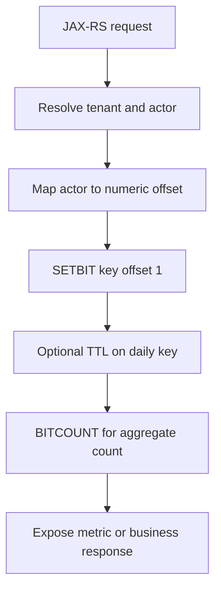
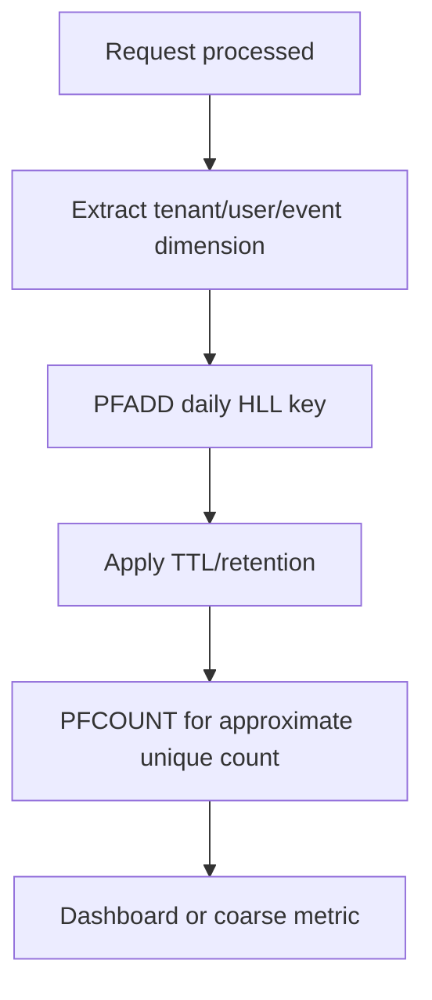

# Part 019 — Redis Bitmaps, Bitfields, HyperLogLog, and Geo

Redis is often introduced through Strings, Hashes, Lists, Sets, and Sorted Sets.

But Redis also has specialized structures that can solve specific production problems with very low memory cost:

- **Bitmaps** for compact boolean tracking
- **Bitfields** for packed integer counters inside a string
- **HyperLogLog** for approximate unique counting
- **Geospatial indexes** for location-based lookup

These structures are powerful, but they should not be used just because they are clever.

In enterprise Java/JAX-RS systems, the real question is:

```text
Does this structure make the system simpler, cheaper, safer, and easier to operate?
```

If the answer is no, a normal Hash, Set, Sorted Set, PostgreSQL table, or analytics pipeline may be better.

---

## 1. Core Mental Model

These Redis features are not separate databases. They are specialized encodings or command families over Redis keys.

```text
Redis key
  -> compact representation
  -> specialized command behavior
  -> memory/performance trade-off
  -> operational/debugging implications
```

They are optimized for:

- compact memory usage
- fast in-memory operations
- simple online counters or membership-like checks
- approximate analytics
- location proximity queries

They are not optimized for:

- rich relational querying
- complex audit trails
- human-readable debugging
- long-term analytics source of truth
- compliance-grade reporting
- arbitrary schema evolution

---

## 2. Why These Structures Exist

Without these structures, engineers often model everything as JSON, Hashes, Sets, or tables.

That works, but some workloads become wasteful.

Example problems:

```text
Track whether user U has done action A today.
Count approximate unique visitors per tenant per day.
Store many tiny bounded counters.
Find nearby service regions or locations.
```

A Set can track unique users, but millions of members consume memory.

A Hash can track many fields, but small counters may have overhead.

A PostgreSQL query can do geospatial search if PostGIS is available, but Redis may serve a low-latency proximity cache.

Specialized Redis structures exist to trade flexibility for memory/performance efficiency.

---

## 3. Bitmap Mental Model

A Redis Bitmap is not a distinct type. It is a String treated as a sequence of bits.

```text
key -> string bytes -> bits
```

Each bit position is an offset:

```text
offset 0 -> bit 0
offset 1 -> bit 1
offset 2 -> bit 2
...
```

A bit can be:

```text
0 or 1
```

This is useful when you need compact boolean state.

Example:

```text
quote:tenant:T-123:daily-active-users:2026-07-11
  bit[userNumericId] = 1 if user was active that day
```

This can be extremely memory efficient when the ID space is dense and bounded.

But it is dangerous when offsets are sparse and huge.

---

## 4. Bitmap Commands

### 4.1 SETBIT

Set one bit at an offset:

```redis
SETBIT tenant:T-123:activity:2026-07-11 4217 1
```

Meaning:

```text
Mark offset 4217 as true.
```

### 4.2 GETBIT

Read one bit:

```redis
GETBIT tenant:T-123:activity:2026-07-11 4217
```

Returns:

```text
0 or 1
```

### 4.3 BITCOUNT

Count bits set to `1`:

```redis
BITCOUNT tenant:T-123:activity:2026-07-11
```

Useful for compact count of active flags.

### 4.4 BITOP

Perform operations across bitmaps:

```redis
BITOP AND tenant:T-123:active-both-days day1 day2
BITOP OR tenant:T-123:active-any-day day1 day2
```

Useful for simple set-like boolean operations.

---

## 5. Bitmap Lifecycle

A bitmap-based workflow usually looks like this:



The important design decision is not `SETBIT`.

The important design decision is:

```text
How do we map business identity to a safe numeric offset?
```

---

## 6. Bitmap Offset Risk

Redis allocates memory up to the highest bit offset.

This is the most important bitmap failure mode.

Example:

```redis
SETBIT activity 999999999999 1
```

This may force Redis to allocate a huge string.

That can create:

- memory spike
- latency spike
- eviction pressure
- OOM risk
- production incident

Do not use raw UUID hash values or unbounded IDs directly as offsets.

Bad:

```text
offset = hash(uuid)
```

Better:

```text
offset = compact internal numeric sequence
```

Or avoid bitmap entirely.

---

## 7. Bitmap Use Cases

Good candidates:

- daily active user flags with dense numeric IDs
- feature exposure flags for bounded cohorts
- compact attendance/completion tracking
- yes/no state for bounded integer IDs
- boolean matrix-like tracking where offsets are controlled

Poor candidates:

- sparse UUID-based identities
- unbounded tenant-specific offsets
- compliance-critical audit history
- state requiring timestamp/reason/source
- data that must be explainable to operations teams
- data requiring per-item TTL

Bitmap tracks bits, not business facts.

If you need to know why a bit is `1`, when it changed, who changed it, or which request caused it, use another data model.

---

## 8. Bitfield Mental Model

Bitfields let you treat a Redis String as packed integers.

Instead of one bit per boolean, you can store small counters or flags in fixed-width segments.

Example:

```text
key -> bytes
  bits 0..3   -> small counter A
  bits 4..7   -> small counter B
  bits 8..15  -> small signed/unsigned value C
```

Redis command:

```redis
BITFIELD metrics:tenant:T-123 INCRBY u8 0 1
```

This increments an unsigned 8-bit integer at offset 0.

---

## 9. Bitfield Use Cases

Bitfields are useful when:

- the domain is highly compact
- counters have known bounds
- memory is more important than readability
- values are simple numeric fields
- the team understands packed representation

Possible examples:

- compact per-bucket counters
- bounded attempt counters
- small state machine flags
- synthetic performance counters

But for most enterprise business systems, Bitfields are often too opaque.

A Hash is usually easier to debug:

```redis
HINCRBY login:attempts:user:U-123 count 1
```

Compared with:

```redis
BITFIELD login:attempts:packed INCRBY u8 1024 1
```

Use Bitfields only when the memory benefit clearly beats maintainability cost.

---

## 10. Bitfield Correctness Concerns

Bitfields require careful thinking about:

- signed vs unsigned values
- integer width
- overflow behavior
- offset calculation
- schema documentation
- compatibility across deployments
- debugging tooling

Overflow matters.

If a field is `u8`, the maximum value is 255.

You must decide what happens at 255:

- wrap
- saturate
- fail

Redis supports overflow modes, but the system design must make that behavior explicit.

---

## 11. HyperLogLog Mental Model

HyperLogLog estimates unique cardinality.

It answers:

```text
Approximately how many unique things have we seen?
```

It does **not** answer:

```text
Which things have we seen?
```

Basic commands:

```redis
PFADD tenant:T-123:unique-users:2026-07-11 U-1 U-2 U-3
PFCOUNT tenant:T-123:unique-users:2026-07-11
```

This returns an approximate count.

HyperLogLog is useful because it uses fixed, small memory relative to the number of unique items.

---

## 12. HyperLogLog Use Cases

Good candidates:

- approximate unique visitors
- approximate unique accounts per day
- approximate unique endpoints hit
- approximate unique quote calculation requesters
- lightweight product usage counters
- high-cardinality metric approximation

Poor candidates:

- billing
- quota enforcement
- compliance reporting
- idempotency
- exact deduplication
- authorization checks
- fraud decisions requiring exact evidence

HyperLogLog is approximate by design.

Do not use it where exactness is part of correctness.

---

## 13. HyperLogLog Lifecycle

Typical flow:



For analytics pipelines, Redis HyperLogLog should usually be considered:

```text
operational approximation
```

not:

```text
final analytical source of truth
```

---

## 14. HyperLogLog Merge

HyperLogLog structures can be merged:

```redis
PFMERGE tenant:T-123:unique-users:week-2026-W28 \
  tenant:T-123:unique-users:2026-07-06 \
  tenant:T-123:unique-users:2026-07-07 \
  tenant:T-123:unique-users:2026-07-08
```

Then:

```redis
PFCOUNT tenant:T-123:unique-users:week-2026-W28
```

This can be useful for rolling approximate metrics.

But merging should be designed carefully:

- avoid unbounded merge jobs
- define retention
- document approximate nature
- avoid using merged HLL as exact business evidence

---

## 15. Geospatial Mental Model

Redis geospatial commands store longitude/latitude data and allow proximity queries.

Internally, Redis Geo is based on Sorted Sets with geohash-like scoring.

Example:

```redis
GEOADD service:regions 106.8272 -6.1751 jakarta-office
GEOADD service:regions 103.8198 1.3521 singapore-office
```

Query nearby locations:

```redis
GEOSEARCH service:regions \
  FROMLONLAT 106.8272 -6.1751 \
  BYRADIUS 500 km \
  WITHDIST ASC
```

This answers:

```text
Which indexed points are near this coordinate?
```

---

## 16. Geo Use Cases

Good candidates:

- low-latency proximity cache
- nearest region lookup
- service location cache
- approximate geo routing helper
- store lookup cache
- point-of-presence selection helper

Poor candidates:

- authoritative geospatial system of record
- complex polygon queries
- regulatory boundary decisions
- audited address/location history
- advanced GIS analytics
- multi-dimensional route optimization

For rich geospatial modeling, PostgreSQL with PostGIS or a dedicated geospatial service is often more appropriate.

Redis Geo is best as a fast lookup/cache primitive.

---

## 17. Geo Correctness Concerns

Geo data introduces subtle correctness risks:

- coordinate order confusion: longitude first, latitude second
- stale location entries
- missing deletion/invalidation
- distance unit mismatch
- approximate boundary behavior
- tenant isolation issues
- privacy concerns if user location is stored

Redis command order is:

```text
longitude latitude member
```

Not:

```text
latitude longitude member
```

This mistake is common and painful.

---

## 18. Java/JAX-RS Backend Impact

From a Java/JAX-RS service perspective, these structures usually appear behind a domain-specific Redis adapter.

Avoid leaking Redis-specific semantics into resource classes.

Bad:

```java
@Path("/activity")
public class ActivityResource {
    public Response mark(@QueryParam("offset") long offset) {
        redis.setbit("activity", offset, true);
        return Response.ok().build();
    }
}
```

Better:

```java
@Path("/activity")
public class ActivityResource {
    private final ActivityMarker activityMarker;

    public Response mark(ActivityRequest request) {
        activityMarker.markUserActive(request.tenantId(), request.userId());
        return Response.accepted().build();
    }
}
```

The adapter owns:

- key naming
- offset mapping
- TTL
- fallback behavior
- metric emission
- validation
- production-safe error handling

---

## 19. PostgreSQL/MyBatis/JDBC Impact

These Redis structures often depend on relational source-of-truth data.

Examples:

```text
PostgreSQL users table -> numeric user ID -> bitmap offset
PostgreSQL tenant table -> tenant namespace -> HLL key
PostgreSQL service region table -> Redis GEO cache
```

Important questions:

- Is Redis a cache or source of truth?
- How is Redis rebuilt after flush/restart?
- What happens after database migration?
- How are deleted users/tenants handled?
- Can stale Redis data affect correctness?
- Does MyBatis transaction commit happen before Redis update?

For Geo and business configuration, Redis should usually be rebuildable from PostgreSQL.

For approximate HLL metrics, Redis may be operational telemetry rather than business record.

For bitmap flags, be very explicit whether PostgreSQL has the authoritative history.

---

## 20. Kafka/RabbitMQ Impact

Messaging can be used to update these structures asynchronously.

Examples:

```text
UserActivityEvent -> PFADD unique users HLL
FeatureExposureEvent -> SETBIT exposure bitmap
LocationUpdatedEvent -> GEOADD latest service location
EntityDeletedEvent -> remove related Geo member or key
```

Failure modes:

- duplicate events
- out-of-order events
- missing events
- delayed invalidation
- consumer lag
- Redis unavailable while consuming
- Redis update succeeds but offset commit fails
- event replay changes approximate counters unexpectedly

HyperLogLog handles duplicate values naturally for cardinality estimation.

Bitmap `SETBIT 1` is idempotent if the offset mapping is stable.

Geo updates are last-write-wins unless versioning is added.

---

## 21. Kubernetes, Cloud, and On-Prem Considerations

These structures are memory-sensitive.

In Kubernetes or managed Redis, review:

- maxmemory
- eviction policy
- memory fragmentation
- persistence settings
- backup/snapshot behavior
- dashboard for key growth
- tenant key cardinality
- network latency from Java pods to Redis
- cluster slot distribution
- managed service command restrictions

Bitmap offset mistakes and unbounded HLL/Geo key creation can create memory growth that looks like a leak.

In cloud-managed Redis, also verify:

- whether commands are restricted
- whether keyspace scanning tools are allowed
- whether metrics expose per-command stats
- whether snapshots contain sensitive data

---

## 22. Failure Modes

### 22.1 Bitmap Failure Modes

- huge offset causes memory spike
- wrong identity-to-offset mapping corrupts tracking
- sparse IDs waste memory
- missing TTL causes unbounded retention
- bitmap used where auditability is required
- `BITCOUNT` over very large key causes latency

### 22.2 Bitfield Failure Modes

- overflow wraps unexpectedly
- offset schema is undocumented
- signed/unsigned mismatch
- deployment changes packed layout incompatibly
- debugging requires custom tooling

### 22.3 HyperLogLog Failure Modes

- approximate count used as exact count
- HLL used for billing/quota/compliance
- duplicate event replay misunderstood
- unbounded per-tenant/day keys
- missing TTL/retention

### 22.4 Geo Failure Modes

- latitude/longitude order reversed
- stale location remains indexed
- deleted entity still returned
- privacy-sensitive location retained too long
- Redis used for complex GIS rules it cannot safely model

---

## 23. Production-Safe Debugging

Avoid broad key scans in production.

Safer checks:

```redis
TYPE key
TTL key
MEMORY USAGE key
STRLEN bitmap-key
PFCOUNT hll-key
ZCARD geo-key
```

For large keyspaces, prefer:

```redis
SCAN cursor MATCH prefix:* COUNT 100
```

Do not use:

```redis
KEYS *
```

For bitmap diagnosis:

- check `STRLEN`
- check max expected offset
- inspect application mapping code
- compare memory usage before/after writes

For HLL diagnosis:

- validate exactness expectations
- compare with sample exact count from PostgreSQL/analytics
- confirm TTL and naming dimensions

For Geo diagnosis:

- check coordinate order
- compare with source-of-truth table
- verify delete/invalidation path

---

## 24. Correctness Concerns

Ask these questions:

```text
Is the Redis structure exact or approximate?
Is it source of truth or derived state?
Can it be rebuilt?
What happens if Redis loses it?
What happens if it is stale?
What happens if event replay updates it again?
What happens under concurrent requests?
```

Bitmap and Bitfield correctness depends heavily on stable offset calculation.

HyperLogLog correctness depends on accepting approximation.

Geo correctness depends on freshness, coordinate quality, and source-of-truth boundaries.

---

## 25. Concurrency Concerns

Most single Redis commands are atomic.

Examples:

```text
SETBIT is atomic.
PFADD is atomic.
GEOADD is atomic.
```

But workflows are not automatically atomic.

Example:

```text
1. Read DB entity
2. Compute offset
3. SETBIT
4. Update DB audit row
```

This cross-system flow can still fail halfway.

For enterprise Java services, define:

- retry behavior
- idempotency behavior
- ordering behavior
- compensation behavior
- rebuild behavior

---

## 26. Performance Concerns

### Bitmap

- efficient if offsets are dense
- dangerous if offsets jump high
- `BITCOUNT` can be expensive on very large keys

### Bitfield

- compact but opaque
- offset calculation can become CPU/client-side complexity
- overflow behavior must be explicit

### HyperLogLog

- fixed small memory
- approximate only
- merge jobs should be bounded

### Geo

- useful for proximity lookup
- backed by Sorted Set behavior
- large radius queries can return too much data
- use `COUNT`/limits where possible

---

## 27. Security and Privacy Concerns

These structures can hide sensitive data in compact forms.

Risks:

- PII in key names
- user activity tracking without retention control
- location data stored too long
- token-like identifiers added to HLL
- snapshots/backups containing sensitive state
- tenant data mixed in same key

Avoid keys like:

```text
activity:john.doe@example.com:2026-07-11
```

Prefer opaque identifiers:

```text
tenant:T-123:activity:2026-07-11
```

Still verify whether the value itself is sensitive.

---

## 28. Observability Concerns

Metrics to watch:

- memory usage by key pattern
- key cardinality by namespace
- command stats for `SETBIT`, `BITCOUNT`, `PFADD`, `PFCOUNT`, `GEOSEARCH`
- latency spikes
- evictions
- expired keys
- Redis slowlog
- Java client timeout rate
- error rate by Redis operation

For approximate structures, dashboards must label metrics clearly:

```text
Approximate unique users, not exact unique users.
```

---

## 29. Data Structure Selection Checklist

Use Bitmap when:

- state is boolean
- offset space is bounded
- offsets are dense enough
- audit details are not required
- compact memory matters

Use Bitfield when:

- values are tiny bounded integers
- packed representation is documented
- overflow behavior is explicit
- maintainability cost is acceptable

Use HyperLogLog when:

- only approximate unique count is needed
- individual members do not need to be retrieved
- exactness is not a correctness requirement

Use Geo when:

- point proximity lookup is needed
- Redis is cache/helper, not GIS source of truth
- stale coordinate behavior is acceptable and controlled

Do not use these structures when:

- the team cannot debug them
- exactness is required but structure is approximate
- data needs audit history
- offsets are unbounded
- source-of-truth semantics are unclear

---

## 30. Java Implementation Review Pattern

A clean Java implementation should hide Redis details behind a focused component.

Example interfaces:

```java
public interface ActivityMarker {
    void markActive(TenantId tenantId, UserId userId, LocalDate date);
    long approximateActiveCount(TenantId tenantId, LocalDate date);
}
```

```java
public interface GeoLookupCache {
    List<ServiceRegion> findNearest(TenantId tenantId, Coordinate coordinate, Distance radius);
    void refreshRegion(ServiceRegion region);
    void removeRegion(ServiceRegionId regionId);
}
```

The JAX-RS resource should not know:

- Redis key names
- bitmap offsets
- HLL internals
- GEO command syntax
- TTL implementation

This keeps Redis an implementation detail, not an API contract.

---

## 31. PR Review Checklist

When reviewing usage of Bitmaps, Bitfields, HyperLogLog, or Geo, ask:

- What exact problem requires this specialized structure?
- Why is a normal Hash/Set/Sorted Set/PostgreSQL table not enough?
- Is the structure exact or approximate?
- Is Redis source of truth or derived state?
- How is the key named and scoped by tenant/service/environment?
- What is the TTL/retention policy?
- Can the data be rebuilt?
- What happens if Redis is flushed or restored from old snapshot?
- What is the max cardinality or max offset?
- What dashboards and alerts cover this use case?
- Is PII or sensitive activity/location data stored?
- Is the structure understandable by SRE/on-call engineers?

---

## 32. Internal Verification Checklist

Verify in the internal CSG/team context:

- Whether Bitmaps are used anywhere in Redis keyspace.
- Whether offset mapping is documented and bounded.
- Whether Bitfields are used and whether packed schemas are documented.
- Whether HyperLogLog is used for approximate metrics.
- Whether HLL output is ever used for billing, quota, compliance, or customer-facing exact reporting.
- Whether Geo commands are used for location or routing caches.
- Whether coordinate data contains PII or sensitive operational information.
- Whether TTL/retention exists for daily/tenant/activity/location keys.
- Whether Redis data can be rebuilt from PostgreSQL, Kafka, RabbitMQ, or another source.
- Whether Java wrappers hide Redis-specific details from JAX-RS resources.
- Whether dashboards expose memory growth, command latency, and key cardinality.
- Whether production debugging guidance exists for these specialized structures.

---

## 33. Summary

Bitmaps, Bitfields, HyperLogLog, and Geo are not beginner Redis features.

They are specialized tools.

They can be excellent when the problem matches the structure:

```text
Bitmap       -> compact boolean state
Bitfield     -> compact bounded numeric state
HyperLogLog  -> approximate unique cardinality
Geo          -> fast point proximity lookup
```

They can be dangerous when used to be clever.

For senior backend engineering, the right posture is:

```text
Use specialized Redis structures only when the operational, memory, and performance benefit is clear,
and when correctness, privacy, retention, and debugging boundaries are explicit.
```
