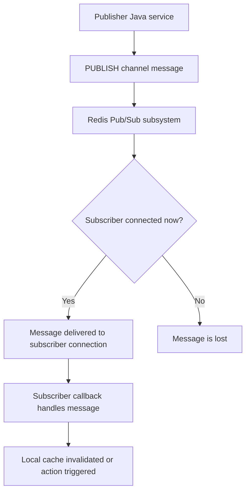
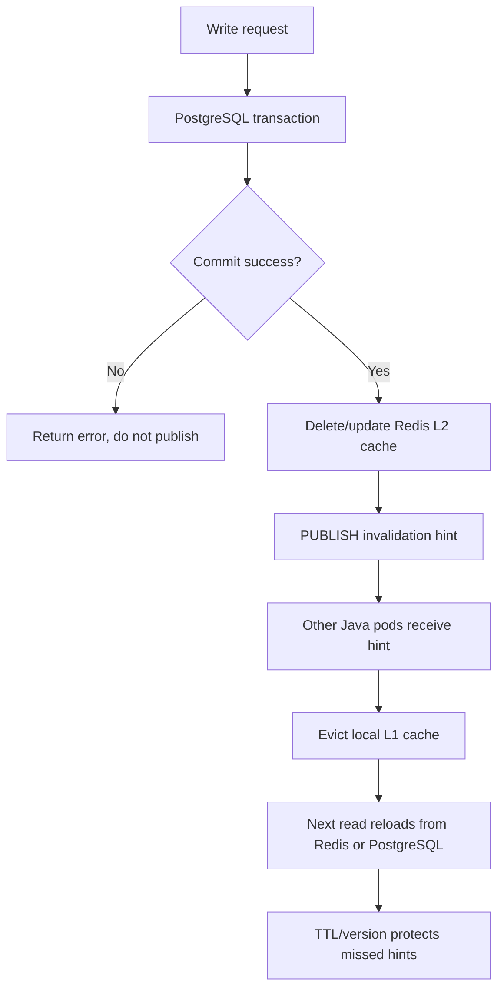

# Part 020 — Redis Pub/Sub

Redis Pub/Sub is a lightweight notification mechanism.

It lets one client publish a message to a channel, and other currently connected clients subscribed to that channel receive it.

The most important production rule is simple:

```text
Redis Pub/Sub is not durable messaging.
```

It has:

- no persistence
- no replay
- no consumer groups
- no acknowledgments
- no broker-side retry
- no offline subscriber catch-up

That makes it useful for live notifications and lightweight coordination signals.

It makes it risky for business-critical events.

---

## 1. Core Mental Model

Redis Pub/Sub is like an in-memory broadcast pipe.

```text
publisher -> Redis channel -> currently connected subscribers
```

If a subscriber is connected and subscribed, it receives the message.

If it is offline, disconnected, restarting, lagging, or not yet subscribed, it misses the message.

There is no stored backlog.

---

## 2. Why Pub/Sub Exists

Pub/Sub exists for low-latency message fan-out where losing a message is acceptable or recoverable.

Examples:

- cache invalidation hints
- local cache clear signals
- dashboard refresh notifications
- lightweight cluster node notifications
- configuration refresh hints
- non-critical UI/backend notifications
- internal ephemeral coordination

It should not be used for:

- order creation events
- payment events
- quote submission events
- audit events
- compliance events
- durable integration events
- workflow state transitions
- job queues requiring retry
- messages requiring replay

For those, use Kafka, RabbitMQ, Redis Streams, a database-backed outbox, or a dedicated workflow engine depending on the requirement.

---

## 3. Basic Commands

### 3.1 PUBLISH

Publish a message to a channel:

```redis
PUBLISH cache:invalidation:quote '{"tenantId":"T-123","quoteId":"Q-456","version":12}'
```

Redis returns the number of clients that received the message at that moment.

Important: that count is not a durability guarantee.

---

### 3.2 SUBSCRIBE

Subscribe to one or more channels:

```redis
SUBSCRIBE cache:invalidation:quote
```

The connection enters subscriber mode and receives messages.

In Java clients, Pub/Sub usually requires a dedicated connection or listener abstraction.

---

### 3.3 PSUBSCRIBE

Pattern subscription:

```redis
PSUBSCRIBE cache:invalidation:*
```

This receives messages from channels matching the pattern.

Pattern subscriptions are convenient, but broad patterns can increase message processing noise and operational ambiguity.

---

### 3.4 UNSUBSCRIBE

Unsubscribe from channels:

```redis
UNSUBSCRIBE cache:invalidation:quote
```

Useful during shutdown or listener lifecycle management.

---

## 4. Message Lifecycle

Pub/Sub lifecycle:



There is no pending state.

There is no retry state.

There is no acknowledgement state.

This is the key difference from Redis Streams, Kafka, and RabbitMQ.

---

## 5. Pub/Sub in Java/JAX-RS Systems

In a Java/JAX-RS service, Pub/Sub usually appears in two roles:

1. **Publisher path** from request/write operation.
2. **Subscriber background listener** for cache invalidation or runtime signal.

Example flow:

```text
PUT /quotes/{id}
  -> update PostgreSQL
  -> commit transaction
  -> delete Redis distributed cache key
  -> publish invalidation signal
  -> other service instances clear local cache
```

The Pub/Sub message is a hint to other instances.

It should not be the only correctness mechanism.

A safe design still needs:

- TTL
- versioned cache entries
- fallback reload
- local cache max age
- observable invalidation lag
- rebuild path

---

## 6. Pub/Sub and Local Cache Invalidation

A common enterprise use case is local + distributed cache coordination.

```text
L1 cache: in-memory cache inside Java pod
L2 cache: Redis distributed cache
Source of truth: PostgreSQL
```

When one pod updates data:

```text
1. Update PostgreSQL
2. Delete/update Redis cache
3. Publish invalidation event
4. Other pods evict their local L1 cache
```

This is useful because local caches do not see Redis key changes automatically.

But Pub/Sub message loss means local caches must not live forever.

Use:

- local cache TTL
- version check
- max stale time
- periodic refresh
- safe fallback reload

---

## 7. Pub/Sub Is Fire-and-Forget

When a publisher sends a message, Redis does not persist the message.

```text
Message exists only at delivery time.
```

If subscriber is offline:

```text
message lost
```

If subscriber restarts:

```text
message lost during restart window
```

If network hiccups:

```text
message may be lost
```

If subscriber callback fails:

```text
Redis does not retry
```

This is acceptable only when the system has another path to recover correctness.

---

## 8. Subscriber Offline Scenario

Consider this sequence:

```text
T1: Pod B subscribes to cache:invalidation:quote
T2: Pod B restarts
T3: Pod A publishes invalidation for quote Q-456
T4: Pod B comes back online
```

Pod B missed the invalidation.

If Pod B has local cache entry Q-456 with no TTL, it may serve stale data indefinitely.

That is a design bug.

Safer local cache design:

```text
Local cache entry has short TTL.
Cache value has version.
Read path can validate/reload.
Distributed Redis cache has TTL.
PostgreSQL remains source of truth.
```

---

## 9. Message Loss Scenario

Message loss can happen because of:

- subscriber disconnect
- subscriber restart
- Redis failover
- network partition
- slow subscriber callback
- client connection reset
- application deployment
- autoscaling
- node drain

Therefore Pub/Sub cannot be used as the sole mechanism for:

- financial correctness
- order state transition
- quote lifecycle transition
- entitlement update correctness
- regulatory audit trail
- durable integration workflow

Use it as a signal, not a record.

---

## 10. Pub/Sub vs Redis Streams

| Dimension | Redis Pub/Sub | Redis Streams |
|---|---|---|
| Delivery | Live only | Stored entries |
| Replay | No | Yes, within retention |
| Consumer group | No | Yes |
| Ack | No | Yes |
| Pending list | No | Yes |
| Retry pattern | App-only | Supported through pending/claim patterns |
| Offline catch-up | No | Yes, if entries retained |
| Good for | Notifications | Lightweight durable queue/event stream |

Use Pub/Sub when message loss is acceptable.

Use Streams when consumers need replay, pending tracking, ack, or retry.

---

## 11. Pub/Sub vs Kafka

Kafka is a durable distributed log.

Redis Pub/Sub is an ephemeral live broadcast.

Kafka is better for:

- business events
- integration events
- replayable event history
- event-driven architecture
- consumer group scaling
- audit-like event retention
- cross-service durable event flow

Redis Pub/Sub is better for:

- low-latency hints
- local cache invalidation signal
- temporary notifications
- simple fan-out inside bounded infrastructure

Do not replace Kafka with Redis Pub/Sub for durable domain events.

---

## 12. Pub/Sub vs RabbitMQ

RabbitMQ is a message broker with queues, routing, acknowledgments, dead-lettering, and retry patterns.

Redis Pub/Sub does not provide those broker semantics.

RabbitMQ is better for:

- work queues
- retryable commands
- consumer acknowledgments
- DLQ routing
- backpressure-aware processing
- task distribution

Redis Pub/Sub is better for:

- broadcast hints
- non-critical event notifications
- simple invalidation signals

Do not use Pub/Sub where RabbitMQ queue semantics are required.

---

## 13. Pub/Sub Channel Design

Channel names should be treated like API contracts.

Good channel name:

```text
cache:invalidation:quote:v1
```

Better with environment/service scoping when needed:

```text
prod:quote-service:cache:invalidation:quote:v1
```

But avoid putting PII in channel names.

Bad:

```text
cache:invalidation:quote:john.doe@example.com
```

Channel naming should define:

- environment
- service/domain
- event category
- entity type
- version
- tenant scoping if required

---

## 14. Message Payload Design

A Pub/Sub message should be small, explicit, and versioned.

Example:

```json
{
  "type": "QUOTE_CACHE_INVALIDATED",
  "version": 1,
  "tenantId": "T-123",
  "quoteId": "Q-456",
  "entityVersion": 12,
  "occurredAt": "2026-07-11T10:15:30Z",
  "sourceService": "quote-service",
  "correlationId": "req-abc-123"
}
```

Avoid large payloads.

Avoid embedding full business objects unless absolutely necessary.

For invalidation, usually send identity + version, not full state.

---

## 15. Versioning and Compatibility

Pub/Sub consumers may be on different versions during rolling deployment.

Therefore messages should be:

- versioned
- backward compatible
- tolerant of unknown fields
- explicit about type
- small and stable

Java payload handling should avoid brittle deserialization.

Bad:

```text
Deserialize directly into a class that changes frequently.
```

Better:

```text
Use stable DTOs or tolerant JSON parsing with version handling.
```

---

## 16. Subscriber Implementation Concerns

A subscriber should not execute heavy work directly on the Pub/Sub callback thread/event loop.

Bad:

```text
onMessage -> call PostgreSQL -> call remote service -> update large cache -> block listener
```

Better:

```text
onMessage -> validate -> enqueue lightweight internal task -> return quickly
```

Risks of heavy callbacks:

- subscriber falls behind
- client timeout
- event loop pressure
- missed reconnect handling
- delayed processing
- message loss during instability

---

## 17. Java Client Connection Model

Redis Pub/Sub often needs a dedicated connection.

Reason:

```text
A subscribed connection is in subscriber mode and cannot be used like a normal command connection.
```

Verify client behavior for:

- Jedis
- Lettuce
- Redisson
- connection pooling
- reconnect behavior
- listener threading
- callback execution model
- shutdown lifecycle

Do not accidentally consume normal Redis command pool connections for long-lived subscription listeners.

---

## 18. Error Handling

Subscriber errors should be contained.

A bad message should not kill the listener permanently.

Recommended behavior:

- log message type/channel/correlation ID
- increment failure metric
- reject malformed payload safely
- avoid infinite retry loop inside callback
- continue listening after handler failure
- expose listener health

For critical events, Pub/Sub is the wrong transport.

Do not compensate for non-durable transport by writing extremely complicated retry logic around Pub/Sub.

Use a durable broker instead.

---

## 19. Pub/Sub During Redis Failover

During Redis failover or reconnect:

- subscriptions may drop temporarily
- messages may be lost
- Java client may resubscribe after reconnect
- publisher may fail or publish to old primary depending on topology/client state
- subscriber may miss invalidation events

This reinforces the design rule:

```text
Pub/Sub must not be the only correctness path.
```

For cache invalidation, combine Pub/Sub with TTL and versioning.

For business events, use Kafka/RabbitMQ/Streams.

---

## 20. Pub/Sub in Redis Cluster

Redis Cluster adds operational considerations.

Pub/Sub behavior depends on Redis version and client support.

Review carefully:

- which node receives subscriptions
- whether sharded Pub/Sub is used
- how client handles cluster topology changes
- whether messages are broadcast across cluster as expected
- whether managed service supports required Pub/Sub behavior

Do not assume standalone Redis Pub/Sub behavior automatically maps to cluster topology.

Internal verification is required.

---

## 21. Kubernetes Deployment Concerns

Kubernetes makes Pub/Sub loss scenarios more common:

- rolling updates restart subscribers
- HPA scales pods up/down
- node drains disconnect listeners
- readiness probes may pass before subscription is active
- network policy changes may break subscriptions
- DNS or service endpoint changes may trigger reconnect

A subscriber pod should expose health that answers:

```text
Is the listener connected and subscribed?
```

Not merely:

```text
Is the HTTP server running?
```

---

## 22. Cloud and On-Prem Considerations

For managed Redis or Redis-compatible services, verify:

- Pub/Sub support
- cluster mode Pub/Sub behavior
- failover behavior
- message size limits or practical limits
- network path latency
- TLS impact
- observability metrics
- client reconnect guidance

For on-prem Redis, verify:

- Sentinel/Cluster behavior
- network segmentation
- firewall timeouts
- TCP keepalive
- client reconnect handling
- monitoring of connected subscribers

---

## 23. Security and Privacy Concerns

Pub/Sub messages may appear in logs, traces, or debugging tools.

Avoid:

- PII in channel names
- secrets in payloads
- tokens in messages
- full customer objects
- sensitive quote/order payloads
- unrestricted subscriber access

Use:

- TLS where required
- Redis ACL restrictions
- network isolation
- sanitized logs
- minimal payloads
- stable identifiers

If the payload is sensitive enough to require audit and access control, Pub/Sub may not be the right transport.

---

## 24. Observability

Pub/Sub observability is weaker than queue observability because there is no backlog.

Track at the application level:

- messages published
- messages received
- handler success/failure
- subscriber connected state
- reconnect count
- resubscribe count
- message processing latency
- malformed message count
- local cache invalidation count
- local cache stale read indicators if available

Redis-side signals:

- connected clients
- client list
- pubsub channel count
- pubsub pattern count
- command stats for PUBLISH/SUBSCRIBE
- client output buffer issues

But remember:

```text
No backlog metric exists because Pub/Sub does not store backlog.
```

---

## 25. Cache Invalidation Pattern

A safer invalidation architecture:



Important details:

- publish after DB commit
- include entity version where possible
- make local cache entries expire
- keep Redis L2 TTL
- make stale window explicit
- monitor invalidation handler failures

---

## 26. Anti-Patterns

Avoid these:

### 26.1 Durable Business Event via Pub/Sub

```text
OrderSubmitted -> Redis Pub/Sub -> billing service
```

This is unsafe because billing can miss the event.

### 26.2 Job Queue via Pub/Sub

```text
PUBLISH job:new payload
```

If worker is offline, the job disappears.

Use RabbitMQ, Kafka, Redis Streams, or DB-backed queue.

### 26.3 Infinite Local Cache with Pub/Sub Invalidation Only

```text
Local cache never expires.
Pub/Sub is the only invalidation mechanism.
```

If one message is missed, stale data can live indefinitely.

### 26.4 Large Payload Broadcast

```text
PUBLISH channel huge JSON object
```

This can cause network amplification, memory pressure, logging risk, and slow subscribers.

### 26.5 Broad Pattern Subscription Without Ownership

```redis
PSUBSCRIBE *
```

This creates noise, security risk, and unclear ownership.

---

## 27. Correctness Concerns

Ask:

```text
Can this message be lost?
If yes, is the system still correct?
If no, why are we using Pub/Sub?
```

Correct Pub/Sub usage assumes message loss is possible.

Design must include:

- TTL
- polling fallback if needed
- versioned state
- rebuild path
- durable source of truth
- eventual refresh

If none of those exist, Pub/Sub is probably being misused.

---

## 28. Concurrency Concerns

Pub/Sub does not serialize business operations.

Multiple messages can arrive:

- close together
- out of expected business order
- during rolling deployment
- while local cache is being read
- while Redis cache is being refreshed

Consumers should be idempotent.

For cache invalidation:

```text
Evicting the same local key twice is fine.
```

For state changes:

```text
Do not apply critical state mutation directly from Pub/Sub without version/source-of-truth validation.
```

---

## 29. Performance Concerns

Pub/Sub is fast, but fan-out can amplify work.

One publish to many subscribers means:

```text
1 message -> N subscriber callbacks
```

Risks:

- too many subscribers
- large messages
- slow callback processing
- reconnect storm
- network amplification
- logging every message at INFO level
- pattern subscriptions receiving too much noise

Keep messages small and handlers lightweight.

---

## 30. Production-Safe Debugging

Useful checks:

```redis
PUBSUB CHANNELS
PUBSUB NUMSUB cache:invalidation:quote
PUBSUB NUMPAT
CLIENT LIST
INFO commandstats
```

Be careful:

```redis
MONITOR
```

`MONITOR` can be dangerous in production because it streams all commands and adds overhead.

Prefer application metrics and logs with correlation IDs.

Debugging steps:

1. Confirm publisher emitted message.
2. Confirm subscriber is connected.
3. Confirm channel name matches exactly.
4. Confirm payload version is supported.
5. Confirm handler did not fail.
6. Confirm local cache actually evicted.
7. Confirm fallback TTL/version protects missed messages.

---

## 31. Java Implementation Sketch

Publisher abstraction:

```java
public interface CacheInvalidationPublisher {
    void quoteChanged(TenantId tenantId, QuoteId quoteId, long version, CorrelationId correlationId);
}
```

Subscriber abstraction:

```java
public interface CacheInvalidationListener {
    void start();
    void stop();
    boolean isSubscribed();
}
```

Handler:

```java
public final class QuoteInvalidationHandler {
    public void handle(QuoteInvalidationMessage message) {
        localQuoteCache.invalidate(message.tenantId(), message.quoteId());
    }
}
```

Keep Redis Pub/Sub details outside JAX-RS resource classes.

---

## 32. PR Review Checklist

When reviewing Redis Pub/Sub usage, ask:

- Is message loss acceptable?
- What happens when subscriber is offline?
- What happens during deployment or pod restart?
- Is this a notification or a durable business event?
- Should this be Kafka, RabbitMQ, or Redis Streams instead?
- Is the channel naming versioned and scoped?
- Is the payload small and backward compatible?
- Are subscriber handlers idempotent?
- Is there local cache TTL or version protection?
- Are publisher and subscriber metrics available?
- Is subscriber health exposed?
- Does the Java client use a dedicated Pub/Sub connection?
- What happens during Redis failover?
- Is sensitive data excluded from channel and payload?

---

## 33. Internal Verification Checklist

Verify in the internal CSG/team context:

- Whether Redis Pub/Sub is used at all.
- Which services publish to Redis channels.
- Which services subscribe to Redis channels.
- Whether Pub/Sub is used for cache invalidation, config refresh, notifications, or business events.
- Whether any Pub/Sub message is treated as durable.
- Whether Kafka/RabbitMQ would be more appropriate for any current Pub/Sub use case.
- Whether channel naming convention is documented.
- Whether payload schema/versioning is documented.
- Whether subscriber reconnect/resubscribe behavior is tested.
- Whether local cache has TTL/version fallback for missed invalidation.
- Whether Pub/Sub metrics exist in Java services.
- Whether Redis failover behavior has been tested.
- Whether Pub/Sub payloads contain PII, secrets, tokens, quote/order sensitive data, or tenant-sensitive information.
- Whether platform/SRE has runbooks for subscriber disconnect or missed invalidation symptoms.

---

## 34. Summary

Redis Pub/Sub is useful when you need low-latency broadcast signals.

It is unsafe when you need durable delivery.

Use it for:

```text
hints, notifications, cache invalidation signals, lightweight coordination
```

Do not use it for:

```text
business-critical events, jobs, audit trails, durable workflows, guaranteed integration
```

The senior-engineer rule is:

```text
Every Redis Pub/Sub design must explicitly answer what happens when the message is lost.
```

If the system remains correct, Pub/Sub may be appropriate.

If the system becomes incorrect, use Redis Streams, Kafka, RabbitMQ, or a database-backed pattern instead.
