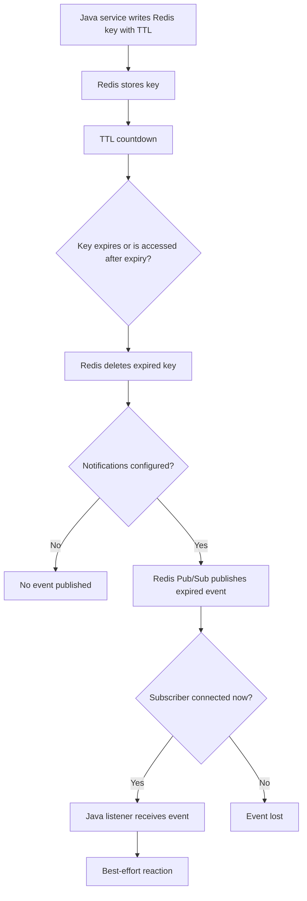
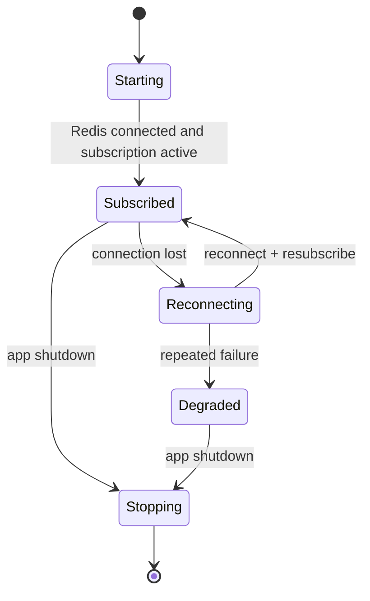

# Part 021 — Redis Keyspace Notification

Redis Keyspace Notification is Redis' mechanism for publishing events when something happens to keys.

Examples:

- a key expires
- a key is evicted
- a key is deleted
- a key is modified by a command
- a list receives a push
- a set receives an add
- a stream receives an entry

The dangerous part is this:

```text
Keyspace notifications are delivered through Redis Pub/Sub.
```

That means they inherit the same fundamental limitation as Pub/Sub:

```text
No durability. No replay. No ack. No offline catch-up.
```

Therefore keyspace notifications are useful for lightweight signals and observability-like behavior.

They are risky as a correctness mechanism.

---

## 1. Core Mental Model

Redis can emit notification messages when keyspace events occur.

There are two perspectives:

```text
Keyspace notification: what happened to this key?
Keyevent notification: which key had this event?
```

Example conceptual model:

```text
SET quote:T1:Q123 payload EX 300
  -> later key expires
  -> Redis publishes an expired event if configured
  -> currently connected subscribers may receive it
```

But Redis does not persist that event.

If your Java service is disconnected when the key expires, the event is gone.

---

## 2. Why This Feature Exists

Keyspace notification exists because sometimes applications want to react to Redis key lifecycle events.

Reasonable use cases:

- lightweight cache coordination
- metrics about expiry/eviction behavior
- local cleanup hints
- best-effort timeout signal
- temporary workflow hints
- diagnostics during controlled investigation
- secondary cleanup for ephemeral state

Risky use cases:

- order workflow transition
- quote state transition
- guaranteed timeout processing
- payment/session/security event that must not be missed
- audit trail
- durable job scheduling
- regulatory evidence
- business-critical retry orchestration

The rule is:

```text
If missing the event breaks correctness, do not rely solely on keyspace notification.
```

---

## 3. Keyspace vs Keyevent Notification

Redis exposes two notification styles.

### 3.1 Keyspace Notification

Keyspace channel tells you what event occurred for a key.

Conceptual channel:

```text
__keyspace@0__:quote:T1:Q123
```

Message:

```text
expired
```

Meaning:

```text
The key quote:T1:Q123 had an expired event.
```

---

### 3.2 Keyevent Notification

Keyevent channel tells you which key had a given event.

Conceptual channel:

```text
__keyevent@0__:expired
```

Message:

```text
quote:T1:Q123
```

Meaning:

```text
A key named quote:T1:Q123 expired.
```

---

## 4. Configuration Requirement

Keyspace notifications are disabled unless configured.

The relevant configuration is commonly:

```redis
CONFIG SET notify-keyspace-events Ex
```

The exact flags depend on which event classes are needed.

Common conceptual flags:

| Flag | Meaning |
|---|---|
| `K` | Keyspace events |
| `E` | Keyevent events |
| `x` | Expired events |
| `e` | Evicted events |
| `g` | Generic commands like DEL |
| `$` | String commands |
| `l` | List commands |
| `s` | Set commands |
| `z` | Sorted set commands |
| `h` | Hash commands |
| `t` | Stream commands |
| `A` | Alias for many event classes except some special cases |

Production warning:

```text
Do not enable broad notification classes casually.
```

More notifications mean more Pub/Sub traffic and more operational noise.

---

## 5. Notification Lifecycle



Important detail:

```text
The event is emitted when Redis deletes or processes the key as expired, not when your application logically expects a timer to fire.
```

---

## 6. Expired Event Caveat

A TTL is not a precise scheduler.

Redis expiration is implemented through:

- passive expiration when a key is accessed
- active expiration cycles that sample keys

Therefore an expired event is not a precise timer callback.

Bad assumption:

```text
Key expires exactly at T+300 seconds and my Java service receives the event immediately.
```

Better assumption:

```text
The key becomes logically expired at T+300 seconds. Redis will delete it eventually, often quickly, but notification timing is not a durable scheduling contract.
```

For exact scheduling, use a proper scheduler, database due-time polling, Kafka/RabbitMQ delayed pattern, or a purpose-built workflow mechanism.

---

## 7. Evicted Event Caveat

Expired is not the same as evicted.

```text
Expired: TTL reached.
Evicted: Redis removed key because memory policy required space.
```

Evicted events usually indicate memory pressure or sizing/policy issues.

If your system relies on a key remaining until TTL, eviction can break assumptions.

Examples:

- idempotency key evicted before retry window ends
- rate limiter key evicted during abuse spike
- session key evicted before session TTL
- lock marker evicted unexpectedly
- cache entry evicted earlier than expected

Eviction should be treated as an operational signal, not a normal business event.

---

## 8. Keyspace Notification Is Not a Queue

Do not treat keyspace notification as a queue.

It has no:

- backlog
- acknowledgement
- retry
- dead-letter queue
- consumer group
- replay
- delivery guarantee

Bad design:

```text
SET job-timeout:{jobId} EX 300
wait for expired event
mark job timed out
```

If the listener is down during expiry, the job timeout is missed.

Safer design:

```text
Store due time in PostgreSQL or Redis sorted set.
Workers poll due items.
Expired event can be only a wake-up hint.
```

---

## 9. Java/JAX-RS Implications

In a Java/JAX-RS application, keyspace notifications are usually consumed by background components, not request handlers.

Typical components:

- application startup listener
- managed background service
- Redis Pub/Sub listener
- local cache invalidation component
- metrics collector
- cleanup coordinator

Do not make a JAX-RS endpoint depend synchronously on a future keyspace notification.

Bad lifecycle:

```text
POST /quote
  -> set temporary Redis key
  -> expect future expired event to complete business workflow
```

Better lifecycle:

```text
POST /quote
  -> persist workflow state in PostgreSQL
  -> use Redis key/notification only as acceleration or hint
  -> background reconciler handles missed events
```

---

## 10. Subscriber Lifecycle in Java

A keyspace notification listener must handle:

- startup ordering
- reconnect
- resubscribe
- shutdown
- listener health
- malformed messages
- Redis failover
- duplicate events
- missed events

Subscriber lifecycle sketch:



A health check should distinguish:

```text
HTTP server is alive
```

from:

```text
Redis notification listener is connected and subscribed
```

---

## 11. Cache Coordination Use Case

A reasonable use case is cache coordination.

Example:

```text
Redis key expires -> Java service receives event -> local cache entry is invalidated
```

But this is only safe if local cache has its own TTL or version checks.

Safe pattern:

```text
L1 local cache TTL <= acceptable stale window
L2 Redis cache TTL exists
PostgreSQL remains source of truth
Keyspace event is only a best-effort hint
```

Unsafe pattern:

```text
L1 local cache has no TTL
keyspace notification is the only invalidation mechanism
```

One missed event can create indefinite stale reads.

---

## 12. Timeout Signal Use Case

Some teams use Redis TTL expiry as a timeout signal.

Example:

```text
payment:attempt:{id}:timeout EX 900
```

Then listen for expiration.

This is dangerous if the timeout is business-critical.

Safer design:

```text
PostgreSQL table stores expires_at.
Background scheduler queries overdue rows.
Redis expiry notification wakes scheduler early.
Scheduler still reconciles missed items.
```

In that design Redis notification improves latency, not correctness.

---

## 13. Idempotency Cleanup Use Case

Keyspace notifications are not needed for normal idempotency cleanup.

If idempotency records have TTL, Redis will clean them up.

Do not add notification consumers unless there is a real secondary cleanup requirement.

Good:

```text
SET idem:{tenant}:{key} payload EX 86400
```

Usually enough.

Suspicious:

```text
On expired event, update critical database state.
```

That suggests Redis expiry is being used as a workflow engine.

---

## 14. Rate Limiter Use Case

Rate limiter keys often expire naturally.

You normally do not need expired events for rate limiter windows.

Good:

```text
INCR rl:{tenant}:{user}:{endpoint}:{window}
EXPIRE rl:{...} 60
```

No listener required.

If you need analytics about limiter expiry, prefer application metrics or sampled keyspace metrics rather than subscribing to all expiry events in production.

---

## 15. PostgreSQL/MyBatis/JDBC Impact

Keyspace notifications should not directly drive irreversible database mutations.

Risky:

```text
Redis expired event -> UPDATE order SET status='EXPIRED'
```

Problems:

- event may be lost
- event may arrive late
- event may be duplicated
- event may race with another transaction
- DB state may have changed
- listener may run on multiple pods

Safer:

```text
Redis expired event -> trigger reconciliation attempt
reconciliation reads PostgreSQL current state
transaction applies change only if state/version still valid
periodic scheduler also checks overdue records
```

The database must remain the authority for durable business state.

---

## 16. Kafka/RabbitMQ Impact

Do not use keyspace notification as a replacement for durable event publishing.

Bad:

```text
Redis key expires -> publish business event to Kafka/RabbitMQ
```

This can be acceptable only if a reconciler can regenerate missed events from a durable source of truth.

Better:

```text
PostgreSQL transaction writes domain state + outbox row
outbox publisher sends Kafka/RabbitMQ event
Redis notification is optional hint only
```

For business workflows, durable event generation should originate from durable state.

---

## 17. Kubernetes Concerns

Kubernetes increases missed notification risk.

Common causes:

- rolling deployment restarts listener pods
- node drain disconnects Redis clients
- HPA scales subscribers down
- readiness passes before subscription is active
- Redis primary failover resets subscriptions
- NetworkPolicy changes block reconnect
- pod CPU throttling delays callbacks

Therefore, keyspace notification consumers must be designed as best-effort.

A missed event during deployment must not corrupt business correctness.

---

## 18. AWS/Azure/Cloud-Managed Redis Concerns

For managed Redis-compatible services, verify:

- whether keyspace notifications are supported
- whether the required configuration can be changed
- whether configuration persists across maintenance/failover
- whether cluster mode changes notification behavior
- whether Pub/Sub is supported as expected
- whether failover drops subscriptions
- whether metrics expose subscriber behavior
- whether ACL allows subscription to internal channels

Do not assume every Redis-compatible service exposes all notification configuration in the same way.

This is an internal verification item.

---

## 19. On-Prem Concerns

For self-managed Redis, verify:

- `notify-keyspace-events` value
- config persistence
- Sentinel/Cluster failover behavior
- TCP keepalive and firewall idle timeout
- listener reconnect behavior
- monitoring of subscriber connections
- operational approval before enabling broad event classes

On-prem deployments often have more responsibility on the application/platform team to define safe defaults.

---

## 20. Security and Privacy Concerns

Keyspace notifications can leak key names to subscribers.

If key names contain sensitive data, notification channels/messages can expose it.

Bad key:

```text
session:john.doe@example.com:token
```

If this expires, a subscriber may see the email in the event message.

Safer key:

```text
session:{tenantId}:{opaqueSessionId}
```

Security controls:

- do not put PII in key names
- restrict Pub/Sub subscription permissions with ACL where applicable
- avoid broad pattern subscriptions
- sanitize logs
- avoid logging raw key names for sensitive keyspaces
- use TLS/network isolation

---

## 21. Observability

Track at the application level:

- listener connected state
- subscription active state
- reconnect count
- resubscribe count
- events received by type
- handler success/failure
- handler latency
- malformed event count
- skipped event count
- reconciliation count
- missed-event compensation count

Redis-side signals:

```redis
CONFIG GET notify-keyspace-events
PUBSUB NUMPAT
PUBSUB CHANNELS
CLIENT LIST
INFO commandstats
INFO keyspace
```

Be careful with broad inspection in production.

Avoid using `MONITOR` casually.

---

## 22. Failure Modes

| Failure mode | Impact | Safer design response |
|---|---|---|
| Listener offline | Event missed | Periodic reconciler |
| Redis failover | Subscription gap | Reconnect/resubscribe + correctness fallback |
| Event arrives late | Timeout/action delayed | DB state/version check |
| Duplicate event | Duplicate handler execution | Idempotent handler |
| Broad config emits too many events | Noise/load | Minimal notification flags |
| PII in key name | Data leak | Opaque identifiers |
| Eviction mistaken as expiry | Wrong business reaction | Separate expired vs evicted handling |
| Local cache only invalidated by event | Stale cache forever | Local TTL/version validation |
| Cluster behavior misunderstood | Missing events | Verify topology/client behavior |

---

## 23. Debugging Keyspace Notification

Production-safe debugging flow:

1. Confirm the feature is enabled.

```redis
CONFIG GET notify-keyspace-events
```

2. Confirm the key has TTL.

```redis
TTL some:key
```

3. Confirm the event type is included in config.

```text
Expired requires x.
Evicted requires e.
Keyevent channel requires E.
Keyspace channel requires K.
```

4. Confirm subscriber connection is active.

```redis
CLIENT LIST
PUBSUB NUMPAT
```

5. Confirm application listener metrics.

```text
connected=true
subscribed=true
events_received increasing
handler_failures not increasing
```

6. Confirm handler behavior.

```text
Was local cache evicted?
Was reconciliation triggered?
Was malformed event rejected?
```

7. Confirm there is a fallback.

```text
If the event was missed, what corrects the system later?
```

---

## 24. Java Implementation Sketch

Keep keyspace notification behind an explicit infrastructure component.

```java
public interface RedisKeyspaceNotificationListener {
    void start();
    void stop();
    boolean isSubscribed();
}
```

Handler should be idempotent:

```java
public final class ExpiredKeyHandler {
    public void onExpired(String key) {
        if (!key.startsWith("quote-cache:")) {
            return;
        }

        // Best-effort local cleanup only.
        localQuoteCache.invalidate(extractQuoteKey(key));
    }
}
```

Avoid heavy operations in the Pub/Sub callback thread.

If work is non-trivial, enqueue internal task and return quickly.

---

## 25. Anti-Patterns

### 25.1 Redis Expiry as Durable Scheduler

```text
SET quote-expiry:{quoteId} EX 3600
on expired event -> expire quote
```

Unsafe because event can be missed.

### 25.2 No Local Cache TTL

```text
Local cache relies only on keyspace notification.
```

Unsafe because missed event means stale data indefinitely.

### 25.3 Broad Global Subscription

```redis
PSUBSCRIBE __keyevent@0__:*
```

May create excessive noise and unclear ownership.

### 25.4 Business Update from Eviction Event

```text
evicted event -> mark process cancelled
```

Eviction means memory pressure, not business intent.

### 25.5 PII in Key Names

```text
user-cache:john.doe@example.com
```

Notification can expose key name.

---

## 26. Correctness Concerns

Ask:

```text
Can the event be missed?
If yes, does the system still converge to correct state?
```

A correct design has at least one durable fallback:

- PostgreSQL state check
- periodic reconciliation
- Redis sorted set polling
- Kafka/RabbitMQ durable event
- database outbox
- TTL/version-based cache refresh

Keyspace notification should accelerate convergence, not define correctness.

---

## 27. Concurrency Concerns

Multiple app instances may receive the same event if they all subscribe.

Handlers must tolerate:

- duplicate processing
- out-of-order observations
- stale local state
- race with a new key of the same logical entity
- rolling deployment version mismatch
- handler running while a request reloads cache

For cache invalidation, duplicate invalidation is acceptable.

For durable mutations, use DB transaction + state/version guard.

---

## 28. Performance Concerns

Keyspace notifications add Pub/Sub traffic.

High churn keyspaces can generate high notification volume.

Risky keyspaces:

- rate limiter keys
- per-request idempotency keys
- short TTL cache keys
- session/token keys
- high-cardinality temporary keys

Avoid enabling event classes that produce massive noise unless there is a clear operational reason.

---

## 29. PR Review Checklist

When reviewing keyspace notification usage, ask:

- Is keyspace notification enabled deliberately?
- Which exact event classes are enabled?
- Is this keyspace or keyevent notification?
- Is the event used as a hint or as correctness logic?
- What happens if the event is missed?
- What happens during subscriber restart?
- What happens during Redis failover?
- Is there a durable reconciliation path?
- Are handlers idempotent?
- Are key names free of PII/secrets?
- Is the listener health observable?
- Is callback processing lightweight?
- Are broad subscriptions avoided?
- Is this better implemented with Streams, Kafka, RabbitMQ, PostgreSQL, or a scheduler?

---

## 30. Internal Verification Checklist

Verify in the internal CSG/team context:

- Whether Redis keyspace notifications are enabled anywhere.
- The exact `notify-keyspace-events` configuration per environment.
- Whether configuration differs between local, dev, test, staging, production, AWS, Azure, on-prem, or Kubernetes.
- Which services subscribe to keyspace/keyevent channels.
- Whether listeners are used for cache cleanup, timeout handling, workflow actions, metrics, or security state.
- Whether any listener performs durable business mutation.
- Whether missed events are handled by reconciliation.
- Whether listener reconnect/resubscribe is tested.
- Whether key names contain tenant-sensitive, customer-sensitive, PII, token, or secret material.
- Whether subscriber health and handler failure metrics exist.
- Whether Redis failover behavior has been tested.
- Whether broad event classes create unnecessary traffic.
- Whether platform/SRE approves the notification configuration.
- Whether security team approves access to notification channels.

---

## 31. Summary

Redis keyspace notification is useful for observing and reacting to Redis key lifecycle events.

But it is not a durable event system.

Use it for:

```text
best-effort hints, local cleanup, cache coordination, diagnostics, lightweight signals
```

Do not use it as the only mechanism for:

```text
business workflow, durable scheduling, audit, security-critical mutation, guaranteed timeout processing
```

The senior-engineer rule:

```text
Keyspace notification may wake up a correct system.
It must not be the only reason the system becomes correct.
```
