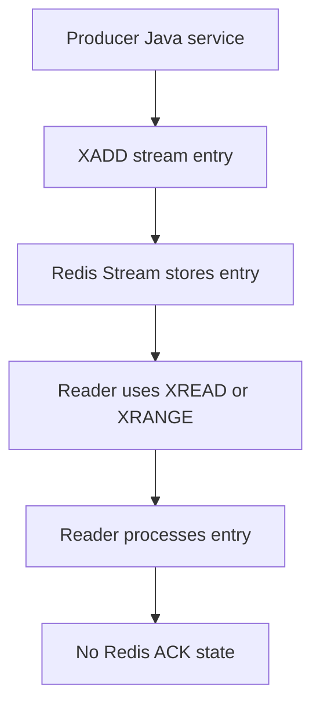
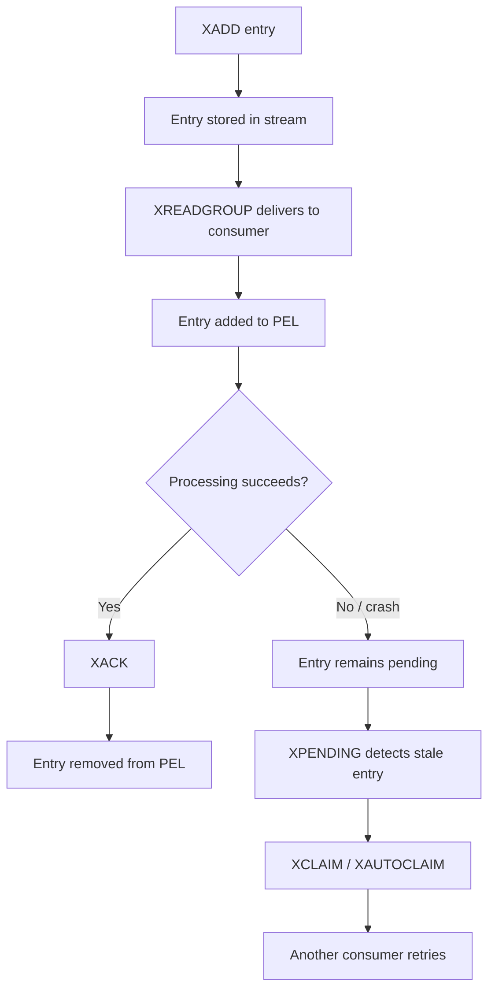

# Part 022 — Redis Streams Foundation

Redis Streams is Redis' append-only, log-like data structure for storing ordered entries.

It gives Redis a lightweight event-stream and queue-like primitive.

Compared with Pub/Sub, Streams can retain messages.

Compared with Lists, Streams have IDs, consumer groups, pending entries, acknowledgment, and replay-like behavior.

Compared with Kafka, Streams are simpler and Redis-native, but they are not a full Kafka replacement.

The practical mental model:

```text
Redis Stream = retained ordered entries + optional consumer group coordination
```

---

## 1. Why Redis Streams Exist

Redis Streams exist for use cases that need more than Pub/Sub but less than a full distributed log platform.

Good use cases:

- lightweight durable queue
- event log-lite inside a bounded service area
- async task dispatch
- worker coordination
- retryable background processing
- local projection pipeline
- small-scale event replay
- integration glue where Kafka/RabbitMQ would be excessive

Risky use cases:

- enterprise-wide event backbone
- long-term audit log
- regulatory event retention
- high-throughput multi-team event platform
- unbounded event history
- exactly-once business processing
- cross-region event streaming without careful design

Redis Streams improves reliability over Pub/Sub.

It does not remove distributed systems failure modes.

---

## 2. Core Concepts

| Concept | Meaning |
|---|---|
| Stream key | Redis key that stores ordered stream entries |
| Entry | One record in the stream |
| Stream ID | Unique ID ordered by time/sequence |
| Field-value pairs | Payload stored as field/value entries |
| Consumer group | Group of consumers that divide work |
| Consumer | Named worker inside a group |
| Pending Entry List | Entries delivered but not yet acknowledged |
| ACK | Consumer confirms processing completed |
| Claim | Another consumer takes stale pending work |
| Trim | Remove old stream entries |

---

## 3. Stream Entry Mental Model

A stream entry is not just a string payload.

It is a set of field-value pairs associated with an ID.

Example:

```redis
XADD quote-events * type QuoteUpdated tenantId T-123 quoteId Q-456 version 12 correlationId req-abc
```

Redis returns a stream ID like:

```text
1720700000000-0
```

The first part is time-like.

The second part is a sequence number.

Do not treat stream IDs as business timestamps without understanding clock/topology behavior.

---

## 4. Stream ID

A stream ID is ordered.

Common forms:

```text
*                 Redis auto-generates ID
1720700000000-0   explicit ID
0-0               beginning of stream
$                 latest entry at the time of read
>                 new messages for consumer group
```

Important semantics:

- `0-0` means read from the beginning.
- `$` means read only future messages in some read contexts.
- `>` in consumer groups means messages never delivered to any consumer in that group.

Misunderstanding these markers causes skipped messages or accidental reprocessing.

---

## 5. Basic Producer Command: XADD

Append an entry:

```redis
XADD quote-events * type QuoteSubmitted tenantId T-123 quoteId Q-456 version 1
```

Append with approximate trimming:

```redis
XADD quote-events MAXLEN ~ 100000 * type QuoteUpdated tenantId T-123 quoteId Q-456 version 2
```

Notes:

- `*` lets Redis generate ID.
- Field-value payload should be small.
- Trimming must align with replay/retry requirements.
- Stream key naming must follow key ownership convention.

---

## 6. Basic Read: XREAD

Read entries without consumer group:

```redis
XREAD COUNT 10 STREAMS quote-events 0-0
```

Blocking read:

```redis
XREAD BLOCK 5000 COUNT 10 STREAMS quote-events $
```

`XREAD` is useful for simple readers.

But for worker groups with acknowledgement and retry, use consumer groups.

---

## 7. Range Read: XRANGE

Read entries by ID range:

```redis
XRANGE quote-events - + COUNT 10
```

Read after a known ID:

```redis
XRANGE quote-events 1720700000000-0 + COUNT 100
```

This is useful for:

- debugging
- replay
- inspection
- backfill
- deterministic tests

Production caution:

```text
Do not run unbounded XRANGE on large streams in production.
```

Always use ranges and COUNT.

---

## 8. Stream Lifecycle Without Consumer Group



Without consumer groups, Redis does not track whether each reader processed each message.

The reader must track its own offset if needed.

---

## 9. Consumer Group Mental Model

A consumer group lets multiple consumers share work.

```text
stream: quote-events
consumer group: quote-projector
consumers: pod-a, pod-b, pod-c
```

Each new entry is delivered to one consumer in the group.

The group tracks:

- last delivered ID
- which entries are pending
- which consumer owns each pending entry
- delivery count

This makes Redis Streams suitable for queue-like worker processing.

---

## 10. Create Consumer Group: XGROUP

Create a group from the beginning:

```redis
XGROUP CREATE quote-events quote-projector 0-0 MKSTREAM
```

Create a group from latest:

```redis
XGROUP CREATE quote-events quote-projector $ MKSTREAM
```

Meaning:

- `0-0`: group can consume existing history.
- `$`: group only consumes entries added after group creation.
- `MKSTREAM`: create stream key if it does not exist.

Be deliberate.

Creating a group at `$` can skip existing entries.

---

## 11. Read with Consumer Group: XREADGROUP

Read new messages for a consumer:

```redis
XREADGROUP GROUP quote-projector pod-a COUNT 10 BLOCK 5000 STREAMS quote-events >
```

The `>` means:

```text
Give this consumer new entries never delivered to any consumer in this group.
```

After delivery, entries are added to the group's Pending Entry List until acknowledged.

---

## 12. Acknowledge Processing: XACK

When processing succeeds:

```redis
XACK quote-events quote-projector 1720700000000-0
```

ACK means:

```text
This consumer group no longer considers the entry pending.
```

It does not necessarily delete the entry from the stream.

Retention/trimming is separate.

This distinction is critical.

---

## 13. Pending Entry List

The Pending Entry List, or PEL, tracks delivered but unacknowledged entries.

An entry becomes pending when:

```text
XREADGROUP delivers it to a consumer
```

It leaves pending when:

```text
XACK succeeds
```

Pending entries matter because workers can crash after receiving a message but before processing or ACK.

Without PEL, the system would not know which messages were in-flight.

---

## 14. Inspect Pending: XPENDING

Summary:

```redis
XPENDING quote-events quote-projector
```

Detailed view:

```redis
XPENDING quote-events quote-projector - + 10
```

Useful signals:

- number of pending messages
- oldest pending ID
- consumers with pending entries
- idle time
- delivery count

A growing PEL usually indicates:

- worker failures
- slow processing
- missing ACK
- poison messages
- downstream dependency outage
- worker deployment issue

---

## 15. Claim Stale Pending: XCLAIM and XAUTOCLAIM

If a consumer dies, its pending entries may remain pending.

Another consumer can claim them after idle timeout.

Conceptual flow:

```text
pod-a receives entry
pod-a crashes before XACK
entry remains pending under pod-a
pod-b claims stale entry
pod-b processes and ACKs
```

Commands:

```redis
XCLAIM quote-events quote-projector pod-b 60000 1720700000000-0
```

or:

```redis
XAUTOCLAIM quote-events quote-projector pod-b 60000 0-0 COUNT 100
```

Claiming is the foundation of retry behavior in Redis Streams.

---

## 16. Consumer Group Lifecycle



This is the key lifecycle to understand before using Streams for jobs.

---

## 17. Stream Retention and Trimming

Streams grow unless trimmed or deleted.

Common trimming mechanisms:

```redis
XTRIM quote-events MAXLEN ~ 100000
```

or during append:

```redis
XADD quote-events MAXLEN ~ 100000 * type Event
```

Retention must answer:

- how long replay is needed
- how much memory is acceptable
- whether pending entries can be trimmed accidentally
- whether consumers may lag longer than retention
- whether audit requires durable external storage

Do not treat stream retention as infinite.

---

## 18. Stream vs List

| Dimension | Redis List | Redis Stream |
|---|---|---|
| Append | LPUSH/RPUSH | XADD |
| Blocking read | BLPOP/BRPOP | XREAD BLOCK |
| Consumer group | No native group | Yes |
| Pending tracking | Manual pattern | Built in |
| Ack | Manual pattern | XACK |
| Retry | Manual | PEL + claim |
| Replay | Limited/manual | Range by ID while retained |
| Payload | Single value | Field-value entry |
| Operational visibility | Lower | Better |

Use Lists for very simple queues.

Use Streams when you need consumer groups, pending visibility, retry, or replay within retention.

---

## 19. Stream vs Pub/Sub

| Dimension | Pub/Sub | Stream |
|---|---|---|
| Message retention | No | Yes |
| Offline consumer catch-up | No | Yes, if retained |
| Ack | No | Yes with consumer groups |
| Retry | No | PEL + claim pattern |
| Replay | No | Yes by range/ID |
| Best for | Live hints | Queue/event-stream-lite |

If message loss is acceptable, Pub/Sub may be simpler.

If consumers must catch up, use Streams or a durable broker.

---

## 20. Stream vs Kafka

Redis Streams and Kafka overlap conceptually, but they are not equivalent.

Kafka is designed as a distributed durable log platform.

Redis Streams is a Redis data structure with stream semantics.

Kafka is usually better for:

- enterprise event backbone
- long retention
- high-throughput event ingestion
- multi-service event replay
- partitioned event processing at scale
- durable integration contracts
- schema governance

Redis Streams can be useful for:

- service-local queues
- lightweight worker pipelines
- bounded event processing
- short-retention replay
- operationally simple async processing

For CSG-like enterprise systems, verify whether a use case belongs in Redis Streams, Kafka, RabbitMQ, or PostgreSQL/outbox.

---

## 21. Stream vs RabbitMQ

RabbitMQ is a broker focused on queues, routing, acknowledgments, redelivery, exchanges, and DLQ patterns.

Redis Streams offers queue-like behavior but not the same routing model.

RabbitMQ is often better for:

- command queues
- routing keys/exchanges
- DLQ routing
- mature retry topology
- backpressure-oriented task processing
- integration with existing broker operations

Redis Streams may be better for:

- simple worker groups
- Redis-native queue needs
- lightweight persistent event stream
- cases where Redis is already operationally accepted

Do not choose Streams just because Redis is available.

Choose it because its semantics match the requirement.

---

## 22. Java/JAX-RS Producer Flow

A JAX-RS request might publish to a stream after a durable state change.

Example:

```text
POST /quotes/{id}/submit
  -> validate request
  -> update PostgreSQL transaction
  -> commit
  -> XADD quote-events QuoteSubmitted
  -> return response
```

Risk:

```text
DB commit succeeds but XADD fails.
```

If the stream event is business-critical, this pattern is incomplete.

Safer enterprise pattern:

```text
DB transaction writes quote state + outbox row
outbox publisher sends Kafka/RabbitMQ or XADD to Redis Stream
publisher retries from durable outbox
```

Redis Streams can be part of the pipeline, but durable state transition should be anchored in PostgreSQL if correctness matters.

---

## 23. Java Worker Flow

Consumer group worker lifecycle:

```text
start pod
  -> create group if needed or verify it exists
  -> XREADGROUP BLOCK COUNT
  -> process entry
  -> write/update downstream state
  -> XACK only after success
  -> repeat
```

Important:

```text
ACK after successful processing, not before.
```

If you ACK before processing and then crash, Redis considers the message complete.

If you process before ACK and crash, the message remains pending and can be retried.

That means handlers must be idempotent.

---

## 24. Idempotency Requirement

Redis Streams provide at-least-once style processing when using consumer groups and retries.

That implies duplicates can happen.

Duplicate causes:

- worker processes message then crashes before ACK
- message is claimed and processed again
- producer retries XADD without idempotent event ID
- downstream timeout creates ambiguity
- deployment restarts worker during processing

Therefore stream consumers should be idempotent.

Use:

- event ID tracking
- business idempotency key
- database unique constraint
- version check
- processed-event table
- Redis idempotency marker with careful TTL

---

## 25. PostgreSQL/MyBatis/JDBC Impact

When a stream consumer writes to PostgreSQL, handle duplicate and out-of-order processing.

Bad:

```text
on stream event -> blindly update row
```

Better:

```text
on stream event -> transaction checks current state/version -> apply only if valid -> record processed event -> commit -> XACK
```

With MyBatis/JDBC, pay attention to:

- transaction boundary
- unique constraints
- optimistic version fields
- retry on transient DB errors
- ACK only after commit
- no ACK if transaction fails
- poison message strategy

---

## 26. Kafka/RabbitMQ Integration Impact

Redis Streams can interact with Kafka/RabbitMQ in several ways:

```text
Kafka/RabbitMQ -> consumer -> Redis Stream
Redis Stream -> worker -> Kafka/RabbitMQ
Redis Stream -> cache projection
Redis Stream -> local async queue
```

Each bridge needs idempotency.

Failure windows:

- consumed broker message but failed XADD
- XADD succeeded but broker ACK failed
- stream processed but Kafka publish failed
- RabbitMQ publish succeeded but XACK failed

For critical integration, use durable outbox/inbox patterns rather than ad-hoc bridging.

---

## 27. Kubernetes Concerns

Streams are commonly consumed by pods.

Kubernetes affects consumer identity and pending behavior.

Important concerns:

- consumer name should be stable enough for debugging
- pod restarts leave pending entries
- rolling deployment can increase claim activity
- HPA changes consumer count
- CPU throttling can increase processing latency
- readiness should not start traffic before worker is initialized if worker is critical
- graceful shutdown should stop polling and finish/ACK in-flight work when possible

Consumer naming example:

```text
quote-projector:{podName}
```

Do not use a completely random name on every reconnect unless you have cleanup logic for stale consumers.

---

## 28. Cloud and On-Prem Considerations

For managed Redis-compatible services, verify:

- Streams support
- consumer group support
- command restrictions
- maxmemory and eviction policy
- persistence configuration
- backup/restore behavior
- failover behavior
- cluster mode behavior
- monitoring for stream length and pending entries
- client compatibility

For on-prem Redis, verify:

- persistence and data loss tolerance
- Redis version compatibility
- memory sizing
- backup/restore
- failover testing
- operational ownership

Streams are only as reliable as the Redis deployment behind them.

---

## 29. Security and Privacy Concerns

Stream entries may contain business identifiers or payloads.

Avoid storing:

- secrets
- raw tokens
- unnecessary PII
- full customer objects
- large quote/order payloads
- credentials
- payment-sensitive data

Prefer minimal payloads:

```json
{
  "type": "QuoteSubmitted",
  "tenantId": "T-123",
  "quoteId": "Q-456",
  "version": "12",
  "correlationId": "req-abc"
}
```

Then reload authoritative details from PostgreSQL if needed.

Apply:

- ACL restrictions
- TLS/network isolation
- log redaction
- retention limits
- key naming without PII

---

## 30. Observability

Important stream metrics:

- stream length
- entries added per second
- consumer group lag
- pending entries count
- oldest pending idle time
- delivery count distribution
- claim/reclaim count
- XACK rate
- handler success/failure
- processing latency
- poison message count
- trim count
- Redis memory usage
- slowlog for stream commands

Application metrics are essential because Redis does not know whether business processing succeeded beyond XACK.

---

## 31. Failure Modes

| Failure mode | Symptom | Design response |
|---|---|---|
| Worker crashes before ACK | Pending entry grows | Claim/retry |
| Worker ACKs before processing | Message lost logically | ACK only after success |
| Poison message | Same entry retried repeatedly | DLQ-like stream or quarantine |
| Stream grows unbounded | Redis memory pressure | Retention/trimming |
| Consumer group created at `$` accidentally | Existing events skipped | Deliberate group creation policy |
| Pending entries trimmed | Retry impossible | Align trimming with pending/retry requirements |
| Duplicate processing | Duplicate DB updates | Idempotent consumer |
| Redis failover loses recent data | Missing entries | Persistence/outbox if critical |
| Slow consumer | Lag/pending growth | Scale workers/backpressure |
| Large payload | Memory/network pressure | Store identifiers, not full objects |

---

## 32. Production-Safe Debugging

Useful commands:

```redis
XLEN quote-events
XINFO STREAM quote-events
XINFO GROUPS quote-events
XINFO CONSUMERS quote-events quote-projector
XPENDING quote-events quote-projector
XRANGE quote-events - + COUNT 10
```

For a stuck consumer group:

1. Check stream length.
2. Check group lag.
3. Check pending count.
4. Check oldest pending idle time.
5. Check consumer last seen.
6. Check application logs for handler failures.
7. Check downstream DB/broker latency.
8. Check whether messages are poison messages.
9. Claim stale pending entries if safe.
10. Do not trim before understanding pending/replay requirements.

---

## 33. Common Anti-Patterns

### 33.1 ACK Before Processing

```text
XACK -> process business operation
```

Crash after ACK means Redis will not retry.

### 33.2 No Idempotency

```text
process event -> insert/update without duplicate guard
```

At-least-once processing means duplicates will happen.

### 33.3 Infinite Stream Retention

```text
Never trim stream.
```

Memory will grow until Redis becomes unstable.

### 33.4 Trimming Too Aggressively

```text
Trim stream while consumers still need replay/retry.
```

Can destroy operational recovery.

### 33.5 Treating Streams as Kafka Without Kafka Discipline

```text
Use Redis Streams as enterprise event backbone with no schema governance, retention policy, or replay plan.
```

This becomes architecture debt quickly.

---

## 34. Data Structure Selection Checklist

Use Redis Streams when you need:

- retained entries
- consumer groups
- pending tracking
- ACK
- retry/claim behavior
- short-to-medium retention
- lightweight worker coordination

Prefer Pub/Sub when:

- message loss is acceptable
- no replay is needed
- only live notification is required

Prefer RabbitMQ when:

- queue semantics, routing, DLQ, and broker-managed retry are core requirements

Prefer Kafka when:

- durable event log, replay, long retention, and event platform governance are required

Prefer PostgreSQL/outbox when:

- event correctness must be tied to database transaction state

---

## 35. PR Review Checklist

When reviewing Redis Streams usage, ask:

- Why Streams instead of Pub/Sub, Lists, RabbitMQ, Kafka, or PostgreSQL?
- Is the stream key naming documented?
- Is payload small, versioned, and free of secrets/PII?
- Is the consumer group creation strategy explicit?
- Is the group created at `0-0` or `$`, and why?
- Are messages ACKed only after successful processing?
- Are consumers idempotent?
- What handles pending entries?
- What handles poison messages?
- What is the retention/trimming policy?
- Can trimming remove needed pending/replay entries?
- Are stream metrics and alerts available?
- What happens during Redis failover?
- What happens during pod restart or rolling deployment?
- Is PostgreSQL transaction boundary respected?
- Is Kafka/RabbitMQ bridge idempotent if present?

---

## 36. Internal Verification Checklist

Verify in the internal CSG/team context:

- Whether Redis Streams are used anywhere.
- Which stream keys exist and who owns them.
- Which Java services produce entries.
- Which Java services consume entries.
- Which consumer groups exist per stream.
- Whether group creation is managed by code, migration, runbook, or platform automation.
- Whether payload schema/versioning is documented.
- Whether stream entries contain PII, secrets, token data, quote/order sensitive data, or tenant-sensitive data.
- Whether consumers ACK after processing and after DB commit.
- Whether consumers are idempotent.
- Whether pending entries are monitored.
- Whether stale pending entries are claimed.
- Whether poison message/DLQ-like strategy exists.
- Whether trimming/retention is configured.
- Whether Redis persistence is sufficient for the stream use case.
- Whether Kafka/RabbitMQ would be more appropriate for durable integration.
- Whether platform/SRE dashboards include stream length, pending, lag, and consumer health.
- Whether failover and worker crash behavior have been tested.

---

## 37. Summary

Redis Streams provides a retained, ordered, Redis-native stream structure with consumer group support.

It is stronger than Pub/Sub for processing because messages can be retained and acknowledged.

It is stronger than Lists for worker coordination because pending entries and consumer groups are built in.

But it is not automatically a replacement for Kafka, RabbitMQ, PostgreSQL outbox, or a workflow engine.

The senior-engineer rule:

```text
Redis Streams can coordinate at-least-once processing inside a bounded system.
Correctness still depends on idempotent consumers, retention discipline, persistence assumptions, and operational monitoring.
```
