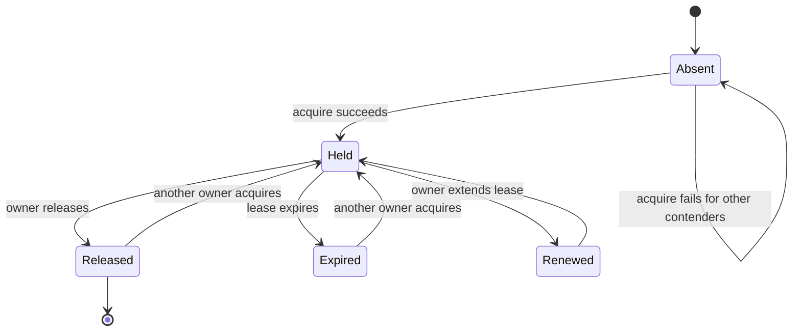
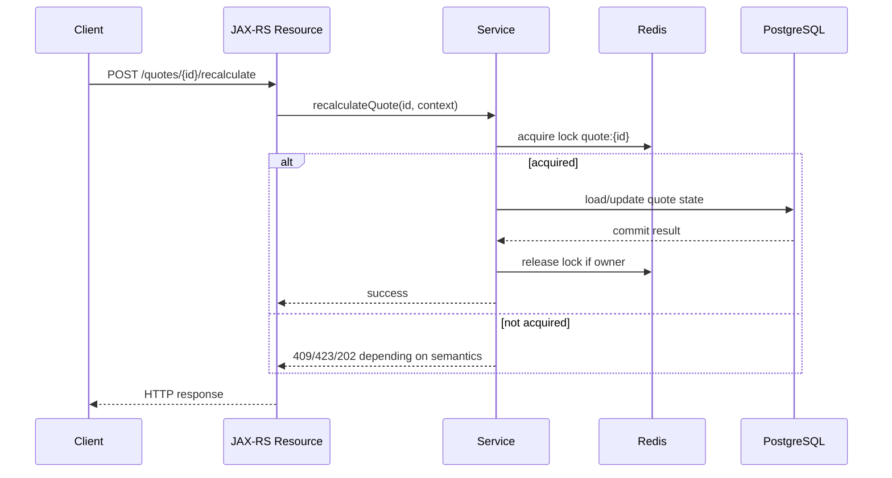

# Part 029 — Distributed Locking Foundation

Distributed locking is one of the most misunderstood Redis use cases.

A lock feels simple:

```text
Only one worker should do this at a time.
```

In a distributed system, that sentence hides many hard questions:

```text
Who owns the lock?
How long is the lock valid?
What if the owner pauses?
What if the owner loses network access?
What if Redis fails over?
What if the protected resource accepts stale writes?
```

This part focuses on the mental model before implementation.

Part 030 will cover Redis-specific locking commands and scripts.

---

## 1. What a Distributed Lock Is

A distributed lock is a coordination primitive used by multiple processes to reduce concurrent access to a shared resource.

It is usually used when processes are distributed across:

- multiple JVMs
- multiple Kubernetes pods
- multiple service instances
- multiple worker nodes
- multiple schedulers
- multiple deployment zones

A lock attempts to enforce:

```text
Only one actor enters the critical section at a time.
```

But in real distributed systems, a Redis-backed lock is usually a **lease**, not an absolute guarantee.

A lease means:

```text
You may act as owner only until this expiry time, assuming your view is still valid.
```

That assumption matters.

---

## 2. Lock vs Lease

A local Java lock such as `synchronized` or `ReentrantLock` is process-local.

A distributed lock is different.

| Concept | Local lock | Distributed lease |
|---|---|---|
| Scope | one JVM | many processes/nodes |
| Failure model | thread crash/process crash | network split, Redis failover, GC pause, scheduler pause |
| Ownership | memory reference/thread | token stored in external system |
| Expiry | usually none | required |
| Safety | strong inside one JVM | bounded by lease design |
| Release | deterministic if code runs | may not run after crash |

A Redis lock must have expiry because the owner can die before releasing it.

No expiry means a crashed process can block the system indefinitely.

Expiry creates another problem:

```text
The lock may expire while the original owner is still executing.
```

That is the central tension of distributed locking.

---

## 3. The Minimal Lock Lifecycle

A distributed lock lifecycle usually has these states:



The important transitions are:

- acquire
- hold
- renew if needed
- release
- expire
- reacquire by another process

Every transition has failure modes.

---

## 4. The Critical Section

The critical section is the code protected by the lock.

Examples:

```text
recalculate shared quote pricing cache
run one scheduled reconciliation job
claim a tenant-wide background task
refresh a global catalog projection
perform one-time migration step
prevent duplicate expensive reload
```

A critical section should be:

- short
- bounded
- idempotent where possible
- observable
- safe if retried
- safe if interrupted
- safe if executed twice by mistake

A dangerous critical section is:

```text
acquire lock
call external API for 45 seconds
update database
publish Kafka event
release lock
```

That is dangerous because lock expiry, network latency, external API slowness, and database transaction timing can all exceed the lease assumptions.

---

## 5. Lock Owner

A distributed lock needs an owner identity.

Owner identity should be unique per lock attempt, not just per service.

Weak owner value:

```text
quote-service
```

Better owner value:

```text
quote-service:pod-7f8c9d:thread-42:01J0Z9ZV2R8K6A7QW4N
```

The owner value is used to prevent this bug:

```text
1. A acquires lock.
2. A pauses.
3. Lock expires.
4. B acquires lock.
5. A resumes.
6. A deletes lock.
7. B's valid lock is accidentally removed.
```

Safe release must verify ownership.

---

## 6. Lock Value

The lock value is the owner token stored in the lock key.

A lock value should be:

- unique
- random or monotonic enough to avoid collisions
- tied to one acquire attempt
- logged carefully without leaking sensitive data
- checked during release
- checked during renewal

Do not use a constant value.

Do not use only tenant ID, user ID, or hostname.

Do not rely on JVM memory identity because the lock state lives outside the JVM.

---

## 7. Lock Expiry

Expiry prevents permanent lock leaks.

But expiry is also where correctness can fail.

A lock expiry must be longer than the expected critical section duration, but short enough to recover after crash.

Example:

```text
expected operation: 500 ms
p99 operation: 2 s
p99.9 operation: 5 s
worst expected GC/network pause: unknown
candidate lease: 10 s
```

This is not enough if the operation can sometimes take 60 seconds during database slowness.

Lock expiry must be tied to real latency distributions, not intuition.

---

## 8. Lock Renewal

Renewal extends the lease while the owner is still working.

Renewal is useful for long-running tasks.

It is also risky.

If renewal is too aggressive, a stuck process can hold a lock for too long.

If renewal is delayed by GC pause, CPU throttling, or network issue, the lock can expire anyway.

A renewal loop should have:

- maximum total lease duration
- heartbeat interval
- ownership check
- cancellation on task finish
- clear behavior when renewal fails
- metrics for renewal success/failure

A lock that renews forever can become an availability incident.

---

## 9. Fencing Token

A fencing token is a monotonically increasing value issued when a lock is acquired.

Example:

```text
A acquires lock with fencing token 41
A pauses
lock expires
B acquires lock with fencing token 42
B writes with token 42
A resumes and tries to write with token 41
protected resource rejects token 41
```

The resource being protected must enforce the token.

A fencing token is useful when the critical section writes to:

- PostgreSQL
- a file/object store
- an external system
- another service
- a shared projection
- a scheduler ownership table

Without fencing, a stale owner may still corrupt the protected resource after its lease expires.

---

## 10. Why Fencing Matters

A lease can expire without the owner knowing.

Common causes:

- JVM stop-the-world GC pause
- container CPU throttling
- node freeze
- network partition
- Redis failover
- long database lock wait
- blocking external call
- overloaded thread pool
- OS scheduling delay

From the original owner perspective:

```text
I still have code running.
```

From Redis perspective:

```text
Your lease expired.
Someone else can acquire.
```

Both can be true.

Fencing makes the downstream resource decide which actor is current.

---

## 11. Distributed Lock Correctness Boundary

A Redis lock alone protects access to a Redis key.

It does not automatically protect:

- PostgreSQL rows
- Kafka partitions
- RabbitMQ messages
- external REST APIs
- filesystem state
- object storage
- third-party APIs
- in-memory state in another JVM

To protect a non-Redis resource, that resource must participate in the protocol.

For PostgreSQL, that can mean:

- unique constraint
- version column
- optimistic locking
- advisory lock
- state transition guard
- fencing token column
- compare-and-set update

Example:

```sql
UPDATE job_execution
SET status = 'COMPLETED', fencing_token = :token
WHERE job_id = :jobId
  AND fencing_token < :token;
```

The database rejects stale owners.

Redis cannot do that on behalf of PostgreSQL unless the write path checks the token.

---

## 12. Mutual Exclusion vs Duplicate Suppression

Many systems use locks when they actually need duplicate suppression.

Duplicate suppression asks:

```text
Have we already processed this logical operation?
```

Distributed locking asks:

```text
Can only one actor enter this critical section right now?
```

Examples:

| Problem | Better primitive |
|---|---|
| user retries same submit | idempotency key |
| duplicate Kafka event | event dedupe store |
| only one scheduler instance should run | leader lease or DB guard |
| only one cache reload per key | single-flight/cache lock |
| prevent two updates to same DB row | DB transaction/optimistic lock |
| prevent concurrent quota decrement | atomic DB/Redis script |

Do not reach for distributed lock first.

It is often a sign that ownership, idempotency, or database constraints are underdesigned.

---

## 13. When a Distributed Lock Is Reasonable

A Redis-based lock can be reasonable when:

- the protected operation is short
- duplicate execution is tolerable or guarded
- the lock is an optimization, not the only correctness boundary
- recovery after crash is more important than perfect exclusion
- failure behavior is explicit
- lock expiry is based on measured latency
- there is observability for acquire/hold/release/expiry
- tests cover concurrent contenders

Good use cases:

- cache stampede protection
- single-flight reload
- best-effort scheduler leadership
- worker coordination for non-critical tasks
- tenant-level throttling
- short maintenance flag transition
- preventing duplicate expensive computation

---

## 14. When Not to Use a Distributed Lock

Avoid Redis distributed locks when:

- money movement correctness depends only on the lock
- legal/regulatory state transition correctness depends only on the lock
- external side effect cannot tolerate duplicate execution
- operation duration is unbounded
- lock expiry cannot be chosen safely
- stale owners cannot be detected
- no fencing token can be enforced
- Redis failover semantics are not understood
- business state already lives in PostgreSQL and DB constraints can solve it
- Kafka/RabbitMQ message ordering/partitioning can solve it better

A weak lock is worse than no lock because it gives false confidence.

---

## 15. Java/JAX-RS Request Flow With Lock

A JAX-RS request using a lock might look like:



The HTTP response must match the business semantics.

Possible responses:

| Scenario | Possible response |
|---|---|
| operation already running | `202 Accepted` with polling link |
| conflicting operation | `409 Conflict` |
| resource temporarily locked | `423 Locked` if API standard allows |
| best-effort reload skipped | `200 OK` with stale/previous value |
| rate-style protection | `429 Too Many Requests` |

Do not return random `500` just because lock acquisition failed.

---

## 16. Lock and HTTP Timeout Mismatch

HTTP request timeout can be shorter than lock lease.

Example:

```text
HTTP timeout: 10 s
lock lease: 30 s
operation actual time: 20 s
client sees timeout
server keeps working
retry arrives while lock still held
```

The retry behavior must be designed.

Options:

- return operation status by resource ID
- combine with idempotency key
- reject concurrent retry cleanly
- let retry observe existing processing state
- avoid long work inside synchronous HTTP request

Distributed locks do not solve client timeout ambiguity.

Idempotency and operation status usually matter more.

---

## 17. Lock and PostgreSQL

If the protected resource is in PostgreSQL, ask first:

```text
Can PostgreSQL enforce this better?
```

PostgreSQL options:

- row lock with `SELECT ... FOR UPDATE`
- optimistic version column
- unique constraint
- exclusion constraint
- advisory lock
- state transition condition in `WHERE`
- job ownership table
- transactional outbox

Redis lock may still help reduce contention or avoid duplicate work.

But PostgreSQL should enforce durable correctness when the state is stored there.

Recommended shape:

```text
Redis lock: reduce concurrent expensive work
PostgreSQL constraint/state guard: enforce correctness
```

Not:

```text
Redis lock: only thing preventing invalid DB state
```

---

## 18. Lock and MyBatis/JDBC

In Java services using MyBatis/JDBC, lock scope must be clear relative to transaction scope.

Dangerous pattern:

```text
acquire Redis lock
open DB transaction
perform long query
call external service
update DB
commit
release lock
```

Better pattern:

```text
acquire short Redis lock
validate/claim work quickly in DB
release Redis lock
perform long work with DB state guard/idempotency
commit with version/fencing check
```

The longer a lock is held across JDBC work, the more likely it becomes stale.

Review transaction boundaries carefully.

---

## 19. Lock and Kafka/RabbitMQ

Message-driven systems often do not need Redis locks.

Kafka already has partition ordering per key.

RabbitMQ already has queue delivery, prefetch, and ack semantics.

Before adding Redis lock around a consumer, ask:

- Can partition key route same entity to one consumer?
- Can idempotent consumer handle duplicates?
- Can DB unique constraint handle duplicate event?
- Can RabbitMQ prefetch/concurrency be configured?
- Can job ownership be stored in DB?

Redis lock around consumers can hide design problems.

Use it only when the coordination boundary is explicit.

---

## 20. Lock and Scheduler Jobs

A common use case:

```text
Only one pod should run scheduled job X.
```

Redis lock can work for best-effort scheduler leadership.

But review:

- job duration
- lease duration
- renewal
- duplicate job tolerance
- job idempotency
- fencing or DB guard
- behavior during Redis outage
- behavior during Kubernetes rolling update
- behavior during pod pause/eviction

For critical scheduled jobs, prefer durable job ownership and execution records.

Redis can coordinate.

PostgreSQL should record what happened.

---

## 21. Lock and External APIs

A Redis lock cannot make an external API idempotent.

If the critical section calls an external API:

```text
acquire lock
call payment/activation/provisioning API
release lock
```

You still need:

- external idempotency key
- request correlation ID
- retry policy
- timeout handling
- reconciliation path
- durable local execution record
- compensation strategy if needed

Lock expiry during external call is a major risk.

Do not rely on Redis lock alone to protect external side effects.

---

## 22. Network Partition Scenario

Network partitions create split perception.

```text
A can reach downstream system but not Redis.
B can reach Redis and downstream system.
```

Possible sequence:

```text
1. A acquires lock.
2. A loses connection to Redis.
3. A continues work.
4. Lock expires.
5. B acquires lock.
6. A and B both write downstream.
```

The only robust protection is downstream fencing/idempotency/state guard.

---

## 23. GC Pause Scenario

JVM GC pause can invalidate lock assumptions.

```text
1. JVM acquires 10-second lease.
2. JVM pauses for 20 seconds.
3. Lease expires.
4. Another pod acquires lock.
5. JVM resumes and continues critical section.
```

The JVM does not automatically know that its lease expired unless the code checks.

Mitigations:

- keep critical sections short
- check lease validity before dangerous writes
- use fencing token
- avoid long lock hold during high GC risk
- monitor GC pauses and CPU throttling

---

## 24. Kubernetes-Specific Lock Risks

Kubernetes adds operational realities:

- pod eviction
- rolling deployment
- CPU throttling
- node pressure
- network policy changes
- DNS delay
- autoscaling bursts
- connection pool churn
- readiness/liveness restarts
- container freeze during node events

A lock implementation must tolerate pod death without explicit release.

That is why TTL is mandatory.

But TTL does not prevent stale work after pause.

---

## 25. Cloud/Managed Redis Failover Risk

Managed Redis failover can affect locks.

Possible symptoms:

- lock acquire timeout
- write accepted before failover but lost after promotion
- client reconnect storm
- stale connection
- increased latency
- partial command failure
- duplicate lock acquisition during uncertainty

Lock correctness depends on deployment semantics.

For strong business correctness, use durable downstream guards.

---

## 26. Lock Granularity

Lock granularity decides contention.

Too broad:

```text
lock:quote
```

This serializes too much work.

Too narrow:

```text
lock:quote:{quoteId}:{randomAttempt}
```

This may not protect the shared resource.

Better examples:

```text
lock:quote:{tenant}:{quoteId}:recalculate
lock:catalog:{tenant}:{catalogVersion}:refresh
lock:job:{jobName}:leader
lock:cachefill:{cacheKeyHash}
```

Granularity should match the invariant being protected.

---

## 27. Lock Contention Policy

When acquisition fails, the service must decide what to do.

Options:

| Policy | Use case | Risk |
|---|---|---|
| fail fast | HTTP command conflict | client retry storm |
| wait briefly | low-contention internal task | thread exhaustion |
| return stale | cache reload | stale data window |
| enqueue work | long-running job | queue complexity |
| observe status | idempotent operation | requires durable status |
| skip work | best-effort scheduler | missed work |

Do not block request threads indefinitely waiting for a distributed lock.

---

## 28. Fairness

Redis locks are not inherently fair.

Fairness means contenders acquire in arrival order.

Most simple Redis locks do not guarantee this.

For many backend use cases, fairness is not required.

For user-visible queueing or resource allocation, lack of fairness may matter.

If fairness matters, consider:

- explicit queue
- sorted set wait queue
- database-backed claim order
- Kafka partition order
- RabbitMQ queue semantics

Do not assume Redis `SET NX` lock is fair.

---

## 29. Reentrancy

Reentrant lock means the same owner can acquire the same lock multiple times and must release it the same number of times.

Simple Redis locks are not reentrant.

Some libraries such as Redisson provide reentrant abstractions.

Reentrancy can be convenient, but it hides complexity:

- owner identity must be stable
- hold count must be tracked
- renewal must account for nested acquisition
- release bugs can keep lock longer than expected

Prefer non-reentrant lock unless there is a strong reason.

---

## 30. Lock Metrics

A distributed lock should emit metrics.

Useful metrics:

```text
lock.acquire.success.count
lock.acquire.failure.count
lock.acquire.timeout.count
lock.acquire.latency
lock.hold.duration
lock.release.success.count
lock.release.not_owner.count
lock.renew.success.count
lock.renew.failure.count
lock.contention.count
lock.expired.while_working.count
```

Tag carefully:

- service
- operation
- lock type
- tenant class, not raw tenant ID if high cardinality
- result

Avoid high-cardinality raw lock key labels.

---

## 31. Lock Logs

Logs should answer:

```text
Who tried to acquire?
What logical resource?
Did it acquire?
How long did it hold?
Did release fail?
Was owner mismatch detected?
```

Avoid logging full lock keys if they contain sensitive identifiers.

Prefer hashed key suffixes.

Example:

```json
{
  "event": "redis_lock_acquire_failed",
  "operation": "quote_recalculate",
  "lockKeyHash": "sha256:91ae...",
  "owner": "quote-api:pod-a:01J...",
  "waitMs": 50,
  "ttlMs": 10000,
  "correlationId": "..."
}
```

---

## 32. Lock Testing

Test more than happy path.

Minimum tests:

- one contender acquires
- second contender fails
- owner releases
- non-owner cannot release
- expired lock can be acquired
- owner token mismatch is safe
- lock TTL is set
- release is idempotent enough
- Redis timeout maps to expected behavior
- concurrent acquisition under many threads

Advanced tests:

- process crash before release
- operation exceeds lease
- renewal failure
- Redis unavailable
- Redis slow
- DB write after expired lease
- fencing token rejects stale owner

Use real Redis in integration tests where possible.

Mocks often hide atomicity issues.

---

## 33. Common Bad Lock Designs

Bad design examples:

```text
SETNX lockKey owner
# no TTL
```

Problem: permanent stuck lock after crash.

```text
SET lockKey owner EX 30
DEL lockKey
```

Problem: release can delete another owner's lock.

```text
lock acquired = GET lockKey == null; SET lockKey
```

Problem: race condition.

```text
lock around DB update with no DB state guard
```

Problem: stale owner can still write.

```text
lock around long external API call
```

Problem: lease expiry and timeout ambiguity.

```text
lock failure -> HTTP 500
```

Problem: lock contention is not necessarily server error.

---

## 34. Better Lock Design Shape

A better design has this shape:

```text
1. Define invariant being protected.
2. Choose lock granularity matching that invariant.
3. Generate unique owner token per attempt.
4. Acquire atomically with TTL.
5. Keep critical section bounded.
6. Use DB/idempotency/fencing guard for durable correctness.
7. Release only if owner matches.
8. Treat lock failure as domain/concurrency outcome.
9. Emit metrics/logs.
10. Test concurrency and expiry failure modes.
```

The lock is only one part of the correctness story.

---

## 35. Internal Verification Checklist

Verify with the CSG/team codebase and platform/SRE/security context:

- Whether Redis locks are used anywhere.
- Which library implements locks: raw Redis, Redisson, custom wrapper, or framework abstraction.
- Exact lock key naming convention.
- Whether lock keys include tenant/entity/operation scope.
- Whether lock key names contain PII or sensitive business identifiers.
- Whether every lock has TTL.
- Whether TTL values are based on measured operation latency.
- Whether owner token is unique per acquisition attempt.
- Whether release validates owner token.
- Whether renewal/watchdog is used.
- Whether renewal has max duration.
- Whether lock protects cache fill, scheduler, DB update, external call, or worker coordination.
- Whether the protected resource has durable correctness guard.
- Whether PostgreSQL constraints/version/fencing/advisory lock are used where appropriate.
- Whether idempotency is used for HTTP/client retries.
- Whether message consumers rely on Redis lock instead of broker partitioning/ack/idempotency.
- Whether lock failure maps to correct HTTP/domain response.
- Whether metrics exist for acquire failure, contention, hold duration, release mismatch, and renewal failure.
- Whether tests cover concurrent acquire/release/expiry.
- Whether production incidents mention stuck lock, duplicate execution, or stale owner.

---

## 36. PR Review Checklist

When reviewing a distributed locking PR, ask:

- What invariant is the lock protecting?
- Is a distributed lock actually needed?
- Could PostgreSQL constraints, optimistic locking, advisory locks, idempotency, Kafka partitioning, or RabbitMQ configuration solve it better?
- What is the lock key shape?
- Is the lock granularity correct?
- Is TTL mandatory?
- How was the TTL chosen?
- What happens if the operation exceeds TTL?
- Is there a unique owner value?
- Is release owner-checked?
- Is renewal used?
- What happens if renewal fails?
- Can a stale owner still write to the protected resource?
- Is fencing token needed?
- Does the downstream resource enforce fencing?
- What happens on Redis timeout/unavailable?
- What HTTP/domain response is returned on contention?
- Are logs and metrics sufficient for production debugging?
- Are tests using real Redis?
- Are failure windows documented in the ADR or PR?

If the PR cannot answer these questions, the lock design is not ready.

---

## 37. Summary

Distributed locking is not just `SETNX`.

A production lock design requires:

- clear invariant
- correct granularity
- unique owner token
- lease expiry
- safe release
- bounded critical section
- explicit contention behavior
- durable correctness guard where needed
- fencing token for stale owner protection
- observability
- failure testing

Redis can provide a useful lease primitive.

Redis cannot make unsafe distributed workflows correct by itself.
