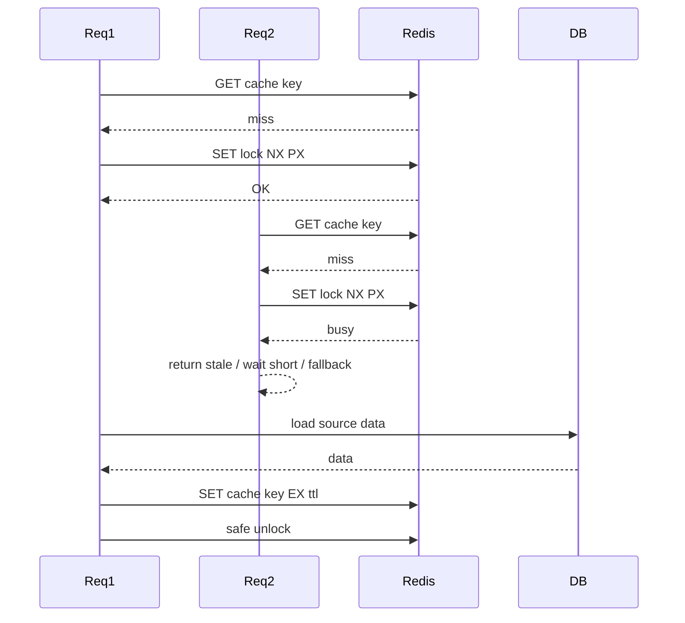

# Part 030 — Redis Distributed Locking

Part 029 built the mental model.

This part focuses on Redis implementation.

The key message:

```text
A Redis lock is a lease implemented with atomic Redis commands.
It is not a magic correctness boundary.
```

A minimal safe Redis lock requires:

- atomic acquire
- unique owner value
- expiry at acquisition time
- owner-checked release
- explicit behavior when lease expires
- downstream correctness guard for important resources

---

## 1. The Basic Redis Lock Primitive

The common Redis lock acquire command is:

```text
SET lockKey lockValue NX PX leaseMillis
```

Meaning:

| Option | Meaning |
|---|---|
| `SET` | set string key |
| `NX` | only if key does not exist |
| `PX` | expiry in milliseconds |
| `leaseMillis` | maximum lease duration |

Example:

```text
SET lock:quote:tenant_7e3b:quote_123:recalculate owner_01J0Z... NX PX 10000
```

Possible result:

```text
OK      -> acquired
null    -> not acquired
error   -> Redis/client failure
```

Do not implement acquire as `GET` followed by `SET`.

That is not atomic.

---

## 2. Why `SET NX PX` Must Be One Command

Unsafe pattern:

```text
SETNX lockKey owner
PEXPIRE lockKey 10000
```

Failure window:

```text
1. SETNX succeeds.
2. JVM crashes before PEXPIRE.
3. Lock has no TTL.
4. Lock can be stuck forever.
```

Safe acquire combines creation and expiry:

```text
SET lockKey owner NX PX 10000
```

One command.

One atomic operation.

---

## 3. Lock Key Design

A lock key should identify the resource and operation being protected.

Example:

```text
lock:{env}:{service}:{tenantHash}:{resourceType}:{resourceIdHash}:{operation}
```

Example concrete shape:

```text
lock:prod:quote-api:tenant_7e3b:quote:q_91fa:recalculate
```

Rules:

- include service/bounded context
- include tenant scope where needed
- include entity/resource scope
- include operation name
- hash sensitive external identifiers
- avoid raw PII
- keep key length reasonable
- document owner service and TTL policy

For Redis Cluster, use hash tags only when multi-key atomicity is truly needed:

```text
lock:{quote_91fa}:recalculate
```

Hash tags can create hot slots if overused.

---

## 4. Lock Value Design

The lock value must be unique per acquire attempt.

Example:

```text
quote-api:pod-7f8c9d:thread-42:01J0ZB2ZXQHE3F19S6F7P4
```

A good value includes:

- service name
- pod/instance ID
- thread/task ID if useful
- random UUID/ULID
- optional request/correlation ID

The value must not be constant.

This value protects against unsafe release.

---

## 5. Safe Unlock With Lua

Unsafe release:

```text
DEL lockKey
```

Bug:

```text
1. A acquires lock with value A.
2. A pauses past expiry.
3. B acquires same lock with value B.
4. A resumes and calls DEL.
5. B's valid lock is deleted.
```

Safe release checks the owner value atomically:

```lua
if redis.call("GET", KEYS[1]) == ARGV[1] then
  return redis.call("DEL", KEYS[1])
else
  return 0
end
```

Usage:

```text
EVAL unlockScript 1 lockKey lockValue
```

Only the owner can release its own lock.

---

## 6. Safe Renewal With Lua

Renewal must also verify ownership.

Unsafe renewal:

```text
PEXPIRE lockKey 10000
```

Problem:

```text
A may renew B's lock after A's lease expired.
```

Safer renewal script:

```lua
if redis.call("GET", KEYS[1]) == ARGV[1] then
  return redis.call("PEXPIRE", KEYS[1], ARGV[2])
else
  return 0
end
```

Usage:

```text
EVAL renewScript 1 lockKey lockValue 10000
```

Renewal failure means the caller no longer owns the lock.

The critical section must stop or switch to a safe reconciliation path.

---

## 7. Minimal Java Lock Interface

Do not scatter raw Redis locking commands across services.

Create a small abstraction:

```java
public interface DistributedLockClient {
    Optional<LockLease> tryAcquire(String lockName, Duration leaseTtl);
    boolean renew(LockLease lease, Duration leaseTtl);
    boolean release(LockLease lease);
}

public record LockLease(
    String key,
    String value,
    Instant acquiredAt,
    Duration leaseTtl,
    Optional<Long> fencingToken
) {}
```

A lock abstraction should centralize:

- key construction
- owner value generation
- acquire command
- unlock script
- renewal script
- metrics
- logging
- timeout mapping
- Redis exception handling

Raw `SET NX PX` in business code is a review smell.

---

## 8. JAX-RS Service Example

Example pattern for a short cache refresh operation:

```java
public QuotePrice getOrRefreshPrice(String tenantId, String quoteId) {
    String lockName = lockNames.quotePriceRefresh(tenantId, quoteId);

    Optional<LockLease> lease = locks.tryAcquire(lockName, Duration.ofSeconds(5));

    if (lease.isEmpty()) {
        return quotePriceCache.getStaleOrThrow(tenantId, quoteId);
    }

    try {
        QuotePrice fresh = pricingService.recalculate(tenantId, quoteId);
        quotePriceCache.put(tenantId, quoteId, fresh);
        return fresh;
    } finally {
        locks.release(lease.get());
    }
}
```

This is acceptable only if:

- stale fallback is allowed
- recalculation is bounded
- duplicate recalculation is tolerable
- release is owner-checked
- Redis failure behavior is explicit

---

## 9. Lock Acquisition Result Mapping

Lock acquisition is not binary success/failure from API perspective.

Represent results explicitly:

```java
enum LockAcquireResultType {
    ACQUIRED,
    BUSY,
    REDIS_TIMEOUT,
    REDIS_UNAVAILABLE,
    INVALID_CONFIGURATION
}
```

Possible behavior:

| Result | Cache reload | HTTP command | Scheduler |
|---|---|---|---|
| `ACQUIRED` | reload | proceed | run job |
| `BUSY` | return stale | `202`, `409`, or `423` | skip |
| `REDIS_TIMEOUT` | fallback | maybe `503` or safe degrade | skip/alert |
| `REDIS_UNAVAILABLE` | stale/local fallback | safe degrade | skip/alert |

Do not collapse all lock errors into `500`.

---

## 10. Lease TTL Selection

Lease TTL must be based on measurement.

Bad:

```text
lease = 30 seconds because it feels enough
```

Better:

```text
p50 critical section: 120 ms
p95 critical section: 700 ms
p99 critical section: 2.1 s
p99.9 critical section: 4.8 s
known GC/CPU/network buffer: 5 s
lease: 10 s
max renewal duration: 60 s
```

TTL must account for:

- critical section duration
- Redis latency
- client timeout
- JVM GC pause
- Kubernetes CPU throttling
- downstream DB latency
- external API latency if any

If the operation is unbounded, a simple Redis lock is the wrong primitive.

---

## 11. Waiting for Lock

Many libraries offer blocking lock acquire with wait time.

Example concept:

```text
tryLock(waitTime=200ms, leaseTime=10s)
```

Be careful in JAX-RS request threads.

Waiting consumes request capacity.

Safer defaults:

- cache reload: wait very short or not at all
- scheduler: no wait; skip if busy
- internal worker: bounded wait
- user command: return conflict/accepted/status

Never wait indefinitely.

---

## 12. Lock Around Cache Fill

Redis lock is often reasonable for cache stampede protection.

Flow:



Correctness expectation:

```text
Prevent many reloads, not guarantee exactly one reload forever.
```

Duplicate reload should be tolerable.

---

## 13. Lock Around Database Update

This is riskier.

Weak pattern:

```text
acquire Redis lock
update PostgreSQL row
release Redis lock
```

Problem:

```text
If the lock expires while the JVM is paused, another owner can update too.
```

Better pattern:

```text
acquire Redis lock
read fencing token / version
update PostgreSQL with WHERE version/token guard
commit
release Redis lock
```

Example:

```sql
UPDATE quote_recalculation
SET status = 'DONE', fencing_token = :token
WHERE quote_id = :quoteId
  AND fencing_token < :token;
```

If the update count is zero, the caller is stale.

---

## 14. Lock Around External Calls

Avoid holding Redis lock across long external calls.

If unavoidable, add:

- external idempotency key
- local durable execution record
- timeout shorter than lease or renewal policy
- reconciliation job
- fencing or state guard on local DB update
- compensation policy

Redis lock alone cannot prevent duplicate external side effects.

---

## 15. Lock Around Scheduler Job

Scheduler leader lock example:

```text
lock:scheduler:quote-expiry-reconciliation
```

Flow:

```text
1. Every pod wakes up.
2. Each tries SET NX PX.
3. One pod wins.
4. Winner records execution in DB.
5. Winner processes bounded batch.
6. Winner releases or lets lease expire.
```

Important:

- batch should be bounded
- job should be resumable
- job records should be durable
- duplicate job execution should be safe
- lock loss should stop or limit further work

For critical jobs, store ownership/execution state in PostgreSQL too.

---

## 16. Lock Renewal Watchdog

A watchdog automatically renews the lock while the task is active.

Concept:

```text
lease TTL: 30s
renew every: 10s
max total lock time: 5m
```

Risks:

- endless renewal if task hangs
- renewal thread dies silently
- renewal succeeds while business task is already unsafe
- renewal delayed by CPU throttling/GC
- lock survives longer than intended

A watchdog must have a maximum total duration.

If the maximum is reached, fail safe.

---

## 17. Redisson Lock Awareness

Redisson provides higher-level distributed lock APIs.

Common features may include:

- lock abstraction
- reentrant lock
- watchdog renewal
- fair lock variants
- read/write lock variants
- semaphore-like primitives

Using Redisson does not remove design responsibility.

You still must verify:

- lease time
- wait time
- watchdog behavior
- unlock ownership
- Redis topology support
- failure semantics
- metrics and logging
- whether fencing is available/used

Library abstraction does not make stale owners impossible.

---

## 18. Redlock Algorithm

Redlock is an algorithm proposed for acquiring locks across multiple independent Redis masters.

High-level idea:

```text
1. Try to acquire same lock on N independent Redis nodes.
2. Require majority success.
3. Use elapsed time to decide whether lease is still valid.
4. Release on all nodes.
```

It aims to reduce dependency on a single Redis node.

But Redlock has been debated because lease-based locking under partitions, pauses, and clocks remains hard.

Practical guidance:

- understand the controversy before using it for correctness-critical workflows
- do not treat Redlock as equivalent to a database transaction
- still use fencing tokens for external resources
- prefer simpler designs when a single Redis deployment is already the coordination layer
- prefer DB constraints/state guards for durable business correctness

The important question is not "Is Redlock installed?"

The important question is:

```text
Can a stale owner corrupt the protected resource?
```

---

## 19. Fencing Token With Redis

Redis `SET NX PX` does not generate a fencing token by itself.

You can generate one using an atomic counter:

```text
INCR lock:fence:quote:quote_123
SET lock:quote:quote_123 owner|token NX PX 10000
```

But this has atomicity concerns if done as separate commands.

Better: use Lua to issue token and acquire together.

Conceptual Lua:

```lua
if redis.call("EXISTS", KEYS[1]) == 0 then
  local token = redis.call("INCR", KEYS[2])
  redis.call("PSETEX", KEYS[1], ARGV[2], ARGV[1] .. ":" .. token)
  return token
else
  return nil
end
```

Keys:

```text
KEYS[1] = lock key
KEYS[2] = fencing counter key
ARGV[1] = owner value
ARGV[2] = lease millis
```

Redis Cluster warning:

```text
lock key and fencing counter must be in the same hash slot for one script.
```

Use hash tags if needed:

```text
lock:{quote_123}:recalculate
lock:{quote_123}:fence
```

---

## 20. Fencing Token Enforcement in PostgreSQL

Generating a token is useless unless the protected resource checks it.

Example table column:

```sql
ALTER TABLE quote_recalc_state
ADD COLUMN fencing_token BIGINT NOT NULL DEFAULT 0;
```

Update pattern:

```sql
UPDATE quote_recalc_state
SET status = :status,
    fencing_token = :newToken,
    updated_at = now()
WHERE quote_id = :quoteId
  AND fencing_token < :newToken;
```

If `rowsUpdated == 0`, the actor is stale.

In MyBatis, this should be explicit in mapper result handling:

```java
int rows = mapper.completeRecalculation(quoteId, token, status);
if (rows == 0) {
    throw new StaleLockOwnerException(quoteId, token);
}
```

Do not ignore update counts.

---

## 21. Fencing and External Systems

Some external systems cannot enforce fencing tokens.

If the external system cannot reject stale owners, use other controls:

- external idempotency key
- one-time operation ID
- durable local outbox
- reconciliation
- compensating transaction
- manual review queue for ambiguous outcomes

Redis lock cannot force an external API to respect ownership.

---

## 22. Redis Cluster Constraints

Redis Cluster affects lock design.

Single-key lock commands are straightforward.

Multi-key lock scripts are constrained by hash slot.

This can affect:

- lock key + fencing counter
- lock key + metadata key
- multi-resource lock
- lock + queue coordination

If keys are in different slots, Redis Cluster rejects multi-key script/transaction with cross-slot error.

Design keys intentionally.

Do not discover this during production deploy.

---

## 23. Multi-Resource Locks

Avoid acquiring many Redis locks for one operation.

Example danger:

```text
acquire lock A
acquire lock B
acquire lock C
```

Risks:

- deadlock-like contention
- partial acquisition
- complex cleanup
- long hold time
- unfairness
- failure during release

If unavoidable:

- impose global lock ordering
- use short TTL
- release all acquired locks on failure
- prefer one coarser lock if acceptable
- consider DB transaction constraints instead

Multi-resource locking is a design smell.

---

## 24. Lock Timeout and Redis Timeout

Separate these concepts:

| Timeout | Meaning |
|---|---|
| acquire wait timeout | how long caller waits for lock availability |
| Redis command timeout | how long client waits for Redis response |
| lease TTL | how long lock remains valid |
| business operation timeout | how long protected operation may run |
| HTTP request timeout | how long client waits |

They must be aligned.

Bad configuration:

```text
HTTP timeout: 5s
business operation: 20s
lease TTL: 10s
Redis command timeout: 30s
```

This creates ambiguous behavior.

---

## 25. Failure Mode: Acquire Succeeds, Response Lost

Possible sequence:

```text
1. Redis executes SET NX PX successfully.
2. Network drops before client receives OK.
3. Client sees timeout.
4. Lock is actually held.
```

The client does not know whether it acquired.

Safe behavior:

- do not enter critical section on unknown acquire result
- retry after short delay with same owner only if implementation supports it
- observe lock value if safe
- fail closed for critical operations
- log unknown acquisition outcome

Unknown outcomes are part of distributed systems.

---

## 26. Failure Mode: Release Fails

Release can fail because:

- Redis timeout
- Redis unavailable
- owner mismatch
- lock expired
- lock already released
- client connection issue

If release fails after the critical section completed, the TTL should eventually clean up.

But high release failure rate is still an operational signal.

Metric it.

Alert if contention or stuck locks increase.

---

## 27. Failure Mode: Lease Expires During Work

Sequence:

```text
1. A acquires lock for 10s.
2. A works for 15s.
3. B acquires lock after 10s.
4. A completes and writes result.
5. B also writes result.
```

Mitigations:

- choose better TTL
- bound critical section
- renew safely
- check lock ownership before final write
- enforce fencing token in DB
- make operation idempotent
- avoid lock for unbounded work

Checking Redis before final write helps but is not enough under all races.

Fencing at the resource is stronger.

---

## 28. Failure Mode: Redis Failover

During Redis failover:

- writes may fail
- clients reconnect
- lock key may be lost depending on replication timing
- duplicate acquisition may occur under uncertainty
- latency can spike

If lock protects cache fill, this may be acceptable.

If lock protects irreversible business state, this is dangerous.

Use DB guards/fencing/idempotency for correctness-critical workflows.

---

## 29. Failure Mode: Client Clock Skew

Basic `SET NX PX` expiry is managed by Redis, not client clock.

That is good.

But client code may still use local clocks for:

- calculating elapsed lease validity
- deciding renewal deadline
- logging durations
- Redlock elapsed-time logic
- timeout budgets

Clock skew and clock jumps can affect those decisions.

Prefer monotonic time for elapsed duration inside JVM where possible.

---

## 30. Production-Safe Debugging

Useful Redis commands for lock debugging:

```text
GET lockKey
PTTL lockKey
TYPE lockKey
SCAN ... MATCH lock:service:* COUNT 100
```

Be careful:

- avoid `KEYS lock:*` in production
- do not dump sensitive lock values unnecessarily
- do not manually `DEL` lock unless incident command is approved
- record owner, TTL, and correlation ID
- check application logs before deleting locks

Manual unlock can corrupt active work.

---

## 31. Observability for Redis Locks

Dashboard panels:

- lock acquisition rate
- lock acquisition failure rate
- acquire latency
- contention by operation
- hold duration p50/p95/p99
- release success/failure
- owner mismatch count
- renewal success/failure
- expired-while-working count if detectable
- Redis command timeout count

Alert examples:

```text
lock acquire failure rate > baseline for 10 minutes
lock hold p99 close to TTL
release owner mismatch > 0
renewal failure spike
Redis lock command timeout spike
```

A lock without observability is production debt.

---

## 32. Testing Redis Locks

Integration tests should use real Redis.

Test cases:

```text
single acquire succeeds
second acquire while held fails
release by owner succeeds
release by non-owner does not delete
expired lock can be acquired
renew by owner extends TTL
renew by non-owner fails
concurrent contenders produce exactly one winner per lease window
unknown Redis timeout handled safely
```

Failure-oriented tests:

```text
holder sleeps past TTL
holder tries unsafe final write
fencing rejects stale holder
Redis unavailable during acquire
Redis unavailable during release
renewal fails mid-work
```

For Java, test both wrapper logic and service behavior.

---

## 33. Minimal Lock Wrapper Pseudocode

Acquire:

```java
Optional<LockLease> tryAcquire(String key, Duration ttl) {
    String owner = ownerFactory.newOwnerValue();

    RedisResult result = redis.set(key, owner, nx(), px(ttl));

    if (result == OK) {
        metrics.acquireSuccess(key);
        return Optional.of(new LockLease(key, owner, Instant.now(), ttl, Optional.empty()));
    }

    if (result == NOT_SET) {
        metrics.acquireBusy(key);
        return Optional.empty();
    }

    throw mapRedisFailure(result);
}
```

Release:

```java
boolean release(LockLease lease) {
    long deleted = redis.eval(
        UNLOCK_SCRIPT,
        List.of(lease.key()),
        List.of(lease.value())
    );

    return deleted == 1;
}
```

The wrapper should catch Redis exceptions and map them consistently.

---

## 34. Redisson Usage Review

If Redisson is used, review code like:

```java
RLock lock = redissonClient.getLock(lockName);
boolean acquired = lock.tryLock(waitTime, leaseTime, TimeUnit.SECONDS);
try {
    if (!acquired) {
        return busyResponse();
    }
    doWork();
} finally {
    if (acquired && lock.isHeldByCurrentThread()) {
        lock.unlock();
    }
}
```

Review questions:

- Is `waitTime` bounded?
- Is `leaseTime` explicit?
- Is watchdog behavior understood?
- Is `unlock` safe when lock expired?
- Is reentrancy needed?
- Does code handle `InterruptedException`?
- Does code handle Redis failover?
- Does protected resource need fencing?

Do not approve simply because the library is popular.

---

## 35. Lock and Security/Privacy

Lock keys can leak sensitive information.

Avoid:

```text
lock:customer:john.smith@example.com:quote:123
```

Prefer:

```text
lock:quote-api:tenant_7e3b:quote:q_91fa:recalculate
```

Review:

- PII in key name
- PII in value
- lock values in logs
- Redis ACL permissions
- ability to delete lock keys manually
- dangerous command access
- incident runbook authorization

Lock keys are operational metadata, but they can still expose business data.

---

## 36. Lock and Compliance/Regulatory Workflows

For regulated workflows, a Redis lock is not enough evidence.

You usually need durable records:

- who initiated operation
- when lock was acquired
- what state transition occurred
- what DB record changed
- what event was published
- what external call was made
- whether duplicate attempt occurred
- whether stale owner was rejected

Redis may help coordinate.

Audit evidence should live in durable storage/logging systems.

---

## 37. Internal Verification Checklist

Verify with the CSG/team codebase and platform/SRE/security context:

- Whether lock implementation uses `SET NX PX` or a library abstraction.
- Whether acquire sets TTL atomically.
- Whether lock value is unique per acquisition attempt.
- Whether unlock uses owner-checked Lua or equivalent library safety.
- Whether renewal uses owner-checked Lua or verified library behavior.
- Whether lease TTL values are documented per operation.
- Whether any lock has no TTL.
- Whether lock keys contain raw tenant/customer/user/order/quote identifiers.
- Whether lock keys work under Redis Cluster if cluster mode is used.
- Whether Redisson is used and watchdog behavior is understood.
- Whether Redlock is used and why.
- Whether fencing tokens are generated for correctness-critical resources.
- Whether PostgreSQL enforces fencing/version/state guard.
- Whether locks are held across external API calls.
- Whether locks are held across long DB transactions.
- Whether scheduler jobs use Redis locks.
- Whether message consumers use Redis locks.
- Whether lock failure maps to correct API/domain behavior.
- Whether metrics/logs exist for acquire, release, renewal, owner mismatch, and contention.
- Whether incident runbooks cover stuck lock/manual unlock.
- Whether integration tests use real Redis.

---

## 38. PR Review Checklist

When reviewing Redis lock implementation, ask:

- Is the lock necessary?
- What exact invariant is protected?
- What is the Redis key shape?
- Is the key free of PII?
- Is acquisition one atomic `SET NX PX` or equivalent?
- Is TTL always set?
- How was TTL chosen?
- Is the owner value unique?
- Is release owner-checked?
- Is renewal needed?
- Does renewal have a maximum duration?
- What happens if lock acquisition result is unknown?
- What happens if release fails?
- What happens if the lease expires during work?
- Can stale owner still write to PostgreSQL or external systems?
- Is fencing required?
- Is fencing enforced by the protected resource?
- Does the implementation work in Redis Cluster?
- Are Redis client timeouts shorter than business timeout budgets?
- Are metrics and logs sufficient?
- Are tests concurrency/failure-oriented?
- Is the failure window documented?

A lock implementation is production-ready only when it is boring under failure.

---

## 39. Acceptable Default Patterns

For cache stampede protection:

```text
SET lock NX PX shortTtl
reload cache
safe unlock
fallback to stale if busy
```

For scheduler leadership:

```text
SET lock NX PX lease
record execution in DB
process bounded batch
renew with max duration if needed
safe unlock
```

For DB state transition:

```text
Redis lock for contention reduction
PostgreSQL version/state/fencing for correctness
safe unlock
```

For external side effect:

```text
Prefer idempotency/outbox/reconciliation.
Use Redis lock only as additional best-effort coordination.
```

---

## 40. Summary

Redis distributed locking requires discipline.

The minimum safe implementation uses:

- `SET key value NX PX ttl` for acquire
- unique value per lock attempt
- Lua owner check for release
- Lua owner check for renewal
- bounded wait time
- bounded lease time
- explicit Redis failure behavior
- metrics/logs
- integration tests with real Redis

For correctness-critical workflows, add:

- fencing token
- PostgreSQL version/state guard
- idempotency
- durable execution record
- reconciliation

Redis can coordinate distributed Java/JAX-RS services.

It cannot replace durable correctness design.
