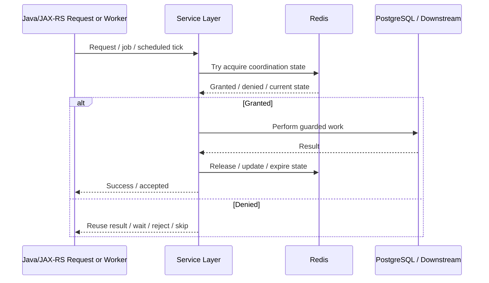
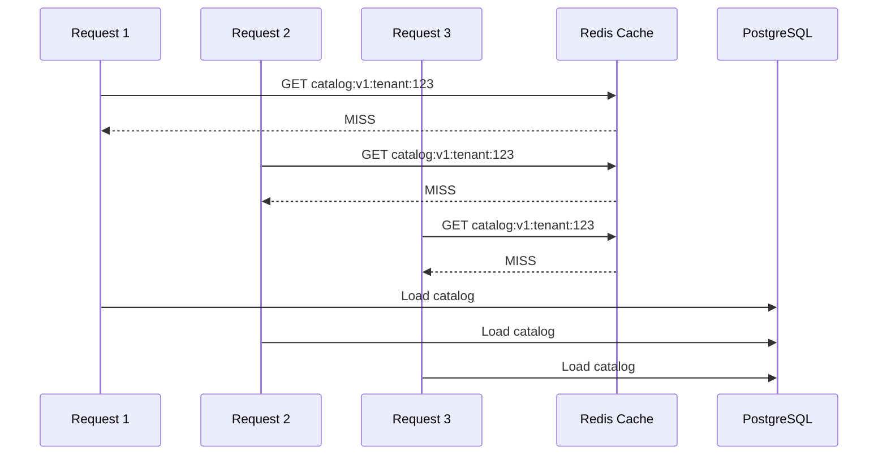
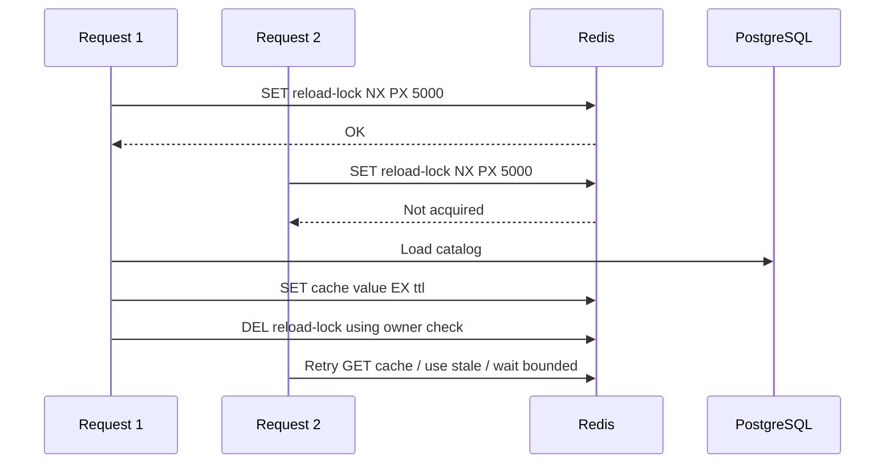
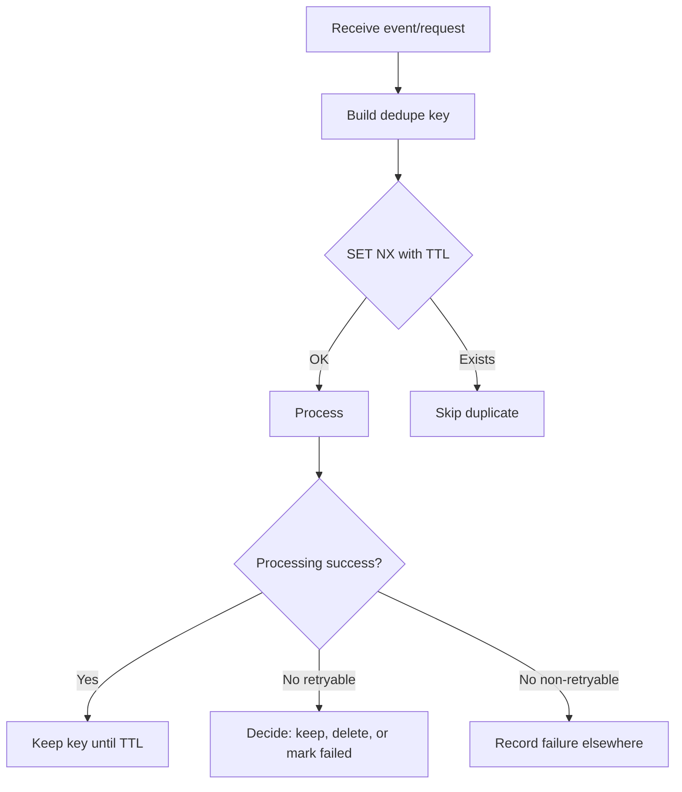
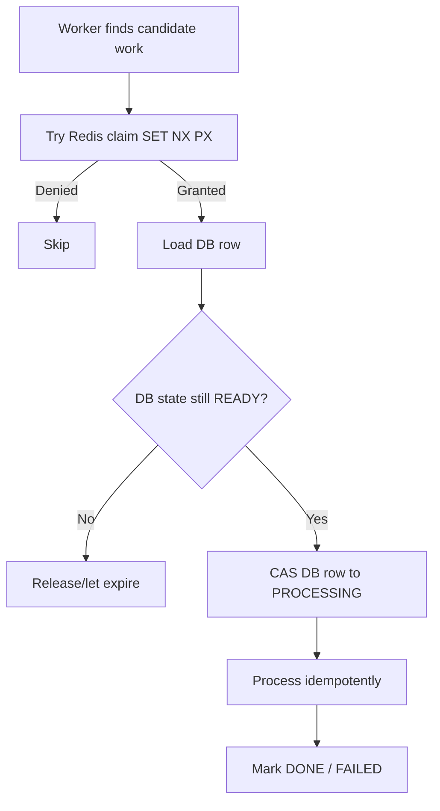
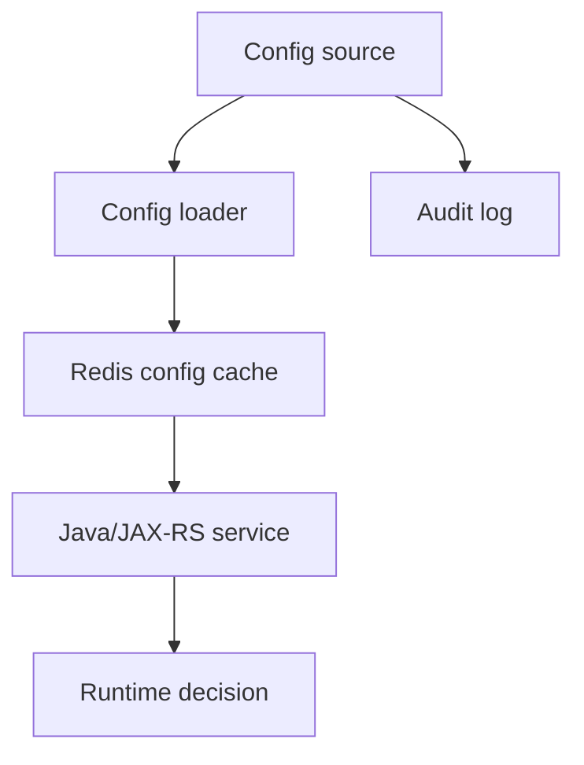

# Part 031 — Coordination Patterns with Redis

Redis sering dipakai bukan hanya sebagai cache, tetapi sebagai **coordination layer ringan** antar instance service.

Dalam sistem Java/JAX-RS enterprise, coordination problem muncul ketika beberapa pod, node, worker, scheduler, atau consumer ingin melakukan aksi yang sama terhadap resource bersama:

- hanya satu request boleh reload cache mahal;
- hanya N worker boleh memproses workload tertentu;
- hanya satu instance boleh menjalankan scheduler tertentu;
- operasi duplicate harus dicegah;
- traffic global harus ditahan;
- maintenance mode harus tersebar cepat ke banyak service;
- work item harus bisa diklaim oleh salah satu worker;
- expensive computation harus dikoalesensi agar tidak menghantam PostgreSQL atau downstream service.

Redis bisa membantu, tetapi harus dipahami sebagai **coordination primitive**, bukan magic distributed consensus system.

Redis cocok untuk banyak koordinasi **best-effort, bounded-risk, latency-sensitive**.
Redis tidak cocok jika sistem membutuhkan **linearizable consensus, strong leadership guarantee, irreversible financial correctness, atau cross-region correctness tanpa fencing/consensus**.

---

## 1. Core Mental Model

Redis coordination adalah penggunaan command atomic Redis untuk membuat keputusan bersama secara cepat.

Contoh keputusan:

- siapa yang boleh menjalankan kerja ini;
- apakah request ini duplicate;
- apakah limit global sudah tercapai;
- apakah expensive reload sedang berjalan;
- apakah feature/maintenance flag aktif;
- apakah worker boleh mengklaim job;
- apakah sebuah resource sedang diproses.

Redis membantu karena sebagian besar command Redis dieksekusi secara atomic dalam satu server/shard.

Namun ada batas penting:

> Atomic Redis command tidak otomatis membuat keseluruhan distributed workflow menjadi atomic.

Jika Redis berhasil tetapi database gagal, atau database berhasil tetapi Redis gagal, maka coordination state dan business state bisa berbeda.

---

## 2. Redis Coordination vs Source of Truth

Redis boleh menjadi coordination helper.
Redis jarang boleh menjadi source of truth untuk business-critical state tanpa desain durability, recovery, audit, dan reconciliation.

| Use Case | Redis sebagai Coordination | Redis sebagai Source of Truth |
|---|---:|---:|
| Cache reload single-flight | Cocok | Tidak perlu |
| API duplicate suppression | Cocok dengan TTL | Berisiko jika tanpa DB record |
| Distributed semaphore | Cocok untuk throttle | Berisiko untuk entitlement permanen |
| Leader election-lite | Cocok untuk scheduler best-effort | Tidak cukup untuk critical leader |
| Maintenance flag | Cocok jika ada safe default | Perlu source config/audit |
| Job claim | Cocok dengan timeout/retry | Perlu durability jika critical |
| Payment/order commit guard | Hanya sebagai helper | Source of truth harus DB/ledger |

Rule praktis:

> Jika kehilangan key Redis hanya menyebabkan extra work atau temporary degradation, Redis mungkin cocok. Jika kehilangan key menyebabkan data bisnis salah, Redis saja tidak cukup.

---

## 3. Coordination Lifecycle

Lifecycle coordination Redis biasanya seperti ini:



Important lifecycle questions:

1. Siapa membuat coordination key?
2. Kapan key expire?
3. Siapa boleh menghapus key?
4. Apa yang terjadi jika owner mati?
5. Apa yang terjadi jika Redis mati?
6. Apa yang terjadi jika DB commit sukses tapi Redis update gagal?
7. Apa yang terjadi jika Redis granted tetapi downstream call timeout?
8. Apakah retry aman?
9. Apakah duplicate work boleh terjadi?
10. Apakah stale coordination state lebih buruk daripada missing coordination state?

---

## 4. Pattern: Single-Flight

Single-flight mencegah banyak request melakukan expensive work yang sama secara paralel.

Use case umum:

- cache reload katalog produk;
- pricing rule recomputation;
- tenant config refresh;
- quote summary recalculation;
- expensive DB aggregation;
- remote API fetch yang mahal;
- rebuild projection ringan.

Tanpa single-flight:



Dengan single-flight:



### Single-flight key design

Example:

```text
sf:{service}:{tenantId}:{resourceType}:{resourceId}:v{version}
```

Example:

```text
sf:quote-order:tenant-42:catalog:item-998:v3
```

### Single-flight response strategy

Jika request tidak mendapatkan lock reload, pilih salah satu:

1. return stale cache jika tersedia;
2. wait bounded lalu re-read cache;
3. return `202 Accepted` jika async;
4. return degraded response;
5. reject dengan `503`/`429` untuk internal protection.

Dalam API enterprise, jangan biarkan request menunggu tanpa batas.

### Failure mode

| Failure | Dampak | Mitigasi |
|---|---|---|
| Loader crash setelah acquire | Lock tertinggal sampai TTL | Lease pendek + retry |
| TTL terlalu pendek | Multiple loader berjalan | TTL berdasarkan worst-case load |
| TTL terlalu panjang | Request lain terlalu lama blocked | Bounded wait + stale fallback |
| Redis unavailable | Semua request reload DB | Local guard/circuit breaker |
| DB slow | Lock expire sebelum load selesai | Renewal atau stale fallback |

### Java/JAX-RS concern

- Jangan melakukan busy-wait dalam request thread.
- Jangan block terlalu lama di JAX-RS resource.
- Terapkan timeout total request.
- Pakai correlation ID untuk trace request yang menjadi loader.
- Pastikan fallback jelas: stale, wait, reject, atau async.

---

## 5. Pattern: Deduplication

Deduplication mencegah event/request/job yang sama diproses berkali-kali.

Redis cocok untuk deduplication dengan TTL jika duplicate hanya relevan dalam window tertentu.

Contoh:

```text
dedupe:{service}:{eventSource}:{eventId}
```

Command sederhana:

```redis
SET dedupe:quote-order:kafka:evt-123 "seen" NX EX 86400
```

Jika hasil `OK`, process event.
Jika tidak, skip sebagai duplicate.

### Cocok untuk

- duplicate Kafka event;
- duplicate RabbitMQ delivery;
- webhook duplicate;
- retry client;
- scheduler duplicate tick;
- duplicate notification;
- temporary idempotency guard.

### Tidak cukup untuk

- financial transaction exactly-once;
- irreversible order submission tanpa DB idempotency;
- long-term audit;
- dedupe yang harus bertahan melebihi TTL;
- dedupe across disaster recovery jika Redis state hilang.

### Deduplication lifecycle



### Critical design decision

Jika processing gagal setelah dedupe key dibuat, apakah key harus tetap ada?

- Keep key: mencegah duplicate tetapi bisa drop retry valid.
- Delete key: memungkinkan retry tetapi bisa double process.
- Store state: lebih aman, tetapi lebih kompleks.

Untuk business-critical operation, gunakan state machine idempotency seperti Part 027–028, bukan dedupe marker sederhana.

---

## 6. Pattern: Distributed Semaphore

Distributed semaphore membatasi jumlah concurrent actor yang boleh menjalankan operasi tertentu.

Use case:

- maksimal 10 concurrent recalculation per tenant;
- maksimal 5 outbound calls ke legacy system;
- maksimal N worker untuk heavy catalog rebuild;
- membatasi concurrent import/export;
- membatasi expensive DB query.

### Model sederhana dengan counter

```text
sem:{service}:{resource}:current
```

Naif:

```redis
INCR sem:pricing:legacy-api:current
EXPIRE sem:pricing:legacy-api:current 60
```

Lalu jika value > limit, decrement dan reject.

Masalah:

- `INCR` dan `EXPIRE` bisa tidak atomic jika tidak dibungkus Lua;
- worker crash bisa membuat counter tidak turun;
- TTL pada whole counter bukan per permit;
- race handling harus hati-hati.

### Model lebih aman dengan sorted set

Gunakan sorted set berisi permit owner dengan timestamp expiry.

```text
sem:{service}:{resource}:holders
```

Algorithm:

1. remove expired holders;
2. count active holders;
3. if count < limit, add owner with expiry timestamp;
4. return granted/denied;
5. release by removing owner.

Biasanya dilakukan dengan Lua agar atomic.

### Failure mode semaphore

| Failure | Dampak | Mitigasi |
|---|---|---|
| Worker mati tanpa release | Permit tertahan | Expiry per holder |
| Clock skew app | Expiry salah | Gunakan Redis TIME atau toleransi |
| Limit terlalu rendah | Throughput turun | Monitor denial rate |
| Limit terlalu tinggi | Downstream overload | Load test |
| Redis failover | Permit hilang/duplikat | Best-effort only atau DB-backed control |

### Java/JAX-RS response mapping

Jika semaphore tidak granted:

- API public: `429 Too Many Requests` atau `503 Service Unavailable` tergantung makna limit.
- Internal operation: fail fast dengan typed exception.
- Async job: requeue with delay.
- Scheduler: skip current tick.

---

## 7. Pattern: Distributed Counter

Counter Redis dipakai untuk menghitung sesuatu secara cepat dan atomic.

Use case:

- active in-flight request;
- per-tenant request counter;
- login attempt counter;
- error burst counter;
- temporary quota consumption;
- approximate usage meter sebelum flush ke DB.

Command:

```redis
INCR counter:tenant:42:api:create-quote:2026-07-11T10
EXPIRE counter:tenant:42:api:create-quote:2026-07-11T10 7200
```

### Concern

Counter Redis sering tampak sederhana tetapi punya banyak boundary:

- apakah counter boleh hilang?
- apakah counter harus exact?
- apakah counter butuh audit?
- apakah counter di-reset berdasarkan waktu?
- apakah counter update harus satu transaksi dengan DB?
- apakah counter dipakai untuk billing?

Jika counter dipakai untuk billing atau compliance, Redis counter saja biasanya tidak cukup.

---

## 8. Pattern: Leader Election-Lite

Redis bisa digunakan untuk leader election ringan dengan lock lease.

Use case:

- satu instance menjalankan scheduled cleanup;
- satu instance melakukan cache warming;
- satu instance melakukan polling legacy system;
- satu worker menjadi coordinator best-effort.

Pattern:

```redis
SET leader:quote-order:cache-warmer <instanceId> NX PX 30000
```

Leader harus renew lease secara periodik.

### Batas penting

Ini bukan consensus seperti Raft/ZooKeeper/etcd.

Leader election-lite berbasis Redis bisa gagal pada:

- GC pause panjang;
- network partition;
- Redis failover;
- clock/lease timing issue;
- split brain sementara;
- delayed operation setelah lease expired.

Jika leader melakukan write ke resource eksternal, gunakan fencing token atau gunakan platform yang menyediakan stronger coordination.

### Safe use

Cocok untuk:

- cache warming;
- cleanup idempotent;
- refresh non-critical;
- metric aggregation sementara;
- scheduled task yang aman jika double-run.

Tidak cocok untuk:

- exclusive financial posting;
- irreversible order state transition tanpa DB guard;
- cross-region leader untuk critical workflow;
- operation yang tidak idempotent.

---

## 9. Pattern: Global Throttle

Global throttle membatasi throughput seluruh fleet service.

Use case:

- legacy API hanya mampu 100 RPS global;
- PostgreSQL sedang degraded;
- downstream partner terkena rate limit;
- batch operation harus diperlambat;
- incident mitigation.

Redis dapat menyimpan throttle state:

```text
throttle:{service}:{resource}:limit
throttle:{service}:{resource}:state
```

Pattern bisa berupa:

- fixed window counter;
- token bucket;
- distributed semaphore;
- kill switch + limiter;
- dynamic config flag.

### Important distinction

Rate limiter biasanya mengontrol request berdasarkan actor.
Global throttle mengontrol pressure terhadap resource bersama.

Contoh:

```text
rate-limit:tenant:42:endpoint:create-quote
throttle:downstream:legacy-rating-api
```

### Failure behavior

Jika Redis unavailable, pilih policy:

- fail open: menjaga availability tetapi bisa overload downstream;
- fail closed: melindungi downstream tetapi bisa outage customer;
- degraded default: limit lokal konservatif.

Policy harus eksplisit.

---

## 10. Pattern: Barrier-Like Coordination

Redis bisa membantu koordinasi barrier sederhana: menunggu beberapa worker menyelesaikan bagian pekerjaan sebelum tahap berikutnya.

Use case:

- batch import terdiri dari beberapa partition;
- rebuild cache multi-tenant;
- fan-out/fan-in job;
- multi-step data preparation.

Possible structure:

```text
barrier:{jobId}:expected
barrier:{jobId}:completed
barrier:{jobId}:workers
```

Worker melakukan:

```redis
SADD barrier:job-123:completed worker-7
SCARD barrier:job-123:completed
```

Jika completed == expected, trigger next stage.

### Concern

Redis barrier sederhana rawan:

- worker crash;
- duplicate completion;
- missing worker;
- expected count berubah;
- next stage triggered multiple times;
- no durable audit;
- no strong workflow state.

Untuk workflow bisnis penting, gunakan workflow engine, database state machine, atau durable queue/broker.

Redis barrier cocok untuk transient technical coordination.

---

## 11. Pattern: Work Claiming

Work claiming memungkinkan beberapa worker berebut work item tetapi hanya satu yang menang.

Pattern sederhana:

```redis
SET work-claim:{workId} {workerId} NX PX 60000
```

Jika berhasil, worker memproses.
Jika gagal, worker lain sudah mengklaim.

### Use case

- polling DB table lalu claim item;
- scheduled reconciliation;
- file processing;
- batch partition processing;
- cache rebuild per tenant;
- external API sync per account.

### Correctness concern

Work claiming dengan Redis hanya mencegah duplicate secara best-effort.
Jika work item juga ada di PostgreSQL, DB state harus tetap menjadi sumber kebenaran.

Lebih kuat:

- DB row status: `READY -> PROCESSING -> DONE`;
- Redis claim sebagai acceleration/guard;
- DB optimistic locking untuk final state transition;
- idempotent worker.

### Recommended model



Redis claim reduces contention.
DB state preserves correctness.

---

## 12. Pattern: Integrity Guard

Integrity guard adalah Redis key yang mencegah operasi berbahaya terjadi saat kondisi tertentu.

Examples:

```text
guard:tenant:42:catalog-reindex-running
guard:quote-order:bulk-import-active
guard:pricing:rules-migration-active
```

Use case:

- jangan submit quote saat catalog migration aktif;
- jangan refresh projection saat rebuild sedang berjalan;
- jangan jalankan dua migration data bersamaan;
- jangan delete cache saat warmup besar sedang berlangsung.

### Correctness boundary

Integrity guard Redis cocok jika pelanggaran guard hanya menyebabkan technical conflict.
Jika pelanggaran guard menyebabkan data bisnis corrupt, guard harus juga ditegakkan di DB/application state machine.

### Java/JAX-RS mapping

Jika guard aktif:

- return `409 Conflict` jika operation conflict dengan state saat ini;
- return `423 Locked` jika resource sedang locked secara eksplisit;
- return `503` jika maintenance/degraded mode;
- return `429` jika throttling.

Gunakan error response yang bisa dipahami client.

---

## 13. Pattern: Maintenance Mode Flag

Redis dapat menyimpan flag operasional yang dibaca cepat oleh service.

Example:

```text
ops:maintenance:{service}:enabled
ops:maintenance:{tenantId}:enabled
```

Value:

```json
{
  "enabled": true,
  "reason": "catalog migration",
  "startedAt": "2026-07-11T03:30:00Z",
  "owner": "platform-team",
  "expiresAt": "2026-07-11T05:30:00Z"
}
```

### Important requirements

- TTL wajib agar flag tidak tertinggal selamanya.
- Harus ada audit trail di luar Redis.
- Harus ada safe default jika Redis unavailable.
- Harus ada observability siapa mengaktifkan flag.
- Jangan simpan alasan sensitif/PII.

### Failure mode

| Failure | Dampak | Mitigasi |
|---|---|---|
| Flag tanpa TTL | Service stuck maintenance | TTL mandatory |
| Redis unavailable | Tidak bisa baca mode | Default eksplisit |
| Flag stale | Behavior salah | Version + audit |
| Tidak ada ownership | Sulit rollback | owner metadata |

---

## 14. Pattern: Kill Switch

Kill switch mematikan fitur/path tertentu dengan cepat.

Use case:

- disable integration ke downstream yang rusak;
- disable cache write sementara;
- disable async worker tertentu;
- disable expensive endpoint;
- disable risky feature after deployment.

Example keys:

```text
killswitch:{service}:{feature}
killswitch:quote-order:external-rating-call
killswitch:quote-order:cache-write:catalog
```

### Kill switch design

Kill switch harus memiliki:

- owner;
- reason;
- TTL;
- default behavior;
- audit trail;
- dashboard;
- deployment independence;
- test coverage.

### Risk

Kill switch yang tidak diuji sering gagal saat dibutuhkan.

Pastikan kode path kill switch benar-benar dieksekusi di staging atau test environment.

---

## 15. Pattern: Feature Flag Cache

Redis sering dipakai sebagai cache untuk feature flag/config dari source lain.

Important distinction:

- Source of truth: LaunchDarkly, database config table, AppConfig, Key Vault, Parameter Store, internal config service.
- Redis: fast cache/distribution layer.

Jangan jadikan Redis satu-satunya tempat audit perubahan feature flag.

### Cache lifecycle



### Concern

- stale config;
- missing config;
- invalid JSON;
- tenant-specific override;
- rollback;
- default value;
- Redis outage;
- auditability.

---

## 16. Coordination with PostgreSQL

Redis coordination sering bersinggungan dengan PostgreSQL.

General rule:

> Redis may decide who tries first. PostgreSQL should confirm whether the business state transition is still valid.

Example:

- Redis lock prevents many pods from trying.
- PostgreSQL optimistic update ensures only valid state transition commits.

SQL example:

```sql
UPDATE quote_order
SET status = 'PROCESSING', version = version + 1
WHERE id = :id
  AND status = 'READY'
  AND version = :expectedVersion;
```

Jika row count `0`, Redis lock tidak cukup; DB state sudah berubah.

### Why this matters

Redis lock/claim bisa expired, hilang saat failover, atau stale.
Database constraint/state machine tetap harus melindungi business correctness.

---

## 17. Coordination with Kafka/RabbitMQ

Redis bisa dipakai untuk coordination pada consumer:

- dedupe event ID;
- throttle processing;
- claim tenant partition;
- cache projection update;
- prevent duplicate external call;
- delay/retry lightweight job.

### Messaging failure interaction

| Scenario | Risk | Mitigation |
|---|---|---|
| Message duplicate | Double processing | Redis dedupe + idempotent DB update |
| Out-of-order event | Stale cache overwrite | Version check |
| Consumer crash after Redis marker | Retry skipped | State machine marker |
| Redis down | Dedupe unavailable | DB idempotency fallback |
| Broker redelivery | Replay storm | Backpressure + dedupe TTL |

### Important distinction

Kafka/RabbitMQ are durable messaging systems.
Redis coordination should not silently replace durable broker semantics unless requirements are intentionally weaker.

---

## 18. Java Implementation Skeleton

A minimal coordination wrapper should hide low-level Redis command details and expose typed intent.

```java
public interface CoordinationStore {
    Optional<Lease> tryAcquireLease(String key, Duration ttl);
    boolean releaseLease(Lease lease);
    boolean markSeen(String key, Duration ttl);
    PermitResult tryAcquirePermit(String key, String ownerId, int limit, Duration ttl);
    void releasePermit(String key, String ownerId);
}
```

Avoid spreading raw Redis command logic across JAX-RS resources.

Bad:

```java
@POST
@Path("/rebuild")
public Response rebuild() {
    redis.set("lock", "1", nx(), ex(60));
    // business logic directly in resource
    return Response.ok().build();
}
```

Better:

```java
@POST
@Path("/rebuild")
public Response rebuild(@HeaderParam("X-Correlation-Id") String correlationId) {
    RebuildResult result = rebuildService.requestRebuild(correlationId);
    return responseMapper.toResponse(result);
}
```

Coordination belongs in service/application layer, not directly in transport layer.

---

## 19. Timeout and Cancellation

Coordination code must respect timeout budgets.

Example request budget:

```text
HTTP timeout: 2000 ms
Service budget: 1700 ms
Redis coordination: 50 ms
DB work: 1200 ms
Response mapping/logging: 100 ms
Safety margin: 350 ms
```

Do not let Redis coordination consume the whole request budget.

For background workers:

- use lease TTL > expected processing time;
- renew only if owner still valid;
- stop renewal on cancellation;
- make processing idempotent;
- release best-effort;
- rely on TTL for crash cleanup.

---

## 20. Observability

Coordination without observability becomes invisible failure.

Metrics to expose:

- lease acquire success/failure;
- semaphore permit granted/denied;
- dedupe hit/miss;
- coordination Redis latency;
- coordination timeout;
- lock/lease held duration;
- stale lease cleanup;
- kill switch active state;
- maintenance flag active state;
- fallback path count;
- Redis unavailable count.

Suggested metric names:

```text
redis_coordination_acquire_total{type="single_flight", outcome="granted"}
redis_coordination_acquire_total{type="single_flight", outcome="denied"}
redis_coordination_latency_ms{operation="try_acquire"}
redis_coordination_fallback_total{reason="redis_unavailable"}
redis_coordination_active_flags{flag="maintenance"}
```

Logs should include:

- coordination key pattern, not sensitive full key if it contains tenant/customer data;
- owner ID;
- correlation ID;
- outcome;
- TTL;
- elapsed time;
- fallback decision.

---

## 21. Security and Privacy Concerns

Coordination keys often include identifiers.

Avoid:

```text
lock:customer:john.smith@example.com:quote:123
```

Prefer non-PII identifiers:

```text
lock:tenant:42:quote:123
```

Security concerns:

- PII in key names;
- sensitive metadata in flag value;
- broad ACL allowing delete all coordination keys;
- kill switch manipulated by unauthorized service;
- no audit for operational flags;
- keys visible in logs, slowlog, metrics, or dumps.

Redis ACL should restrict who can read/write operational coordination keyspaces.

---

## 22. Failure-Oriented Design Checklist

For every Redis coordination pattern, answer:

1. What happens if Redis is unavailable?
2. What happens if Redis is slow?
3. What happens if owner crashes?
4. What happens if owner pauses longer than TTL?
5. What happens if TTL expires while work is still running?
6. What happens if release fails?
7. What happens if failover loses recent write?
8. What happens if two actors believe they own the work?
9. What happens if DB commit succeeds but Redis cleanup fails?
10. What happens if Redis says granted but DB state says invalid?
11. What happens during rolling deployment?
12. What happens during Kubernetes pod eviction?
13. What happens during message replay?
14. What happens when tenant traffic spikes?
15. What is the safe fallback?

---

## 23. PR Review Checklist

When reviewing Redis coordination code, check:

- Is Redis used as helper or source of truth?
- Is the key naming deterministic and documented?
- Is TTL mandatory?
- Is owner identity unique?
- Is release owner-checked?
- Is duplicate work safe?
- Is DB state transition still protected?
- Is fallback explicit?
- Is timeout bounded?
- Is retry behavior safe?
- Is Redis failover considered?
- Is Kubernetes pod crash considered?
- Is observability present?
- Is key free from PII?
- Is ACL/network access appropriate?
- Is this better handled by PostgreSQL, Kafka, RabbitMQ, workflow engine, or Kubernetes leader election?

---

## 24. Internal Verification Checklist

Verify with codebase, platform, SRE, backend, and security teams:

- Redis coordination use cases currently implemented.
- Key naming convention for lock/semaphore/dedupe/flag keys.
- Redis client used for coordination paths.
- Lua scripts or Redisson primitives used.
- TTL policy for coordination keys.
- Safe unlock implementation.
- Whether fencing token exists for critical locks.
- Whether DB optimistic locking protects final business transition.
- Whether Kafka/RabbitMQ consumers use Redis dedupe.
- Whether scheduler uses Redis leader election-lite.
- Whether kill switch and maintenance flags exist.
- Whether operational flags have audit trail outside Redis.
- Whether dashboards expose coordination metrics.
- Whether Redis outage fallback is documented.
- Whether incident history includes stuck locks, duplicate jobs, or stale flags.

---

## 25. Summary

Redis coordination is powerful because it is fast, simple, and atomic at command level.

But Redis coordination is dangerous when mistaken for strong distributed consensus or durable business state.

For enterprise Java/JAX-RS systems:

- use Redis to reduce contention;
- use Redis to coalesce work;
- use Redis to enforce temporary limits;
- use Redis to coordinate best-effort worker behavior;
- use PostgreSQL or another source of truth to enforce business correctness;
- use Kafka/RabbitMQ for durable messaging;
- use explicit TTL, ownership, fallback, observability, and security controls.

The senior-engineer question is not "Can Redis do this?"

The better question is:

> If Redis lies, disappears, delays, loses a recent write, or lets two actors proceed, is the system still correct enough?
