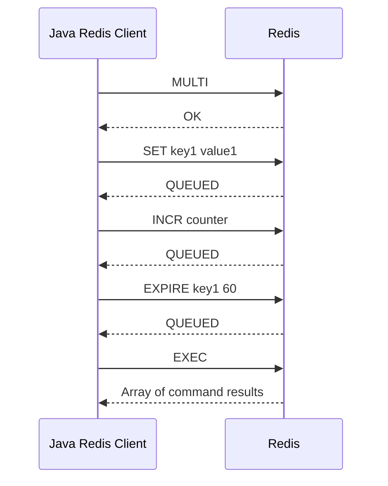
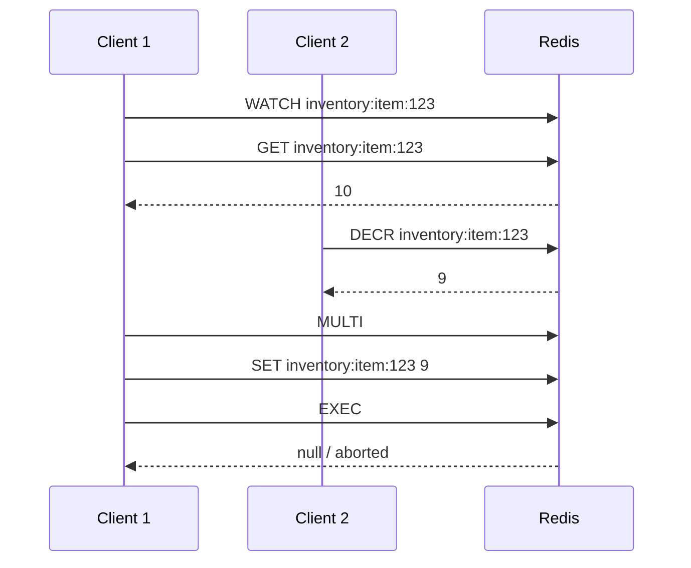
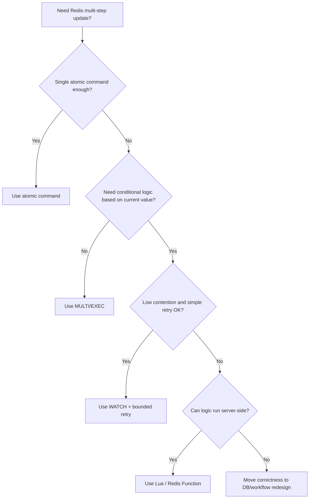

# Part 032 — Redis Transactions and Optimistic Locking

Redis memiliki transaksi, tetapi transaksi Redis **bukan transaksi RDBMS**.

Ini poin paling penting:

> Redis transaction memberi atomic execution terhadap batch command, tetapi tidak memberi rollback semantic seperti PostgreSQL transaction.

Untuk engineer Java/JAX-RS yang terbiasa dengan `@Transactional`, PostgreSQL, MyBatis/JDBC, dan ACID transaction, Redis transaction harus dipahami dengan hati-hati.

Redis menyediakan beberapa primitive:

- `MULTI`
- `EXEC`
- `DISCARD`
- `WATCH`
- `UNWATCH`
- pipeline
- Lua scripting
- Redis Functions
- atomic single command

Masing-masing punya tempat sendiri.

---

## 1. Core Mental Model

Redis command individual umumnya atomic.

Contoh:

```redis
INCR counter:tenant:42
```

Command itu atomic.
Tidak ada dua client yang dapat membuat update `INCR` saling menimpa.

Namun jika workflow membutuhkan beberapa command:

```redis
GET account:42:balance
SET account:42:balance 90
SET account:42:last-updated 2026-07-11T10:00:00Z
```

Maka tanpa transaction/script, client lain bisa menyisipkan command di antara langkah-langkah tersebut.

Redis transaction membantu mengirim beberapa command agar dieksekusi berurutan tanpa interleaving command lain saat `EXEC` berjalan.

---

## 2. Redis Transaction Is Not RDBMS Transaction

Perbandingan penting:

| Aspect | PostgreSQL Transaction | Redis MULTI/EXEC |
|---|---|---|
| Isolation | Stronger, configurable | Commands queued then executed sequentially |
| Rollback | Yes | No rollback for runtime command failure |
| Constraint checking | Rich constraints | Application/command-level only |
| Query model | SQL relational | Key-command based |
| Multi-row consistency | Native | Manual key design |
| Durability | WAL-backed | Depends on Redis persistence config |
| Transaction duration | Can span reads/writes before commit | Commands queued; WATCH can guard changes |
| Error behavior | Can rollback | Some errors happen at queue time, some at exec time |

Redis transaction is closer to:

> Queue these Redis commands and execute them together.

Not:

> Run an ACID business transaction with rollback and constraint enforcement.

---

## 3. MULTI / EXEC Lifecycle

Basic lifecycle:



During `MULTI`, commands are queued.
They are not executed immediately.
They execute when `EXEC` is called.

Example:

```redis
MULTI
SET cache:quote:123 "payload"
EXPIRE cache:quote:123 300
INCR stats:cache-fill:quote
EXEC
```

Result:

```text
1) OK
2) 1
3) 42
```

---

## 4. DISCARD

`DISCARD` clears queued commands before `EXEC`.

```redis
MULTI
SET key value
INCR counter
DISCARD
```

Nothing is executed.

In Java service code, `DISCARD` matters when application code decides not to continue before `EXEC`.

But in practice, many Java clients wrap this in transaction APIs.
Always check whether the client automatically discards on exception before `EXEC`.

---

## 5. Error Semantics

Redis transaction error behavior has two broad categories.

### 5.1 Queue-time error

If a command cannot be queued because syntax is wrong or command is invalid, Redis can mark transaction as dirty and `EXEC` may fail.

Example:

```redis
MULTI
SET key value
INVALIDCOMMAND something
EXEC
```

### 5.2 Exec-time error

If command is syntactically valid but fails when executed, Redis does not rollback previous successful commands in the transaction.

Example:

```redis
SET mykey "not-a-list"
MULTI
SET another-key "ok"
LPUSH mykey "x"
INCR counter
EXEC
```

`LPUSH mykey` may fail because `mykey` is string, but other commands can still execute.

This is where Redis differs sharply from RDBMS transaction.

### Practical implication

Do not design Redis MULTI/EXEC assuming all-or-nothing rollback for all command failures.

Use:

- type-safe key design;
- validation before transaction;
- Lua for conditional atomic logic;
- separate recovery path;
- idempotent updates.

---

## 6. WATCH / UNWATCH Mental Model

`WATCH` provides optimistic locking.

It observes one or more keys.
If any watched key changes before `EXEC`, transaction aborts.

Lifecycle:



`EXEC` returns null/empty abort signal because watched key changed.

This is compare-and-set style concurrency control.

---

## 7. Optimistic Locking Pattern

Use case:

- update value only if no one else changed it;
- conditional cache metadata update;
- quota update with custom logic;
- simple state transition;
- versioned config update;
- bounded counter with read-modify-write.

Generic pattern:

```text
WATCH key
READ key
COMPUTE new value
MULTI
WRITE key new value
EXEC
IF EXEC aborted: retry or fail
```

Pseudo-code:

```java
for (int attempt = 0; attempt < maxAttempts; attempt++) {
    redis.watch(key);

    String current = redis.get(key);
    Decision decision = compute(current);

    if (!decision.shouldUpdate()) {
        redis.unwatch();
        return decision.toResult();
    }

    Transaction tx = redis.multi();
    tx.set(key, decision.newValue());
    tx.expire(key, ttlSeconds);

    List<Object> result = tx.exec();
    if (result != null) {
        return Result.updated();
    }

    backoff(attempt);
}

throw new ConcurrentModificationException("Redis optimistic update failed after retries");
```

Do not retry forever.

---

## 8. Compare-and-Set Example: Versioned Config Cache

Suppose Redis stores config payload with version.

```json
{
  "version": 17,
  "payload": {
    "featureX": true
  }
}
```

We only want to update if incoming version is newer.

With WATCH:

1. `WATCH config:tenant:42`
2. `GET config:tenant:42`
3. parse version
4. if incoming version <= current version, `UNWATCH` and skip
5. `MULTI`
6. `SET config:tenant:42 incomingPayload EX 300`
7. `EXEC`
8. retry if aborted

This prevents stale event from overwriting newer cache, assuming all writers use the same protocol.

However, Lua is usually better for this because the compare and write can happen server-side in one atomic script.

---

## 9. Transaction with TTL

TTL is part of correctness.

Bad:

```redis
MULTI
SET idem:req-123 "PROCESSING"
EXEC
```

This creates a key without expiry.
If the worker dies, marker may remain forever.

Better:

```redis
MULTI
SET idem:req-123 "PROCESSING"
EXPIRE idem:req-123 900
EXEC
```

Even better:

```redis
SET idem:req-123 "PROCESSING" NX EX 900
```

A single atomic command is preferable when enough.

### Rule

> Prefer one atomic command over transaction when the command supports the needed semantics.

Examples:

- `SET key value NX EX seconds`
- `INCR`
- `HINCRBY`
- `ZADD NX`
- `SADD`

---

## 10. Transaction with Pipeline

Pipelining and transactions are different.

Pipeline:

- reduces network round trips;
- does not imply atomic grouping;
- server executes commands in order received, but other clients may interleave between batches depending on protocol/client behavior.

Transaction:

- queues commands after `MULTI`;
- executes batch on `EXEC` without interleaving during execution;
- does not rollback all runtime errors.

Some clients expose transaction through pipeline-like API.
Do not confuse the two.

### Example distinction

Pipeline for performance:

```text
MGET many independent keys
```

Transaction for atomic grouped update:

```text
SET value + EXPIRE + INCR metric as one EXEC batch
```

WATCH for optimistic read-modify-write:

```text
Read current, compute, update only if unchanged
```

Lua for conditional multi-command atomic logic:

```text
If current version < incoming version, set value and TTL
```

---

## 11. Race Condition Examples

### 11.1 Non-atomic GET then SET

Bad:

```java
String count = redis.get(key);
int next = Integer.parseInt(count) + 1;
redis.set(key, String.valueOf(next));
```

Two clients can read same value and overwrite each other.

Better:

```redis
INCR key
```

### 11.2 Non-atomic SET then EXPIRE

Bad:

```redis
SET rate:user:42 1
EXPIRE rate:user:42 60
```

If client crashes after `SET` before `EXPIRE`, key may persist forever.

Better:

```redis
SET rate:user:42 1 EX 60
```

For first increment fixed window, use Lua if you need `INCR` + conditional `EXPIRE` atomically.

### 11.3 Read-modify-write object cache

Bad:

```text
GET hash/json object
modify field in app
SET full object
```

Concurrent update can lose another field update.

Options:

- use Redis hash field update if suitable;
- use WATCH retry;
- use Lua;
- move canonical update to PostgreSQL;
- use versioned payload.

---

## 12. Lua vs MULTI/EXEC vs WATCH

| Need | Prefer |
|---|---|
| Single atomic command exists | Single command |
| Batch independent writes atomically queued | MULTI/EXEC |
| Read-modify-write with low contention | WATCH + retry |
| Conditional logic must be atomic server-side | Lua / Redis Function |
| High contention counter | Atomic command or Lua |
| Complex business transaction | PostgreSQL / durable workflow |
| Cross-key cluster operation | Careful key hash tags or avoid |

Lua is often better for:

- rate limiter;
- safe unlock;
- idempotency state transition;
- semaphore acquire;
- versioned cache update;
- queue claim;
- compare-and-set with TTL.

WATCH can be okay when:

- contention is low;
- operation is simple;
- retry is acceptable;
- client library support is clean;
- cluster key locality is clear.

---

## 13. Cluster Considerations

Redis Cluster complicates transactions.

Multi-key operations must generally target keys in the same hash slot.

Example cross-slot problem:

```redis
MULTI
SET cache:tenant:42:quote:123 "..."
INCR stats:tenant:42:cache-fill
EXEC
```

These keys may land in different slots.

Use hash tags if the operation must be same slot:

```text
cache:{tenant:42}:quote:123
stats:{tenant:42}:cache-fill
```

But do not overuse hash tags, because they can create hot slots.

### Review questions

- Is Redis Cluster enabled?
- Do all transaction keys share a hash slot?
- Is hash tag strategy documented?
- Could this create a hot slot per tenant?
- Does the Java client handle MOVED/ASK properly?

---

## 14. Java Client Behavior

Different Redis Java clients expose transactions differently.

Verify behavior for:

- connection pinning during transaction;
- WATCH state bound to connection;
- transaction object lifecycle;
- automatic DISCARD on exception;
- cluster transaction restrictions;
- async/reactive transaction semantics;
- timeout behavior while transaction is open;
- connection pool contamination if transaction not closed properly.

### Important

WATCH/MULTI usually requires commands to use the same connection.
If a wrapper hides connection handling badly, optimistic locking may not work as expected.

In pooled clients, always ensure:

- transaction connection is returned cleanly;
- WATCH is cleared via EXEC/DISCARD/UNWATCH;
- exceptions do not leak watched state;
- transaction operations are not mixed across threads.

---

## 15. JAX-RS Service Boundary

Do not expose Redis transaction mechanics at resource boundary.

Bad:

```java
@POST
@Path("/config")
public Response updateConfig(ConfigUpdate update) {
    redis.watch(key);
    // parse, validate, update, exec here
    return Response.ok().build();
}
```

Better:

```java
@POST
@Path("/config")
public Response updateConfig(ConfigUpdate update) {
    ConfigUpdateResult result = configService.updateTenantConfig(update);
    return responseMapper.toResponse(result);
}
```

The service layer should own:

- retry policy;
- conflict mapping;
- timeout budget;
- fallback;
- metric emission;
- validation;
- Redis transaction details.

JAX-RS layer should map outcome to HTTP.

Possible HTTP mappings:

| Internal Result | HTTP |
|---|---|
| Update success | 200 / 204 |
| Version conflict | 409 Conflict |
| Too much contention | 409 / 503 depending use case |
| Redis timeout | 503 or degraded response |
| Validation error | 400 |
| Unauthorized config update | 403 |

---

## 16. PostgreSQL/MyBatis/JDBC Interaction

The most dangerous mistake is assuming Redis transaction and PostgreSQL transaction are one transaction.

They are not.

Example risky workflow:

```text
1. Redis MULTI/EXEC marks request processed
2. PostgreSQL insert order fails
3. API retries
4. Redis says already processed
5. Order is missing
```

Reverse risky workflow:

```text
1. PostgreSQL commit succeeds
2. Redis transaction fails
3. API retries
4. Duplicate work may happen
```

### Safer model

- PostgreSQL owns business state.
- Redis accelerates coordination/cache/idempotency.
- Use DB transaction for irreversible state transition.
- Use Redis transaction for Redis-local consistency.
- Use outbox/reconciliation for cross-system update.

### Example with DB state guard

```sql
UPDATE quote_order
SET status = 'SUBMITTED', version = version + 1
WHERE id = :quoteId
  AND status = 'DRAFT'
  AND version = :expectedVersion;
```

Redis can cache or coordinate, but DB ensures valid transition.

---

## 17. Messaging Interaction: Kafka/RabbitMQ

Redis transactions are sometimes used inside consumers.

Example:

- consume event;
- update cache;
- update dedupe marker;
- ack message.

Risk:

```text
Redis EXEC succeeds, consumer crashes before broker ack.
Broker redelivers message.
Consumer sees Redis marker and skips.
```

This can be okay if marker means event was fully applied.
It is dangerous if Redis marker was written before all side effects completed.

### Safer event processing order

For cache projection:

1. consume event;
2. validate version/order;
3. update Redis projection atomically if event is newer;
4. ack broker;
5. tolerate redelivery by version check/idempotency.

For DB side effect:

1. consume event;
2. perform DB idempotent update;
3. update Redis cache/invalidation;
4. ack broker;
5. reconcile if Redis update fails.

---

## 18. Optimistic Retry Policy

WATCH-based retry must be bounded.

Recommended controls:

- max attempts;
- exponential or jittered backoff;
- timeout budget;
- metric for retry count;
- fallback after contention;
- clear error mapping.

Pseudo-policy:

```text
maxAttempts = 3
baseBackoff = 10ms
maxTotalTime = 100ms
onAbort = retry with jitter
onTimeout = fail fast/degrade
onContentionExceeded = return conflict or enqueue async
```

High abort rate means the design may be wrong.

Consider:

- atomic command;
- Lua;
- sharding key;
- reducing write contention;
- moving state transition to PostgreSQL;
- redesigning data model.

---

## 19. Observability

Expose metrics for Redis transaction paths.

Useful metrics:

```text
redis_transaction_exec_total{operation="config_update", outcome="success"}
redis_transaction_exec_total{operation="config_update", outcome="aborted"}
redis_transaction_exec_total{operation="config_update", outcome="error"}
redis_transaction_retry_total{operation="config_update"}
redis_transaction_latency_ms{operation="config_update"}
redis_watch_conflict_total{keyspace="config"}
```

Logs should include:

- operation name;
- key pattern, not full sensitive key;
- attempt count;
- EXEC outcome;
- abort reason if known;
- latency;
- correlation ID;
- fallback decision.

Avoid logging payload values if they contain PII, token, session data, or business-sensitive data.

---

## 20. Performance Concerns

Redis transactions are fast, but misuse can hurt production.

Risks:

- long transaction queue;
- large payload writes;
- high WATCH abort rate;
- contention hot key;
- cluster hot slot;
- transaction held while app does slow work;
- connection pinned too long;
- excessive retries;
- mixing blocking commands;
- no timeout.

Important rule:

> Do not WATCH a key, then perform slow database/network call before EXEC.

Bad lifecycle:

```text
WATCH key
GET key
Call PostgreSQL / external API for 1 second
MULTI
SET key
EXEC
```

During that time, conflict probability increases and connection resources may be held.

Compute quickly, execute quickly, release connection quickly.

---

## 21. Security and Privacy Concerns

Transactions often update sensitive keyspaces.

Review:

- Are keys free from PII?
- Does ACL allow only required commands?
- Can service call `MULTI/EXEC/WATCH` only on allowed key patterns?
- Are dangerous commands excluded?
- Are payloads encrypted or tokenized if sensitive?
- Are transaction errors logging sensitive values?
- Are config updates audited outside Redis?

For operational config/security state, Redis update should not be the only audit record.

---

## 22. Common Anti-Patterns

### Anti-pattern 1: Using MULTI/EXEC as business transaction

Redis transaction does not replace PostgreSQL transaction.

### Anti-pattern 2: GET-modify-SET without WATCH/Lua

Concurrent updates can be lost.

### Anti-pattern 3: SET then EXPIRE

Crash between commands creates immortal key.
Prefer `SET EX` or transaction/Lua where needed.

### Anti-pattern 4: WATCH around slow work

Contention and connection pinning increase.

### Anti-pattern 5: Infinite optimistic retry

Can amplify incidents.

### Anti-pattern 6: Cross-slot transaction in Redis Cluster

Fails or behaves differently than expected.

### Anti-pattern 7: Assuming rollback on command failure

Redis does not rollback successful commands inside EXEC due to later runtime error.

### Anti-pattern 8: Not clearing WATCH on exception

Can contaminate pooled connection behavior.

---

## 23. Decision Framework

Ask this before choosing Redis transaction:



---

## 24. Production Debugging Playbook

Symptom: transaction abort rate high.

Check:

- hot key contention;
- too many writers;
- WATCH held too long;
- retry storm;
- rolling deployment behavior;
- cluster slot distribution;
- client connection pool saturation.

Symptom: key missing TTL.

Check:

- code path using `SET` without `EX`;
- transaction abort before `EXPIRE`;
- exec-time error;
- multiple writers overwriting TTL;
- use of `PERSIST` or plain `SET` clearing TTL depending command options.

Symptom: stale cache overwritten.

Check:

- version comparison missing;
- out-of-order event;
- WATCH not used correctly;
- all writers not following same protocol;
- Redis Cluster cross-slot issue;
- Lua script bug.

Symptom: pool exhaustion.

Check:

- transaction connection leaked;
- WATCH not cleared;
- slow code between WATCH and EXEC;
- retries too aggressive;
- Redis latency spike.

---

## 25. PR Review Checklist

When reviewing Redis transaction/optimistic locking code, check:

- Is Redis transaction being confused with DB transaction?
- Is single atomic command sufficient instead?
- Is `SET EX/NX/XX` used where appropriate?
- Is `WATCH` used only with bounded retry?
- Is `UNWATCH`/cleanup guaranteed on early exit?
- Is transaction connection safely returned to pool?
- Is slow work avoided between WATCH and EXEC?
- Is there a max retry and backoff?
- Is cluster hash slot compatibility considered?
- Is Lua more appropriate?
- Are TTL updates atomic with value updates?
- Are exec-time errors handled?
- Are metrics emitted for success/abort/error/retry?
- Are payloads and logs privacy-safe?
- Is PostgreSQL still responsible for business correctness?
- Is Kafka/RabbitMQ redelivery behavior safe?

---

## 26. Internal Verification Checklist

Verify in internal codebase and team discussions:

- Whether Redis transactions are used directly.
- Whether `WATCH/MULTI/EXEC` appears in code.
- Whether Redisson/Lettuce/Jedis transaction APIs are used.
- Whether Lua scripts replaced transaction logic.
- Whether transaction keys are cluster-compatible.
- Whether connection pool handles transaction connection pinning safely.
- Whether retry policies are bounded.
- Whether transaction code appears inside JAX-RS resource classes.
- Whether TTL is set atomically with transient keys.
- Whether event consumers use Redis transaction markers.
- Whether DB transaction and Redis transaction boundaries are documented.
- Whether observability exists for transaction aborts/errors.
- Whether any incident involved stale cache overwrite, lost update, or transaction retry storm.

---

## 27. Summary

Redis transactions are useful, but narrow.

Use them for Redis-local grouped writes.
Use WATCH for optimistic locking when contention is low and retry is acceptable.
Use Lua/Redis Functions for atomic conditional logic.
Use PostgreSQL for business-critical ACID state transitions.
Use Kafka/RabbitMQ semantics for durable messaging.

The senior-engineer boundary is this:

> Redis transaction can protect Redis command sequencing. It cannot magically make distributed business workflows transactional.

When in doubt, keep Redis transaction small, bounded, observable, and subordinate to the real source of truth.
