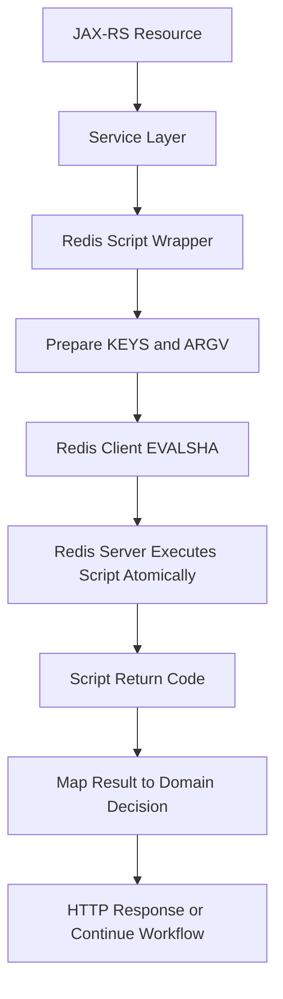

# Part 033 — Lua Scripting and Redis Functions

Redis Lua scripting adalah cara menjalankan **multi-step Redis logic secara atomic di sisi server**.

Ini bukan fitur untuk membuat Redis menjadi application server.
Ini adalah primitive untuk kasus kecil, tajam, dan correctness-sensitive ketika beberapa command harus dieksekusi tanpa interleaving dari client lain.

Contoh use case yang umum:

- safe unlock untuk distributed lock
- rate limiter atomic
- idempotency state transition
- conditional cache update
- queue claim/retry logic sederhana
- counter dengan TTL yang harus konsisten
- compare-and-set dengan beberapa key

Untuk sistem Java/JAX-RS enterprise, Lua script sering muncul ketika logic Redis biasa terlalu rentan race condition, tetapi PostgreSQL transaction atau broker durable terlalu berat untuk path tertentu.

---

## 1. Core Mental Model

Redis mengeksekusi Lua script sebagai satu unit atomic terhadap Redis server.

Artinya:

```text
client A command sebelum script
script berjalan penuh
client B command setelah script
```

Selama script berjalan, command lain tidak akan disisipkan di tengah script.

Ini memberi atomicity untuk operasi seperti:

```text
read key
compare value
modify key
set ttl
return decision
```

Tanpa script, operasi tersebut biasanya butuh beberapa round trip dari Java client ke Redis dan dapat disisipkan oleh request lain.

---

## 2. Why Lua Exists in Redis

Lua scripting ada karena Redis command individual memang atomic, tetapi workflow aplikasi sering membutuhkan atomicity lebih dari satu command.

Contoh masalah sederhana:

```redis
INCR rate:user:123:/quote
EXPIRE rate:user:123:/quote 60
```

Jika service crash setelah `INCR` tetapi sebelum `EXPIRE`, key bisa menjadi persistent counter tanpa TTL.

Dengan Lua, dua operasi itu bisa dipaketkan:

```lua
local current = redis.call('INCR', KEYS[1])
if current == 1 then
  redis.call('EXPIRE', KEYS[1], ARGV[1])
end
return current
```

Atomicity ini bukan hanya soal performance.
Ini soal correctness.

---

## 3. EVAL, EVALSHA, and Script Cache

Redis menyediakan beberapa cara menjalankan script.

| Mechanism | Purpose |
|---|---|
| `EVAL` | Kirim script lengkap dan eksekusi langsung |
| `SCRIPT LOAD` | Load script ke cache Redis dan dapatkan SHA |
| `EVALSHA` | Eksekusi script berdasarkan SHA yang sudah di-cache |
| `SCRIPT EXISTS` | Cek apakah SHA masih ada di cache |
| `SCRIPT FLUSH` | Menghapus script cache, biasanya operation-sensitive |

Di aplikasi Java production, pola umum adalah:

1. script disimpan sebagai artifact di repo
2. service load script saat startup atau lazy-load
3. service menjalankan `EVALSHA`
4. jika SHA tidak dikenal, fallback load ulang lalu retry sekali

Jangan memperlakukan script sebagai string ad-hoc yang tersebar di banyak class.
Script harus punya owner, nama, versi, test, dan observability.

---

## 4. KEYS vs ARGV Discipline

Redis Lua membedakan `KEYS` dan `ARGV`.

Gunakan:

```text
KEYS = nama key Redis yang diakses script
ARGV = parameter non-key seperti TTL, limit, token, timestamp, payload
```

Contoh:

```lua
-- KEYS[1] = lock key
-- ARGV[1] = expected lock value

if redis.call('GET', KEYS[1]) == ARGV[1] then
  return redis.call('DEL', KEYS[1])
else
  return 0
end
```

Kenapa ini penting?

- Redis Cluster perlu tahu key yang disentuh script.
- Key harus jelas untuk routing dan hash slot.
- Parameter seperti TTL, token, dan payload tidak boleh dimasukkan sebagai key.
- Script menjadi lebih mudah diuji dan direview.

Anti-pattern:

```lua
-- buruk: membangun key secara penuh dari ARGV tanpa mendeklarasikan key di KEYS
local k = 'tenant:' .. ARGV[1] .. ':rate:' .. ARGV[2]
return redis.call('INCR', k)
```

Untuk Redis Cluster, pattern seperti ini bisa menyulitkan correctness dan routing.

---

## 5. Lua Atomicity Boundary

Lua script atomic terhadap Redis command execution.

Tetapi Lua script **tidak atomic terhadap dunia luar**.

Script tidak membuat hal berikut menjadi atomic:

- Redis update + PostgreSQL commit
- Redis update + Kafka publish
- Redis update + RabbitMQ ack
- Redis lock + external HTTP call
- Redis idempotency marker + downstream payment/order action

Jangan menyimpulkan:

> Karena Redis Lua atomic, maka seluruh business operation atomic.

Yang benar:

> Redis Lua hanya memberi atomicity pada operasi Redis yang dijalankan di dalam script.

Untuk sistem quote/order/CPQ, ini sangat penting. Banyak workflow menyentuh PostgreSQL, broker, external system, dan Redis. Lua hanya mengunci boundary Redis, bukan boundary business transaction lintas sistem.

---

## 6. Script Lifecycle from Java/JAX-RS Request

Lifecycle umum:



Hal yang harus dijaga:

- script wrapper harus typed dan tidak menyebar string command mentah
- timeout harus lebih kecil dari request timeout
- return code script harus jelas
- error mapping harus deterministic
- script failure tidak boleh membuat business state ambigu tanpa logging/correlation id

---

## 7. Safe Unlock Script for Redis Lock

Distributed lock Redis minimal harus memakai unique lock value.

Acquire:

```redis
SET lock:quote:123 random-token NX PX 30000
```

Release tidak boleh hanya:

```redis
DEL lock:quote:123
```

Karena lock bisa sudah expired lalu diambil oleh client lain.
Client lama bisa menghapus lock milik client baru.

Safe unlock:

```lua
if redis.call('GET', KEYS[1]) == ARGV[1] then
  return redis.call('DEL', KEYS[1])
else
  return 0
end
```

Interpretasi return:

| Return | Meaning |
|---|---|
| `1` | Lock released by owner |
| `0` | Lock missing or not owned by caller |

Untuk Java service, `0` bukan selalu error fatal.
Bisa berarti lease sudah expired, operation sudah selesai telat, atau lock sudah berpindah ownership.

---

## 8. Fixed Window Rate Limiter Script

Contoh fixed window limiter yang menjaga `INCR` dan TTL tetap atomic:

```lua
-- KEYS[1] = rate limit key
-- ARGV[1] = window seconds
-- ARGV[2] = max requests

local current = redis.call('INCR', KEYS[1])

if current == 1 then
  redis.call('EXPIRE', KEYS[1], ARGV[1])
end

if current > tonumber(ARGV[2]) then
  return {0, current, redis.call('TTL', KEYS[1])}
else
  return {1, current, redis.call('TTL', KEYS[1])}
end
```

Return convention:

| Field | Meaning |
|---|---|
| allowed | `1` allowed, `0` rejected |
| current | current request count |
| ttl | seconds until reset |

Java/JAX-RS layer dapat memetakan hasil ke:

- HTTP 200/201 jika allowed
- HTTP 429 jika rejected
- `Retry-After` header dari TTL
- structured log untuk tenant/user/endpoint

---

## 9. Sliding Window with Sorted Set Script

Untuk limiter lebih presisi, sorted set sering dipakai.

Pattern:

1. remove old entries
2. count current window
3. if under limit, add current request
4. set expiry
5. return decision

Pseudo-script:

```lua
-- KEYS[1] = zset key
-- ARGV[1] = now millis
-- ARGV[2] = window millis
-- ARGV[3] = max requests
-- ARGV[4] = unique request member
-- ARGV[5] = key ttl seconds

local now = tonumber(ARGV[1])
local window_start = now - tonumber(ARGV[2])

redis.call('ZREMRANGEBYSCORE', KEYS[1], 0, window_start)

local count = redis.call('ZCARD', KEYS[1])

if count >= tonumber(ARGV[3]) then
  return {0, count, redis.call('PTTL', KEYS[1])}
end

redis.call('ZADD', KEYS[1], now, ARGV[4])
redis.call('EXPIRE', KEYS[1], ARGV[5])

return {1, count + 1, redis.call('PTTL', KEYS[1])}
```

Correctness concern:

- `ARGV[4]` harus unik per request agar request pada timestamp sama tidak overwrite member.
- cleanup harus terjadi tiap eksekusi atau via background cleanup.
- clock source harus konsisten.
- memory growth harus dimonitor.

---

## 10. Idempotency State Transition Script

Idempotency store sering butuh state transition atomic.

Contoh state:

```text
PROCESSING -> COMPLETED
PROCESSING -> FAILED_RETRYABLE
PROCESSING -> FAILED_FINAL
```

Masalah yang ingin dicegah:

- dua request sama-sama membuat `PROCESSING`
- request fingerprint berbeda memakai idempotency key yang sama
- response completed tertimpa oleh duplicate request
- TTL hilang saat update state

Script bisa melakukan:

1. read current record
2. validate fingerprint
3. validate current state
4. transition state
5. preserve or set TTL
6. return deterministic result

Pseudo-return:

| Code | Meaning |
|---|---|
| `CREATED_PROCESSING` | request pertama boleh lanjut |
| `DUPLICATE_PROCESSING` | request lain sedang berjalan |
| `REPLAY_COMPLETED` | kembalikan cached response |
| `FINGERPRINT_MISMATCH` | idempotency key disalahgunakan |
| `STATE_CONFLICT` | transisi tidak valid |

Di Java/JAX-RS, return code ini harus dipetakan ke behavior API yang eksplisit, bukan exception generik.

---

## 11. Redis Functions Awareness

Redis Functions menyediakan cara lebih terstruktur untuk menyimpan dan menjalankan logic di Redis dibanding script ad-hoc.

Mental model:

- script bisa dikirim via `EVAL`/`EVALSHA`
- function disimpan sebagai library di Redis
- function dapat dipanggil dengan `FCALL`
- function lebih cocok untuk logic yang ingin dikelola sebagai artifact server-side

Namun untuk enterprise system, Redis Functions membawa pertanyaan operasional:

- bagaimana deployment function dilakukan?
- bagaimana versioning function?
- bagaimana rollback?
- bagaimana compatibility dengan managed Redis/Redis-compatible service?
- bagaimana akses production dibatasi?
- bagaimana testing function dilakukan di CI?

Jangan memakai Redis Functions hanya karena terlihat lebih modern.
Pilih jika operational lifecycle-nya jelas.

---

## 12. Script Determinism and Replication Considerations

Script sebaiknya deterministic.

Hindari logic yang bergantung pada hal yang tidak jelas atau tidak repeatable tanpa alasan kuat.

Contoh concern:

- random value di dalam script
- waktu dari client yang tidak konsisten
- command mahal yang memblok Redis terlalu lama
- hasil yang bergantung pada key yang tidak dideklarasikan jelas
- script yang melakukan loop atas collection besar

Untuk time-based logic, pilih dengan sadar:

| Clock source | Trade-off |
|---|---|
| App time dari Java | Konsisten dengan request context, tapi rentan clock skew antar pod |
| Redis `TIME` | Konsisten di server Redis, tapi harus dipanggil di script dan tetap bukan business-time source universal |
| Database time | Cocok jika DB adalah source of truth, tapi menambah dependency |

Untuk rate limiter dan lock, clock decision harus didokumentasikan.

---

## 13. Script Time Limit and Blocking Risk

Lua script berjalan di Redis server thread command execution.

Jika script lambat, Redis lambat untuk semua client.

Jangan lakukan:

- loop terhadap ribuan/jutaan members
- scan keyspace besar dalam script
- memproses payload besar
- menjalankan command O(N) tanpa bound
- membuat script sebagai mini application server

Rule praktis:

> Lua script harus kecil, bounded, predictable, dan mudah direview.

Jika logic terlalu kompleks, pindahkan orchestration ke application layer atau gunakan PostgreSQL/Kafka/RabbitMQ sesuai kebutuhan.

---

## 14. Return Code Design

Script production harus punya return contract yang stabil.

Buruk:

```text
return nil / random string / raw Redis error
```

Lebih baik:

```text
return {code, numeric_value, ttl, optional_payload}
```

Contoh:

```text
{1, 42, 58}
```

Lalu Java wrapper memetakan:

```text
1 -> ALLOWED
0 -> REJECTED
-1 -> FINGERPRINT_MISMATCH
-2 -> STATE_CONFLICT
```

Return code harus terdokumentasi dekat dengan script dan test.

---

## 15. Java Client Integration Pattern

Struktur wrapper yang sehat:

```text
RateLimiterRedisScript
  - scriptName
  - scriptSha
  - loadScript()
  - execute(keys, args)
  - parseResult(raw)
  - mapToDomainDecision()
```

Jangan biarkan resource JAX-RS memanggil `EVAL` langsung.

Boundary yang disarankan:

```text
JAX-RS Resource
  -> Application Service
    -> Domain/Use Case Service
      -> Redis Gateway / Repository / Adapter
        -> Script Wrapper
```

Keuntungan:

- test lebih mudah
- retry/fallback terkendali
- observability konsisten
- script return code tidak bocor ke HTTP layer
- dependency Redis bisa diganti/mock pada unit test

---

## 16. Script Versioning

Script adalah production artifact.

Minimal metadata yang perlu ada:

```text
name: rate-limit-sliding-window
version: 2026-07-11.1
owner: backend-platform-or-service-team
keys: [rate-limit key]
args: [nowMillis, windowMillis, maxRequests, member, ttlSeconds]
return: [allowed, currentCount, pttl]
```

Versioning penting karena:

- rolling deployment bisa menjalankan dua versi service
- Redis script cache bisa flush
- managed Redis failover bisa menyebabkan script perlu reload
- return format berubah dapat merusak parser Java
- bug script bisa berdampak sistemik

---

## 17. Testing Lua Scripts

Test yang sebaiknya ada:

| Test type | Purpose |
|---|---|
| Unit-like script test | Validasi return code dan state Redis |
| Integration test dengan Redis/Testcontainers | Validasi behavior Redis nyata |
| Concurrency test | Validasi race condition yang ingin dicegah |
| TTL test | Validasi expiry tetap terpasang |
| Error test | Validasi invalid args dan missing key |
| Compatibility test | Validasi parser Java terhadap return format |
| Performance smoke test | Validasi script tidak lambat secara tidak wajar |

Untuk idempotency/lock/rate limiter, test concurrency bukan nice-to-have.
Itu bagian dari correctness.

---

## 18. Failure Modes

| Failure mode | Impact | Typical cause |
|---|---|---|
| `NOSCRIPT` | Script gagal di runtime | script cache hilang/failover/flush |
| Script timeout | Redis latency spike | loop/command mahal |
| Wrong KEYS/ARGV | Cross-slot/error/corrupt state | wrapper bug |
| Return parser mismatch | Java exception | script version berubah |
| Missing TTL | memory leak-like growth | script lupa expire |
| Unsafe unlock | lock client lain terhapus | unlock tanpa compare value |
| Over-complex script | operational risk | business logic dipindah ke Redis |
| Managed service incompatibility | deployment gagal | command/function tidak didukung |

---

## 19. Detection Signals

Monitor:

- Redis latency spike
- slowlog entries untuk `EVAL`, `EVALSHA`, `FCALL`
- commandstats untuk script-related commands
- application error `NOSCRIPT`
- Redis CPU increase
- timeout Redis client
- key growth pada script-owned keyspace
- rate limiter false reject/false allow
- idempotency state conflict spike
- lock release failure spike

Di Java service, metric penting:

```text
redis.script.execution.count
redis.script.execution.latency
redis.script.error.count
redis.script.noscript.count
redis.script.timeout.count
redis.script.result.code
```

---

## 20. Production-Safe Debugging

Saat script bermasalah:

1. identifikasi script name/version dari log
2. cek apakah error `NOSCRIPT`, timeout, Redis error, atau parser error
3. cek slowlog untuk `EVALSHA`/`FCALL`
4. cek key sample secara terbatas
5. reproduksi dengan Testcontainers atau staging Redis
6. validasi KEYS/ARGV yang dikirim Java wrapper
7. cek apakah ada deployment versi berbeda
8. cek Redis failover/script cache event
9. rollback service/script jika return contract rusak

Hindari:

- menjalankan script ad-hoc di production tanpa review
- `MONITOR` di production high traffic
- scan keyspace besar untuk debugging cepat
- flush script cache tanpa memahami dampak

---

## 21. Trade-Offs

| Option | Good for | Risk |
|---|---|---|
| Atomic command | Simple counter/set/get | Tidak cukup untuk multi-step logic |
| MULTI/EXEC | Batch atomic execution | Tidak punya conditional logic kaya dan rollback RDBMS |
| WATCH | Optimistic CAS | Retry complexity di client |
| Lua script | Atomic conditional logic | Blocking Redis jika lambat/kompleks |
| Redis Functions | Managed server-side library | Lifecycle/deployment/compatibility lebih berat |
| PostgreSQL transaction | Strong DB correctness | Latency/coupling lebih tinggi |
| Kafka/RabbitMQ | Durable async workflow | Tidak cocok untuk synchronous atomic Redis decision |

---

## 22. Correctness Concerns

Tanyakan:

- Atomicity yang dibutuhkan hanya di Redis atau lintas Redis + DB/broker?
- Apakah semua key yang disentuh berada pada slot yang benar di Redis Cluster?
- Apakah script memasang TTL pada key ephemeral?
- Apakah return code dapat diproses deterministic oleh Java layer?
- Apakah duplicate request menghasilkan state yang sama?
- Apakah script aman saat retry client terjadi?
- Apakah script idempotent atau dapat dijalankan ulang dengan aman?

---

## 23. Concurrency Concerns

Script sering dipakai untuk menyelesaikan race condition.
Tetapi script juga bisa membuat bottleneck.

Perhatikan:

- script atomic berarti command lain menunggu
- script lambat memperburuk tail latency semua client
- high-cardinality limiter script bisa menambah CPU/memory
- lock script harus menangani lease expiry
- idempotency script harus menangani duplicate concurrent request

Concurrency correctness harus diuji dengan parallel test, bukan hanya dibaca secara mental.

---

## 24. Performance Concerns

Checklist performance:

- command dalam script bounded?
- tidak ada loop besar?
- tidak ada operasi terhadap big key?
- return payload kecil?
- script latency diukur?
- script dipanggil di hot path?
- script menyebabkan Redis CPU tinggi?
- Java client timeout realistis?
- pipeline tidak mencampur script lambat dengan command penting lain?

Script kecil bisa sangat cepat.
Script kompleks bisa membuat Redis menjadi single choke point.

---

## 25. Security and Privacy Concerns

Script bisa menyentuh key sensitif.

Review:

- apakah script dapat membaca key di luar namespace service?
- apakah ACL membatasi command `EVAL`/`FCALL` sesuai policy?
- apakah parameter mengandung token/PII?
- apakah error log mencetak ARGV sensitif?
- apakah script source mengandung secret? Seharusnya tidak.
- apakah function deployment path diaudit?

Jangan log raw payload idempotency response jika mengandung data customer, token, atau PII.

---

## 26. Observability Concerns

Observability minimal:

- script name
- script version/SHA
- result code
- latency
- timeout count
- error count
- Redis node/endpoint
- affected key prefix, bukan full sensitive key
- correlation ID dari request Java/JAX-RS

Untuk rate limiter:

- allowed/rejected count
- scope: endpoint/user/tenant/IP
- Redis error fallback behavior

Untuk lock:

- acquire success/failure
- release success/failure
- lease expired before release
- renewal failure

Untuk idempotency:

- created processing
- duplicate processing
- replay completed
- fingerprint mismatch
- state conflict

---

## 27. PR Review Checklist

Gunakan checklist ini saat review PR yang menambahkan Lua/Functions:

- [ ] Apakah script benar-benar diperlukan, bukan sekadar premature optimization?
- [ ] Apakah atomicity yang dibutuhkan berada dalam boundary Redis?
- [ ] Apakah KEYS dan ARGV dipakai dengan benar?
- [ ] Apakah compatible dengan Redis Cluster?
- [ ] Apakah script bounded dan tidak loop atas collection besar?
- [ ] Apakah TTL dipasang/preserved untuk key ephemeral?
- [ ] Apakah return code terdokumentasi?
- [ ] Apakah Java parser return code punya test?
- [ ] Apakah ada handling `NOSCRIPT`?
- [ ] Apakah ada timeout dan fallback yang jelas?
- [ ] Apakah ada metrics per script?
- [ ] Apakah script punya versioning?
- [ ] Apakah script diuji dengan Redis nyata/Testcontainers?
- [ ] Apakah sensitive data tidak tercetak di log?
- [ ] Apakah rollback strategy jelas?

---

## 28. Internal Verification Checklist

Cek di codebase dan platform:

- [ ] Apakah ada penggunaan `EVAL`, `EVALSHA`, atau `FCALL`?
- [ ] Di mana script disimpan: inline string, resource file, shared library, atau platform artifact?
- [ ] Apakah setiap script punya owner dan version?
- [ ] Apakah Redis client menangani `NOSCRIPT`?
- [ ] Apakah managed Redis/Redis-compatible service mendukung command yang dipakai?
- [ ] Apakah cluster mode aktif dan script key slot aman?
- [ ] Apakah ACL mengizinkan/membatasi scripting?
- [ ] Apakah script dipakai untuk lock, limiter, idempotency, queue, atau cache update?
- [ ] Apakah ada test concurrency untuk script correctness?
- [ ] Apakah script latency masuk dashboard?
- [ ] Apakah ada incident note terkait script timeout atau Redis high CPU?
- [ ] Apakah ada prosedur rollout/rollback script?

---

## 29. Key Takeaways

- Lua script memberi atomicity untuk multi-command Redis logic.
- Atomicity Lua hanya berlaku di Redis, bukan lintas PostgreSQL, Kafka, RabbitMQ, atau external system.
- Script harus kecil, bounded, versioned, tested, observable, dan punya return contract stabil.
- `KEYS` dan `ARGV` discipline penting untuk correctness, reviewability, dan Redis Cluster.
- Untuk Java/JAX-RS, script harus dibungkus adapter/wrapper yang typed, bukan dipanggil langsung dari resource layer.
- Lua/Functions adalah production artifact, bukan convenience snippet.
