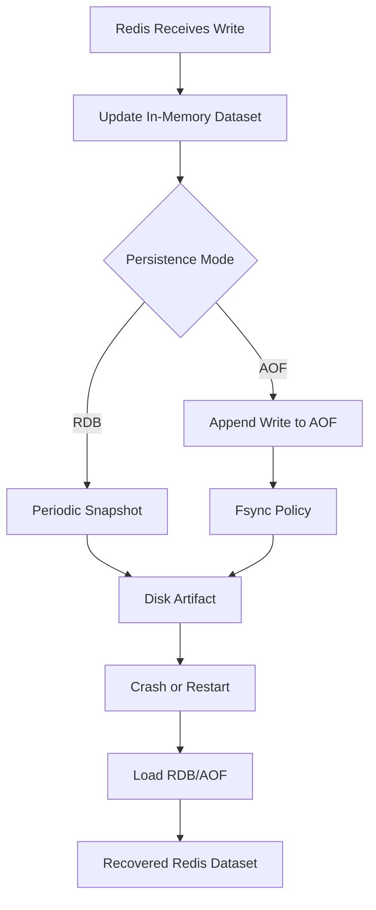

# Part 034 — Persistence: RDB and AOF

Redis dikenal sebagai in-memory data structure server, tetapi Redis juga punya mekanisme persistence.

Persistence Redis sering disalahpahami.

Persistence bukan berarti Redis otomatis setara PostgreSQL.
Persistence juga bukan berarti semua use case Redis aman dijadikan source of truth.

Untuk senior backend engineer, pertanyaan utamanya bukan:

> Apakah Redis bisa persistent?

Pertanyaan yang lebih penting:

> Berapa data loss window yang dapat diterima, dan apa dampaknya terhadap cache, idempotency, lock, stream, queue, session, rate limiter, dan business correctness?

---

## 1. Core Mental Model

Redis menyimpan data aktif di memory.

Persistence adalah mekanisme untuk menulis representasi data Redis ke disk agar Redis dapat melakukan recovery setelah restart/crash.

Dua mekanisme utama:

| Mechanism | Mental model |
|---|---|
| RDB | Snapshot point-in-time dari dataset Redis |
| AOF | Append-only log dari write operation yang dapat diputar ulang |

Keduanya punya trade-off antara:

- durability
- latency
- disk I/O
- recovery time
- data loss window
- operational complexity

---

## 2. Redis Is Still Not PostgreSQL

Walaupun Redis persistence aktif, Redis tetap berbeda dari PostgreSQL.

| Aspect | PostgreSQL | Redis with Persistence |
|---|---|---|
| Primary purpose | Durable relational database | In-memory data structure server dengan optional persistence |
| Query model | SQL, constraints, indexes | Key-command access |
| Transaction model | ACID transaction | Command atomicity, MULTI/EXEC, Lua |
| Durability expectation | Stronger by default | Depends on persistence config |
| Data modeling | Relational/source of truth | Cache/coordination/ephemeral/state primitive |
| Recovery semantics | Database-grade WAL/recovery | RDB/AOF restore with Redis-specific trade-offs |

Jangan menjadikan Redis source of truth hanya karena AOF aktif.
Itu harus menjadi architecture decision eksplisit.

---

## 3. RDB Snapshot

RDB membuat snapshot dataset Redis pada interval tertentu.

Mental model:

```text
Redis memory -> snapshot process -> dump file on disk -> recovery loads snapshot
```

Kelebihan RDB:

- compact
- cepat untuk backup point-in-time
- recovery bisa relatif cepat untuk ukuran tertentu
- overhead runtime bisa lebih rendah dibanding AOF tertentu

Kelemahan RDB:

- data setelah snapshot terakhir bisa hilang
- snapshot besar dapat memengaruhi memory dan I/O
- fork/copy-on-write dapat meningkatkan memory pressure
- tidak cocok jika data loss beberapa menit tidak dapat diterima

Contoh data loss window:

```text
snapshot terakhir: 10:00:00
Redis crash:       10:04:30
recovery:          data kembali ke kondisi 10:00:00
potential loss:    4 menit 30 detik write
```

Untuk cache, ini mungkin acceptable.
Untuk idempotency/payment/order state, ini bisa berbahaya.

---

## 4. AOF Append-Only File

AOF mencatat write operation ke file log.

Mental model:

```text
client write -> Redis memory updated -> write command appended to AOF -> fsync policy decides disk durability
```

Saat restart, Redis replay AOF untuk membangun ulang dataset.

Kelebihan AOF:

- data loss window bisa lebih kecil daripada RDB
- lebih cocok untuk state Redis yang perlu lebih durable
- dapat dikonfigurasi dengan fsync policy

Kelemahan AOF:

- file bisa besar
- perlu rewrite/compaction
- disk I/O lebih tinggi
- recovery bisa lebih lama jika AOF besar
- durability tetap bergantung pada fsync policy

---

## 5. appendfsync Policy

AOF durability dipengaruhi `appendfsync`.

| Policy | Meaning | Trade-off |
|---|---|---|
| `always` | fsync setiap write | durability lebih kuat, latency/I/O tinggi |
| `everysec` | fsync kira-kira tiap detik | umum dipakai, bisa kehilangan sekitar 1 detik write |
| `no` | OS yang menentukan fsync | performa lebih baik, data loss window lebih besar |

Untuk banyak Redis production cache, `everysec` sering menjadi trade-off realistis jika AOF dibutuhkan.
Namun keputusan final harus mengikuti policy platform/SRE dan managed service.

---

## 6. AOF Rewrite

AOF log bisa membesar karena mencatat sequence write.

Contoh:

```redis
INCR counter
INCR counter
INCR counter
```

State akhir cukup direpresentasikan sebagai:

```redis
SET counter 3
```

AOF rewrite membuat representasi yang lebih compact.

Concern:

- rewrite memakai resource CPU/I/O
- copy-on-write dapat meningkatkan memory pressure
- rewrite saat traffic tinggi bisa memperburuk latency
- disk penuh saat rewrite bisa menjadi incident

---

## 7. Persistence Lifecycle

Lifecycle Redis persistence:



Important boundary:

> Redis acknowledges command based on Redis execution semantics, not necessarily because data is durably persisted to disk under every configuration.

---

## 8. Cache-Only Redis

Jika Redis hanya dipakai sebagai cache, persistence bisa jadi tidak diperlukan.

Cache-only Redis berarti:

- source of truth ada di PostgreSQL/service lain
- Redis data boleh hilang
- aplikasi bisa refill cache
- cold start setelah restart bisa menaikkan load database
- cache warming mungkin diperlukan

Failure mode cache-only:

- Redis restart menghapus cache
- hit ratio drop
- PostgreSQL load spike
- latency aplikasi naik
- cache stampede terjadi saat banyak key refill bersamaan

Jadi walaupun data boleh hilang, operational impact tetap nyata.

---

## 9. Redis as Idempotency Store and Persistence Risk

Idempotency store lebih sensitif daripada cache biasa.

Jika Redis menyimpan:

```text
idempotency-key -> COMPLETED + response
```

lalu Redis kehilangan data karena persistence window, duplicate request lama bisa diproses ulang.

Risiko:

- duplicate order submission
- duplicate external call
- duplicate quote transition
- duplicate message publish
- inconsistent client response

Mitigasi:

- gunakan PostgreSQL sebagai authoritative idempotency store untuk operation kritikal
- gunakan Redis sebagai acceleration layer saja
- persist idempotency final state di DB
- pastikan TTL sesuai retry window bisnis
- dokumentasikan data loss impact

---

## 10. Redis Streams and Persistence

Redis Streams terasa seperti durable log-lite, tetapi durability-nya tetap bergantung pada Redis persistence/replication/deployment.

Jika Streams dipakai untuk job queue atau event stream:

- RDB-only bisa kehilangan entries setelah snapshot terakhir
- AOF everysec bisa kehilangan write dalam window kecil
- failover async replication bisa kehilangan acknowledged writes
- trimming bisa menghapus replay history
- pending entry list bisa berubah setelah recovery/failover

Redis Streams bukan Kafka.

Gunakan Streams jika:

- durability requirement terbatas
- operational simplicity lebih penting
- data loss window diterima
- replay retention kecil cukup
- worker queue lokal/service-level acceptable

Gunakan Kafka/RabbitMQ jika durability, routing, retention, replay, DLQ, dan consumer semantics lebih kritikal.

---

## 11. Redis as Job Queue and Persistence Risk

Jika Redis list/stream/sorted set dipakai sebagai job queue, persistence memengaruhi:

- apakah enqueued job bisa hilang
- apakah claimed job bisa muncul lagi
- apakah completed job marker hilang
- apakah retry count hilang
- apakah delayed job schedule hilang
- apakah DLQ-like stream aman

Pertanyaan review:

```text
Jika Redis crash sekarang dan recovery kehilangan 1-60 detik write,
job apa yang hilang?
Apakah job itu boleh hilang?
Apakah job bisa direkonstruksi dari PostgreSQL/Kafka/RabbitMQ?
```

Jika jawabannya tidak jelas, Redis queue mungkin bukan tempat yang tepat untuk workload tersebut.

---

## 12. Redis Locks and Persistence

Distributed lock biasanya tidak membutuhkan persistence.

Bahkan persistence lock bisa berbahaya jika dipahami salah.

Jika Redis restart dan lock key hilang:

- mutual exclusion bisa hilang
- proses lain bisa masuk critical section
- operation lama mungkin masih berjalan

Jika Redis restore lock lama dari disk:

- lock stale bisa muncul kembali
- worker baru bisa terblokir oleh lock yang owner-nya sudah mati

Karena lock adalah lease, safety tidak boleh bergantung pada persistence.
Gunakan expiry pendek, unique value, safe unlock, dan fencing token jika resource butuh correctness kuat.

---

## 13. Rate Limiter and Persistence

Rate limiter biasanya boleh kehilangan state saat Redis restart.

Dampaknya:

- limiter menjadi terlalu longgar sementara
- quota counter reset
- abusive client bisa mendapat window baru
- dashboard spike/drop bisa membingungkan

Untuk security-sensitive limiter seperti login attempt/MFA attempt, kehilangan state bisa lebih serius.
Pertimbangkan:

- apakah attempt counter harus survive restart?
- apakah PostgreSQL/security system harus menjadi source of truth?
- apakah Redis hanya acceleration layer?
- apakah alert perlu mendeteksi Redis restart/reset limiter?

---

## 14. Session and Token State Persistence

Jika Redis menyimpan session/token state:

- kehilangan Redis data bisa logout massal
- token blacklist hilang bisa membuat revoked token kembali valid jika validation tidak mengecek sumber lain
- refresh token state hilang bisa memutus user session
- password reset/one-time token hilang bisa memengaruhi UX

Untuk security state, desain harus eksplisit:

| State | Redis loss impact | Required decision |
|---|---|---|
| Session cache | User logout / session miss | acceptable atau tidak? |
| Token blacklist | Revoked token risk | harus ada fallback? |
| Refresh token state | login ulang / security risk | source of truth di mana? |
| Login attempt counter | brute force window reset | security policy? |

---

## 15. Replication Is Not the Same as Persistence

Replication dan persistence menyelesaikan masalah berbeda.

| Mechanism | Protects against | Does not fully protect against |
|---|---|---|
| Persistence | Restart/crash local data loss | async replica write loss, logical corruption |
| Replication | node failure/read scaling | write loss before replica receives data |
| Backup | disaster recovery/human error | very recent data loss |
| Cluster | horizontal scaling | bad key design, hot slots, async failover loss |

Redis replication umumnya asynchronous.
Jika primary menerima write lalu crash sebelum replica menerima write, data bisa hilang saat failover.

---

## 16. Backup and Restore

Backup Redis biasanya berbasis RDB snapshot atau managed-service snapshot.

Backup berguna untuk:

- disaster recovery
- migration
- environment clone dengan sanitization
- forensic investigation tertentu

Backup risk:

- mengandung PII/token/session data
- snapshot bisa lebih tua dari expected recovery point
- restore ke environment salah bisa membocorkan data
- restore bisa membawa stale lock/session/cache/idempotency state
- restore cluster/keyspace besar bisa lama

Restore harus diuji.
Backup yang belum pernah diuji restore-nya belum layak disebut recovery strategy.

---

## 17. Restart Recovery

Saat Redis restart:

1. process start
2. config loaded
3. RDB/AOF loaded
4. keyspace rebuilt
5. clients reconnect
6. application cache/queue/session behavior kembali berjalan

Impact ke Java services:

- connection reset
- command timeout
- reconnect storm
- cache miss spike
- rate limiter reset or restored
- idempotency state possibly lost/restored
- stream consumer pending behavior berubah
- session/token lookup error

Client harus punya timeout, retry policy, circuit breaker, dan fallback sesuai use case.

---

## 18. Kubernetes Considerations

Redis persistence di Kubernetes membutuhkan perhatian khusus:

- StatefulSet identity
- PersistentVolume durability
- StorageClass performance
- disk latency
- pod rescheduling
- node failure
- volume attach/detach time
- backup controller/operator
- liveness/readiness probe yang tidak merusak recovery
- resource limits yang tidak menyebabkan Redis OOM

Anti-pattern:

```text
Redis stateful workload + ephemeral storage + assumption durable queue
```

Jika Redis di Kubernetes digunakan hanya cache, ephemeral bisa acceptable.
Jika digunakan untuk stream/job/session/idempotency, storage dan recovery harus direview serius.

---

## 19. Cloud Managed Redis Considerations

Managed Redis/Redis-compatible services biasanya menyediakan opsi:

- backup/snapshot
- replication
- Multi-AZ/zone redundancy
- automatic failover
- encryption at rest
- encryption in transit
- maintenance window
- parameter group/config
- scaling

Namun detail berbeda per provider dan SKU.

Internal verification harus memastikan:

- persistence mode apa yang aktif
- backup frequency
- restore procedure
- failover behavior
- data loss SLA/RPO/RTO
- command support
- Redis-compatible behavior jika bukan Redis OSS murni

Jangan menganggap semua Redis-compatible service punya persistence, failover, atau command behavior identik.

---

## 20. On-Prem and Hybrid Considerations

Untuk Redis on-prem/self-managed:

- disk latency dan filesystem penting
- OS tuning penting
- backup storage harus aman
- certificate/TLS lifecycle harus jelas
- patching dan upgrade menjadi tanggung jawab internal
- monitoring harus dibuat sendiri
- failover runbook harus diuji
- capacity planning harus eksplisit

Hybrid risk:

- Java service di cloud mengakses Redis on-prem melalui link latency tinggi
- failover network path tidak simetris
- firewall/DNS berubah saat incident
- backup/restore lintas environment rentan data exposure

---

## 21. Persistence Configuration Review by Use Case

| Use case | Persistence usually needed? | Notes |
|---|---:|---|
| Pure cache | Often no | But cold start/cache stampede must be handled |
| Negative cache | Usually no | Losing it may increase backend load |
| Rate limiter | Depends | Security limiter may need stronger backing |
| Idempotency | Often yes or DB-backed | Critical operations should not rely only on volatile Redis |
| Lock | Usually no | Lock correctness should rely on lease/fencing, not persistence |
| Session | Depends | Loss may logout users or create security risk |
| Token blacklist | Often needs durable backing | Revocation semantics matter |
| Stream/job queue | Often yes, but evaluate | Redis is not Kafka/RabbitMQ replacement for all cases |
| Feature config cache | Usually no | Must have safe default and source of truth |

---

## 22. Failure Modes

| Failure mode | Symptom | Impact |
|---|---|---|
| RDB data loss window | data after snapshot missing | stale/lost Redis state |
| AOF fsync window loss | last writes missing | duplicate/idempotency/job risk |
| AOF file corruption | Redis recovery issue | startup failure or partial recovery procedure |
| Disk full | write/persistence failure | latency, errors, crash risk |
| Slow disk | Redis latency spike | Java timeout, API degradation |
| Fork memory pressure | OOM or latency spike | Redis instability |
| Backup contains sensitive data | compliance/security issue | data exposure |
| Restore stale data | stale locks/sessions/cache | incorrect application behavior |
| Async failover write loss | acknowledged write missing after failover | duplicate/lost state |

---

## 23. Detection Signals

Monitor:

- persistence status
- last successful save
- AOF enabled/status
- AOF rewrite in progress
- AOF rewrite failures
- RDB save failures
- disk usage
- disk latency if available
- Redis fork time
- used memory during snapshot/rewrite
- Redis restarts
- replication offset/lag
- failover events
- cache hit ratio after restart
- idempotency duplicate spike after Redis recovery
- stream/job missing or pending anomalies

Application-level signals:

- Redis reconnect count
- Redis timeout count
- cache miss spike
- 429 pattern reset
- session miss/logout spike
- duplicate idempotency conflict
- worker queue gap

---

## 24. Production-Safe Debugging

Saat ada dugaan persistence/recovery issue:

1. catat waktu incident, restart, failover, atau maintenance
2. cek Redis logs/managed service events
3. cek persistence status: RDB/AOF success/failure
4. cek disk full atau disk latency
5. cek last save time dan AOF rewrite status
6. cek replication/failover timeline
7. bandingkan application symptom dengan Redis recovery timeline
8. validasi sample key secara terbatas
9. cek apakah data yang hilang seharusnya source-of-truth di PostgreSQL/broker
10. jalankan recovery/backfill jika ada runbook

Hindari:

- restore snapshot ke production tanpa impact analysis
- flush Redis untuk memperbaiki symptom tanpa tahu source of truth
- scan keyspace besar saat Redis sudah tertekan
- menganggap semua missing key adalah bug aplikasi

---

## 25. Correctness Concerns

Tanyakan untuk setiap Redis data:

- Apakah data boleh hilang?
- Jika hilang, apakah bisa direkonstruksi?
- Dari mana source of truth-nya?
- Berapa data loss window yang diterima?
- Apakah duplicate processing bisa terjadi?
- Apakah stale restored data lebih buruk daripada missing data?
- Apakah TTL tetap masuk akal setelah restore?
- Apakah restored lock/session/token bisa berbahaya?

Persistence bukan selalu membuat correctness lebih baik.
Kadang stale restore justru lebih berbahaya daripada empty cache.

---

## 26. Concurrency Concerns

Persistence/recovery dapat berinteraksi dengan concurrency:

- worker A memproses job, Redis crash, job state hilang
- request A membuat idempotency marker, Redis crash, duplicate request B masuk
- lock owner masih berjalan, Redis restart menghapus lock
- stream pending entry list berubah setelah recovery/failover
- multiple Java pods reconnect bersamaan setelah Redis restart

Concurrency design harus tetap aman saat Redis state hilang atau mundur ke snapshot lama.

---

## 27. Performance Concerns

Persistence bisa memengaruhi performance melalui:

- disk write latency
- fsync cost
- AOF rewrite
- RDB snapshot fork
- copy-on-write memory overhead
- recovery time saat restart
- backup/snapshot during peak traffic

Performance review harus menanyakan:

- apakah persistence dijalankan saat peak?
- apakah disk cukup cepat?
- apakah maxmemory memperhitungkan fork overhead?
- apakah AOF rewrite menyebabkan latency spike?
- apakah recovery time sesuai RTO?

---

## 28. Security and Privacy Concerns

Persistence menghasilkan file data.

File ini bisa berisi:

- PII
- token/session
- idempotency response payload
- customer/order/quote data
- API keys jika aplikasi salah menyimpan secret
- feature/config values

Review:

- encryption at rest
- backup access control
- snapshot retention
- restore authorization
- environment separation
- log redaction untuk persistence error
- secure deletion policy

Jangan hanya mengamankan Redis network endpoint lalu melupakan snapshot/backup.

---

## 29. Observability Concerns

Dashboard persistence minimal:

- Redis uptime/restart count
- persistence enabled mode
- last RDB save timestamp
- RDB/AOF last error
- AOF current size
- AOF rewrite status/failures
- disk usage
- fork time
- memory fragmentation/RSS
- replication lag
- failover events
- restore/recovery time

Tambahkan application indicators:

- cache hit ratio after restart
- DB load after Redis restart
- session miss spike
- idempotency duplicate spike
- queue/stream gap or pending spike

---

## 30. PR Review Checklist

Saat PR/ADR menyentuh Redis persistence atau Redis state penting:

- [ ] Apakah use case Redis dijelaskan: cache, idempotency, stream, queue, session, limiter, lock?
- [ ] Apakah data boleh hilang?
- [ ] Apakah source of truth jelas?
- [ ] Apakah persistence mode dijelaskan?
- [ ] Apakah RPO/RTO dijelaskan?
- [ ] Apakah Redis restart behavior dijelaskan?
- [ ] Apakah failover write loss dipertimbangkan?
- [ ] Apakah backup/restore diuji?
- [ ] Apakah stale restore lebih berbahaya daripada missing data?
- [ ] Apakah sensitive data di snapshot/backup direview?
- [ ] Apakah cold cache behavior melindungi PostgreSQL?
- [ ] Apakah Java client reconnect storm dipertimbangkan?
- [ ] Apakah Redis-compatible managed service behavior diverifikasi?

---

## 31. Internal Verification Checklist

Cek dengan platform/SRE/backend/security:

- [ ] Redis deployment memakai persistence atau tidak?
- [ ] Jika ya, RDB, AOF, atau kombinasi?
- [ ] Apa `appendfsync` policy?
- [ ] Berapa backup frequency dan retention?
- [ ] Apakah restore pernah diuji?
- [ ] Berapa RPO/RTO Redis per environment?
- [ ] Apakah Redis dipakai untuk idempotency, stream, queue, session, token blacklist, atau security state?
- [ ] Apakah ada Redis use case yang sebenarnya membutuhkan PostgreSQL/Kafka/RabbitMQ sebagai durable source?
- [ ] Apakah snapshot/backup dienkripsi?
- [ ] Siapa yang punya akses restore/download snapshot?
- [ ] Apakah ada incident Redis restart/failover/data loss sebelumnya?
- [ ] Apakah Java service punya fallback saat Redis recovery/cold start?
- [ ] Apakah cache warming strategy tersedia?
- [ ] Apakah Redis persistence config berbeda antara dev/stage/prod?

---

## 32. Key Takeaways

- Redis persistence membantu recovery, tetapi tidak otomatis menjadikan Redis setara PostgreSQL.
- RDB memberi snapshot point-in-time dengan data loss window lebih besar.
- AOF memberi write log dengan durability bergantung pada fsync policy.
- Persistence harus dievaluasi per use case: cache, idempotency, stream, queue, session, limiter, lock.
- Untuk data correctness kritikal, Redis sering lebih aman sebagai acceleration layer, bukan sole source of truth.
- Backup/restore adalah bagian dari security dan compliance karena snapshot bisa mengandung data sensitif.
- Redis restart/recovery harus dilihat dari sisi Java client, PostgreSQL load, queue semantics, session behavior, dan customer impact.
