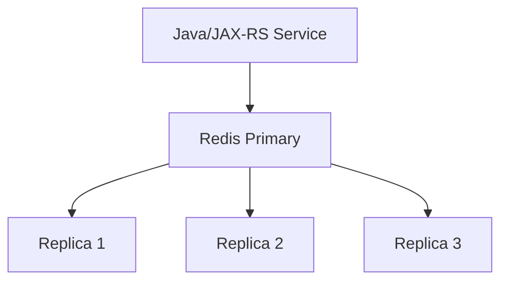
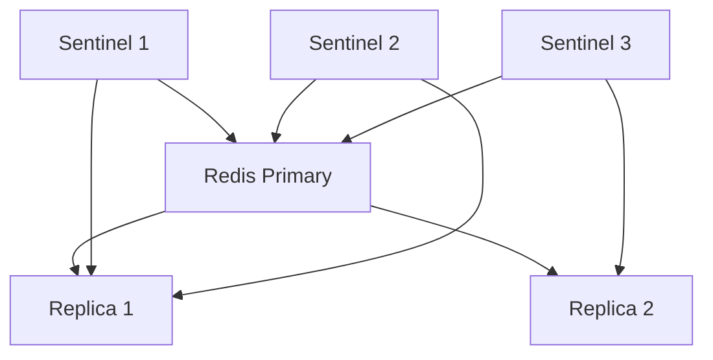
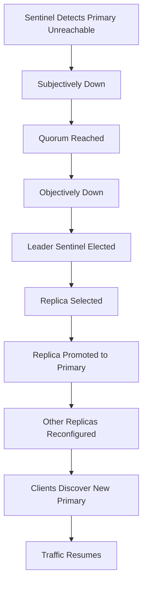
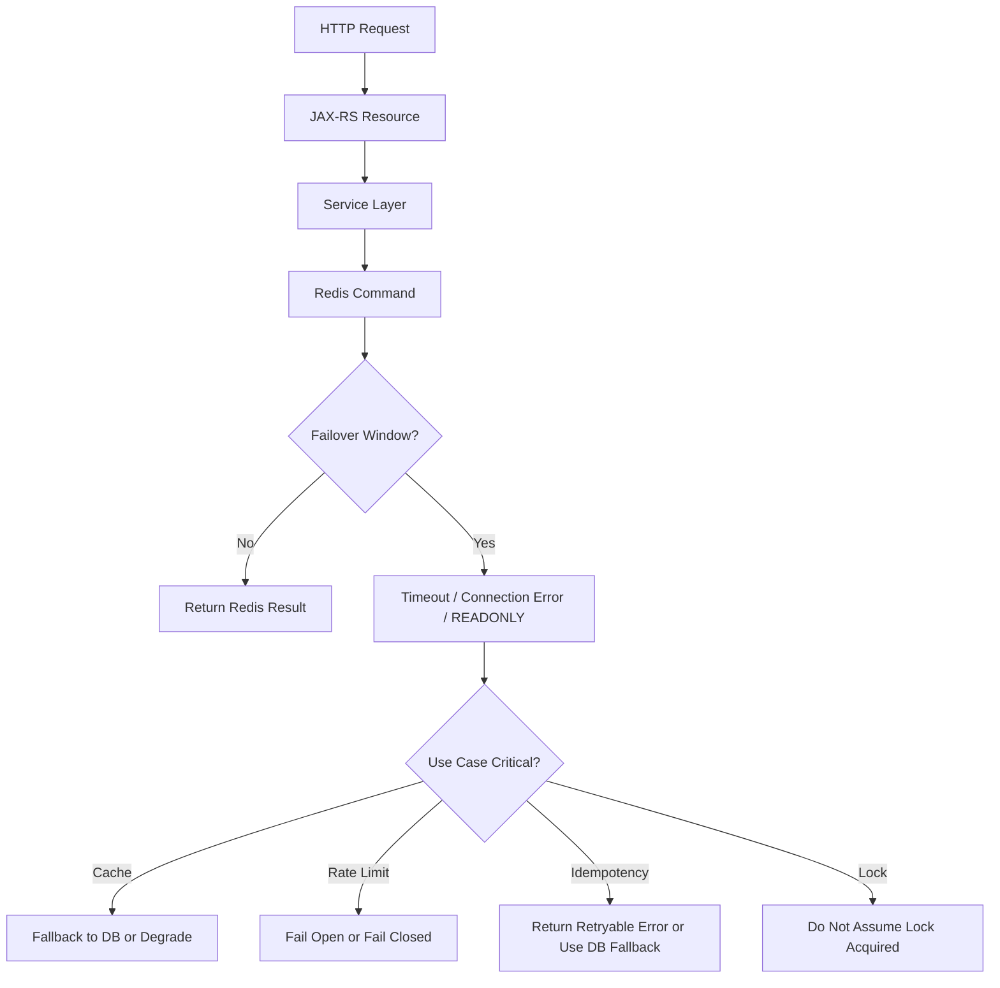

# Part 035 — Replication and Sentinel

Redis replication dan Sentinel sering dipakai untuk high availability.

Namun high availability tidak sama dengan strong consistency.

Replication Redis membantu Redis tetap tersedia saat primary bermasalah, tetapi tetap membawa risiko:

- replica lag
- stale read
- failover gap
- write loss
- split-brain
- reconnect storm dari client
- behavior berbeda antara standalone, Sentinel, managed Redis, dan Cluster

Untuk senior backend engineer, pertanyaan utamanya bukan hanya:

> Apakah Redis punya replica?

Pertanyaan yang lebih penting:

> Apa yang terjadi pada cache, idempotency, lock, rate limiter, session, stream, dan Java/JAX-RS request ketika primary Redis failover di tengah traffic production?

---

## 1. Core Mental Model

Redis replication biasanya memakai model primary/replica.

Satu Redis primary menerima write.
Satu atau lebih replica menyalin data dari primary.

```text
Java Service -> Redis Primary -> Replication Stream -> Redis Replica(s)
```

Primary bertanggung jawab untuk write.
Replica biasanya dipakai untuk redundancy, failover target, atau read scaling jika aplikasi memang dikonfigurasi membaca dari replica.

Yang penting:

> Redis replication bersifat asynchronous.

Artinya, write yang sudah sukses di primary belum tentu langsung tersedia di replica.

---

## 2. Primary and Replica

Primary menerima command seperti:

```redis
SET catalog:offer:123 "..." EX 300
INCR rate:user:456
XADD stream:jobs * type "reprice"
```

Replica menerima replication stream dari primary dan menerapkan perubahan tersebut.

Mental model:



Jika primary mati, salah satu replica dapat dipromosikan menjadi primary baru.

Namun promosi ini tidak otomatis aman untuk semua use case Redis.

---

## 3. Asynchronous Replication

Redis tidak menunggu semua replica menerima write sebelum primary menganggap command sukses.

Contoh:

```text
T1: client SET idempotency:key processing EX 600 -> primary OK
T2: primary crash sebelum replica menerima write
T3: replica dipromosikan menjadi primary
T4: idempotency:key hilang di primary baru
```

Dari sisi aplikasi:

- request pertama mungkin sudah mulai diproses
- duplicate request berikutnya tidak menemukan idempotency marker
- operasi bisa diproses dua kali

Untuk cache biasa, ini mungkin hanya cache miss.
Untuk idempotency, lock, token revocation, atau security state, ini bisa menjadi correctness incident.

---

## 4. Replica Lag

Replica lag adalah jeda antara write di primary dan penerapan write di replica.

Penyebab umum:

- network latency
- replica overload
- disk I/O pressure
- fork/persistence activity
- large write payload
- slow replica CPU
- burst write traffic
- reconnect/resync

Impact:

| Use case | Impact of replica lag |
|---|---|
| Cache | stale read atau cache miss |
| Session/token | user state terlambat terlihat |
| Rate limiter | limit terlihat lebih longgar jika baca dari replica |
| Idempotency | duplicate detection bisa gagal |
| Locking | lock state bisa stale, sangat berbahaya |
| Stream/queue | consumer state bisa tidak lengkap setelah failover |

Rule praktis:

> Jangan membaca correctness-critical state dari replica kecuali desainnya eksplisit menerima stale read.

---

## 5. Read Replica Usage

Read replica bisa menarik untuk read scaling.

Namun Redis biasanya dipakai untuk low-latency access. Bottleneck sering bukan read throughput saja, tetapi:

- hot key
- big key
- bad command complexity
- network round trip
- serialization overhead
- connection storm
- memory pressure

Read replica tidak otomatis memperbaiki masalah tersebut.

Gunakan read replica hanya jika:

- stale read acceptable
- client mendukung read preference dengan jelas
- metric replica lag dipantau
- fallback saat replica unavailable jelas
- data bukan lock/idempotency/security state yang butuh freshness kuat

---

## 6. Sentinel Mental Model

Redis Sentinel adalah sistem untuk monitoring, notification, dan automatic failover Redis primary/replica.

Sentinel memantau primary dan replica.
Jika primary dianggap down, Sentinel quorum dapat memilih failover dan mempromosikan replica menjadi primary baru.



Sentinel bukan data plane.
Aplikasi Java tetap bicara ke Redis server.
Sentinel membantu client menemukan primary saat failover.

---

## 7. Sentinel Quorum

Quorum menentukan berapa Sentinel yang harus sepakat bahwa primary down sebelum failover dapat dilakukan.

Concern:

- quorum terlalu rendah dapat menyebabkan false failover
- quorum terlalu tinggi dapat memperlambat recovery
- network partition dapat menghasilkan situasi sulit
- Sentinel sendiri harus tersebar pada failure domain yang berbeda

Contoh risiko:

```text
3 Sentinel, quorum 2
Network partition membuat 2 Sentinel tidak bisa reach primary
Mereka menganggap primary down
Failover dimulai
Primary lama mungkin masih menerima write dari sebagian client
```

Ini dapat menyebabkan split-brain-like behavior tergantung jaringan dan client routing.

---

## 8. Failover Lifecycle

Failover Sentinel secara konseptual:



Selama proses ini, aplikasi bisa mengalami:

- connection timeout
- command timeout
- `READONLY` error
- stale connection ke old primary
- reconnect storm
- temporary write failure
- latency spike

Java client harus dikonfigurasi untuk menghadapi ini.

---

## 9. Java Client Sentinel Awareness

Jika memakai Sentinel, Redis client Java harus Sentinel-aware.

Artinya client tahu:

- daftar Sentinel endpoint
- nama master set
- cara resolve current primary
- cara reconnect saat primary berubah
- timeout ke Sentinel
- timeout ke Redis primary
- retry behavior saat failover

Client yang hanya dikonfigurasi dengan satu host Redis dapat gagal total setelah failover jika host tersebut bukan primary baru.

Checklist client:

- Apakah client memakai Sentinel mode?
- Apakah semua Sentinel endpoint dikonfigurasi?
- Apakah master name benar?
- Apakah command timeout realistis?
- Apakah retry tidak memperparah traffic storm?
- Apakah circuit breaker/bulkhead melindungi service?

---

## 10. Failover Impact on Java/JAX-RS Request

Dalam service Java/JAX-RS, Redis failover terlihat sebagai masalah runtime di request path.

Contoh flow:



Failure behavior harus berbeda per use case.

Satu global Redis fallback policy biasanya terlalu kasar.

---

## 11. Write Loss Risk

Karena replication asynchronous, write yang sudah sukses di old primary bisa hilang jika belum sampai replica yang dipromosikan.

Use case paling sensitif:

- idempotency marker
- distributed lock
- token revocation
- session update
- rate limiter counter
- stream/job queue state
- security attempt counter

Untuk cache entry biasa, write loss biasanya menjadi cache miss.
Untuk state yang mengontrol correctness, write loss harus dianggap serius.

Mitigation options:

- gunakan PostgreSQL sebagai source of truth untuk state kritikal
- gunakan Redis hanya sebagai accelerator
- gunakan fencing token untuk lock
- desain idempotency dengan DB-backed guarantee jika bisnis kritikal
- pahami managed service failover semantics
- monitor replication lag
- jangan membuat klaim exactly-once dari Redis replication

---

## 12. Replica Read Staleness

Jika aplikasi membaca dari replica, stale read dapat terjadi.

Contoh:

```text
T1: POST /quote/123/update writes DB and invalidates Redis primary
T2: replica belum menerima DEL cache key
T3: GET /quote/123 reads cache from replica
T4: stale quote returned
```

Masalah ini makin penting pada CPQ/order management karena data seperti price, quote status, eligibility, rule result, atau catalog config dapat memengaruhi business decision.

Stale data bukan selalu bug, tetapi harus punya boundary.

Pertanyaan review:

- Berapa stale window yang acceptable?
- Apakah response boleh memakai stale cache?
- Apakah ada version check?
- Apakah ada ETag/version/timestamp?
- Apakah write-after-read flow dapat melihat data lama?

---

## 13. Split-Brain Risk

Split-brain adalah kondisi ketika lebih dari satu node dianggap primary atau menerima write karena network partition/routing problem.

Redis Sentinel mengurangi risiko, tetapi tidak menghilangkan semua skenario distributed systems failure.

Risk amplifier:

- Sentinel tersebar buruk
- quorum tidak tepat
- client lama tetap menulis ke old primary
- network partition asimetris
- DNS/cache endpoint stale
- firewall/routing issue
- aplikasi retry agresif

Untuk correctness-critical operation, jangan hanya mengandalkan lock Redis tanpa fencing atau source-of-truth validation.

---

## 14. Fail Open vs Fail Closed

Saat Redis failover, aplikasi harus memilih behavior.

| Use case | Possible behavior |
|---|---|
| Cache | fail open ke DB, stale fallback, atau degrade |
| Rate limiter | fail open untuk availability, fail closed untuk protection/security |
| Idempotency | sering lebih aman return retryable error daripada process duplicate |
| Locking | jangan masuk critical section jika lock uncertain |
| Session | fail closed dapat logout user; fail open bisa security risk |
| Token blacklist | fail open bisa menerima token revoked; fail closed bisa outage auth |

Tidak ada satu jawaban universal.
Keputusan harus eksplisit berdasarkan risiko bisnis dan keamanan.

---

## 15. Sentinel vs Redis Cluster

Sentinel dan Cluster bukan hal yang sama.

| Aspect | Sentinel | Cluster |
|---|---|---|
| Primary goal | HA/failover untuk primary/replica | Horizontal scaling + HA per slot |
| Data sharding | Tidak | Ya, hash slot |
| Client requirement | Sentinel-aware | Cluster-aware |
| Multi-key limitation | Tidak karena single keyspace node | Ada cross-slot limitation |
| Operational model | Master discovery/failover | Slot map/redirection/resharding |

Jika kebutuhan utamanya high availability pada satu keyspace, Sentinel bisa cukup.
Jika kebutuhan utamanya horizontal scaling memory/write/read across keyspace, Cluster lebih relevan.

Managed Redis services dapat menyembunyikan sebagian detail, tetapi failure semantics tetap harus dipahami.

---

## 16. Observability Signals

Metric penting untuk replication/Sentinel:

- primary availability
- replica count
- replication lag
- `master_link_status`
- `master_last_io_seconds_ago`
- connected replicas
- failover count
- role changes
- rejected connections
- command timeout spike
- client reconnect count
- application Redis error rate
- latency during failover

Redis command yang sering berguna untuk diagnosis:

```redis
INFO replication
INFO clients
INFO stats
ROLE
```

Gunakan command dengan hati-hati di production dan ikuti policy internal.

---

## 17. Common Failure Modes

### 17.1 Replica promoted without latest write

Symptom:

- key yang baru ditulis hilang setelah failover
- idempotency record tidak ditemukan
- lock state hilang

Likely cause:

- asynchronous replication lag
- primary crash sebelum replica catch up

Mitigation:

- monitor lag
- jangan pakai Redis sebagai satu-satunya source of truth untuk state kritikal
- gunakan DB-backed correctness jika diperlukan

---

### 17.2 Java client stuck on old primary

Symptom:

- `READONLY` error
- command timeout setelah failover
- sebagian pod berhasil, sebagian gagal

Likely cause:

- client tidak Sentinel-aware
- stale connection pool
- reconnect behavior buruk

Mitigation:

- validasi client config
- restart affected pods jika perlu sesuai runbook
- perbaiki pool/reconnect settings

---

### 17.3 Reconnect storm

Symptom:

- banyak pod reconnect bersamaan
- Redis/Sentinel overload
- latency spike setelah failover

Likely cause:

- rolling reconnect tanpa jitter
- pool per pod terlalu besar
- retry agresif

Mitigation:

- connection pool sizing
- retry backoff + jitter
- circuit breaker
- bulkhead

---

### 17.4 Stale reads from replica

Symptom:

- data cache tampak tidak berubah setelah update
- user melihat value lama
- read-after-write inconsistency

Likely cause:

- read replica lag
- invalidation belum replicated

Mitigation:

- read primary untuk data freshness-sensitive
- versioned cache key
- stale window policy

---

## 18. Internal Verification Checklist

Cek di codebase, deployment, dan diskusi tim:

- Apakah Redis memakai standalone, Sentinel, Cluster, atau managed HA?
- Jika Sentinel, apa master name dan quorum?
- Berapa jumlah Sentinel dan di mana ditempatkan?
- Apakah Redis client Java Sentinel-aware?
- Apakah semua Sentinel endpoints dikonfigurasi?
- Apa timeout dan retry policy saat failover?
- Apakah service membaca dari replica?
- Data apa saja yang boleh stale?
- Apakah lock/idempotency/session/rate limiter bergantung pada Redis replication?
- Apakah replication lag dimonitor?
- Apakah failover pernah diuji?
- Apa runbook saat Java client gagal reconnect?
- Apakah ada incident notes tentang Redis failover?
- Apakah managed Redis provider punya documented failover behavior?
- Apakah platform/SRE punya ownership boundary yang jelas?

---

## 19. PR Review Checklist

Saat review PR yang menyentuh Redis HA/replication:

- Apakah use case Redis aman terhadap failover?
- Apakah write loss window dipahami?
- Apakah stale replica read acceptable?
- Apakah Redis dipakai untuk correctness-critical state?
- Apakah fallback Redis saat failover didefinisikan per use case?
- Apakah retry policy bisa memperparah failover?
- Apakah timeout cukup kecil untuk tidak menahan HTTP worker terlalu lama?
- Apakah circuit breaker/bulkhead tersedia?
- Apakah observability mencakup Redis client errors?
- Apakah test atau chaos scenario mencakup failover?

---

## 20. Senior Engineer Takeaway

Redis replication dan Sentinel membantu availability, tetapi tidak mengubah Redis menjadi strongly consistent distributed database.

Mental model yang harus dipegang:

> Sentinel helps Redis recover leadership. Replication helps Redis recover data availability. Neither removes the need to reason about stale reads, write loss, client reconnect, and correctness boundaries.

Untuk cache, failover biasanya berarti latency spike atau cache miss.
Untuk idempotency, lock, session, token revocation, stream, dan rate limiter, failover dapat menjadi correctness/security incident jika desainnya tidak eksplisit.

