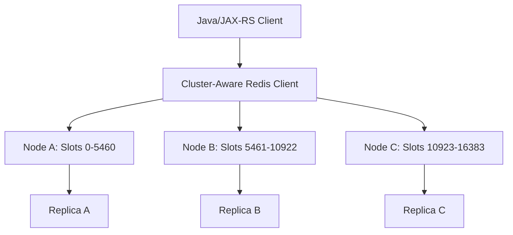

# Part 036 — Redis Cluster

Redis Cluster adalah mekanisme Redis untuk membagi keyspace ke beberapa node.

Tujuannya bukan hanya high availability.
Tujuan utamanya adalah horizontal scaling melalui sharding.

Namun Redis Cluster membawa konsekuensi desain:

- key masuk ke hash slot tertentu
- multi-key command dibatasi jika key berada di slot berbeda
- client harus cluster-aware
- resharding dapat menyebabkan redirection
- hot slot dapat membuat satu node overload
- Lua/transaction punya batas cluster-specific

Untuk senior backend engineer, pertanyaan pentingnya bukan:

> Apakah Redis bisa diskalakan?

Melainkan:

> Apakah key design, command choice, client config, dan failure handling aplikasi Java/JAX-RS sudah kompatibel dengan Redis Cluster?

---

## 1. Core Mental Model

Redis Cluster membagi keyspace menjadi hash slot.

Setiap key dihitung masuk ke salah satu slot.
Slot-slot tersebut didistribusikan ke beberapa primary node.
Setiap primary dapat punya replica untuk failover.



Mental model:

```text
key -> hash function -> hash slot -> Redis primary node
```

---

## 2. Hash Slots

Redis Cluster memiliki 16,384 hash slots.

Setiap key dipetakan ke satu slot.

Contoh konseptual:

```text
catalog:offer:123 -> slot 9312 -> node B
rate:user:456     -> slot 1201 -> node A
session:abc       -> slot 15300 -> node C
```

Client cluster-aware menyimpan slot map agar tahu node mana yang harus dihubungi.

Jika slot pindah karena resharding/failover, server dapat mengembalikan redirection seperti `MOVED` atau `ASK`.

---

## 3. Cluster-Aware Java Client

Redis Cluster membutuhkan client yang memahami slot map.

Client harus mampu:

- menghitung slot key
- mengirim command ke node yang benar
- menangani `MOVED`
- menangani `ASK`
- refresh cluster topology
- reconnect saat node failover
- menjaga pool per node
- menangani multi-key limitation

Jedis, Lettuce, dan Redisson memiliki mode cluster, tetapi behavior detailnya berbeda.

Internal verification harus melihat konfigurasi nyata, bukan asumsi.

---

## 4. MOVED Redirection

`MOVED` berarti client mengirim command ke node yang salah karena slot sudah dimiliki node lain.

Contoh konseptual:

```text
Client sends GET catalog:offer:123 to Node A
Node A replies: MOVED 9312 Node B
Client refreshes slot map
Client retries GET against Node B
```

Jika client tidak cluster-aware, aplikasi bisa gagal saat menerima `MOVED`.

Symptom di Java service:

- command error berisi `MOVED`
- sudden Redis failures setelah resharding
- hanya sebagian key gagal
- issue muncul setelah cluster topology berubah

---

## 5. ASK Redirection

`ASK` biasanya muncul saat slot sedang dimigrasikan.

Mental model:

```text
Slot is in transition.
For this command, ask target node temporarily.
Do not permanently update slot map yet.
```

Ini lebih transient dibanding `MOVED`.

Client cluster-aware harus menangani `ASKING` flow secara otomatis.
Jika tidak, aplikasi dapat gagal saat resharding/rebalancing.

---

## 6. Multi-Key Command Limitation

Di Redis Cluster, multi-key command hanya dapat berjalan jika semua key berada di slot yang sama.

Contoh berisiko:

```redis
MGET user:1 user:2 user:3
SUNION tenant:1:features tenant:2:features
DEL cache:quote:1 cache:quote:2
```

Jika key berada di slot berbeda, Redis dapat mengembalikan:

```text
CROSSSLOT Keys in request don't hash to the same slot
```

Dampak terhadap Java/JAX-RS:

- batch cache read bisa gagal
- invalidation multi-key bisa gagal
- Lua script dengan banyak key bisa gagal
- transaction multi-key bisa gagal
- job/lock/idempotency pattern bisa rusak jika memakai banyak key lintas slot

---

## 7. Hash Tags

Hash tag memaksa bagian tertentu dari key menjadi basis hashing.

Redis menghitung slot hanya dari substring di dalam `{}`.

Contoh:

```text
quote:{123}:summary
quote:{123}:items
quote:{123}:pricing
```

Ketiganya masuk slot yang sama karena hash tag-nya `123`.

Ini memungkinkan multi-key operation untuk entity yang sama.

Namun hash tag harus dipakai hati-hati.
Jika terlalu banyak key memakai tag yang sama, slot itu bisa menjadi hotspot.

Contoh buruk:

```text
catalog:{global}:offer:1
catalog:{global}:offer:2
catalog:{global}:offer:3
```

Semua masuk slot yang sama, berpotensi membuat satu node overload.

---

## 8. Key Design in Cluster

Key design di Redis Cluster harus mempertimbangkan:

- apakah key perlu multi-key operation?
- apakah key perlu diakses bersama dalam Lua/transaction?
- apakah key punya tenant/entity boundary?
- apakah hash tag akan menyebabkan hot slot?
- apakah invalidation dilakukan per key atau batch?
- apakah scan dilakukan per node?

Contoh cluster-friendly:

```text
quote:{quoteId}:summary
quote:{quoteId}:pricing
quote:{quoteId}:lock
quote:{quoteId}:idempotency:{requestId}
```

Contoh ini mengelompokkan data per quote jika memang perlu operasi bersama.
Namun jika satu quote sangat hot, slot tersebut tetap bisa menjadi bottleneck.

---

## 9. Redis Cluster and Cache Design

Untuk cache-aside sederhana, Cluster biasanya relatif mudah.

Pattern:

```text
GET cache key -> miss -> DB load -> SET cache key EX ttl
```

Karena operasi per key, slot limitation tidak terlalu mengganggu.

Yang lebih tricky:

- bulk `MGET`
- bulk invalidation
- tag-based invalidation
- tenant-wide invalidation
- multi-key consistency
- local + distributed cache coordination

Untuk Java service, jangan menganggap batch operation yang valid di standalone pasti valid di Cluster.

---

## 10. Redis Cluster and Rate Limiting

Rate limiter biasanya memakai key per actor/scope.

Contoh:

```text
rate:{tenantA}:api:/quotes
rate:{user123}:POST:/orders
rate:{ip:10.1.2.3}:global
```

Jika limiter hanya memakai satu key per decision, Cluster aman.

Jika limiter memakai beberapa key sekaligus, misalnya:

- global limit
- tenant limit
- user limit
- endpoint limit

maka command atomic multi-key lintas slot tidak bisa langsung dilakukan.

Pilihan desain:

- accept non-atomic multi-step decision
- gunakan hash tag untuk co-locate key tertentu
- pisahkan limiter decision per scope
- gunakan Lua hanya untuk key dalam slot yang sama
- gunakan service-level coordinator lain jika global correctness kuat diperlukan

---

## 11. Redis Cluster and Idempotency

Idempotency store biasanya cocok dengan single-key design.

Contoh:

```text
idem:{tenantId}:{idempotencyKey}
```

Namun jika idempotency flow memakai beberapa key:

```text
idem:{key}:state
idem:{key}:response
idem:{key}:fingerprint
```

Pastikan key berada di slot yang sama jika diakses atomic bersama.

Contoh:

```text
idem:{tenantA:abc123}:state
idem:{tenantA:abc123}:response
idem:{tenantA:abc123}:fingerprint
```

Tetap hati-hati terhadap hot key jika satu idempotency key dipukul banyak concurrent retry.

---

## 12. Redis Cluster and Distributed Locking

Lock Redis biasanya single-key:

```text
lock:quote:{quoteId}
```

Jika lock hanya satu key, Cluster aman.

Namun masalah muncul jika:

- lock key dan guarded state key harus diproses dalam satu Lua script
- fencing token disimpan di key berbeda slot
- lock melindungi multi-entity operation
- lock renewal dan metadata memakai beberapa key

Untuk correctness:

- co-locate key dengan hash tag jika harus atomic
- jangan membuat lock global di satu hash tag yang menjadi hot slot
- untuk critical DB update, pertimbangkan DB constraint/advisory lock/fencing token

Redis Cluster tidak menghilangkan problem distributed lock.
Ia hanya menambah batas slot-aware design.

---

## 13. Lua in Redis Cluster

Lua script di Redis Cluster memiliki batas penting:

> Semua key yang dipakai script harus berada di hash slot yang sama.

Contoh aman:

```text
rate:{tenantA:user123}:tokens
rate:{tenantA:user123}:timestamp
```

Contoh berbahaya:

```text
rate:tenantA:user123:tokens
rate:tenantA:user123:timestamp
```

Tanpa hash tag, dua key bisa berada di slot berbeda.

Review Lua script harus memastikan:

- semua key dideklarasikan sebagai `KEYS`
- key tidak dibuat dinamis secara tersembunyi dari `ARGV`
- key yang dipakai script berada di slot yang sama
- script tidak mencoba membaca seluruh cluster
- timeout script tidak memblokir satu node terlalu lama

---

## 14. Transactions in Redis Cluster

Redis transaction `MULTI/EXEC` di Cluster juga dibatasi slot.

Jika transaksi melibatkan beberapa key, semua key harus berada di slot yang sama.

Implication:

- transaction Redis bukan pengganti distributed transaction antar slot
- cross-slot atomicity tidak tersedia secara native
- desain key harus mengikuti atomicity boundary

Jika aplikasi butuh atomic update antar banyak entity lintas slot, Redis Cluster bukan tempat yang tepat untuk correctness tersebut.
Pertimbangkan PostgreSQL transaction, saga design, broker workflow, atau explicit compensating process.

---

## 15. Resharding and Rebalancing

Resharding memindahkan slot dari satu node ke node lain.

Tujuan:

- menambah node
- mengurangi node
- memperbaiki imbalance
- migrasi kapasitas
- maintenance

Selama resharding:

- `ASK` redirection bisa muncul
- latency bisa naik
- slot map berubah
- client harus refresh topology
- hot key tetap bisa hot walau slot dipindah
- operation besar dapat memperparah load

Aplikasi Java harus siap melihat transient Redis error/latency saat cluster maintenance.

---

## 16. Hot Slot

Hot slot terjadi saat slot tertentu menerima load jauh lebih besar daripada slot lain.

Penyebab:

- hot key
- hash tag terlalu luas
- tenant besar terkonsentrasi di satu tag
- global key seperti `config:{global}`
- rate limiter global
- popular catalog/rule key

Symptoms:

- satu node Redis CPU tinggi
- latency spike hanya untuk sebagian key
- cluster overall terlihat sehat tetapi satu shard overloaded
- failover/rebalancing tidak menyelesaikan root cause

Mitigation:

- split key
- shard manually
- local cache hot key
- avoid broad hash tag
- use per-tenant/per-entity partitioning
- redesign access pattern

---

## 17. Cluster Failover

Redis Cluster memiliki primary/replica per slot range.

Jika primary node gagal, replica untuk slot tersebut dapat dipromosikan.

Impact:

- hanya slot pada node tersebut terdampak langsung
- client menerima redirection/topology change
- writes pada slot tersebut bisa gagal sementara
- asynchronous replication tetap membawa write loss risk
- hot slot pada failed node dapat memperbesar impact

Cluster failover bukan magic strong consistency.
Ia tetap punya failure window.

---

## 18. Java/JAX-RS Failure Handling

Saat cluster mengalami topology change, request path Java bisa terkena:

- Redis command timeout
- MOVED/ASK handling bug
- pool exhaustion per node
- retry storm
- partial key failure
- cross-slot exception
- stale topology cache

Service harus membedakan use case:

| Use case | Cluster failure behavior |
|---|---|
| Cache | fallback ke DB/stale/degrade |
| Rate limiter | fail open/closed sesuai policy |
| Idempotency | jangan diam-diam process duplicate jika state uncertain |
| Lock | jangan masuk critical section jika acquire uncertain |
| Stream/job | pause/retry worker dengan backoff |
| Session/token | tentukan security vs availability trade-off |

---

## 19. Cluster Observability

Metric penting:

- cluster state
- slot coverage
- node count
- primary/replica role
- per-node CPU/memory/latency
- per-node command stats
- per-node connected clients
- cross-slot errors
- MOVED/ASK rate
- failover count
- hot key/hot slot indicators
- replication lag per shard
- client topology refresh errors

Useful diagnostic commands, sesuai policy internal:

```redis
CLUSTER INFO
CLUSTER NODES
CLUSTER SLOTS
INFO replication
INFO commandstats
SLOWLOG GET
```

Hati-hati menjalankan command berat atau scan besar di production.

---

## 20. Common Failure Modes

### 20.1 CROSSSLOT error after enabling cluster

Symptom:

- `CROSSSLOT Keys in request don't hash to the same slot`
- batch operation gagal
- Lua script gagal

Likely cause:

- multi-key command lintas slot
- key design tidak memakai hash tag

Mitigation:

- redesign key
- gunakan hash tag untuk atomic boundary kecil
- pecah operation menjadi per-key jika atomicity tidak diperlukan

---

### 20.2 Client not cluster-aware

Symptom:

- `MOVED` error muncul ke aplikasi
- sebagian request gagal setelah resharding
- koneksi hanya ke satu node

Likely cause:

- client mode standalone dipakai ke cluster
- topology refresh tidak aktif

Mitigation:

- gunakan cluster mode client
- konfigurasi seed nodes
- validasi topology refresh dan reconnect

---

### 20.3 Hot slot due to bad hash tag

Symptom:

- satu shard CPU tinggi
- latency hanya pada key tertentu
- memory tidak seimbang

Likely cause:

- hash tag terlalu global
- tenant besar dikunci ke satu slot
- hot key tidak dipecah

Mitigation:

- ubah key strategy
- split hot data
- local cache
- shard by subdimension

---

### 20.4 Resharding causes latency spike

Symptom:

- intermittent timeout
- ASK redirection meningkat
- slow request saat maintenance

Likely cause:

- slot migration
- client topology refresh lambat
- command besar saat migration

Mitigation:

- maintenance window
- tune client timeout/retry
- reduce big key
- monitor redirection/error rates

---

## 21. Internal Verification Checklist

Cek di codebase, config, dan platform:

- Apakah Redis memakai Cluster mode?
- Apakah Java client cluster-aware?
- Apakah seed nodes dikonfigurasi benar?
- Apakah topology refresh aktif?
- Apakah ada `MOVED`, `ASK`, atau `CROSSSLOT` di log?
- Apakah key naming convention cluster-safe?
- Apakah hash tag digunakan?
- Apakah hash tag terlalu luas dan berisiko hot slot?
- Apakah multi-key commands dipakai?
- Apakah Lua script memakai beberapa key?
- Apakah transaction Redis memakai beberapa key?
- Apakah rate limiter/idempotency/lock cluster-safe?
- Apakah resharding pernah diuji?
- Apakah per-node metrics tersedia?
- Apakah hot slot/hot key dapat dideteksi?
- Apakah managed Redis cluster behavior sudah dipahami?

---

## 22. PR Review Checklist

Saat review PR yang menyentuh Redis Cluster:

- Apakah command hanya single-key atau multi-key?
- Jika multi-key, apakah semua key satu slot?
- Apakah hash tag digunakan dengan boundary yang tepat?
- Apakah hash tag dapat menyebabkan hot slot?
- Apakah Lua script cluster-compatible?
- Apakah transaction cluster-compatible?
- Apakah key design mendukung scaling tenant/entity?
- Apakah batch invalidation aman di Cluster?
- Apakah error `MOVED/ASK/CROSSSLOT` ditangani?
- Apakah fallback behavior per use case jelas?
- Apakah observability per node/shard tersedia?

---

## 23. Senior Engineer Takeaway

Redis Cluster menskalakan Redis dengan membagi keyspace ke hash slot.

Namun scaling ini menukar kesederhanaan standalone dengan constraint baru:

- slot-aware key design
- cluster-aware client
- multi-key limitation
- redirection handling
- hot slot risk
- failover per shard

Mental model yang harus dipegang:

> In Redis Cluster, the key is not just a name. The key is also a routing decision, an atomicity boundary, and a scaling boundary.

Jika key design salah, cluster tidak menyelesaikan masalah.
Ia hanya mendistribusikan masalah ke tempat yang lebih sulit di-debug.

