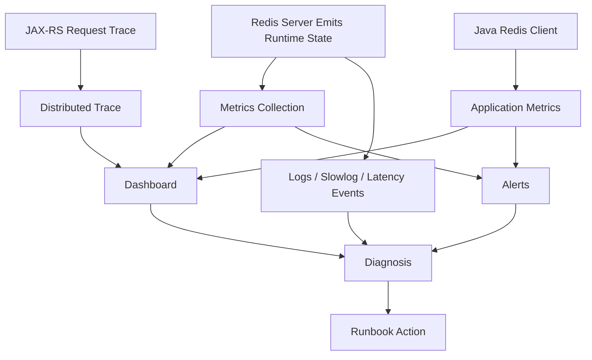

# Part 039 — Redis Observability

Redis observability bukan sekadar melihat apakah Redis hidup.

Untuk enterprise Java/JAX-RS system, Redis observability harus menjawab pertanyaan yang lebih tajam:

- apakah Redis mempercepat request atau justru memperlambat request?
- apakah cache hit ratio benar-benar melindungi PostgreSQL?
- apakah key TTL, expiration, dan eviction berjalan sesuai policy?
- apakah Redis command tertentu menjadi sumber tail latency?
- apakah Java client menunggu connection pool?
- apakah ada hot key, big key, atau blocking command?
- apakah Streams consumer tertinggal?
- apakah rate limiter, idempotency store, atau distributed lock gagal secara diam-diam?
- apakah failover, replication lag, atau cluster redirection memengaruhi aplikasi?

Redis yang tidak observable akan berubah menjadi komponen misterius.
Ketika incident terjadi, tim hanya melihat gejala di API latency, database load, atau worker backlog tanpa tahu Redis ikut berperan atau tidak.

---

## 1. Core Mental Model

Redis observability harus dilihat dari tiga sisi:

```text
Application Perspective
  - HTTP latency
  - cache hit/miss
  - fallback path
  - timeout/retry
  - Redis client errors

Client Perspective
  - connection pool
  - command latency
  - serialization cost
  - event loop pressure
  - reconnect behavior

Redis Server Perspective
  - CPU/event loop latency
  - memory/eviction
  - command stats
  - slowlog
  - replication/cluster
  - clients/blocked clients
```

Kesalahan umum adalah hanya melihat Redis server metrics.
Padahal banyak masalah Redis terlihat lebih dulu di Java service:

- connection pool wait naik
- Redis command timeout meningkat
- cache miss menyebabkan PostgreSQL spike
- retry storm membuat Redis lebih berat
- JAX-RS request latency naik meskipun Redis CPU rendah

Observability Redis yang matang menghubungkan server metrics dengan application traces.

---

## 2. What Good Redis Observability Must Prove

Observability Redis harus bisa membuktikan beberapa hal:

| Question | Signal yang dibutuhkan |
|---|---|
| Redis reachable? | connection errors, rejected connections, health check |
| Redis fast? | command latency, slowlog, latency histogram |
| Cache effective? | hit ratio, miss ratio, PostgreSQL fallback rate |
| Redis safe under memory pressure? | used memory, maxmemory, evicted keys, fragmentation |
| TTL policy bekerja? | expired keys, TTL sampling, no-expiry key audit |
| Java client sehat? | pool usage, timeout, retry, reconnect, pending commands |
| Streams sehat? | pending entries, lag, claim rate, ack rate |
| Cluster sehat? | slot coverage, MOVED/ASK, failed nodes, hot slots |
| Replication sehat? | replication lag, failover events, replica status |
| Security normal? | auth failures, unexpected clients, dangerous command attempts |

Redis observability bukan hanya uptime.
Redis observability adalah kemampuan menjelaskan hubungan antara Redis state dan user-visible behavior.

---

## 3. Redis Observability Lifecycle

Redis signal lifecycle:



Yang penting bukan hanya mengumpulkan data.
Yang penting adalah data tersebut bisa mengarahkan keputusan:

- scale Redis?
- fix key design?
- reduce payload?
- add TTL jitter?
- change client timeout?
- reduce fallback load?
- split hot key?
- change cache invalidation?
- redesign limiter/lock/idempotency?

---

## 4. Server Metrics: The Minimum Set

Redis server metrics minimum untuk production:

| Area | Metrics |
|---|---|
| Availability | up, role, uptime, failover event |
| Latency | command latency, latency spike, slowlog count |
| Memory | used memory, maxmemory, RSS, fragmentation ratio |
| Eviction/expiry | evicted keys, expired keys, keyspace misses |
| Clients | connected clients, blocked clients, rejected connections |
| Commands | ops/sec, commandstats, per-command latency if available |
| Persistence | RDB/AOF status, last save, AOF rewrite status |
| Replication | connected replicas, replication offset, lag |
| Cluster | cluster state, slots assigned/ok/fail, redirections |
| Streams | pending entries, consumer lag, ack rate |

Jika metric tidak bisa menjawab pertanyaan incident, metric itu belum cukup.

---

## 5. Application Metrics Are Not Optional

Redis server metrics tidak tahu konteks bisnis.

Aplikasi Java/JAX-RS harus mengekspor metric seperti:

- Redis command count by operation/use case
- Redis command latency by operation/use case
- cache hit count
- cache miss count
- cache fill count
- cache fill error count
- fallback to PostgreSQL count
- fallback latency
- cache invalidation count
- idempotency duplicate count
- rate limiter allowed/blocked count
- lock acquire success/failure count
- Redis timeout count
- Redis retry count
- Redis circuit breaker open count

Contoh label yang berguna:

```text
service="quote-service"
operation="catalog-price-cache-read"
redis_pattern="cache:catalog-price"
outcome="hit|miss|error|timeout"
tenant_scope="tenant|global"
```

Hindari label cardinality tinggi seperti:

- full key name
- user id
- tenant id jika jumlahnya sangat besar
- request id
- idempotency key
- session token

Label observability harus membantu debugging tanpa menghancurkan metrics backend.

---

## 6. JAX-RS Request Trace Integration

Untuk Redis di Java/JAX-RS service, Redis command sebaiknya terlihat dalam distributed trace.

Minimal trace span:

```text
HTTP POST /quotes
  -> validate request
  -> redis GET cache:catalog:...
  -> postgres SELECT ...
  -> redis SET cache:catalog:...
  -> kafka publish quote.created
  -> response
```

Trace harus menjawab:

- Redis dipanggil berapa kali dalam satu request?
- Redis call mana yang lambat?
- Redis miss menyebabkan query PostgreSQL apa?
- fallback path aktif atau tidak?
- Redis timeout membuat request gagal atau degrade?
- Redis command ikut retry atau tidak?

Tanpa trace, N+1 Redis call sering tidak terlihat.

---

## 7. `INFO`: Runtime Snapshot

`INFO` memberi snapshot runtime Redis.

Area yang sering penting:

| Section | Use |
|---|---|
| `server` | version, uptime, process info |
| `clients` | connected, blocked, rejected clients |
| `memory` | used memory, RSS, fragmentation |
| `persistence` | RDB/AOF status |
| `stats` | ops/sec, hits/misses, evictions, expirations |
| `replication` | role, replicas, offsets |
| `cpu` | process CPU counters |
| `commandstats` | per-command usage |
| `cluster` | cluster enabled/state |
| `keyspace` | key count and expiry info per DB |

Production usage rule:

```text
Use INFO for diagnosis and metrics collection.
Do not treat INFO output alone as root cause.
Correlate it with application metrics and time window.
```

Example diagnostic mapping:

| Symptom | Useful INFO section |
|---|---|
| API latency spike | stats, commandstats, clients, memory |
| Memory alert | memory, stats, keyspace |
| Cache ineffective | stats keyspace_hits/keyspace_misses |
| Failover suspicion | replication, server |
| Client timeout | clients, stats, commandstats |

---

## 8. Cache Hit Ratio

Redis cache hit ratio is useful, but easy to misread.

Formula:

```text
hit_ratio = hits / (hits + misses)
```

But senior engineers ask:

- hit ratio for which cache?
- global Redis hit ratio or per use case?
- does low hit ratio matter?
- is miss path expensive?
- are negative cache hits counted?
- are local cache hits excluded?
- did a deployment reset key namespace?
- did invalidation become too aggressive?
- are keys expiring together?

Global hit ratio can hide bad behavior.

Example:

```text
Global Redis hit ratio: 94%
Catalog price cache hit ratio: 41%
Quote validation cache hit ratio: 99%
```

The global number looks healthy, but catalog price cache may be overloading PostgreSQL.

---

## 9. Hit Ratio by Use Case

Prefer application-level hit ratio:

| Use case | Metric |
|---|---|
| catalog cache | catalog_cache_hit_total / miss_total |
| tenant config cache | tenant_config_cache_hit_total / miss_total |
| idempotency | idempotency_replay_total / new_request_total |
| rate limiter | limiter_allowed_total / blocked_total |
| token blacklist | token_blacklist_hit_total / miss_total |

Redis server-level hits/misses are useful for infrastructure trends.
Application-level hit/miss is useful for correctness and business behavior.

---

## 10. Keyspace Stats

Keyspace stats help answer:

- how many keys exist?
- how many keys have expiry?
- are keys accumulating?
- did deployment create new namespace?
- did cleanup stop working?

Redis keyspace stats are usually coarse.
They are not a replacement for per-prefix monitoring.

For enterprise systems, track approximate key count by prefix using safe sampling or scheduled offline tooling.

Example keyspace inventory:

| Prefix | Owner | Expected TTL | Expected cardinality | Risk |
|---|---|---:|---:|---|
| `cache:catalog:*` | catalog service | 15m | medium | stale pricing/config |
| `idem:quote:*` | quote service | 24h | high | duplicate submit |
| `rl:tenant:*` | gateway/service | 1m | high | memory growth |
| `lock:*` | workers | seconds | low | stuck coordination |
| `stream:job:*` | worker service | retention-based | medium | pending backlog |

Internal systems should know what key families exist.
Unknown key families are an operational smell.

---

## 11. Expired Keys and Evicted Keys

Expired key and evicted key are different.

| Signal | Meaning |
|---|---|
| Expired key | key removed because TTL ended |
| Evicted key | key removed because memory pressure and eviction policy |

Expired keys are expected when TTL works.
Evicted keys may be acceptable for pure cache, but dangerous for:

- idempotency state
- rate limiter state
- lock marker
- stream/queue data
- session/token data
- security state

Interpretation:

| Pattern | Likely Meaning |
|---|---|
| expired keys gradually increasing | normal TTL lifecycle |
| expired keys spike | synchronized TTL, deployment, batch invalidation |
| evicted keys increasing | memory pressure or bad sizing |
| evicted keys with `noeviction` errors | writes failing under memory pressure |
| evicted idempotency/session keys | correctness/security risk |

---

## 12. Memory Metrics

Memory metrics to watch:

| Metric | Why it matters |
|---|---|
| used memory | logical memory used by Redis |
| maxmemory | configured memory ceiling |
| RSS | memory seen by OS |
| fragmentation ratio | allocator/fragmentation pressure |
| evicted keys | memory pressure consequence |
| allocator stats | deep memory diagnosis |

Important distinction:

```text
used_memory high      -> Redis data is large
RSS much higher       -> fragmentation or allocator behavior
evictions increasing  -> memory limit is active pressure
```

Do not diagnose memory only from one number.

Memory must be correlated with:

- key count
- big keys
- TTL policy
- eviction policy
- stream retention
- sorted set cleanup
- idempotency/rate limiter cardinality
- deployment traffic change

---

## 13. `MEMORY STATS` and Memory Diagnosis

`MEMORY STATS` is useful for deeper diagnosis.

Use it when:

- RSS is unexpectedly high
- fragmentation ratio is high
- eviction happens despite expected key volume
- big key remediation did not reduce memory enough
- copy-on-write/persistence behavior is suspected

Production caution:

```text
Memory diagnosis should not rely on dangerous full key scans during peak traffic.
Use safe sampling, offline replicas, or scheduled low-risk jobs.
```

---

## 14. `SLOWLOG`

`SLOWLOG` records commands that exceed configured execution threshold.

It helps identify:

- expensive commands
- large range reads
- large hash/set/zset operations
- long Lua scripts
- accidental production scans
- blocking server execution

But `SLOWLOG` has limitations:

- it measures server-side execution, not network latency
- it does not include client-side pool wait
- it may not capture high-volume medium-latency commands
- it does not show business context unless key names are meaningful

Use `SLOWLOG` with application traces.

Example diagnosis:

```text
API p99 increased
  -> trace shows Redis GET 180ms
  -> slowlog does not show GET
  -> likely client/network/pool issue, not Redis command execution
```

Another case:

```text
API p99 increased
  -> slowlog shows HGETALL cache:tenant:rules:big
  -> payload large
  -> root cause likely big hash / wrong command
```

---

## 15. `LATENCY DOCTOR` and `LATENCY HISTORY`

Redis latency tools help identify internal latency spikes.

Useful for:

- fork/persistence events
- command spikes
- eviction pressure
- AOF rewrite impact
- CPU stalls
- failover-related latency

Interpretation rule:

```text
Redis latency event explains server-side stalls.
It does not explain every application timeout.
```

If Java clients timeout but Redis latency history is clean, investigate:

- network
- DNS
- connection pool
- client event loop
- CPU throttling in pods
- TLS handshake/reconnect
- cross-zone path

---

## 16. `MONITOR` Caution

`MONITOR` streams all commands processed by Redis.
It is powerful and dangerous.

Risks:

- high overhead
- exposes sensitive keys/values
- creates noise under load
- can worsen incident conditions
- may leak PII/token/session data

Production rule:

```text
Do not use MONITOR casually in production.
Prefer sampled client metrics, slowlog, commandstats, tracing, or replica/offline analysis.
```

If absolutely required:

- use short duration
- get approval
- avoid peak traffic
- redact output
- store securely or not at all
- document why other methods were insufficient

---

## 17. `CLIENT LIST`

`CLIENT LIST` helps identify client connections.

Useful questions:

- how many clients are connected?
- are clients blocked?
- which service/pod has many connections?
- are idle connections accumulating?
- did rolling deployment create connection storm?
- are clients using readable names?

Java services should set client name if supported.

Example naming convention:

```text
quote-service/prod/pod-name
order-service/prod/pod-name
worker-service/prod/pod-name
```

This makes client diagnosis much easier.

Without client naming, `CLIENT LIST` becomes less useful during incident.

---

## 18. Connected Clients, Blocked Clients, and Rejected Connections

| Signal | Meaning |
|---|---|
| connected clients rising | more app pods, leak, reconnect storm, pool expansion |
| blocked clients rising | blocking commands waiting, queue consumers, bad usage |
| rejected connections | maxclients reached or resource exhaustion |

In Kubernetes, connected clients can spike during:

- rolling update
- autoscaling event
- crash loop
- DNS reconnect issue
- Redis failover
- network disruption

Capacity planning must include:

```text
max_connections_needed = replicas * pool_size * service_count + operational_margin
```

Do not size Redis connection capacity only for one service.

---

## 19. `COMMANDSTATS`

Command stats reveal command mix.

Useful for detecting:

- unexpected `KEYS`
- too many `GET` calls instead of `MGET`
- heavy `HGETALL`
- high `EVAL` usage
- high `ZRANGE` or `ZRANGEBYSCORE`
- queue operations growing
- stream operations backlog

Ask:

- did command mix change after deployment?
- which command dominates CPU?
- which command should be batched?
- which command should be replaced by safer pattern?

Commandstats tell what Redis is doing.
They do not tell why business logic is doing it.
That needs code/traces.

---

## 20. Redis Stream Observability

For Redis Streams, server availability is not enough.

You need metrics for:

- stream length
- consumer group lag
- pending entries count
- oldest pending age
- ack rate
- read rate
- claim rate
- retry rate
- DLQ-like stream size
- trimming rate
- consumer count
- idle consumers

Key questions:

```text
Are workers reading?
Are workers acknowledging?
Are messages stuck pending?
Are failed jobs being retried forever?
Is trimming deleting entries before replay requirement?
Is consumer scaling improving throughput or creating contention?
```

Pending entries are especially important.
A stream can look active while PEL grows silently.

---

## 21. Pub/Sub Observability

Redis Pub/Sub is fire-and-forget.
Observability should focus on publisher/subscriber health, not durability.

Track:

- publish count by channel/use case
- subscriber connected count
- subscriber reconnect count
- handler error count
- message processing latency on subscriber side
- missed notification symptoms

Do not claim:

```text
All Pub/Sub messages were delivered.
```

Redis Pub/Sub does not provide that guarantee.
If delivery evidence is required, use Streams, Kafka, RabbitMQ, or another durable mechanism.

---

## 22. Rate Limiter Observability

Redis-backed rate limiter metrics:

| Metric | Meaning |
|---|---|
| allowed count | requests passed limiter |
| blocked count | requests rejected/throttled |
| Redis limiter latency | limiter overhead |
| limiter Redis error | backend failure |
| fallback decision | fail-open/fail-closed behavior |
| key cardinality | memory growth risk |
| cleanup count | sorted set/window cleanup behavior |

For JAX-RS APIs, also track:

- HTTP 429 count
- `Retry-After` correctness
- top endpoint limited
- top tenant/user/IP limited, with cardinality-safe aggregation
- false-positive complaints
- suspected abuse traffic

Rate limiter observability must separate:

```text
normal blocking
misconfigured strict limiter
attack traffic
Redis backend failure
clock/TTL bug
```

---

## 23. Idempotency Observability

Redis idempotency store metrics:

- new idempotency key count
- duplicate key count
- response replay count
- processing-state conflict count
- fingerprint mismatch count
- expired idempotency key retry count
- Redis write failure during state transition
- DB commit success but idempotency update failure
- idempotency TTL distribution

Critical question:

```text
Did idempotency prevent duplicate side effects, or only hide duplicate responses?
```

For quote/order APIs, this distinction matters.
Duplicate quote/order submission can have business impact.

---

## 24. Lock Observability

Distributed lock metrics:

- acquire success count
- acquire failure count
- acquire latency
- lease duration
- lock hold duration
- renewal success/failure
- unlock success/failure
- unlock value mismatch
- expired-before-release count
- lock contention count
- fencing token usage if applicable

Important alerts:

- lock contention suddenly high
- lock hold duration near lease duration
- renewal failures
- critical job unable to acquire lock
- lock used around external dependency with high latency

A Redis lock without observability is risky.
You cannot tell whether it protects a critical section or just randomly serializes traffic.

---

## 25. Cache Invalidation Observability

Track invalidation separately from cache read/write.

Metrics:

- invalidation event received
- invalidation event processed
- invalidation error
- invalidation lag
- keys deleted by prefix/type
- version bump count
- stale read detected
- fallback refresh count

For Kafka/RabbitMQ-driven invalidation:

- consumer lag
- duplicate event count
- out-of-order event count
- failed invalidation retry
- dead-letter count

The most dangerous invalidation failure is silent stale cache.
Make stale detection explicit where business risk is high.

---

## 26. Dashboard Design

A good Redis dashboard has layers.

### Layer 1 — Executive/Service Health

- Redis availability
- API latency impact
- Redis error rate
- cache hit ratio by critical use case
- memory pressure
- evictions
- current incident indicators

### Layer 2 — Redis Server

- ops/sec
- commandstats
- slowlog count
- latency events
- connected clients
- blocked clients
- rejected connections
- memory/RSS/fragmentation
- expired/evicted keys

### Layer 3 — Use Case Panels

- cache hit/miss/fill/error
- rate limiter allowed/blocked/error
- idempotency new/duplicate/replay/conflict
- lock acquire/fail/renew/unlock
- stream length/pending/ack/claim/DLQ
- Pub/Sub publish/subscriber errors

### Layer 4 — Deployment/Topology

- primary/replica role
- replication lag
- Sentinel/Cluster state
- cluster slots
- MOVED/ASK errors
- node-level CPU/memory/network
- Kubernetes pod state or cloud-managed node state

Dashboard should map to runbooks.
If a panel does not support an action, it may be noise.

---

## 27. Alerting Strategy

Bad alert:

```text
Redis CPU > 70%
```

Better alert:

```text
Redis command latency p99 above SLO for 5 minutes AND Java Redis timeout rate elevated.
```

Alert principles:

- alert on user impact or imminent risk
- use sustained windows
- avoid single noisy counter spikes
- separate warning from paging
- include runbook link
- include owner/service context
- include likely diagnosis path

Useful alert classes:

| Alert | Severity |
|---|---|
| Redis unavailable from app | page |
| Redis timeout/error rate high | page/warn depending use case |
| evicted keys increasing for non-cache use case | page |
| memory near max with eviction rising | page |
| replication lag high | warn/page depending durability use |
| stream pending age high | page for job-critical stream |
| blocked clients high | warn/page |
| rejected connections | page |
| cache hit ratio drop + DB load spike | page |
| auth failures spike | security warn/page |

---

## 28. SLO-Oriented Redis Observability

Do not define Redis SLO only as Redis uptime.

Better SLOs:

```text
99.9% of Redis commands for quote-service complete under 20ms excluding known fallback paths.
```

```text
Catalog cache hit ratio remains above 90% during steady-state traffic.
```

```text
No eviction occurs for idempotency/session/security-state keyspaces.
```

```text
Redis stream pending age remains below worker retry threshold.
```

```text
Redis-related HTTP 5xx remains below service error budget.
```

SLO should reflect how Redis is used.

---

## 29. Production-Safe Debugging Rules

Safe Redis debugging should follow this order:

1. check application metrics
2. check distributed traces
3. check Redis server dashboard
4. check slowlog/latency events
5. check commandstats
6. check client connection metrics
7. inspect specific known keys only
8. use safe sampling if needed
9. avoid full keyspace scans during peak
10. escalate to platform/SRE for topology-level action

Avoid:

- `KEYS *` in production
- large `SMEMBERS`/`HGETALL` on unknown keys
- long `MONITOR` sessions
- manual deletes without owner confirmation
- changing eviction/persistence during incident without runbook
- flushing DB/keyspace

Production debugging must not become a second incident.

---

## 30. Example Diagnosis: API Latency Spike

Symptom:

```text
POST /quotes p99 latency increased from 300ms to 2s.
```

Diagnosis path:

```text
Check JAX-RS trace
  -> Redis GET catalog cache taking 1.5s
Check Redis slowlog
  -> no slow GET
Check Java client metrics
  -> connection pool wait high
Check Kubernetes deployment
  -> new replica count doubled total connections
Check Redis clients
  -> connected clients near maxclients
Root cause
  -> pool per pod too large + autoscaling connection storm
Fix
  -> reduce pool size, set max concurrency, add startup jitter, tune maxclients, alert on pool wait
```

Server looked healthy.
Client workload caused the issue.

---

## 31. Example Diagnosis: Cache Hit Ratio Drop

Symptom:

```text
PostgreSQL CPU high. Redis is up.
```

Diagnosis path:

```text
Check app cache metrics
  -> catalog cache hit ratio dropped from 92% to 38%
Check deployment
  -> new key version prefix deployed
Check invalidation metrics
  -> full tenant invalidation triggered repeatedly
Check Redis expired keys
  -> expiry spike every 5 minutes
Root cause
  -> synchronized TTL + aggressive invalidation
Fix
  -> TTL jitter, narrower invalidation, stale-while-revalidate, cache warming
```

Redis was functioning correctly.
Cache policy was wrong.

---

## 32. Example Diagnosis: Stream Consumer Stuck

Symptom:

```text
Workers running, but jobs not completing.
```

Diagnosis path:

```text
Check stream length
  -> increasing
Check consumer group pending entries
  -> growing
Check oldest pending age
  -> high
Check worker logs
  -> exception before XACK
Check DLQ metrics
  -> zero
Root cause
  -> worker fails after processing attempt but before ack handling path records failure
Fix
  -> add retry/claim logic, poison job handling, DLQ-like stream, alert on pending age
```

A healthy Redis process does not imply healthy stream processing.

---

## 33. Java/JAX-RS Instrumentation Checklist

For Redis calls from Java services, instrument:

- operation name
- command category, not full raw key
- cache hit/miss/error
- Redis latency
- pool wait latency
- timeout count
- retry count
- fallback count
- circuit breaker state
- serialization/deserialization error
- payload size bucket if possible
- exception type
- correlation ID in logs

Example operation names:

```text
redis.catalogCache.get
redis.catalogCache.set
redis.idempotency.begin
redis.idempotency.complete
redis.rateLimiter.check
redis.lock.acquire
redis.stream.readGroup
```

Avoid dumping raw key/value into logs.
Keys can contain sensitive identifiers.
Values can contain PII or tokens.

---

## 34. Internal Verification Checklist

Verify in internal CSG/team context:

- Which Redis/Redis-compatible deployment is used: standalone, Sentinel, Cluster, AWS, Azure, on-prem, Kubernetes.
- Which Java client is used: Jedis, Lettuce, Redisson, framework abstraction, or internal wrapper.
- Whether Redis client metrics are exported from Java services.
- Whether cache hit/miss is measured per use case, not only globally.
- Whether Redis command latency is visible in distributed traces.
- Whether connection pool wait is measured.
- Whether Redis timeouts/retries/reconnects are measured.
- Whether `SLOWLOG`, latency events, commandstats, memory, eviction, expiry, and clients are collected.
- Whether dashboards include Redis server, Java client, and business use case metrics.
- Whether rate limiter, idempotency, lock, stream, Pub/Sub, and session state have separate metrics.
- Whether alerting distinguishes cache-only Redis impact from correctness/security state impact.
- Whether safe production debugging commands are documented.
- Whether dangerous commands and `MONITOR` usage require approval.
- Whether Redis incident notes exist and are linked to runbooks.
- Whether SRE/platform/backend/security teams agree on Redis ownership boundaries.

---

## 35. PR Review Checklist

When reviewing Redis-related code, ask:

- What metric proves this Redis usage works?
- What metric proves it fails safely?
- Is hit/miss measured per cache?
- Is fallback to PostgreSQL measured?
- Is timeout/retry visible?
- Is connection pool behavior visible?
- Is Redis latency included in request traces?
- Are Redis keys/values excluded from sensitive logs?
- Does this introduce high-cardinality metric labels?
- Are stream pending entries measured?
- Are lock acquire/renew/release outcomes measured?
- Are rate limiter allow/block/error outcomes measured?
- Are idempotency duplicate/replay/conflict outcomes measured?
- Is there an alert or dashboard panel for the failure mode this feature can create?
- Is there a runbook entry for production debugging?

If a Redis feature has no observability, it is not production-ready.

---

## 36. Common Anti-Patterns

| Anti-pattern | Why it is dangerous |
|---|---|
| Only monitoring Redis uptime | misses correctness/performance failures |
| Only global hit ratio | hides per-cache failure |
| Logging full keys/values | privacy/security risk |
| No client metrics | misses pool/reconnect/timeouts |
| No trace spans | Redis N+1 calls invisible |
| No stream pending alert | jobs stuck silently |
| No eviction alert | data loss for non-cache keyspaces |
| Casual `MONITOR` in prod | overhead and sensitive data exposure |
| No owner per key prefix | incident triage confusion |
| Alerts without runbooks | noisy and slow incident response |

---

## 37. Mental Model Summary

Redis observability must connect:

```text
Redis server health
  + Java client behavior
  + request traces
  + cache correctness
  + use-case metrics
  + topology state
  + runbook actions
```

A mature Redis observability setup tells you:

- what changed
- which service is affected
- which Redis use case is affected
- whether impact is latency, correctness, security, or availability
- whether Redis server, client, network, data model, or application logic is responsible
- what safe next debugging step should be

Redis without observability is just a fast black box.
In enterprise systems, black boxes become incident multipliers.
