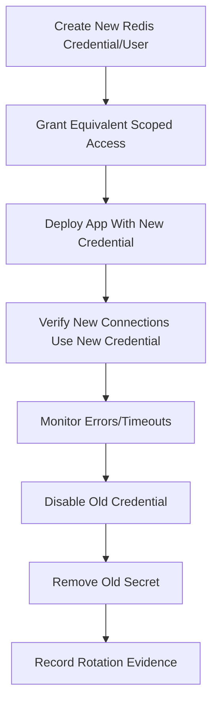

# Part 040 — Redis Security

Redis sering berada di jalur kritikal sistem backend:

- cache data bisnis
- idempotency state
- distributed lock
- rate limiter state
- session/token store
- job queue
- stream state
- feature flag/config cache

Karena Redis cepat dan mudah dipakai, Redis juga mudah menjadi titik lemah security.

Kesalahan Redis security biasanya bukan hanya satu hal seperti password lemah.
Kesalahan yang lebih umum:

- Redis bisa diakses terlalu luas dari network
- semua service memakai credential yang sama
- ACL tidak membatasi command/key pattern
- TLS tidak aktif pada jalur yang harus terenkripsi
- key/value mengandung PII atau token
- command berbahaya tidak dibatasi
- secret rotation tidak jelas
- backup/snapshot dapat diakses pihak yang tidak tepat
- logs/debugging mengekspos key/value sensitif

Redis security harus dilihat sebagai kombinasi access control, network isolation, transport protection, command restriction, data handling, deployment posture, dan operational discipline.

---

## 1. Core Mental Model

Redis security punya beberapa lapisan:

```text
Application Code
  -> Redis Client Configuration
  -> Secret/Credential Handling
  -> Network Boundary
  -> TLS/mTLS Boundary
  -> Redis AUTH/ACL
  -> Command Permission
  -> Key Pattern Permission
  -> Data Retention/TTL
  -> Backup/Snapshot Protection
  -> Audit/Monitoring
```

Jika salah satu lapisan lemah, Redis bisa menjadi jalur:

- unauthorized read
- unauthorized write
- data deletion
- command abuse
- cache poisoning
- session/token compromise
- denial of service
- privacy incident
- lateral movement antar service

Redis security tidak bisa bergantung pada satu kontrol saja.

---

## 2. Threat Model Redis di Enterprise Backend

Pertanyaan threat model:

| Threat | Example |
|---|---|
| Unauthorized access | service/pod/user yang tidak perlu bisa connect ke Redis |
| Credential leakage | Redis password/token bocor di logs/env/config |
| Overprivileged client | aplikasi cache bisa menjalankan `FLUSHALL` |
| Data exfiltration | PII/session/token dibaca dari Redis |
| Cache poisoning | attacker/service bug menulis value palsu |
| Denial of service | command berat, big key, `KEYS`, `MONITOR`, Lua blocking |
| Privilege spread | satu credential dipakai banyak service |
| Unsafe debugging | key/value sensitif terekam saat incident |
| Backup exposure | RDB/AOF/snapshot berisi data sensitif |
| Network exposure | Redis terbuka lintas namespace/VPC/subnet tanpa pembatasan |

Security review harus dimulai dari threat model, bukan langsung dari checklist konfigurasi.

---

## 3. Redis Is Not an Internet-Facing Service

Redis tidak boleh diekspos langsung ke public internet.

Prinsip:

```text
Redis should be reachable only from explicitly authorized application/runtime networks.
```

Untuk Kubernetes:

- batasi dengan NetworkPolicy
- gunakan namespace isolation
- batasi service account jika secret injection terkait
- hindari akses antar namespace tanpa kebutuhan jelas
- jangan expose Redis lewat LoadBalancer publik

Untuk cloud:

- gunakan private subnet/VNet/VPC
- gunakan security group/firewall/private endpoint
- hindari public endpoint jika tidak benar-benar diwajibkan
- batasi source CIDR
- audit peering/hybrid connectivity

Untuk on-prem:

- batasi firewall
- batasi host allowlist
- gunakan TLS jika melewati network tidak sepenuhnya trusted
- audit jump host/operator access

---

## 4. Protected Mode and Bind Address

Redis protected mode dan bind address adalah baseline, bukan security lengkap.

Hal yang perlu dipahami:

- bind address mengontrol interface yang didengarkan Redis
- protected mode membantu mencegah exposure tidak sengaja
- AUTH/ACL tetap diperlukan untuk access control
- firewall/network policy tetap diperlukan untuk network boundary

Security posture yang buruk:

```text
bind 0.0.0.0
no auth
no network restriction
```

Security posture yang lebih benar:

```text
Redis reachable only on private network
AUTH/ACL enabled
TLS enabled where required
network policy/security group restrictive
command/key access scoped
```

---

## 5. AUTH Is Not Enough

AUTH/password memberi authentication dasar.
Tetapi satu shared password untuk semua aplikasi menciptakan masalah:

- sulit rotasi tanpa gangguan besar
- tidak bisa membedakan service owner
- tidak bisa membatasi command per service
- credential leak berdampak luas
- audit attribution lemah

Redis modern mendukung ACL.
Gunakan ACL untuk membatasi user, command, dan key pattern jika deployment mendukung.

---

## 6. ACL Mental Model

ACL harus menjawab:

```text
Who can connect?
What commands can they run?
Which keys can they access?
From which network can they connect?
How are credentials rotated?
How is usage monitored?
```

ACL bukan hanya membuat user.
ACL adalah kontrak akses Redis.

Example logical users:

| User | Intended access |
|---|---|
| `quote-cache-app` | GET/SET/DEL only for quote/cache prefixes |
| `rate-limiter-app` | INCR, EXPIRE, EVAL for limiter prefixes |
| `stream-worker` | XREADGROUP, XACK, XADD for stream prefixes |
| `ops-readonly` | INFO, SLOWLOG, LATENCY, CLIENT LIST, read-only diagnostics |
| `admin-breakglass` | restricted emergency admin, audited |

Do not give every service admin-equivalent Redis access.

---

## 7. Command Category Restriction

Redis commands have different risk levels.

High-risk command categories:

| Command/category | Risk |
|---|---|
| `FLUSHALL`, `FLUSHDB` | destructive data loss |
| `CONFIG` | runtime config manipulation |
| `EVAL`/`FUNCTION` | arbitrary server-side logic risk |
| `KEYS` | blocking keyspace scan risk |
| `MONITOR` | sensitive data exposure and overhead |
| `CLIENT KILL` | availability impact |
| `SHUTDOWN` | service outage |
| `SAVE`/heavy persistence commands | latency/operational impact |
| module commands | depends on module capability |

Application users should not have broad command access.
Grant only commands needed for the use case.

---

## 8. Key Pattern Permission

Key pattern permission limits what a Redis user can access.

Example conceptual access design:

```text
quote-cache-app:
  allowed keys: cache:quote:*, cache:catalog:*
  denied keys: session:*, token:*, security:*, idem:*

rate-limiter-app:
  allowed keys: rl:*
  denied keys: cache:*, stream:*, session:*

stream-worker:
  allowed keys: stream:quote-job:*, dlq:quote-job:*
```

Without key pattern scoping, a compromised service credential may read or modify unrelated data.

Important:

- key naming convention affects security
- inconsistent prefixes make ACL harder
- PII in key names makes access and logs riskier
- shared prefixes across services reduce isolation

Key design and security are connected.

---

## 9. Least Privilege by Redis Use Case

Different use cases need different permissions.

| Use case | Typical permissions | Avoid |
|---|---|---|
| simple cache | `GET`, `SET`, `DEL`, TTL commands | admin commands, stream commands |
| rate limiter | `INCR`, `EXPIRE`, `EVAL` if script-based | broad key access |
| idempotency | `GET`, `SET NX`, TTL, maybe Lua | access to session/token keys |
| lock | `SET NX PX`, `GET`, Lua unlock | long arbitrary scripts |
| stream worker | `XREADGROUP`, `XACK`, `XCLAIM`, `XADD` | unrelated keyspace access |
| Pub/Sub | `PUBLISH`, `SUBSCRIBE` | data key access if not needed |
| ops readonly | `INFO`, `SLOWLOG`, `LATENCY`, limited read | destructive commands |

A Redis app credential should reflect the app's actual Redis role.

---

## 10. TLS and Transport Security

TLS protects Redis traffic in transit.

When TLS matters:

- traffic crosses untrusted or semi-trusted network
- cloud-managed Redis requires/enforces it
- credentials or sensitive values traverse the network
- cross-zone/cross-VPC/hybrid connectivity exists
- compliance requires encryption in transit

TLS considerations for Java clients:

- enable SSL/TLS in client config
- validate server certificate
- manage truststore correctly
- avoid disabling hostname/cert validation casually
- set handshake/connect timeout
- monitor TLS handshake/reconnect failures
- test rotation of certificates

TLS can add overhead, but the security boundary usually matters more than micro-optimization.

---

## 11. mTLS Awareness

Some environments may require mutual TLS.

mTLS adds client certificate identity in addition to server certificate validation.

Questions to verify internally:

- is mTLS supported by the Redis deployment?
- is client cert identity mapped to authorization?
- how are certificates issued?
- how are certificates rotated?
- how does Java client load key material?
- what happens during cert expiry?
- are failures observable?

Do not assume mTLS is available or enabled.
Mark it as internal verification.

---

## 12. Secret and Credential Handling

Redis credentials must not be hardcoded.

Secure handling rules:

- store credentials in approved secret manager
- inject via secure runtime mechanism
- avoid plaintext in Git
- avoid logging credentials
- avoid exposing credentials in crash dumps
- rotate credentials on schedule and incident
- support dual credentials during rotation if possible
- limit who can read Redis secrets

For Kubernetes:

- use Secrets or external secret operator according to platform standard
- restrict RBAC access to secrets
- avoid mounting secrets into pods that do not need Redis
- watch for environment variable leakage in debug output

For cloud:

- use managed secret store if standard
- audit access to secret value
- document rotation runbook

---

## 13. Credential Rotation

Credential rotation is an operational workflow, not just a config change.

Safe rotation sequence:



Rotation failure modes:

- old pods still use old credential
- connection pools keep old connections
- new credential missing key pattern permission
- secret mounted but app not reloaded
- failover node has inconsistent ACL/config
- rollback points to disabled credential

Rotation must be tested before emergency.

---

## 14. Dangerous Command Restriction

Destructive or operationally dangerous commands should not be available to application users.

Examples:

```text
FLUSHALL
FLUSHDB
CONFIG SET
CONFIG REWRITE
SHUTDOWN
KEYS
MONITOR
CLIENT KILL
SCRIPT FLUSH
FUNCTION FLUSH
```

Some commands are not always bad, but should be controlled:

- `EVAL`
- `SCAN`
- `HGETALL`
- large range commands
- blocking commands
- admin/debug commands

Policy:

```text
Application users get minimum commands.
Operational users get audited diagnostic commands.
Emergency admin is break-glass only.
```

---

## 15. `CONFIG` Command Risk

`CONFIG` can change Redis runtime behavior.

Risks:

- disable persistence
- change maxmemory/eviction behavior
- alter slowlog threshold
- change security-relevant settings
- create drift from IaC/GitOps config
- introduce incident during manual debugging

Application users should not have `CONFIG` access.
Operational use should go through documented runbook and audit trail.

---

## 16. `FLUSHALL` and `FLUSHDB` Risk

`FLUSHALL` and `FLUSHDB` can erase Redis data.

Impact depends on use case:

| Redis use | Flush impact |
|---|---|
| cache only | cache cold start, DB overload, latency spike |
| idempotency | duplicate processing risk |
| session/token | mass logout or security inconsistency |
| rate limiter | limiter reset, abuse window |
| lock | coordination break |
| stream/job queue | job loss if not persisted/replicated appropriately |

Do not treat flush as harmless because Redis is “just cache”.
In enterprise systems Redis often carries correctness or security state.

---

## 17. Sensitive Data Handling

Redis may contain sensitive data in:

- key names
- values
- serialized JSON
- session data
- token blacklist/revocation data
- idempotency response cache
- stream messages
- job payloads
- Pub/Sub payloads
- logs/debug output
- RDB/AOF/snapshots

Rules:

- do not put PII in key names
- minimize sensitive values
- apply TTL to sensitive ephemeral state
- encrypt at application layer if required by policy
- avoid storing raw access/refresh tokens unless approved
- redact logs
- restrict backup/snapshot access

Part 041 will go deeper into privacy/compliance, but security design must already assume Redis can hold sensitive material.

---

## 18. Key Names Can Be Sensitive

A key like this is dangerous:

```text
session:user:john.doe@example.com
```

Better pattern:

```text
session:user:{opaque-user-id}
```

Even if value is encrypted, key names may appear in:

- logs
- metrics
- slowlog
- monitor output
- traces
- debugging screenshots
- support tickets

Never assume key names are private.

---

## 19. Session and Token Security

If Redis stores session/token/security state, security bar is higher.

Checklist:

- TTL enforced
- logout/revocation behavior clear
- token values not stored raw unless approved
- access scoped to auth/security services
- no broad read access by unrelated apps
- Redis outage behavior defined
- backup/snapshot retention reviewed
- fail-open/fail-closed behavior explicit
- audit/logging does not expose token material

For token blacklist/revocation, ask:

```text
If Redis is unavailable, do we allow requests or block them?
What is the security consequence?
What is the availability consequence?
```

This must be a deliberate product/security decision.

---

## 20. Cache Poisoning Risk

Cache poisoning happens when incorrect or malicious data is written to cache and later trusted.

Causes:

- overprivileged Redis credential
- weak key namespace isolation
- missing payload validation
- untrusted input used in cache key/value
- stale incompatible serialized payload
- missing versioning
- compromised service writes shared cache

Mitigations:

- key prefix ownership
- ACL key pattern scoping
- payload versioning
- validation before cache fill
- short TTL for risky data
- source-of-truth verification for critical operations
- observability for abnormal cache writes

Cache is not automatically safe because it is derived data.

---

## 21. Lua and Redis Functions Security

Lua scripts and Redis Functions can enforce atomicity, but they also introduce risk.

Security concerns:

- script can perform broad key access
- script can block Redis event loop
- script can bypass expected application-level checks
- script versioning may drift
- script may include unsafe assumptions about key names
- `SCRIPT FLUSH`/`FUNCTION FLUSH` may break applications

Controls:

- review scripts like production code
- store scripts in repository
- test scripts in CI
- restrict who can deploy functions/scripts
- scope script keys via ACL/key pattern when possible
- measure script latency
- avoid dynamic script generation from user input

---

## 22. Pub/Sub and Streams Security

Pub/Sub risks:

- sensitive payload sent to broad subscribers
- no durable audit trail of delivery
- unauthorized subscriber listens to channels
- channel naming leaks business context

Streams risks:

- stream messages retained longer than expected
- PII/job payload remains in stream
- consumer group access too broad
- DLQ-like streams become sensitive data dumps
- trimming policy conflicts with retention/security

Security checklist:

- define channel/stream ownership
- restrict publish/subscribe/read permissions
- avoid sensitive payload unless approved
- apply retention/trimming
- monitor unauthorized access/errors
- review DLQ retention and access

---

## 23. Rate Limiter Security

Rate limiter Redis state can be security-sensitive.

Risks:

- attacker resets limiter keys if credential compromised
- limiter key contains IP/user/tenant PII
- fail-open behavior allows abuse during Redis outage
- fail-closed behavior causes availability incident
- shared limiter prefix modified by wrong service
- memory growth causes limiter malfunction

Security review questions:

- who can write limiter keys?
- does limiter key expose user/IP/tenant identifiers?
- what happens on Redis error?
- are blocked/allowed decisions auditable?
- can attacker influence key cardinality?

---

## 24. Idempotency Security

Idempotency state can leak request/response content.

Risks:

- response replay cache stores sensitive response
- idempotency key is guessable
- fingerprint mismatch not checked
- client can replay another user's idempotency key
- TTL too long for sensitive response
- idempotency key logged in cleartext

Controls:

- bind idempotency key to actor/tenant/request fingerprint
- do not store sensitive full response unless necessary
- use safe TTL
- treat idempotency key as sensitive identifier
- restrict key access to owning service
- log carefully

---

## 25. Distributed Lock Security

Distributed locks can be abused as denial-of-service primitives.

Risks:

- unauthorized service creates lock and blocks workflow
- lock key namespace shared too broadly
- lock lease too long
- lock not released due to bug
- lock protects security-critical workflow incorrectly

Controls:

- restrict lock prefix to owning service
- short lease with safe renewal
- observability on lock contention
- emergency unlock runbook with owner approval
- avoid using lock as authorization mechanism

A lock is coordination, not access control.

---

## 26. Kubernetes Security Considerations

For Redis in Kubernetes or Redis clients in Kubernetes:

- use NetworkPolicy to restrict ingress/egress
- restrict access to Redis secrets
- avoid broad namespace access
- verify service account permissions
- avoid exposing Redis service externally
- configure readiness/liveness carefully
- secure Helm values and rendered manifests
- avoid credentials in ConfigMaps
- encrypt secrets at rest according to platform policy
- audit who can exec into pods with Redis credentials

A developer with shell access to an app pod may be able to read Redis credentials.
That is part of the threat model.

---

## 27. Cloud-Managed Redis Security

For AWS/Azure/managed Redis-compatible services, verify:

- private networking
- subnet/VNet/security group/firewall
- TLS in transit
- encryption at rest if supported/required
- authentication mode
- ACL/user support
- backup/snapshot access
- maintenance and patching ownership
- metrics/logging access
- parameter group/config drift
- cross-region/global replication security
- IAM/RBAC permissions around management plane

Important distinction:

```text
Managed Redis reduces infrastructure burden.
It does not remove application security responsibility.
```

Application still controls:

- what data goes into Redis
- key naming
- TTL
- credential usage
- command usage
- fallback behavior
- logging

---

## 28. On-Prem and Hybrid Security

For on-prem/hybrid Redis:

- OS hardening matters
- firewall rules matter
- TLS/cert lifecycle matters
- patching matters
- backup storage security matters
- monitoring stack access matters
- operator SSH access matters
- air-gapped upgrade process matters
- hybrid network latency and exposure matter

Hybrid risk example:

```text
Cloud Java service connects to on-prem Redis across private link/VPN.
```

Questions:

- is traffic encrypted?
- what is the latency/failure behavior?
- who owns firewall rules?
- are Redis credentials shared across environments?
- what happens during network partition?
- are backups stored securely?

---

## 29. Audit and Access Evidence

Security review needs evidence.

Evidence examples:

- Redis users/ACL configuration
- network policy/security group rules
- TLS configuration
- secret manager access policy
- rotation history
- dashboard for auth failures/rejected connections
- backup/snapshot access control
- IaC/GitOps config history
- runbook for credential rotation
- approval trail for admin/break-glass access

Without evidence, “Redis is secure” is only a claim.

---

## 30. Monitoring Security Signals

Security-relevant Redis signals:

- authentication failures
- unexpected clients
- unknown client names
- connection attempts from unexpected network
- rejected connections
- command permission errors
- key permission errors
- dangerous command attempts
- spike in `EVAL`/admin/debug commands
- unusual key deletion rate
- unusual flush/config activity
- unusual Pub/Sub subscribers
- unusual stream reads by unexpected consumer

Security monitoring should integrate with platform/security tooling.

---

## 31. Incident Response for Redis Credential Leak

If Redis credential is suspected leaked:

1. identify affected credential/user
2. identify key patterns and command permissions
3. identify services using it
4. check access logs/metrics if available
5. create replacement credential
6. deploy services with replacement
7. disable old credential
8. audit suspicious commands/key access
9. rotate dependent secrets if needed
10. review whether data in Redis should be treated as exposed
11. document incident and prevention changes

Do not only rotate the password.
Also review blast radius.

---

## 32. Incident Response for Dangerous Command Execution

If destructive or dangerous command executed:

- determine command and actor
- determine affected keyspace
- determine whether Redis is source for any correctness/security state
- check backups/snapshots if recovery needed
- estimate cache cold-start impact
- protect PostgreSQL from fallback surge
- check idempotency/session/rate limiter/stream impact
- communicate customer impact if needed
- restrict command permission immediately
- create prevention control

Example:

```text
FLUSHDB on cache-only Redis may still cause DB overload.
FLUSHDB on idempotency/session Redis may cause correctness/security incident.
```

---

## 33. Java Client Security Configuration

Java client config should verify:

- credential loaded from approved secret source
- TLS enabled when required
- certificate validation not disabled
- command timeout configured
- reconnect behavior controlled
- client name set for audit/diagnosis
- logs do not print password/URI with password
- exception messages sanitized
- separate users per service/use case if supported
- no admin Redis client embedded in app code

Avoid Redis URLs like this in logs/config dumps:

```text
redis://:password@redis.example.internal:6379
```

Sanitize aggressively.

---

## 34. Security and Performance Trade-Off

Security controls can affect performance:

| Control | Potential cost |
|---|---|
| TLS | handshake/CPU overhead |
| ACL | operational complexity |
| key pattern scoping | stricter naming discipline |
| secret rotation | deployment coordination |
| command restriction | requires explicit app needs |
| encryption at app layer | serialization/CPU overhead |

But removing security controls for convenience creates hidden risk.

Correct engineering posture:

```text
Measure the overhead.
Do not guess.
Optimize implementation.
Do not silently remove security boundary.
```

---

## 35. Security Review by Redis Use Case

| Use case | Primary security concern |
|---|---|
| cache | poisoning, PII leakage, stale sensitive data |
| session/token | credential/session compromise, revocation correctness |
| idempotency | response replay leakage, cross-user replay |
| rate limiter | abuse bypass, PII in keys, fail-open/fail-closed |
| lock | unauthorized workflow blocking |
| stream/job queue | retained sensitive payload, unauthorized workers |
| Pub/Sub | unauthorized subscribers, sensitive notification leakage |
| feature/config cache | unsafe config injection, stale kill switch |

Each use case needs different controls.
One Redis security checklist is not enough unless it is use-case aware.

---

## 36. Internal Verification Checklist

Verify in internal CSG/team context:

- Which Redis deployments exist and which services connect to each.
- Whether Redis is accessed through private network only.
- Whether any Redis endpoint is exposed beyond intended runtime boundary.
- Whether AUTH/ACL is enabled.
- Whether each service has separate Redis credential/user.
- Whether ACL restricts commands and key patterns.
- Whether dangerous commands are denied to application users.
- Whether TLS/mTLS is required and configured.
- Whether Java clients validate certificates.
- Whether Redis credentials come from approved secret management.
- Whether Redis secret rotation is documented and tested.
- Whether key names or values contain PII, token, customer, tenant, or security-sensitive data.
- Whether session/token/idempotency/rate-limiter keyspaces have stronger access control.
- Whether RDB/AOF/snapshot/backup access is restricted.
- Whether Redis logs, slowlog, traces, and debugging output are redacted.
- Whether Kubernetes NetworkPolicy/security group/firewall rules restrict access.
- Whether cloud-managed Redis security settings are documented.
- Whether on-prem/hybrid Redis has firewall, TLS, patching, backup, and ownership controls.
- Whether security team has reviewed Redis use for auth/security state.
- Whether incident response exists for credential leak, flush, unauthorized access, and data exposure.

---

## 37. PR Review Checklist

When reviewing Redis-related code/config, ask:

- Does this service need Redis access?
- Which Redis key prefixes does it need?
- Which commands does it need?
- Is the Redis user scoped to those prefixes and commands?
- Is credential stored securely?
- Is TLS required and enabled?
- Are keys free from PII/secrets?
- Are values free from unnecessary sensitive data?
- Is TTL appropriate for sensitive state?
- Are logs/traces safe?
- Does this introduce Lua/Function code requiring review?
- Does this use dangerous commands?
- Does this rely on Redis for security-critical state?
- What happens when Redis is unavailable?
- What happens if credential is leaked?
- What is the blast radius of this Redis access?

Security review should happen before production, not after incident.

---

## 38. Common Anti-Patterns

| Anti-pattern | Risk |
|---|---|
| one Redis password for all services | huge blast radius |
| no ACL/key pattern scoping | cross-service data access |
| Redis public endpoint | unauthorized access risk |
| credentials in config repo | secret leak |
| TLS disabled on risky network | credential/data interception |
| app user can run `FLUSHALL` | destructive incident |
| PII in key name | logs/metrics/snapshots leak data |
| raw token in Redis | token compromise risk |
| no credential rotation runbook | slow incident response |
| no backup access control | data exposure via snapshots |
| debugging with `MONITOR` casually | sensitive data exposure |
| no owner per key prefix | security triage confusion |

---

## 39. Mental Model Summary

Redis security is not one switch.

It is a layered model:

```text
Network isolation
  + AUTH/ACL
  + command restriction
  + key pattern scoping
  + TLS/mTLS where required
  + secret rotation
  + safe key/value design
  + backup/snapshot protection
  + monitoring/audit
  + incident runbook
```

For Java/JAX-RS enterprise systems, Redis access should be treated like access to a production data system.
Even when Redis is “only cache”, it can influence correctness, availability, privacy, and security.

The safest Redis design is not the one with the most controls blindly enabled.
It is the one where each service has the minimum access needed, each keyspace has a clear owner, sensitive data is minimized, dangerous commands are restricted, and failure/incident response is already defined.
