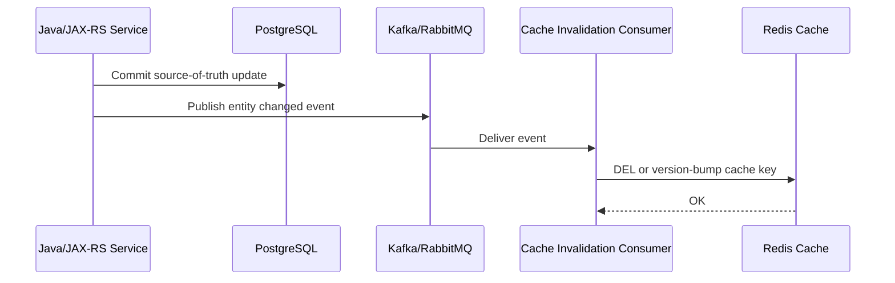
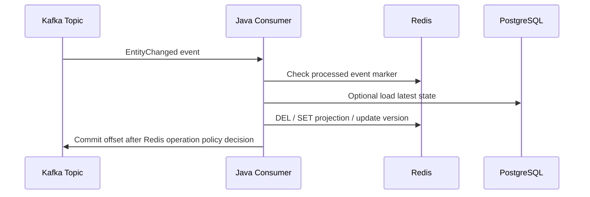
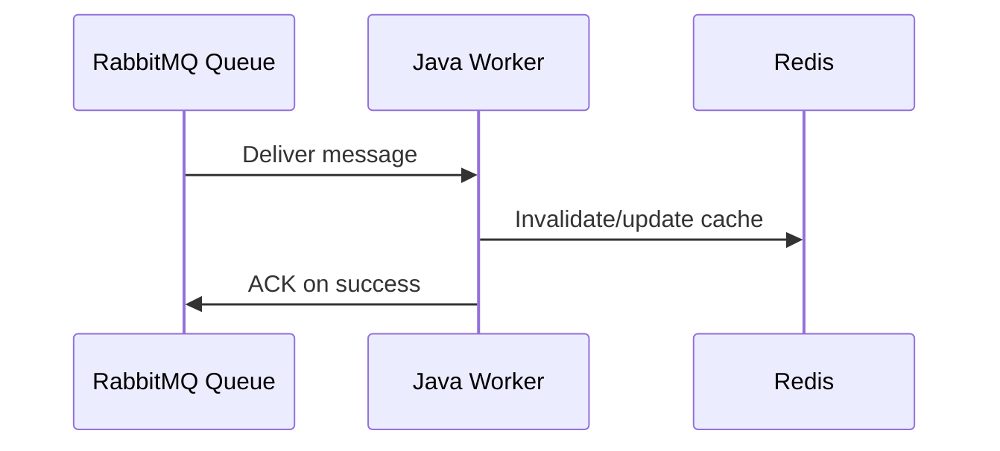
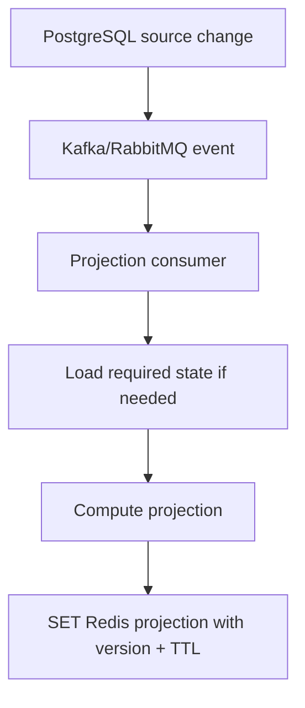
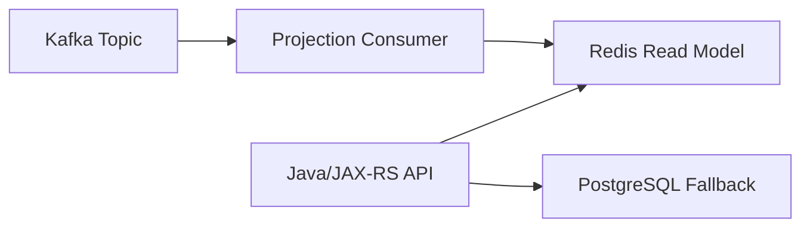
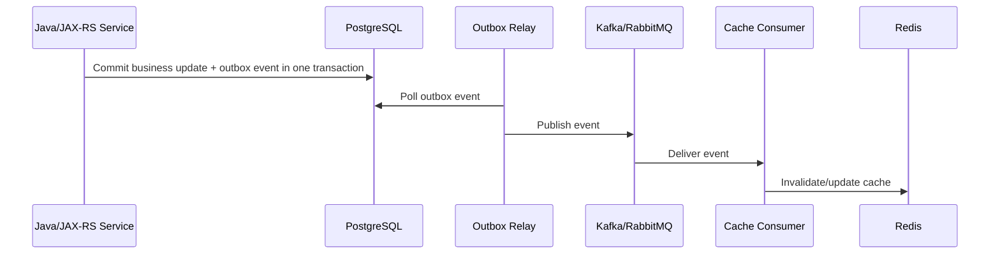
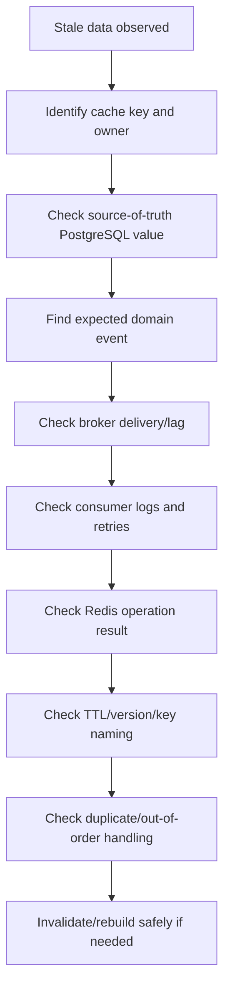

# Part 043 — Redis and Kafka/RabbitMQ Integration

Redis rarely lives alone in an enterprise backend system.

In a Java/JAX-RS microservice landscape, Redis often sits beside:

- PostgreSQL as source of truth.
- Kafka as durable event log or integration backbone.
- RabbitMQ as command/task/message broker.
- REST APIs as synchronous boundary.
- Kubernetes as runtime substrate.
- Cloud/on-prem infrastructure as deployment boundary.

This part explains how Redis interacts with Kafka and RabbitMQ without corrupting cache correctness, creating invisible stale data, losing invalidation events, or turning Redis into an accidental event store.

The most important principle:

> Redis is usually not the durable event backbone.  
> Redis is usually the fast derived state, coordination store, cache, projection, limiter, idempotency helper, or short-lived operational state.

If Redis and messaging are mixed without clear boundaries, the system often looks fast in happy path but becomes hard to reason about during retries, duplicate events, failover, replay, deployment, and incident recovery.

---

## 1. Core Mental Model

Redis + Kafka/RabbitMQ integration usually appears in one of these forms:

| Pattern | Redis Role | Broker Role |
|---|---|---|
| Event-driven cache invalidation | Holds cached read data | Publishes source-of-truth changes |
| Event-driven cache refresh | Holds refreshed projection | Delivers entity/config/catalog change events |
| Projection cache | Stores computed read model | Provides ordered or task-like updates |
| Idempotent event handling | Stores processed event marker | Delivers events that may duplicate |
| Rate/throttle coordination | Stores limiter counters | Broker controls async workload |
| Job deduplication | Stores short-lived dedupe key | RabbitMQ/Kafka carries jobs |
| Stream bridge | Redis Streams as local queue-lite | Kafka/RabbitMQ as system-level broker |
| Pub/Sub notification bridge | Redis Pub/Sub for local invalidation | Kafka/RabbitMQ for durable distribution |

The dangerous mistake is treating all message systems as equivalent.

Redis Pub/Sub, Redis Streams, Kafka, and RabbitMQ have different semantics.

---

## 2. Redis Pub/Sub vs Kafka vs RabbitMQ vs Redis Streams

### Redis Pub/Sub

Use when:

- Message loss is acceptable.
- Subscriber offline means notification is missed.
- No replay is required.
- No consumer group durability is required.
- The message is a hint, not the source of truth.

Typical use:

- Local cache invalidation hint.
- Wake-up signal.
- Lightweight fan-out inside a bounded environment.

Do not use for:

- Billing events.
- Quote/order state transition events.
- Audit-relevant domain events.
- Exactly-once expectations.
- Durable workflow orchestration.

### Redis Streams

Use when:

- You need Redis-local durable-ish queue semantics.
- Consumer group, pending entries, ack, claim, and replay matter.
- You accept Redis persistence/retention limitations.
- Workload is bounded and operationally close to Redis.

Do not blindly replace Kafka/RabbitMQ with Redis Streams for enterprise integration.

### Kafka

Use when:

- Durable ordered event log is needed.
- Replay is important.
- Consumer groups need independent offsets.
- Event history is valuable.
- High-throughput event distribution is required.
- Event-driven integration crosses service boundaries.

Kafka is often better for system-of-record change propagation.

### RabbitMQ

Use when:

- Task/message delivery semantics matter.
- Routing, exchanges, dead-lettering, retries, and work queues matter.
- You need command/task messaging rather than long-term event log.
- Backpressure and consumer acknowledgments are central.

RabbitMQ is often better for async task dispatch and routed messaging.

---

## 3. Event-Driven Cache Invalidation

The common flow:



The cache is not updated because the event says so.

The cache is invalidated because PostgreSQL changed.

The event is only the propagation mechanism.

---

## 4. The Source-of-Truth Rule

For enterprise backend systems:

> PostgreSQL/domain store should usually be the source of truth.  
> Kafka/RabbitMQ should usually transport state change signals or work.  
> Redis should usually hold derived, temporary, or acceleration state.

A Redis cache entry should be reconstructable.

If Redis contains data that cannot be rebuilt from PostgreSQL, event history, or another source, then Redis is no longer merely a cache. It has become a state store with durability, backup, recovery, and compliance obligations.

---

## 5. Invalidation Event Design

A useful invalidation event should contain enough information to invalidate precisely without embedding unnecessary sensitive data.

Example conceptual event:

```json
{
  "eventId": "01HZY...",
  "eventType": "ProductOfferingChanged",
  "entityType": "product-offering",
  "entityId": "PO-12345",
  "tenantId": "tenant-a",
  "version": 42,
  "occurredAt": "2026-07-11T10:15:30Z",
  "sourceService": "catalog-service"
}
```

Recommended properties:

- `eventId` for idempotent handling.
- `entityType` for routing.
- `entityId` for targeted invalidation.
- `tenantId` for multi-tenant isolation.
- `version` or `updatedAt` for out-of-order defense.
- `occurredAt` for observability.
- `sourceService` for debugging.

Avoid:

- Full PII payload unless absolutely required.
- Large domain payloads when only invalidation is needed.
- Cache key strings emitted by the producer unless key naming is a stable cross-service contract.
- Environment-specific Redis key names inside durable events.

---

## 6. Cache Key Derivation from Events

There are two broad approaches.

### Approach A — Event carries domain identity

The event says:

```text
tenant=a
entityType=quote
entityId=Q-123
version=9
```

The consumer derives Redis keys:

```text
prod:quote-service:tenant:a:quote:Q-123:v9
prod:quote-service:tenant:a:quote-summary:Q-123
prod:quote-service:tenant:a:quote-pricing-context:Q-123
```

This is usually better because event contracts remain domain-oriented.

### Approach B — Event carries cache key

The event says:

```json
{
  "cacheKeys": [
    "prod:quote-service:tenant:a:quote:Q-123"
  ]
}
```

This is tightly coupled.

It can be useful for internal invalidation systems, but dangerous across service boundaries because cache naming changes become event contract changes.

Use this only when ownership is explicit.

---

## 7. Duplicate Event Handling

Kafka and RabbitMQ consumers should assume duplicate delivery.

Redis update logic must be idempotent.

Good invalidation operations are naturally idempotent:

```text
DEL key
```

Deleting the same key twice is safe.

But projection updates may not be idempotent.

Risky example:

```text
INCR projected-counter
```

If the event duplicates, the counter becomes wrong.

Safer options:

- Store `eventId` processed marker with TTL.
- Use versioned projection update.
- Recompute projection from source of truth.
- Use idempotent assignment instead of incremental mutation.
- Use Kafka compacted topic or DB snapshot for rebuild.

---

## 8. Processed Event Marker in Redis

Redis can hold short-lived processed event markers:

```text
SET event-processed:{consumer}:{eventId} 1 NX EX 86400
```

But this has limits:

- TTL expiry allows old duplicate events to be processed again.
- Redis eviction can remove marker early.
- Redis outage can disable dedupe.
- Marker write can succeed while business update fails.
- Marker write can fail after business update succeeds.

Use Redis event dedupe only when duplicate processing after TTL is acceptable or another correctness guard exists.

For stronger correctness, use PostgreSQL unique constraints or durable event processing tables.

---

## 9. Out-of-Order Event Handling

Out-of-order events are common in distributed systems.

Example:

```text
Event A: quote Q-1 version 10
Event B: quote Q-1 version 11
Consumer receives B before A
```

If the consumer blindly applies A after B, Redis may regress to older state.

Safer pattern:

```text
Only apply event if event.version >= cached.version
```

For invalidation, versioning still helps:

```text
Cache key includes version:
quote:{id}:v{version}
```

or

```text
Redis stores latest known version:
quote:{id}:latest-version = 11
```

Then older events can be ignored.

---

## 10. Cache Versioning with Broker Events

Versioned cache keys reduce stale overwrite risk.

Example:

```text
catalog:tenant:{tenantId}:offering:{offeringId}:v{version}
```

Benefits:

- Old cache entries do not overwrite new ones.
- Multiple versions can coexist temporarily.
- Deployment rollback can be easier.
- Event ordering bugs are less destructive.

Costs:

- More keys.
- Cleanup needed.
- Reader must know latest version.
- Version source must be reliable.

Versioned keys are useful for catalog, pricing rules, quote calculation context, and other data where stale state can affect business correctness.

---

## 11. Kafka Consumer Updates Redis

Typical flow:



Important decision:

> Do you commit Kafka offset before or after Redis update?

### Commit after Redis update

Pros:

- Redelivery happens if Redis update fails before offset commit.

Cons:

- Duplicate Redis update possible.
- Consumer can get stuck if Redis is down.
- Backlog can grow.

### Commit before Redis update

Pros:

- Consumer does not block on Redis outage.

Cons:

- Invalidation/update can be lost.
- Stale cache can persist until TTL or manual rebuild.

Usually, for important invalidation, commit after a successful idempotent Redis operation or route failure to retry/DLQ.

---

## 12. RabbitMQ Consumer Updates Redis

Typical flow:



Important decision:

> Do you ACK before or after Redis operation?

### ACK after Redis success

Pros:

- Failed Redis update can be retried.

Cons:

- Duplicate message possible.
- Queue can build up if Redis is unavailable.
- Poison messages need DLQ.

### ACK before Redis success

Pros:

- Queue drains.

Cons:

- Lost invalidation/update.

For cache invalidation, ACK-after-success is usually safer if the handler is idempotent and DLQ exists.

---

## 13. Cache Invalidation Lag

Cache invalidation is not instantaneous.

Lag sources:

- Producer publishes event after DB commit delay.
- Broker backlog.
- Consumer lag.
- Consumer retry.
- Redis latency.
- Redis outage.
- Network partition.
- Deployment/rebalance pause.
- DLQ accumulation.

A stale cache window exists:

```text
DB commit time → cache invalidated/refreshed time
```

This window must be acceptable for the business use case.

For quote/order/pricing/catalog systems, stale windows can be more serious than for simple UI preference caches.

---

## 14. Redis Projection Cache

A projection cache stores derived read models in Redis.

Example:

```text
quote-summary:{tenantId}:{quoteId}
customer-active-orders:{tenantId}:{customerId}
catalog-offering-price-context:{tenantId}:{offeringId}
```

Projection cache flow:



Projection cache is useful when:

- Read path is expensive.
- Data can be rebuilt.
- Freshness tolerance is explicit.
- Rebuild process exists.
- Event lag is observable.

Projection cache is dangerous when:

- Redis becomes the only copy.
- Rebuild is impossible.
- Event ordering is ignored.
- TTL is missing.
- Consumer failure is not monitored.

---

## 15. Stream-to-Cache Projection

Kafka topic to Redis projection:



This pattern can make API reads fast.

But the API must know what to do when Redis projection is missing or stale.

Options:

1. Fallback to PostgreSQL.
2. Return stale data with warning/internal metric.
3. Return 503/temporary unavailable.
4. Trigger async rebuild.
5. Serve degraded response.

The correct option depends on business correctness.

---

## 16. Rebuild Projection Strategy

Every Redis projection should answer:

> If Redis is flushed, evicted, corrupted, or stale, how do we rebuild?

Common rebuild options:

- Replay Kafka topic from earliest offset.
- Replay compacted Kafka topic.
- Run PostgreSQL batch rebuild.
- Recompute on read miss.
- Trigger background warmup job.
- Restore from Redis snapshot if Redis is treated as durable enough.
- Manually run runbook.

A projection without rebuild strategy is operational debt.

---

## 17. Pub/Sub vs Broker Event

Redis Pub/Sub should not replace Kafka/RabbitMQ for durable integration.

Good use:

```text
Kafka event → durable invalidation consumer → Redis DEL → Redis Pub/Sub local wake-up
```

Bad use:

```text
Redis Pub/Sub is the only notification that catalog changed
```

If a subscriber is offline, the change is lost.

For CSG-like enterprise systems, any quote/order/catalog/pricing event with business correctness impact should generally use durable messaging or database-backed reconciliation, not plain Pub/Sub.

---

## 18. Redis + Messaging Failure Matrix

| Failure | Symptom | Risk | Safer Response |
|---|---|---|---|
| Redis down, broker up | Consumer cannot update cache | Stale cache or growing backlog | Retry, DLQ, fallback TTL, degrade reads |
| Broker down, Redis up | Events not delivered | Cache not invalidated | TTL fallback, manual invalidation, reconcile job |
| Consumer down | Lag grows | Stale projection | Alert on consumer lag |
| Redis update succeeds, offset commit fails | Duplicate event later | Double processing | Idempotent Redis update |
| Offset commit succeeds, Redis update fails | Lost invalidation | Stale cache | Avoid commit-before-update for critical invalidation |
| Out-of-order event | Old state overwrites new | Data regression | Version check |
| Duplicate event | Double mutation | Wrong counters/projection | Event marker/idempotent assignment |
| DLQ ignored | Permanent stale data | Silent correctness bug | DLQ alert + replay runbook |

---

## 19. Java/JAX-RS Impact

Redis + Kafka/RabbitMQ integration impacts synchronous Java/JAX-RS APIs in subtle ways.

API read path must define:

- Is Redis cache authoritative enough for this response?
- What happens on cache miss?
- What happens if projection is stale?
- Should API fallback to PostgreSQL?
- Should API block on rebuild?
- Should API expose degraded response?
- Should cache version be checked?
- Should tenant isolation be enforced in key design?

API write path must define:

- Is cache invalidated synchronously after DB commit?
- Is event published using outbox?
- Is invalidation eventual?
- Is stale read acceptable immediately after write?
- Does response need read-your-writes consistency?

---

## 20. PostgreSQL Transaction and Outbox Pattern

A common issue:

```text
DB update succeeds
Kafka publish fails
Cache remains stale
```

A safer design uses transactional outbox:



The outbox prevents losing the intent to publish after DB commit.

Redis invalidation is still eventual, but the event pipeline is more recoverable.

---

## 21. Redis Update as Side Effect

Treat Redis updates from message consumers as side effects.

A side effect should be:

- Idempotent.
- Retry-safe.
- Observable.
- Rebuildable.
- Bounded by TTL or version.
- Safe under duplicate delivery.
- Safe under partial failure.

If it cannot be made safe, reconsider whether Redis should be the target of that message.

---

## 22. Idempotent Cache Update Patterns

### Pattern A — Delete only

```text
DEL cache:key
```

Simple, idempotent, safe.

Downside: next read pays reload cost.

### Pattern B — Set latest snapshot

```text
SET cache:key payload EX ttl
```

Safe if payload is latest.

Need version check.

### Pattern C — Compare version then set

Pseudo-flow:

```text
currentVersion = GET cache:key:version
if event.version >= currentVersion:
  SET cache:key payload
  SET cache:key:version event.version
```

This should be atomic if correctness matters, preferably Lua or a single structured payload.

### Pattern D — Rebuild from DB

Consumer receives event, loads latest state from DB, writes projection to Redis.

This avoids trusting event ordering for full data, but increases DB load.

---

## 23. Anti-Patterns

### Anti-pattern: Redis cache updated by every service directly

Symptoms:

- No clear cache owner.
- Key naming inconsistent.
- Race conditions across services.
- Hard-to-debug stale data.

Better:

- Cache owner per keyspace.
- Shared invalidation contract.
- Dedicated projection consumer where needed.

### Anti-pattern: Broker event contains Redis command

Example:

```json
{
  "operation": "DEL",
  "key": "prod:quote:123"
}
```

This couples domain eventing to Redis implementation.

Better:

```json
{
  "eventType": "QuoteChanged",
  "quoteId": "123",
  "tenantId": "tenant-a",
  "version": 7
}
```

### Anti-pattern: Redis Pub/Sub used for durable cache invalidation

If the invalidation cannot be missed, Pub/Sub alone is not enough.

### Anti-pattern: Incremental projection without duplicate defense

```text
event: OrderCreated
consumer: INCR customer-order-count
```

Duplicate event increments twice.

Use idempotency, rebuildable projection, or assignment from source-of-truth.

---

## 24. Observability Requirements

For Redis + messaging integration, observe both sides.

### Broker metrics

- Kafka consumer lag.
- RabbitMQ queue depth.
- Retry count.
- DLQ count.
- Rebalance frequency.
- Consumer error rate.
- Message processing latency.

### Redis metrics

- Command latency.
- Error rate.
- Timeouts.
- Cache hit/miss ratio.
- Evicted keys.
- Expired keys.
- Memory pressure.
- Key count per projection.
- Stream pending entries if Redis Streams used.

### Application metrics

- Cache invalidation success/failure.
- Projection update success/failure.
- Event age at processing time.
- Stale read count.
- Fallback-to-DB count.
- Rebuild job duration.
- Per-tenant invalidation volume.

---

## 25. Logging and Correlation

A useful log for cache invalidation should include:

```text
eventId
eventType
tenantId
entityType
entityId
eventVersion
consumerName
redisOperation
redisKeyPattern
result
latencyMs
retryAttempt
correlationId
```

Do not log sensitive Redis values.

Be careful with PII in key names.

---

## 26. Kubernetes Deployment Concerns

Redis + message consumers in Kubernetes introduce additional failure modes:

- Rolling update pauses consumers.
- Consumer group rebalance increases lag.
- Pod CPU throttling increases processing delay.
- Redis connection pool per pod multiplies total connections.
- DNS/network policy misconfiguration causes Redis timeouts.
- Secret rotation breaks Redis auth.
- HPA scale-out causes Redis connection storms.
- Node disruption can cause Redis failover plus consumer restart at the same time.

Review both application Deployment and Redis/client configuration.

---

## 27. Cloud and Hybrid Concerns

In AWS/Azure/on-prem/hybrid deployments, watch for:

- Cross-region latency between broker, Redis, and service.
- Private endpoint/VNet/security group mismatch.
- Managed Redis failover behavior.
- Broker and Redis maintenance windows overlapping.
- TLS and certificate compatibility.
- On-prem firewall idle timeout.
- Cloud-to-on-prem Redis access risk.
- Observability split across CloudWatch/Azure Monitor/Prometheus.

If Redis and broker live in different network zones, invalidation lag can become unpredictable.

---

## 28. Review Checklist

Use this checklist during PR or architecture review.

### Event contract

- Is the event domain-oriented rather than Redis-command-oriented?
- Does it include event ID?
- Does it include tenant ID if multi-tenant?
- Does it include entity ID/type?
- Does it include version or updated timestamp?
- Does it avoid sensitive payload unless required?

### Idempotency

- Can the handler process the same event twice safely?
- Are deletes idempotent?
- Are incremental mutations protected?
- Is there a processed-event marker or DB constraint if needed?
- What happens after dedupe TTL expires?

### Ordering

- Can old events overwrite new cache state?
- Is version checked?
- Is event ordering guaranteed only within a partition/routing key?
- Is the partition key correct for entity ordering?

### Redis correctness

- Is Redis source of truth or derived state?
- Can Redis state be rebuilt?
- Is TTL defined?
- Is eviction acceptable?
- Is key ownership documented?

### Broker behavior

- When is Kafka offset committed?
- When is RabbitMQ ACK sent?
- Is retry configured?
- Is DLQ configured?
- Is DLQ monitored?
- Is consumer lag alerted?

### Failure mode

- What if Redis is down?
- What if broker is down?
- What if consumer is down?
- What if Redis succeeds but offset commit fails?
- What if offset commit succeeds but Redis fails?
- What if duplicate/out-of-order event arrives?

### Observability

- Is event processing latency measured?
- Is invalidation lag measured?
- Is stale read rate measured?
- Is fallback-to-DB measured?
- Are Redis timeouts/errors visible?
- Are per-tenant spikes visible?

---

## 29. Internal Verification Checklist

Verify these in the internal codebase/team before assuming anything:

- Which services publish events that affect Redis cache?
- Which services consume Kafka/RabbitMQ events and update Redis?
- Are Redis key names owned by producer, consumer, or API service?
- Is Redis used for event deduplication?
- Are Kafka offsets committed before or after Redis writes?
- Are RabbitMQ messages ACKed before or after Redis writes?
- Is there a DLQ for cache invalidation/projection failures?
- Is there a projection rebuild runbook?
- Are duplicate/out-of-order events handled?
- Are event versions available?
- Is tenant ID always included in event and key?
- Are sensitive values ever placed in Redis keys or invalidation logs?
- Are consumer lag and Redis latency correlated in dashboards?
- Is Redis Pub/Sub used anywhere for critical invalidation?
- Is there a documented stale data tolerance per cache use case?
- Do platform/SRE/backend teams agree on Redis + broker responsibility boundaries?

---

## 30. Production Debugging Flow

When cache appears stale after an event:



Do not start by running broad Redis key scans in production.

Start from:

1. Entity identity.
2. Tenant.
3. Source-of-truth state.
4. Event ID/version.
5. Consumer result.
6. Redis key and TTL.

---

## 31. Summary

Redis + Kafka/RabbitMQ integration is powerful but easy to misread.

The safe mental model:

- PostgreSQL owns durable business state.
- Kafka/RabbitMQ transport durable change/work signals.
- Redis accelerates reads, stores derived state, or coordinates short-lived behavior.
- Every Redis update from messaging must be idempotent, observable, retry-aware, and rebuildable.
- Cache invalidation has lag.
- Duplicate and out-of-order events are normal.
- Pub/Sub is not durable.
- Redis projections need rebuild strategy.
- PR review must focus on correctness before performance.

The senior-engineer question is not:

> Can Redis update this quickly?

The better question is:

> What happens when the event duplicates, arrives late, Redis fails, the consumer restarts, and the cache is stale during a customer operation?
