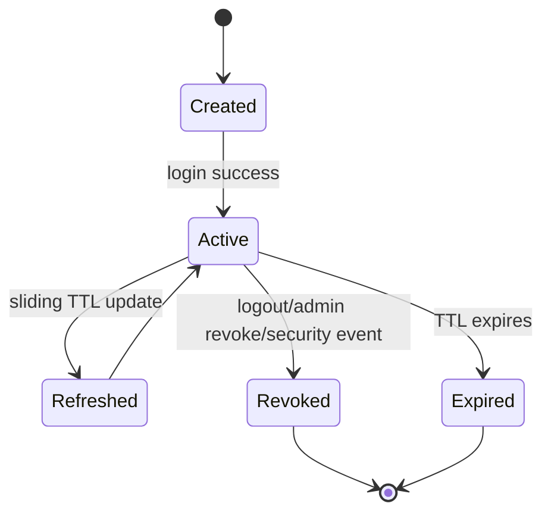
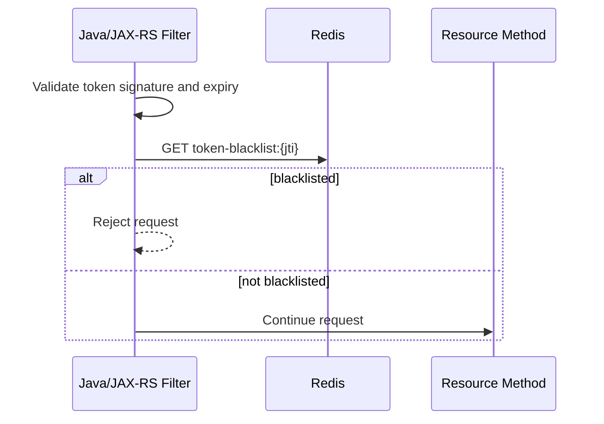
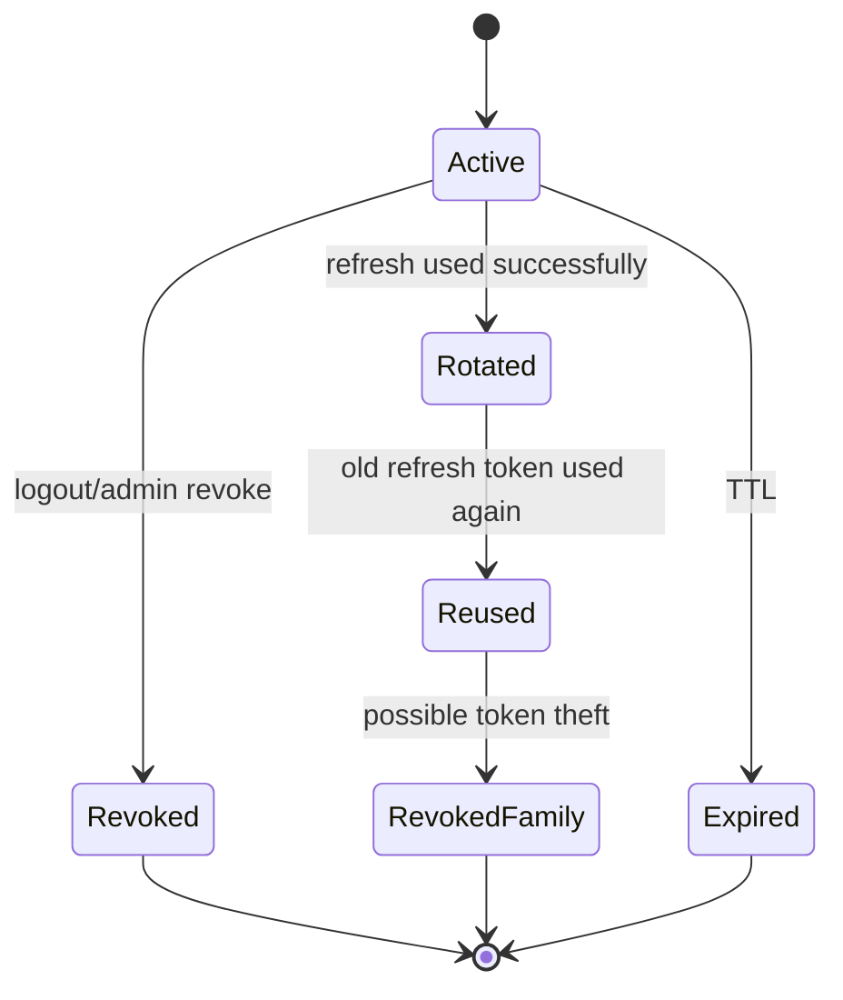
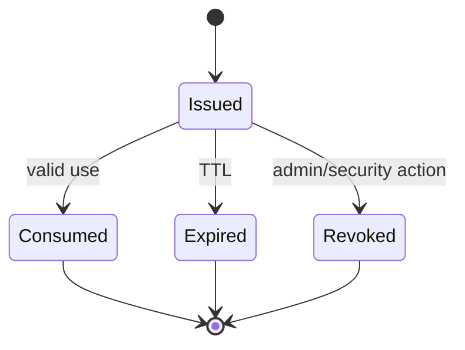
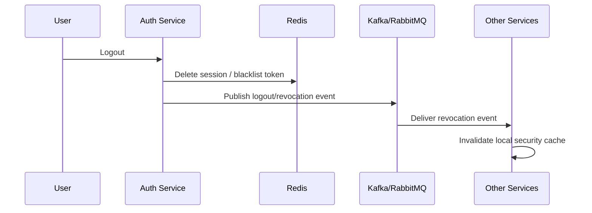
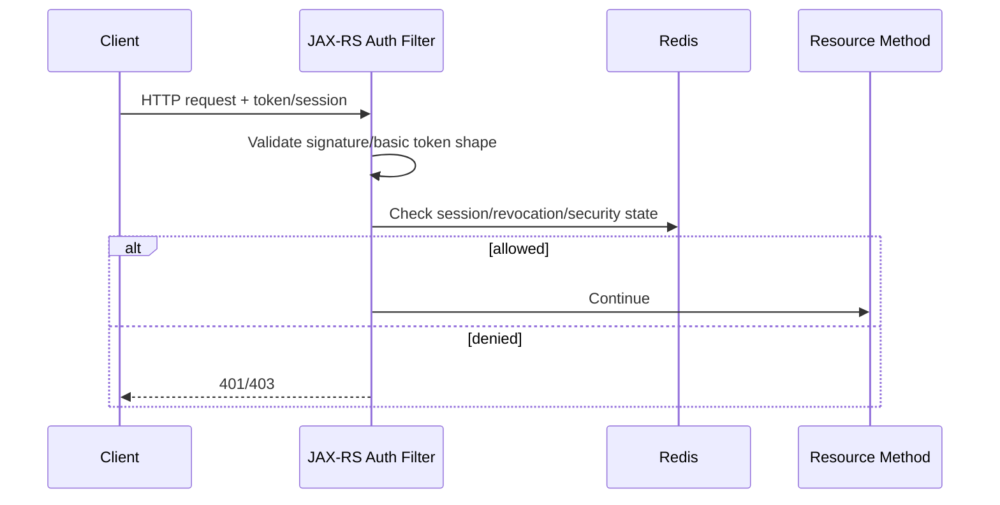
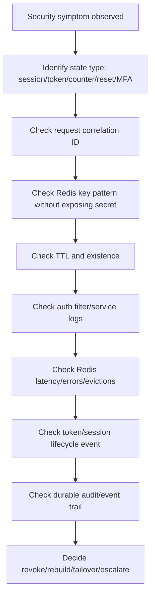

# Part 044 — Redis for Sessions, Tokens, and Security State

Redis is frequently used for short-lived security state because it is fast, centralized, TTL-aware, and simple to access from Java services.

Common examples:

- Web session store.
- Token blacklist.
- Refresh token state.
- Login attempt counter.
- MFA attempt counter.
- Password reset token.
- CSRF token.
- One-time token.
- Device/session registry.
- Logout propagation state.
- Temporary authorization challenge state.

This is useful, but risky.

Security state is not ordinary cache.

A stale product catalog cache may show old data.  
A broken token blacklist may allow access that should have been revoked.  
A missing login attempt counter may weaken brute-force protection.  
A Redis outage may turn authentication into either fail-open or fail-closed behavior.

The core rule:

> Treat Redis security state as correctness-sensitive expiring state, not just performance cache.

---

## 1. Redis Security State Mental Model

Security state in Redis usually has these properties:

- Short-lived.
- TTL-bound.
- Read frequently.
- Written during authentication or authorization flows.
- Sensitive by implication even when value is opaque.
- Requires strict namespace and tenant/user isolation.
- Needs defined outage behavior.
- Needs observability and auditability.

Unlike ordinary cache, security state can directly affect:

- Access control.
- Session validity.
- Token revocation.
- Account lockout.
- MFA enforcement.
- Password reset safety.
- Fraud/risk controls.

---

## 2. Common Security State Types

| State Type | Redis Structure | TTL Required | Correctness Sensitivity |
|---|---|---:|---|
| Session | String/hash | Yes | High |
| Token blacklist | String/set | Yes | High |
| Refresh token record | String/hash | Yes | High |
| Login attempt counter | String/counter | Yes | High |
| MFA attempt counter | String/counter | Yes | High |
| Password reset token | String | Yes | Very high |
| CSRF token | String/set | Yes | Medium/high |
| One-time token | String | Yes | Very high |
| Logout marker | String/set | Yes | High |
| Device session registry | Hash/set/sorted set | Usually | High |

Any security state without TTL should be treated as suspicious.

---

## 3. Session Store

A Redis session store may hold:

```json
{
  "sessionId": "opaque-session-id",
  "userId": "user-123",
  "tenantId": "tenant-a",
  "roles": ["agent", "admin"],
  "createdAt": "2026-07-11T10:00:00Z",
  "lastSeenAt": "2026-07-11T10:30:00Z",
  "expiresAt": "2026-07-11T18:00:00Z"
}
```

Possible key:

```text
prod:auth-service:tenant:{tenantId}:session:{sessionId}
```

But never put sensitive raw token values or PII directly in key names.

Prefer opaque identifiers or hashed identifiers.

---

## 4. Session Lifecycle



Important lifecycle decisions:

- Is session TTL absolute or sliding?
- Is max session lifetime enforced?
- Does activity extend TTL?
- Does logout delete session or mark it revoked?
- Can admin revoke all sessions for a user?
- Can tenant-wide revocation happen?
- What happens if Redis is down during authorization check?

---

## 5. Absolute TTL vs Sliding TTL

### Absolute TTL

Session expires at a fixed time after creation.

Pros:

- Simple.
- Bounded lifetime.
- Safer for compliance.

Cons:

- Active users may be logged out.

### Sliding TTL

Session extends on activity.

Pros:

- Better UX.

Cons:

- Can live indefinitely if no max lifetime is enforced.
- Requires careful TTL update policy.
- High-volume TTL updates can pressure Redis.
- Race conditions may occur during concurrent requests.

Recommended pattern:

```text
session_ttl = idle timeout
session_max_lifetime = absolute cap
```

Store both:

```json
{
  "createdAt": "...",
  "lastSeenAt": "...",
  "absoluteExpiresAt": "...",
  "idleExpiresAt": "..."
}
```

Redis TTL should not be the only source of session lifetime logic if max lifetime matters.

---

## 6. Token Blacklist

Token blacklist is common with JWT when tokens are otherwise stateless.

Key example:

```text
prod:auth-service:token-blacklist:{tokenHash}
```

Value:

```text
revoked
```

TTL:

```text
remaining token lifetime
```

Do not store raw token as key.

Use a cryptographic hash of token ID (`jti`) or token value if unavoidable.

Better if JWT includes `jti`:

```text
token-blacklist:{jti}
```

Blacklist check:



---

## 7. Token Blacklist Failure Behavior

Critical design question:

> If Redis is unavailable, do we allow or reject token-authenticated requests?

### Fail-open

Request continues if Redis cannot be checked.

Pros:

- Higher availability.

Cons:

- Revoked tokens may remain usable.

### Fail-closed

Request rejected if Redis cannot be checked.

Pros:

- Stronger security.

Cons:

- Redis outage becomes authentication outage.

### Risk-based hybrid

Example:

- Fail-open for low-risk read-only APIs.
- Fail-closed for admin/payment/security-sensitive actions.
- Fail-closed for known high-risk tenants/users.
- Short circuit after Redis outage alert.
- Use local emergency denylist if available.

The correct policy must be explicit and approved by security/product/platform stakeholders.

---

## 8. Refresh Token State

Refresh tokens are often more sensitive than access tokens because they can mint new access tokens.

Redis can store refresh token state:

```text
prod:auth-service:tenant:{tenantId}:refresh-token:{tokenIdHash}
```

Value:

```json
{
  "userId": "user-123",
  "tenantId": "tenant-a",
  "deviceId": "device-789",
  "issuedAt": "...",
  "expiresAt": "...",
  "rotatedFrom": "...",
  "status": "active"
}
```

Security considerations:

- Store token ID hash, not raw token.
- TTL must match refresh token expiry.
- Support rotation.
- Detect reuse of old refresh token.
- Revoke token family on suspected theft.
- Avoid long-lived Redis-only state unless persistence/recovery is designed.

---

## 9. Refresh Token Rotation

State machine:



Redis can help implement fast lookup, but correctness matters.

Race condition:

```text
Two refresh requests arrive concurrently with same refresh token.
```

Unsafe result:

- Both succeed.
- Two new token families are created.

Safer approach:

- Use atomic `SET NX` marker for refresh processing.
- Use Lua to transition token status atomically.
- Use PostgreSQL unique/transactional state if refresh token correctness is critical.
- Make token rotation idempotent for duplicate client retries where possible.

---

## 10. Login Attempt Counter

Redis is commonly used for brute-force protection.

Key:

```text
prod:auth-service:tenant:{tenantId}:login-attempt:user:{userId}
```

or

```text
prod:auth-service:login-attempt:ip:{ipHash}
```

Command pattern:

```text
INCR key
EXPIRE key windowSeconds
```

But `INCR` then `EXPIRE` as separate commands has an atomicity gap.

Safer:

- Use Lua to increment and set TTL if first attempt.
- Use Redis transaction carefully.
- Use a rate limiter library with known semantics.

---

## 11. Login Counter Dimensions

Limiters can be scoped by:

- Username.
- User ID.
- Tenant ID.
- IP address.
- Device fingerprint.
- Endpoint.
- ASN/country/risk signal.
- Combination key.

Example:

```text
login-attempt:tenant:{tenantId}:user:{userId}
login-attempt:tenant:{tenantId}:ip:{ipHash}
login-attempt:global:ip:{ipHash}
```

Avoid raw IP if privacy policy requires hashing or truncation.

Avoid raw username/email in key names.

---

## 12. MFA Attempt Counter

MFA attempt counters need shorter windows and stricter semantics.

Example:

```text
prod:auth-service:tenant:{tenantId}:mfa-attempt:challenge:{challengeId}
```

State:

```json
{
  "attempts": 2,
  "maxAttempts": 5,
  "createdAt": "...",
  "expiresAt": "..."
}
```

Important:

- Challenge ID should be opaque.
- TTL should match challenge lifetime.
- Increment must be atomic.
- Successful MFA should delete or mark challenge consumed.
- Reuse after success should fail.

---

## 13. Password Reset Token

Password reset token is highly sensitive.

Recommended Redis key:

```text
prod:auth-service:tenant:{tenantId}:password-reset:{tokenHash}
```

Value:

```json
{
  "userId": "user-123",
  "tenantId": "tenant-a",
  "createdAt": "...",
  "expiresAt": "...",
  "used": false
}
```

Important:

- Store token hash, not token.
- Short TTL.
- One-time use.
- Atomic consume.
- Delete or mark used after success.
- Do not reveal whether email/user exists.
- Log only token hash prefix if absolutely needed, preferably not at all.

Atomic consume is critical:

```text
GET token
if valid and unused:
  mark used
  continue reset
```

This must not allow concurrent double-use.

Use Lua or durable DB transaction if required.

---

## 14. CSRF Token

Redis may store CSRF token state for server-side CSRF validation.

Key:

```text
prod:web-service:tenant:{tenantId}:csrf:{sessionIdHash}:{tokenHash}
```

Consider:

- TTL should match session or form lifetime.
- Token should be random and opaque.
- Multiple active forms may require multiple tokens.
- One-time CSRF tokens improve security but increase state churn.
- Do not put raw session ID/token in key.

---

## 15. One-Time Token

One-time tokens appear in:

- Email verification.
- Device confirmation.
- Passwordless login.
- Invite acceptance.
- Sensitive action confirmation.

State machine:



Correctness requirement:

> A one-time token must not be consumed twice.

Redis implementation must use atomic consume.

Possible Lua concept:

```lua
-- Pseudocode only
-- if key exists and not consumed, mark consumed/delete and return payload
-- else return invalid
```

If consuming the token also updates PostgreSQL, define failure behavior:

- Token consumed in Redis but DB update fails.
- DB update succeeds but token delete fails.
- Client timeout after success.

For high-stakes actions, PostgreSQL may be better as the source of truth.

---

## 16. Logout Propagation

Logout can be modeled as:

1. Delete session key.
2. Add token `jti` to blacklist until token expiry.
3. Publish logout event.
4. Invalidate local caches.
5. Revoke refresh token family.

For distributed services:



Redis alone may not propagate logout to services with local caches unless they check Redis on every request or receive a durable event.

---

## 17. Session Revocation

Revocation scenarios:

- User logout.
- Admin disables user.
- Password changed.
- MFA reset.
- Tenant suspended.
- Security incident.
- Role/permission changed.
- Device removed.

Redis keys may need invalidation by:

- session ID,
- user ID,
- tenant ID,
- device ID,
- token family,
- role version.

Design key indexes carefully.

Example:

```text
session:{sessionId} -> session payload
user-sessions:{userId} -> set of sessionIds
tenant-sessions:{tenantId} -> set or index, if needed
```

But maintaining secondary indexes in Redis creates consistency problems.

If indexes are needed for strong revocation, consider PostgreSQL as revocation source and Redis as acceleration.

---

## 18. Authorization Cache Risk

Sometimes services cache authorization state in Redis:

```text
user-permissions:{tenantId}:{userId}
role-policy:{tenantId}:{roleId}
```

Risk:

- Permission changes may not apply immediately.
- Stale authorization can allow unauthorized access.
- Tenant suspension may not propagate.
- Role downgrade can be delayed.

Safer patterns:

- Short TTL.
- Versioned permission cache.
- Permission version claim in token.
- Event-driven invalidation.
- Fail-closed for sensitive actions.
- Check source of truth for admin/security-critical paths.

---

## 19. Key Design for Security State

Good security key design:

```text
{env}:{service}:tenant:{tenantId}:{stateType}:{opaqueId}
```

Examples:

```text
prod:auth-service:tenant:t-123:session:sess_abc_hash
prod:auth-service:tenant:t-123:token-blacklist:jti_456
prod:auth-service:tenant:t-123:password-reset:tok_hash_789
```

Avoid:

```text
session:john@example.com
password-reset:raw-token-value
blacklist:full-jwt-token
tenant:customer-name:session:...
```

Security key naming rules:

- No raw token.
- No email.
- No phone number.
- No national ID.
- No secret.
- Prefer opaque IDs or hashes.
- Include tenant boundary.
- Include state type.
- Include environment/service prefix.

---

## 20. TTL Policy for Security State

TTL must map to security semantics.

| State | TTL Policy |
|---|---|
| Session | Idle timeout plus absolute max lifetime |
| Access token blacklist | Remaining access token lifetime |
| Refresh token state | Refresh token expiry |
| Login attempt counter | Rate limiting window |
| MFA challenge | Challenge expiry |
| Password reset token | Very short expiry |
| CSRF token | Session/form lifetime |
| One-time token | Short action window |
| Logout marker | Token/session max remaining lifetime |

Do not use arbitrary TTL like "24 hours" without linking it to security semantics.

---

## 21. Eviction Risk

Security state should usually not be evicted unexpectedly.

If Redis eviction removes:

- token blacklist entry → revoked token may work again.
- login attempt counter → brute-force protection weakens.
- session entry → user is logged out unexpectedly.
- password reset token → user flow breaks.
- one-time consumed marker → token replay may become possible if source cannot detect reuse.

For security-critical Redis usage, verify:

- `maxmemory-policy`.
- memory headroom.
- eviction alerts.
- key TTL.
- fallback behavior.
- whether data needs durable DB backup.

`allkeys-lru` may be unacceptable for some security state.

---

## 22. Persistence and Durability

Ask:

> If Redis restarts and loses security state, what happens?

For each use case:

- Are all users logged out?
- Are revoked tokens forgotten?
- Are refresh tokens invalid?
- Are login counters reset?
- Are password reset tokens invalidated?
- Is this acceptable?

For high-security systems, Redis may need:

- AOF/persistence.
- PostgreSQL backing store.
- short token lifetime.
- fail-closed policy.
- emergency revoke-all version.
- global session version stored durably.

---

## 23. Global Revocation Version

A useful pattern is global/user/tenant security version.

Example:

```text
tenant-security-version:{tenantId} = 17
user-security-version:{tenantId}:{userId} = 42
```

Tokens include version claims:

```json
{
  "tenantId": "tenant-a",
  "userId": "user-123",
  "userSecurityVersion": 42,
  "tenantSecurityVersion": 17
}
```

On request:

- Validate token.
- Fetch current version from Redis or durable source.
- Reject if token version is older.

This helps with broad revocation without tracking every token.

But the version source must be reliable.

If Redis is the only version store and loses data, revocation can break.

---

## 24. Java/JAX-RS Integration Point

Security state is usually checked in:

- JAX-RS request filter.
- Authentication filter.
- Authorization interceptor.
- Resource method guard.
- Service-layer permission check.
- Gateway layer.
- Sidecar/proxy layer.

Typical flow:



Important:

- Redis timeout must be short.
- Security failure must map clearly to 401/403/503.
- Do not leak whether token/user exists.
- Correlation ID should be logged.
- Sensitive token values must not be logged.
- Bulkhead security Redis calls separately if needed.

---

## 25. Error Mapping

Possible mappings:

| Scenario | Possible Response |
|---|---|
| Missing token/session | 401 |
| Invalid token signature | 401 |
| Expired token | 401 |
| Blacklisted token | 401 |
| Valid identity but insufficient permission | 403 |
| Redis unavailable and fail-closed | 503 or 401/403 depending policy |
| Redis timeout for high-risk API | 503/fail-closed |
| Redis timeout for low-risk API | policy-specific fail-open |
| MFA challenge exceeded attempts | 429 or 403 |
| Password reset token invalid | generic invalid/expired response |

Be careful:

- `401` can trigger re-auth.
- `403` means authenticated but not allowed.
- `429` means throttled.
- `503` means service dependency unavailable.
- Security policy may intentionally hide details.

---

## 26. Rate Limiting vs Security Counters

Login attempt counters are related to rate limiting but not identical.

Rate limiter asks:

> How many requests are allowed in this window?

Security counter asks:

> Is this actor/action suspicious enough to block, challenge, or escalate?

Security counters may need:

- risk scoring,
- device/user/IP dimensions,
- account lockout,
- MFA escalation,
- audit trail,
- durable evidence,
- manual unlock workflow.

Redis can accelerate counters, but durable security evidence may belong elsewhere.

---

## 27. Sensitive Data Handling

Never assume Redis is safe for sensitive data just because it is internal.

Review:

- Key names.
- Values.
- Logs.
- Metrics labels.
- Traces.
- Dumps.
- Snapshots.
- Backups.
- Admin CLI access.
- Slowlog.
- MONITOR usage.
- Incident screenshots.

Sensitive values include:

- raw tokens,
- session IDs,
- reset tokens,
- email addresses,
- phone numbers,
- user IDs depending policy,
- tenant names depending policy,
- permission sets,
- security flags,
- fraud/risk state.

Hash or tokenize identifiers where appropriate.

---

## 28. Observability

Security Redis usage needs specific metrics.

### Session metrics

- active sessions,
- session validation latency,
- session missing rate,
- session expired rate,
- session revoked rate.

### Token metrics

- blacklist check latency,
- blacklist hits,
- revocation count,
- refresh token rotation failures,
- token reuse detections.

### Counter metrics

- login attempt increments,
- blocked login attempts,
- MFA failures,
- reset token invalid attempts,
- per-tenant spikes.

### Redis dependency metrics

- timeout rate,
- auth errors,
- connection pool exhaustion,
- command latency,
- memory pressure,
- evictions.

Do not put raw user/token/session IDs in metric labels.

---

## 29. Audit and Compliance

For security-sensitive Redis flows, audit usually cannot rely only on Redis.

Redis may hold short-lived state, but durable audit should record:

- login success/failure,
- MFA challenge success/failure,
- token refresh,
- token revocation,
- password reset requested/completed,
- admin session revocation,
- suspicious token reuse,
- account lockout,
- security policy changes.

Audit events should go to durable logs, database, SIEM, or event pipeline according to internal policy.

Redis is not an audit log.

---

## 30. Kubernetes and Runtime Risk

Security-state Redis calls are often on the request critical path.

Kubernetes issues can become security outages:

- Redis DNS issue → auth filter timeout.
- HPA scale-out → connection storm.
- CPU throttling → auth latency spike.
- secret rotation → Redis AUTH failures.
- network policy change → all auth checks fail.
- pod rolling update → local cache lost.
- Redis failover → reconnect storm.

Security path should have:

- short timeout,
- circuit breaker policy,
- bounded connection pool,
- clear fail-open/fail-closed behavior,
- alerting,
- emergency runbook.

---

## 31. Cloud/On-Prem Concerns

Verify deployment-specific security:

- TLS in transit.
- AUTH/ACL.
- private endpoint/security group/firewall.
- encryption at rest if snapshots/persistence enabled.
- backup access.
- admin access control.
- secret rotation.
- monitoring access.
- cross-region replication behavior.
- failover behavior.
- maintenance windows.

For hybrid systems, avoid sending security-state Redis traffic across unreliable network paths unless latency and availability are acceptable.

---

## 32. Failure Mode Matrix

| Failure | Impact | Design Response |
|---|---|---|
| Redis unavailable | Auth/session checks fail | explicit fail-open/fail-closed policy |
| Redis slow | Request latency spike | short timeout + circuit breaker |
| Key evicted | revoked token/session state lost | memory policy review + alerts |
| TTL too long | stale security state | align TTL to security semantics |
| TTL too short | premature logout/token failure | test TTL behavior |
| Duplicate token consume | one-time token reused | atomic consume |
| Concurrent refresh | multiple token families | atomic rotation/DB backing |
| Raw token logged | credential leak | redaction and hashing |
| Snapshot exposed | sensitive data leak | encryption/access control |
| Pub/Sub revocation lost | stale local auth cache | durable revocation event or polling |
| Redis restart loses blacklist | revoked tokens usable | persistence/short token TTL/global version |

---

## 33. PR Review Checklist

Use this when reviewing Redis security-state changes.

### Data model

- What security state is stored?
- Is Redis the source of truth or acceleration layer?
- Is the value sensitive?
- Is the key sensitive?
- Is tenant/user isolation explicit?

### TTL

- Is TTL mandatory?
- Does TTL match session/token/challenge lifetime?
- Is absolute max lifetime enforced?
- Is sliding TTL bounded?
- What happens when key expires?

### Atomicity

- Does one-time token consume happen atomically?
- Does refresh token rotation handle concurrency?
- Does login/MFA attempt increment set TTL safely?
- Are multi-step Redis operations protected with Lua/transaction/DB?

### Failure behavior

- What if Redis is unavailable?
- What if Redis is slow?
- Does the API fail-open or fail-closed?
- Is the behavior different for high-risk endpoints?
- Is this policy approved?

### Security

- Are raw tokens avoided in keys/values/logs?
- Is TLS used?
- Are ACLs scoped?
- Are dangerous commands restricted?
- Is backup/snapshot access controlled?

### Observability

- Are auth Redis timeouts visible?
- Are revocation hits visible?
- Are login/MFA block metrics visible?
- Are evictions alerted?
- Are audit events durable?

---

## 34. Internal Verification Checklist

Verify these with internal codebase and teams:

- Is Redis used as session store?
- Is Redis used for token blacklist?
- Are refresh tokens stored or tracked in Redis?
- Are login/MFA/password reset counters stored in Redis?
- Are raw tokens/session IDs stored in keys?
- Are keys tenant-scoped?
- Are TTLs aligned with security policy?
- Is sliding session enabled?
- Is absolute max session lifetime enforced?
- What is fail-open vs fail-closed behavior?
- Is Redis on auth critical path?
- Are Redis auth failures mapped to 401/403/503 consistently?
- Is Redis eviction policy acceptable for security state?
- Is persistence required for revocation/session state?
- Are token revocation events durable?
- Are local auth caches invalidated safely?
- Are audit events stored durably outside Redis?
- Do security/platform/backend teams agree on outage behavior?

---

## 35. Production Debugging Flow

When security state behaves incorrectly:



Examples:

### User remains logged in after logout

Check:

- Was session key deleted?
- Was token blacklisted?
- Was blacklist TTL correct?
- Is service checking blacklist?
- Does local cache ignore revocation?
- Did revocation event fail?
- Did Redis evict blacklist key?

### User is logged out too early

Check:

- Session TTL.
- Sliding TTL update.
- Redis eviction.
- Clock mismatch in application payload.
- Session key naming mismatch.
- Multi-region Redis routing.

### Login lockout not working

Check:

- Counter key dimension.
- Atomic INCR+EXPIRE.
- TTL reset bug.
- Multiple services using different key prefixes.
- Redis failure fallback.
- IP/user normalization.

### Password reset token reused

Check:

- Atomic consume.
- Concurrent requests.
- Token hash.
- Redis delete/update failure.
- DB update failure window.
- Audit trail.

---

## 36. Summary

Redis is useful for security state because it is fast, centralized, and TTL-native.

But security state is not ordinary cache.

A senior engineer should always ask:

- What security decision depends on this Redis key?
- What is the TTL and why?
- Is Redis the source of truth?
- What happens if the key is evicted?
- What happens if Redis is unavailable?
- Is failure fail-open or fail-closed?
- Is one-time state consumed atomically?
- Are raw tokens or PII exposed in keys/logs?
- Is durable audit stored elsewhere?
- Can revocation be trusted after Redis restart?

Redis can make authentication and authorization systems fast.

Used carelessly, it can also make them silently unsafe.
