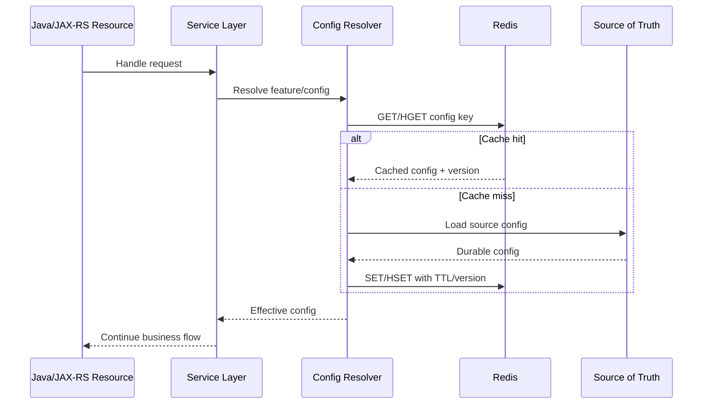
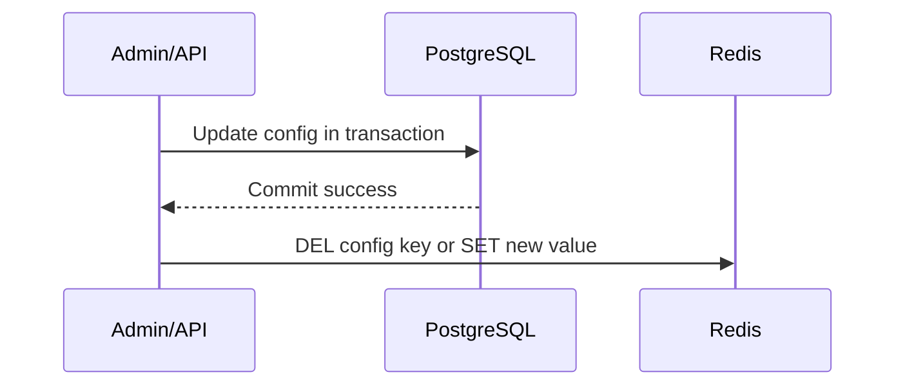
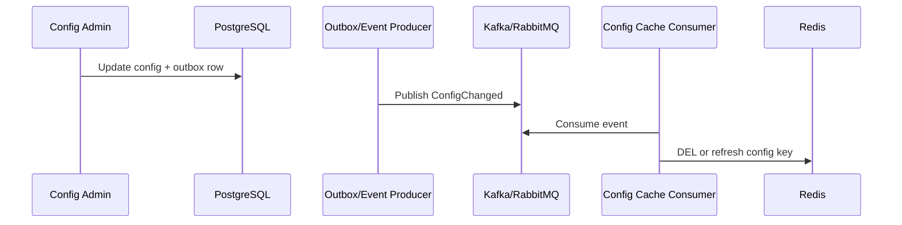
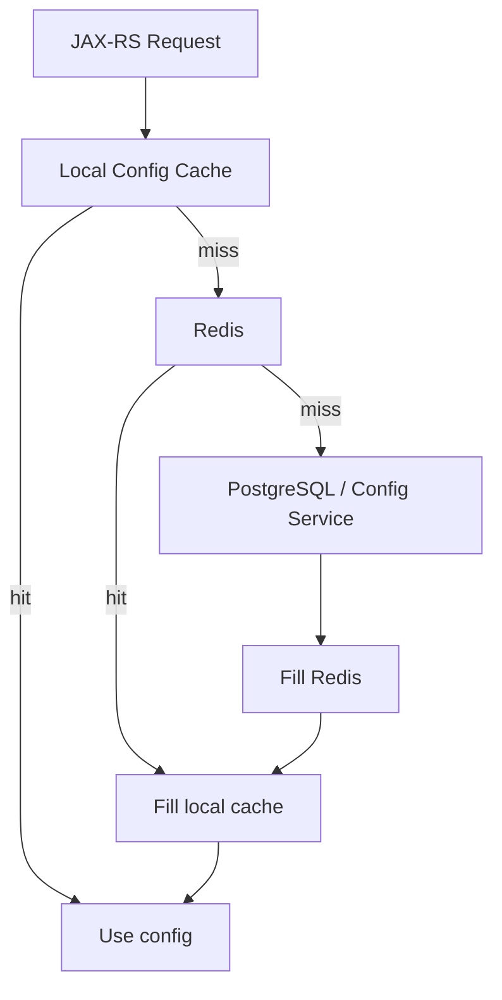

# Part 045 — Redis for Feature Flags and Configuration Cache

Redis is often used as a fast shared layer for runtime configuration.

Typical examples:

- Feature flag cache.
- Tenant configuration cache.
- Product/catalog rule cache.
- Pricing or eligibility parameter cache.
- Kill switch state.
- Maintenance-mode flag.
- Remote configuration cache.
- Cloud parameter cache.
- Secret metadata cache, but not usually secret value cache.
- Per-service dynamic behavior cache.

This is attractive because Redis gives centralized low-latency reads with TTL and cross-service sharing.

But configuration is not ordinary cache.

A stale catalog cache may produce old reads.  
A stale feature flag may enable behavior for the wrong tenant.  
A stale kill switch may fail to stop a damaging flow.  
A stale security configuration may weaken protection.  
A missing safe default may turn a Redis outage into a broad production incident.

The core rule:

> Runtime configuration cached in Redis must have an explicit correctness boundary, owner, source of truth, TTL policy, invalidation path, safe default, and audit trail.

---

## 1. Configuration Cache Mental Model

Redis should normally not be the original source of truth for enterprise configuration.

It is usually a fast projection or cache over another source:

- PostgreSQL table.
- Configuration service.
- Feature flag platform.
- Cloud configuration service.
- Parameter store.
- Secret manager metadata.
- GitOps-controlled configuration artifact.
- Admin UI backed by a durable database.

Redis gives speed and availability characteristics, but it also introduces staleness.

A runtime config read usually follows this chain:



The important point is not the Redis command.  
The important point is the decision boundary:

- What source owns the truth?
- What value is safe if Redis is unavailable?
- How stale may the cached config be?
- Who is allowed to change it?
- How is the change audited?
- How does a service know the config was refreshed?

---

## 2. What Redis Is Good For in Runtime Configuration

Redis is useful when config is:

- Read frequently.
- Changed less frequently than it is read.
- Shared across many pods or services.
- Small enough to fit comfortably in memory.
- Safe to cache for a bounded time.
- Expensive to load from source repeatedly.
- Needed in low-latency request paths.
- Useful for emergency runtime switches.

Examples:

| Use Case | Redis Fit | Reason |
|---|---:|---|
| Tenant feature flag lookup | Good | High read frequency, small payload, TTL/invalidation possible |
| Kill switch | Good but correctness-sensitive | Low-latency global switch, but stale reads are risky |
| Catalog rule snapshot | Conditional | Useful if versioned and invalidated correctly |
| Per-request secret lookup | Poor | Secrets need stricter controls and dedicated secret stores |
| Large policy document cache | Conditional | Needs size limits, versioning, and serialization discipline |
| Dynamic rate limit configuration | Good | Frequently read, usually small, needs safe fallback |
| Source of truth for business config | Usually poor | Redis persistence/HA semantics may not satisfy audit/durability needs |

---

## 3. Feature Flag Cache

A feature flag answers a question:

> Should this code path be active for this actor, tenant, environment, or request?

Common dimensions:

- Environment.
- Service.
- Tenant.
- Account.
- User.
- Product.
- Region.
- API endpoint.
- Rollout percentage.
- Entitlement.
- Operational emergency state.

A simple Redis key may look like:

```text
cfg:{env}:{service}:feature:{featureName}
cfg:{env}:{service}:tenant:{tenantId}:features
cfg:{env}:global:kill-switch:{switchName}
```

For Redis Cluster, use hash tags deliberately when multi-key operations are required:

```text
cfg:{tenant:123}:features
cfg:{tenant:123}:limits
cfg:{tenant:123}:rules:v42
```

Do not casually put PII in key names.

Bad:

```text
cfg:prod:customer:alice@example.com:features
```

Better:

```text
cfg:prod:customer:{customerId}:features
```

Even better if customer IDs are internal opaque IDs and access to keyspace inspection is controlled.

---

## 4. Feature Flag Evaluation Location

Feature flags can be evaluated in different places:

| Location | Advantage | Risk |
|---|---|---|
| Java service directly reads Redis | Simple and fast | Logic duplicated across services |
| Shared config library reads Redis | Consistent evaluation | Library rollout coordination needed |
| Dedicated config service reads Redis | Centralized policy | Adds network hop and dependency |
| Local in-memory cache backed by Redis | Very low latency | More staleness layers |
| Source platform SDK only | Strong platform semantics | May not fit internal latency/deployment constraints |

For Java/JAX-RS services, avoid scattering feature flag logic across resource classes.

Prefer a narrow boundary:

```java
public interface RuntimeConfigResolver {
    boolean isEnabled(FeatureFlag flag, ConfigContext context);
    RateLimitPolicy rateLimitPolicy(TenantId tenantId, EndpointId endpointId);
    Optional<KillSwitchState> killSwitch(String name);
}
```

The JAX-RS resource should not know whether the value came from:

- Redis.
- Local cache.
- PostgreSQL.
- Feature flag platform.
- Environment variable.
- Safe default.

The resource should receive a decision, not implement the config retrieval policy.

---

## 5. Configuration Source of Truth

Every Redis-backed config must answer this:

> Where does the truth live?

Common source-of-truth options:

| Source | Good For | Redis Role |
|---|---|---|
| PostgreSQL | Durable tenant/business config | Cache/projection |
| GitOps repo | Infra/service config | Runtime projection, if needed |
| Feature flag platform | Rollout and experimentation | Fast local/distributed cache |
| Cloud parameter store | Environment parameters | Cache with careful TTL |
| Secret manager | Secrets | Usually avoid caching sensitive values directly |
| Admin UI + DB | Business-managed config | Cache with audit/version |

If Redis is the only place where a config exists, then Redis is not just a cache.

That changes the architecture:

- Persistence matters.
- Backup matters.
- Audit matters.
- Recovery matters.
- Authorization matters.
- Change history matters.
- Disaster recovery matters.

For enterprise systems, using Redis as the only source of truth for important configuration should require an explicit architecture decision.

---

## 6. Config TTL Discipline

TTL for config cache is not just a cleanup parameter.

It defines how long the system may continue using stale behavior.

Example TTL classes:

| Config Type | Typical Staleness Tolerance | TTL Strategy |
|---|---:|---|
| Product display label | Medium | Minutes to hours may be acceptable |
| Tenant entitlement | Low | Short TTL or event invalidation |
| Rate limit policy | Low to medium | Short TTL plus safe fallback |
| Kill switch | Very low | Short TTL, push invalidation, local emergency override |
| Security policy | Very low | Prefer direct source or very short TTL |
| Experiment flag | Medium | Depends on experiment platform semantics |
| Maintenance banner | Medium | Short TTL acceptable |

A dangerous anti-pattern:

```text
Config cache with no TTL because config is "mostly static".
```

That usually creates these risks:

- Old config persists after source change.
- Deleted tenant config remains active.
- Emergency disable does not apply.
- Rolling deployment sees mixed behavior.
- Manual Redis deletion becomes operational dependency.

Better:

- Use TTL on every cached config unless there is a documented reason not to.
- Use versioned keys for major config changes.
- Use event-driven invalidation for critical config.
- Use safe default if Redis/source is unavailable.
- Make stale window explicit in the design.

---

## 7. TTL Jitter for Configuration Cache

If many config keys share the same TTL, they may expire together.

This creates reload spikes:

```text
10,000 tenant config keys expire at 10:00:00
↓
All pods miss Redis
↓
All pods reload PostgreSQL/config service
↓
Source of truth is overloaded
```

Use TTL jitter:

```text
base_ttl = 300 seconds
jitter = random(0..60 seconds)
effective_ttl = base_ttl + jitter
```

For config cache, jitter helps but does not solve correctness.

It reduces synchronized reload.  
It does not guarantee freshness.  
It does not replace invalidation.

---

## 8. Config Invalidation Strategies

There are four common invalidation strategies.

### 8.1 TTL-Only Invalidation

The system accepts stale config until TTL expires.

Good for:

- Low-risk display config.
- Non-critical personalization.
- Soft defaults.

Risky for:

- Kill switches.
- Entitlements.
- Security policy.
- Payment/ordering behavior.
- Regulatory or customer-impacting decisions.

### 8.2 Write-Path Invalidation

After source config changes, the write path deletes or updates Redis.



The failure window is obvious:

- DB commit succeeds.
- Redis invalidation fails.
- Services continue reading stale config until TTL.

Mitigations:

- Short TTL.
- Retry invalidation.
- Outbox event.
- Versioned config read.
- Admin warning if invalidation failed.

### 8.3 Event-Driven Invalidation

A config change emits an event to Kafka/RabbitMQ.

Consumers invalidate or refresh Redis.



This is better for distributed systems, but introduces:

- Duplicate events.
- Out-of-order events.
- Consumer lag.
- Consumer failure.
- Redis failure during event handling.
- Rebuild requirement.

### 8.4 Versioned Key Strategy

Instead of mutating one key, embed a version:

```text
cfg:prod:tenant:{tenantId}:rules:v42
cfg:prod:tenant:{tenantId}:rules:v43
```

A pointer or source-of-truth version tells the service which version to read.

Advantages:

- Reduces stale overwrite risk.
- Allows rollback.
- Supports gradual rollout.
- Helps debug which version a request used.

Risks:

- Old versions must be cleaned up.
- Pointer consistency matters.
- More keys and memory.
- Requires version discipline across services.

---

## 9. Kill Switches

A kill switch is a runtime control that disables or alters behavior quickly.

Examples:

- Disable quote submission.
- Disable order submission for a tenant.
- Disable external integration calls.
- Disable async job processing.
- Disable risky cache refresh.
- Force read-only mode.
- Disable a new pricing rule path.

Kill switches are operational safety mechanisms.

They need stricter design than ordinary feature flags.

A Redis-backed kill switch should define:

- Source of truth.
- Default value if Redis is unavailable.
- Default value if config source is unavailable.
- Max stale duration.
- Audit trail for changes.
- Who can change it.
- How quickly it propagates.
- How services observe that it was applied.
- How to test it before an incident.

The most dangerous question:

> If Redis is unavailable, does the service fail open or fail closed?

There is no universal answer.

| Use Case | Possible Safe Default |
|---|---|
| Disable risky order submission | Fail closed may be safer |
| Optional UI enhancement | Fail open may be acceptable |
| External integration circuit breaker | Fail closed or degraded mode may be safer |
| Security enforcement flag | Usually fail closed |
| Marketing experiment | Fail to control/default behavior |

The safe default must be business-specific and reviewed.

---

## 10. Safe Defaults

Every config lookup should have a safe default.

Bad:

```java
boolean enabled = redis.get(key).equals("true");
```

This fails badly when:

- Redis returns null.
- Redis times out.
- Redis value is malformed.
- JSON deserialization fails.
- Config key was deleted.

Better:

```java
FeatureDecision decision = configResolver.resolve(flag, context);

if (decision.isEnabled()) {
    runNewFlow();
} else {
    runStableFlow();
}
```

The resolver should encode:

- Default value.
- Source used.
- Config version.
- Whether the value is stale.
- Whether Redis failed.
- Whether fallback was used.

A useful internal representation:

```java
public record ConfigDecision<T>(
    T value,
    String source,
    String version,
    boolean fallbackUsed,
    boolean staleAllowed,
    Instant resolvedAt
) {}
```

This makes observability and debugging much easier.

---

## 11. Stale Config

Stale config means the service uses an older value than the source of truth.

Staleness is not always a bug.

It is a bug when the design did not define whether staleness is allowed.

For each config, define:

```text
max_staleness = ?
propagation_slo = ?
stale_behavior = allow | warn | block | fallback
```

Examples:

| Config | Max Staleness | Behavior |
|---|---:|---|
| Maintenance banner text | 5 minutes | Allow stale |
| Tenant feature entitlement | 30 seconds | Warn and refresh |
| Emergency kill switch | 5 seconds or less | Prefer push + short local TTL |
| Pricing algorithm selection | Very low | Require versioned decision |
| Session security policy | Very low | Avoid stale or fail closed |

---

## 12. Multi-Level Configuration Cache

A common pattern:

```text
Java local in-memory cache
↓
Redis distributed cache
↓
Source of truth
```

This reduces latency but adds staleness layers.



Risks:

- Local cache keeps stale value after Redis invalidation.
- Redis has fresh value but pod local cache does not.
- Rolling deployment has mixed local state.
- One pod behaves differently from another.
- Debugging requires knowing which layer answered.

Mitigations:

- Very short local TTL for critical config.
- Include config version in logs.
- Invalidate local cache on pub/sub/event if safe.
- Expose diagnostic endpoint for effective config.
- Avoid local cache for emergency kill switch unless TTL is very short.

---

## 13. Tenant Configuration Cache

Tenant config is common in CPQ, quote management, order management, and BSS-style systems.

Examples:

- Tenant-specific product eligibility rules.
- Pricing behavior switches.
- Tax/fee calculation parameters.
- Quote approval thresholds.
- Order submission restrictions.
- Integration endpoint selection.
- SLA or rate-limit policy.

Redis key design must include tenant isolation:

```text
cfg:{env}:{service}:tenant:{tenantId}:quote-rules:v{version}
cfg:{env}:{service}:tenant:{tenantId}:rate-limit-policy
cfg:{env}:{service}:tenant:{tenantId}:integration-flags
```

Be careful with tenant-wide invalidation.

A command like this is not production-safe:

```text
KEYS cfg:prod:quote-service:tenant:123:*
```

Better approaches:

- Maintain a tenant key index set with bounded size.
- Use versioned root keys.
- Store grouped tenant config in a hash if size is bounded.
- Use source-of-truth version lookup.
- Use SCAN only in controlled admin/offline tools.

---

## 14. Configuration Payload Design

A config value should not be an undocumented blob.

Good config payload includes:

```json
{
  "version": "42",
  "schemaVersion": 3,
  "updatedAt": "2026-07-11T10:00:00Z",
  "updatedBy": "config-admin-service",
  "effectiveFrom": "2026-07-11T10:05:00Z",
  "payload": {
    "enabled": true,
    "mode": "STRICT",
    "threshold": "1000.00"
  }
}
```

Important fields:

- Config version.
- Schema version.
- Updated timestamp.
- Effective timestamp.
- Owner/source.
- Payload.
- Optional checksum.

Avoid storing only:

```json
{"enabled":true}
```

That may work for a toy feature flag but is often insufficient for enterprise debugging.

---

## 15. Versioning and Rolling Deployment

Config schema evolves.

Java code evolves.

Pods are rolled gradually.

During deployment, old code and new code may read the same Redis key.

Compatibility risks:

- New field required by new code not present in old cached value.
- Old code cannot parse new enum value.
- JSON field renamed.
- Numeric type changes.
- Time format changes.
- Config object class renamed.
- Default value changes silently.

Rules:

- Version config schema explicitly.
- Keep readers backward-compatible.
- Avoid Java native serialization.
- Treat enum expansion as compatibility-sensitive.
- Store unknown fields safely if possible.
- Test old reader/new payload and new reader/old payload.
- Use versioned keys for breaking changes.

---

## 16. Runtime Reload

Runtime reload means a service changes behavior without restart.

Redis helps, but runtime reload must be disciplined.

Questions:

- Does each request read config fresh?
- Is config cached locally per pod?
- Is config snapshot captured at request start?
- Can config change midway through a request?
- Should long-running jobs pin a config version?
- Should async workers use config version from the event/job payload?

For request correctness, prefer this pattern:

```text
Resolve config once at request boundary.
Use the same config decision throughout the request.
Log config version with correlation ID.
```

For long-running jobs:

```text
Either pin config version at job creation,
or explicitly allow latest-config behavior.
```

Do not let config change halfway through a quote/order workflow unless the workflow explicitly supports that.

---

## 17. Config and Distributed Consistency

In distributed systems, config changes are events.

A feature flag change can affect:

- API behavior.
- Database writes.
- Kafka event shape.
- RabbitMQ routing.
- External integration calls.
- Cache invalidation behavior.
- Job processing behavior.

Example failure:

```text
Flag enables new event field.
Service A deploys new code and flag is ON.
Service B still runs old consumer.
Service B cannot parse the event.
```

Redis does not solve this.

You need rollout sequencing:

1. Deploy backward-compatible consumers.
2. Deploy producers that can emit old/new safely.
3. Enable feature flag for limited scope.
4. Monitor errors/lag.
5. Expand rollout.
6. Remove old path later.

Feature flags do not replace compatibility engineering.

---

## 18. Configuration Cache and PostgreSQL/MyBatis

When source config is in PostgreSQL, Redis is often cache-aside.

Read path:

```text
Redis GET config
if miss:
  SELECT config FROM PostgreSQL
  SET Redis with TTL/version
```

Write path:

```text
BEGIN
UPDATE config table
INSERT outbox ConfigChanged event
COMMIT
consumer invalidates/refreshes Redis
```

Important correctness concerns:

- Do not update Redis before DB commit as if the DB update is guaranteed.
- Do not assume Redis invalidation failure rolls back DB commit.
- Use outbox if event-driven invalidation matters.
- Include config version in DB and Redis.
- Consider optimistic locking/version column on config rows.
- Ensure MyBatis mapping preserves precision and enum compatibility.

---

## 19. Configuration Cache and Kafka/RabbitMQ

Configuration changes often need to propagate.

Broker events can help:

```text
ConfigChanged {
  configType,
  tenantId,
  version,
  changedAt,
  changedBy,
  reason
}
```

Consumer behavior:

- Validate event version.
- Ignore older version if newer already cached.
- Delete or refresh Redis key.
- Emit metric on invalidation success/failure.
- Retry safely.
- Handle duplicate events.
- Handle out-of-order events.

Never assume event arrival order unless your broker/topic/partition/routing design guarantees it for the relevant key.

---

## 20. Cloud Configuration Cache Awareness

Redis may sit in front of cloud configuration systems:

- AWS AppConfig.
- AWS Systems Manager Parameter Store.
- AWS Secrets Manager metadata.
- Azure App Configuration.
- Azure Key Vault metadata.
- Kubernetes ConfigMap projected state.

General rule:

> Cache configuration values only if the provider's consistency, rotation, and audit model are still respected.

Be extra careful with secrets.

For secrets:

- Prefer direct secret manager integration or platform secret injection.
- Avoid storing raw secrets in Redis unless explicitly approved.
- If cached, enforce short TTL, encryption expectations, access control, and redaction.
- Log only key identifiers, not secret values.

---

## 21. Observability for Configuration Cache

Useful metrics:

- Config cache hit ratio.
- Config cache miss ratio.
- Source load latency.
- Redis lookup latency.
- Config fallback count.
- Config deserialization failure count.
- Config stale read count, if detectable.
- Config version distribution across pods.
- Kill switch read errors.
- Config invalidation lag.
- Config refresh failure count.

Useful logs:

- Config key name pattern, without sensitive IDs if required.
- Config version.
- Source used: local, Redis, DB, config service, default.
- Fallback reason.
- Correlation ID.
- Tenant/account context, redacted or tokenized.

Useful diagnostics endpoint:

```text
GET /internal/config/effective?tenantId=...
```

But protect it heavily. It may expose sensitive operational behavior.

---

## 22. Failure Modes

| Failure Mode | Symptom | Likely Cause | Mitigation |
|---|---|---|---|
| Stale flag remains active | Feature still enabled after disable | No invalidation, long TTL, local cache | Short TTL, event invalidation, versioning |
| Kill switch ineffective | Emergency disable not applied | Local cache too long, Redis failure, wrong key | Very short TTL, safe default, dashboard |
| Config source overload | Spike in DB/config service load | Synchronized expiry | TTL jitter, refresh-ahead, single-flight |
| Mixed behavior across pods | Different pods make different decisions | Local cache/rolling deployment | Log config version, bounded local TTL |
| Deserialization error | Requests fail after config update | Schema-incompatible payload | Schema version, backward-compatible parser |
| Wrong tenant config | Tenant receives incorrect behavior | Key design bug, missing tenant dimension | Strong key naming, tests, tenant isolation |
| Redis outage breaks config | Service errors or unsafe behavior | No fallback/default | Safe default and circuit breaker |
| Config change not audited | Cannot explain behavior | Redis used as direct mutable store | Durable source of truth and audit trail |
| Out-of-order invalidation | Old value overwrites new value | Event ordering issue | Version checks before writes |

---

## 23. Production Debugging Flow

When behavior differs from expectation, ask:

1. What config decision was made?
2. Which key was read?
3. Which version was used?
4. Which source answered: local cache, Redis, source of truth, or default?
5. Was fallback used?
6. What was the TTL at read time?
7. Was invalidation triggered?
8. Was invalidation consumed?
9. Are all pods seeing the same version?
10. Did a rolling deployment introduce schema mismatch?
11. Is there tenant/environment prefix mismatch?
12. Did an event arrive out of order?
13. Did Redis timeout or return stale data from replica/local cache?
14. Is the source-of-truth value actually updated?

Production-safe Redis checks may include:

```text
TTL <config-key>
GET <config-key>
HGETALL <small-config-hash-only-if-safe>
OBJECT ENCODING <key>
MEMORY USAGE <key>
```

Avoid broad key scans in production unless using an approved tool and bounded pattern.

---

## 24. Java/JAX-RS Implementation Boundary

A clean implementation isolates Redis configuration access behind a resolver.

```java
public final class RedisBackedRuntimeConfigResolver implements RuntimeConfigResolver {
    private final RedisClient redis;
    private final ConfigSource source;
    private final ConfigDefaults defaults;
    private final ConfigMetrics metrics;

    @Override
    public FeatureDecision isEnabled(FeatureFlag flag, ConfigContext context) {
        // Resolve from local cache / Redis / source / default.
        // Preserve version and fallback metadata.
        // Do not leak Redis exception into resource layer unless policy says so.
        return resolveFeatureDecision(flag, context);
    }
}
```

JAX-RS resource:

```java
@Path("/quotes")
public class QuoteResource {
    private final QuoteService quoteService;
    private final RuntimeConfigResolver configResolver;

    @POST
    public Response createQuote(CreateQuoteRequest request) {
        ConfigContext context = ConfigContext.fromRequest(request);
        FeatureDecision decision = configResolver.isEnabled(FeatureFlag.NEW_QUOTE_RULES, context);

        QuoteResult result = quoteService.createQuote(request, decision);
        return Response.ok(result).build();
    }
}
```

Avoid:

- Raw Redis calls in resource methods.
- Feature flag parsing in controller/resource layer.
- Silent fallback without metrics.
- Hidden static config caches.
- Request behavior that changes midway through processing.

---

## 25. PR Review Checklist

Ask these questions in PR review:

### Source of Truth

- Where does the config truth live?
- Is Redis only a cache/projection?
- If Redis is source of truth, is that explicitly approved?
- Is there an audit trail for changes?

### Key Design

- Does the key include environment/service/tenant/entity/version where needed?
- Is PII avoided in key names?
- Is Redis Cluster hash-slot behavior considered?
- Is key ownership documented?

### TTL and Staleness

- Does every cached config have TTL?
- Is max staleness defined?
- Is TTL jitter used for large config populations?
- Is local cache TTL shorter than or compatible with Redis TTL?

### Invalidation

- How does config change propagate?
- Is invalidation retryable?
- Are duplicate and out-of-order events handled?
- Is invalidation lag observable?

### Safe Defaults

- What happens when Redis is unavailable?
- What happens when source of truth is unavailable?
- What happens when config is malformed?
- Is fail-open/fail-closed intentional?

### Compatibility

- Is payload schema versioned?
- Is rolling deployment safe?
- Are enum additions safe?
- Are old reader/new payload and new reader/old payload tested?

### Observability

- Are config version and fallback reason logged?
- Are cache hit/miss and source latency measured?
- Is kill switch state observable?
- Can we debug effective config per tenant safely?

### Security and Compliance

- Does config contain sensitive data?
- Is access restricted?
- Are config dumps/logs redacted?
- Are changes auditable?

---

## 26. Internal Verification Checklist

Use this checklist against the actual codebase and platform setup.

### Codebase

- Identify all Redis-backed configuration readers.
- Identify all feature flag resolvers.
- Identify all kill switch checks.
- Check whether Redis calls are centralized or scattered.
- Check whether JAX-RS resource methods directly access Redis.
- Check fallback behavior for Redis timeout/unavailable.
- Check schema version handling.
- Check local in-memory cache layering.

### Keyspace

- Document config key patterns.
- Verify environment/service/tenant prefixes.
- Verify no PII in key names.
- Verify TTL on config keys.
- Verify versioned key strategy where needed.
- Verify cleanup of old config versions.

### Source of Truth

- Identify durable owner for each config type.
- Check audit trail for config changes.
- Check admin UI/API authorization.
- Check DB version columns or equivalent.
- Check GitOps/config platform ownership if used.

### Invalidation

- Check whether invalidation is TTL-only, write-path, event-driven, or versioned.
- Check Kafka/RabbitMQ invalidation event design.
- Check duplicate/out-of-order event handling.
- Check consumer retry and DLQ behavior.
- Check invalidation lag metrics.

### Operations

- Check dashboards for config cache hit/miss.
- Check fallback metrics.
- Check kill switch observability.
- Check incident runbook for stale config.
- Check production-safe debug commands.

### Security

- Check whether sensitive config is stored in Redis.
- Check access control for config keys.
- Check TLS/ACL/network isolation.
- Check log redaction.
- Check snapshot/backup privacy.

### CSG/Team Verification

- Verify actual Redis client library used by the team.
- Verify whether configuration cache exists in Quote & Order services.
- Verify whether tenant config is cached in Redis.
- Verify whether feature flags come from Redis, platform SDK, DB, or another system.
- Verify whether kill switches are backed by Redis or another control plane.
- Verify whether Kafka/RabbitMQ invalidation events are used.
- Verify with platform/SRE/security team before assuming Redis is approved for sensitive config or security state.

---

## 27. Senior Engineer Heuristics

Use Redis for configuration cache when:

- Reads are frequent.
- Payload is small.
- Staleness is bounded.
- Source of truth is durable.
- Invalidation is explicit.
- Safe defaults exist.
- Observability exists.

Do not use Redis casually when:

- Config is security-critical and stale reads are unacceptable.
- There is no audit trail.
- Values are secrets.
- Redis would become the only source of truth by accident.
- There is no owner for invalidation.
- The service cannot define fail-open/fail-closed behavior.
- Rolling deployment compatibility is untested.

The senior-level question is not:

> Can Redis store this flag?

The better question is:

> If this config is wrong, stale, missing, malformed, or unreachable, what is the customer, security, data, and operational impact?

---

## 28. Summary

Redis is a strong fit for feature flags and configuration cache when the system is explicit about source of truth, TTL, invalidation, versioning, fallback, and observability.

It becomes dangerous when teams treat Redis as invisible global mutable state.

For enterprise Java/JAX-RS systems, isolate Redis-backed config behind a resolver, preserve decision metadata, log versions, define safe defaults, and make stale behavior intentional.

A Redis configuration cache should be designed as a runtime decision system, not as a convenient distributed map.
