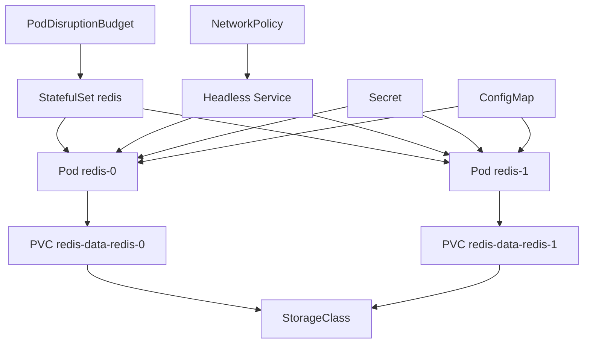
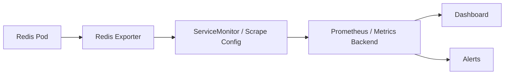

# Part 046 — Redis in Kubernetes

Running Redis in Kubernetes is not the same as running a stateless Java service in Kubernetes.

Redis is stateful.

It has memory pressure, persistence choices, replication topology, failover behavior, storage dependency, network sensitivity, and operational recovery requirements.

Kubernetes can run Redis, but Kubernetes does not automatically make Redis safe.

The core rule:

> Redis in Kubernetes must be treated as a stateful production datastore component, not as a simple sidecar-like cache container.

This part focuses on Redis deployment mechanics in Kubernetes and the architecture decision between self-managed Redis, operator-managed Redis, and cloud-managed Redis.

---

## 1. Mental Model: Redis as a Stateful Kubernetes Workload

A stateless Java/JAX-RS service pod can usually be killed and recreated freely.

A Redis pod may hold:

- In-memory keyspace.
- Persistent RDB/AOF files.
- Replication role.
- Cluster slot ownership.
- Client connections.
- Pending stream entries.
- Lock/idempotency/rate limiter state.
- Hot cache data.

A Redis restart may be harmless for a disposable cache.

A Redis restart may be serious if Redis is used for:

- Sessions.
- Token blacklist.
- Idempotency records.
- Distributed locks.
- Streams/job queues.
- Rate limiter state.
- Feature flags/kill switches.

The Kubernetes design depends on the Redis use case.

---

## 2. Deployment Options

Common Redis deployment models:

| Model | Description | Operational Owner | Typical Fit |
|---|---|---|---|
| Standalone Redis Pod | One Redis instance, usually no HA | App/platform team | Dev/test, low-criticality cache |
| StatefulSet Primary/Replica | Redis pods with stable identity and storage | Platform/SRE | Self-managed HA-ish setups |
| Sentinel-based Redis | Primary/replica with Sentinel failover | Platform/SRE | On-prem/self-managed HA |
| Redis Cluster | Sharded Redis with hash slots | Platform/SRE | Large scale / horizontal partitioning |
| Redis Operator | Kubernetes operator manages topology | Platform/SRE | Standardized self-managed lifecycle |
| Helm Chart | Packaged manifests/templates | Platform/SRE/App team | Repeatable deployment, but still needs review |
| Cloud-managed Redis | AWS/Azure/GCP/managed provider | Cloud/platform team | Production default in many enterprises |

For production enterprise systems, managed Redis is often preferable when available.

Self-managed Redis in Kubernetes should be chosen deliberately, not accidentally.

---

## 3. Basic Kubernetes Objects

A Redis deployment may involve:

- `StatefulSet`
- `PersistentVolumeClaim`
- `PersistentVolume`
- `StorageClass`
- `Service`
- `Headless Service`
- `ConfigMap`
- `Secret`
- `PodDisruptionBudget`
- `NetworkPolicy`
- `ServiceMonitor` or equivalent monitoring CRD
- `HorizontalPodAutoscaler` rarely for Redis itself, more common for clients
- `VerticalPodAutoscaler` with caution
- Operator custom resources if using an operator

A simplified object graph:



---

## 4. StatefulSet

Redis should usually run as a StatefulSet if self-managed in Kubernetes.

StatefulSet gives:

- Stable pod identity: `redis-0`, `redis-1`, etc.
- Stable network identity with headless service.
- Stable volume claim per pod.
- Ordered startup/shutdown behavior.
- Better fit for replication/cluster membership.

Deployment is usually not enough for Redis because a Deployment treats pods as interchangeable stateless replicas.

Redis replicas are not automatically interchangeable unless the Redis topology and client behavior support that.

Questions:

- Is this Redis standalone, primary/replica, Sentinel, or Cluster?
- Does each pod need stable storage?
- Does each pod have a stable role or dynamically elected role?
- How does the client discover the current primary?
- What happens if `redis-0` is rescheduled to another node?

---

## 5. PersistentVolume and Persistence

Redis persistence options matter before choosing storage.

If Redis is cache-only and all data can be lost:

- Persistent volume may be unnecessary.
- Restart reloads/warm cache from source.
- Recovery pressure shifts to PostgreSQL/services.

If Redis holds durability-sensitive data:

- Persistent volume matters.
- RDB/AOF policy matters.
- Backup/restore matters.
- Storage latency matters.
- Node failure behavior matters.

Kubernetes storage concerns:

- StorageClass performance.
- Volume binding mode.
- Zone locality.
- IOPS/throughput limits.
- Snapshot capability.
- Reattach time after node failure.
- Filesystem behavior.
- Backup integration.

Do not assume a PVC makes Redis durable enough.

Durability depends on:

```text
Redis persistence mode
+
fsync policy
+
storage reliability
+
replication
+
backup/restore
+
failover design
+
operator runbook
```

---

## 6. StorageClass Considerations

Important StorageClass questions:

- Is the storage zonal or regional?
- What is the expected latency?
- What are the IOPS limits?
- What happens on node failure?
- Can the volume move across nodes quickly?
- Does the storage support snapshots?
- Is encryption at rest enabled?
- Is reclaim policy safe?
- Is expansion allowed?

For Redis, slow storage affects:

- RDB snapshotting.
- AOF fsync latency.
- Restart recovery.
- AOF rewrite.
- Persistence-induced latency spikes.

If Redis is configured with AOF and frequent fsync, storage performance becomes part of request latency risk.

---

## 7. Headless Service

A headless service provides stable DNS entries for StatefulSet pods.

Example DNS shape:

```text
redis-0.redis-headless.namespace.svc.cluster.local
redis-1.redis-headless.namespace.svc.cluster.local
redis-2.redis-headless.namespace.svc.cluster.local
```

This matters for:

- Redis replication discovery.
- Sentinel discovery.
- Redis Cluster node addressing.
- Operator-managed topology.

A normal ClusterIP service may be useful for clients, but Redis topology often needs pod-level identity.

Be careful:

- Clients should not blindly write to a service that load-balances across primary and replicas.
- A service pointing to all Redis pods can cause writes to replicas.
- Separate read/write services may be needed.
- Sentinel/Cluster-aware clients may not use a simple service endpoint the same way.

---

## 8. Services for Primary and Replica

A Redis deployment may expose:

- Primary service.
- Replica service.
- Headless service.
- Sentinel service.
- Cluster node service.

Potential service patterns:

| Service | Purpose | Risk |
|---|---|---|
| `redis-master` | Write endpoint | Must track failover correctly |
| `redis-replicas` | Read endpoint | Stale reads possible |
| `redis-headless` | Stable pod DNS | Not always suitable for app clients |
| `redis-sentinel` | Sentinel discovery | Client must support Sentinel |
| `redis-cluster` | Cluster access | Client must support MOVED/ASK |

For Java clients:

- Standalone config expects one endpoint.
- Sentinel config expects sentinel endpoints and master name.
- Cluster config expects cluster nodes and redirection handling.

Do not hide a Redis Cluster behind a simple Kubernetes service unless the client and network model still support cluster redirection correctly.

---

## 9. ConfigMap

Redis configuration is often mounted from a ConfigMap.

Common settings:

```text
maxmemory
maxmemory-policy
appendonly
appendfsync
save
requirepass / ACL references
protected-mode
tcp-keepalive
timeout
client-output-buffer-limit
notify-keyspace-events
slowlog-log-slower-than
latency-monitor-threshold
```

ConfigMap risks:

- Config changes may not apply until pod restart.
- Dangerous settings can be changed without enough review.
- Drift can occur between environments.
- Redis config may diverge from Helm values.
- Manual changes inside pod are not durable.

Treat Redis config as production infrastructure code.

---

## 10. Secrets

Redis credentials and TLS material should use Kubernetes Secrets or an external secret mechanism.

Secrets may contain:

- Redis password/AUTH token.
- ACL user credentials.
- TLS certificate.
- TLS private key.
- CA certificate.

Important concerns:

- Secret rotation.
- Mount vs environment variable.
- Pod restart requirement after rotation.
- External Secrets operator or CSI driver if used.
- RBAC access to secrets.
- Namespace isolation.
- Avoid logging secret values.

For Java clients, verify:

- Password source.
- TLS config source.
- Truststore/keystore handling.
- Rotation behavior.
- Whether pods need restart to pick up rotated credentials.

---

## 11. Liveness Probe

A liveness probe decides whether Kubernetes should restart the Redis container.

This is dangerous if too aggressive.

A bad liveness probe can turn transient slowness into restart loops.

Example problem:

```text
Redis is slow because of memory pressure.
Liveness probe times out.
Kubernetes restarts Redis.
Restart causes cache loss / failover / client reconnect storm.
System gets worse.
```

Liveness should answer:

> Is this process irrecoverably unhealthy?

Not:

> Is Redis currently a little slow?

Probe design should be reviewed with SRE/platform.

---

## 12. Readiness Probe

A readiness probe decides whether the pod should receive traffic.

For Redis, readiness may need to consider:

- Process responds to PING.
- Role is correct for the service.
- Replication state is acceptable.
- Cluster state is OK.
- Loading from disk is complete.
- Sentinel/Cluster membership is healthy.

A simple `PING` may be insufficient.

For example:

- A replica may respond to PING but reject writes.
- A Redis node may respond but still be loading data.
- A cluster node may respond but cluster state may be failed.

Readiness should match the service endpoint's purpose.

---

## 13. Resource Requests and Limits

Redis is memory-sensitive.

Kubernetes resource configuration can break Redis if careless.

Important settings:

- Memory request.
- Memory limit.
- CPU request.
- CPU limit.
- Redis `maxmemory`.
- Eviction policy.
- Persistence overhead.
- Fragmentation overhead.
- Replication backlog.
- Client buffers.

Key rule:

> Redis `maxmemory` must be lower than the Kubernetes memory limit by a safe margin.

Why?

Redis process memory is more than logical key memory.

Additional memory includes:

- Fragmentation.
- Allocator overhead.
- Replication backlog.
- Client output buffers.
- Lua/script memory.
- AOF/RDB rewrite copy-on-write overhead.
- Module overhead if used.

If Kubernetes memory limit is too tight, Redis may be OOMKilled before eviction protects it.

Example sizing concept:

```text
Kubernetes memory limit: 8 GiB
Redis maxmemory: 5.5-6.5 GiB depending on workload and persistence
Reserved headroom: fragmentation + fork/COW + buffers + safety
```

Do not copy this number blindly. Size from workload and metrics.

---

## 14. CPU Limits and Latency

Redis command execution is latency-sensitive.

CPU throttling can create visible latency spikes.

Risks:

- Aggressive CPU limit throttles Redis.
- Noisy neighbor pressure affects Redis pod.
- Persistence rewrite consumes CPU.
- TLS adds CPU overhead.
- Heavy Lua scripts block command execution.
- Big key operations amplify CPU usage.

For production Redis, CPU request/limit should be reviewed carefully.

In many cases, a CPU limit that is too low is worse than no CPU limit with strong node isolation, but this depends on platform policy.

Verify with SRE/platform standards.

---

## 15. Pod Anti-Affinity

Redis primary and replicas should not all run on the same node.

Anti-affinity helps spread pods across nodes or zones.

Without anti-affinity:

```text
node-a hosts redis-0, redis-1, redis-2
node-a fails
all Redis replicas disappear
```

Use anti-affinity/topology spread constraints to improve resilience.

Questions:

- Are replicas spread across nodes?
- Are replicas spread across zones?
- Does storage support the same topology?
- Can the cluster tolerate one node/zone failure?
- Are Sentinel pods also spread?

---

## 16. PodDisruptionBudget

A PodDisruptionBudget protects Redis during voluntary disruptions.

Examples:

- Node drain.
- Cluster upgrade.
- Maintenance.
- Autoscaler consolidation.

For Redis, a PDB can prevent too many pods from being disrupted at once.

But a PDB is not magic.

It does not protect against:

- Node crash.
- Kernel panic.
- OOMKill.
- Zone outage.
- Forced eviction.
- Misconfigured probes.

Still, production Redis should usually have a disruption policy reviewed by platform/SRE.

---

## 17. NetworkPolicy

Redis should not be reachable by every pod in the cluster.

NetworkPolicy can restrict access:

- Only allowed namespaces.
- Only allowed service accounts.
- Only app pods that need Redis.
- Monitoring namespace if needed.
- Operator namespace if needed.

Redis exposure risk is high because dangerous commands can destroy data.

Even with AUTH/ACL, network isolation matters.

Checklist:

- Is Redis exposed outside cluster?
- Is Redis accessible cross-namespace?
- Are only intended services allowed?
- Is monitoring access scoped?
- Are admin/debug pods controlled?

---

## 18. TLS in Kubernetes

Redis traffic may require TLS depending on security policy.

TLS concerns:

- Server certificate management.
- Client truststore.
- Certificate rotation.
- mTLS if used.
- CPU overhead.
- Helm/operator support.
- Java client TLS configuration.
- Sidecar/service-mesh interaction.

If a service mesh is used, verify whether Redis traffic is:

- Plain inside mesh.
- TLS terminated by sidecar.
- Native Redis TLS.
- Double encrypted.
- Excluded from mesh due to protocol issues.

Do not assume HTTP-oriented service mesh behavior applies cleanly to Redis TCP traffic.

---

## 19. Redis Operator Awareness

A Redis operator can manage complex lifecycle tasks:

- Primary/replica topology.
- Sentinel topology.
- Redis Cluster topology.
- Failover automation.
- Scaling.
- Backup integration.
- Configuration reconciliation.
- TLS/ACL wiring.
- Pod disruption behavior.

But an operator also introduces dependency on:

- Operator maturity.
- CRD semantics.
- Upgrade path.
- Failure behavior.
- Documentation.
- Platform support.
- Debuggability.

Questions before trusting an operator:

- What Redis topology does it support?
- How does failover work?
- How does it handle node failure?
- How does it handle PVC failure?
- How does it handle config updates?
- How does it expose metrics?
- How does backup/restore work?
- Who operates the operator?
- What happens if the operator itself is down?

An operator reduces manual work, but it does not remove architectural responsibility.

---

## 20. Helm Chart Awareness

Redis is often installed by Helm.

Helm values may control:

- Architecture mode.
- Replica count.
- Authentication.
- TLS.
- Persistence.
- StorageClass.
- Resource requests/limits.
- Probes.
- Metrics exporter.
- NetworkPolicy.
- PodDisruptionBudget.
- Affinity.
- Sentinel/Cluster mode.
- Config overrides.

Risks:

- Default values are not production values.
- Chart upgrades may change behavior.
- Generated manifests may hide complexity.
- Values drift between environments.
- Manual hotfixes may be overwritten.

For production, review rendered manifests, not only `values.yaml`.

Useful command concept:

```text
helm template ... > rendered.yaml
```

Then review the actual Kubernetes objects that will be applied.

---

## 21. Redis Metrics Exporter

Kubernetes Redis deployments commonly use a metrics exporter.

Metrics should cover:

- Memory usage.
- Evictions.
- Expirations.
- Connected clients.
- Blocked clients.
- Command rate.
- Command latency if available.
- Hit/miss ratio.
- Replication lag.
- Role primary/replica.
- Persistence status.
- AOF/RDB errors.
- Cluster state.
- Stream pending entries if collected separately.

Metrics pipeline may involve:



Make sure application-side Redis metrics are also collected.

Server metrics alone cannot tell you which Java service caused load.

---

## 22. Backup and Restore in Kubernetes

If Redis data matters, backup/restore must be tested.

Questions:

- Is Redis cache-only or data-bearing?
- Are RDB/AOF files persisted?
- Are PVC snapshots taken?
- Are backups encrypted?
- Who can access backups?
- How often are backups taken?
- What is RPO?
- What is RTO?
- Has restore been tested?
- How do you restore a Redis Cluster safely?
- How do you avoid restoring stale security/session data incorrectly?

Backups can create privacy risk.

Redis may contain:

- PII.
- Session tokens.
- Idempotency responses.
- Customer data.
- Business config.

Backup access must be part of security review.

---

## 23. Upgrade Strategy

Redis upgrades in Kubernetes may involve:

- Redis image version.
- Helm chart version.
- Operator version.
- Config changes.
- ACL/TLS changes.
- Persistence format compatibility.
- Client compatibility.
- Java library compatibility.

Upgrade risks:

- Rolling restart causes connection storm.
- Failover happens unexpectedly.
- AOF/RDB compatibility issue.
- Cluster resharding/slot issue.
- Sentinel election instability.
- Client cannot handle topology changes.
- Config defaults change.

Upgrade checklist:

1. Read release notes.
2. Test in lower environment with production-like data shape.
3. Verify client compatibility.
4. Verify backup before upgrade.
5. Verify rollback path.
6. Monitor latency, errors, failover, memory, and client reconnects.
7. Coordinate with app teams if Redis is shared.

---

## 24. Running Redis in Kubernetes vs Managed Redis

This is an architecture decision, not just a deployment preference.

### Self-Managed Redis in Kubernetes

Advantages:

- Works in on-prem or restricted environments.
- More control over topology and config.
- Can align with internal Kubernetes platform.
- May reduce dependency on cloud-managed services.
- Useful for air-gapped deployments.

Costs:

- Team owns HA.
- Team owns backup/restore.
- Team owns upgrades.
- Team owns security hardening.
- Team owns failover testing.
- Team owns incident response.
- Team owns capacity planning.
- Team owns persistent storage behavior.

### Cloud-Managed Redis

Advantages:

- Managed failover options.
- Managed backups/snapshots.
- Cloud metrics integration.
- Easier patching/maintenance path.
- Stronger operational baseline.
- Reduced platform toil.

Costs:

- Cloud dependency.
- Networking/VPC/private endpoint complexity.
- Cost management.
- Provider-specific limits.
- Less low-level control.
- Cross-cloud/on-prem latency concerns.
- Need to understand managed service semantics.

### Decision Heuristic

Prefer managed Redis when:

- Cloud deployment is allowed.
- Redis is production-critical.
- Team does not want to own datastore operations.
- Managed service meets network/security/compliance requirements.

Self-manage Redis in Kubernetes when:

- On-prem/air-gapped deployment requires it.
- Managed service is unavailable.
- Platform team has strong Redis operational capability.
- Requirements need custom topology/config not available in managed service.
- Ownership and runbooks are explicit.

---

## 25. Java/JAX-RS Client Impact

Redis topology affects Java client configuration.

| Redis Deployment | Java Client Requirement |
|---|---|
| Standalone | Single endpoint, timeout, pool config |
| Primary/replica with static service | Careful read/write routing |
| Sentinel | Sentinel-aware client config and master name |
| Cluster | Cluster-aware client, MOVED/ASK handling |
| TLS Redis | Truststore/cert config |
| ACL Redis | Username/password support |
| Kubernetes service | DNS/reconnect behavior |
| Headless service | Multiple endpoint awareness |

In Kubernetes, Java services may create too many Redis connections.

Example:

```text
100 pods
x 50 max connections per pod
= 5,000 possible Redis connections
```

This can overload Redis or hit connection limits.

Coordinate application replica count and Redis client pool settings.

---

## 26. Failure Modes

| Failure Mode | Symptom | Likely Cause | Mitigation |
|---|---|---|---|
| Redis pod OOMKilled | Cache/session/idempotency disruption | `maxmemory` too close to pod limit | Reserve memory headroom |
| Restart loop | Redis repeatedly restarts | Aggressive liveness probe, bad config, storage issue | Fix probe/config/storage |
| Writes fail after failover | Java client still points to old primary | Client not Sentinel/Cluster-aware | Correct client topology config |
| Stale reads | App reads replica after write | Replica lag/read routing | Avoid replica reads for correctness-sensitive paths |
| PVC attach delay | Redis pod stuck pending | Zonal storage/node failure | Storage topology planning |
| Connection storm | Redis latency spike during rollout | Many Java pods reconnect at once | Pool limits, jittered startup, circuit breaker |
| Cross-zone latency | Higher Redis command latency | Pod/Redis placement mismatch | Topology spread and network design |
| All replicas lost | Node/zone failure affects all pods | No anti-affinity/topology spread | Anti-affinity/PDB/zone spread |
| Metrics blind spot | Incident hard to debug | No exporter/app metrics | Add server and client metrics |
| Secret rotation outage | Clients cannot reconnect | Rotation not coordinated | Dual credential/rollout plan if supported |
| Dangerous command incident | Data flushed/deleted | Weak ACL/network access | ACL, network policy, command restrictions |

---

## 27. Production Debugging Flow

When Redis in Kubernetes behaves badly, debug from outside in:

### 27.1 Application Symptoms

- Which Java service is failing?
- Is failure limited to one namespace/environment?
- Is it latency, timeout, auth, connection refused, MOVED/ASK, or command error?
- Did it start after rollout, node drain, config change, secret rotation, or Redis restart?

### 27.2 Client Metrics

- Redis command latency from Java.
- Pool active/idle/waiting connections.
- Timeout count.
- Reconnect count.
- Circuit breaker state.
- Error rate by command/use case.

### 27.3 Kubernetes State

Check:

```text
kubectl get pods
kubectl describe pod <redis-pod>
kubectl get pvc
kubectl get events
kubectl top pod
kubectl logs <redis-pod>
```

Use according to your production access policy.

Look for:

- Restarts.
- OOMKilled.
- Probe failures.
- Pending pods.
- PVC attach errors.
- Node pressure.
- Image/config errors.

### 27.4 Redis State

Production-safe checks, if approved:

```text
INFO
ROLE
CLIENT LIST
SLOWLOG LEN
SLOWLOG GET <small-number>
MEMORY STATS
CONFIG GET maxmemory
CONFIG GET maxmemory-policy
```

For Cluster:

```text
CLUSTER INFO
CLUSTER NODES
```

For Sentinel:

```text
SENTINEL masters
SENTINEL replicas <master-name>
```

Avoid dangerous commands and broad key scans during incidents unless runbook explicitly allows them.

---

## 28. Kubernetes Manifest Review Checklist

### Workload

- Is Redis deployed as StatefulSet, operator CR, or something else?
- Is the topology standalone, primary/replica, Sentinel, or Cluster?
- Are pod identities stable?
- Are update strategies safe?

### Storage

- Is persistence required for this use case?
- Is PVC configured?
- Is StorageClass appropriate?
- Is encryption at rest enabled if required?
- Is backup/restore tested?

### Resources

- Is `maxmemory` lower than pod memory limit?
- Is there headroom for fragmentation/fork/client buffers?
- Are CPU limits appropriate?
- Are resource requests realistic?

### Probes

- Are liveness probes conservative?
- Are readiness probes role/topology-aware?
- Could probes cause restart loops?
- Do probes behave correctly during loading/failover?

### Scheduling

- Are replicas spread across nodes/zones?
- Is pod anti-affinity configured?
- Is PDB configured?
- Are topology spread constraints used if needed?

### Network

- Is NetworkPolicy restrictive?
- Are services correctly separated for primary/replica/Sentinel/Cluster?
- Is Redis exposed outside the cluster?
- Does DNS/service discovery match Java client config?

### Security

- Are AUTH/ACL enabled?
- Is TLS required and configured?
- Are secrets stored and rotated safely?
- Are dangerous commands restricted?
- Is admin access controlled?

### Observability

- Is metrics exporter enabled?
- Are Redis logs collected?
- Are dashboards available?
- Are alerts defined for memory, evictions, latency, failover, blocked clients, and replication/cluster health?

---

## 29. Internal Verification Checklist

Use this against the actual CSG/team environment before assuming anything.

### Deployment Topology

- Verify whether Redis is self-managed in Kubernetes, cloud-managed, on-prem, or hybrid.
- Verify whether Redis uses standalone, Sentinel, Cluster, or managed HA.
- Verify whether Helm, operator, raw manifests, or IaC manages Redis.
- Verify who owns Redis operations: backend, platform, SRE, cloud team, or customer/on-prem team.

### Kubernetes Objects

- Check StatefulSet/operator CR definitions.
- Check Services and headless services.
- Check PVC and StorageClass.
- Check ConfigMap and Secret.
- Check NetworkPolicy.
- Check PDB and anti-affinity.
- Check probes.
- Check resource requests/limits.

### Redis Configuration

- Check `maxmemory` and `maxmemory-policy`.
- Check persistence settings: RDB/AOF.
- Check ACL/TLS/AUTH.
- Check slowlog and latency monitor settings.
- Check keyspace notification settings if used.
- Check cluster/sentinel settings if applicable.

### Java Client Configuration

- Check endpoint configuration.
- Check standalone vs Sentinel vs Cluster client mode.
- Check TLS and credential injection.
- Check connection pool size per pod.
- Check timeout/retry/reconnect behavior.
- Check circuit breaker/fallback behavior.

### Operations

- Check dashboard links.
- Check alert policies.
- Check runbook for Redis pod restart, failover, OOMKill, PVC issue, and connection storm.
- Check backup/restore evidence if Redis data matters.
- Check last Redis-related incidents.
- Check upgrade/maintenance process.

### Security and Compliance

- Check network isolation.
- Check secret rotation.
- Check access to Redis admin commands.
- Check backup/snapshot privacy.
- Check whether PII/session/token/idempotency data is stored.
- Check compliance evidence requirements.

---

## 30. Architecture Decision Questions

Before approving Redis in Kubernetes, ask:

1. Why not use managed Redis?
2. Who owns Redis during incidents?
3. What data loss is acceptable?
4. What is the RTO/RPO?
5. Is Redis cache-only or correctness-sensitive?
6. What happens if a pod is OOMKilled?
7. What happens if a node dies?
8. What happens if a zone dies?
9. What happens during Kubernetes upgrade?
10. What happens during Redis upgrade?
11. How do Java clients discover the primary/cluster?
12. How are credentials rotated?
13. How are backups restored?
14. How are dangerous commands prevented?
15. How is Redis usage observed per service?

If these questions have no owner, Redis is not production-ready.

---

## 31. Senior Engineer Heuristics

Redis in Kubernetes is acceptable when:

- The platform has a mature stateful workload practice.
- Redis topology is explicit.
- Storage and persistence match the use case.
- Failover behavior is tested.
- Java clients are configured for the topology.
- Security and network isolation are enforced.
- Observability and runbooks exist.
- Ownership is clear.

Redis in Kubernetes is risky when:

- It was installed from a default Helm chart without review.
- `maxmemory` equals or nearly equals pod memory limit.
- No one knows whether Redis is cache-only or data-bearing.
- Probes are aggressive.
- All replicas can land on one node.
- Redis is broadly reachable inside the cluster.
- Java clients use standalone mode against HA/Cluster topology.
- No backup/restore test exists for important data.
- Redis is treated as stateless because it runs in Kubernetes.

---

## 32. Summary

Kubernetes can run Redis, but Kubernetes does not remove Redis operational complexity.

For production enterprise systems, Redis in Kubernetes requires deliberate design around StatefulSet/operator topology, storage, memory limits, probes, service discovery, security, observability, backup, upgrade, and Java client behavior.

The most important distinction is whether Redis is disposable cache or correctness-sensitive state.

If it is disposable, optimize for safe degradation and cache rebuild.  
If it is correctness-sensitive, treat it like a production datastore with HA, backup, security, and tested recovery.

A senior engineer should not ask only whether Redis is deployed.

Ask whether the Redis deployment can survive the failure modes that the application already depends on it to survive.
