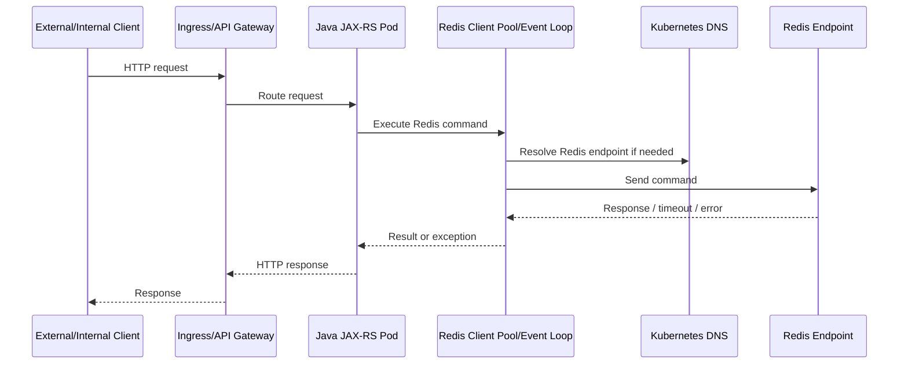

# Part 047 — Redis Client Workloads in Kubernetes

A Redis deployment can be healthy while Java services still fail because the client workload behavior is unsafe.

This part focuses on the Java/JAX-RS service pods that connect to Redis from Kubernetes.

The Redis server is only one side of production behavior.

The other side is the aggregate behavior of all application pods:

- How many connections they open.
- How they resolve Redis endpoints.
- How they behave during rolling updates.
- How they reconnect after failover.
- How timeout and retry policies amplify load.
- How CPU throttling affects Redis command latency.
- How secrets are injected and rotated.
- How circuit breakers prevent Redis incidents from becoming application-wide incidents.

The core rule:

> A Redis client configuration that is safe for one local Java process can become unsafe when multiplied by hundreds of Kubernetes pods.

---

## 1. Mental Model: Redis Client Load Is Multiplicative

In Kubernetes, a Java/JAX-RS service is not one process.

It is usually:

- N replicas.
- Each replica has one or more Redis client instances.
- Each client may own a connection pool or event loop.
- Each pool may create multiple connections.
- Each reconnect loop may retry independently.
- Each pod may start at nearly the same time during rollout or autoscaling.

A small per-pod configuration can become large cluster-wide load.

Example:

| Input | Value |
|---|---:|
| Service replicas | 80 pods |
| Redis pools per pod | 2 |
| Max connections per pool | 50 |
| Potential client connections | 8,000 |

If Redis is configured for far fewer clients, the issue is not the Redis server alone.

The issue is that the application workload has no global connection budget.

---

## 2. Request Lifecycle in Kubernetes

A typical Java/JAX-RS request path:



Every stage can fail independently.

A senior engineer should not only ask, "Is Redis up?"

Ask:

- Did DNS resolution fail?
- Did connection acquisition block?
- Did the pool exhaust?
- Did the event loop stall?
- Did the pod get CPU throttled?
- Did network policy reject traffic?
- Did a secret rotation invalidate auth?
- Did a failover redirect clients?
- Did retries amplify load?
- Did HTTP timeout expire before Redis timeout?

---

## 3. Kubernetes Changes the Failure Model

Outside Kubernetes, a Redis client may fail because Redis is down or the network is bad.

Inside Kubernetes, additional failure sources exist:

| Failure Source | Example | Redis Client Impact |
|---|---|---|
| Pod lifecycle | Rolling update kills pods | Connection churn, in-flight command failure |
| DNS | CoreDNS latency or stale records | Connect timeout, endpoint discovery failure |
| Service routing | Endpoint change | Temporary connection failure |
| NetworkPolicy | Missing egress rule | Auth/connection timeout symptoms |
| CPU throttling | Low CPU limit on Java pod | Event loop delay, timeout, false Redis slowness |
| Memory pressure | Java pod OOM | Abrupt connection close, incomplete work |
| Autoscaling | Many pods start together | Connection storm, cache miss storm |
| Secret rotation | Credential changes | AUTH failures until reload/restart |
| Node disruption | Pods rescheduled | Reconnect spike |
| Redis failover | Primary endpoint changes | MOVED/ASK, READONLY, reconnect, command retry |

Kubernetes makes client behavior dynamic.

Redis client configuration must be reviewed as part of workload design, not only Redis infrastructure design.

---

## 4. Connection Pool Per Pod

A common mistake is sizing Redis connection pools as if there is only one application instance.

In Kubernetes, the effective connection count is:

```text
service replicas
x Redis client instances per pod
x max connections per client/pool
x number of Redis endpoints/shards
```

For cluster-aware clients, connections may be created per node.

For async/reactive clients, fewer connections may handle more concurrent work, but event loop saturation becomes more important.

For blocking synchronous clients, pool exhaustion is often the main risk.

### Review Questions

- How many Redis pools exist per pod?
- Is the Redis client singleton-scoped or recreated per request?
- What is the max connection setting?
- What is the total connection budget across all replicas?
- Does Redis have a `maxclients` limit below the possible total?
- Does autoscaling change the connection budget?
- Does a rolling deployment temporarily double the number of pods?

### Bad Pattern

```text
Each request creates a Redis client.
Each Redis client creates new TCP connections.
Connections are closed eventually but not immediately.
Under load, Redis sees connection churn and rejected clients.
```

### Better Pattern

```text
Each pod creates a small number of long-lived Redis clients.
Client lifecycle is tied to application lifecycle.
Pool size is budgeted globally.
Shutdown closes clients gracefully.
Metrics expose pool utilization and wait time.
```

---

## 5. Connection Storm

A connection storm happens when many pods open or reopen Redis connections at the same time.

Common triggers:

- Deployment rollout.
- HPA scale-out.
- Node drain.
- Redis failover.
- CoreDNS recovery.
- Secret rotation requiring restart.
- Application crash loop.
- Circuit breaker misconfiguration.

Symptoms:

- Redis rejected connections increase.
- Java Redis connection acquisition latency increases.
- Redis CPU spikes from connection handling.
- Application pods fail readiness.
- Pods restart repeatedly.
- Redis appears unstable even after the original issue is gone.

### Mitigations

- Use startup jitter.
- Avoid aggressive reconnect loops.
- Use bounded pool sizes.
- Use exponential backoff with jitter.
- Avoid all pods warming cache simultaneously.
- Use readiness probes that do not stampede Redis.
- Configure deployment surge carefully.
- Limit HPA scale-up rate for Redis-heavy services.

---

## 6. DNS Resolution and Service Discovery

Kubernetes DNS can become part of Redis latency.

Client libraries differ in how they resolve and cache DNS results.

Important questions:

- Does the Redis endpoint point to a Kubernetes Service?
- Does it point to a cloud-managed Redis DNS endpoint?
- Does the client resolve DNS once or repeatedly?
- Does JVM DNS cache TTL match the failover model?
- Does the Redis client library handle endpoint changes?
- Are cluster topology updates based on DNS, Redis redirection, or topology refresh?

### JVM DNS Cache Awareness

Java applications may cache DNS results depending on JVM security settings and runtime configuration.

A stale DNS cache can cause Java pods to keep connecting to an old Redis endpoint after failover or endpoint replacement.

### Internal Verification Checklist

- Check JVM DNS cache TTL.
- Check Redis client topology refresh settings.
- Check whether DNS resolution is visible in metrics/logs.
- Check CoreDNS latency/error dashboard.
- Check failover test evidence.

---

## 7. Redis Endpoint Types

The client behavior depends heavily on the endpoint type.

| Endpoint Type | Client Expectation | Risk |
|---|---|---|
| Single Redis pod DNS | Standalone client | No HA unless externalized |
| Kubernetes Service | Stable virtual endpoint | May hide role changes incorrectly |
| Sentinel endpoint | Sentinel-aware client | Wrong client mode breaks failover |
| Redis Cluster endpoint | Cluster-aware client | Non-cluster client sees MOVED/CROSSSLOT issues |
| Cloud primary endpoint | Client follows provider endpoint behavior | DNS/cache/failover handling matters |
| Cloud reader endpoint | Read-only use only | Stale reads, accidental writes fail |

The Java Redis client mode must match the endpoint topology.

A standalone client pointed at a clustered Redis topology is a correctness and availability smell.

---

## 8. Rolling Update Impact

A rolling update creates connection churn.

During deployment:

- New pods start and create Redis connections.
- Old pods may still handle requests.
- Surge settings may temporarily increase total pod count.
- Cache warmup may increase Redis and database load.
- Readiness probes may produce Redis traffic.
- Old pods may terminate while commands are in flight.

### Safer Rolling Update Behavior

- Redis client is initialized once per pod.
- Startup does not perform massive cache warmup unless controlled.
- Readiness does not require heavy Redis operations.
- Shutdown stops accepting traffic before closing Redis client.
- In-flight work has a bounded drain period.
- Deployment surge respects Redis connection and QPS budgets.

### Failure Mode

A new version introduces a cache miss pattern.

During rollout, half the pods use old keys and half use new keys.

Redis hit ratio drops.

PostgreSQL load increases.

Autoscaling adds more pods.

More pods open more Redis connections.

Redis latency increases.

HTTP latency increases.

The root cause looks like Redis slowness, but the actual cause is incompatible key versioning and rollout behavior.

---

## 9. Graceful Shutdown

Kubernetes termination should be treated as a normal event.

Bad shutdown behavior:

- Pod receives SIGTERM.
- JAX-RS container still accepts requests.
- Redis client is closed immediately.
- In-flight requests fail with connection closed.
- Worker consumers stop without ack discipline.
- Locks may remain until TTL.
- Idempotency records may remain in processing state.

Better shutdown behavior:

1. Stop accepting new traffic.
2. Fail readiness.
3. Drain in-flight HTTP requests.
4. Stop background workers safely.
5. Ack or requeue stream/list work according to policy.
6. Release best-effort locks if safe.
7. Flush metrics/logs.
8. Close Redis clients.
9. Exit before termination grace period expires.

### Java/JAX-RS Review

Check whether the runtime supports lifecycle hooks:

- CDI `@PreDestroy`.
- Spring lifecycle callbacks if Spring is used.
- Quarkus shutdown hooks if Quarkus is used.
- Micronaut shutdown hooks if Micronaut is used.
- Container-specific JAX-RS lifecycle integration.

Do not assume all frameworks handle Redis client shutdown automatically.

---

## 10. Readiness Probe Design

A readiness probe should answer:

> Can this pod safely receive traffic now?

It should not become a distributed load generator against Redis.

Bad readiness probe:

```text
Every pod probes Redis every second using a real business key lookup.
When Redis is slow, all pods fail readiness.
Traffic shifts, retries increase, Redis gets more pressure.
```

Safer readiness probe:

- Keep it cheap.
- Avoid high-cardinality business keys.
- Use bounded timeout.
- Consider degraded readiness semantics carefully.
- Avoid causing cascading traffic redistribution.
- Separate liveness from dependency health.

### Redis Dependency in Readiness

Whether Redis failure should make the pod unready depends on use case.

| Redis Use Case | Should Redis Failure Fail Readiness? | Reason |
|---|---|---|
| Optional cache | Usually no | Service may degrade but still serve from DB |
| Hard session store | Maybe yes | Requests may fail without session state |
| Critical rate limiter | Depends | Failing open vs closed is policy decision |
| Idempotency store | Depends | Unsafe if duplicate side effects possible |
| Stream worker | Worker readiness may depend on Redis | HTTP readiness may not |
| Feature flag cache | Usually no if safe defaults exist | Avoid full outage from config cache issue |

---

## 11. Liveness Probe Design

A liveness probe should answer:

> Is this process irrecoverably stuck and should Kubernetes restart it?

It should rarely depend on Redis.

If Redis is down, restarting every Java pod usually makes things worse.

Bad liveness behavior:

- Redis slow.
- Liveness probe fails.
- Kubernetes restarts pods.
- Pods reconnect simultaneously.
- Redis gets connection storm.
- Application outage expands.

Use liveness for process health, not dependency health.

---

## 12. Startup Probe and Warmup

Startup probes protect slow-starting Java services.

Redis-heavy services may need startup design because they may:

- Load configuration from Redis.
- Build local cache from Redis.
- Register stream consumers.
- Load Lua scripts.
- Connect to cluster topology.
- Verify credentials.

Avoid forcing all pods to warm the same cache simultaneously.

### Warmup Rules

- Warm only critical keys.
- Add jitter.
- Bound concurrency.
- Avoid DB fallback storm during warmup.
- Expose warmup metrics.
- Make warmup cancelable during shutdown.

---

## 13. CPU Throttling and False Redis Latency

Java Redis client latency may increase even when Redis is healthy.

One common Kubernetes cause is CPU throttling.

If a pod has a low CPU limit:

- Netty event loop may not run promptly.
- Synchronous client threads may wait longer.
- JSON serialization/deserialization slows down.
- Timeout timers may fire late.
- Metrics may blame Redis command latency even though the pod is throttled.

### Diagnosis

Compare:

- Redis server latency.
- Client-side command latency.
- Pod CPU throttling metrics.
- JVM GC pause metrics.
- Thread pool saturation.
- Netty event loop pending tasks if available.

If client latency is high but Redis server latency is low, inspect the Java pod first.

---

## 14. Memory Pressure and Client Behavior

Java pods under memory pressure can create Redis symptoms:

- GC pauses cause command timeout.
- OOMKill drops connections abruptly.
- Large deserialized cache objects increase heap pressure.
- Compression/decompression creates allocation spikes.
- Local cache plus Redis client buffers consume memory.

Redis is often blamed because the failure appears around Redis calls.

But the actual issue may be Java heap, off-heap buffers, or local cache size.

### Review Checklist

- Check Java heap sizing.
- Check container memory limit.
- Check Netty direct memory if using Lettuce/reactive clients.
- Check local cache maximum size.
- Check serialized value size.
- Check large `MGET` result memory impact.

---

## 15. Timeout Hierarchy

Timeouts must be ordered.

A Redis command timeout should not exceed the remaining HTTP request budget.

Example hierarchy:

```text
HTTP client timeout:             2,000 ms
Ingress/backend timeout:         1,800 ms
JAX-RS request budget:           1,500 ms
Redis command timeout:             100-300 ms for cache reads
DB fallback budget:                800-1,000 ms
Response serialization budget:      remaining
```

The exact numbers depend on service SLO.

The principle is more important than the number:

> Redis cannot spend more time than the request can afford.

### Common Mistakes

- Redis timeout is longer than HTTP timeout.
- Retry budget ignores total request deadline.
- Circuit breaker opens after the user already timed out.
- Cache fallback to DB has no budget.
- Stream worker Redis timeout differs wildly from HTTP Redis timeout without reason.

---

## 16. Retry Policy

Retries can help transient failures.

Retries can also create load amplification.

For Redis cache reads, retry is often less useful than fallback because cache should be optional.

For idempotency, lock, limiter, stream ack, or security state, retry policy requires careful correctness reasoning.

### Retry Risk Matrix

| Operation | Retry Risk | Safer Default |
|---|---|---|
| Cache GET | Extra latency/load | Maybe no retry; fallback to DB/stale |
| Cache SET | Extra load; stale write | Limited retry or best-effort |
| Rate limiter script | Double counting if not atomic/idempotent | Atomic script, bounded retry |
| Lock acquire | Waiting too long | Bounded retry with jitter |
| Lock release | Release failure leaves TTL cleanup | Safe unlock script, best-effort retry |
| Idempotency create | Duplicate processing risk | Atomic state machine, careful retry |
| Stream ack | Duplicate processing risk if ack lost | Idempotent job handling |
| Session write | User-facing auth issue | Bounded retry, strong observability |

---

## 17. Circuit Breaker and Bulkhead

A circuit breaker prevents repeated calls to an unhealthy dependency.

A bulkhead prevents one dependency from consuming all service resources.

Redis calls should not share unlimited threads with all request processing.

### Cache Use Case

For optional cache:

- Circuit opens when Redis latency/error rate is high.
- Service bypasses cache temporarily.
- DB fallback is protected by its own bulkhead/rate limit.
- Stale value fallback may be used if allowed.

### Critical State Use Case

For session/idempotency/lock/rate limiter:

- Circuit breaker policy must match business correctness.
- Failing open may create security/correctness risk.
- Failing closed may create availability risk.
- Decision should be explicit and documented.

---

## 18. NetworkPolicy and Egress Control

In Kubernetes, Redis connectivity may be blocked by NetworkPolicy.

Symptoms can look like:

- Connection timeout.
- Intermittent connection failure.
- TLS handshake timeout.
- AUTH timeout.
- Read timeout.

A senior debugging flow checks network policy before blaming Redis.

### Internal Verification Checklist

- Is egress from app namespace to Redis namespace allowed?
- Are Redis ports explicitly allowed?
- Are DNS egress rules allowed?
- Are cloud-managed Redis private endpoints reachable?
- Is traffic crossing namespace, VPC, subnet, or peering boundary?
- Is TLS inspection or firewall involved?

---

## 19. Secret Injection and Rotation

Redis credentials may be injected via:

- Kubernetes Secret.
- External Secrets Operator.
- Vault agent.
- AWS Secrets Manager integration.
- Azure Key Vault integration.
- Environment variables.
- Mounted files.

Secret rotation creates a lifecycle problem.

Questions:

- Does the Java Redis client reload credentials without restart?
- If not, how are pods restarted safely?
- Is old credential accepted during rotation overlap?
- Are failed auth attempts alerted?
- Are Redis AUTH/ACL users rotated per service or shared globally?

### Bad Pattern

```text
All services share one Redis password.
Password rotation requires all services to restart immediately.
No one knows which pods have reloaded the secret.
```

### Better Pattern

```text
Redis ACL users are scoped per service/use case.
Rotation supports overlap.
Pods restart gradually.
Auth failures are observable.
Rollback is defined.
```

---

## 20. TLS and Java Truststore

If Redis uses TLS, Java client pods must have correct trust configuration.

Failure modes:

- Missing CA certificate.
- Expired certificate.
- Wrong hostname verification behavior.
- TLS-only endpoint used by non-TLS client.
- Non-TLS endpoint accidentally used in production.
- Certificate rotation not tested.

### Review Checklist

- Is TLS enabled for Redis traffic?
- Where is the truststore configured?
- Is certificate rotation tested?
- Does the client verify hostname?
- Are TLS errors distinguishable from Redis command failures?
- Are metrics split between connect, TLS handshake, auth, and command latency?

---

## 21. Redis Client Modes in Java Pods

The Redis client must match the topology.

| Redis Topology | Required Client Capability |
|---|---|
| Standalone | Standalone client |
| Sentinel | Sentinel discovery and failover support |
| Cluster | Cluster topology refresh and redirection support |
| TLS endpoint | TLS support and trust config |
| ACL/RBAC | Username/password or provider-specific auth support |
| IAM-based auth if used | Token refresh/re-auth behavior |

Wrong client mode causes production problems that may only appear during failover or resharding.

---

## 22. Cluster Topology Refresh

For Redis Cluster, Java clients need topology awareness.

They must handle:

- `MOVED` redirection.
- `ASK` redirection.
- Slot migration.
- Node failure.
- Primary promotion.
- New cluster node discovery.

Review whether topology refresh is:

- Enabled.
- Periodic.
- Adaptive after redirection.
- Bounded to avoid refresh storms.
- Observable.

A client that works during normal operation can fail badly during cluster maintenance if topology refresh is wrong.

---

## 23. Multi-Key Commands and Kubernetes Scale

Multi-key commands can become more dangerous at scale.

Examples:

- `MGET` with many keys.
- `MSET` with large payloads.
- `DEL` with thousands of keys.
- Large pipeline batches.
- Cross-slot multi-key commands in Redis Cluster.

Kubernetes makes this worse because many pods may run the same pattern concurrently.

### Safer Practices

- Bound batch size.
- Avoid unbounded user-driven key lists.
- Use hash tags intentionally in Cluster only when needed.
- Avoid huge response payloads.
- Prefer async background cleanup for large deletes where possible.
- Observe payload size and command latency.

---

## 24. Local Cache Plus Redis in Kubernetes

Many Java services use local in-process cache plus Redis distributed cache.

This creates a three-layer model:

```text
Java local cache -> Redis distributed cache -> PostgreSQL/source of truth
```

Benefits:

- Lower Redis QPS for hot keys.
- Lower latency.
- Better resilience for read-mostly data.

Risks:

- Stale local values.
- Invalidation complexity.
- Per-pod memory growth.
- Different pods observe different state.
- Rolling update creates mixed cache versions.

### Review Questions

- What is local cache TTL?
- What is Redis TTL?
- Which layer is invalidated first?
- Can stale local cache violate correctness?
- Does cache key include version?
- How much memory can local cache consume per pod?

---

## 25. Cache Miss Storm During Autoscaling

Autoscaling can amplify cache misses.

When new pods start:

- Their local caches are empty.
- They hit Redis more frequently.
- Redis misses may hit PostgreSQL.
- If many pods start together, DB load spikes.

Mitigations:

- Warm critical local cache gradually.
- Use Redis as shared distributed cache.
- Use TTL jitter.
- Use single-flight around DB reload.
- Bound DB fallback concurrency.
- Control HPA scale-up speed.

---

## 26. Redis Unavailable Scenario

Every Redis call path needs a decision.

| Use Case | Redis Unavailable Behavior |
|---|---|
| Optional read cache | Bypass Redis, query DB if safe |
| Cache write | Skip cache write, log metric |
| Rate limiter | Explicit fail-open or fail-closed policy |
| Idempotency | Usually fail-safe; avoid duplicate side effects |
| Lock | Do not enter critical section unless safe alternative exists |
| Session | Auth/session behavior must be defined |
| Feature flag | Use safe default or last known value |
| Stream worker | Pause/reconnect; avoid uncontrolled duplicate work |

Do not leave this to exception defaults.

---

## 27. Redis Slow Scenario

Redis slow is different from Redis down.

Slow Redis can be worse because calls hang until timeout.

Controls:

- Short command timeout for cache reads.
- Bounded connection acquisition time.
- Circuit breaker on latency.
- Bulkhead for Redis calls.
- Separate timeout for critical operations.
- Metrics for client-side wait time vs server-side latency.

If Redis is slow, retrying aggressively usually makes it slower.

---

## 28. Observability Required in Java Pods

Server-side Redis metrics are not enough.

Java service should expose:

- Redis command latency by operation type.
- Connection pool active/idle/waiting.
- Pool acquisition timeout count.
- Redis command timeout count.
- Redis exception type count.
- Retry count.
- Circuit breaker state.
- Cache hit/miss at application level.
- Serialization/deserialization failure count.
- Payload size distribution if feasible.
- Per-endpoint limiter decision metrics.
- Stream worker pending/ack/retry metrics.

Without client-side metrics, Redis debugging is guesswork.

---

## 29. Logging Rules

Log enough to debug.

Do not log sensitive Redis data.

Recommended fields:

- Service name.
- Pod name.
- Namespace.
- Redis use case.
- Operation type.
- Key prefix, not full sensitive key.
- Tenant identifier only if allowed and redacted.
- Correlation ID.
- Timeout budget.
- Exception class.
- Circuit breaker state.

Avoid logging:

- Session tokens.
- Idempotency payloads.
- PII keys.
- Raw Redis values.
- Credentials.

---

## 30. Java Threading Risks

### Synchronous Client

Risks:

- Blocking request threads.
- Pool exhaustion.
- Thread starvation.
- Long command timeout consumes HTTP worker threads.

Controls:

- Small command timeout.
- Bounded pool.
- Separate executor/bulkhead if needed.
- No Redis call inside unbounded loops.

### Async/Reactive Client

Risks:

- Event loop blocking.
- Unbounded futures/promises.
- Backpressure not enforced.
- Serialization on event loop.
- Direct memory pressure.

Controls:

- Do not block event loop.
- Enforce backpressure.
- Bound concurrent commands.
- Monitor event loop delay.
- Separate CPU-heavy serialization work.

---

## 31. Worker Pods and Redis

Redis worker pods differ from HTTP pods.

They may:

- Use blocking list operations.
- Consume Redis Streams.
- Maintain long-running connections.
- Hold locks.
- Process jobs with retries.
- Ack messages after side effects.

Kubernetes lifecycle is critical.

During shutdown:

- Stop claiming new jobs.
- Finish or release current job.
- Ack only after successful side effect.
- Avoid losing job progress.
- Avoid leaving lock state ambiguous.

### Internal Verification Checklist

- Are worker shutdown hooks implemented?
- Does termination grace period exceed max safe job drain time?
- Are long jobs idempotent?
- Are stream pending entries monitored?
- Are list-based jobs recoverable after crash?

---

## 32. HPA and Redis-Backed Workloads

Horizontal Pod Autoscaler may scale based on CPU, memory, request rate, or custom metrics.

For Redis-heavy services, HPA changes Redis pressure.

Review:

- Does scale-out increase Redis QPS linearly?
- Does scale-out increase DB fallback load?
- Does scale-out increase connection count beyond budget?
- Does scale-in kill workers holding jobs/locks?
- Does HPA use Redis-related metrics?

A service can autoscale itself into a Redis incident.

---

## 33. PodDisruptionBudget and Client Availability

PDB is usually discussed for Redis server pods.

But Redis-heavy client services may also need disruption control.

Examples:

- Critical session service.
- Rate limiter gateway.
- Stream worker fleet.
- Cache projection updater.
- Idempotency-heavy order command service.

If too many client pods disappear at once:

- Redis stream processing stalls.
- Cache invalidation stops.
- Rate limiting becomes inconsistent.
- Order commands fail.

Review whether critical Redis client workloads have appropriate disruption policies.

---

## 34. Namespace and Multi-Tenant Concerns

In enterprise platforms, many services may share Redis infrastructure.

Risks:

- One namespace creates connection storm affecting others.
- One service creates hot keys affecting shared Redis.
- One bad key prefix collides with another service.
- One app logs sensitive Redis keys.
- One tenant causes high-cardinality key explosion.

Controls:

- Per-service ACL/key pattern where possible.
- Per-service connection budgets.
- Per-service metrics.
- Key naming standards.
- Tenant-aware rate limits.
- Platform-level quota or review.

---

## 35. Failure Mode Table

| Symptom | Possible Client-Side Cause | What To Check |
|---|---|---|
| Redis timeouts | CPU throttling, pool exhaustion, network policy, Redis slow | Client latency, pool wait, pod CPU, Redis latency |
| Rejected clients | Too many pod connections | Pool size x replicas, Redis maxclients |
| Auth failures | Secret rotation mismatch | Secret version, ACL user, pod restart state |
| MOVED/ASK errors | Non-cluster-aware client | Client mode, topology refresh |
| READONLY errors | Failover, stale primary connection | Client reconnect behavior, endpoint type |
| Cache hit ratio drop | Rolling deploy key version mismatch | Key version, release timeline |
| DB spike | Cache miss storm from new pods | HPA, warmup, Redis miss rate |
| Stream pending growth | Worker shutdown/crash | Consumer metrics, PEL, termination behavior |
| Latency only in Java | JVM/CPU/GC issue | Pod CPU, GC, thread pool, event loop |
| All pods restart | Liveness depends on Redis | Probe design |

---

## 36. Production-Safe Debugging Flow

When Redis client errors appear in Kubernetes:

1. Identify affected service, namespace, pod set, and deployment version.
2. Check if this aligns with rollout, HPA, node drain, or Redis failover.
3. Compare Redis server latency with Java client latency.
4. Check connection pool metrics.
5. Check pod CPU throttling and GC pauses.
6. Check network policy and DNS errors.
7. Check auth/secret changes.
8. Check command mix and slowlog.
9. Check cache hit/miss and DB fallback load.
10. Check whether retries/circuit breakers amplified the issue.

Avoid starting with destructive Redis commands or broad key scans.

---

## 37. PR Review Checklist

For any PR touching Redis client usage in Kubernetes, ask:

### Client Lifecycle

- Is the Redis client singleton-scoped per pod?
- Is it closed gracefully?
- Is it recreated accidentally per request?
- Is it initialized safely during startup?

### Pool and Connection Budget

- What is pool size per pod?
- What is total connection count at max replicas?
- Does deployment surge exceed budget?
- Is connection acquisition timeout bounded?

### Timeout and Retry

- Are Redis timeouts below request budget?
- Are retries bounded and jittered?
- Is retry safe for this operation?
- Is there a circuit breaker or bulkhead?

### Kubernetes Lifecycle

- Does readiness depend on Redis appropriately?
- Does liveness avoid Redis dependency?
- Does shutdown drain in-flight work?
- Are workers safe during scale-in?

### Security

- Are credentials injected securely?
- Is rotation behavior defined?
- Is TLS trust configured?
- Are logs redacted?

### Observability

- Are client-side metrics emitted?
- Are command errors categorized?
- Are pool metrics visible?
- Is cache hit/miss measured at application level?

---

## 38. Internal Verification Checklist

Verify the following in the actual codebase and platform setup:

### Codebase

- Redis client library and version.
- Client construction lifecycle.
- Pool configuration.
- Timeout and retry configuration.
- Circuit breaker/bulkhead usage.
- Error mapping in JAX-RS resources.
- Graceful shutdown hooks.
- Logging redaction.

### Kubernetes Manifests or Helm Charts

- Replica count and HPA settings.
- Resource requests/limits.
- Readiness/liveness/startup probes.
- Termination grace period.
- Deployment strategy and max surge.
- NetworkPolicy.
- Secret injection.
- PodDisruptionBudget.

### Platform/SRE

- Redis connection budget.
- Redis maxclients.
- CoreDNS metrics.
- Redis failover test evidence.
- Secret rotation process.
- Incident history.
- Dashboards and alerts.

### Security

- Redis ACL user per service.
- TLS configuration.
- Certificate trust and rotation.
- Sensitive key/value logging.
- Namespace isolation.

---

## 39. Senior Engineer Heuristics

Healthy Redis client workloads in Kubernetes usually have:

- Small, intentional pool sizes.
- Clear total connection budget.
- Bounded timeouts.
- Bounded retries with jitter.
- Circuit breaker for optional Redis use cases.
- Explicit fail-open/fail-closed policy for critical use cases.
- Probes that do not amplify Redis incidents.
- Graceful shutdown for HTTP and worker pods.
- Client-side metrics.
- Secret rotation plan.
- Cluster/Sentinel/standalone mode alignment.

Risky workloads usually have:

- Redis client created per request.
- Pool size copied from local development.
- Liveness probe depends on Redis.
- No connection budget across replicas.
- No topology awareness for cluster/failover.
- Retry loops without deadline.
- Cache warmup on every pod start without jitter.
- No client-side metrics.
- No tested behavior for Redis unavailable/slow.

---

## 40. Summary

Redis client behavior in Kubernetes is a distributed systems problem.

The Redis server may be healthy, but Java pods can still create production failure through connection storms, DNS issues, CPU throttling, unsafe retries, bad probes, unbounded pools, secret rotation mistakes, or poor shutdown behavior.

A senior engineer should review Redis client workloads at three levels:

1. Per-request behavior inside Java/JAX-RS.
2. Per-pod lifecycle behavior inside Kubernetes.
3. Aggregate fleet behavior across replicas, rollouts, autoscaling, and failover.

The most important question is not only:

> Can this pod connect to Redis?

The better question is:

> Can the entire service fleet use Redis safely during rollout, scale-out, failover, slowdown, secret rotation, and partial outage?
