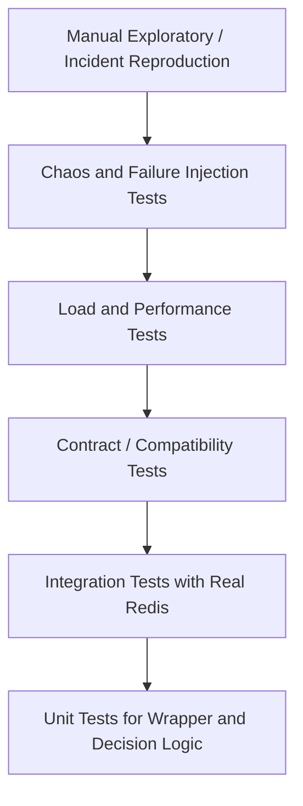
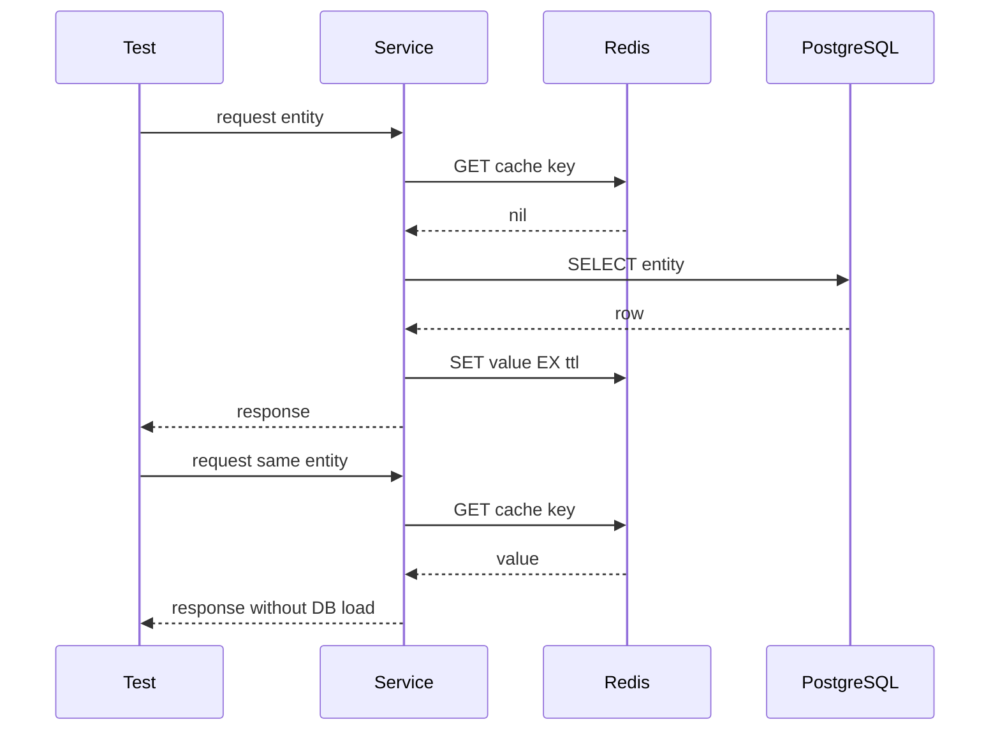
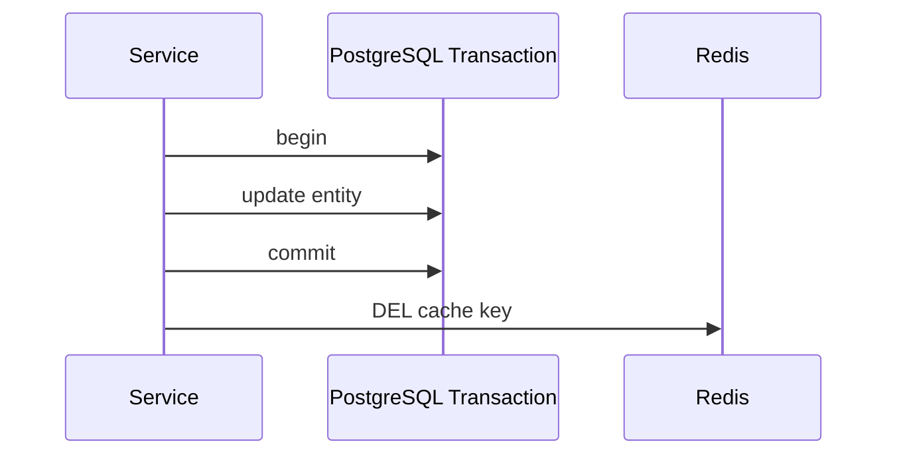
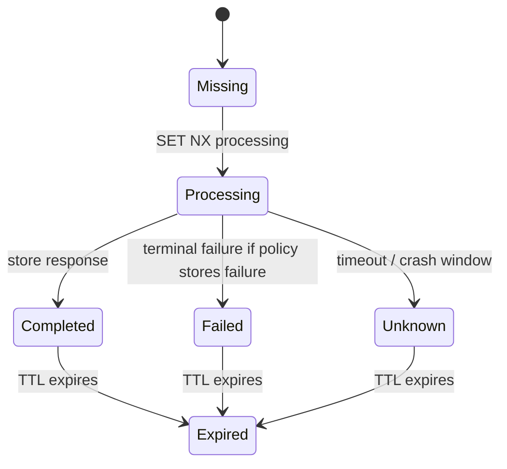
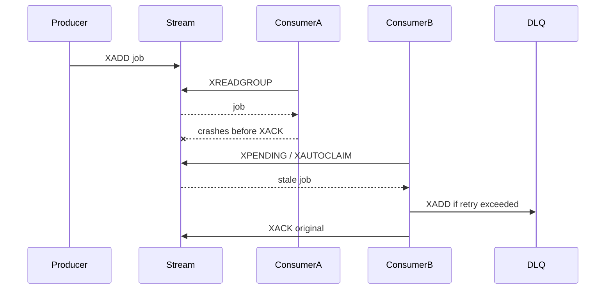

# Part 051 — Testing Redis-Based Systems

Redis bugs are rarely just Redis bugs.

They are usually boundary bugs:

- request retry meets idempotency state;
- database transaction meets cache invalidation;
- TTL expiry meets concurrent reload;
- worker crash meets pending stream entry;
- lock lease meets GC pause;
- Java client timeout meets Redis failover;
- Kubernetes rollout meets connection storm;
- serialization change meets stale cached payload.

A Redis-based system must be tested at the level where the risk exists.

Unit tests alone are not enough.

Integration tests alone are not enough.

Manual production debugging is not a testing strategy.

The goal of this part is to build a Redis testing model that helps a senior backend engineer review Redis usage with confidence.

---

## 1. Core Testing Principle

Test Redis behavior by responsibility boundary.

| Boundary | What to Test | Why It Matters |
|---|---|---|
| Redis wrapper | command mapping, serialization, error handling | prevents scattered Redis logic |
| Cache repository | hit, miss, fill, TTL, invalidation | protects correctness and database load |
| Service layer | fallback, timeout, retry, correlation ID | protects JAX-RS request behavior |
| Database boundary | commit + cache update/delete ordering | prevents stale cache and partial failure |
| Messaging boundary | duplicate/out-of-order invalidation events | prevents projection corruption |
| Concurrency boundary | duplicate request, lock, limiter, worker claim | prevents race conditions |
| Deployment boundary | Redis unavailable, slow, failover, restart | prevents production surprises |

Do not test Redis as if it were a simple map.

Redis is a remote, stateful, time-sensitive, failure-prone dependency.

---

## 2. Testing Pyramid for Redis-Based Systems



The lower layers run frequently.

The upper layers run selectively.

A healthy Redis testing strategy contains all layers, but not every layer belongs in every pull request.

---

## 3. What Not to Do

Avoid these weak testing patterns:

- mocking Redis everywhere and never running against real Redis;
- testing only `GET` and `SET` happy paths;
- ignoring TTL in tests;
- ignoring serialization compatibility;
- ignoring concurrent requests;
- ignoring Redis timeouts;
- ignoring Redis unavailable behavior;
- assuming Pub/Sub behaves like Kafka or RabbitMQ;
- assuming Redis Streams retries happen automatically;
- assuming distributed locks are safe because one test passes;
- using production Redis for tests;
- using `KEYS *` in tests and then copying that pattern into production code.

A test that hides Redis failure modes creates false confidence.

---

## 4. Unit Testing Redis Wrappers

In enterprise Java services, Redis access should usually be behind a small boundary:

- `CacheRepository`;
- `IdempotencyStore`;
- `RateLimiterStore`;
- `DistributedLockClient`;
- `RedisStreamConsumer`;
- `SessionStore`;
- `FeatureFlagCache`.

Unit tests should validate decision logic around the boundary.

They should not pretend to validate Redis server behavior.

### Good unit-test targets

- key builder output;
- TTL selection;
- fallback decision;
- error classification;
- request fingerprint calculation;
- idempotency state transition rules;
- rate limiter response mapping;
- lock acquisition result mapping;
- serialization version selection;
- safe default behavior when cache is unavailable.

### Poor unit-test targets

- whether Redis actually expires keys;
- whether `SET NX PX` is atomic;
- whether consumer groups persist pending entries;
- whether Pub/Sub drops offline messages;
- whether cluster redirection works.

Those require real Redis or higher-level tests.

---

## 5. Integration Testing with Real Redis

For Redis behavior, prefer integration tests against a disposable Redis instance.

The common local/CI options are:

- Testcontainers Redis using a container image;
- Docker Compose in integration test pipeline;
- ephemeral Kubernetes namespace for heavier tests;
- managed test instance for environment-level tests.

For most Java/JAX-RS services, Testcontainers is usually the best first option.

It gives real Redis behavior without relying on a shared environment.

### Example Shape: Testcontainers with Java

```java
class RedisIntegrationTest {
    // Use a real Redis container in integration tests.
    // Exact image tag and lifecycle conventions should follow team standards.

    static RedisClient redisClient;

    @BeforeAll
    static void startRedis() {
        // Start container.
        // Build Redis URI from host and mapped port.
        // Initialize the same Redis wrapper used by application code.
    }

    @AfterEach
    void cleanRedis() {
        // Prefer deleting test namespace keys only.
        // Avoid teaching production-dangerous habits like blind FLUSHALL.
    }

    @Test
    void cacheEntryExpiresAfterConfiguredTtl() {
        // arrange
        // act
        // assert TTL / expiry behavior using real Redis
    }
}
```

The important part is not the exact library syntax.

The important part is that test Redis behaves like Redis.

---

## 6. Test Key Namespace Discipline

Tests must not create chaotic keyspaces.

Use deterministic test prefixes.

Example:

```text
it:{service}:{test-class}:{test-method}:{uuid}:...
```

Testing key rules:

- never share test keys with development or production;
- include service/test namespace;
- avoid PII in test keys;
- keep TTL on test keys as safety net;
- cleanup only the test namespace;
- avoid `FLUSHALL` unless the Redis instance is guaranteed disposable;
- avoid `KEYS *` in shared environments.

The test keyspace should model production discipline.

---

## 7. Cache Tests

A Redis cache test should cover lifecycle, not just value retrieval.

### Minimum cache test cases

| Scenario | Expected Assertion |
|---|---|
| cache miss | loader is called once |
| cache hit | loader is not called |
| cache fill | value is stored with expected TTL |
| expired entry | loader is called again |
| negative cache | absent result is cached only for short TTL |
| serialization failure | error is classified and handled |
| Redis unavailable | service behavior follows fallback contract |
| stale payload version | service handles compatibility or evicts safely |

### Cache-aside test shape



The second request should prove the database was not called.

---

## 8. TTL Tests

TTL tests are necessary because many Redis production bugs come from expiry assumptions.

Test cases:

- key has TTL after write;
- key does not accidentally become persistent;
- TTL is within expected range;
- TTL jitter is applied when required;
- short-lived key expires;
- refresh path extends TTL only when intended;
- update path preserves or resets TTL intentionally;
- sensitive data always has TTL;
- idempotency key TTL matches retry window;
- rate limiter key TTL prevents memory growth.

Avoid brittle sleep-heavy tests.

Prefer short TTLs in tests, but keep enough margin to avoid CI flakiness.

Bad:

```java
Thread.sleep(1000);
assertNull(redis.get(key));
```

Better:

```java
await()
  .atMost(Duration.ofSeconds(3))
  .untilAsserted(() -> assertThat(redis.get(key)).isNull());
```

Use polling instead of exact timing assumptions.

---

## 9. Cache Invalidation Tests

Invalidation tests should prove ordering and failure behavior.

Important cases:

- database update invalidates cache after commit;
- failed database transaction does not invalidate committed cache incorrectly;
- duplicate invalidation event is safe;
- out-of-order invalidation event does not resurrect stale data;
- versioned key avoids stale overwrite;
- tenant-wide invalidation does not delete unrelated tenant keys;
- catalog/rules invalidation respects dependency scope;
- invalidation failure is observable.

For PostgreSQL/MyBatis/JDBC integration, explicitly test transaction boundary.



Invalidating before commit creates a race window.

A test should make that risk visible.

---

## 10. Rate Limiter Tests

A rate limiter test must cover fairness, atomicity, TTL, and response mapping.

Minimum cases:

- first request allowed;
- request within quota allowed;
- request beyond quota rejected;
- limit resets after window;
- `Retry-After` is calculated correctly;
- per-user limit does not affect another user;
- per-tenant limit aggregates expected users;
- per-endpoint limit does not block unrelated endpoint;
- concurrent requests cannot exceed allowed burst unexpectedly;
- limiter keys expire;
- Redis unavailable behavior is explicit.

### Concurrency test

A simple sequential test does not prove limiter safety.

Add a concurrent test:

```java
int requestCount = 100;
ExecutorService pool = Executors.newFixedThreadPool(16);

List<Boolean> decisions = invokeLimiterConcurrently(pool, requestCount);

long allowed = decisions.stream().filter(Boolean::booleanValue).count();
assertThat(allowed).isLessThanOrEqualTo(configuredLimit);
```

This is especially important for limiter implementations using `INCR`, `EXPIRE`, sorted sets, or Lua.

---

## 11. Idempotency Tests

Idempotency testing is state-machine testing.

Do not only test “same key returns same response.”

Test the lifecycle:



Minimum cases:

- first request reserves key;
- duplicate request while processing receives correct response;
- duplicate completed request replays stored response;
- same key with different request fingerprint is rejected;
- expired idempotency key allows new processing according to policy;
- concurrent same request only performs side effect once;
- DB commit succeeds but Redis response cache write fails;
- Redis processing marker succeeds but downstream DB operation fails;
- client timeout causes ambiguous server state;
- Kafka/RabbitMQ publish retry does not duplicate business effect.

The strongest idempotency tests combine Redis, database, and concurrency.

---

## 12. Distributed Lock Tests

Lock tests must be treated carefully.

A passing test does not prove distributed lock correctness under all failure modes.

Still, tests can catch many bad implementations.

Minimum cases:

- lock acquisition succeeds when key absent;
- second owner cannot acquire while lease active;
- unlock by owner succeeds;
- unlock by non-owner fails;
- expired lock can be acquired by another owner;
- safe unlock uses value comparison;
- lock lease is longer than expected critical section under normal conditions;
- critical section handles lock acquisition failure;
- renewal/watchdog behavior is bounded;
- lock failure does not corrupt database state.

### Unsafe unlock test

The test should catch this bug:

```text
Owner A acquires lock with value A.
Owner A pauses until lease expires.
Owner B acquires lock with value B.
Owner A resumes and deletes lock key without checking value.
Owner B's lock is destroyed.
```

The unlock path must compare value atomically, usually through Lua.

---

## 13. Redis Stream Consumer Tests

Redis Streams require lifecycle tests.

Minimum cases:

- producer writes event using `XADD`;
- consumer group reads event;
- successful processing sends `XACK`;
- failed processing leaves message pending;
- stale pending message can be claimed;
- poison message is moved to DLQ-like stream after retry limit;
- stream trimming does not remove required replay data too early;
- consumer restart resumes correctly;
- duplicate delivery is idempotent;
- pending entry count is observable.

### Stream test lifecycle



A stream consumer without tests for pending entries is incomplete.

---

## 14. Pub/Sub Tests

Pub/Sub tests should prove non-durability assumptions.

Minimum cases:

- online subscriber receives message;
- pattern subscriber receives matching channel;
- offline subscriber misses message;
- reconnect does not replay missed messages;
- duplicate notification is safe;
- missing notification has fallback path if correctness matters.

If a feature requires replay, Pub/Sub is the wrong primitive.

Test that assumption explicitly.

---

## 15. Redis Unavailable Tests

Every Java/JAX-RS Redis use case needs an explicit unavailable behavior.

Possible policies:

| Use Case | Possible Behavior When Redis Is Down |
|---|---|
| non-critical cache | bypass cache and read DB |
| expensive cache | degrade, stale fallback, or reject depending on DB protection |
| rate limiter | fail-open or fail-closed based on risk |
| idempotency | often fail-closed for side-effecting commands |
| distributed lock | fail operation or use DB-native mechanism if designed |
| session store | likely fail authentication/session lookup |
| feature flag cache | use safe default or last-known value |
| job queue | pause workers or fail health check |

Test this policy.

Do not leave it to client defaults.

---

## 16. Slow Redis Tests

A slow Redis is different from a down Redis.

Slow Redis can exhaust:

- JAX-RS request threads;
- async event loops;
- Redis connection pool;
- circuit breaker budget;
- upstream gateway timeout;
- worker concurrency;
- Kubernetes CPU limits.

Test cases:

- command timeout maps to controlled error;
- fallback does not block indefinitely;
- connection pool does not grow unbounded;
- bulkhead prevents Redis slowness from consuming all request capacity;
- circuit breaker opens after repeated failures;
- logs contain correlation ID and operation name;
- metrics expose timeout count and latency.

Inject slowness through test doubles at the wrapper boundary, network proxy, or controlled test environment.

---

## 17. Failover and Restart Tests

Failover tests are often environment-level, not unit-level.

Scenarios:

- Redis restart during cache read;
- Redis restart during write;
- Sentinel failover;
- Cluster primary failover;
- MOVED/ASK redirection during resharding;
- DNS endpoint change;
- connection pool reconnection storm;
- half-open TCP connection;
- replica stale read after failover.

Assertions:

- application recovers without restart where expected;
- transient errors are bounded;
- idempotency/lock/rate limiter semantics are not silently corrupted;
- dashboards show the event;
- alerts trigger only when actionable.

Failover testing should be coordinated with platform/SRE.

---

## 18. Load and Performance Tests

Load tests should model Redis access patterns, not just HTTP throughput.

Measure:

- Redis p50/p95/p99 latency;
- Java client latency;
- command rate by command type;
- cache hit ratio;
- miss amplification;
- database load during miss spike;
- connection pool usage;
- CPU and memory;
- network bandwidth;
- eviction and expiry rate;
- stream pending entries;
- limiter key growth;
- GC pressure from serialization.

Important test shapes:

- steady-state cache hit workload;
- cold-cache workload;
- burst traffic around synchronized TTL expiry;
- hot-key workload;
- large-payload workload;
- concurrent idempotency requests;
- rate limiter burst;
- stream worker backlog;
- Redis unavailable during peak.

A load test that only proves happy-path throughput is incomplete.

---

## 19. Chaos Tests

Chaos testing is not random breakage.

It is controlled validation of expected failure behavior.

Useful Redis chaos experiments:

- stop Redis container/pod;
- restart primary;
- kill stream consumer mid-message;
- inject latency;
- drop network path;
- exhaust connection pool;
- force Redis memory pressure in non-prod;
- simulate ACL/auth failure;
- rotate secret in non-prod;
- trigger Kubernetes rolling update;
- expire large group of keys at once.

Each experiment needs:

- hypothesis;
- blast radius;
- rollback plan;
- metrics to watch;
- expected application behavior;
- customer impact model;
- post-test notes.

Never run Redis chaos experiments in production without an approved game-day process.

---

## 20. CI Strategy

Not all Redis tests belong in the same CI stage.

| CI Stage | Test Type | Frequency |
|---|---|---|
| PR fast checks | unit tests, key builder tests, serializer tests | every PR |
| PR integration | Testcontainers Redis for core paths | every PR or selected modules |
| nightly | concurrency, TTL, stream, limiter, idempotency | daily |
| pre-release | performance, failover, compatibility | release gate |
| game day | chaos, platform failover, operational drills | scheduled |

Keep PR checks fast enough that engineers trust them.

Push expensive failure tests to scheduled or release-gate pipelines.

---

## 21. Java/JAX-RS Testing Checklist

For Redis paths inside Java/JAX-RS services, verify:

- request timeout is shorter than gateway timeout;
- Redis timeout is shorter than request timeout;
- Redis errors map to explicit HTTP behavior;
- fallback path is tested;
- correlation ID appears in Redis-related logs;
- metrics include operation name and outcome;
- thread pool/event loop is not blocked incorrectly;
- graceful shutdown stops background workers;
- health/readiness checks reflect real dependency policy;
- Redis unavailable behavior is documented.

The HTTP layer should not leak raw Redis exceptions.

---

## 22. PostgreSQL/MyBatis/JDBC Integration Checklist

For Redis + PostgreSQL tests, verify:

- cache is not updated before DB commit unless intentionally designed;
- rollback does not leave misleading cache state;
- transaction isolation does not produce stale cache fill;
- MyBatis mapper result matches cached representation;
- migration changes invalidate incompatible cache entries;
- database outage behavior does not overload Redis with useless retries;
- cache warming does not overload PostgreSQL;
- idempotency side effects are protected at DB boundary when required.

Redis cannot fix unclear database transaction semantics.

---

## 23. Kafka/RabbitMQ Integration Checklist

For Redis + messaging tests, verify:

- duplicate invalidation event is safe;
- out-of-order event is safe or detected;
- missing event has TTL or reconciliation fallback;
- projection update is idempotent;
- consumer retry does not corrupt cache;
- DLQ handling exists when cache update repeatedly fails;
- cache rebuild procedure exists;
- broker lag is visible as cache staleness risk;
- Redis failure while consuming event does not acknowledge too early unless intended.

A consumer that updates Redis is part of the cache correctness boundary.

---

## 24. Kubernetes and Cloud Test Considerations

In Kubernetes/cloud environments, Redis tests should include deployment behavior:

- rolling update of Java service;
- Redis DNS endpoint resolution;
- connection pool per pod;
- secret rotation;
- network policy;
- CPU throttling impact;
- readiness behavior when Redis is unavailable;
- pod termination while stream consumer owns pending messages;
- managed Redis maintenance window behavior;
- failover event from managed Redis.

Local Testcontainers does not cover all of these.

Use environment-level tests for deployment-specific risks.

---

## 25. Test Data and Privacy

Redis tests should not normalize bad data habits.

Rules:

- never use real PII in test keys;
- avoid real customer identifiers;
- avoid secrets in cached values;
- test redaction for Redis-related logs;
- ensure test snapshots/dumps do not contain sensitive data;
- use synthetic tenant IDs;
- keep TTL on test data;
- isolate test environments.

Privacy failures often start as “temporary test data.”

---

## 26. Production-Safe Debugging Tests

A mature team tests its debugging workflow.

Verify engineers know how to inspect Redis without unsafe commands.

Prefer:

- sampled key lookup by known key;
- `SCAN` with narrow prefix in non-hot path;
- `TTL` / `TYPE` / `MEMORY USAGE` for specific keys;
- `SLOWLOG GET`;
- `INFO` sections;
- client-side metrics;
- dashboard and logs.

Avoid normalizing:

- `KEYS *`;
- `MONITOR` in production without approval;
- `FLUSHALL`;
- large `SMEMBERS`;
- unbounded range reads;
- dumping sensitive values to logs.

Testing should reinforce safe operations.

---

## 27. Common Failure Modes to Test

| Failure Mode | Test Signal |
|---|---|
| key expires too early | TTL test fails or cache miss spike appears |
| key never expires | TTL assertion or memory growth test fails |
| stale cache | invalidation ordering test fails |
| stampede | concurrent miss test overloads loader |
| limiter too strict | allowed traffic is rejected |
| limiter too loose | concurrent requests exceed quota |
| idempotency duplicate | side effect count exceeds one |
| unsafe lock release | non-owner unlock deletes owner lock |
| stream stuck | pending entries grow without claim |
| Pub/Sub misuse | offline subscriber misses required message |
| serialization drift | old payload fails after model change |
| slow Redis | timeout/circuit breaker test fails |
| Redis outage | fallback contract not met |

A good suite turns known incident patterns into executable checks.

---

## 28. PR Review Checklist

Before approving Redis-related code, ask:

- Is the Redis use case clearly named?
- Is Redis the right primitive?
- Is there a wrapper boundary?
- Are keys deterministic and documented?
- Are TTLs explicit?
- Are serialization and versioning tested?
- Are cache hit/miss/fill/expire paths tested?
- Is invalidation tested against DB transaction boundaries?
- Are concurrent duplicate requests tested?
- Are limiter/lock/idempotency operations atomic?
- Are Redis unavailable and slow scenarios tested?
- Are metrics/logs tested or at least verified?
- Are dangerous commands absent?
- Are sensitive values protected?
- Does CI run the right level of Redis tests?

If the answer is “we will verify in production,” the PR is not ready.

---

## 29. Internal Verification Checklist

Use this checklist against the real codebase and platform.

- Identify all Redis wrappers and direct Redis client usages.
- Check whether direct Redis access bypasses shared abstractions.
- Check test coverage for cache TTL and invalidation.
- Check Testcontainers or equivalent integration test usage.
- Check whether Redis tests run in CI or only locally.
- Check rate limiter concurrency tests.
- Check idempotency duplicate/concurrent tests.
- Check distributed lock ownership/unlock tests.
- Check Redis Stream pending/retry/DLQ tests.
- Check Pub/Sub offline subscriber assumptions.
- Check Redis unavailable and slow Redis tests.
- Check failover/restart tests with platform/SRE.
- Check serialization compatibility tests across versions.
- Check cache migration/invalidation tests after schema changes.
- Check whether tests use safe key namespace and cleanup.
- Check whether test logs can leak Redis values or keys with sensitive data.
- Check CI runtime and ownership of Redis integration test failures.

---

## 30. Final Mental Model

Redis testing is not about proving Redis works.

Redis already works.

The real question is whether the application behaves correctly when Redis is:

- empty;
- stale;
- slow;
- unavailable;
- restarted;
- under memory pressure;
- receiving concurrent commands;
- losing Pub/Sub notifications;
- redelivering Stream entries;
- expiring keys;
- evicting keys;
- changing topology;
- returning old serialized payloads.

A senior engineer tests the Redis boundary as a distributed systems boundary.

That is the difference between a cache demo and a production-ready Redis design.
