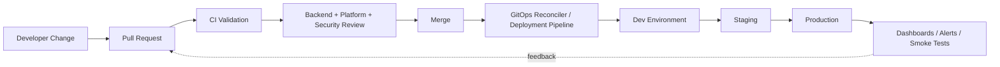
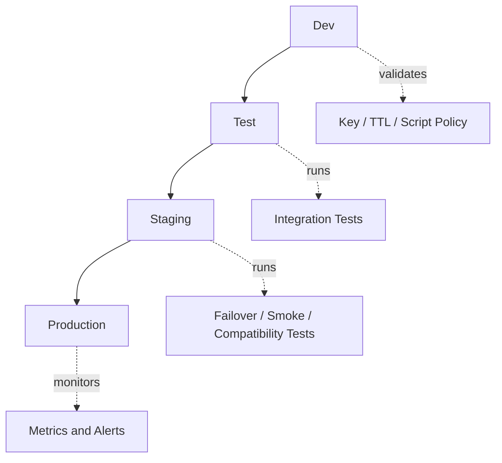
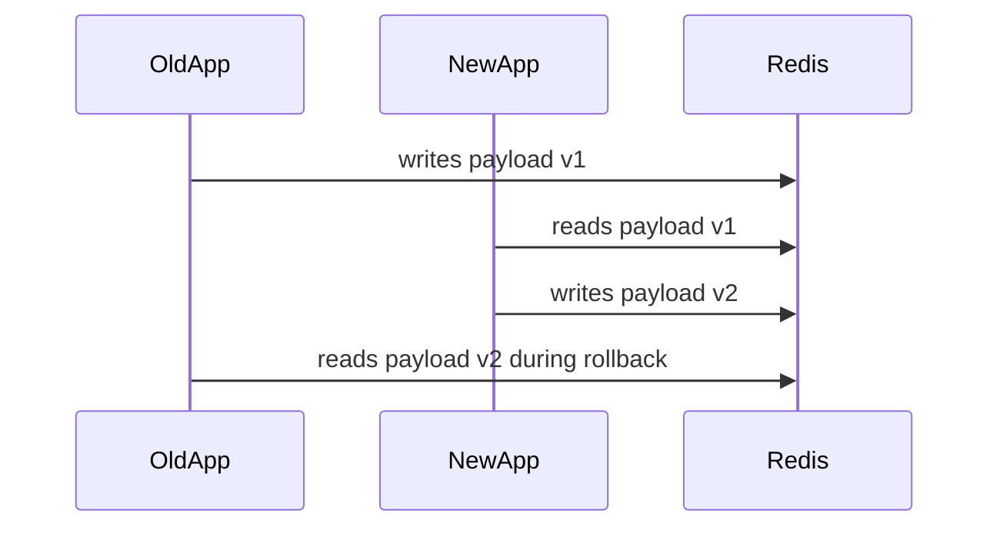
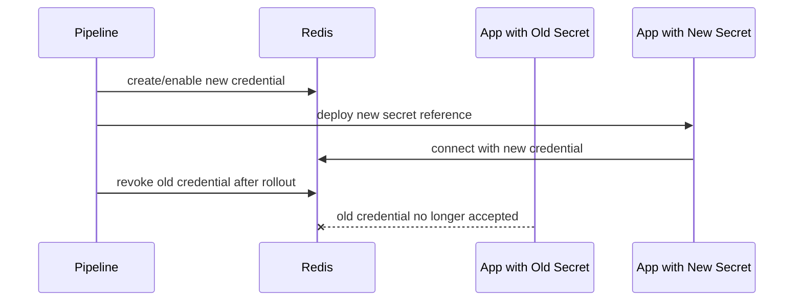

# Part 052 — CI/CD and GitOps for Redis Artifacts

Redis production readiness is not only application code.

Redis usage usually depends on artifacts around the application:

- key naming standards;
- TTL policy documents;
- Redis configuration;
- managed service parameter groups;
- ACL users and permissions;
- Lua scripts;
- Redis Functions;
- Kubernetes manifests;
- Helm values;
- dashboards;
- alerts;
- runbooks;
- migration and cache-warming jobs;
- smoke tests;
- rollback plans.

If these artifacts are changed manually, the Redis system drifts.

If they drift, production behavior becomes hard to explain.

The goal of CI/CD and GitOps for Redis is simple:

> Redis behavior should be reviewable, reproducible, promotable, observable, and reversible.

---

## 1. Mental Model: Redis Artifacts Are Production Code

A Redis Lua script can reject customer requests.

An ACL change can break all Java services.

A parameter group change can alter eviction behavior.

A Helm value can change memory limits.

A key naming change can orphan old cache entries.

A TTL policy change can overload PostgreSQL.

Therefore Redis artifacts deserve the same rigor as application code.

| Artifact | Why It Matters |
|---|---|
| Key naming standard | prevents collisions, leakage, and unowned keyspace |
| TTL policy | controls freshness, memory, privacy, retry windows |
| Redis config | controls memory, persistence, eviction, networking |
| Lua script | controls atomic business logic |
| Redis Function | deployable server-side logic with versioning concerns |
| ACL | controls blast radius of service credentials |
| Helm/IaC | controls deployment shape and security posture |
| Dashboard/alert | controls incident detection |
| Runbook | controls incident response |

If it can break production, it belongs in review.

---

## 2. What Should Be Managed as Code

A mature Redis setup should manage these as code where possible:

- Redis deployment manifests;
- Kubernetes StatefulSet/Service/Secret/ConfigMap/NetworkPolicy;
- Helm values;
- cloud Redis configuration;
- AWS parameter groups/security groups/subnet groups if used;
- Azure networking/firewall/private endpoint settings if used;
- ACL users and command/key permissions;
- TLS configuration references;
- Lua scripts;
- Redis Functions;
- key naming registry;
- cache policy registry;
- TTL policy registry;
- dashboard definitions;
- alert rules;
- synthetic tests;
- smoke tests;
- runbooks.

Not every organization exposes every Redis setting through GitOps.

But unmanaged critical settings should be treated as risk and documented.

---

## 3. GitOps Flow for Redis Artifacts



The key principle:

The desired Redis state lives in version control.

Runtime state should either match it or produce an explicit drift signal.

---

## 4. Redis Config as Code

Redis configuration controls production behavior.

Examples:

- `maxmemory`;
- `maxmemory-policy`;
- persistence settings;
- append-only settings;
- slowlog threshold;
- client limits;
- protected mode;
- TLS settings;
- keyspace notification settings;
- stream-related operational conventions;
- cluster/sentinel settings for self-managed deployments.

For managed Redis, similar behavior may live in:

- parameter groups;
- service tier/SKU;
- cluster mode settings;
- maintenance window;
- backup/snapshot policy;
- encryption settings;
- network access controls.

### Review questions

- Is this setting environment-specific or universal?
- Does it change memory behavior?
- Does it change durability behavior?
- Does it change security posture?
- Does it change client compatibility?
- Does it require Java client configuration changes?
- Does it require a maintenance window?
- Is rollback safe?

A Redis config change is not “just ops.”

It can change application correctness.

---

## 5. Key Naming Standard as Code

Key naming should not live only in tribal memory.

A key registry can be a Markdown file, YAML file, catalog entry, or generated documentation.

Example registry shape:

```yaml
keys:
  - pattern: "prod:{service}:tenant:{tenantId}:quote:{quoteId}:summary:v1"
    owner: "quote-service"
    purpose: "Quote summary cache"
    data_classification: "business-data"
    ttl: "15m with jitter"
    source_of_truth: "PostgreSQL quote tables"
    invalidation: "quote update event + TTL fallback"
    pii_allowed_in_key: false
    pii_allowed_in_value: false
    max_expected_value_size: "32KB"
    review_contact: "backend/platform"
```

This can be validated in CI.

For example:

- key builder tests match registered patterns;
- no unregistered prefixes are introduced;
- sensitive identifiers are not used in key names;
- TTL is defined for ephemeral keys;
- owner is defined;
- source of truth is defined.

A key without an owner becomes operational debt.

---

## 6. TTL Policy as Code

TTL policy should be explicit.

Example TTL catalog:

```yaml
ttlPolicies:
  quoteSummaryCache:
    default: "15m"
    jitter: "0-120s"
    max: "30m"
    reason: "performance cache over PostgreSQL"
    staleTolerance: "business-approved short stale window"

  idempotencyKey:
    default: "24h"
    jitter: "none"
    reason: "client retry and duplicate-submit protection"
    staleTolerance: "not applicable"

  loginAttemptCounter:
    default: "15m"
    reason: "security throttle window"
```

CI can check that application constants map to policy names rather than scattered numeric literals.

Bad:

```java
redis.setex(key, 900, value);
```

Better:

```java
redis.set(key, value, ttlPolicy.quoteSummaryCache());
```

Magic TTLs are hard to review.

Named TTL policies are easier to reason about.

---

## 7. Lua Scripts as Code

Lua scripts are code.

They need:

- source control;
- code review;
- unit tests where practical;
- integration tests against real Redis;
- deterministic input/output examples;
- versioning;
- rollout plan;
- rollback plan;
- script loading strategy;
- observability;
- ownership.

Common Lua-backed Redis operations:

- safe unlock;
- rate limiter;
- token bucket;
- idempotency state transition;
- queue claim;
- multi-key cleanup;
- conditional TTL update.

### Lua repository structure

```text
redis/
  scripts/
    rate-limiter-token-bucket.v1.lua
    idempotency-transition.v2.lua
    safe-unlock.v1.lua
  tests/
    rate-limiter-token-bucket.test.yaml
    idempotency-transition.test.yaml
  README.md
```

### Script review questions

- Are all keys passed through `KEYS`?
- Are non-key parameters passed through `ARGV`?
- Is the script bounded in time?
- Does the script avoid unbounded scans?
- Is the script deterministic enough for Redis replication model?
- Does the script handle missing keys?
- Does it preserve TTL intentionally?
- Does it return structured results the Java client can map safely?
- Is there a versioning strategy?
- Is there a rollback strategy?

A Lua script without tests is a hidden production dependency.

---

## 8. Redis Functions as Code

Redis Functions can package server-side logic more formally than ad-hoc scripts.

They still require release discipline.

Treat Redis Functions like deployed artifacts:

- name and version them;
- test them against real Redis;
- avoid long-running logic;
- define compatibility with Java client wrapper;
- document required keys and arguments;
- deploy through controlled pipeline;
- verify loaded function library after deploy;
- prepare rollback or previous-version fallback.

Do not let application startup blindly overwrite server-side functions without review.

That creates hidden deploy coupling.

---

## 9. ACL as Code

Redis ACLs should follow least privilege.

A Java service that only reads/writes cache keys should not be able to run administrative commands.

Example policy shape:

```yaml
redisUsers:
  - name: "quote-service-cache"
    keyPatterns:
      - "prod:quote-service:*"
    commandCategories:
      - "+@read"
      - "+@write"
    deniedCommands:
      - "-FLUSHALL"
      - "-FLUSHDB"
      - "-CONFIG"
      - "-MONITOR"
    tlsRequired: true
    rotationPolicy: "standard-secret-rotation"
```

### ACL review questions

- Does each service have its own Redis credential?
- Are key patterns restricted by service prefix?
- Are dangerous commands denied?
- Are admin credentials separated from app credentials?
- Is rotation tested?
- Are old credentials revoked?
- Are ACL changes backward compatible during rolling deployment?

An ACL change can break production instantly.

Test it before promotion.

---

## 10. Environment Promotion

Redis artifacts should move through environments intentionally.



Promotion should validate:

- configuration compatibility;
- script compatibility;
- ACL compatibility;
- Java client compatibility;
- key naming compatibility;
- serialization compatibility;
- dashboard/alert availability;
- rollback procedure.

Never promote Redis changes purely by copying manual console settings.

---

## 11. Compatibility Validation

Redis changes can break older app versions during rolling deployment.

Validate compatibility across:

- old app → new Redis config;
- new app → old Redis config;
- old app → new Lua script;
- new app → old Lua script;
- old payload → new deserializer;
- new payload → old deserializer during rollback;
- old ACL credential → new ACL policy;
- new key pattern → old invalidation code.

### Rolling deployment risk



If the old app cannot read payload v2, rollback is unsafe.

Compatibility tests should catch this before production.

---

## 12. Script Rollout Strategy

Lua scripts and Redis Functions need controlled rollout.

Common strategies:

### Strategy A — Client loads script on startup

Pros:

- simple;
- no separate deploy step;
- works for small systems.

Risks:

- startup failure if script load fails;
- multiple services racing to load scripts;
- difficult audit of deployed script version;
- hidden production mutation by app startup.

### Strategy B — Pipeline deploys script/function first

Pros:

- explicit deployment;
- audit-friendly;
- can smoke test before app rollout;
- separates infrastructure artifact from app boot.

Risks:

- requires pipeline discipline;
- requires version compatibility management.

### Strategy C — Versioned scripts with dual support

Pros:

- safest for rolling deployment;
- supports rollback;
- explicit migration.

Risks:

- more code paths;
- more cleanup work.

For enterprise systems, versioned scripts with explicit promotion are usually safer.

---

## 13. Config Drift Detection

Drift means runtime Redis state differs from expected state.

Drift sources:

- manual console changes;
- emergency hotfixes;
- provider-side default changes;
- failed GitOps reconciliation;
- partial Terraform/Helm apply;
- environment-specific patching;
- forgotten test changes;
- script loaded manually;
- ACL changed manually.

Drift detection should check:

- Redis config values;
- cloud parameter group values;
- ACL users and permissions;
- loaded Lua/Function versions;
- Kubernetes manifests vs live state;
- dashboard/alert existence;
- Redis engine/service version;
- backup and maintenance settings.

Drift is not always bad.

Unexplained drift is bad.

---

## 14. Rollback Strategy

Every Redis artifact change needs rollback thinking.

Rollback is not always “restore previous file.”

| Change | Rollback Concern |
|---|---|
| key naming change | old and new keys may coexist |
| TTL change | existing keys keep old TTL unless rewritten |
| serialization change | old app may fail on new payload |
| Lua script change | old script SHA may still be cached by clients |
| ACL change | old credentials may be invalid during rollback |
| eviction policy change | evicted data cannot be recovered from Redis |
| persistence change | durability window changes immediately |
| cluster change | resharding may affect client behavior |

Rollback plan should answer:

- Can old app version still run?
- Can old Redis config be restored safely?
- Do existing keys need migration or deletion?
- Are stale keys acceptable?
- Is data loss possible?
- Who approves rollback?
- How is success verified?

If rollback depends on manual Redis surgery, document it before deployment.

---

## 15. Dangerous Command Prevention

CI/CD should prevent dangerous Redis command usage from entering normal application code.

Commands requiring special scrutiny:

- `KEYS`;
- `FLUSHALL`;
- `FLUSHDB`;
- `CONFIG`;
- `MONITOR`;
- `EVAL` with unreviewed script strings;
- large `SMEMBERS`;
- unbounded `LRANGE`;
- unbounded `ZRANGE`;
- `HGETALL` on potentially large hashes;
- blocking commands without worker isolation;
- administrative cluster commands.

Possible controls:

- static checks in CI;
- code review checklist;
- wrapper-only Redis access;
- ACL command denial;
- production command allowlist;
- linting Lua scripts;
- secret scanning for Redis URLs/passwords.

Do not rely only on engineer discipline.

Make dangerous patterns hard to merge.

---

## 16. Redis Artifact Smoke Tests

After deployment, run smoke tests that prove essential Redis behavior.

Examples:

- application can authenticate to Redis;
- application can read/write allowed key prefix;
- denied command is actually denied;
- cache write includes TTL;
- Lua script/function is available;
- rate limiter returns expected allow/deny result;
- idempotency store can transition from missing to processing;
- stream consumer group exists;
- dashboard receives metrics;
- alert rules are loaded;
- Java service health/readiness matches dependency policy.

Smoke tests should be safe, namespaced, and automatically cleaned up.

---

## 17. Redis in Kubernetes GitOps

For self-managed Redis in Kubernetes, GitOps artifacts may include:

- StatefulSet;
- Service/headless Service;
- Secret references;
- ConfigMap;
- PersistentVolumeClaim templates;
- PodDisruptionBudget;
- NetworkPolicy;
- ServiceMonitor/PodMonitor;
- resource requests/limits;
- anti-affinity;
- backup CronJob;
- Redis exporter;
- operator custom resources;
- Helm values.

Review Kubernetes Redis changes for:

- data persistence;
- pod identity stability;
- storage class behavior;
- restart behavior;
- memory limit vs Redis maxmemory;
- readiness/liveness probe safety;
- network exposure;
- secret reload behavior;
- disruption tolerance.

A wrong Kubernetes value can create a Redis incident.

---

## 18. Managed Redis GitOps

For cloud-managed Redis, GitOps/IaC should capture provider configuration where possible.

Examples:

- service tier/SKU;
- node size;
- cluster mode;
- shard count;
- replica count;
- subnet/VNet/VPC config;
- security group/firewall/private endpoint;
- encryption in transit;
- encryption at rest;
- AUTH/token/user settings;
- backup/snapshot policy;
- maintenance window;
- logging/metrics integration;
- parameter group;
- scaling settings.

Managed does not mean unmanaged.

It means the provider owns some layers, while the team still owns configuration and usage correctness.

---

## 19. Java Service Deployment Coupling

Redis changes often couple to Java deployments.

Examples:

- new key prefix requires app release;
- new serializer requires dual-read or migration;
- new Lua script result shape requires client parser update;
- new ACL requires secret update;
- new cluster mode requires cluster-aware client;
- new TLS setting requires truststore/client config;
- new timeout policy requires service config update;
- new stream group requires worker deployment order.

Deployment plans should say which goes first:

- Redis artifact first;
- Java app first;
- dual-write first;
- dual-read first;
- background migration first;
- cleanup later.

The order matters.

---

## 20. Cache Migration Patterns

Redis cache changes often need migration patterns.

Common strategies:

### Versioned key

```text
quote-summary:v1:{quoteId}
quote-summary:v2:{quoteId}
```

Pros:

- simple;
- avoids deserialization conflict;
- easy rollback.

Cons:

- duplicate memory during transition;
- old keys need cleanup via TTL or job.

### Dual read

```text
try v2
if missing, try v1
if v1 found, convert and write v2
```

Pros:

- smooth migration;
- avoids cold-cache spike.

Cons:

- more logic;
- must eventually remove v1 path.

### Flush/rebuild

Pros:

- simple for non-critical cache.

Cons:

- can overload PostgreSQL;
- dangerous for high-traffic keys;
- unacceptable for idempotency/session/security state.

Never treat all Redis data as disposable without checking use case.

---

## 21. Redis Artifact Review Checklist

For each Redis artifact change, verify:

- artifact type is clear;
- owner is clear;
- environment impact is clear;
- production blast radius is clear;
- rollback plan exists;
- compatibility with current app version is tested;
- compatibility with rollback app version is tested;
- security review is complete if ACL/network/secret changes;
- privacy review is complete if key/value/snapshot changes;
- performance impact is estimated;
- observability is updated;
- runbook is updated if operational behavior changes.

A Redis artifact PR should read like a production behavior change.

---

## 22. CI Validation Checklist

CI can validate:

- Redis wrappers compile and tests pass;
- key builders match registered key patterns;
- TTL policies are referenced by name;
- Lua scripts pass static checks;
- Lua scripts pass integration tests against real Redis;
- Redis Function package is valid;
- ACL definitions deny dangerous commands;
- no Redis secrets are committed;
- no forbidden commands appear in application code;
- serialization compatibility tests pass;
- Testcontainers Redis integration tests pass;
- dashboard/alert files are syntactically valid;
- Helm/IaC plans are generated and reviewed.

CI should catch boring mistakes before humans review architecture.

---

## 23. Observability as Deployment Artifact

Redis observability should be deployed with the system.

When a Redis feature ships, dashboards and alerts should answer:

- Is Redis reachable from Java service?
- What is Redis command latency?
- What is cache hit/miss ratio?
- Are evictions happening?
- Are keys expiring as expected?
- Are rate limiter rejects expected?
- Are idempotency conflicts increasing?
- Are stream pending entries growing?
- Are Pub/Sub subscribers connected if relevant?
- Are connection pools saturated?
- Are authentication failures happening?

Do not deploy Redis-dependent behavior without visibility.

---

## 24. Security and Secret Rotation Pipeline

Redis credentials should have a rotation plan.

A safe rotation usually needs overlap:



Validate:

- applications can reload or restart with new secret;
- old and new credentials overlap safely;
- ACL permissions are equivalent or intentionally changed;
- old credential is revoked;
- dashboards detect auth failures;
- rollback path is understood.

Secret rotation is not just a security task.

It is a deployment choreography.

---

## 25. Internal Verification Checklist

Use this against the real organization/team setup.

- Check whether Redis config is managed through IaC/GitOps or manual console changes.
- Check whether key naming standards are documented and enforced.
- Check whether TTL policies are centralized or scattered as literals.
- Check whether Lua scripts exist and where they are versioned.
- Check whether Redis Functions are used.
- Check whether ACLs are service-specific and managed as code.
- Check whether dangerous commands are blocked by ACL and CI review.
- Check whether Redis secrets are rotated through a documented pipeline.
- Check whether environment promotion includes Redis artifacts.
- Check whether rollback plans exist for Redis config/script/ACL changes.
- Check whether drift detection exists for managed Redis or Kubernetes Redis.
- Check whether dashboards and alerts are deployed as code.
- Check whether Redis smoke tests run after deployment.
- Check whether Java client configuration changes are coupled to Redis changes.
- Check whether platform/SRE/security review is required for Redis-impacting PRs.
- Check whether incident learnings are converted into tests or policy checks.

---

## 26. Anti-Patterns

Watch for these:

- Redis config changed manually in production without PR;
- Lua script embedded as raw string inside Java code with no tests;
- all services share one Redis admin credential;
- ACL allows `@all` for application users;
- key naming convention exists only in people’s heads;
- TTL values are random numeric literals;
- Redis Cluster enabled without checking cross-slot commands;
- TLS enabled without testing Java truststore configuration;
- cache payload changed without rollback compatibility;
- `FLUSHALL` used as cache migration plan;
- dashboards created manually and lost between environments;
- Redis incident runbook not updated after architecture changes.

These are not style problems.

They are production risk indicators.

---

## 27. PR Review Questions for Senior Engineers

Ask these before approving:

- What Redis artifact is changing?
- Who owns it?
- What production behavior changes?
- What application versions are compatible?
- What happens during rolling deployment?
- What happens during rollback?
- Is data disposable or durable enough to require migration?
- Are TTL, eviction, and memory effects understood?
- Are security permissions narrowed or widened?
- Is sensitive data affected?
- Are dashboards and alerts updated?
- Is there a smoke test?
- Is there a runbook change?
- Is platform/SRE/security review needed?

A small Redis change can have a large operational blast radius.

---

## 28. Final Mental Model

CI/CD for Redis is about controlling hidden coupling.

Redis sits between application code, database consistency, messaging behavior, security state, Kubernetes deployment, cloud configuration, and operational response.

When Redis artifacts are managed casually, teams lose the ability to answer basic questions:

- What changed?
- Who approved it?
- Which environment has it?
- Which app version depends on it?
- Can we roll it back?
- Did it change security posture?
- Did it change data retention?
- Did it change performance?
- Can we observe it?

A senior engineer treats Redis artifacts as part of the system contract.

That contract must be versioned, tested, promoted, monitored, and reversible.
