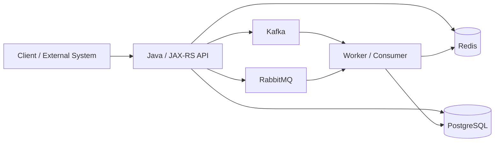
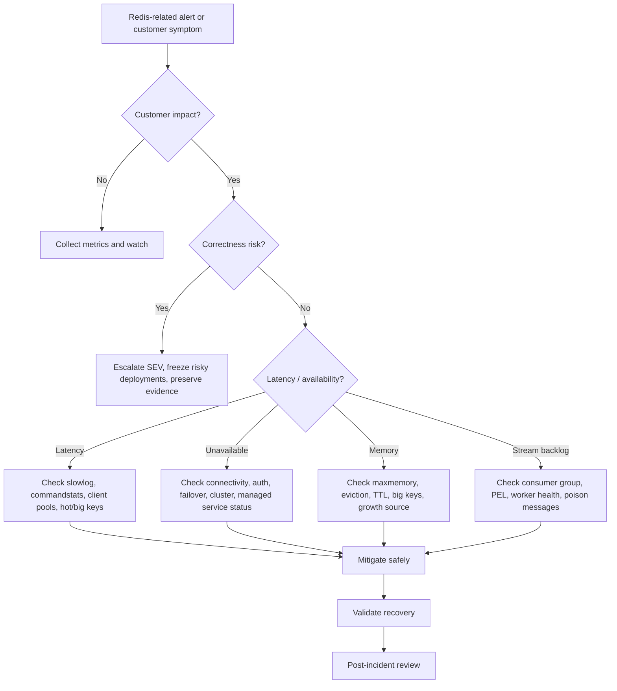

# Part 053 — Redis Operational Runbook

Redis incidents are rarely isolated Redis problems.

A Redis latency spike may become a JAX-RS thread pool incident.

A low cache hit ratio may become a PostgreSQL saturation incident.

A hot key may become a Redis Cluster slot hotspot.

A rate limiter bug may become a customer-facing availability issue.

A stuck distributed lock may freeze order processing.

A stream pending-entry backlog may silently delay asynchronous work.

This part is a production-oriented runbook for Redis incidents in enterprise Java/JAX-RS systems.

The goal is not to memorize commands.

The goal is to respond safely, quickly, and correctly.

---

## 1. Runbook Mental Model

A Redis runbook should answer five questions:

1. What customer or system behavior is degraded?
2. Is Redis the root cause, a victim, or only a symptom amplifier?
3. What data is safe to inspect in production?
4. What mitigation reduces impact without corrupting correctness?
5. What evidence must be captured before and after recovery?

Redis is often in the middle of several system paths:



During an incident, do not ask only:

> Is Redis healthy?

Ask:

> Which Redis-dependent path is violating its latency, correctness, availability, or security expectation?

---

## 2. Production Safety Rules

Before running any command or mitigation, classify it.

| Action | Production Risk | Rule |
|---|---:|---|
| `INFO` | Low | Safe if access is authorized |
| `SLOWLOG GET` | Low | Safe for diagnosis |
| `LATENCY DOCTOR` | Low | Safe for diagnosis |
| `CLIENT LIST` | Medium | May expose client metadata; handle carefully |
| `MEMORY STATS` | Low | Safe for diagnosis |
| `SCAN` with low count | Low/Medium | Use carefully; never assume it is free |
| `KEYS *` | High | Avoid in production |
| `MONITOR` | High | Avoid unless SRE explicitly approves |
| `FLUSHALL` / `FLUSHDB` | Critical | Never run during normal incident response |
| Mass `DEL` | High | Must be scoped, reviewed, and rate-limited |
| Changing eviction policy | High | Requires platform/SRE approval |
| Restarting Redis | Critical | Requires HA/failover understanding |
| Manual failover | Critical | Requires SRE/platform coordination |

Operational principle:

> Debugging must not create a larger incident than the original incident.

---

## 3. Incident Intake Packet

Every Redis incident should start by collecting a small evidence packet.

Do not start with random commands.

Start with a structured packet:

| Evidence | Example Question |
|---|---|
| Time window | When did symptoms start? |
| Impacted service | Which Java/JAX-RS service is degraded? |
| Impacted endpoint | Which API, job, worker, or consumer is affected? |
| Redis role | Cache, limiter, lock, stream, session, token store, queue? |
| Deployment mode | Standalone, Sentinel, Cluster, managed service? |
| Error symptoms | Timeout, MOVED, auth failure, stale data, 429, memory pressure? |
| Recent changes | Deployment, config, TTL, Redis script, topology, secret rotation? |
| Customer impact | Latency, errors, throttling, duplicate processing, stale quote/order data? |
| Blast radius | Single tenant, single service, all tenants, one region, one shard? |

Minimal commands or metrics to capture:

```bash
INFO server
INFO clients
INFO memory
INFO stats
INFO commandstats
INFO keyspace
INFO replication
SLOWLOG GET 20
LATENCY DOCTOR
CLIENT LIST
```

For Redis Streams:

```bash
XINFO STREAM <stream-key>
XINFO GROUPS <stream-key>
XPENDING <stream-key> <group-name>
```

For Cluster:

```bash
CLUSTER INFO
CLUSTER NODES
CLUSTER SLOTS
```

Internal rule:

> Prefer dashboard snapshots and read-only diagnostics before mutation.

---

## 4. Severity Model

Redis incidents should be classified by customer impact and correctness risk.

| Severity | Redis Symptom | Example Impact |
|---|---|---|
| SEV-1 | Redis unavailable for critical path | Checkout/order submission/auth/session broken |
| SEV-1 | Lock/idempotency correctness broken | Duplicate order or inconsistent mutation possible |
| SEV-2 | High latency on Redis-dependent APIs | API p95/p99 breach, thread pool pressure |
| SEV-2 | Memory pressure with eviction | Cache correctness or session/token loss risk |
| SEV-2 | Stream backlog growing | Async processing delayed materially |
| SEV-3 | Low cache hit ratio | PostgreSQL load increasing but contained |
| SEV-3 | Single hot key | Localized latency or slot hotspot |
| SEV-4 | Non-critical dashboard alert | No current user impact |

Severity should consider correctness, not only availability.

A Redis issue that creates stale quote rules, duplicate order commands, or broken idempotency can be worse than a pure latency issue.

---

## 5. Triage Decision Tree



---

# Runbook 1 — High Latency

## Symptom

Common signals:

- Redis command latency p95/p99 increased.
- Java/JAX-RS API latency increased.
- Redis client timeout exceptions increased.
- JAX-RS worker threads are blocked waiting for Redis.
- Circuit breaker opens for Redis dependency.
- Managed Redis dashboard shows CPU, network, or engine latency spike.

## First Questions

1. Is latency server-side, client-side, network-side, or downstream amplification?
2. Is the issue global or limited to one command/key/service/tenant?
3. Are slow commands visible in `SLOWLOG`?
4. Is there a hot key or big key?
5. Did connection count or request rate change recently?

## Evidence to Collect

```bash
INFO stats
INFO commandstats
INFO clients
INFO memory
SLOWLOG GET 50
LATENCY DOCTOR
LATENCY LATEST
CLIENT LIST
```

Client-side evidence:

- Redis client command latency histogram.
- Java thread pool metrics.
- Connection pool active/idle/waiting counts.
- Timeout/retry count.
- Circuit breaker state.
- JAX-RS endpoint latency by route.

## Likely Causes

| Cause | Evidence |
|---|---|
| Slow command | `SLOWLOG`, commandstats outlier |
| Big key access | high network bytes, memory usage, large payload |
| Hot key | high QPS concentrated on one key or slot |
| Connection storm | connected clients spike |
| Client pool exhaustion | Java pool wait time increases |
| Network issue | RTT increases without server CPU increase |
| CPU-bound Redis | command rate or expensive operations spike |
| Blocking command misuse | blocked clients increase |
| Lua script too slow | slowlog shows `EVAL`/`FCALL` |
| Persistence/AOF pressure | latency spikes correlate with fsync/rewrite |

## Immediate Mitigations

Use the least invasive mitigation first:

1. Reduce traffic to expensive path if possible.
2. Enable fallback or stale cache response if designed.
3. Temporarily disable non-critical Redis-dependent features.
4. Scale Java service carefully only if Redis can handle more connections.
5. Reduce retry amplification.
6. Rate-limit cache reloads.
7. Coordinate with SRE before failover/restart.

Avoid:

- increasing client timeout blindly;
- scaling application pods blindly;
- running `KEYS *` to search for problematic keys;
- deleting broad keyspaces without ownership validation.

## Java/JAX-RS Impact

High Redis latency can consume request worker threads.

If Redis calls are synchronous inside request handling, one slow Redis operation can hold the JAX-RS thread until timeout.

Check:

- request timeout vs Redis command timeout;
- connection pool wait time;
- retry policy;
- fallback path;
- circuit breaker configuration;
- bulkhead isolation.

## PostgreSQL Impact

If Redis is cache-aside, Redis latency or cache miss spike may increase PostgreSQL reads.

Check:

- DB QPS;
- slow SQL;
- connection pool saturation;
- cache miss rate;
- stampede signals.

## Kafka/RabbitMQ Impact

If consumers update Redis projections or invalidations, Redis latency can delay event processing.

Check:

- consumer lag;
- retry count;
- DLQ movement;
- consumer processing time;
- Redis errors in consumer logs.

## Recovery Validation

The incident is not recovered only because Redis CPU drops.

Validate:

- API p95/p99 returns to baseline;
- Redis command latency returns to baseline;
- client timeouts stop;
- connection pool wait time normalizes;
- PostgreSQL load normalizes;
- stream/consumer backlog drains;
- no correctness compensation remains pending.

---

# Runbook 2 — Low Cache Hit Ratio

## Symptom

Signals:

- cache hit ratio drops suddenly;
- Redis `keyspace_hits` decreases relative to `keyspace_misses`;
- PostgreSQL read QPS increases;
- API latency increases;
- cache fill rate spikes;
- specific endpoint becomes DB-heavy.

## First Questions

1. Did key naming change?
2. Did TTL change?
3. Did serialization/version prefix change?
4. Did a deployment invalidate or bypass cache?
5. Did the cached entity distribution shift?
6. Did Redis evict keys?

## Evidence

```bash
INFO stats
INFO keyspace
INFO memory
INFO commandstats
```

Application metrics:

- cache hit/miss by cache name;
- cache hit/miss by endpoint;
- cache fill count;
- cache fill latency;
- DB fallback count;
- negative cache hit/miss.

## Likely Causes

| Cause | Example |
|---|---|
| Key version changed | `v2` key generated but old `v1` still populated |
| Tenant prefix mismatch | service reads different tenant key than writer |
| TTL too short | keys expire before reuse |
| Cache bypass | feature flag disables read path |
| Eviction | Redis removes keys under memory pressure |
| Serialization error | fill fails, cache remains empty |
| Invalidation storm | events delete too broadly |
| Cold deployment | new environment starts with empty cache |

## Mitigations

- Stop broad invalidation if it is still running.
- Increase TTL only if freshness requirement allows it.
- Enable cache warming for known hot data.
- Add stale-while-revalidate if available.
- Reduce database load with temporary request throttling.
- Roll back key naming/version changes if unsafe.

## Correctness Warning

Do not raise hit ratio by caching data that has no clear invalidation or TTL policy.

A high hit ratio with stale data is not success.

## Internal Verification Checklist

- Verify cache key construction before and after deployment.
- Verify TTL policy and actual TTL distribution.
- Verify invalidation event volume.
- Verify eviction count.
- Verify PostgreSQL impact.
- Verify whether cache hit ratio is measured per cache, not only globally.

---

# Runbook 3 — Memory Pressure

## Symptom

Signals:

- used memory approaches maxmemory;
- RSS grows faster than logical used memory;
- fragmentation ratio increases;
- eviction starts or accelerates;
- Redis returns OOM errors under `noeviction`;
- managed service emits memory utilization alarms.

## Evidence

```bash
INFO memory
INFO stats
MEMORY STATS
INFO keyspace
```

If safe and approved:

```bash
MEMORY USAGE <key> SAMPLES 5
SCAN 0 COUNT 100 TYPE <type>
```

## Likely Causes

| Cause | Evidence |
|---|---|
| Missing TTL | persistent key count grows |
| TTL too long | old entries remain beyond useful lifetime |
| Big keys | memory concentrated in few keys |
| Stream retention too high | stream length grows |
| Rate limiter key leak | per-IP/user keys not expiring |
| Idempotency keys too long-lived | duplicate protection window oversized |
| Session/token store growth | expired sessions not cleaned as expected |
| Fragmentation | RSS much higher than used memory |
| Eviction policy mismatch | volatile policy but keys lack TTL |

## Immediate Mitigations

- Identify whether eviction is acceptable for this Redis use case.
- Stop traffic or job causing unbounded growth.
- Reduce non-critical cache fill volume.
- Apply targeted cleanup only with key ownership approval.
- Increase memory only if growth source is understood.
- For streams, trim according to retention policy.
- For rate limiter/idempotency, fix TTL leak before scaling memory.

## Do Not

- Run broad deletes without ownership.
- Change eviction policy without understanding data classes.
- Treat memory scaling as the only fix.
- Ignore privacy retention risk for long-lived keys.

## Internal Verification Checklist

- Verify maxmemory and eviction policy.
- Verify top key families by memory.
- Verify key TTL distribution.
- Verify stream lengths and retention.
- Verify application deployment that introduced new key families.
- Verify whether memory growth is expected seasonal/customer load or a leak-like pattern.

---

# Runbook 4 — Eviction Spike

## Symptom

Signals:

- `evicted_keys` increases quickly;
- cache hit ratio drops;
- session/token/idempotency keys disappear unexpectedly;
- Redis memory near maxmemory;
- API behavior becomes inconsistent.

## Evidence

```bash
INFO stats
INFO memory
INFO keyspace
CONFIG GET maxmemory-policy
```

## Key Questions

1. Which eviction policy is active?
2. Are evicted keys cache-only, or do they include correctness-sensitive state?
3. Do all volatile keys have TTL?
4. Is Redis storing mixed data classes with different eviction tolerance?

## Eviction Policy Risk

| Policy | Operational Risk |
|---|---|
| `noeviction` | writes fail under memory pressure |
| `allkeys-lru` | any key may be evicted, including coordination/session if mixed |
| `volatile-lru` | only keys with TTL are eligible; non-TTL keys may crowd memory |
| `allkeys-lfu` | useful for cache, dangerous for mixed correctness state |
| `volatile-ttl` | keys closer to expiry are evicted first |

## Mitigations

- Confirm whether Redis instance mixes cache and correctness-sensitive state.
- Stop or throttle write-heavy cache fill.
- Apply targeted cleanup for unowned or runaway keys.
- Separate data classes if eviction semantics conflict.
- Increase memory only after validating key growth.

## Internal Verification Checklist

- Verify eviction policy per environment.
- Verify whether sessions, locks, idempotency, and cache share one Redis instance.
- Verify alert threshold for evictions.
- Verify key families affected by eviction.
- Verify post-eviction customer impact.

---

# Runbook 5 — Expired Key Spike

## Symptom

Signals:

- `expired_keys` increases suddenly;
- cache miss spike occurs at predictable time;
- many keys disappear together;
- PostgreSQL load spikes after synchronized expiry;
- rate limiter/idempotency behavior changes unexpectedly.

## Likely Causes

- TTLs set uniformly without jitter.
- Deployment warmed many keys at the same time.
- Batch job created expiring keys in bursts.
- Tenant-wide invalidation recreated keys simultaneously.
- Session or token TTL policy changed.

## Evidence

```bash
INFO stats
INFO keyspace
```

Application metrics:

- cache fill rate;
- DB fallback QPS;
- key creation rate by cache name;
- endpoint latency;
- invalidation event rate.

## Mitigations

- Add TTL jitter for cache keys.
- Use staggered cache warming.
- Apply single-flight or stale-while-revalidate.
- Rate-limit reload path.
- Avoid massive synchronized key creation.

## Internal Verification Checklist

- Verify TTL generation code.
- Verify whether jitter exists.
- Verify warmup job schedules.
- Verify invalidation event bursts.
- Verify DB protection mechanism during expiry bursts.

---

# Runbook 6 — Big Key Incident

## Symptom

Signals:

- latency spike on specific command;
- network egress spike;
- Redis CPU spike when reading/deleting a key;
- Java deserialization latency spikes;
- memory concentrated in few keys;
- blocking delete causes latency.

## Risky Big Key Types

| Type | Risk |
|---|---|
| String | large payload transfer and deserialization |
| Hash | large `HGETALL`, large field count |
| Set | expensive `SMEMBERS`, high memory |
| Sorted set | expensive range queries and cleanup |
| List | large blocking or trimming cost |
| Stream | retention growth, PEL complexity |

## Evidence

Use production-safe methods:

```bash
SCAN 0 COUNT 100 TYPE string
MEMORY USAGE <key> SAMPLES 5
TYPE <key>
HLEN <key>
SCARD <key>
ZCARD <key>
LLEN <key>
XLEN <key>
```

Avoid broad `KEYS` and unbounded full reads.

## Mitigations

- Stop full-read path such as `HGETALL`, `SMEMBERS`, large `ZRANGE`.
- Replace full read with pagination or `SCAN` variants.
- Split key by tenant/entity/page/time bucket.
- Compress only if CPU trade-off is acceptable.
- Use `UNLINK` instead of `DEL` for large key deletion where supported and approved.
- Add size guardrails in write path.

## Internal Verification Checklist

- Verify key owner.
- Verify why the key became large.
- Verify command accessing the key.
- Verify Java payload size/deserialization impact.
- Verify key splitting design.
- Verify alert for large key growth.

---

# Runbook 7 — Hot Key Incident

## Symptom

Signals:

- one key receives disproportionate traffic;
- one Redis Cluster slot becomes hot;
- Redis CPU rises while memory is stable;
- API latency correlates with one cache entity/config/rule;
- one tenant or endpoint dominates access.

## Likely Causes

- global configuration key read on every request;
- popular catalog/rule cache entry;
- tenant-wide key for large tenant;
- rate limiter global counter;
- lock key contended by many workers;
- feature flag/config key without local cache.

## Evidence

Sources:

- application metrics by cache key family, not raw PII key;
- client-side command rate;
- Redis commandstats;
- cluster slot metrics;
- managed Redis hot key tooling if available.

## Mitigations

- Add local in-process cache with short TTL for read-heavy immutable data.
- Split key by shard/bucket if aggregation allows it.
- Use request coalescing.
- Avoid global lock/counter if per-tenant or per-resource scope is sufficient.
- Cache hot config in memory with invalidation or short TTL.

## Correctness Warning

Local cache reduces Redis load but introduces staleness.

Define safe stale window before adding local cache.

## Internal Verification Checklist

- Verify hot key family and owner.
- Verify whether key contains tenant/global scope.
- Verify if local cache is allowed.
- Verify invalidation path for local cache.
- Verify cluster slot impact.

---

# Runbook 8 — Connection Storm

## Symptom

Signals:

- connected clients spike;
- rejected connections increase;
- Java pods restarted or scaled;
- Redis CPU/network rises;
- connection pool errors appear;
- managed Redis max connection alarm fires.

## Common Causes

- Kubernetes rolling deployment creates many new pods at once.
- Redis client creates one pool per component/tenant instead of per service.
- Client reconnect loop after transient network failure.
- Aggressive retry policy.
- Liveness probe restarts pods repeatedly.
- Serverless/burst workloads create short-lived connections.

## Evidence

```bash
INFO clients
CLIENT LIST
```

Kubernetes evidence:

```bash
kubectl get pods
kubectl describe deploy <service>
kubectl rollout history deploy <service>
```

Application metrics:

- connections per pod;
- pool size;
- reconnect count;
- retry count;
- pod restart count.

## Mitigations

- Pause rollout if active.
- Reduce max surge.
- Cap connection pool per pod.
- Disable aggressive reconnect/retry storm.
- Add jittered reconnect backoff.
- Scale application carefully.
- Coordinate with platform before changing Redis maxclients.

## Internal Verification Checklist

- Verify pool size per pod and total pods.
- Verify maxclients.
- Verify deployment strategy.
- Verify reconnect backoff.
- Verify DNS/service discovery behavior.

---

# Runbook 9 — Blocked Clients

## Symptom

Signals:

- `blocked_clients` increases;
- commands hang;
- queue consumers wait on blocking commands;
- Redis latency dashboard may show application wait rather than server slowness.

## Evidence

```bash
INFO clients
CLIENT LIST
```

Check for blocking commands:

- `BLPOP`
- `BRPOP`
- `BLMOVE`
- `XREAD BLOCK`
- `XREADGROUP BLOCK`

## Interpretation

Blocked clients are not always bad.

Queue workers may intentionally block while waiting for work.

The incident condition is:

- blocked clients grow unexpectedly;
- worker pool becomes exhausted;
- blocked commands use wrong timeout;
- blocked clients prevent shutdown;
- blocked consumers cannot be interrupted safely.

## Mitigations

- Verify whether blocked clients are expected consumers.
- Ensure blocking commands use finite timeout where shutdown matters.
- Separate queue consumer connections from request-path cache connections.
- Avoid using request threads for blocking queue consumption.

## Internal Verification Checklist

- Verify blocking command usage.
- Verify dedicated connection/pool for blocking consumers.
- Verify graceful shutdown behavior.
- Verify worker thread model.
- Verify queue backlog and consumer health.

---

# Runbook 10 — Slowlog Spike

## Symptom

Signals:

- `SLOWLOG LEN` increases;
- specific commands appear repeatedly;
- Redis CPU or latency increases;
- endpoint or worker path degrades.

## Evidence

```bash
SLOWLOG LEN
SLOWLOG GET 50
INFO commandstats
```

Look for:

- `EVAL` / `FCALL`;
- large range queries;
- full collection reads;
- large deletes;
- expensive set/sorted-set operations;
- misuse of `KEYS` or broad scan patterns.

## Mitigations

- Disable or roll back offending code path.
- Add command limits or pagination.
- Replace full reads with incremental reads.
- Split large keys.
- Optimize Lua script.
- Add guardrails in Redis wrapper.

## Internal Verification Checklist

- Verify slow command source service.
- Verify recent PR introducing command.
- Verify command input cardinality.
- Verify whether command is inside request path.
- Verify regression test for command complexity.

---

# Runbook 11 — Replication Lag

## Symptom

Signals:

- replica lag increases;
- read replica returns stale data;
- failover risk increases;
- managed Redis replication alarms fire.

## Evidence

```bash
INFO replication
```

Check:

- primary/replica role;
- replication offset;
- connected replicas;
- lag metrics;
- network issues;
- write volume spike.

## Impact

Replication lag matters when:

- Java clients read from replicas;
- failover may promote stale replica;
- Redis Streams/queues rely on durability expectations;
- session/security state is replicated asynchronously.

## Mitigations

- Stop non-critical high-volume writes.
- Avoid replica reads for correctness-sensitive paths.
- Coordinate with SRE before failover.
- Validate network/storage pressure.
- Review persistence/rewrite pressure.

## Internal Verification Checklist

- Verify whether app reads from replicas.
- Verify client read preference.
- Verify failover policy.
- Verify write volume source.
- Verify correctness risk if stale replica promoted.

---

# Runbook 12 — Failover Event

## Symptom

Signals:

- Redis primary changes;
- Java clients reconnect;
- transient write failures;
- `MOVED`, `READONLY`, timeout, or connection reset errors;
- managed Redis failover event appears.

## Immediate Questions

1. Was failover automatic or manual?
2. Did clients reconnect correctly?
3. Were writes lost during async replication window?
4. Did idempotency/lock/session state survive as expected?
5. Are streams/queues consistent enough for recovery?

## Evidence

```bash
INFO replication
INFO server
INFO clients
```

Application evidence:

- Redis command errors by type;
- reconnect count;
- failed writes;
- duplicate retries;
- lock/idempotency anomalies;
- consumer retries.

## Mitigations

- Allow cluster/sentinel-aware clients to reconnect.
- Reduce retries if they amplify load.
- Validate critical state after failover.
- Re-drive idempotent jobs/events if needed.
- Escalate if clients are pinned to old primary.

## Internal Verification Checklist

- Verify failover timeline.
- Verify client topology awareness.
- Verify write loss window.
- Verify idempotency/lock/session impact.
- Verify post-failover dashboards.

---

# Runbook 13 — Cluster Slot Issue

## Symptom

Signals:

- `MOVED` or `ASK` errors leak to application logs;
- `CROSSSLOT` errors;
- one slot or shard overloaded;
- resharding causes client instability;
- multi-key command fails.

## Evidence

```bash
CLUSTER INFO
CLUSTER NODES
CLUSTER SLOTS
```

Application evidence:

- client cluster mode enabled/disabled;
- command errors;
- key patterns causing cross-slot;
- hash tag usage.

## Common Causes

- Non-cluster-aware client.
- Multi-key command across different slots.
- Lua script touches keys in different slots.
- Transaction uses cross-slot keys.
- Hot key creates hot slot.
- Resharding not handled by client.

## Mitigations

- Fix client cluster awareness.
- Use hash tags only when related keys must co-locate.
- Avoid cross-slot multi-key operations.
- Split hot key carefully.
- Coordinate resharding with SRE/platform.

## Internal Verification Checklist

- Verify cluster mode.
- Verify client cluster config.
- Verify key hash tag policy.
- Verify cross-slot commands.
- Verify hot slot metrics.

---

# Runbook 14 — Rate Limiter Incident

## Symptom

Too strict:

- legitimate customers receive excessive 429;
- specific tenant/IP/user blocked unexpectedly;
- Retry-After values unreasonable.

Too loose:

- abusive traffic passes through;
- downstream service or PostgreSQL overloaded;
- limiter keys missing or TTL broken.

## Evidence

- rate limiter allow/deny metrics;
- limiter key cardinality;
- Redis latency for limiter script;
- 429 count by tenant/endpoint;
- Retry-After values;
- Lua script errors;
- clock skew indicators if app time is used.

## Mitigations

Too strict:

- identify affected limiter dimension;
- apply scoped temporary override if policy allows;
- roll back config change;
- verify tenant-specific quota.

Too loose:

- tighten gateway or upstream limit temporarily;
- verify limiter Redis writes succeed;
- verify TTL on limiter keys;
- check memory growth and cleanup.

## Correctness Warning

Rate limiter changes are product/security decisions as much as technical decisions.

Do not silently change tenant limits without approval.

## Internal Verification Checklist

- Verify limiter algorithm.
- Verify Lua atomicity.
- Verify key scope: user, tenant, endpoint, IP.
- Verify config source and recent changes.
- Verify alert for limiter allow/deny anomaly.

---

# Runbook 15 — Stuck Distributed Lock

## Symptom

Signals:

- job or scheduler stops progressing;
- one tenant/entity remains blocked;
- lock key exists longer than expected;
- workers report lock acquisition failure;
- manual retry does not proceed.

## Evidence

```bash
TTL <lock-key>
PTTL <lock-key>
GET <lock-key>
```

Application evidence:

- lock acquisition count;
- lock release count;
- lock timeout count;
- owner value correlation;
- worker crash/restart logs;
- GC pause logs;
- watchdog renewal logs if Redisson is used.

## Mitigations

- Do not delete lock until owner and protected operation are understood.
- Verify whether critical section is still running.
- Verify lock value/owner.
- If safe, remove lock through approved operational procedure.
- Use fencing token or DB-side guard for future correctness.

## Dangerous Assumption

A lock key existing does not always mean a process is alive.

A lock key missing does not always mean it is safe to execute the critical section.

## Internal Verification Checklist

- Verify lock key pattern.
- Verify unique lock value.
- Verify safe unlock script.
- Verify lease and renewal policy.
- Verify protected resource and fencing token requirement.

---

# Runbook 16 — Redis Outage

## Symptom

Signals:

- connection refused/timeouts;
- all Redis commands fail;
- service startup fails due to Redis dependency;
- sessions/tokens/rate limiter/cache unavailable;
- managed Redis outage or network partition.

## First Decision

Classify Redis dependency:

| Use Case | Can Service Degrade? | Typical Response |
|---|---:|---|
| Non-critical cache | Yes | bypass cache, read DB, protect DB |
| Critical session store | Usually no | fail closed or redirect auth flow |
| Rate limiter | Depends | fail open or fail closed by policy |
| Idempotency store | Risky | fail closed for mutation APIs if correctness critical |
| Distributed lock | Depends | pause protected jobs |
| Stream/job queue | Usually degrade | stop producers or buffer elsewhere |
| Feature flag/config cache | Depends | use safe defaults |

## Mitigations

- Activate fallback mode if designed.
- Disable non-critical Redis features.
- Reduce request rate to DB fallback path.
- Pause background jobs that require Redis locks/queues.
- Fail closed for correctness-sensitive mutation paths if required.
- Coordinate with SRE/platform/cloud provider for recovery.

## Validation

After Redis returns:

- verify clients reconnect;
- verify stale connections are gone;
- verify cache warmup does not stampede DB;
- verify idempotency and lock state;
- verify streams/queues/backlogs;
- verify sessions/tokens behavior;
- verify alert recovery.

## Internal Verification Checklist

- Verify fallback policy per Redis use case.
- Verify whether startup hard-depends on Redis.
- Verify circuit breaker behavior.
- Verify DB protection during cache outage.
- Verify customer communication requirements.

---

## 17. Customer Impact Checklist

For any Redis incident, answer these before closing:

- Were users unable to submit quotes/orders?
- Were users served stale catalog/pricing/rule data?
- Were duplicate requests processed?
- Were legitimate users rate-limited incorrectly?
- Were abusive users allowed through?
- Were sessions or tokens invalidated unexpectedly?
- Were background jobs delayed or duplicated?
- Were Kafka/RabbitMQ consumers delayed?
- Was PostgreSQL overloaded by cache miss fallback?
- Was sensitive data exposed through logs, keys, snapshots, or debug commands?

---

## 18. Post-Incident Review Template

Use this structure:

```md
# Redis Incident Review

## Summary

## Timeline

## Customer Impact

## Redis Use Case Involved

## Primary Trigger

## Contributing Factors

## Detection

## Mitigation

## Recovery Validation

## Correctness Review

## Security / Privacy Review

## What Worked

## What Failed

## Action Items

## Owners and Due Dates
```

Action items should be concrete:

- add metric;
- add alert;
- add test;
- split key;
- fix TTL;
- change client timeout;
- add circuit breaker;
- write runbook;
- add PR checklist;
- document Redis ownership.

---

## 19. Internal Verification Checklist

Use this checklist against the internal codebase and platform setup.

### Redis Usage Inventory

- Which services use Redis?
- Which Redis deployment does each service use?
- What role does Redis play: cache, limiter, lock, idempotency, queue, stream, session, token, config?
- Which use cases are correctness-sensitive?
- Which use cases are cache-only?

### Client Configuration

- Which Java client is used?
- What are command timeout, socket timeout, retry, reconnect, and pool settings?
- Are blocking commands isolated from request-path commands?
- Are clients Sentinel/Cluster-aware where required?
- Are client metrics exported?

### Observability

- Is Redis dashboard available?
- Are hit/miss, latency, memory, eviction, slowlog, client, replication, and stream metrics visible?
- Are alerts actionable?
- Are alerts mapped to owners?
- Are dashboards linked from runbooks?

### Operational Ownership

- Who owns Redis infrastructure?
- Who owns application keyspace?
- Who approves dangerous commands?
- Who approves failover/restart?
- Who owns post-incident action items?

### Incident History

- Have there been Redis latency incidents?
- Have there been eviction incidents?
- Have there been cache stale incidents?
- Have there been rate limiter/idempotency/lock incidents?
- Are incident notes searchable?

---

## 20. Senior Engineer Review Questions

Ask these during operational reviews:

1. What happens if Redis is unavailable for 5 minutes?
2. What happens if Redis is slow but not down?
3. What happens if Redis evicts this key?
4. What happens if this key expires for all tenants at once?
5. What happens if failover loses the last few writes?
6. What happens if a lock expires while the worker is still running?
7. What happens if a rate limiter script fails open or closed?
8. What happens if stream pending entries grow forever?
9. What happens if cache invalidation events are delayed or duplicated?
10. What metric proves the system is healthy?

---

## 21. Practical Exercises

1. Pick one Redis-backed cache and write a mini runbook for low hit ratio.
2. Pick one Redis lock and identify the protected resource, lease, owner value, and safe unlock path.
3. Pick one Redis Stream or queue and document retry, poison message, and backlog behavior.
4. Pick one rate limiter and document whether it fails open or closed.
5. Pick one Redis dashboard and map each alert to an action.

---

## 22. Summary

A Redis operational runbook must be failure-oriented.

The most important operational distinction is not whether Redis is up or down.

The important distinction is what Redis is responsible for in that path:

- cache performance;
- stale data control;
- idempotency correctness;
- lock coordination;
- rate limiting policy;
- stream/job progress;
- session/token security;
- configuration safety.

Senior engineers should make Redis incidents boring by ensuring every Redis use case has:

- clear ownership;
- clear fallback behavior;
- clear metrics;
- clear alert thresholds;
- clear production-safe commands;
- clear escalation path;
- clear correctness boundary;
- clear post-incident action loop.
