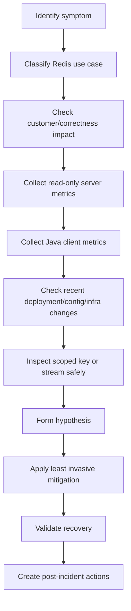

# Part 054 — Redis Troubleshooting Playbook

A runbook starts from an alert.

A troubleshooting playbook starts from a symptom.

Examples:

- "The key is missing."
- "The cache is stale."
- "Users are getting 429 too often."
- "Duplicate orders were processed."
- "The lock never releases."
- "The stream consumer is stuck."
- "Redis returns `MOVED`."
- "Redis is slow."
- "Memory keeps growing."

This part is symptom-driven.

For each symptom, the playbook gives:

- what the symptom usually means;
- what to check first;
- safe diagnostic commands;
- Java/JAX-RS considerations;
- PostgreSQL/MyBatis/JDBC considerations;
- Kafka/RabbitMQ considerations;
- Kubernetes/cloud/on-prem considerations;
- likely root causes;
- safe mitigations;
- internal verification checklist.

---

## 1. Troubleshooting Principles

Redis debugging must preserve correctness.

Follow these principles:

1. Inspect before mutating.
2. Prefer scoped evidence over broad keyspace scans.
3. Do not assume Redis is the source of truth.
4. Do not delete unknown keys.
5. Do not hide correctness issues by increasing TTL or timeout blindly.
6. Always connect Redis symptoms to application behavior.
7. Treat Redis client metrics as first-class evidence.
8. Validate both server-side and client-side latency.
9. Separate cache-only failures from correctness-sensitive failures.
10. Preserve evidence before mitigation when customer correctness is at risk.

---

## 2. Production-Safe Diagnostic Toolbox

| Need | Safer Commands / Evidence | Avoid |
|---|---|---|
| Server overview | `INFO` sections | changing config blindly |
| Slow commands | `SLOWLOG GET`, `INFO commandstats` | `MONITOR` without approval |
| Latency | `LATENCY DOCTOR`, client histograms | assuming server latency only |
| Memory | `INFO memory`, `MEMORY STATS` | mass delete before ownership check |
| Key type | `TYPE <key>` | full collection reads |
| Key TTL | `TTL`, `PTTL` | changing TTL without owner approval |
| Key size | `MEMORY USAGE`, `HLEN`, `SCARD`, `ZCARD`, `LLEN`, `XLEN` | `SMEMBERS`/`HGETALL` on unknown large keys |
| Stream state | `XINFO`, `XPENDING` | deleting stream entries blindly |
| Clients | `INFO clients`, `CLIENT LIST` | killing clients without owner validation |
| Cluster | `CLUSTER INFO`, `CLUSTER SLOTS` | manual resharding without SRE |

A safe Redis troubleshooting session usually starts with:

```bash
INFO server
INFO clients
INFO memory
INFO stats
INFO commandstats
INFO keyspace
SLOWLOG GET 20
LATENCY DOCTOR
```

For a specific key:

```bash
TYPE <key>
TTL <key>
PTTL <key>
MEMORY USAGE <key> SAMPLES 5
```

Use type-specific cardinality commands instead of full reads:

```bash
HLEN <key>
SCARD <key>
ZCARD <key>
LLEN <key>
XLEN <key>
```

---

## 3. Symptom Matrix

| Symptom | Common Root Area |
|---|---|
| Key missing unexpectedly | TTL, eviction, invalidation, wrong key, wrong DB/cluster, serialization failure |
| Key not expiring | missing TTL, overwritten key without expiry, persistent key, wrong command semantics |
| Cache stale | invalidation failure, version mismatch, event lag, local cache, TTL too long |
| Cache stampede | synchronized expiry, hot key, no single-flight, DB fallback overload |
| Rate limiter too strict | wrong key scope, bad config, clock issue, stale limiter state, script bug |
| Rate limiter too loose | missing TTL, non-atomic increment, failed Redis write, fail-open policy |
| Duplicate idempotent request processed | idempotency key missing, TTL expired, race, Redis/DB failure window |
| Lock not released | worker crash, unsafe unlock, watchdog issue, lease mismatch |
| Lock expired too early | lease too short, GC pause, long critical section, clock assumptions |
| Stream consumer stuck | worker down, PEL growth, poison message, no claim/retry |
| Pending entries growing | missing XACK, failed worker, claim not running, slow processing |
| Pub/Sub message lost | subscriber offline, network disconnect, no durability/replay |
| Connection timeout | Redis slow, network, pool exhaustion, DNS, failover, cluster issue |
| Authentication failure | secret rotation, ACL change, wrong user, TLS mismatch |
| MOVED/ASK issue | cluster redirection/client config/resharding |
| CROSSSLOT error | multi-key command across slots, missing hash tag |
| Slow command | big key, expensive range, Lua, blocking command, CPU pressure |
| High memory | TTL leak, big key, stream retention, limiter/idempotency key growth |
| Eviction problem | maxmemory reached, wrong policy, mixed data classes |

---

# Playbook 1 — Key Missing Unexpectedly

## What It Means

A missing key can be normal or dangerous.

Normal:

- cache key expired;
- key evicted under acceptable cache policy;
- cache was cold;
- key was invalidated after source-of-truth update.

Dangerous:

- session/token key disappeared;
- idempotency key disappeared during retry window;
- lock key disappeared while critical section still running;
- rate limiter key disappeared early;
- config key missing and service uses unsafe default.

## Check First

1. Is the key name exactly correct?
2. Is the environment/service/tenant/version prefix correct?
3. Is the Redis logical database or cluster endpoint correct?
4. Was TTL expected?
5. Was eviction happening?
6. Was invalidation triggered?
7. Did deployment change key construction?

## Safe Commands

```bash
EXISTS <key>
TYPE <key>
TTL <key>
PTTL <key>
INFO stats
INFO memory
INFO keyspace
```

If the key is gone, `TTL` returns information only if it still exists, so use metrics and logs for history.

## Java/JAX-RS Checks

- Verify key builder code.
- Verify tenant/context propagation.
- Verify version prefix.
- Verify serializer did not fail before write.
- Verify Redis write result is checked.
- Verify fallback path after miss.

## PostgreSQL/MyBatis/JDBC Checks

- If cache miss falls back to DB, verify query latency and row existence.
- Verify transaction commit happened before cache fill/invalidation.
- Verify deleted DB records are not expected to have cache keys.

## Kafka/RabbitMQ Checks

- Verify invalidation event did not delete key unexpectedly.
- Verify duplicate/out-of-order event did not invalidate newer data.
- Verify consumer did not process tenant-wide invalidation incorrectly.

## Kubernetes/Cloud/On-Prem Checks

- Verify app points to correct Redis endpoint.
- Verify secret/config map was not changed.
- Verify failover did not point client to another topology incorrectly.
- Verify managed Redis eviction/memory alarm.

## Likely Root Causes

- TTL expired normally.
- TTL too short.
- Eviction under memory pressure.
- Wrong key prefix/version.
- Wrong tenant context.
- Cache invalidation too broad.
- Redis write failed silently.
- Serializer failed.
- Deployment changed key format.
- Read from different Redis deployment.

## Safe Mitigations

- Rebuild key only from source of truth.
- Fix key construction bug.
- Restore TTL policy.
- Stop broad invalidation.
- Warm cache gradually.
- Separate correctness-sensitive state from evictable cache.

## Internal Verification Checklist

- Check key naming standard.
- Check TTL policy.
- Check eviction count.
- Check invalidation logs.
- Check deployment diff.
- Check Redis endpoint/config used by service.

---

# Playbook 2 — Key Not Expiring

## What It Means

A key that does not expire can create:

- stale cache;
- privacy retention violation;
- memory leak-like growth;
- stale idempotency state;
- stale session/token/security state;
- incorrect rate limiter behavior.

## Check First

```bash
TTL <key>
PTTL <key>
TYPE <key>
```

Interpretation:

| TTL Result | Meaning |
|---:|---|
| positive number | key has expiry |
| `-1` | key exists but has no expiry |
| `-2` | key does not exist |

## Common Causes

| Cause | Explanation |
|---|---|
| `SET` without expiry | overwrote key and removed previous TTL |
| `HSET` expectation mismatch | hash fields do not have independent TTL by default |
| update path omits `EXPIRE` | initial write has TTL but later write does not |
| persistent key by design | key is intentionally non-expiring |
| migration bug | new code path forgot TTL |
| Lua script bug | script writes key without expiry |

## Java/JAX-RS Checks

- Search for all writes to the same key family.
- Verify wrapper enforces TTL for expiring key families.
- Verify `SET` options include `EX`/`PX` where required.
- Verify update methods preserve or reapply TTL.
- Verify integration tests assert TTL.

## Correctness Warning

Do not add TTL blindly.

Some keys may be persistent by design:

- cache metadata;
- configuration key;
- stream key;
- durable queue state;
- counters with explicit lifecycle.

The issue is not "every key must expire".

The issue is:

> Every key must have an explicit lifecycle.

## Internal Verification Checklist

- Verify lifecycle owner for key family.
- Verify TTL requirement.
- Verify all write paths.
- Verify Lua scripts/functions.
- Verify privacy retention requirement.
- Verify memory growth from persistent keys.

---

# Playbook 3 — Cache Stale

## What It Means

Stale cache means Redis returns data older than the source-of-truth expectation.

Staleness is not always a bug.

It is a bug when actual staleness exceeds the allowed freshness window.

## Check First

1. What is the source of truth?
2. What is the acceptable stale window?
3. Is staleness caused by TTL, invalidation, local cache, event lag, or key versioning?
4. Is stale data tenant-specific or global?
5. Did source data change in PostgreSQL but Redis was not invalidated?

## Evidence

- Redis key TTL.
- Payload version/timestamp if available.
- DB row updated_at/version.
- invalidation event timestamp.
- Kafka/RabbitMQ consumer lag.
- local cache TTL in Java service.

## Safe Commands

```bash
TTL <cache-key>
GET <cache-key>
TYPE <cache-key>
```

For hashes:

```bash
HGET <key> <field>
HLEN <key>
```

Avoid dumping sensitive payloads unless approved.

## Likely Causes

- TTL too long.
- Invalidation event not emitted.
- Invalidation consumer lagging.
- Kafka/RabbitMQ duplicate/out-of-order event applied incorrectly.
- Cache updated before DB commit.
- Local in-process cache still holds old value.
- Versioned key not bumped.
- Tenant-wide config cached without safe reload.
- Serialization compatibility caused fallback to old value.

## Java/JAX-RS Checks

- Verify local cache layer.
- Verify read path cache key version.
- Verify write path invalidation after DB commit.
- Verify transaction synchronization hook if used.
- Verify response uses cache field expected.

## PostgreSQL/MyBatis/JDBC Checks

- Verify DB transaction committed.
- Verify updated row version.
- Verify cache invalidation occurs after commit, not before.
- Verify MyBatis cache or application-level memoization is not involved.

## Kafka/RabbitMQ Checks

- Verify invalidation event produced.
- Verify consumer processed event.
- Verify event ordering and version check.
- Verify DLQ/retry backlog.

## Mitigations

- Invalidate specific key.
- Rebuild cache from source of truth.
- Pause stale-producing consumer.
- Roll back invalidation bug.
- Add version check to event-driven cache update.
- Shorten TTL only if load can handle it.

## Internal Verification Checklist

- Verify stale window contract.
- Verify invalidation architecture.
- Verify local + distributed cache interaction.
- Verify cache payload version/timestamp.
- Verify post-commit invalidation.

---

# Playbook 4 — Cache Stampede

## What It Means

A cache stampede happens when many requests miss the same cache entry and reload from the source of truth concurrently.

Symptoms usually appear in Redis and PostgreSQL together.

## Check First

- Did many keys expire at the same time?
- Is one hot key causing reload storm?
- Is TTL jitter missing?
- Is single-flight missing?
- Is stale-while-revalidate available?
- Is DB fallback path overloaded?

## Evidence

- cache miss spike;
- cache fill spike;
- PostgreSQL read QPS spike;
- API latency spike;
- Redis expired key spike;
- lock acquisition contention if reload lock exists.

## Likely Causes

- synchronized TTL;
- deployment warmed cache simultaneously;
- hot key expired;
- invalidation storm;
- reload lock missing or broken;
- retry storm after DB timeout;
- local cache disabled.

## Mitigations

- Enable stale fallback if available.
- Rate-limit cache reload.
- Temporarily serve stale data if business-safe.
- Add single-flight lock around reload.
- Add TTL jitter.
- Warm cache gradually.
- Protect PostgreSQL with circuit breaker/bulkhead.

## Internal Verification Checklist

- Verify TTL jitter.
- Verify single-flight or reload coalescing.
- Verify cache fill concurrency.
- Verify DB protection.
- Verify hot key detection.

---

# Playbook 5 — Rate Limiter Too Strict

## What It Means

The system rejects legitimate requests.

This can be a product incident, customer incident, or security policy incident.

## Check First

1. Which dimension is limiting: IP, user, tenant, endpoint, global?
2. Was config changed?
3. Is the limiter key scope too broad?
4. Is a shared proxy/NAT collapsing many users into one IP?
5. Is clock or TTL calculation wrong?
6. Are duplicate retries counted incorrectly?

## Evidence

- 429 count by endpoint/tenant/user bucket;
- limiter script result;
- Retry-After values;
- Redis key TTL and counter/cardinality;
- recent config changes;
- gateway/proxy IP behavior.

## Safe Commands

```bash
TTL <limiter-key>
GET <limiter-key>
ZCARD <limiter-key>
ZRANGE <limiter-key> 0 5 WITHSCORES
```

Use payload-safe inspection only.

## Likely Root Causes

- wrong key dimension;
- global limit accidentally used;
- TTL not reset as expected;
- Lua calculation bug;
- timestamp unit mismatch;
- tenant config too low;
- Retry-After calculation wrong;
- duplicate retry counted as new request;
- NAT/proxy IP aggregation.

## Mitigations

- Apply scoped override through approved config path.
- Roll back limiter config.
- Fix key dimension.
- Exempt internal health checks if incorrectly counted.
- Correct timestamp unit bug.

## Internal Verification Checklist

- Verify limiter algorithm.
- Verify key naming dimension.
- Verify config source.
- Verify audit trail for quota change.
- Verify customer communication if impacted.

---

# Playbook 6 — Rate Limiter Too Loose

## What It Means

The limiter allows more traffic than intended.

This can overload Java services, PostgreSQL, Kafka/RabbitMQ consumers, or external dependencies.

## Check First

- Are limiter writes succeeding?
- Is Redis unavailable and limiter fails open?
- Is TTL missing?
- Is algorithm non-atomic?
- Is key scope too narrow?
- Is cleanup removing active limiter state too early?

## Evidence

- traffic vs allowed count;
- Redis errors in limiter path;
- limiter key existence;
- TTL on limiter keys;
- Lua/script errors;
- fail-open metrics.

## Likely Causes

- `INCR` and `EXPIRE` not atomic;
- Redis errors ignored;
- fail-open policy without alert;
- key includes too many dimensions;
- TTL expires too early;
- sorted-set cleanup too aggressive;
- clock mismatch.

## Mitigations

- Enable upstream gateway limit temporarily.
- Fix atomicity with Lua.
- Adjust fail-open/fail-closed policy based on risk.
- Correct TTL and key dimension.
- Add alert for limiter Redis failures.

## Internal Verification Checklist

- Verify failure policy.
- Verify Redis error handling.
- Verify atomic script.
- Verify memory cleanup.
- Verify downstream protection.

---

# Playbook 7 — Duplicate Idempotent Request Processed

## What It Means

The idempotency boundary failed.

This is a correctness incident if duplicate mutation caused duplicate quote/order/payment/provisioning action.

## Check First

1. Did the client send the same idempotency key?
2. Did request fingerprint match?
3. Did Redis record exist during retry?
4. Did concurrent requests race before marker write?
5. Did TTL expire too early?
6. Did DB commit but Redis final state fail?
7. Did Redis failover lose idempotency state?

## Evidence

- request idempotency key;
- request fingerprint/hash;
- Redis idempotency record state;
- DB transaction timeline;
- response cache entry;
- Java logs around processing state;
- Kafka/RabbitMQ event duplication.

## Safe Commands

```bash
GET <idempotency-key>
TTL <idempotency-key>
TYPE <idempotency-key>
```

Be careful: idempotency records may contain request/response data.

Do not print sensitive payloads into shared logs.

## Likely Causes

- idempotency key not required/enforced;
- missing `SET NX` or atomic create;
- marker written after side effect;
- TTL too short;
- request hash mismatch ignored;
- processing state not recovered;
- response cache not saved after success;
- Redis write failed after DB commit;
- failover lost recent marker;
- duplicate event from Kafka/RabbitMQ not deduplicated.

## Mitigations

- Stop affected mutation path if duplicate side effects continue.
- Use DB source of truth to reconcile duplicates.
- Rebuild idempotency state only if safe.
- Add DB unique constraint where correctness requires it.
- Fix state machine ordering.
- Add compensation workflow if required.

## Internal Verification Checklist

- Verify idempotency state machine.
- Verify `SET NX` usage.
- Verify DB uniqueness constraints.
- Verify TTL window.
- Verify request fingerprint enforcement.
- Verify duplicate event handling.

---

# Playbook 8 — Lock Not Released

## What It Means

A lock key remains while protected work is no longer progressing, or workers cannot acquire the lock.

## Check First

```bash
TTL <lock-key>
PTTL <lock-key>
GET <lock-key>
```

Then verify:

- lock owner value;
- worker/process ID correlation;
- critical section state;
- job status in DB;
- worker crash/restart logs;
- safe unlock script.

## Likely Causes

- worker crashed before unlock;
- lock has no TTL;
- unlock failed due to value mismatch;
- Redisson watchdog keeps renewing unexpectedly;
- critical section hangs;
- lock owner changed but stale process attempts unlock;
- manual deletion avoided due to uncertainty.

## Mitigations

- Do not delete immediately.
- Verify protected resource status.
- If no owner is alive and operation is safe, remove using approved procedure.
- Add TTL if missing.
- Add safe unlock with Lua.
- Add fencing token if resource correctness requires it.

## Internal Verification Checklist

- Verify lock key lifecycle.
- Verify unique value.
- Verify unlock script.
- Verify watchdog/renewal.
- Verify operational unlock procedure.

---

# Playbook 9 — Lock Expired Too Early

## What It Means

Another worker acquired the lock while the first worker was still in the critical section.

This can create concurrent writes or duplicate jobs.

## Check First

- Was the critical section longer than lease?
- Did GC pause happen?
- Did thread block on DB/external call?
- Was renewal enabled and working?
- Was fencing token used by protected resource?

## Evidence

- lock acquisition/release logs;
- lease duration;
- critical section duration;
- GC pause logs;
- DB/external latency;
- duplicate update timeline.

## Likely Causes

- lease too short;
- no renewal;
- renewal thread starved;
- GC pause;
- CPU throttling in Kubernetes;
- external dependency slow;
- lock used for correctness without fencing token.

## Mitigations

- Pause duplicate-prone workers.
- Add DB-level guard or unique constraint.
- Use fencing token.
- Reduce critical section duration.
- Tune lease/renewal carefully.
- Avoid distributed lock for long external workflows.

## Internal Verification Checklist

- Verify lease vs p99 critical section.
- Verify Kubernetes CPU throttling.
- Verify GC pause metrics.
- Verify fencing token requirement.
- Verify DB-side protection.

---

# Playbook 10 — Stream Consumer Stuck

## What It Means

Redis Streams consumer is not processing new or pending entries.

This may delay asynchronous jobs, cache projection updates, notifications, or integration workflows.

## Check First

```bash
XINFO STREAM <stream-key>
XINFO GROUPS <stream-key>
XINFO CONSUMERS <stream-key> <group>
XPENDING <stream-key> <group>
```

Check:

- consumer process health;
- group last-delivered ID;
- pending entry count;
- idle time;
- poison messages;
- worker logs.

## Likely Causes

- worker down;
- consumer blocked on poison message;
- missing retry/claim logic;
- no `XACK` after success;
- long processing time;
- Redis latency;
- stream trimming removed entries unexpectedly;
- consumer group misconfigured.

## Mitigations

- Restart unhealthy worker if safe.
- Claim stale pending messages.
- Move poison message to DLQ-like stream.
- Fix missing `XACK`.
- Scale consumers if backlog is parallelizable.
- Pause producers if consumers cannot catch up.

## Internal Verification Checklist

- Verify stream key and group name.
- Verify `XACK` path.
- Verify retry/claim job.
- Verify poison message policy.
- Verify stream retention/trimming.

---

# Playbook 11 — Pending Entries Growing

## What It Means

Messages were delivered to consumers but not acknowledged.

The Pending Entry List grows when processing fails, workers crash, or ack discipline is broken.

## Evidence

```bash
XPENDING <stream-key> <group>
XPENDING <stream-key> <group> - + 10
XINFO CONSUMERS <stream-key> <group>
```

## Likely Causes

- worker crashes after read before ack;
- processing succeeds but `XACK` not called;
- poison message repeatedly fails;
- consumer group has dead consumers;
- claim process missing;
- processing too slow.

## Mitigations

- Claim idle pending messages with `XAUTOCLAIM`/`XCLAIM` strategy.
- Add retry count metadata.
- Move poison messages to DLQ-like stream.
- Fix ack placement.
- Add consumer health monitoring.

## Correctness Warning

Acknowledge only after side effects are safely completed or made idempotent.

Ack-before-processing loses work.

Ack-after-processing can duplicate work after crash.

Therefore stream consumers need idempotent side effects.

## Internal Verification Checklist

- Verify ack-after-success semantics.
- Verify idempotent consumer design.
- Verify DLQ-like stream.
- Verify pending alert threshold.
- Verify replay/recovery procedure.

---

# Playbook 12 — Pub/Sub Message Lost

## What It Means

Redis Pub/Sub is fire-and-forget.

If the subscriber is offline, disconnected, slow, or restarted, messages can be missed.

This is not a Redis bug.

It is Pub/Sub semantics.

## Check First

- Was subscriber online?
- Did network disconnect occur?
- Was app rolling deployed?
- Was Pub/Sub used for durable work incorrectly?
- Is there a fallback reconciliation path?

## Likely Causes

- subscriber restart;
- network blip;
- connection timeout;
- slow subscriber;
- no replay mechanism;
- Pub/Sub used for critical invalidation without periodic reconciliation.

## Mitigations

- Reconcile state from source of truth.
- Rebuild affected cache keys.
- Move durable use case to Redis Streams, Kafka, or RabbitMQ.
- Add periodic refresh if Pub/Sub is only a hint.
- Make invalidation idempotent.

## Internal Verification Checklist

- Verify Pub/Sub channel purpose.
- Verify whether message loss is acceptable.
- Verify subscriber lifecycle during deployment.
- Verify fallback reconciliation.
- Verify whether Stream/Kafka/RabbitMQ is required.

---

# Playbook 13 — Connection Timeout

## What It Means

A Redis timeout may be caused by server slowness, network issues, client pool exhaustion, DNS, failover, TLS, or cluster redirection.

Do not assume Redis server is slow.

## Check First

- Is timeout while acquiring connection or executing command?
- Is server latency high?
- Is client pool exhausted?
- Did pods restart or scale?
- Did DNS/endpoint change?
- Did failover happen?
- Are retries amplifying load?

## Evidence

Server:

```bash
INFO clients
INFO stats
SLOWLOG GET 20
LATENCY DOCTOR
```

Client:

- pool wait time;
- active/idle connections;
- timeout type;
- retry count;
- reconnect count;
- command latency;
- DNS errors;
- TLS handshake errors.

## Likely Causes

- Redis slow command;
- network packet loss;
- connection pool too small;
- pool leak;
- connection storm;
- Kubernetes DNS issue;
- failover reconnect;
- cluster client not handling redirection;
- TLS/certificate problem;
- CPU throttling in Java pod.

## Mitigations

- Reduce retry amplification.
- Fix pool sizing.
- Add circuit breaker/bulkhead.
- Pause rollout if connection storm.
- Fix DNS/service discovery.
- Validate failover handling.
- Separate blocking operations from request pool.

## Internal Verification Checklist

- Verify timeout taxonomy.
- Verify pool metrics.
- Verify retry/backoff.
- Verify Kubernetes rollout timing.
- Verify Redis server latency vs client-side latency.

---

# Playbook 14 — Authentication Failure

## What It Means

Redis auth failure can be caused by wrong secret, ACL change, rotated credential, wrong user, TLS mismatch, endpoint mismatch, or environment config drift.

## Check First

- Was a secret rotated?
- Was ACL changed?
- Is the app using correct Redis user?
- Is TLS required?
- Is the service pointing to the correct Redis instance?
- Did Kubernetes Secret/ConfigMap roll out?

## Evidence

Application logs may show:

- `NOAUTH`;
- `WRONGPASS`;
- ACL permission denied;
- TLS handshake failure;
- connection reset.

Redis/admin evidence:

```bash
ACL LIST
ACL WHOAMI
```

Use only if authorized.

## Likely Causes

- secret mismatch;
- stale pod still using old secret;
- ACL rule removed command/key pattern;
- TLS enabled server-side but client not configured;
- wrong endpoint/environment;
- managed Redis credential rotation incomplete.

## Mitigations

- Roll out pods with correct secret.
- Restore ACL permission through approved process.
- Fix TLS configuration.
- Coordinate secret rotation rollback/forward.
- Validate least privilege after recovery.

## Internal Verification Checklist

- Verify secret source.
- Verify rotation runbook.
- Verify ACL as code.
- Verify TLS requirement.
- Verify service account/user mapping.

---

# Playbook 15 — MOVED / ASK Issue

## What It Means

`MOVED` and `ASK` are Redis Cluster redirection signals.

A correct cluster-aware client handles them.

If they leak as application errors, the client or topology handling is wrong.

## Check First

- Is Redis Cluster enabled?
- Is Java client cluster-aware?
- Did resharding happen?
- Did topology refresh fail?
- Is the application connected to a single node endpoint instead of cluster endpoint?

## Evidence

```bash
CLUSTER INFO
CLUSTER SLOTS
```

Application:

- client configuration;
- topology refresh settings;
- MOVED/ASK error logs;
- Redis endpoint configuration;
- recent failover/resharding events.

## Likely Causes

- standalone client used against cluster;
- topology refresh disabled;
- DNS/endpoint points to one node;
- old slot cache;
- resharding during high traffic;
- firewall prevents access to redirected node.

## Mitigations

- Enable cluster-aware client.
- Use correct cluster endpoint.
- Enable adaptive topology refresh where supported.
- Ensure network access to all cluster nodes.
- Coordinate resharding windows.

## Internal Verification Checklist

- Verify client library and mode.
- Verify endpoint type.
- Verify topology refresh.
- Verify network policy/security groups.
- Verify resharding/failover event timeline.

---

# Playbook 16 — CROSSSLOT Error

## What It Means

A Redis Cluster command tried to access multiple keys that do not belong to the same hash slot.

This affects:

- multi-key commands;
- transactions;
- Lua scripts;
- rate limiter scripts;
- idempotency scripts;
- cache bulk reads/writes.

## Check First

- Which keys are used in one command/script?
- Are hash tags used?
- Are hash tags correct and safe?
- Is the operation truly required to be multi-key atomic?

## Example

Bad cluster multi-key pattern:

```text
MGET tenant:123:quote:1 tenant:123:order:9
```

May fail if keys map to different slots.

Hash tag pattern:

```text
tenant:{123}:quote:1
tenant:{123}:order:9
```

This co-locates keys by `{123}`.

But overusing one hash tag can create hot slots.

## Mitigations

- Redesign to avoid cross-slot operation.
- Use hash tags only for tightly related keys.
- Split operation into independent commands if atomicity is not required.
- Move strong atomicity to PostgreSQL if needed.
- Avoid forcing all tenant keys into one slot unless understood.

## Internal Verification Checklist

- Verify key naming standard for Cluster.
- Verify scripts and transactions use same-slot keys.
- Verify hash tag policy.
- Verify hot slot risk.
- Verify whether Redis Cluster is used in all environments.

---

# Playbook 17 — Slow Command

## What It Means

A Redis command takes longer than expected.

Common reasons:

- big key;
- expensive command;
- Lua script;
- blocking command;
- network payload size;
- CPU pressure;
- persistence overhead;
- cluster redirection;
- client deserialization time mistaken as Redis time.

## Evidence

```bash
SLOWLOG GET 50
INFO commandstats
LATENCY DOCTOR
TYPE <key>
MEMORY USAGE <key> SAMPLES 5
```

Type-specific cardinality:

```bash
HLEN <key>
SCARD <key>
ZCARD <key>
LLEN <key>
XLEN <key>
```

## Common Problem Commands

| Pattern | Risk |
|---|---|
| `KEYS *` | scans entire keyspace and blocks |
| `HGETALL` large hash | huge response |
| `SMEMBERS` large set | huge response |
| large `ZRANGE` | CPU/network cost |
| large `DEL` | synchronous deletion cost |
| long Lua script | blocks command execution |
| blocking command on shared pool | consumes connections/threads |

## Mitigations

- Paginate or scan incrementally.
- Replace full collection reads.
- Split big key.
- Use `UNLINK` for large deletes when appropriate.
- Optimize Lua script.
- Add command guardrails.
- Move heavy computation out of Redis.

## Internal Verification Checklist

- Verify command source in code.
- Verify command cardinality assumptions.
- Verify request path vs background path.
- Verify load test coverage.
- Verify command-level metrics.

---

# Playbook 18 — High Memory

## What It Means

Redis memory growth can be normal, seasonal, or a leak-like pattern caused by bad key lifecycle.

## Check First

```bash
INFO memory
MEMORY STATS
INFO keyspace
INFO stats
```

Check:

- used memory;
- RSS;
- fragmentation;
- maxmemory;
- eviction;
- key count;
- key TTL distribution;
- stream length;
- limiter/idempotency/session key growth.

## Likely Causes

- missing TTL;
- TTL too long;
- big key;
- stream not trimmed;
- sorted set cleanup missing;
- rate limiter cardinality explosion;
- idempotency retention too long;
- session leak;
- feature flag/config cache not invalidated;
- payload size increased after deployment;
- fragmentation.

## Mitigations

- Identify key families before deleting.
- Stop growth source.
- Trim streams according to retention policy.
- Fix TTL leak.
- Split or redesign big keys.
- Scale memory only after understanding growth.
- Consider separating workloads by data class.

## Internal Verification Checklist

- Verify key families by ownership.
- Verify memory growth timeline vs deployment.
- Verify TTL policy.
- Verify stream retention.
- Verify payload size changes.
- Verify privacy retention concerns.

---

# Playbook 19 — Eviction Problem

## What It Means

Eviction means Redis removed keys to stay under memory limit.

For pure cache, eviction may be expected.

For sessions, idempotency, locks, or security state, eviction may be correctness or security-impacting.

## Check First

```bash
INFO stats
INFO memory
CONFIG GET maxmemory
CONFIG GET maxmemory-policy
```

## Questions

- Which policy is active?
- Are correctness-sensitive keys in this Redis instance?
- Are keys missing due to eviction or expiry?
- Did memory pressure begin after deployment?
- Was the key supposed to be evictable?

## Likely Causes

- maxmemory too low;
- eviction policy unsuitable;
- mixed data classes;
- persistent keys crowd volatile keys;
- TTL leak;
- big key growth;
- stream retention too high.

## Mitigations

- Stop new writes from offending key family.
- Remove only owned and safe keys.
- Increase capacity if justified.
- Separate cache Redis from correctness-sensitive Redis.
- Adjust eviction policy through approved process.
- Add alerts before eviction starts.

## Internal Verification Checklist

- Verify all use cases sharing instance.
- Verify eviction policy by environment.
- Verify evicted key impact.
- Verify maxmemory sizing.
- Verify separation strategy.

---

# Playbook 20 — Redis Works in Dev but Fails in Production

## What It Means

Redis behavior often differs across environments because production has:

- Cluster mode;
- Sentinel/failover;
- TLS/ACL;
- managed service limits;
- larger keyspace;
- higher cardinality;
- stricter network policy;
- different eviction policy;
- different maxmemory;
- different persistence;
- different timeout sensitivity.

## Check First

Compare environment configuration:

| Area | Dev | Prod |
|---|---|---|
| Deployment mode | standalone? | cluster/sentinel/managed? |
| TLS | disabled? | required? |
| AUTH/ACL | simple password? | per-service ACL? |
| Eviction | noeviction? | LRU/LFU? |
| Key cardinality | tiny | huge |
| Timeout | loose | strict |
| Network | local | cross-AZ/VNet/VPC/on-prem |
| Client mode | standalone | cluster-aware required |

## Common Causes

- cross-slot bug hidden in standalone dev;
- missing TLS hidden in local Redis;
- `KEYS *` works in dev but kills prod;
- large collection command harmless in dev but slow in prod;
- ACL command denied in prod;
- memory/eviction only happens in prod;
- timeout too low/high for real network;
- client not configured for failover.

## Mitigations

- Use Testcontainers for baseline but not as production equivalence.
- Add staging environment with cluster/TLS/ACL if production uses them.
- Add command complexity tests.
- Add contract tests for key naming and TTL.
- Add load tests with realistic cardinality.

## Internal Verification Checklist

- Verify environment parity gaps.
- Verify cluster/TLS/ACL differences.
- Verify production-like test coverage.
- Verify command guardrails.
- Verify staging Redis topology.

---

## 21. Java/JAX-RS Debugging Checklist

When Redis symptom appears in Java/JAX-RS service, check:

### Request Path

- Which endpoint calls Redis?
- Is Redis call synchronous or async?
- Is it inside resource, service, repository, filter, or interceptor?
- Does Redis call happen before or after DB transaction?
- Is timeout propagated from request deadline?

### Client

- Which client is used: Jedis, Lettuce, Redisson, wrapper?
- Is pool exhausted?
- Is event loop blocked?
- Are retries enabled?
- Is reconnect backoff configured?
- Are command latencies measured?

### Error Handling

- Does Redis timeout map to correct HTTP response?
- Does cache failure fallback to DB safely?
- Does idempotency failure fail closed for mutation APIs?
- Does rate limiter failure fail open or closed by policy?
- Does lock failure skip job or retry?

### Observability

- Is correlation ID attached to Redis logs/metrics?
- Are cache hit/miss metrics per cache?
- Are Redis exceptions categorized?
- Are command names/key families visible without leaking PII?

---

## 22. PostgreSQL/MyBatis/JDBC Debugging Checklist

Redis issues often affect PostgreSQL.

Check:

- cache miss fallback query count;
- DB connection pool saturation;
- slow SQL after cache incident;
- transaction boundary around cache invalidation;
- DB commit vs cache write/delete order;
- stale read due to cache update before commit;
- idempotency state split between Redis and DB;
- advisory lock vs Redis lock choice;
- migration causing cache schema/key mismatch.

Important invariant:

> PostgreSQL should remain the source of truth unless Redis has been explicitly designed as durable state for that use case.

---

## 23. Kafka/RabbitMQ Debugging Checklist

If Redis interacts with messaging:

- Did event-driven invalidation publish?
- Did consumer process event?
- Is consumer lag growing?
- Did duplicate event update Redis incorrectly?
- Did out-of-order event overwrite newer cache?
- Is cache projection rebuild possible?
- Did Redis outage cause consumer retry storm?
- Are DLQ messages accumulating?
- Is Redis Pub/Sub incorrectly used where durable broker is needed?

Important invariant:

> Broker delivery semantics and Redis mutation semantics must be joined by idempotent handlers.

---

## 24. Kubernetes / Cloud / On-Prem Debugging Checklist

### Kubernetes

- Pod restarts?
- Rolling update ongoing?
- CPU throttling?
- Memory pressure?
- DNS issue?
- NetworkPolicy changed?
- Secret rotated?
- Connection pool per pod too high?
- Readiness/liveness probes causing restart loop?

### AWS / Azure Managed Redis

- Maintenance/failover event?
- Scaling event?
- Auth/TLS setting changed?
- Security group/private endpoint/firewall changed?
- Metrics show CPU, memory, connections, evictions, network saturation?
- Cluster mode or shard event?

### On-Prem / Hybrid

- Network latency between app and Redis?
- Firewall/certificate change?
- OS memory pressure?
- Disk pressure for AOF/RDB?
- Sentinel/Cluster node health?
- Backup/restore/patch event?

---

## 25. Production-Safe Debugging Sequence

Use this default order:



Default commands:

```bash
INFO clients
INFO memory
INFO stats
INFO commandstats
INFO keyspace
SLOWLOG GET 20
LATENCY DOCTOR
```

Then use scoped key commands only when the key family is known and safe.

---

## 26. Debugging Anti-Patterns

Avoid these:

| Anti-Pattern | Why Dangerous |
|---|---|
| `KEYS *` during incident | can block Redis and worsen outage |
| broad `DEL` | can corrupt cache/session/idempotency state |
| increasing TTL blindly | can make stale data or privacy risk worse |
| increasing timeout blindly | can exhaust Java threads longer |
| scaling app blindly | can create connection storm |
| treating Pub/Sub as durable | lost messages remain lost |
| deleting lock without owner check | can create concurrent critical sections |
| acknowledging stream before work | can lose jobs |
| ignoring client metrics | server may be healthy while app pool is broken |
| ignoring DB impact | cache issue may become database outage |

---

## 27. Internal Verification Checklist

Use this after troubleshooting to improve the system.

### Codebase

- Are Redis key builders centralized?
- Are TTLs enforced by wrapper or convention?
- Are Redis errors categorized?
- Are key families documented?
- Are dangerous commands blocked in wrapper?
- Are Lua scripts tested?
- Are stream consumers idempotent?

### Redis Client Configuration

- Are timeouts explicit?
- Is retry/backoff safe?
- Is pool sizing documented?
- Is cluster/sentinel mode correct?
- Are blocking commands isolated?
- Are metrics exported?

### Observability

- Are dashboards linked to runbooks?
- Are alerts actionable?
- Are cache hit/miss metrics per cache?
- Are rate limiter metrics by dimension?
- Are stream pending entries monitored?
- Are Redis client exceptions categorized?

### Operations

- Is there a safe key inspection procedure?
- Is there a lock release procedure?
- Is there a stream replay/claim procedure?
- Is there a cache rebuild procedure?
- Is there a Redis failover procedure?

### Security / Privacy

- Do diagnostics avoid logging PII?
- Are keys free of PII?
- Are payload inspections controlled?
- Are ACL and TLS verified?
- Are snapshots/backups protected?

---

## 28. Senior Engineer Troubleshooting Questions

When debugging Redis, ask:

1. Is this Redis use case cache-only or correctness-sensitive?
2. What is the source of truth?
3. What is the expected lifecycle of this key?
4. What command changed this key last?
5. What deployment or config changed recently?
6. What happens if this Redis operation fails?
7. What happens if Redis is slow rather than down?
8. What customer behavior proves the issue is fixed?
9. What metric would have detected this earlier?
10. What guardrail prevents recurrence?

---

## 29. Practical Exercises

1. Pick a cache key family and simulate: missing key, stale value, no TTL, and eviction.
2. Pick a rate limiter and document how to debug too-strict and too-loose behavior.
3. Pick an idempotency key and trace first request, duplicate request, timeout, and expired-key scenario.
4. Pick a Redis lock and document how to safely determine if it can be released.
5. Pick a Redis Stream consumer group and inspect pending entries, idle consumers, and retry behavior.
6. Pick one production Redis incident and map it to this playbook.

---

## 30. Summary

Redis troubleshooting is not command memorization.

It is disciplined hypothesis testing across:

- Redis server state;
- Java client behavior;
- JAX-RS request lifecycle;
- PostgreSQL/MyBatis/JDBC consistency;
- Kafka/RabbitMQ event flow;
- Kubernetes/cloud/on-prem infrastructure;
- security and privacy boundaries;
- customer-facing correctness.

A senior engineer should be able to look at a Redis symptom and quickly classify it:

- lifecycle issue;
- TTL issue;
- eviction issue;
- key design issue;
- serialization issue;
- concurrency issue;
- client configuration issue;
- topology issue;
- observability gap;
- operational ownership gap.

The fastest Redis debugging is not the one with the most commands.

It is the one that asks the right question before touching production state.
