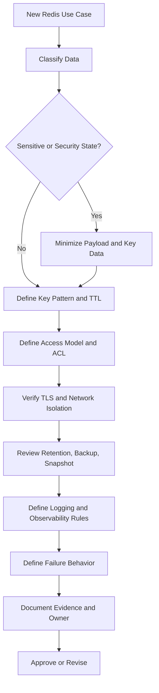

# Part 055 — Security, Privacy, and Compliance Review

Redis is often introduced as a performance optimization.

In production, Redis can quietly become a security and compliance boundary.

It may contain:

- session identifiers;
- refresh-token state;
- token revocation markers;
- login attempt counters;
- MFA attempt state;
- idempotency request fingerprints;
- cached customer or account data;
- quote/order read models;
- tenant configuration;
- feature flags;
- rate limiter keys;
- lock keys;
- stream payloads;
- job payloads;
- temporary workflow state.

That means Redis review must not stop at:

> "Does the cache work?"

A senior review asks:

> "Can this Redis usage leak data, retain data too long, bypass tenant boundaries, weaken auth/session controls, expose dangerous commands, or produce evidence gaps during audit or incident response?"

This part is a security/privacy/compliance checklist for Redis-based systems in enterprise Java/JAX-RS environments.

---

## 1. Review Mindset

Redis is not automatically safe because it is "just a cache".

A cache can still contain regulated data.
A key name can still leak identity.
A snapshot can still preserve deleted data.
A log line can still expose a token.
A misconfigured ACL can still allow destructive commands.
A public network path can still turn Redis into a breach point.

Security review must cover three layers:

| Layer | Review Question |
|---|---|
| Application layer | What data does Java write to Redis, and why? |
| Redis layer | Who can read, write, delete, scan, configure, or flush data? |
| Platform layer | How is Redis isolated, encrypted, backed up, monitored, patched, and audited? |

The review is incomplete if it only checks application code.

---

## 2. Redis Security and Privacy Scope

A Redis review should classify every Redis use case into one of these risk categories.

| Redis Use Case | Security/Privacy Risk |
|---|---|
| Cache | PII leakage, stale sensitive data, excessive retention |
| Session store | session hijack, logout failure, outage impact |
| Token blacklist | revocation bypass, TTL mismatch |
| Refresh token state | credential compromise, excessive privilege |
| Login/MFA attempt counter | account lockout manipulation |
| Idempotency store | request fingerprint leakage, replay risk |
| Rate limiter | tenant/user identity leakage in key name |
| Lock/coordination key | operational disruption if deleted or overwritten |
| Stream/job queue | durable sensitive payloads, replay of private data |
| Pub/Sub | accidental sensitive data broadcast |
| Feature flag/config cache | unsafe stale config or unauthorized flag exposure |

A Redis key is not just a technical object.
It is part of the system's data handling surface.

---

## 3. Core Review Questions

Use these questions before diving into detailed checklists.

1. What data is stored in Redis?
2. Is any data personal, regulated, confidential, customer-specific, tenant-specific, or security-sensitive?
3. Is the data present in key names, values, logs, metrics, traces, dumps, or backups?
4. Who can access Redis directly?
5. Which commands are allowed?
6. Is traffic encrypted in transit?
7. Is data encrypted at rest if persistence/snapshotting is enabled?
8. Is Redis reachable only from expected workloads?
9. Is TTL enforced for temporary data?
10. Can data be deleted when retention or privacy rules require deletion?
11. Are backups and snapshots covered by the same retention/privacy controls?
12. Are Redis access and configuration changes auditable?
13. Does Redis failure weaken security behavior?
14. Does Redis stale data weaken authorization, entitlement, pricing, or account state?
15. Is there evidence for auditors, SRE, security, and product owners?

If these cannot be answered, the Redis design is not production-ready.

---

## 4. Data Classification for Redis

Before reviewing commands or ACLs, classify the data.

| Class | Examples | Redis Handling Guidance |
|---|---|---|
| Public | public catalog metadata, public feature metadata | still use TTL and ownership documentation |
| Internal | internal config, non-sensitive operational counters | protect from broad access and accidental mutation |
| Customer confidential | quote details, order state, account-specific cache | require tenant isolation, TTL, access controls, redaction |
| PII | name, email, phone, address, user identifiers | avoid in key names; minimize in values; enforce TTL/deletion |
| Security-sensitive | sessions, tokens, reset codes, MFA state | strict TTL, encryption, network isolation, restricted access |
| Compliance-sensitive | regulated transaction state, audit-relevant workflow state | avoid Redis unless durability/retention/evidence is designed |

Redis is usually a poor place for long-lived compliance records.

If a value must survive audit, legal retention, reconciliation, or customer dispute, PostgreSQL or another durable governed store is usually the system of record.

---

## 5. Sensitive Key Review

Key names are often overlooked.

A Redis key name may appear in:

- application logs;
- metrics labels;
- traces;
- slowlog;
- debugging output;
- dashboards;
- incident notes;
- screenshots;
- support tickets;
- backup inspection;
- command history.

Therefore, key names must not contain raw sensitive data.

### Bad examples

```text
session:john.smith@example.com
password-reset:+6281234567890
quote:tenant-a:customer:Jane-Doe:Q-12345
mfa:alice@example.com:attempts
```

### Better examples

```text
session:{opaque-session-id}
password-reset:{opaque-token-id}
quote-cache:{tenant-id}:{quote-id}
mfa-attempt:{user-id-or-stable-internal-subject-id}
```

Even internal IDs must be reviewed.

An identifier may still be personal data if it is linkable to a person or customer.

---

## 6. Key Naming Privacy Checklist

For every Redis key pattern, verify:

- Does the key contain email, phone, full name, address, national ID, token, credential, or customer secret?
- Does the key contain quote/order/account identifiers that are sensitive in logs?
- Does the key encode tenant identity safely?
- Is tenant ID stable and non-sensitive enough for operational visibility?
- Can the key be logged by application code?
- Can the key appear in Redis slowlog or monitoring tools?
- Can the key appear in dashboards as a metric label?
- Is the key pattern documented?
- Is there an owner service/team?
- Is there a retention/TTL rule?

A good key naming convention optimizes not only debugging, but also privacy.

---

## 7. Sensitive Value Review

Values are more dangerous than keys because they may hold full payloads.

Redis values can contain:

- serialized Java objects;
- JSON DTOs;
- response bodies;
- request fingerprints;
- stream/job payloads;
- session context;
- token metadata;
- tenant configuration;
- authorization decisions;
- quote/order projections.

Review questions:

| Question | Why It Matters |
|---|---|
| Is the full payload necessary? | avoid over-caching sensitive data |
| Can the value be reduced? | minimize breach blast radius |
| Can fields be omitted or masked? | prevent unnecessary PII exposure |
| Is the TTL appropriate? | prevent excessive retention |
| Is the value encrypted at application layer if required? | platform encryption may not protect all access paths |
| Can deserialized data be safely evolved? | avoid schema-related outages |
| Is value size bounded? | security and availability overlap through big-key risk |

Do not cache full domain objects just because serialization is easy.

Cache the smallest representation that satisfies the access pattern.

---

## 8. PII in Redis

PII in Redis is not automatically forbidden.

But it must be intentional.

A safe design needs:

- documented business reason;
- source-of-truth owner;
- data classification;
- TTL/retention rule;
- deletion strategy;
- access control;
- logging redaction;
- snapshot/backup handling;
- incident response plan;
- evidence for audit or security review.

### Common PII mistakes

| Mistake | Consequence |
|---|---|
| PII in key names | leaks through logs/metrics/debugging |
| PII in unbounded cache values | breach blast radius grows silently |
| no TTL | cache becomes shadow data store |
| snapshots retained too long | deleted data persists indirectly |
| broad admin access | too many humans/systems can inspect data |
| debug endpoint exposes key/value | accidental data disclosure |
| stream/job payload stores PII durably | queue becomes data retention surface |

### Safer patterns

- Use opaque identifiers instead of raw PII in keys.
- Store minimal derived fields instead of full records.
- Apply short TTL for temporary sensitive state.
- Prefer database lookup for highly sensitive fields.
- Redact Redis key/value in logs.
- Separate sensitive keyspaces if ACL/key-pattern permissions allow it.

---

## 9. Token and Session State Review

Redis is commonly used for expiring security state.

Examples:

- session state;
- token blacklist;
- refresh token state;
- password reset token;
- one-time login token;
- CSRF token;
- MFA challenge state;
- login attempt counter;
- temporary device trust marker.

This is not ordinary cache.

Security behavior may depend on Redis correctness.

### Review checklist

- Is TTL aligned with token/session lifetime?
- Does logout delete or revoke the right Redis keys?
- Does token rotation invalidate old state?
- Is sliding session extension safe?
- Can concurrent requests revive expired state incorrectly?
- What happens if Redis is unavailable?
- Does failure default open or default closed?
- Are tokens stored raw or hashed?
- Can an operator inspect token values?
- Are session keys protected by ACL/key patterns?
- Is replication/failover data loss acceptable?

### Safer default

For security state, prefer:

```text
fail closed for authorization decisions
fail carefully for session UX
log enough to debug without exposing tokens
store hashes of tokens when possible
use short TTL and explicit revocation semantics
```

Do not store bearer tokens in Redis as plain text unless there is a reviewed reason.

---

## 10. Redis ACL Review

Redis ACLs should express least privilege.

A Java application usually does not need:

- `FLUSHALL`;
- `FLUSHDB`;
- `CONFIG`;
- `SHUTDOWN`;
- `DEBUG`;
- broad `KEYS`;
- unrestricted scripting;
- unrestricted admin commands;
- access to unrelated keyspaces.

### ACL review dimensions

| Dimension | Review Question |
|---|---|
| User separation | Does each service/environment use a distinct Redis user? |
| Command permissions | Are dangerous/admin commands blocked? |
| Key pattern permissions | Can service access only its own key prefixes? |
| Environment separation | Are dev/stage/prod credentials isolated? |
| Rotation | Can credentials be rotated without outage? |
| Audit | Are ACL changes tracked? |

### Example least-privilege intent

A cache-only service may need:

```text
GET
SET
DEL
EXPIRE
TTL
MGET
MSET
SCAN only if approved and scoped
```

A stream consumer may need:

```text
XREADGROUP
XACK
XPENDING
XAUTOCLAIM
XADD for DLQ-like stream
XINFO for diagnostics if approved
```

A rate limiter may need:

```text
EVALSHA or FCALL
GET/SET/INCR/EXPIRE/ZADD/ZREMRANGEBYSCORE/ZCARD depending on algorithm
```

The exact ACL depends on the implementation.
Treat this as an internal verification checklist, not a generic copy-paste policy.

---

## 11. Dangerous Command Review

Some Redis commands are dangerous because they can destroy data, expose data, block Redis, or change runtime behavior.

| Command / Category | Risk |
|---|---|
| `FLUSHALL`, `FLUSHDB` | deletes all keys |
| `CONFIG SET` | changes Redis behavior at runtime |
| `SHUTDOWN` | stops Redis |
| `DEBUG` | unsafe operational effects |
| `KEYS` | can block Redis on large keyspace |
| `MONITOR` | exposes live commands and sensitive data; high overhead |
| `SAVE` | blocking persistence operation |
| broad `EVAL` | arbitrary server-side logic risk |
| `CLIENT KILL` | disconnects workloads |
| `SCRIPT FLUSH` | can break apps using EVALSHA |

Review questions:

- Are dangerous commands blocked for application users?
- Are admin commands limited to operational break-glass users?
- Are break-glass credentials audited?
- Does CI/CD prevent accidental destructive commands?
- Are production debug procedures safe?

A production application should not have admin-level Redis permissions by default.

---

## 12. TLS and Network Isolation Review

Redis should not be broadly reachable.

Network isolation matters more than many teams expect because Redis is fast, powerful, and often contains sensitive operational state.

Review:

- Is Redis bound only to private interfaces?
- Is protected mode understood and configured appropriately?
- Is Redis reachable only from approved subnets/namespaces/security groups?
- Is TLS enabled where required?
- Is mTLS used if the platform requires workload identity?
- Are Kubernetes NetworkPolicies in place?
- Are cloud security groups/firewall rules scoped?
- Are private endpoints/VNet/VPC integration used where applicable?
- Is public internet exposure impossible?
- Are bastion/jump-host access paths audited?

### Java/JAX-RS impact

For Java services, verify:

- Redis client supports TLS mode correctly.
- Truststore/keystore configuration is managed securely.
- Certificate rotation does not require risky manual redeploy.
- Hostname verification behavior is known.
- Timeout behavior is tested over TLS.

TLS misconfiguration often appears as connection timeout, handshake failure, or intermittent reconnect storm.

---

## 13. Secret and Credential Rotation Review

Redis credentials are production secrets.

They should not live in:

- source code;
- plaintext config files;
- container images;
- logs;
- debug dumps;
- CI output;
- shell history;
- unchecked Helm values;
- long-lived local developer notes.

Review questions:

- Where is the Redis password/AUTH token/access key stored?
- Is it injected through Kubernetes Secret, Vault, cloud secret manager, or approved internal mechanism?
- Is rotation supported without downtime?
- Are old credentials revoked?
- Are credentials different per environment?
- Are credentials different per service or shared broadly?
- Is emergency rotation documented?
- Is secret access audited?

Credential rotation must be tested.

A rotation plan that was never tested is not a control.

---

## 14. Snapshot, Backup, and Dump Privacy Review

Persistence and backups change the privacy model.

A Redis value with a 15-minute TTL may live longer if it appears in:

- RDB snapshot;
- AOF file;
- managed service backup;
- exported dump;
- filesystem backup;
- disaster recovery copy;
- support bundle;
- local downloaded diagnostic artifact.

Review questions:

| Question | Why It Matters |
|---|---|
| Is persistence enabled? | ephemeral data may become durable |
| Are snapshots encrypted? | protect backup storage |
| Who can restore/download snapshots? | prevent broad data access |
| What is snapshot retention? | TTL may not equal retention |
| Are backups included in deletion workflows? | privacy deletion may need backup policy clarity |
| Are support bundles redacted? | incident handling can leak data |

For sensitive caches, persistence may need to be disabled or tightly governed.

For Streams/job queues, persistence may be required, but then the stream payload must be reviewed as durable data.

---

## 15. Retention and Deletion Review

Redis retention is usually implemented through TTL.

But TTL is not the same as a compliance deletion guarantee.

Review:

- Does every temporary key have TTL?
- Are persistent keys intentional and documented?
- Is TTL set atomically with key creation?
- Are TTLs extended accidentally?
- Are stale keys cleaned up?
- Are stream retention and trimming configured?
- Are sorted-set cleanup jobs reliable?
- Is deletion needed when source-of-truth data is deleted?
- Does deletion include cache, idempotency records, jobs, stream entries, session/token state, and backups if applicable?

### Common issue

```java
redis.set(key, value);
redis.expire(key, ttlSeconds);
```

If the process crashes between `SET` and `EXPIRE`, the key may become persistent.

Prefer atomic TTL set where possible:

```text
SET key value EX 900
```

For complex writes, use Lua or transaction patterns carefully.

---

## 16. Multi-Tenant Isolation Review

In enterprise systems, tenant isolation is a correctness, security, and compliance concern.

Redis key design must prevent cross-tenant read/write mistakes.

Review:

- Does every tenant-scoped key include tenant identity or equivalent partition?
- Is tenant identity validated before Redis access?
- Are keys built from trusted server-side tenant context, not client-provided raw input?
- Are cache entries invalidated per tenant safely?
- Can one tenant trigger broad deletion affecting another tenant?
- Are rate limiter keys tenant-aware?
- Are lock keys tenant-aware when needed?
- Are feature flags/config keys tenant-aware?
- Are ACL key patterns tenant-aware or service-aware?
- Are metrics aggregated without exposing tenant-sensitive identifiers?

### Dangerous anti-pattern

```text
quote:{quoteId}
```

If quote IDs are not globally unique or are guessable, this can create cross-tenant leakage.

Better:

```text
quote-cache:{tenantId}:{quoteId}:v1
```

But verify whether `tenantId` itself is safe to expose operationally.

---

## 17. Observability and Logging Privacy Review

Redis observability can leak sensitive data.

Risk surfaces:

- key names in logs;
- Redis command traces;
- request/response payload logs;
- slowlog output;
- `MONITOR` output;
- exception messages;
- metric labels;
- dashboard filters;
- support screenshots;
- incident documents.

Review:

- Are Redis keys redacted in logs if needed?
- Are values never logged except in approved debug modes?
- Are tokens/session IDs masked?
- Are tenant/customer identifiers masked or hashed in metrics if required?
- Are slowlog and command sampling handled carefully?
- Are tracing spans safe?
- Are logs retained according to policy?

### Java/JAX-RS logging rule

Do not log raw Redis command arguments by default.

Prefer structured, safe fields:

```text
redis.operation=GET
redis.key_pattern=quote-cache:{tenant}:{quote}:v1
redis.key_hash=sha256(...)
redis.duration_ms=12
redis.result=hit
```

Avoid:

```text
GET quote-cache:tenant-a:customer-email@example.com:quote-123
```

---

## 18. Redis Streams and Job Payload Privacy Review

Streams and job queues deserve special review because they often behave more durably than cache.

Review:

- Does the stream/job payload contain PII?
- Is payload minimization applied?
- Is retention/trimming configured?
- Is replay allowed under privacy rules?
- Is DLQ-like stream retention bounded?
- Are poison messages inspected safely?
- Are worker logs redacted?
- Are old pending entries cleaned or archived safely?
- Are stream backups/snapshots included in privacy review?

If Redis Streams are used as an event log-lite, treat the stream as durable operational data, not as ephemeral cache.

---

## 19. Pub/Sub Privacy Review

Redis Pub/Sub is fire-and-forget and non-durable, but it can still leak data.

Review:

- Are channel names sensitive?
- Are message payloads sensitive?
- Are subscribers authorized to receive all channel messages?
- Can pattern subscriptions receive unintended channels?
- Is Pub/Sub used across tenants?
- Is Pub/Sub traffic logged?
- Is it acceptable that messages are not durable?

For invalidation, publish identifiers or version markers, not full data payloads.

Bad:

```json
{
  "tenant": "tenant-a",
  "customerEmail": "alice@example.com",
  "fullQuote": { "...": "..." }
}
```

Better:

```json
{
  "eventType": "QUOTE_CACHE_INVALIDATED",
  "tenantId": "tenant-a",
  "quoteId": "Q123",
  "version": 17
}
```

Then verify whether `tenantId` and `quoteId` are acceptable in that channel.

---

## 20. Rate Limiter Privacy Review

Rate limiter keys often encode actor identity.

Examples:

```text
rate:ip:203.0.113.10:/orders
rate:user:alice@example.com:/login
rate:tenant:tenant-a:/quote-submit
```

Review:

- Is raw IP allowed in key names?
- Is raw email/user name avoided?
- Is endpoint path safe to expose?
- Is tenant identifier safe?
- Is limiter data retained only as long as needed?
- Are limiter keys deleted/expired automatically?
- Can limiter keys reveal customer usage patterns?
- Are metrics aggregated safely?

For users, prefer stable internal subject IDs or hashes over raw usernames/emails.

---

## 21. Idempotency Privacy Review

Idempotency records may store:

- idempotency key;
- request fingerprint;
- request body hash;
- response body;
- processing state;
- error state;
- business resource identifier.

Review:

- Are idempotency keys treated as secrets if client-generated?
- Is request fingerprint a hash rather than raw body?
- Is cached response minimized?
- Is TTL aligned with retry contract?
- Does response replay expose data to the wrong principal?
- Is idempotency key scoped by tenant/user/client?
- Can a malicious caller reuse another caller's idempotency key?

Idempotency records must be scoped.

A key like this is dangerous:

```text
idempotency:{idempotencyKey}
```

A safer pattern includes boundary context:

```text
idempotency:{tenantId}:{clientId}:{idempotencyKeyHash}
```

The exact scope depends on the API contract.

---

## 22. Distributed Lock and Coordination Security Review

Lock keys and coordination keys may not contain PII, but they can affect availability and correctness.

Review:

- Can application credentials delete unrelated locks?
- Can broad access cause stuck workflows or duplicate processing?
- Are lock keys namespace-scoped?
- Are lock values unguessable?
- Is unlock protected by value comparison?
- Are coordination flags protected from unauthorized mutation?
- Are kill switch / maintenance mode keys restricted?
- Are operational overrides audited?

A malicious or buggy writer to Redis coordination keys can cause production disruption even without reading sensitive data.

---

## 23. Java/JAX-RS Security Integration Review

Redis security is affected by Java application design.

Review:

- Are Redis keys built from validated server-side context?
- Are tenant/user IDs derived from authenticated principal, not raw request parameters?
- Are Redis errors mapped safely to HTTP responses?
- Are Redis auth/TLS failures hidden from public API details?
- Are sensitive Redis values excluded from exception messages?
- Are retries safe for security-sensitive operations?
- Are fallback behaviors secure?
- Is Redis unavailability handled differently for cache vs auth/session/token state?

### Failure behavior table

| Redis Use Case | Safer Failure Behavior |
|---|---|
| non-sensitive cache | bypass cache and load source of truth if safe |
| authorization cache | fail closed or re-check source of truth |
| session store | reject or force re-auth depending on contract |
| token blacklist | fail closed for protected actions if revocation cannot be checked |
| rate limiter | choose explicit fail-open/fail-closed policy per endpoint |
| feature flag | safe default, not arbitrary stale behavior |
| idempotency | avoid duplicate side effects; return retryable uncertainty if needed |

Do not use the same fallback rule for all Redis failures.

---

## 24. PostgreSQL/MyBatis/JDBC Consistency and Compliance Review

Redis often caches PostgreSQL data.

Review:

- Is PostgreSQL the source of truth?
- Does Redis contain a subset, projection, or full record?
- Is cache invalidated after DB update/delete?
- Does privacy deletion from DB also clear Redis?
- Are migrations aware of cache schema?
- Can old cached values violate new business/security rules?
- Are authorization/entitlement decisions cached safely?
- Does Redis store data that PostgreSQL audit policies would otherwise protect?

If PostgreSQL has row-level security, audit triggers, encryption, or retention controls, caching the same data in Redis may bypass some of those protections unless Redis has equivalent controls.

---

## 25. Kafka/RabbitMQ Consistency and Compliance Review

Redis invalidation/projection often depends on messaging.

Review:

- Does a Kafka/RabbitMQ event carry PII into Redis?
- Are duplicate events idempotent?
- Are out-of-order events handled?
- Does event replay repopulate deleted sensitive data?
- Is tombstone/delete event handling correct?
- Does projection rebuild respect privacy deletion?
- Is cache invalidation lag acceptable?
- Are DLQs reviewed for sensitive payload retention?

Message replay is a privacy concern if it rehydrates Redis with data that should remain deleted or expired.

---

## 26. Kubernetes Review

For Redis running in or accessed from Kubernetes, verify:

- Redis credentials are stored in Kubernetes Secret or approved secret manager.
- Secrets are not embedded in ConfigMaps or Helm values committed to Git.
- NetworkPolicy restricts Redis access.
- Redis Service is not externally exposed unless explicitly approved.
- TLS certificates are mounted/rotated safely.
- Pod logs do not expose Redis credentials.
- Debug containers cannot freely inspect Redis data without controls.
- RBAC restricts access to Redis secrets.
- Helm chart values avoid dangerous defaults.
- StatefulSet/PV snapshots are governed if self-managed.

Kubernetes access to Redis secrets is Redis access.

Review RBAC accordingly.

---

## 27. Cloud-Managed Redis Review

For AWS/Azure/managed Redis-compatible services, verify:

- private networking is enabled;
- public access is disabled;
- encryption in transit is enabled where required;
- encryption at rest is enabled where required;
- AUTH/ACL/access key model is understood;
- admin access is limited;
- maintenance windows are known;
- backups/snapshots are configured and retained appropriately;
- monitoring/alerts are enabled;
- failover behavior is tested;
- data residency requirements are respected;
- global replication/geo-replication does not violate residency/privacy rules.

Managed service does not remove application-level privacy responsibility.

It only shifts part of operational responsibility.

---

## 28. On-Prem and Hybrid Review

For on-prem or hybrid Redis, verify:

- OS hardening;
- firewall rules;
- private network routes;
- TLS/certificate management;
- patching process;
- backup encryption;
- restore access controls;
- monitoring ownership;
- Sentinel/Cluster security;
- operator access audit;
- air-gapped operational process if applicable;
- hybrid latency and network exposure;
- cloud-to-on-prem credential handling.

On-prem Redis usually increases operational accountability.

The review must identify who owns patching, backup, incident response, and access control.

---

## 29. Auditability Review

Compliance requires evidence.

A Redis design should be able to produce evidence for:

- who owns each Redis keyspace;
- what data class each keyspace stores;
- what TTL/retention applies;
- who can access Redis;
- what ACL commands are allowed;
- where credentials are stored;
- when credentials rotate;
- whether TLS/network isolation is enabled;
- whether backups exist and how long they are retained;
- what dashboards/alerts monitor Redis;
- what runbooks exist;
- what incidents occurred and how they were remediated.

If evidence cannot be produced, the control is not reviewable.

---

## 30. Security/Privacy Failure Modes

| Failure Mode | Impact | Detection |
|---|---|---|
| PII in key name | data leakage through logs/metrics | key pattern review, log scan |
| raw token in Redis | credential exposure | payload review, secret scan |
| missing TTL | excessive retention | TTL sampling, key audit |
| broad ACL | destructive or unauthorized access | ACL review |
| public Redis exposure | breach risk | network scan, cloud config review |
| missing TLS | credential/data interception | connection config review |
| snapshot retained too long | deleted data persists | backup policy audit |
| stale auth cache | authorization bypass | auth decision audit, cache invalidation metrics |
| stream replay after deletion | privacy violation | replay process review |
| log contains Redis values | data leak | log redaction tests |
| cross-tenant key collision | data isolation breach | key design review, tenant test |

---

## 31. Production-Safe Security Debugging

When investigating suspected Redis security/privacy issue:

1. Preserve evidence.
2. Do not run broad key dumps.
3. Identify key pattern owner.
4. Use metadata first: `TYPE`, `TTL`, cardinality, memory usage.
5. Avoid reading values unless approved.
6. If value inspection is required, inspect minimal samples in approved environment/path.
7. Redact incident notes.
8. Check logs, traces, slowlog, and dashboards for exposure.
9. Check backups/snapshots if retention impact matters.
10. Involve security/privacy/platform teams early for regulated data.

Commands like `SCAN` and `MEMORY USAGE` may be acceptable when scoped.
Commands that read full values should be treated as sensitive operations.

---

## 32. Redis Security Review Workflow

Use this workflow for a new Redis use case:



The review must happen before production rollout.

---

## 33. Redis Security Review Checklist

### Data

- [ ] Data class is documented.
- [ ] PII/confidential/security-sensitive fields are identified.
- [ ] Payload is minimized.
- [ ] Redis is not the hidden source of truth for compliance data.
- [ ] Key names do not contain raw sensitive data.
- [ ] Values are redacted/minimized/encrypted where required.

### TTL and retention

- [ ] TTL exists for temporary data.
- [ ] Persistent keys are intentional.
- [ ] TTL aligns with business/security contract.
- [ ] Stream/job retention is bounded.
- [ ] Backup/snapshot retention is reviewed.
- [ ] Deletion workflow includes Redis if required.

### Access control

- [ ] Service-specific Redis user/credential exists.
- [ ] Dangerous commands are blocked.
- [ ] Key pattern permissions are scoped where supported.
- [ ] Admin/break-glass access is audited.
- [ ] Credential rotation is documented and tested.

### Network and encryption

- [ ] Redis is private network only.
- [ ] TLS is enabled where required.
- [ ] Kubernetes NetworkPolicy/security groups/firewalls are scoped.
- [ ] Public exposure is impossible or explicitly approved.
- [ ] Certificate lifecycle is known.

### Observability

- [ ] Redis keys/values are not logged unsafely.
- [ ] Metrics labels do not expose sensitive identifiers.
- [ ] Slowlog/monitoring access is restricted.
- [ ] Alerts exist for security-relevant failures.
- [ ] Incident notes use redaction rules.

### Operations

- [ ] Backup/restore access is restricted.
- [ ] Runbook covers security-sensitive Redis failures.
- [ ] Ownership is clear across backend/platform/SRE/security.
- [ ] Evidence is available for audit.

---

## 34. Internal Verification Checklist

Verify internally:

- Which Redis-compatible service is used: Redis OSS, Redis Enterprise, Valkey-compatible, AWS managed, Azure managed, Kubernetes self-managed, on-prem, or hybrid.
- Which Redis clients are used by Java services.
- Whether Redis AUTH/ACL is enabled.
- Whether service-specific credentials exist.
- Whether TLS is enabled from Java clients.
- Whether Redis traffic stays on private network paths.
- Whether Redis key naming standard forbids PII.
- Whether Redis value payloads are classified.
- Whether session/token/idempotency/rate limiter keys store sensitive data.
- Whether TTL policy is documented and enforced.
- Whether backups/snapshots exist and how long they are retained.
- Whether Redis logs, slowlog, traces, dashboards, and incident notes can expose sensitive data.
- Whether Redis admin access is audited.
- Whether dangerous commands are restricted.
- Whether Redis deletion/privacy workflows exist.
- Whether Redis evidence is available for compliance review.

Do not assume these from code alone.
Confirm with platform, SRE, security, and backend owners.

---

## 35. PR Review Prompts

When reviewing a PR that touches Redis, ask:

1. What exact Redis keys are created, read, updated, deleted, or scanned?
2. Do key names contain sensitive identifiers?
3. What values are stored?
4. Is the payload minimized?
5. Is TTL set atomically?
6. Is this data allowed to exist in Redis?
7. Is Redis acting as source of truth?
8. Is tenant/user scope included correctly?
9. What happens on Redis miss, timeout, or failure?
10. Can stale Redis data weaken security or correctness?
11. Are logs/traces safe?
12. Does the service credential have least privilege?
13. Does this require ACL or key-pattern change?
14. Does this affect backups/snapshots/retention?
15. Is there a test for privacy/security-sensitive behavior?

A PR that adds Redis storage without answering these questions is incomplete.

---

## 36. Architecture Decision Review Prompts

For an ADR involving Redis, require explicit answers:

- Why Redis instead of PostgreSQL, Kafka, RabbitMQ, local cache, or managed configuration service?
- What data class is stored?
- What is the source of truth?
- What is the retention period?
- What is the failure behavior?
- What is the security boundary?
- What is the tenant boundary?
- What is the access model?
- What is the observability model?
- What is the deletion/privacy model?
- What is the operational owner?
- What evidence can be shown during audit?

If the ADR only argues latency, it is incomplete.

---

## 37. Red Flags

Treat these as review blockers or escalation triggers:

- raw PII in key names;
- raw tokens stored in Redis;
- no TTL for temporary sensitive data;
- Redis used as source of truth for regulated records without durability/governance review;
- application Redis user can run `FLUSHALL` or `CONFIG`;
- public Redis endpoint;
- missing TLS where required;
- shared credential across many services/environments;
- snapshots enabled without retention/privacy review;
- stream/job payload contains sensitive data with unbounded retention;
- authorization decisions cached without invalidation strategy;
- Redis failure defaults open for security-critical checks without explicit approval;
- logs contain Redis values or raw keys with sensitive identifiers;
- cross-tenant key pattern ambiguity.

---

## 38. Practical Senior Engineer Heuristics

Use these heuristics during review:

- If data is sensitive, minimize before caching.
- If data is temporary, require TTL.
- If TTL matters, set it atomically.
- If a key may appear in logs, design it as if an auditor will read it.
- If Redis failure changes security behavior, document the fallback explicitly.
- If Redis contains tokens, assume an operator or attacker may try to read them.
- If Redis uses persistence, TTL is not the full retention story.
- If Redis uses streams, treat payloads as durable until retention proves otherwise.
- If access is broad, ACL is not doing its job.
- If evidence cannot be produced, the control is weak.

---

## 39. Final Mental Model

Redis security review is not separate from Redis design.

Key design affects privacy.
TTL affects retention.
Serialization affects data minimization.
ACL affects blast radius.
Network isolation affects breach likelihood.
Observability affects accidental disclosure.
Persistence affects deletion and backup risk.
Failure behavior affects authorization and session safety.

For enterprise Java/JAX-RS systems, Redis must be reviewed as:

```text
runtime dependency
+ data handling surface
+ access control boundary
+ operational component
+ audit evidence source
```

A Redis design is production-ready only when it is correct, observable, secure, private, and operable.

---

## 40. Part Summary

In this part, you learned how to review Redis for:

- sensitive key design;
- PII in keys and values;
- session/token state;
- ACL and dangerous commands;
- TLS and network isolation;
- secret rotation;
- snapshots and backups;
- retention and deletion;
- multi-tenant isolation;
- logging and observability privacy;
- Streams/job/Pub/Sub privacy;
- Java/JAX-RS security integration;
- PostgreSQL and messaging consistency implications;
- Kubernetes/cloud/on-prem deployment controls;
- audit evidence and PR/ADR review.

Redis is fast.

Security review must be faster than accidental misuse.
