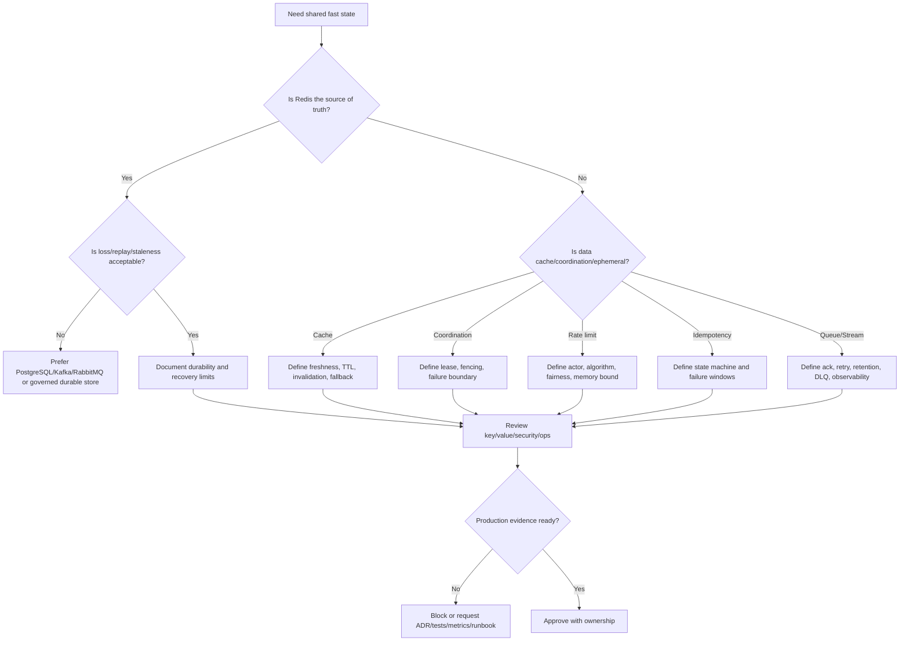

# Part 056 — PR Review and Architecture Decision Checklist

Redis changes look small in code.

A PR may add only a few lines:

```java
redis.set(key, value);
```

But that line may introduce:

- stale data;
- tenant leakage;
- missing TTL;
- cache stampede;
- serialization incompatibility;
- duplicate side effects;
- unsafe distributed lock;
- memory growth;
- hot key pressure;
- cluster cross-slot issue;
- token exposure;
- operational blind spot;
- incident recovery gap.

This part is a practical review framework.

It helps you review Redis-related PRs and architecture decisions like a senior engineer: not by asking "does it compile?", but by asking whether the Redis usage is correct, bounded, observable, secure, and operable.

---

## 1. What Counts as a Redis Change?

A Redis review is required when a PR or ADR touches any of these:

- Redis client dependency or configuration;
- connection pool or timeout;
- cache key generation;
- cache read/write/delete;
- TTL or eviction-sensitive behavior;
- cache invalidation;
- serialization format;
- rate limiter;
- idempotency store;
- distributed lock;
- single-flight or coordination flag;
- Redis Streams;
- Pub/Sub;
- keyspace notification;
- session or token state;
- feature flag/config cache;
- Lua script or Redis Function;
- Kubernetes manifest, Helm chart, secret, NetworkPolicy;
- cloud Redis parameter/security/backup settings;
- dashboard or alert;
- runbook or incident procedure.

Do not treat Redis changes as ordinary utility code.

Redis sits between application correctness and production operations.

---

## 2. Review Layers

A good review covers five layers.

| Layer | Main Question |
|---|---|
| Business correctness | Can stale/missing/duplicated Redis data violate expected behavior? |
| Distributed systems | What happens under concurrency, retry, timeout, failover, and partial failure? |
| Data model | Are key, value, TTL, cardinality, and data structure choices sound? |
| Operations | Can we observe, debug, scale, recover, and roll back this safely? |
| Security/privacy | Does Redis store or expose sensitive data safely? |

If a review only checks syntax and command usage, it misses the real risks.

---

## 3. Fast Triage Checklist

Use this first to decide review depth.

- [ ] Does this Redis data affect customer-visible behavior?
- [ ] Does it affect money, quote, order, entitlement, security, auth, throttling, or workflow progress?
- [ ] Does the data include PII, token/session state, tenant config, or customer confidential data?
- [ ] Does it rely on Redis for mutual exclusion or idempotency?
- [ ] Does it introduce a new key pattern?
- [ ] Does it introduce a new long-lived key?
- [ ] Does it create unbounded cardinality?
- [ ] Does it add a Lua script/function?
- [ ] Does it change timeout/retry behavior?
- [ ] Does it require platform/SRE/security verification?

If any answer is yes, review deeply.

---

## 4. Redis Decision Flow

Use this flow before approving Redis as the solution.



Redis should be selected because its trade-offs fit the use case, not because it is convenient.

---

## 5. Key Design Review

Ask:

- What is the exact key pattern?
- Who owns the key?
- Is the key environment-scoped?
- Is the key service-scoped?
- Is the key tenant-scoped where needed?
- Is the key entity-scoped?
- Is there a version component?
- Does the key contain PII or secrets?
- Is cardinality bounded or understood?
- Can this key become hot?
- Can this key become big?
- Is the key compatible with Redis Cluster hash slots?
- Is the key documented?

### Review red flags

```text
cache:{id}
lock:{id}
session:{email}
rate:{userInput}
config:global
```

These may be fine only if the scope is proven.

Better key reviews ask:

```text
What namespace owns this?
What tenant/user/resource boundary applies?
What is the lifecycle?
What happens during migration?
What happens during cluster mode?
```

---

## 6. Value and Serialization Review

Ask:

- What exact value is stored?
- Is it JSON, string, binary, Protobuf, Avro, or Java-native serialization?
- Is the payload versioned?
- Is backward compatibility tested?
- Is forward compatibility considered during rolling deployment?
- Can old service versions read new values?
- Can new service versions read old values?
- Are enum changes safe?
- Are null fields handled?
- Are date/time formats stable?
- Is BigDecimal/currency precision preserved?
- Is payload size bounded?
- Is sensitive data minimized?
- Is compression justified?

### Review blocker

Java-native serialization of domain objects into Redis without a compatibility plan is usually a production risk.

Rolling deployments, class renames, and enum changes can break deserialization.

---

## 7. TTL and Eviction Review

Ask:

- Does every temporary key have TTL?
- Is TTL set atomically with value creation?
- Is TTL relative or absolute?
- Is TTL based on business freshness, security lifetime, or operational cleanup?
- Is TTL too long for privacy/security?
- Is TTL too short for stampede risk?
- Is TTL jitter used for high-cardinality/high-traffic cache?
- What happens if key expires early?
- What happens if key is evicted?
- What is the Redis eviction policy?
- Are persistent keys intentional?

### Common PR bug

```java
redis.set(key, value);
redis.expire(key, ttl);
```

This can create persistent keys if the app crashes between commands.

Prefer atomic TTL APIs when available.

---

## 8. Cache Design Review

Ask:

- What is the source of truth?
- What data is cached?
- What is the freshness requirement?
- What is acceptable stale window?
- What is the cache miss path?
- What is the cache fill path?
- What invalidates the cache?
- What happens when invalidation fails?
- What happens when Redis is unavailable?
- What happens when PostgreSQL is unavailable?
- Can stale cache cause wrong price, wrong entitlement, wrong order state, or wrong security decision?
- Is negative caching used?
- Is cache warming needed?
- Is local + distributed cache involved?

### Cache approval rule

A cache PR should define all four paths:

```text
read hit
read miss
write/update/invalidation
failure/fallback
```

If any path is missing, the design is incomplete.

---

## 9. Cache-Aside Review

For cache-aside PRs, ask:

- Is the DB read done only on miss?
- Is DB load protected from stampede?
- Is cache fill done after successful DB read?
- Is TTL set atomically?
- On DB update, is cache deleted/invalidated after commit?
- Is cache deleted before DB commit? If yes, why is that safe?
- Is cache updated after DB commit? If yes, can stale update race happen?
- Are concurrent readers handled?
- Is MyBatis/JDBC transaction boundary clear?
- Are stale reads acceptable?

### Typical safer write path

```text
begin transaction
update PostgreSQL
commit transaction
delete/invalidate Redis key
publish invalidation event if needed
```

Even this can fail after commit before invalidation.

The design must acknowledge that failure window.

---

## 10. Invalidation Review

Ask:

- What triggers invalidation?
- Is invalidation manual, TTL-based, write-path, or event-driven?
- Are Kafka/RabbitMQ events involved?
- Are duplicate invalidation events safe?
- Are out-of-order events safe?
- Is invalidation tenant-scoped?
- Is entity-scoped invalidation sufficient?
- Is tenant-wide invalidation possible and safe?
- Does versioned key strategy avoid delete races?
- Is invalidation lag measured?
- Is rebuild/warmup needed after deployment or migration?

### Red flags

- only TTL, no explicit invalidation, for correctness-sensitive data;
- event-driven invalidation with no duplicate/out-of-order handling;
- deleting broad key patterns in production;
- no dashboard for invalidation lag/failure.

---

## 11. Stampede and Hot Key Review

Ask:

- Can many requests miss the same key at once?
- Can many keys expire at the same time?
- Is TTL jitter used?
- Is single-flight or request coalescing needed?
- Is stale-while-revalidate acceptable?
- Is reload rate-limited?
- Is DB protected during cache failure?
- Is this key likely to be hot?
- Should local cache be used for hot read-mostly values?
- Is the hot key visible in metrics?

Do not approve a high-traffic cache without a stampede plan.

---

## 12. Data Structure Review

Ask:

- Why this Redis data structure?
- What operations are needed?
- What is the command complexity?
- What is expected cardinality?
- What is max cardinality?
- Is full collection read avoided?
- Is scanning safe?
- Is cleanup defined?
- Is cluster compatibility considered?

| Structure | Review Risk |
|---|---|
| String | oversized values, missing TTL, unsafe binary serialization |
| Hash | large hash, no field TTL, HGETALL risk |
| List | unreliable queue semantics, blocking command impact |
| Set | large set, SMEMBERS risk, unbounded membership |
| Sorted set | cleanup required, score precision, large range queries |
| Stream | pending growth, retention, poison messages |
| Bitmap/HLL/Geo | maintainability and approximation misunderstanding |

---

## 13. Rate Limiter Review

Ask:

- What actor is limited: IP, user, tenant, client, endpoint, global?
- What is the algorithm: fixed window, sliding window, sliding log, token bucket, leaky bucket?
- Is the operation atomic?
- Is Lua/Redis Function used where needed?
- Is TTL set correctly?
- Is memory bounded?
- Is cleanup reliable?
- Is server time or app time used?
- Is fairness requirement explicit?
- Is burst allowed?
- Is `Retry-After` returned?
- What HTTP response is used?
- What happens when Redis is unavailable?
- Is fail-open or fail-closed intentional?
- Are rate limiter metrics exposed?

### Red flags

```java
long count = redis.incr(key);
if (count == 1) redis.expire(key, 60);
```

This may be acceptable only if failure window is understood.
For stronger atomicity, use Lua or a single command pattern where possible.

---

## 14. Idempotency Review

Ask:

- What operation requires idempotency?
- What is the idempotency boundary?
- Is idempotency key scoped by tenant/user/client/resource?
- Is request fingerprint stored?
- Is fingerprint mismatch handled?
- Is processing state represented?
- Is completed state represented?
- Is failed/unknown state represented?
- Is response replay safe?
- What is TTL?
- What happens on concurrent duplicate requests?
- What happens when client times out but server continues?
- What happens if DB commit succeeds but Redis update fails?
- What happens if Redis marker exists but business operation failed?
- Is PostgreSQL involved as stronger source of truth?

### Required state machine

At minimum, idempotency review should see a state model:

```text
ABSENT -> PROCESSING -> COMPLETED
                    -> FAILED_RETRYABLE
                    -> FAILED_FINAL
                    -> UNKNOWN
```

A single `SET NX` marker may not be enough for correctness-sensitive APIs.

---

## 15. Distributed Lock Review

Ask:

- Why is a distributed lock needed?
- What resource is protected?
- Is Redis lock the correct primitive?
- Is the lock best-effort or correctness-critical?
- Is `SET NX PX` used?
- Is lock value unique and unguessable?
- Is unlock done with compare-and-delete Lua script?
- Is lease duration justified?
- Is renewal/watchdog used?
- What happens during GC pause?
- What happens during network partition?
- What happens if lock expires while work continues?
- Is fencing token required?
- Is a PostgreSQL constraint/advisory lock better?
- Is external side effect protected?

### Review blocker

```java
redis.del(lockKey);
```

Deleting a lock without verifying ownership is unsafe.

Unlock must verify the lock value.

---

## 16. Coordination Pattern Review

For single-flight, semaphores, counters, leader election-lite, work claiming, kill switches, and maintenance flags, ask:

- Is Redis the right coordination layer?
- Is the state ephemeral or durable?
- What happens if Redis fails?
- What happens if the coordinator process dies?
- Are keys TTL-bound?
- Is ownership encoded safely?
- Is cleanup defined?
- Is misuse detectable?
- Can unauthorized mutation disrupt production?
- Is there an override/runbook?

Redis coordination should reduce risk, not create invisible global state.

---

## 17. Transaction, Lua, and Function Review

Ask:

- Does this require atomic multi-step logic?
- Why not a single Redis command?
- Why not `MULTI/EXEC`?
- Why Lua/Redis Function?
- Are `KEYS` and `ARGV` used correctly?
- Is script deterministic?
- Is script bounded in execution time?
- Can script block Redis?
- Is script compatible with Cluster hash slots?
- Is script versioned?
- Is script rollout/rollback planned?
- Are script errors observable?
- Are tests included?

### Red flags

- dynamic key access not listed in `KEYS`;
- unbounded loops over large collections;
- script performs broad scans;
- no versioning;
- no fallback when `EVALSHA` misses;
- no cluster compatibility review.

---

## 18. Redis Streams Review

Ask:

- Is Redis Streams the right tool instead of Kafka/RabbitMQ?
- What is the stream key?
- What is the consumer group?
- What is the consumer identity model?
- Is `XACK` discipline correct?
- What happens if worker crashes after processing but before ack?
- What happens if worker acks before processing completes?
- Is `XPENDING` monitored?
- Is stale pending claim implemented?
- Is retry bounded?
- Is poison message handling defined?
- Is DLQ-like stream used?
- Is stream trimming/retention configured?
- Is replay required?
- Is ordering requirement explicit?
- Is backpressure handled?

### Red flags

- no pending-entry monitoring;
- no retry/claim strategy;
- no retention limit;
- sensitive payload with unbounded stream;
- assuming Redis Streams equals Kafka.

---

## 19. Pub/Sub Review

Ask:

- Is message loss acceptable?
- Is subscriber offline behavior acceptable?
- Is replay required?
- Are consumer groups required?
- Are messages only notifications?
- Is payload minimal?
- Is channel naming safe?
- Can pattern subscription receive unintended messages?
- Is Kafka/RabbitMQ more appropriate?
- Is Redis Stream more appropriate?

### Approval rule

Use Redis Pub/Sub only when this is true:

```text
If a subscriber misses the message, the system can still remain correct.
```

If missed messages break correctness, Pub/Sub is the wrong primitive.

---

## 20. Session and Token State Review

Ask:

- What security state is stored?
- Is it raw token, token hash, session ID, or metadata?
- Is TTL aligned with security policy?
- Is logout/revocation behavior correct?
- Is sliding expiry safe?
- Is fail-open/fail-closed behavior documented?
- Can stale Redis data authorize a user incorrectly?
- Can Redis outage log out all users?
- Are keys and values redacted from logs?
- Are ACL and network controls stricter for this keyspace?

Security state in Redis is not just cache.

It is part of the authentication/authorization system.

---

## 21. Feature Flag and Config Cache Review

Ask:

- What is the source of truth?
- Is Redis only a cache?
- What is safe default if Redis is unavailable?
- What is safe default if config source is unavailable?
- Is stale config acceptable?
- Is config tenant-scoped?
- Are kill switches strongly protected?
- Is config versioned?
- Is runtime reload observable?
- Is auditability preserved?

A stale feature flag can be a production incident if it enables unsafe behavior or disables a critical guardrail.

---

## 22. Security and Privacy Review

Ask:

- Does key contain PII, token, credential, email, phone, or secret?
- Does value contain sensitive data?
- Is payload minimized?
- Is TTL aligned with retention?
- Are logs/traces safe?
- Are metrics labels safe?
- Are ACLs least privilege?
- Are dangerous commands blocked?
- Is TLS/network isolation enabled?
- Are credentials rotated?
- Are backups/snapshots governed?
- Is tenant isolation enforced?

Do not approve Redis storage of sensitive data without an explicit data-handling decision.

---

## 23. Observability Review

Ask:

- What metrics prove this Redis usage is healthy?
- Are hit/miss rates measured?
- Are latency histograms available?
- Are timeout/error rates measured?
- Are Redis command names visible?
- Are key patterns visible without exposing full sensitive keys?
- Are evictions/expired keys monitored?
- Are stream pending entries monitored?
- Are rate limiter allows/blocks monitored?
- Are lock acquisition failures monitored?
- Are idempotency state transitions monitored?
- Is there an alert?
- Is there a dashboard?
- Is there a runbook?

A Redis feature without observability is a hidden production dependency.

---

## 24. Performance Review

Ask:

- What is expected QPS?
- What is peak QPS?
- What is command complexity?
- Is pipelining/batching used where appropriate?
- Is connection pool sized per pod and per cluster?
- Can Kubernetes scaling create connection storms?
- Are timeouts reasonable?
- Are retries bounded?
- Is serialization cost measured?
- Is payload size bounded?
- Are hot keys possible?
- Are big keys possible?
- Is Redis Cluster slot distribution safe?
- Has load testing covered Redis path?

### Red flags

- unbounded collection reads;
- broad scans in request path;
- no timeout;
- excessive retries;
- large JSON payloads;
- per-request connect/disconnect;
- one global hot key for all tenants;
- many pods each with oversized connection pool.

---

## 25. Failure Behavior Review

Ask for each Redis usage:

- What happens if Redis is unavailable?
- What happens if Redis is slow?
- What happens if Redis times out after executing command?
- What happens during failover?
- What happens during network partition?
- What happens if key expires earlier than expected?
- What happens if key is evicted?
- What happens if duplicate request/event/job occurs?
- What happens if Redis returns stale replica data?
- What happens if Lua script fails?
- What happens if cluster returns `MOVED`, `ASK`, or `CROSSSLOT`?

Every Redis PR should have a failure story.

---

## 26. Kubernetes Review

Ask:

- Does each Java pod create its own pool?
- What is total connection count after scaling?
- Does rolling update cause connection storm?
- Are readiness/liveness probes safe?
- Is graceful shutdown closing Redis resources?
- Is DNS/service discovery behavior understood?
- Is NetworkPolicy configured?
- Are Redis credentials injected safely?
- Are CPU throttling and event loop pressure considered?
- Are timeouts tuned for cluster/network reality?

Kubernetes changes application behavior even when Redis code does not change.

---

## 27. Cloud / On-Prem Review

Ask:

- Is Redis managed or self-managed?
- Is deployment standalone, Sentinel, Cluster, or managed cluster mode?
- Is failover behavior known?
- Is persistence enabled?
- Is backup configured?
- Is maintenance window known?
- Are encryption and network controls enabled?
- Are parameter groups/configs reviewed?
- Are upgrades planned?
- Is on-prem patching owned?
- Is hybrid network latency acceptable?
- Is data residency affected?

The same Redis code may behave differently across AWS, Azure, Kubernetes, and on-prem deployments.

---

## 28. Testing Review

Ask:

- Are unit tests enough, or is integration testing required?
- Is Testcontainers Redis used?
- Are TTL tests included?
- Are invalidation tests included?
- Are concurrency tests included?
- Are rate limiter edge cases tested?
- Are idempotency duplicate/concurrent tests included?
- Are lock expiry/ownership tests included?
- Are stream retry/pending tests included?
- Are Pub/Sub loss assumptions tested or documented?
- Are Redis unavailable/slow scenarios tested?
- Are serialization compatibility tests included?
- Are cluster-specific behaviors tested if cluster mode is used?

A Redis change touching concurrency or correctness should not rely only on mocks.

---

## 29. Operational Readiness Review

Ask:

- Is there a dashboard?
- Is there alerting?
- Is there a runbook?
- Is there an owner?
- Is rollback safe?
- Are keys documented?
- Are Redis commands production-safe?
- Is capacity impact estimated?
- Are memory and cardinality bounded?
- Is incident escalation path known?
- Are customer impact scenarios understood?

Do not approve production Redis usage that nobody can operate.

---

## 30. ADR Requirements for Redis Decisions

A Redis ADR should include:

```md
# Decision
What Redis is used for.

# Context
Business/system problem.

# Alternatives Considered
PostgreSQL, Kafka, RabbitMQ, local cache, managed config, in-memory grid, no cache.

# Redis Use Case
Cache / rate limiter / idempotency / lock / stream / pubsub / session / config.

# Source of Truth
Where durable/canonical data lives.

# Key Design
Patterns, namespace, tenant scope, versioning, cardinality.

# Data Structure
Why string/hash/list/set/zset/stream/etc.

# TTL and Retention
TTL, eviction assumptions, cleanup.

# Correctness Model
Staleness, consistency, concurrency, retry, duplicate handling.

# Failure Behavior
Redis unavailable, slow, failover, timeout, eviction, stale data.

# Security and Privacy
PII, tokens, ACL, TLS, network, logging, backup.

# Observability
Metrics, logs, traces, dashboards, alerts.

# Operations
Runbook, ownership, capacity, rollback, migration.

# Internal Verification
What must be checked with backend/platform/SRE/security.
```

If an ADR does not include failure behavior, it is not a Redis architecture decision.
It is only a happy-path proposal.

---

## 31. Senior Review Question Bank

Use these questions in design reviews.

### Correctness

- What can go stale?
- What can be duplicated?
- What can be lost?
- What can be processed twice?
- What can be processed out of order?
- What can be observed by the wrong tenant/user?

### Concurrency

- What happens with two concurrent requests?
- What happens with retry after timeout?
- What happens if worker crashes mid-operation?
- What happens if lock expires during the critical section?
- What happens during failover?

### Performance

- What is the hottest key?
- What is the largest key?
- What is the most expensive command?
- What happens at peak traffic?
- What happens if Redis latency doubles?

### Operations

- How do we know it is working?
- How do we know it is failing?
- How do we debug it safely?
- How do we roll it back?
- Who owns it at 3 AM?

### Security

- What sensitive data exists in Redis?
- Who can read it?
- Who can delete it?
- How long does it live?
- Can it appear in logs or backups?

---

## 32. Review Severity Guide

| Finding | Severity |
|---|---|
| missing TTL on non-sensitive low-risk cache | medium |
| missing TTL on token/session/idempotency key | high |
| PII in key name | high |
| raw token in value without review | high/critical |
| application user can run `FLUSHALL` | critical |
| unsafe lock release | high |
| Pub/Sub used for durable correctness event | high |
| no pending handling for critical stream | high |
| no timeout on Redis calls | high |
| broad `KEYS` in request path | high |
| no observability for critical limiter/idempotency/lock | high |
| cache stale window not documented for pricing/order/security | high |
| Redis public exposure | critical |

Severity depends on business impact, data sensitivity, and blast radius.

---

## 33. Approval Criteria

Approve Redis changes only when these are true:

- The use case is appropriate for Redis.
- Source of truth is clear.
- Key design is scoped and documented.
- Data structure fits access pattern and cardinality.
- TTL/retention is explicit.
- Failure behavior is documented.
- Concurrency risks are handled.
- Security/privacy risks are reviewed.
- Observability exists.
- Tests cover meaningful edge cases.
- Operations/runbook ownership is clear.

A Redis change is not ready because it works locally.

It is ready when it behaves predictably under production failure.

---

## 34. Common Review Anti-Patterns

### Anti-pattern: "It is just cache"

Reality:

Cache can affect correctness, privacy, and user-visible behavior.

### Anti-pattern: "TTL solves invalidation"

Reality:

TTL bounds staleness; it does not always satisfy correctness.

### Anti-pattern: "Redis lock makes it safe"

Reality:

Locks need lease, ownership, expiry, renewal, and sometimes fencing tokens.

### Anti-pattern: "Pub/Sub is lightweight Kafka"

Reality:

Redis Pub/Sub is not durable and has no replay or consumer groups.

### Anti-pattern: "Streams are Kafka"

Reality:

Streams are useful, but operational model, retention, partitioning, ecosystem, and replay semantics differ.

### Anti-pattern: "More retries improve reliability"

Reality:

Unbounded retries amplify Redis pressure and worsen incidents.

### Anti-pattern: "We can debug with KEYS"

Reality:

Broad keyspace commands can become production incidents.

---

## 35. Internal Verification Checklist

Before approving Redis-heavy work, verify internally:

- Redis deployment model: standalone, Sentinel, Cluster, managed, Kubernetes, on-prem, hybrid.
- Redis-compatible engine/version and feature availability.
- Java client library and version.
- Client timeout/retry/pool settings.
- Key naming standard.
- TTL/eviction policy.
- Serialization standard.
- Cache invalidation convention.
- Rate limiter framework if any.
- Idempotency implementation pattern if any.
- Distributed lock implementation if any.
- Stream/job queue conventions if any.
- Pub/Sub usage policy.
- Session/token storage policy.
- ACL/TLS/network/security configuration.
- Observability dashboard and alerting.
- Runbook and escalation path.
- Compliance/privacy constraints.
- Platform/SRE/security team expectations.

Do not infer these from naming or convention alone.
Verify them in code, configuration, dashboards, IaC, runbooks, and team documentation.

---

## 36. Copy-Paste PR Checklist

Use this checklist directly in Redis-related PRs.

```md
## Redis Review Checklist

### Purpose
- [ ] Redis use case is identified: cache / limiter / idempotency / lock / stream / pubsub / session / config / other.
- [ ] Source of truth is documented.
- [ ] Redis is not used as hidden durable source of truth unless explicitly approved.

### Key and Value
- [ ] Key pattern is documented.
- [ ] Key includes required environment/service/tenant/entity/version scope.
- [ ] Key does not contain raw PII/secrets/tokens.
- [ ] Value payload is minimized.
- [ ] Serialization format is version/compatibility-safe.
- [ ] Cardinality and max size are understood.

### TTL and Lifecycle
- [ ] TTL is defined where needed.
- [ ] TTL is set atomically with creation where possible.
- [ ] Cleanup/invalidation strategy is defined.
- [ ] Eviction impact is acceptable.

### Correctness and Concurrency
- [ ] Stale data behavior is documented.
- [ ] Duplicate/concurrent request behavior is handled.
- [ ] Retry/timeout/failover behavior is handled.
- [ ] Redis unavailable/slow behavior is explicit.

### Security and Privacy
- [ ] Sensitive data review completed.
- [ ] ACL/credential scope is appropriate.
- [ ] Logs/traces/metrics do not expose sensitive data.
- [ ] Retention/backup/snapshot impact is reviewed.

### Observability and Operations
- [ ] Metrics/logging/tracing added or confirmed.
- [ ] Alerts/dashboard/runbook exist for critical usage.
- [ ] Tests cover TTL/failure/concurrency where relevant.
- [ ] Rollback/migration plan is safe.

### Internal Verification
- [ ] Platform/SRE/security/backend-specific assumptions verified where needed.
```

---

## 37. Copy-Paste ADR Checklist

Use this checklist for architecture discussions.

```md
## Redis ADR Review

- [ ] Problem statement is clear.
- [ ] Redis use case is specific.
- [ ] Alternatives are compared.
- [ ] Source of truth is clear.
- [ ] Data classification is documented.
- [ ] Key/value/data structure design is documented.
- [ ] TTL/retention/cleanup is documented.
- [ ] Consistency/staleness/concurrency model is documented.
- [ ] Failure behavior is documented.
- [ ] Security/privacy controls are documented.
- [ ] Observability and alerting are documented.
- [ ] Capacity/performance assumptions are documented.
- [ ] Deployment model is documented.
- [ ] Testing strategy is documented.
- [ ] Operational ownership is documented.
- [ ] Open internal verification items are listed.
```

---

## 38. Example Review: Cache PR

A PR adds:

```java
String key = "quote:" + quoteId;
String value = redis.get(key);
if (value == null) {
  Quote quote = quoteRepository.findById(quoteId);
  redis.setex(key, 3600, toJson(quote));
  return quote;
}
return fromJson(value);
```

A senior review asks:

- Is `quoteId` globally unique or tenant-scoped?
- Should key include tenant ID?
- Does `Quote` contain PII or price-sensitive data?
- Is 1 hour stale window acceptable?
- What invalidates the cache after quote update?
- What happens after quote cancellation?
- Does JSON schema survive rolling deploy?
- What happens if many requests miss same quote key?
- Is Redis unavailable fallback safe?
- Are cache hit/miss metrics emitted?
- Can key/value appear in logs?

The code is short.
The review is not.

---

## 39. Example Review: Lock PR

A PR adds:

```java
if (redis.setnx(lockKey, "locked")) {
  try {
    processOrder(orderId);
  } finally {
    redis.del(lockKey);
  }
}
```

A senior review flags:

- no TTL;
- non-unique lock value;
- unsafe unlock;
- no owner verification;
- no lease boundary;
- no behavior if process dies;
- no behavior if lock expires while work continues;
- no fencing token;
- unclear reason Redis lock is better than database constraint/advisory lock.

A safer Redis lock requires at least:

```text
SET lockKey uniqueValue NX PX leaseMillis
unlock via Lua compare-and-delete
bounded critical section
clear failure behavior
fencing token if correctness requires it
```

---

## 40. Example Review: Pub/Sub PR

A PR publishes order status updates through Redis Pub/Sub.

Review asks:

- Is message loss acceptable?
- What if subscriber is offline?
- Does the system require replay?
- Is order status source of truth elsewhere?
- Would Kafka/RabbitMQ be more appropriate?
- Is Pub/Sub only notifying subscribers to refresh from source of truth?
- Does message contain sensitive customer/order data?

If Pub/Sub carries the only order status event, reject the design.

If Pub/Sub only says "cache key changed; refresh from DB", it may be acceptable.

---

## 41. Example Review: Rate Limiter PR

A PR adds per-user limiter using Redis `INCR`.

Review asks:

- Is user ID safe in key?
- Is limiter per tenant and endpoint?
- Is `INCR` + `EXPIRE` atomic enough?
- What happens if `EXPIRE` fails?
- What happens if Redis is unavailable?
- Is fail-open acceptable for this endpoint?
- Are 429 and `Retry-After` returned correctly?
- Are limiter keys bounded by TTL?
- Is high-cardinality memory growth monitored?

Rate limiting is product behavior, security control, and reliability protection at the same time.

---

## 42. Final Mental Model

A senior Redis review is not command review.

It is system behavior review.

The reviewer must connect:

```text
Redis key/value/data structure
→ Java/JAX-RS request lifecycle
→ PostgreSQL/MyBatis transaction boundary
→ Kafka/RabbitMQ event flow
→ Kubernetes/cloud/on-prem deployment
→ failure behavior
→ security/privacy/compliance
→ observability/runbook
```

The goal is not to block Redis usage.

The goal is to prevent Redis from becoming an invisible correctness, security, performance, or operational liability.

---

## 43. Part Summary

In this part, you learned how to review Redis changes across:

- key design;
- value serialization;
- TTL and eviction;
- cache correctness;
- invalidation;
- stampede protection;
- data structure selection;
- rate limiting;
- idempotency;
- distributed locking;
- coordination;
- Lua and Redis Functions;
- Streams;
- Pub/Sub;
- session/token state;
- feature flag/config cache;
- security and privacy;
- observability;
- performance;
- Kubernetes/cloud/on-prem operations;
- testing;
- ADR readiness.

Redis is powerful because it is simple at the command level.

Redis is risky because system-level consequences are not simple.

Review the system, not just the command.
