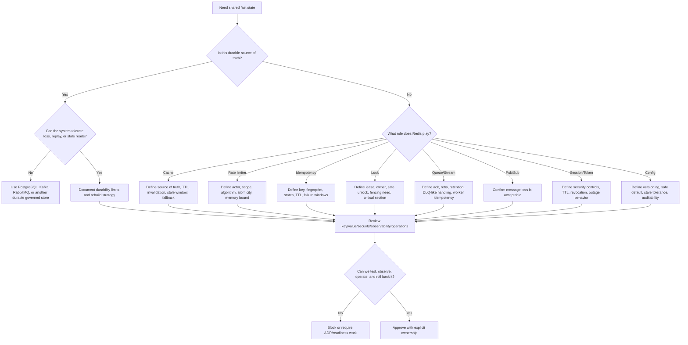
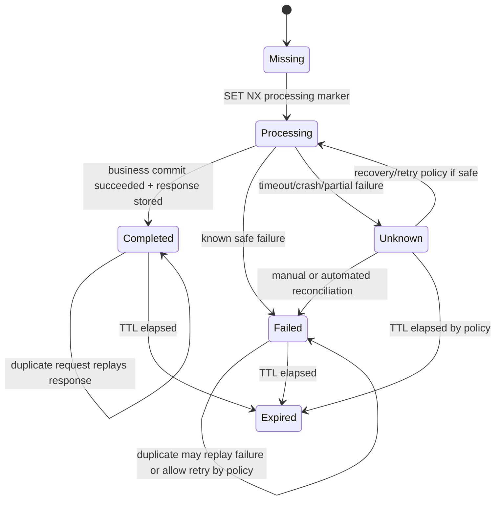

# Part 057 — Redis Mastery Map for Senior Backend Engineer

This is the final part of the Redis series.

The purpose is not to introduce a new Redis feature.

The purpose is to compress the whole series into a practical mastery map that you can use when reviewing code, designing architecture, debugging incidents, or discussing trade-offs with backend, platform, SRE, security, and product teams.

Redis looks simple at the command layer.

```text
GET key
SET key value EX 300
INCR counter
XREADGROUP ...
```

But in a serious Java/JAX-RS enterprise system, each Redis decision becomes part of a larger runtime contract:

```text
HTTP request
→ JAX-RS resource
→ service/application layer
→ Redis client
→ Redis topology
→ PostgreSQL/MyBatis/JDBC transaction boundary
→ Kafka/RabbitMQ event flow
→ Kubernetes/cloud/on-prem runtime
→ observability and incident response
→ security, privacy, and compliance boundary
```

A senior engineer understands that Redis is not only a tool.

It is a shared correctness, performance, and operational dependency.

---

## 1. Final Mental Model

Redis is an in-memory data structure server.

That sentence matters.

Redis is not just a cache.
Redis is not just a key-value store.
Redis is not a relational database.
Redis is not Kafka.
Redis is not RabbitMQ.
Redis is not a universal distributed lock manager.
Redis is not a free performance multiplier.

Redis gives you fast shared state with specialized data structures and atomic commands.

That power is useful when the state is:

- frequently read;
- latency-sensitive;
- ephemeral or reconstructable;
- bounded by TTL or lifecycle policy;
- useful for coordination but not necessarily a durable source of truth;
- small enough to fit memory economics;
- observable enough to operate safely;
- protected enough to avoid leaking sensitive data;
- designed enough to survive concurrency and partial failure.

Redis becomes dangerous when the state is:

- silently treated as the source of truth;
- not bounded by TTL or cleanup;
- loaded with PII without privacy review;
- used for strong consistency without fencing or durable validation;
- used as a queue without retry, retention, or poison-message handling;
- used as Pub/Sub for events that must never be lost;
- accessed through unbounded keys or expensive commands;
- invisible to dashboards and runbooks.

The mastery question is always:

```text
What system guarantee are we trying to obtain, and does Redis actually provide that guarantee under failure?
```

---

## 2. Redis Role Map

Use this map to classify Redis usage before evaluating implementation details.

| Redis Role | Good Fit | Primary Risk | Usually Needs |
|---|---|---|---|
| Cache | Fast read path over durable source | Stale or missing data | TTL, invalidation, fallback, metrics |
| Rate limiter backend | Shared quota/throttle state | unfair limits, fail-open/closed ambiguity | atomic script, TTL, actor scope, 429 policy |
| Idempotency store | Duplicate request protection | exactly-once illusion | state machine, request fingerprint, TTL, DB boundary |
| Distributed lock | Best-effort mutual exclusion | lease expiry, split brain, stale owner | unique value, safe unlock, fencing when needed |
| Coordination layer | single-flight, semaphore, throttle, kill switch | source-of-truth confusion | bounded lifecycle, cleanup, failure policy |
| Lightweight queue | simple background work | lost/replayed/stuck jobs | retry, visibility-like behavior, idempotent workers |
| Stream primitive | consumer-group work/event stream-lite | pending growth, retention mismatch | ack discipline, claim, DLQ-like stream, trimming |
| Pub/Sub broker | live notification | message loss | only for lossy notifications or refresh signals |
| Session/token state | expiring security state | security exposure, outage impact | TTL, encryption/network controls, revocation policy |
| Config/feature cache | fast runtime config lookup | stale config or unsafe default | versioning, invalidation, safe fallback, audit trail |

A good review starts by asking which row applies.

If the PR cannot answer that, the Redis usage is not ready.

---

## 3. Redis Decision Flow

Use this flow before introducing Redis into a design.



The decision is not "Redis or not Redis".

The real decision is:

```text
Redis for which role, under which guarantees, with which failure behavior?
```

---

## 4. Data Structure Selection Map

Redis mastery begins with choosing the right structure for the access pattern.

| Need | Candidate Structure | Good Use | Main Trap |
|---|---|---|---|
| Single value or serialized payload | String | cache entry, token, marker, counter | oversized value, unversioned payload |
| Object-like fields | Hash | config object, sparse map, partial update | large hash, no native per-field TTL in classic usage |
| FIFO/LIFO queue | List | simple queue, blocking pop | weak retry/replay semantics |
| Unique membership | Set | dedup, membership, permission-like sets | large `SMEMBERS`, unbounded cardinality |
| Ordered/time-indexed members | Sorted Set | delayed queue, ranking, sliding log | cleanup required, score precision issues |
| Compact boolean tracking | Bitmap/Bitfield | dense boolean flags | hard to understand/debug |
| Approximate cardinality | HyperLogLog | unique count estimation | approximate result, not exact business record |
| Geospatial lookup | Geo | distance/radius lookup | may not replace DB geospatial source of truth |
| Durable-ish append log | Stream | consumer group work/event stream-lite | pending entries, trimming, retention mismatch |
| Notification | Pub/Sub | invalidation signal, live event hint | no durability, no replay |

Selection rule:

```text
Choose the structure that matches read/write/query/cleanup behavior, not the one that looks easiest to serialize.
```

---

## 5. Key Design Checklist

Every Redis key is an API.

A key should tell you:

- who owns it;
- what environment it belongs to;
- what service owns it;
- what tenant boundary applies;
- what entity or actor it represents;
- what version/schema it uses;
- what lifecycle it follows;
- whether it is persistent or expiring;
- whether it can become hot;
- whether it can become big;
- whether it is safe for Redis Cluster.

### Recommended key design questions

- What is the exact key pattern?
- Does it include environment where needed?
- Does it include service namespace?
- Does it include tenant ID when data is tenant-scoped?
- Does it include entity type and entity ID?
- Does it include semantic version when invalidation by version is useful?
- Does it avoid PII and secrets?
- Is cardinality bounded or understood?
- Can the key be generated from untrusted user input?
- Is the key compatible with hash-slot requirements?
- Is there a cleanup path?
- Is ownership documented?

### Example pattern

```text
env:{env}:svc:{service}:tenant:{tenantId}:quote:v2:{quoteId}
```

This is not a universal format.

It is a reminder that key design should encode boundaries intentionally.

### Bad key smells

```text
cache:{id}
lock:{id}
session:{email}
config:global
tmp:{randomUserInput}
```

These may be acceptable only after scope, ownership, privacy, and cardinality are proven.

---

## 6. TTL and Eviction Mastery

TTL is not cleanup decoration.

TTL is part of the correctness contract.

For every Redis key, ask:

- Should this key expire?
- What happens if it expires too early?
- What happens if it expires too late?
- What happens if it is evicted before TTL?
- Is the Redis instance allowed to evict this type of key?
- Does the business tolerate stale data until TTL?
- Does the system tolerate missing data after eviction?
- Does the TTL need jitter?
- Does the TTL align with privacy retention?
- Is there a dashboard for expired and evicted keys?

### TTL categories

| Key Type | Typical TTL Thinking |
|---|---|
| Cache entry | freshness window + reload cost + stale tolerance |
| Negative cache | short TTL to avoid hiding newly-created data |
| Rate limiter counter | window size + cleanup guarantee |
| Idempotency key | retry window + business operation completion window |
| Lock key | bounded lease, not long-term ownership |
| Session/token | security policy and user experience |
| Stream/job metadata | retention and replay requirements |
| Feature/config cache | stale tolerance and invalidation policy |

### Eviction awareness

Eviction means Redis removed a key under memory pressure.

That is different from expiry.

If Redis is configured with an eviction policy that can remove important keys, the application must be designed for that.

For example:

- cache key evicted: usually acceptable if DB reload is safe;
- rate limiter key evicted: may incorrectly allow requests;
- idempotency key evicted: may allow duplicate side effects;
- lock key evicted: may break mutual exclusion;
- session key evicted: may log out users or weaken expectations;
- stream key evicted: may destroy pending work.

A senior engineer checks eviction policy against Redis roles.

---

## 7. Cache Correctness Map

Caching is not about making reads fast.

Caching is about making reads fast without lying too dangerously.

For each cache, define:

```text
source of truth
freshness requirement
stale window
data owner
invalidation trigger
fallback behavior
miss behavior
reload protection
serialization version
observability
```

### Cache-aside review

Ask:

- Is PostgreSQL the source of truth?
- Does cache read happen outside the DB transaction?
- Is cache fill after DB read safe?
- Is cache delete/update after DB commit?
- What happens if DB commit succeeds but Redis delete fails?
- What happens if Redis update succeeds but DB commit fails?
- Can two requests fill the same cache concurrently?
- Is stale read acceptable?
- Is cache miss storm protected?

### Cache invalidation review

Ask:

- What invalidates this cache?
- Is invalidation synchronous or event-driven?
- If Kafka/RabbitMQ event is used, is duplicate event safe?
- Is out-of-order event safe?
- Is invalidation lag measured?
- Can cache be rebuilt from source of truth?
- Is there a manual invalidation path?
- Is tenant-wide invalidation possible and safe?

### Cache stampede review

Ask:

- Can many requests miss the same key at once?
- Is there TTL jitter?
- Is there single-flight or lock-based reload protection?
- Is stale-while-revalidate acceptable?
- Is reload rate-limited?
- Can fallback serve stale data?
- Is database protected from cache-miss burst?

The hardest cache bugs usually come from the write path, not the read path.

---

## 8. Rate Limiter Mastery Map

Rate limiting is both product behavior and reliability control.

Before implementation, define:

- actor: IP, user, tenant, client app, endpoint, global;
- scope: per endpoint, per service, per tenant, per region;
- algorithm: fixed window, sliding window, sliding log, token bucket, leaky bucket;
- fairness requirement;
- burst tolerance;
- memory bound;
- response behavior;
- failure behavior.

### Implementation review

Ask:

- Is the limiter atomic?
- Is `INCR` and `EXPIRE` protected from partial failure?
- Is Lua used where multi-step atomicity matters?
- Are limiter keys TTL-bound?
- Can high-cardinality actors explode memory?
- Is server time or application time used consistently?
- Does response include correct HTTP 429 behavior?
- Is `Retry-After` meaningful?
- Is fail-open or fail-closed explicitly chosen?
- Are limiter decisions observable?

### Common failure modes

| Failure | Impact |
|---|---|
| Missing TTL | unbounded key growth |
| Non-atomic counter + expiry | counters that never expire |
| Wrong scope | users or tenants throttle each other |
| Redis outage fail-closed | API outage |
| Redis outage fail-open | abuse or overload risk |
| No cleanup in sorted set limiter | memory growth |
| App clock skew | unfair decisions |

A rate limiter that nobody can explain during an incident is not ready.

---

## 9. Idempotency Mastery Map

Idempotency protects systems from duplicate requests and retry ambiguity.

It does not magically create exactly-once execution.

For every idempotent API, define:

- idempotency key source;
- actor boundary;
- request fingerprint;
- operation boundary;
- processing state;
- completed state;
- failed state;
- unknown state;
- response replay behavior;
- TTL;
- duplicate concurrent request behavior;
- database transaction interaction;
- messaging interaction.

### Idempotency state model



### Review questions

- Is the same key allowed across tenants?
- Is request fingerprint compared?
- What happens if same key has different payload?
- What response is returned while original request is still processing?
- What happens if Java service crashes after DB commit but before Redis completed state?
- What happens if Redis write succeeds but DB commit fails?
- Does Kafka/RabbitMQ publish happen inside or after the idempotency boundary?
- Is the operation actually idempotent at the database level?

Strong idempotency usually requires Redis plus durable state or constraints, not Redis alone.

---

## 10. Distributed Lock Mastery Map

A Redis lock is a lease.

It is not eternal ownership.

It says:

```text
For approximately this lease duration, this client appears to hold the right to proceed, unless failures invalidate that assumption.
```

### Minimum safe Redis lock shape

```text
SET lockKey uniqueValue NX PX leaseMillis
```

Unlock must verify ownership:

```text
if redis.get(lockKey) == uniqueValue:
    redis.del(lockKey)
```

In production, use Lua or equivalent atomic compare-and-delete.

### Review questions

- Why is a distributed lock needed?
- Can a database unique constraint, transaction, advisory lock, or queue partitioning solve it better?
- What resource is protected?
- Is the critical section shorter than the lease?
- What happens during GC pause?
- What happens during network partition?
- What happens if the lock expires while work continues?
- Is lock renewal used?
- Is unlock safe?
- Is fencing token required?
- What is the behavior if lock acquisition fails?

### Fencing token rule

If the lock protects a resource that can accept stale writes, you probably need fencing.

Example:

```text
Client A gets lock with fencing token 10.
Client A pauses.
Lock expires.
Client B gets lock with fencing token 11.
Client B writes.
Client A resumes and writes stale data.
```

Without fencing, the downstream resource may accept the stale write.

Redis lock alone cannot prevent that.

---

## 11. Coordination Mastery Map

Redis is useful for lightweight coordination:

- single-flight reload;
- deduplication;
- semaphore;
- global throttle;
- work claiming;
- maintenance flag;
- kill switch;
- feature/config cache;
- best-effort leader election;
- integrity guard.

But coordination must not silently become source-of-truth.

### Coordination review

Ask:

- What invariant is protected?
- Is the invariant soft or hard?
- What happens if Redis is unavailable?
- What happens if Redis loses data?
- Is cleanup required?
- Is TTL used?
- Can two processes believe they own the same work?
- Is duplicate execution safe?
- Is the downstream operation idempotent?
- Is there observability for coordination state?

The safest Redis coordination patterns assume duplicate execution is possible and make downstream effects idempotent.

---

## 12. Streams Mastery Map

Redis Streams provide append-only entries, consumer groups, acknowledgments, pending entries, claiming, and trimming.

They are more durable and operationally structured than Pub/Sub.

They are not Kafka.

### Stream review

Ask:

- Is this stream used as a queue or event log-lite?
- What is the stream key naming convention?
- What consumer groups exist?
- How are consumers named?
- Is every processed message acknowledged?
- What happens if a worker crashes before `XACK`?
- Is `XPENDING` monitored?
- Is stale pending work claimed?
- Is retry bounded?
- Is there a DLQ-like stream?
- How is poison work handled?
- What is trimming policy?
- Does trimming destroy required replay history?
- Is ordering required globally, per tenant, or per entity?
- Are workers idempotent?

### Stream failure map

| Symptom | Likely Area |
|---|---|
| Pending entries grow | worker crash, missing ack, slow processing |
| Same message processed repeatedly | retry/claim loop, poison message |
| Consumers idle but lag exists | wrong consumer group offset or blocked worker |
| Missing replay data | trimming too aggressive |
| Memory growth | unbounded stream or pending entries |
| Out-of-order effect | wrong ordering assumption |

Streams can be a good fit for lightweight work queues.

For long-retention event streaming, replay-heavy consumers, large fan-out, and enterprise event governance, Kafka or RabbitMQ may be more appropriate depending on the requirement.

---

## 13. Pub/Sub Mastery Map

Redis Pub/Sub is live notification.

It is fire-and-forget.

If subscribers are offline, they miss messages.

If the system requires durability, replay, consumer groups, or guaranteed processing, Pub/Sub is the wrong primitive.

### Good Pub/Sub use cases

- notify application nodes to refresh local cache;
- broadcast best-effort invalidation hint;
- live UI/system notification where loss is acceptable;
- lightweight coordination signal where source of truth is elsewhere.

### Bad Pub/Sub use cases

- order-created event that must never be lost;
- billing event;
- workflow transition;
- audit event;
- security revocation without fallback state check;
- critical cache invalidation with no TTL or source-of-truth recovery.

### Pub/Sub review

Ask:

- Is message loss acceptable?
- What happens if subscriber is offline?
- What happens during reconnect?
- Is there a source of truth to refresh from?
- Is this better modeled as Stream, Kafka, or RabbitMQ?
- Does the message contain sensitive data?

Pub/Sub should usually carry hints, not truth.

---

## 14. Security and Privacy Mastery Map

Redis security must be reviewed at four layers:

```text
Network access
→ Authentication and authorization
→ Command/key permissions
→ Data sensitivity and retention
```

### Security review

Ask:

- Is Redis reachable only from intended workloads?
- Is network isolation enforced?
- Is TLS enabled where required?
- Are credentials stored in Kubernetes secrets or cloud secret manager?
- Is secret rotation defined?
- Are ACLs used?
- Are dangerous commands restricted?
- Is production protected from accidental `FLUSHALL`, `CONFIG`, or broad key scans?
- Are client logs redacting Redis values and keys?
- Is Redis access audited where required?

### Privacy review

Ask:

- Is PII stored in key names?
- Is PII stored in values?
- Are tokens/session data stored?
- Is TTL aligned with retention policy?
- Are backups/snapshots protected?
- Can deleted customer data remain in Redis?
- Is tenant isolation preserved in key design?
- Is sensitive data minimized?

### Rule

Do not put PII in Redis key names unless there is a reviewed, documented reason.

Keys often appear in logs, metrics, traces, dashboards, slowlog, client errors, and debugging sessions.

---

## 15. Observability Mastery Map

Redis that is not observable is production debt.

You need server-side and client-side signals.

### Server-side signals

- latency;
- command stats;
- slowlog;
- memory usage;
- RSS and fragmentation;
- maxmemory pressure;
- evicted keys;
- expired keys;
- keyspace stats;
- connected clients;
- blocked clients;
- rejected connections;
- replication lag;
- failover events;
- cluster slot health;
- stream pending entries.

### Client-side signals from Java/JAX-RS services

- Redis call latency by operation;
- timeout count;
- error count;
- connection pool utilization;
- retry count;
- circuit breaker state;
- cache hit/miss ratio;
- fallback count;
- rate limiter allowed/blocked count;
- idempotency duplicate/replay count;
- lock acquisition success/failure;
- stream processing lag and retry count.

### Dashboard design

A useful dashboard answers:

```text
Is Redis healthy?
Is Redis hurting application latency?
Is Redis protecting or harming PostgreSQL?
Is Redis dropping or evicting important data?
Are clients overloading Redis?
Are queues/streams falling behind?
Are security-sensitive flows affected?
```

Do not build dashboards that only show generic infrastructure metrics.

Build dashboards that explain system behavior.

---

## 16. Java/JAX-RS Integration Mastery Map

Redis should not leak randomly through the application.

A maintainable Java/JAX-RS service usually has:

- explicit Redis wrapper/gateway;
- typed operations per use case;
- centralized serialization;
- centralized key generation;
- timeout policy;
- fallback policy;
- metrics;
- error mapping;
- lifecycle management;
- tests around Redis semantics.

### Request lifecycle questions

- Does Redis call happen in the resource layer or service layer?
- Is timeout shorter than the HTTP request timeout?
- Is Redis timeout propagated into business behavior?
- Does Redis failure map to degraded behavior, 429, 503, or internal retry?
- Are Redis calls blocking request threads?
- Does client pooling match pod replica count?
- Is graceful shutdown closing connections?
- Are correlation IDs attached to logs/metrics?

### Anti-pattern

```java
// Bad shape: random low-level Redis calls scattered everywhere
redis.get("quote:" + id);
redis.set("quote:" + id, payload);
redis.del("quote:" + id);
```

Better shape:

```java
quoteCache.get(tenantId, quoteId);
quoteCache.put(tenantId, quoteId, versionedPayload, ttl);
quoteCache.invalidate(tenantId, quoteId);
```

The better abstraction expresses intent, not only command mechanics.

---

## 17. PostgreSQL/MyBatis/JDBC Integration Mastery Map

PostgreSQL is usually the source of truth.

Redis is usually a derived, ephemeral, or coordination layer.

The difficult bugs sit between them.

### Review questions

- Which data is authoritative in PostgreSQL?
- Which data is derived in Redis?
- Is Redis updated before or after DB commit?
- What happens if DB commit succeeds and Redis update/delete fails?
- What happens if Redis update succeeds and DB commit rolls back?
- Are MyBatis/JDBC transaction boundaries clear?
- Is cache invalidation part of the transaction or after-commit hook?
- Does database migration require cache invalidation?
- Is cache warming needed after deployment?
- Would a PostgreSQL constraint/advisory lock be stronger than Redis lock?
- Is idempotency also represented durably in DB where needed?

### Core principle

Do not let Redis hide database consistency problems.

If Redis and PostgreSQL disagree, the system must know which one wins and how to recover.

---

## 18. Kafka/RabbitMQ Integration Mastery Map

Redis often interacts with messaging systems through invalidation, projection, deduplication, or background work.

### Review questions

- Does Kafka/RabbitMQ event update Redis?
- Does Redis state determine whether an event is processed?
- Are events duplicate-safe?
- Are events out-of-order safe?
- Is event version or timestamp checked?
- Can projection be rebuilt from source of truth?
- Is invalidation lag measured?
- What happens if Redis is down while consumer runs?
- What happens if consumer commits broker offset but fails Redis update?
- What happens if Redis update succeeds but broker ack fails?

### Dangerous pattern

```text
Kafka event consumed
→ Redis updated
→ offset committed
→ Redis data treated as only source of truth
```

This may be acceptable only if rebuild, replay, idempotency, and loss behavior are explicitly designed.

---

## 19. Kubernetes, Cloud, and On-Prem Mastery Map

Redis behavior changes depending on deployment model.

### Kubernetes self-managed Redis

Review:

- StatefulSet design;
- PersistentVolume and StorageClass;
- liveness/readiness probes;
- resource requests and limits;
- pod anti-affinity;
- PodDisruptionBudget;
- secrets and config maps;
- network policy;
- operator or Helm chart ownership;
- backup and restore;
- upgrade plan;
- failover plan.

### Java workloads in Kubernetes

Review:

- connection pool per pod;
- total connections across replicas;
- connection storm during rolling deploy;
- DNS behavior;
- CPU throttling impact on Redis latency;
- memory pressure impact;
- graceful shutdown;
- circuit breaker and bulkhead.

### Managed Redis

Review:

- cluster mode;
- high availability;
- failover behavior;
- backup/snapshot;
- maintenance window;
- encryption in transit and at rest;
- private networking;
- parameter group/configuration;
- monitoring integration;
- service limits;
- provider-specific compatibility.

### On-prem/hybrid

Review:

- OS tuning;
- filesystem and persistence;
- TLS/cert lifecycle;
- firewall rules;
- network latency;
- monitoring stack;
- patching;
- air-gapped constraints;
- operational ownership.

Deployment context is not an implementation detail.

It changes the failure model.

---

## 20. Testing Mastery Map

Redis behavior must be tested beyond happy path.

### Test categories

| Category | What to Test |
|---|---|
| Unit | key builder, serialization, wrapper semantics |
| Integration | real Redis command behavior with Testcontainers or equivalent |
| TTL | expiry timing, missing key behavior, stale window |
| Cache | hit, miss, fill, invalidation, reload failure |
| Stampede | concurrent misses, single-flight, fallback |
| Rate limiter | window boundary, concurrency, TTL, fairness |
| Idempotency | duplicate, concurrent same key, fingerprint mismatch, recovery |
| Lock | acquisition, safe unlock, expiry, renewal, contention |
| Stream | ack, pending, claim, retry, poison job |
| Pub/Sub | lossy notification assumption |
| Failure | Redis unavailable, slow Redis, timeout, reconnect |
| Load | hot key, big key, high cardinality, pool saturation |
| Security | credential failure, forbidden command, sensitive logging |

### Testing rule

If Redis is part of correctness, test concurrency and failure.

If Redis is part of performance, test load and latency.

If Redis is part of security, test retention, access, and redaction.

---

## 21. Operational Readiness Checklist

Before a Redis-backed feature goes to production, verify:

- [ ] key naming is documented;
- [ ] key ownership is clear;
- [ ] TTL policy is explicit;
- [ ] data structure selection is justified;
- [ ] cardinality is bounded or monitored;
- [ ] serialization is versioned or compatibility-safe;
- [ ] source-of-truth boundary is defined;
- [ ] stale/missing data behavior is acceptable;
- [ ] Redis unavailable behavior is defined;
- [ ] Redis slow behavior is defined;
- [ ] timeout/retry/circuit breaker are configured;
- [ ] security/privacy review is complete;
- [ ] metrics exist;
- [ ] alerts exist;
- [ ] dashboard exists;
- [ ] runbook exists;
- [ ] tests cover concurrency and failure;
- [ ] rollback plan exists;
- [ ] platform/SRE/security ownership is clear.

Production readiness is not a meeting.

It is evidence.

---

## 22. Incident Debugging Mastery Map

When Redis-related incidents happen, debug by symptom.

### Symptom: cache stale

Check:

- invalidation trigger;
- TTL;
- versioned key;
- event lag;
- out-of-order updates;
- cache fill timing;
- DB transaction boundary;
- local cache interaction.

### Symptom: Redis latency high

Check:

- slowlog;
- command stats;
- big key operations;
- hot key;
- network RTT;
- client pool exhaustion;
- blocked clients;
- CPU saturation;
- memory fragmentation;
- persistence rewrite;
- cluster redirection.

### Symptom: memory growing

Check:

- missing TTL;
- high-cardinality keys;
- stream trimming;
- sorted set cleanup;
- pending entries;
- large hashes/sets/lists;
- fragmentation;
- eviction policy.

### Symptom: rate limiter wrong

Check:

- actor scope;
- TTL;
- atomicity;
- clock source;
- Lua script;
- retry-after calculation;
- fail-open/fail-closed path;
- high-cardinality memory.

### Symptom: duplicate operation processed

Check:

- idempotency key generation;
- request fingerprint;
- state transition;
- TTL expiry;
- concurrent same request;
- DB commit + Redis update failure;
- messaging retry;
- durable uniqueness constraint.

### Symptom: lock failed

Check:

- lease duration;
- safe unlock;
- unique value;
- renewal/watchdog;
- GC pause;
- critical section duration;
- fencing token;
- fallback if lock not acquired.

### Symptom: stream stuck

Check:

- pending entries;
- consumer group;
- consumer crash;
- missing ack;
- poison message;
- claim policy;
- trimming;
- worker idempotency.

Production debugging is not about running random Redis commands.

It is about narrowing the failure boundary without making production worse.

---

## 23. Internal Verification Checklist

For your team/codebase, verify the following.

### Redis usage inventory

- [ ] Which services use Redis?
- [ ] Which Redis-compatible systems are used?
- [ ] Which environments use standalone, Sentinel, Cluster, or managed Redis?
- [ ] Which services use Redis as cache?
- [ ] Which use Redis for rate limiting?
- [ ] Which use Redis for idempotency?
- [ ] Which use Redis for distributed locking?
- [ ] Which use Redis Streams?
- [ ] Which use Redis Pub/Sub?
- [ ] Which use Redis for session/token/security state?
- [ ] Which use Redis for config/feature flags?

### Client configuration

- [ ] Which Java Redis client is used?
- [ ] Is the client synchronous, asynchronous, or reactive?
- [ ] Is connection pooling configured?
- [ ] Are timeouts explicit?
- [ ] Are retries explicit?
- [ ] Is reconnect behavior understood?
- [ ] Is cluster/sentinel awareness configured?
- [ ] Are client metrics exported?

### Keyspace governance

- [ ] Is there a key naming standard?
- [ ] Are tenant boundaries encoded?
- [ ] Are key owners documented?
- [ ] Are TTL policies documented?
- [ ] Are sensitive keys reviewed?
- [ ] Is there a production-safe key inspection method?

### Correctness patterns

- [ ] Cache invalidation strategy is documented.
- [ ] Idempotency state machine is documented.
- [ ] Lock correctness boundary is documented.
- [ ] Rate limiter algorithm is documented.
- [ ] Stream retry/DLQ-like behavior is documented.
- [ ] Pub/Sub loss assumption is documented.

### Operations

- [ ] Redis dashboards exist.
- [ ] Redis alerts exist.
- [ ] Slowlog is collected or accessible.
- [ ] Memory pressure is monitored.
- [ ] Eviction is monitored.
- [ ] Stream pending entries are monitored.
- [ ] Failover behavior is tested or documented.
- [ ] Runbooks exist.
- [ ] Incident notes are reviewed.

### Security/privacy

- [ ] Redis network exposure is restricted.
- [ ] TLS/auth/ACL are verified.
- [ ] Secret rotation is defined.
- [ ] Dangerous commands are restricted where possible.
- [ ] PII in keys/values is reviewed.
- [ ] Snapshot/backup privacy is reviewed.
- [ ] Retention/TTL aligns with policy.

---

## 24. Senior Engineer Review Questions

Use these in PR review, design review, or architecture discussion.

### Purpose

- Why Redis?
- Why not PostgreSQL?
- Why not Kafka/RabbitMQ?
- Why not local cache?
- Why not database constraint/advisory lock?
- Is Redis optimizing performance, coordination, or correctness?

### Correctness

- What invariant can break?
- What happens under retry?
- What happens under concurrency?
- What happens under timeout?
- What happens during failover?
- What happens when Redis loses this key?
- What happens when Redis has stale data?

### Lifecycle

- Who creates the key?
- Who updates it?
- Who deletes it?
- When does it expire?
- What happens during deployment?
- What happens during rollback?
- What happens during schema/model change?

### Performance

- What is command complexity?
- What is value size?
- What is key cardinality?
- Can this become hot?
- Can this become big?
- Is pipelining/batching needed?
- Is serialization expensive?

### Operations

- How do we know it works?
- How do we know it is failing?
- What alert fires?
- What dashboard shows impact?
- What is the runbook?
- Who owns the incident?

### Security

- Is data sensitive?
- Is key name sensitive?
- Is Redis access restricted?
- Are credentials rotated?
- Is data retained longer than allowed?
- Can this leak through logs/metrics/snapshots?

These questions are not bureaucracy.

They are how senior engineers prevent small Redis changes from becoming large incidents.

---

## 25. Mastery Rubric

Use this rubric to assess your Redis maturity.

### Foundation level

You can:

- explain what Redis is;
- distinguish Redis from PostgreSQL, Kafka, RabbitMQ, Memcached, and local cache;
- use strings, hashes, lists, sets, sorted sets, and streams at a basic level;
- understand TTL and expiry;
- avoid dangerous commands like production `KEYS` scans.

### Intermediate level

You can:

- design key naming conventions;
- choose data structures based on access pattern;
- integrate Redis with Java/JAX-RS service lifecycle;
- configure Redis client timeouts and pooling;
- handle Redis unavailable/slow scenarios;
- understand serialization compatibility;
- reason about cache-aside and invalidation.

### Advanced level

You can:

- prevent cache stampede;
- diagnose hot keys and big keys;
- implement rate limiters safely;
- design idempotency state machines;
- implement safe Redis locks;
- use Streams with consumer groups, ack, pending, claim, and retry;
- write or review Lua scripts;
- test concurrency and failure behavior.

### Production/Architecture level

You can:

- review Redis HA, persistence, Sentinel, Cluster, Kubernetes, cloud, and on-prem deployments;
- design observability and alerting;
- troubleshoot latency, memory, eviction, failover, and stream lag;
- conduct security/privacy/compliance review;
- write runbooks;
- define production readiness evidence.

### Principal-level

You can:

- decide whether Redis is the right primitive;
- challenge false correctness assumptions;
- identify hidden coupling between Redis, PostgreSQL, Kafka/RabbitMQ, and Java services;
- require ADRs where needed;
- guide teams away from fragile Redis designs;
- turn incidents into reusable engineering standards.

The goal is not to memorize commands.

The goal is to reason about behavior.

---

## 26. How to Keep Learning Redis in Production

Redis mastery comes from watching real systems fail and recover.

Use these learning loops.

### PR loop

For every Redis PR, ask:

```text
What key?
What value?
What TTL?
What lifecycle?
What failure behavior?
What metric?
What runbook?
```

### Incident loop

For every Redis incident, extract:

- symptom;
- root cause;
- missing signal;
- missing test;
- missing checklist;
- missing runbook;
- architecture assumption that failed.

### Dashboard loop

Review dashboards and ask:

- Would this have detected the last incident?
- Would this help during an incident?
- Does this separate server-side and client-side latency?
- Does this show business impact?
- Does this show Redis role-specific metrics?

### Architecture loop

For every Redis design, document:

- role;
- alternatives considered;
- trade-offs;
- failure modes;
- security/privacy concerns;
- operational readiness;
- rollback plan.

This is how Redis knowledge becomes engineering judgment.

---

## 27. Common Anti-Patterns to Challenge

### Anti-pattern: Redis as invisible source of truth

```text
Data lives only in Redis, but nobody defines persistence, backup, retention, rebuild, or loss behavior.
```

Challenge:

```text
If Redis loses this key, how do we recover?
```

### Anti-pattern: TTL omitted because key is important

Important keys need lifecycle design.

No TTL often means memory leak by policy.

Challenge:

```text
What deletes this key, and how do we know deletion works?
```

### Anti-pattern: Pub/Sub as durable event bus

Redis Pub/Sub does not replay.

Challenge:

```text
What happens if subscriber is offline?
```

### Anti-pattern: Lock without fencing

A lease can expire while the old owner continues.

Challenge:

```text
Can a stale owner still write after losing the lock?
```

### Anti-pattern: Idempotency without durable boundary

Redis marker alone may not protect the database side effect.

Challenge:

```text
What happens if DB commit succeeds but Redis completed state is not written?
```

### Anti-pattern: Cache invalidation by hope

Cache invalidation must be a designed lifecycle.

Challenge:

```text
What exact event or write path invalidates this cache?
```

### Anti-pattern: Big object cache

Large values increase memory, network, serialization, and latency cost.

Challenge:

```text
What is the payload size distribution and is it bounded?
```

### Anti-pattern: All errors become fallback

Fallback may hide correctness or security issues.

Challenge:

```text
Is fail-open safe for this operation?
```

---

## 28. Final Redis Readiness Template

Use this as a concise template for a Redis-related ADR or design review.

```markdown
# Redis Design Review

## Purpose
What problem does Redis solve here?

## Redis Role
Cache / rate limiter / idempotency / lock / coordination / stream / Pub/Sub / session / config.

## Source of Truth
Where is authoritative data stored?

## Key Design
Exact key pattern, tenant boundary, versioning, cardinality, ownership.

## Value Design
Format, schema/version, size bound, sensitive fields, compatibility.

## TTL and Lifecycle
TTL, expiry behavior, cleanup, eviction impact.

## Concurrency and Correctness
Race conditions, retries, duplicate requests, stale data, partial failure.

## Integration
Java/JAX-RS lifecycle, PostgreSQL/MyBatis/JDBC transaction boundary, Kafka/RabbitMQ interaction.

## Failure Behavior
Redis unavailable, Redis slow, failover, data loss, network partition.

## Security and Privacy
AUTH/ACL/TLS, network isolation, PII/token handling, retention, backups.

## Observability
Metrics, logs, traces, dashboards, alerts.

## Testing
Unit, integration, TTL, concurrency, failure, load, chaos where applicable.

## Operations
Runbook, rollback, ownership, escalation.

## Alternatives Considered
PostgreSQL, Kafka, RabbitMQ, local cache, database lock, managed service, no Redis.

## Decision
Approved / rejected / approved with conditions.
```

If a Redis design cannot fill this template, it is not ready for serious production use.

---

## 29. Final Architecture Heuristics

Keep these heuristics close.

### Redis is excellent when:

- data is hot and reconstructable;
- latency matters;
- TTL-bound state is acceptable;
- atomic single-key operations solve the problem;
- data structure semantics match the access pattern;
- failure behavior is explicit;
- observability exists.

### Redis is risky when:

- durability is required but not designed;
- correctness depends on a lease without fencing;
- Pub/Sub is treated as reliable messaging;
- key cardinality is unbounded;
- TTL is missing;
- values are large or schema-unstable;
- security/privacy review is skipped;
- Redis outage behavior is undefined.

### Redis should be challenged when:

- PostgreSQL can enforce the invariant better;
- Kafka/RabbitMQ better matches event/queue semantics;
- local cache is enough;
- a database constraint is simpler;
- the team cannot operate the failure modes;
- the design has no metrics or runbook.

The best Redis design is often smaller than the first Redis design.

---

## 30. Final Part Summary

This final part assembled the full Redis mastery map:

- Redis role classification;
- data structure selection;
- key design;
- TTL and eviction discipline;
- cache correctness;
- cache invalidation;
- rate limiter design;
- idempotency design;
- distributed lock correctness;
- coordination patterns;
- Streams and Pub/Sub boundaries;
- security and privacy controls;
- observability strategy;
- Java/JAX-RS integration;
- PostgreSQL/MyBatis/JDBC interaction;
- Kafka/RabbitMQ interaction;
- Kubernetes, cloud, on-prem deployment concerns;
- testing strategy;
- operational readiness;
- incident debugging;
- internal verification;
- senior review questions;
- mastery rubric;
- ADR template;
- final architecture heuristics.

Redis expertise is not proven by knowing many commands.

It is proven by knowing when a command is safe, when it is insufficient, and what system behavior it creates under concurrency, failure, scale, and production pressure.

This is the final part of the series.

