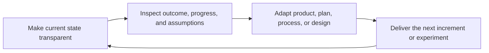
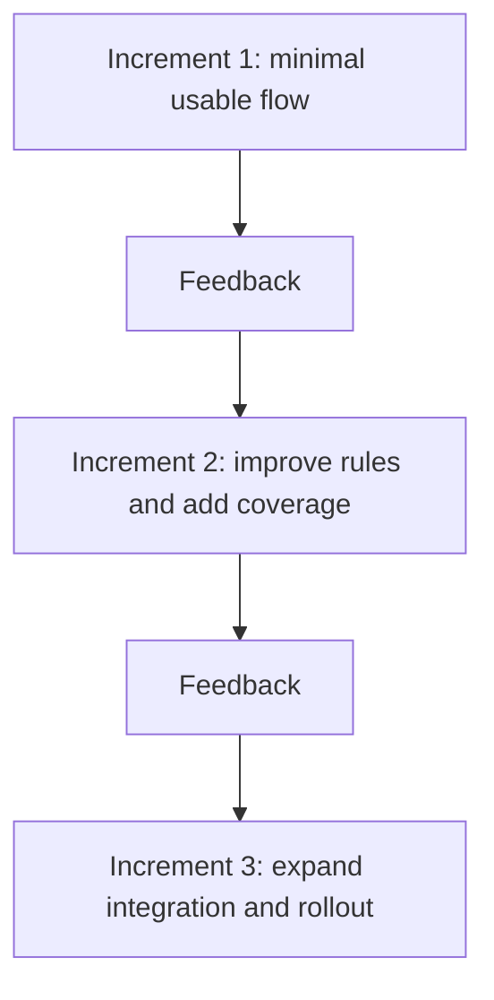
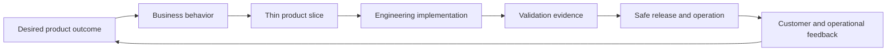

# Part 001 — Agile Mindset, Empiricism, and Iterative Product Delivery

## Positioning

Part ini membangun fondasi mental sebelum membahas event, role, backlog, estimation, atau planning.

Targetnya bukan membuat Anda mampu mengulang slogan Agile. Targetnya adalah membuat Anda mampu membaca **delivery system** sebagai sebuah sistem keputusan di bawah ketidakpastian:

- apa yang sedang diasumsikan;
- bukti apa yang tersedia;
- feedback apa yang belum diperoleh;
- risiko apa yang bertambah karena batch terlalu besar;
- keputusan apa yang dapat dibuat secara reversible;
- dan kapan tim harus mengubah arah.

Dalam konteks produk enterprise seperti Quote & Order, Agile bukan alasan untuk bekerja tanpa desain, dokumentasi, kontrol perubahan, atau disiplin operasional. Agile justru menuntut semua itu dilakukan secara **proporsional, transparan, dan berorientasi pada feedback**.

> **Core thesis:** Agile adalah kemampuan organisasi untuk mengubah informasi baru menjadi keputusan delivery yang lebih baik, dengan biaya perubahan yang tetap terkendali.

---

## 1. Mengapa Agile Ada

### 1.1 Masalah dasarnya bukan “project management”

Masalah utama dalam complex product development adalah bahwa pengetahuan penting sering muncul **setelah** pekerjaan dimulai.

Pada awal sebuah inisiatif, tim biasanya belum mengetahui secara lengkap:

- apakah problem statement sudah benar;
- apakah workflow pengguna benar-benar dipahami;
- apakah business rule lengkap;
- apakah integrasi eksternal berperilaku seperti dokumentasinya;
- apakah data produksi memiliki variasi yang tidak muncul di test environment;
- apakah rancangan teknis cukup operable;
- apakah stakeholder mengartikan requirement dengan cara yang sama;
- apakah perubahan akan menciptakan regression di area yang tidak terlihat;
- apakah solusi dapat dirilis dengan aman ke seluruh tenant atau customer;
- dan apakah hasil yang dibangun benar-benar mengubah outcome.

Dokumen awal dapat membantu, tetapi dokumen tidak menghapus uncertainty. Ia hanya membuat sebagian uncertainty terlihat.

Karena itu, delivery model yang efektif harus mampu:

1. menghasilkan bukti lebih awal;
2. membatasi ukuran kegagalan;
3. memperpendek waktu antara asumsi dan validasi;
4. membuat keadaan pekerjaan terlihat;
5. dan memungkinkan perubahan keputusan tanpa menghancurkan keseluruhan rencana.

Itulah problem space Agile.

### 1.2 Empat jenis uncertainty

Seorang senior engineer sebaiknya memisahkan uncertainty menjadi beberapa kelas.

| Jenis uncertainty | Contoh | Cara mengurangi |
|---|---|---|
| **Problem uncertainty** | Kita belum yakin masalah pelanggan yang paling penting | Product discovery, interview, usage data, prototype |
| **Requirement uncertainty** | Business rule, exception, atau acceptance condition belum lengkap | Example mapping, domain refinement, executable examples |
| **Solution uncertainty** | Belum yakin architecture atau integration approach akan bekerja | Spike, thin vertical slice, contract test, proof of concept |
| **Delivery uncertainty** | Belum yakin pekerjaan dapat selesai dan dirilis dalam window tertentu | Slicing, dependency readiness, flow metrics, staged rollout |
| **Operational uncertainty** | Belum tahu bagaimana perubahan berperilaku di production | Observability, canary, feature flag, rollback, runbook |
| **Outcome uncertainty** | Belum tahu apakah increment menghasilkan manfaat | Product metrics, customer feedback, review, experiment |

Kesalahan umum adalah memperlakukan semua uncertainty sebagai “kurang detail requirement”. Akibatnya tim menambah dokumen, meeting, dan approval, tetapi uncertainty yang sebenarnya—misalnya integration behavior atau production operability—tetap tidak disentuh.

### 1.3 Complicated versus complex

Tidak semua pekerjaan sama.

- **Complicated work** dapat dianalisis dengan keahlian dan decomposition. Contohnya, memperbarui library dengan migration guide yang jelas.
- **Complex work** memiliki hubungan sebab-akibat yang baru benar-benar terlihat setelah eksperimen atau interaksi sistem. Contohnya, perubahan alur quote yang menyentuh pricing rule, approval, downstream order submission, customer configuration, dan operational support.
- **Chaotic work** membutuhkan stabilisasi segera sebelum analisis mendalam. Contohnya, incident produksi besar.
- **Obvious work** mengikuti prosedur yang stabil dan berulang.

Scrum terutama relevan untuk complex work. Namun sebuah tim enterprise hampir selalu menangani campuran keempatnya. Karena itu, jangan memaksa semua pekerjaan masuk pola yang sama.

Contoh:

- incident kritis tidak seharusnya menunggu Sprint Planning;
- routine certificate rotation mungkin lebih cocok sebagai standard work;
- discovery tentang pricing behavior dapat membutuhkan eksperimen;
- migration lintas tenant membutuhkan sequencing dan governance yang lebih kuat.

### 1.4 Feedback economics

Feedback memiliki nilai ekonomi.

Semakin lama sebuah asumsi tidak diuji:

- semakin banyak code, test, data, dan dokumentasi yang bergantung padanya;
- semakin banyak tim lain yang membangun di atasnya;
- semakin mahal perubahan;
- semakin sulit memisahkan sunk cost dari keputusan rasional;
- dan semakin besar blast radius jika asumsi itu salah.

Secara konseptual:

```text
Cost of correction ≈ batch size × dependency depth × time-to-feedback × rollout exposure
```

Ini bukan rumus numerik. Ini adalah model berpikir.

Jika Anda ingin menurunkan cost of correction, Anda dapat:

- memperkecil batch;
- mengurangi dependency yang harus berubah bersamaan;
- mempercepat feedback;
- atau membatasi exposure melalui feature flag dan staged rollout.

---

## 2. Agile Manifesto: Nilai, Bukan Larangan

Agile Manifesto memuat empat pasangan nilai. Kalimat pentingnya adalah bahwa elemen di sisi kanan tetap memiliki nilai, tetapi elemen di sisi kiri dihargai lebih tinggi.

### 2.1 Individuals and interactions over processes and tools

Interpretasi yang matang:

- process dan tool harus memperkuat kolaborasi;
- process tidak boleh menggantikan judgment;
- tool tidak boleh menjadi satu-satunya sumber komunikasi;
- status field tidak boleh menggantikan percakapan ketika ambiguity tinggi;
- dan authority tidak boleh tersembunyi di balik workflow tool.

Interpretasi yang lemah:

- “Tidak perlu process.”
- “Tidak perlu dokumentasi decision.”
- “Semua cukup dibicarakan.”
- “Board tidak harus akurat.”

Pada tim distributed enterprise, interaksi yang baik justru membutuhkan:

- written context;
- decision record;
- response expectation;
- channel convention;
- dan artifact yang dapat dipahami tanpa hadir di semua meeting.

### 2.2 Working software over comprehensive documentation

“Working software” tidak sama dengan “code compiles”.

Untuk produk enterprise, sesuatu baru layak disebut working ketika cukup banyak kondisi berikut terpenuhi:

- behavior sesuai acceptance criteria;
- terintegrasi dengan dependency yang relevan;
- memiliki test evidence;
- dapat diobservasi;
- kompatibel dengan consumer yang harus didukung;
- memiliki migration dan rollback plan bila diperlukan;
- aman dioperasikan;
- dan dapat digunakan dalam konteks nyata.

Dokumentasi yang dibutuhkan tetap harus dibuat, terutama ketika menyangkut:

- public contract;
- operational runbook;
- support diagnosis;
- security control;
- migration;
- architectural decision;
- customer-visible behavior;
- dan regulatory evidence.

Anti-pattern-nya bukan dokumentasi. Anti-pattern-nya adalah dokumentasi yang besar tetapi tidak mengurangi risiko keputusan.

### 2.3 Customer collaboration over contract negotiation

Pada enterprise product, kontrak tetap penting. Namun kontrak tidak dapat menggantikan continuous clarification.

Customer collaboration berarti:

- memahami problem dan consequence;
- memvalidasi interpretation;
- menunjukkan increment;
- mengungkap limitation;
- dan mengadaptasi backlog berdasarkan feedback.

Bukan berarti:

- semua customer request otomatis menjadi priority;
- customer dapat mengubah sprint scope tanpa trade-off;
- atau tim menjanjikan behavior yang belum dianalisis.

Senior engineer membantu menjaga percakapan tetap konkret:

- behavior apa yang berubah;
- siapa yang terdampak;
- compatibility apa yang dibutuhkan;
- data apa yang berubah;
- bagaimana rollout dilakukan;
- dan bukti apa yang membuktikan requirement terpenuhi.

### 2.4 Responding to change over following a plan

Plan adalah alat koordinasi, bukan kebenaran absolut.

Plan yang baik memuat:

- tujuan;
- asumsi;
- dependency;
- confidence;
- decision point;
- dan trigger untuk replan.

Perubahan tidak selalu harus diterima. Perubahan harus dievaluasi.

Pertanyaan yang tepat:

1. Informasi baru apa yang muncul?
2. Apakah informasi itu mengubah expected value atau risk?
3. Apa biaya perubahan sekarang?
4. Apa konsekuensi jika perubahan ditunda?
5. Apakah sprint goal masih relevan?
6. Scope mana yang dapat dilepas?
7. Siapa yang memiliki keputusan?

“Agile” bukan alasan untuk menerima semua perubahan secara impulsif. Agile adalah kemampuan untuk **merespons perubahan secara sadar**.

---

## 3. Agile Mindset sebagai Operating Invariants

Mindset sering terdengar abstrak. Supaya operasional, gunakan invariant berikut.

### 3.1 Reality over narrative

Keadaan aktual lebih penting daripada cerita status.

Jika sebuah story masih menunggu integration test, maka ia belum selesai walaupun implementation “90% complete”.

Jika demo hanya memakai stub tetapi production membutuhkan live dependency, maka bukti yang dimiliki baru membuktikan sebagian.

Jika release tidak dapat diobservasi, tim belum memiliki operational confidence yang cukup.

### 3.2 Evidence over confidence

Confidence individu bukan evidence.

Evidence dapat berupa:

- running increment;
- test result;
- trace;
- metric;
- customer feedback;
- compatibility check;
- production-like validation;
- rollback rehearsal;
- atau result dari experiment.

Senior engineer harus mampu mengatakan:

> “Saya cukup yakin approach ini benar, tetapi evidence yang belum kita miliki adalah behavior consumer lama saat field baru dikirim.”

Kalimat seperti itu bukan kelemahan. Itu risk clarity.

### 3.3 Small reversible decisions over large irreversible bets

Keputusan besar sebaiknya dipisahkan menjadi bagian yang:

- dapat divalidasi;
- dapat dibatalkan;
- dan memiliki blast radius terbatas.

Contoh:

Daripada langsung mengganti semua pricing integration:

1. definisikan compatibility contract;
2. implementasikan satu path;
3. jalankan dual-read atau shadow mode;
4. ukur mismatch;
5. rollout ke subset;
6. baru hentikan path lama.

### 3.4 Finish over start

Memulai banyak item menciptakan progress illusion.

Value baru tersedia ketika sesuatu:

- selesai;
- terintegrasi;
- tervalidasi;
- dan cukup siap untuk digunakan atau dirilis.

Senior engineer yang efektif membantu tim mengurangi work in progress, bukan hanya mengambil ticket sulit berikutnya.

### 3.5 Outcome over output

Output:

- jumlah story;
- jumlah endpoint;
- jumlah commit;
- jumlah dashboard;
- jumlah test case.

Outcome:

- waktu quote berkurang;
- error pricing turun;
- approval exception dapat ditangani;
- deployment lebih aman;
- support diagnosis lebih cepat;
- atau customer onboarding lebih sedikit membutuhkan intervensi manual.

Output diperlukan, tetapi output bukan alasan akhir investasi.

### 3.6 Shared understanding over handoff completeness

Tidak ada dokumen yang mampu menggantikan shared understanding pada complex work.

Handoff pattern yang lemah:

```text
PO writes requirement
    -> developer implements
        -> QA interprets acceptance
            -> support discovers operational gap
```

Kolaborasi yang lebih sehat:

```text
PO + engineer + QA + relevant specialists
    -> discover examples and risks
    -> agree thin slice and evidence
    -> build and inspect increment
    -> adapt backlog and operating knowledge
```

### 3.7 Sustainable delivery over heroic recovery

Heroics dapat menyelamatkan satu release, tetapi jika menjadi operating model, sistem sedang rusak.

Signal hero-driven system:

- satu orang selalu dibutuhkan untuk merge;
- senior engineer menjadi default incident resolver;
- test hanya stabil jika dijalankan manual;
- deployment membutuhkan tribal knowledge;
- sprint selesai melalui overtime;
- dependency baru diketahui di akhir;
- dan retrospective mengulang masalah yang sama.

---

## 4. Empiricism: Transparency, Inspection, Adaptation

Scrum dibangun di atas empiricism. Keputusan dibuat berdasarkan apa yang diketahui melalui observation dan experience, bukan hanya prediction.

### 4.1 Loop empiris



Ketiga pilar harus ada.

- Transparency tanpa inspection menghasilkan dashboard.
- Inspection tanpa adaptation menghasilkan meeting.
- Adaptation tanpa transparency menghasilkan reaction dan politics.

### 4.2 Transparency

Transparency bukan sekadar board dapat dilihat.

Transparency berarti keadaan penting dipahami secara cukup konsisten oleh pihak yang mengambil keputusan.

Contoh transparency yang diperlukan:

- apakah story benar-benar memenuhi Definition of Done;
- dependency mana yang belum committed;
- test apa yang belum berjalan;
- apakah demo menggunakan mock;
- apakah release membutuhkan manual intervention;
- apakah scope berubah;
- risk mana yang diterima;
- dan apakah sprint goal terancam.

#### Transparency failure

| Smell | Risiko |
|---|---|
| Semua item hijau sampai sehari sebelum sprint berakhir | Masalah terlambat terlihat |
| Blocked work tetap berada di “In Progress” | Aging dan dependency tersembunyi |
| “Done” berarti coding selesai | Quality dan integration debt menumpuk |
| Demo tidak menjelaskan limitation | Stakeholder membuat keputusan dari evidence palsu |
| Board hanya diperbarui sebelum daily | Artifact tidak merepresentasikan reality |

#### Senior engineer contribution

- gunakan bahasa status yang presisi;
- bedakan implemented, integrated, validated, releasable, dan released;
- tampilkan unknown secara eksplisit;
- jangan menyamarkan dependency sebagai “sedang dikoordinasikan”;
- dan koreksi board ketika realitas berubah.

### 4.3 Inspection

Inspection adalah evaluasi terarah terhadap artifact, progress, outcome, atau cara kerja.

Inspection yang baik memiliki:

- objek yang jelas;
- evidence;
- audience yang relevan;
- decision horizon;
- dan kemungkinan untuk mengubah sesuatu.

Contoh:

- Daily Scrum menginspeksi progress terhadap Sprint Goal.
- Sprint Review menginspeksi increment dan perubahan konteks.
- Retrospective menginspeksi efektivitas tim dan delivery system.
- CI menginspeksi kualitas teknis secara otomatis.
- Observability menginspeksi behavior runtime.
- Product analytics menginspeksi outcome.

#### Inspection theater

Inspection berubah menjadi theater ketika:

- output sudah diputuskan sebelum meeting;
- masalah terlihat tetapi tidak ada decision owner;
- hanya successful path yang ditampilkan;
- metric dipresentasikan tanpa interpretation;
- atau peserta tidak memiliki konteks dan authority.

### 4.4 Adaptation

Adaptation adalah perubahan yang dibuat karena hasil inspection.

Bentuk adaptation:

- memperjelas acceptance criteria;
- memecah story;
- menurunkan scope;
- mengganti sequencing;
- menambah spike;
- memperbaiki build pipeline;
- mengubah working agreement;
- menghentikan feature yang tidak memberi outcome;
- atau mengubah rollout strategy.

Adaptation harus proporsional. Tidak setiap informasi baru membutuhkan perubahan besar.

Gunakan pertanyaan:

- Apa yang sekarang kita ketahui?
- Keputusan sebelumnya mana yang terpengaruh?
- Apa perubahan terkecil yang menghasilkan manfaat?
- Bagaimana kita tahu perubahan itu bekerja?
- Kapan kita akan menginspeksinya lagi?

### 4.5 Latency loop

Efektivitas empiricism sangat dipengaruhi latency.

```text
Decision latency
+ build latency
+ review latency
+ test latency
+ deployment latency
+ feedback latency
= total learning latency
```

Tim dapat memiliki sprint dua minggu tetapi learning latency tiga bulan jika increment baru benar-benar digunakan setelah release train kuartalan.

Karena itu, jangan hanya bertanya:

> “Berapa lama sprint kita?”

Tanyakan juga:

> “Berapa lama dari asumsi dibuat sampai kita memperoleh evidence yang cukup untuk mengubah keputusan?”

---

## 5. Iterative, Incremental, dan Continuous Delivery

Istilah ini sering dicampur.

### 5.1 Iterative

Iterative berarti solusi dikembangkan melalui revisi berulang.

Contoh:

- rule model diperbaiki setelah domain review;
- UI prototype diubah setelah feedback;
- architecture approach disesuaikan setelah spike;
- acceptance criteria diperluas setelah example discovery.

Iteration memperbaiki sesuatu yang sudah ada.

### 5.2 Incremental

Incremental berarti capability bertambah melalui bagian yang terintegrasi.

Contoh Quote & Order generik:

- increment 1: create quote dengan satu product type;
- increment 2: tambah validation rule;
- increment 3: tambah approval path;
- increment 4: tambah downstream order submission;
- increment 5: tambah operational monitoring.

Increment bukan layer teknis yang berdiri sendiri.

Horizontal component seperti “database schema selesai” dapat menjadi progress internal, tetapi belum tentu product increment.

### 5.3 Iterative dan incremental bersama



Setiap increment menambah capability. Setiap feedback memperbaiki arah.

### 5.4 Continuous delivery

Continuous delivery adalah capability teknis dan operasional untuk membuat perubahan dapat dirilis secara aman dan sering.

Scrum tidak mensyaratkan deployment setiap sprint. Namun tanpa deployment capability yang baik, organisasi akan kesulitan memperoleh feedback cepat.

Continuous delivery membutuhkan hal seperti:

- automated build dan test;
- repeatable deployment;
- environment consistency;
- feature flag;
- observability;
- rollback atau roll-forward strategy;
- compatibility discipline;
- dan small batch.

### 5.5 Cadence versus flow

Sprint memberikan cadence untuk planning, inspection, dan adaptation.

Flow tetap terjadi di dalam sprint.

Kesalahan umum:

- menganggap semua item harus dimulai bersamaan;
- menunggu akhir sprint untuk integration;
- melakukan QA hanya pada hari terakhir;
- atau menunda merge karena “belum waktunya release”.

Sprint bukan batch container. Sprint adalah timebox untuk mencapai goal melalui flow yang terus berlangsung.

---

## 6. Product Increment: Unit Nyata dari Progress

### 6.1 Apa itu increment

Increment adalah langkah konkret menuju Product Goal dan harus dapat digunakan.

Implikasinya:

- terintegrasi dengan increment sebelumnya;
- memenuhi Definition of Done;
- tidak merusak value yang sudah tersedia;
- dan cukup nyata untuk diinspeksi.

Sebuah sprint dapat menghasilkan lebih dari satu increment.

### 6.2 “Usable” tidak selalu berarti “publicly released”

Dalam enterprise product, increment dapat usable tetapi belum dirilis secara luas karena:

- customer rollout window;
- commercial enablement;
- migration sequencing;
- security approval;
- tenant configuration;
- release train;
- atau dependency eksternal.

Namun alasan tersebut tidak boleh menyamarkan bahwa increment sebenarnya belum:

- integrated;
- tested;
- supportable;
- atau operable.

Gunakan vocabulary yang presisi:

| Status | Arti |
|---|---|
| **Implemented** | Code utama tersedia |
| **Integrated** | Berfungsi dengan komponen terkait |
| **Validated** | Acceptance dan quality evidence tersedia |
| **Releasable** | Memenuhi DoD dan release prerequisites |
| **Released** | Dideploy ke target environment/customer |
| **Adopted** | Benar-benar digunakan |
| **Outcome observed** | Dampak terukur tersedia |

### 6.3 Increment versus milestone

Milestone dapat penting tanpa menjadi increment.

Contoh milestone:

- architecture decision selesai;
- test environment tersedia;
- data mapping disepakati;
- vendor contract disetujui.

Milestone membantu delivery, tetapi tidak otomatis memberikan product capability.

Jangan mencampur keduanya dalam status.

### 6.4 Increment untuk invisible work

Backend atau operational work tetap dapat menghasilkan increment.

Contoh:

- API baru yang digunakan consumer internal;
- audit event yang dapat diverifikasi;
- alert yang mendeteksi stuck order;
- migration tool yang dapat dijalankan secara aman;
- fallback mechanism yang menurunkan failure impact;
- compatibility adapter yang memungkinkan rollout bertahap.

Value harus dijelaskan melalui behavior dan consequence, bukan hanya komponen teknis.

---

## 7. Mental Model untuk Enterprise Quote & Order

Gunakan model berikut untuk membaca sebuah perubahan.



### 7.1 Desired product outcome

Contoh:

- mengurangi manual intervention;
- meningkatkan conversion;
- mengurangi invalid order;
- mempercepat onboarding product;
- meningkatkan auditability;
- atau menurunkan support effort.

### 7.2 Business behavior

Definisikan behavior yang harus berubah:

- siapa actor-nya;
- trigger;
- rule;
- exception;
- state transition;
- dan observable result.

### 7.3 Thin product slice

Cari slice terkecil yang:

- end-to-end;
- dapat diuji;
- mengurangi uncertainty;
- dan memiliki rollback atau containment.

### 7.4 Engineering implementation

Pilih implementation yang cukup untuk slice tersebut, tanpa membangun seluruh future architecture secara spekulatif.

### 7.5 Validation evidence

Tentukan di awal:

- test;
- example;
- contract check;
- metric;
- trace;
- audit event;
- atau demo evidence.

### 7.6 Safe release and operation

Tanyakan:

- bagaimana perubahan diaktifkan;
- bagaimana diketahui jika gagal;
- bagaimana rollback;
- siapa yang mendukung;
- dan bagaimana compatibility dijaga.

### 7.7 Feedback

Feedback bukan hanya komentar stakeholder.

Feedback juga berasal dari:

- runtime behavior;
- defect;
- support ticket;
- latency;
- retry pattern;
- operational toil;
- user behavior;
- dan business metric.

---

## 8. Product Thinking untuk Senior Engineer

Senior engineer tidak menggantikan Product Owner. Namun senior engineer harus memahami product consequence dari keputusan teknis.

### 8.1 Dari requirement ke consequence

Jangan berhenti pada:

> “Kita perlu menambah field baru.”

Tanyakan:

- keputusan bisnis apa yang membutuhkan field itu;
- siapa producer dan consumer;
- bagaimana default untuk data lama;
- apakah field optional atau conditionally required;
- bagaimana auditability;
- apa dampak compatibility;
- dan bagaimana user mengetahui error.

### 8.2 Dari architecture ke option value

Architecture yang baik tidak hanya “clean”. Ia menjaga pilihan tetap terbuka pada biaya yang masuk akal.

Contoh option value:

- capability untuk rollout per tenant;
- kemampuan mendukung schema version;
- ability to replay safely;
- separation yang memungkinkan independent release;
- atau observability yang mempercepat diagnosis.

Tetapi option value juga memiliki cost. Jangan membangun extensibility tanpa evidence.

### 8.3 Dari technical debt ke delivery risk

Technical debt menjadi product concern ketika memengaruhi:

- lead time;
- defect risk;
- change failure;
- support cost;
- security exposure;
- scalability;
- compliance;
- atau ability to deliver roadmap.

Pernyataan lemah:

> “Code ini jelek dan harus direfactor.”

Pernyataan kuat:

> “Setiap perubahan pricing rule menyentuh tiga path duplikat. Dua defect terakhir berasal dari behavior yang divergen. Refactoring terbatas pada rule evaluation boundary akan mengurangi regression surface sebelum roadmap menambah empat rule baru.”

---

## 9. Kapan Agile Tidak Menolong

Agile bukan jawaban universal.

### 9.1 Tidak ada product authority

Jika tidak ada pihak yang dapat mengurutkan kebutuhan atau menerima trade-off, tim hanya memiliki queue stakeholder.

Scrum tidak dapat menggantikan missing product governance.

### 9.2 Tidak ada access ke feedback

Jika tim tidak dapat:

- berbicara dengan representative stakeholder;
- melihat usage;
- mengamati production;
- atau memvalidasi behavior;

maka empirical loop menjadi lemah.

### 9.3 Arsitektur dan organisasi menolak small batch

Jika setiap perubahan membutuhkan:

- release bersama banyak tim;
- approval panjang;
- manual environment setup;
- dan big-bang migration;

maka sprint cadence tidak otomatis menghasilkan agility.

### 9.4 Semua keputusan sudah fixed tetapi risiko tetap disembunyikan

Kadang scope, date, dan budget semuanya diperlakukan fixed. Dalam kondisi itu, uncertainty tidak hilang; ia hanya dipindahkan menjadi:

- quality reduction;
- hidden overtime;
- defect;
- atau missed expectation.

### 9.5 Work bersifat routine dan stabil

Untuk standard operational work, Kanban atau explicit service workflow mungkin lebih tepat daripada sprint commitment.

---

## 10. Anti-Patterns dan Failure Modes

### 10.1 “Agile means no planning”

**Failure:** dependency dan release constraint ditemukan terlambat.

**Correction:** lakukan planning sebagai hypothesis dan coordination mechanism; nyatakan assumptions dan review points.

### 10.2 “We can change anything anytime”

**Failure:** sprint goal kehilangan makna, WIP naik, team constantly context-switching.

**Correction:** evaluasi perubahan terhadap value, urgency, cost, dan goal. Negosiasikan scope.

### 10.3 “Documentation is not Agile”

**Failure:** decision hilang, support bergantung pada tribal knowledge, remote team tidak sinkron.

**Correction:** dokumentasikan informasi yang memiliki half-life panjang atau decision consequence tinggi.

### 10.4 “Every two weeks is Agile”

**Failure:** organisasi bekerja dalam mini-waterfall dua mingguan.

**Correction:** periksa feedback latency, integration frequency, dan adaptability, bukan hanya cadence.

### 10.5 “Story completed equals value delivered”

**Failure:** output meningkat, outcome tidak berubah.

**Correction:** hubungkan story ke expected behavior dan outcome signal.

### 10.6 “Senior engineer knows the answer”

**Failure:** tim berhenti mengeksplorasi; bottleneck dan authority concentration terbentuk.

**Correction:** senior engineer membuat uncertainty terlihat, menawarkan options, dan membangun capability keputusan tim.

### 10.7 “Transparency means reporting everything”

**Failure:** noise, dashboard overload, dan update fatigue.

**Correction:** tampilkan informasi yang memengaruhi decision, risk, flow, atau expectation.

---

## 11. Process Smell Detection

Gunakan diagnostic lens berikut.

### 11.1 Feedback smell

- stakeholder hanya melihat hasil di akhir release;
- review tidak mengubah backlog;
- production feedback tidak masuk planning;
- customer request kehilangan context saat menjadi ticket.

### 11.2 Batch smell

- sebagian besar story selesai pada hari terakhir;
- merge dilakukan menjelang sprint end;
- QA menerima banyak item sekaligus;
- release membawa terlalu banyak perubahan untuk diisolasi.

### 11.3 Transparency smell

- board tidak sesuai keadaan;
- blocker tidak memiliki owner;
- item “almost done” berulang;
- incomplete work didemokan sebagai selesai.

### 11.4 Adaptation smell

- retrospective memiliki action yang sama berulang;
- forecast salah dengan pola sama tetapi process tidak berubah;
- defect class yang sama terus muncul;
- dependency selalu menjadi surprise.

### 11.5 Outcome smell

- roadmap mengukur feature count;
- tidak ada success signal;
- stakeholder hanya menanyakan velocity;
- observability work dianggap tidak memiliki value.

---

## 12. Senior Engineer Operating Model

### 12.1 Sebelum pekerjaan dimulai

Senior engineer membantu tim:

- memperjelas problem dan behavior;
- menemukan dependency;
- mengungkap integration risk;
- mengidentifikasi quality attributes;
- memisahkan discovery dari implementation;
- dan merancang thin slice.

### 12.2 Saat pekerjaan berjalan

Senior engineer:

- menjaga board dan status sesuai realitas;
- membantu item lama selesai;
- mengurangi review latency;
- melakukan pairing pada area berisiko;
- memvalidasi assumption lebih awal;
- dan mengeskalasi blocker dengan option.

### 12.3 Saat increment diinspeksi

Senior engineer:

- menjelaskan evidence dan limitation;
- menghubungkan technical behavior ke product consequence;
- tidak menyembunyikan incomplete integration;
- dan membantu menangkap feedback menjadi backlog.

### 12.4 Saat sistem gagal

Senior engineer:

- fokus pada containment dan recovery;
- menjaga komunikasi factual;
- menghindari blame;
- memisahkan trigger, contributing condition, dan systemic weakness;
- dan memastikan learning diterjemahkan menjadi change.

### 12.5 Batas penting

Senior engineer bukan:

- shadow Product Owner;
- approval gate untuk semua keputusan;
- default owner semua incident;
- satu-satunya reviewer;
- atau orang yang “menyelamatkan sprint” melalui overtime.

Ukuran keberhasilan senior engineer adalah meningkatnya capability tim, bukan meningkatnya ketergantungan tim kepadanya.

---

## 13. Worked Example: Perubahan Approval pada Quote

### 13.1 Request awal

> “Tambahkan approval jika discount lebih dari 20%.”

Kelihatannya sederhana. Tetapi request ini membawa uncertainty:

- 20% dihitung dari harga apa;
- apakah per line item atau total quote;
- bagaimana bundled product;
- apakah existing approval tetap berlaku;
- siapa approver;
- apa yang terjadi jika approver tidak tersedia;
- apakah quote dapat diedit setelah approval;
- apakah re-approval diperlukan;
- bagaimana audit;
- bagaimana downstream system mengetahui status;
- dan bagaimana existing quote diperlakukan.

### 13.2 Waterfall-like response

1. Tulis specification lengkap.
2. Implement seluruh flow.
3. Integrasikan.
4. QA di akhir.
5. Demo.
6. Temukan bahwa customer sebenarnya membutuhkan threshold per product category.

Batch salah sudah terlalu besar.

### 13.3 Empirical response

1. Klarifikasi satu customer scenario representatif.
2. Buat example mapping.
3. Pilih thin slice: satu category, satu threshold, satu approver group.
4. Implement state transition dan audit evidence.
5. Demo dengan realistic example.
6. Validasi apakah calculation dan workflow benar.
7. Perluas category, exception, dan rollout.

### 13.4 Evidence ladder

| Tahap | Evidence |
|---|---|
| Domain understanding | Example disepakati |
| Solution feasibility | Spike atau contract test |
| Behavioral correctness | Automated acceptance tests |
| Integration | End-to-end test |
| Operability | Metrics, logs, audit event |
| Product usefulness | Stakeholder/customer feedback |
| Outcome | Reduction in manual exception atau faster approval |

---

## 14. Decision Framework: Seberapa Kecil Slice yang Cukup?

Gunakan lima pertanyaan.

1. **Value:** Apakah slice menghasilkan behavior yang dapat dinilai?
2. **Learning:** Apakah slice menguji assumption penting?
3. **Integration:** Apakah ia menyentuh boundary nyata, bukan hanya mock internal?
4. **Safety:** Apakah dapat diaktifkan atau dibatalkan secara aman?
5. **Expandability:** Apakah hasilnya dapat dikembangkan tanpa dibuang total?

Slice terlalu kecil jika:

- tidak dapat divalidasi end-to-end;
- tidak mengurangi uncertainty;
- atau hanya memindahkan pekerjaan ke sprint berikutnya.

Slice terlalu besar jika:

- memiliki banyak independent assumption;
- membutuhkan semua variation sekaligus;
- atau kegagalannya sulit diisolasi.

---

## 15. Delivery Quality sebagai Sistem

Engineering quality dan delivery speed bukan lawan langsung.

Quality practices tertentu memperlambat satu langkah tetapi mempercepat sistem.

Contoh:

| Practice | Biaya lokal | Manfaat sistem |
|---|---|---|
| Contract test | Waktu menulis test | Mengurangi integration rework |
| Feature flag | Complexity tambahan | Rollout dan rollback lebih aman |
| Small PR | Lebih banyak PR | Review lebih cepat dan risiko lebih kecil |
| Observability | Instrumentation effort | Diagnosis dan feedback runtime lebih cepat |
| ADR ringkas | Waktu dokumentasi | Mengurangi repeated debate dan context loss |
| Automated migration check | Build lebih lama | Menurunkan production failure |

Senior engineer harus mengoptimalkan **total delivery system**, bukan hanya coding throughput.

---

## 16. Internal Verification Checklist

Bagian berikut harus diverifikasi terhadap cara kerja aktual tim. Jangan diasumsikan sebagai proses internal CSG.

### Product dan feedback

- Apa Product Goal atau product direction yang aktif?
- Siapa pihak yang benar-benar memiliki priority decision?
- Dari mana customer dan stakeholder feedback masuk?
- Seberapa cepat feedback Sprint Review atau production menjadi backlog change?
- Outcome signal apa yang digunakan selain completion ticket?
- Apakah product usage atau operational data tersedia untuk engineer?

### Sprint dan increment

- Berapa panjang sprint?
- Apa definisi increment yang usable untuk tim?
- Apakah tim dapat menghasilkan lebih dari satu increment dalam sprint?
- Apakah “Done” berarti releasable atau hanya selesai development?
- Seberapa sering increment dirilis?
- Apa perbedaan release cadence dan sprint cadence?

### Transparency

- Board mana yang menjadi source of truth?
- Apa arti setiap workflow state?
- Bagaimana blocked work ditandai?
- Bagaimana dependency, risk, dan scope change dicatat?
- Apakah status implemented, integrated, tested, releasable, dan released dibedakan?
- Siapa yang memperbarui board dan kapan?

### Inspection dan adaptation

- Apa yang biasanya diinspeksi dalam Daily Scrum, Sprint Review, dan Retrospective?
- Contoh keputusan apa yang berubah karena event tersebut?
- Di mana retrospective action dilacak?
- Bagaimana feedback dari incident, support, dan release dimasukkan ke backlog?
- Apakah ada process smell yang berulang tanpa owner?

### Engineering delivery

- Bagaimana PR, CI, test, QA, release, dan deployment flow bekerja?
- Apa feedback loop yang paling lambat?
- Apa bottleneck paling umum?
- Apakah feature flag, staged rollout, rollback, dan observability lazim digunakan?
- Apa evidence yang diperlukan untuk production-sensitive change?
- Bagaimana compatibility terhadap API, event, data, dan customer configuration dijaga?

### Remote/distributed work

- Apa overlap hour tim?
- Kapan komunikasi harus synchronous?
- Di mana keputusan durable dicatat?
- Bagaimana handoff lintas zona waktu dilakukan?
- Apa response expectation untuk review, blocker, dan incident?

---

## 17. Practical Exercises

### Exercise 1 — Reframe output menjadi outcome

Ambil tiga item backlog.

Untuk masing-masing, tulis:

```text
Output:
Expected behavior:
Affected actor:
Expected outcome:
Evidence:
Risk if wrong:
Fastest useful feedback:
```

### Exercise 2 — Map empirical loop

Pilih satu feature yang baru selesai.

Identifikasi:

```text
Transparency mechanism:
Inspection point:
Adaptation made:
Total learning latency:
Missed feedback opportunity:
```

### Exercise 3 — Detect false progress

Ambil sprint board aktif dan kelompokkan item:

- implemented;
- integrated;
- validated;
- releasable;
- released;
- outcome observed.

Perhatikan apakah banyak item berhenti pada layer awal.

### Exercise 4 — Slice by uncertainty

Pilih satu story besar.

Tuliskan uncertainty terbesarnya:

- domain;
- integration;
- data;
- operational;
- customer;
- atau delivery.

Buat slice pertama yang khusus mengurangi uncertainty tersebut.

### Exercise 5 — Senior engineer dependency test

Jawab:

- Apakah keputusan teknis menunggu saya?
- Apakah semua PR kompleks menunggu saya?
- Apakah tim memahami reasoning, atau hanya menerima conclusion?
- Apa capability yang dapat saya distribusikan minggu ini?

---

## 18. Part Completion Checklist

Anda telah menyelesaikan part ini jika mampu:

- menjelaskan Agile sebagai response terhadap uncertainty, bukan sekadar speed;
- membedakan Agile values dari misinterpretation;
- menjelaskan transparency, inspection, dan adaptation sebagai satu loop;
- membedakan iterative, incremental, dan continuous delivery;
- menjelaskan mengapa increment adalah unit progress yang lebih kuat daripada activity;
- mengidentifikasi feedback latency dan batch risk;
- menghubungkan engineering quality dengan product outcome;
- mendeteksi process smell dasar;
- dan menjelaskan kontribusi senior engineer tanpa mengambil alih product ownership.

---

## 19. Key Takeaways

1. Agile tidak menghilangkan planning; Agile membuat planning dapat diperbarui oleh evidence.
2. Empiricism membutuhkan transparency, inspection, dan adaptation secara bersamaan.
3. Sprint cadence tidak otomatis menghasilkan agility.
4. Small batch memperkecil cost of correction dan mempercepat learning.
5. Product increment harus usable dan terintegrasi, bukan sekadar code selesai.
6. Engineering quality adalah bagian dari delivery capability.
7. Senior engineer meningkatkan kualitas keputusan dan capability tim, bukan menjadi pusat semua keputusan.
8. Detail proses CSG Quote & Order harus diverifikasi melalui artifact, observation, dan diskusi internal.

---

## 20. References

Primary references used for the conceptual baseline:

- Ken Schwaber and Jeff Sutherland, **The Scrum Guide** (official Scrum Guides edition).
- Kent Beck et al., **Manifesto for Agile Software Development** and its principles.
- The official **Kanban Guide** for flow-oriented distinctions used in later comparisons.

These references define general concepts. They do not describe internal CSG processes.
