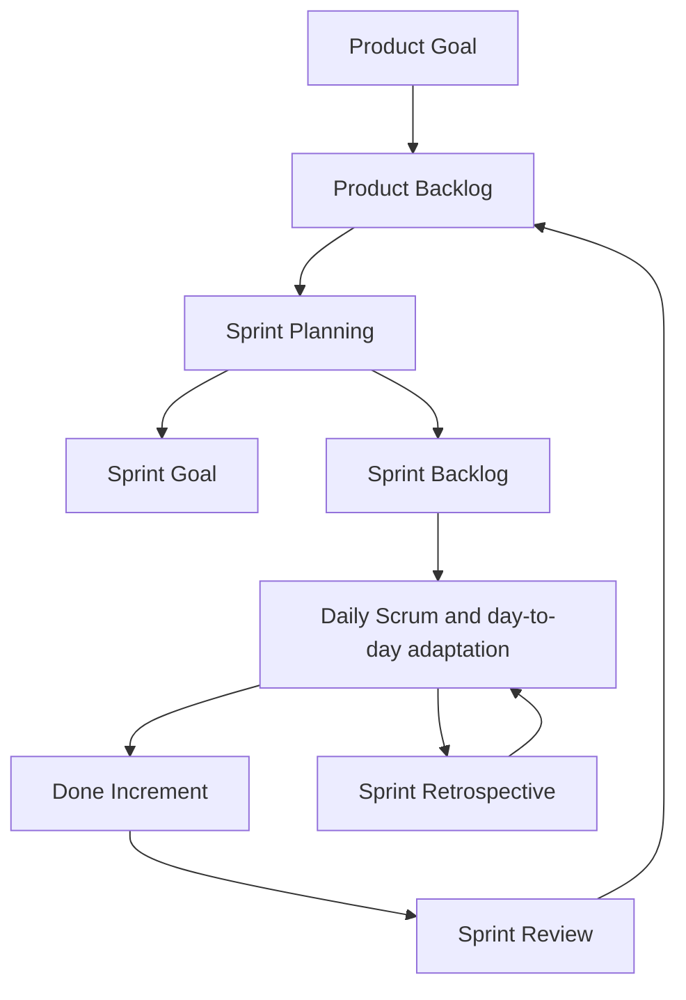
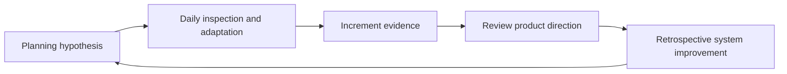

# Part 002 — Scrum Framework, Delivery Models, and Why Scrum Fails

## Positioning

Part ini memberi peta utuh Scrum sebelum seri masuk ke accountabilities, backlog, refinement, estimation, planning, execution, review, dan retrospective secara mendalam.

Scrum adalah **framework minimal** untuk menghasilkan value melalui adaptive solutions pada complex problems. Karena minimal, Scrum tidak memberi instruksi detail untuk:

- architecture;
- coding;
- testing;
- incident management;
- release governance;
- product discovery;
- stakeholder governance;
- atau organizational design.

Tim harus menambahkan praktik yang sesuai tanpa merusak transparansi, inspection, adaptation, dan self-management.

> **Core thesis:** Scrum bekerja bila event, artifact, commitment, dan accountabilities bersama-sama menciptakan feedback loop yang mengubah keputusan. Ketika elemen tersebut hanya menjadi administrasi, organisasi memiliki Scrum-shaped process tetapi tidak memiliki agility.

---

## 1. Scrum dalam Satu Model



Model ini memperlihatkan beberapa hal:

1. Product Goal memberi arah.
2. Product Backlog mengandung opsi dan kebutuhan yang diurutkan.
3. Sprint Planning membentuk Sprint Goal dan initial plan.
4. Developers mengadaptasi Sprint Backlog sepanjang sprint.
5. Daily Scrum menginspeksi progress menuju Sprint Goal.
6. Increment yang memenuhi Definition of Done menjadi evidence.
7. Sprint Review mengadaptasi product direction dan backlog.
8. Sprint Retrospective mengadaptasi cara kerja dan quality system.

Jika satu link hilang, loop melemah.

Contoh:

- tidak ada Product Goal → sprint menjadi queue ticket;
- tidak ada usable increment → review hanya status meeting;
- tidak ada adaptation → event hanya ritual;
- tidak ada self-management → planning menjadi assignment;
- Definition of Done lemah → progress tidak transparan.

---

## 2. Scrum Bukan Metodologi Lengkap

### 2.1 Framework versus methodology

Framework menyediakan struktur dan constraints minimum.

Methodology biasanya memberikan prosedur lebih rinci.

Scrum sengaja tidak menentukan:

- format user story;
- story point;
- planning poker;
- Definition of Ready;
- Jira workflow;
- branching strategy;
- release train;
- QA phase;
- architecture review;
- atau siapa yang menulis code.

Hal-hal tersebut dapat digunakan, tetapi bukan bagian normatif Scrum.

Pemisahan ini penting karena tim sering menyebut kebiasaan lokal sebagai “aturan Scrum”.

Contoh pernyataan yang perlu ditantang:

- “Scrum mewajibkan user story.”
- “Scrum mewajibkan story point.”
- “Scrum mewajibkan semua deployment di akhir sprint.”
- “Scrum Master yang membagikan task.”
- “Incomplete story harus otomatis dipindahkan.”
- “Tidak boleh mengubah Sprint Backlog.”

Pernyataan di atas bukan definisi Scrum.

### 2.2 Mengapa framework dibuat minimal

Complex work membutuhkan judgment lokal.

Tim Quote & Order yang menangani:

- customer configuration;
- integration contract;
- backward compatibility;
- production support;
- dan release governance

membutuhkan praktik berbeda dari tim consumer mobile product.

Scrum memberi cadence dan feedback structure, tetapi tim harus membangun engineering system yang sesuai.

### 2.3 Risiko “cargo-cult Scrum”

Cargo cult terjadi ketika organisasi meniru bentuk luar:

- sprint;
- daily;
- ticket;
- point;
- demo;
- retro;

tanpa memahami fungsi.

Akibatnya:

- daily menjadi reporting;
- planning menjadi assignment;
- point menjadi target;
- demo menjadi presentation;
- retro menjadi complaint session;
- backlog menjadi queue permintaan;
- dan sprint menjadi mini-project.

---

## 3. Scrum Theory: Empiricism dan Lean Thinking

Scrum dibangun di atas empiricism dan lean thinking.

### 3.1 Empiricism

Keputusan didasarkan pada apa yang diketahui.

Framework menyediakan beberapa inspection point, tetapi inspection hanya berguna jika artifact transparan.

### 3.2 Lean thinking

Lean thinking dalam konteks Scrum mendorong:

- mengurangi waste;
- fokus pada essential;
- small batch;
- quality built in;
- flow;
- dan value.

Waste pada software delivery tidak selalu berupa aktivitas yang “tidak bekerja”.

Contoh waste:

- work menunggu review;
- duplicate implementation;
- partially done work;
- repeated clarification;
- environment instability;
- excess handoff;
- build yang lambat;
- feature tidak digunakan;
- dan rework akibat feedback terlambat.

### 3.3 Hubungan empiricism dan lean

```text
Lean reduces the cost and delay of learning.
Empiricism uses learning to adapt decisions.
```

Small batch tanpa adaptation hanya menghasilkan output lebih cepat.

Inspection tanpa lean flow menghasilkan feedback yang terlambat.

---

## 4. Scrum Values sebagai Behavioral Constraints

Lima Scrum values:

- Commitment
- Focus
- Openness
- Respect
- Courage

Values bukan poster. Values adalah batas perilaku yang membuat framework dapat bekerja.

### 4.1 Commitment

Commitment terutama berarti komitmen terhadap:

- goal;
- quality;
- collaboration;
- dan professional accountability.

Bukan janji bahwa semua initial scope pasti selesai terlepas dari informasi baru.

**Healthy behavior**

- tim melindungi Sprint Goal;
- risiko diangkat lebih awal;
- bantuan diberikan pada item kritis;
- quality tidak diam-diam dikurangi.

**Failure mode**

- commitment diterjemahkan sebagai scope contract;
- engineer menyembunyikan masalah agar tidak dianggap gagal;
- overtime dipakai untuk mempertahankan forecast palsu.

### 4.2 Focus

Focus berarti mengarahkan energi ke hal yang paling penting sekarang.

**Healthy behavior**

- WIP dibatasi;
- tim menyelesaikan item sebelum memulai yang baru;
- sprint goal digunakan untuk trade-off.

**Failure mode**

- setiap stakeholder memasukkan “urgent item”;
- semua engineer memiliki banyak pekerjaan paralel;
- meeting dan side request tidak terlihat sebagai capacity cost.

### 4.3 Openness

Openness berarti kondisi, risiko, dan learning dibagikan secara jujur.

**Healthy behavior**

- unknown dinyatakan;
- limitation demo dijelaskan;
- forecast diperbarui saat evidence berubah.

**Failure mode**

- status dibuat optimistis;
- failure disembunyikan sampai tidak dapat dipulihkan;
- disagreement dipindahkan ke private conversation tanpa resolution.

### 4.4 Respect

Respect berarti mengakui kompetensi, konteks, dan tanggung jawab pihak lain.

**Healthy behavior**

- engineer tidak meremehkan product concern;
- PO tidak menganggap quality sebagai preference developer;
- QA dilibatkan dalam discovery;
- feedback diarahkan pada work dan system.

**Failure mode**

- role stereotype;
- handoff dengan blame;
- architect menjadi unilateral authority;
- senior engineer menggunakan status untuk menutup diskusi.

### 4.5 Courage

Courage dibutuhkan untuk:

- mengatakan scope terlalu besar;
- menolak release yang tidak aman;
- mengakui tidak tahu;
- menghentikan work yang tidak bernilai;
- dan mengangkat systemic issue.

**Failure mode**

- “yes culture”;
- silent disagreement;
- risk hanya dicatat setelah failure;
- retro menghindari isu yang melibatkan authority.

### 4.6 Values sebagai diagnostic

Ketika framework tidak bekerja, jangan hanya menambah process.

Tanyakan:

- Apakah tim dapat menunjukkan openness tanpa punishment?
- Apakah focus dilindungi?
- Apakah commitment diarahkan pada goal atau ticket count?
- Apakah respect memungkinkan disagreement?
- Apakah courage didukung oleh leadership response?

---

## 5. Accountabilities: Preview dan Decision Boundary

Part 003 akan membahas accountabilities secara mendalam. Di sini cukup pahami struktur dasarnya.

### 5.1 Product Owner

Accountable untuk memaksimalkan value dan effective Product Backlog management.

Bukan sekadar:

- penulis ticket;
- acceptance gate;
- project coordinator;
- atau messenger stakeholder.

### 5.2 Scrum Master

Accountable untuk establishing Scrum dan meningkatkan effectiveness Scrum Team.

Bukan sekadar:

- meeting scheduler;
- board administrator;
- atau orang yang meminta status.

### 5.3 Developers

Orang-orang dalam Scrum Team yang committed untuk menciptakan aspek apa pun dari usable Increment setiap Sprint.

“Developers” dalam Scrum tidak identik dengan job title software developer. QA, analyst, designer, atau specialist lain dapat termasuk di dalamnya jika bersama-sama membuat increment.

### 5.4 Scrum Team

Scrum Team:

- kecil;
- cross-functional;
- self-managing;
- focused pada satu Product Goal;
- dan tidak memiliki sub-team atau hierarchy internal dalam definisi framework.

Organisasi enterprise dapat memiliki reporting line, specialist community, architect, manager, dan governance. Tantangannya adalah memastikan struktur tersebut tidak mengambil alih self-management yang dibutuhkan untuk delivery.

---

## 6. Scrum Events: Function, Input, Output, Failure

### 6.1 Sprint

Sprint adalah container untuk semua event dan work menuju Product Goal.

Karakteristik penting:

- fixed length;
- satu bulan atau kurang;
- Sprint baru dimulai segera setelah Sprint sebelumnya;
- quality tidak boleh turun;
- scope dapat diklarifikasi dan dinegosiasikan dengan Product Owner selama Sprint;
- hanya Product Owner yang dapat membatalkan Sprint jika Sprint Goal menjadi obsolete.

#### Failure modes

- Sprint dipakai sebagai deadline pressure;
- work tidak terhubung ke Sprint Goal;
- sprint berhenti untuk menunggu requirement;
- hardening dilakukan pada sprint terpisah;
- atau sprint diperlakukan sebagai release batch.

### 6.2 Sprint Planning

Menjawab tiga topik:

1. Mengapa Sprint ini bernilai?
2. Apa yang dapat Done dalam Sprint?
3. Bagaimana work akan dilakukan?

Output penting:

- Sprint Goal;
- selected Product Backlog Items;
- delivery plan awal.

#### Failure modes

- PO mengumumkan daftar final;
- capacity diabaikan;
- task dibagikan oleh lead;
- selected item tidak ready;
- dan planning selesai tanpa coherent goal.

### 6.3 Daily Scrum

Tujuan: menginspeksi progress menuju Sprint Goal dan mengadaptasi Sprint Backlog.

Bukan mandatory three-question status format.

#### Failure modes

- report ke manager;
- problem solving panjang untuk semua orang;
- board tidak digunakan;
- blocker tidak memiliki follow-up;
- dan tidak ada replanning.

### 6.4 Sprint Review

Tujuan: menginspeksi outcome Sprint dan menentukan future adaptations bersama stakeholder.

Bukan hanya demo.

#### Failure modes

- presentation satu arah;
- hanya successful item yang ditampilkan;
- feedback tidak dicatat;
- review dianggap sign-off gate;
- dan increment tidak benar-benar usable.

### 6.5 Sprint Retrospective

Tujuan: merencanakan cara meningkatkan quality dan effectiveness.

#### Failure modes

- blame;
- complaint tanpa action;
- terlalu banyak action;
- issue yang sama berulang;
- dan authority-sensitive issue tidak pernah dibahas.

### 6.6 Event integrity

Event tidak berdiri sendiri.



Jika organization membatalkan retrospective karena sibuk, misalnya, ia sedang menghapus feedback loop process ketika pressure paling tinggi—justru saat loop itu paling dibutuhkan.

---

## 7. Artifacts dan Commitments

### 7.1 Product Backlog + Product Goal

Product Backlog adalah ordered list yang menjadi single source of work untuk memperbaiki product.

Product Goal memberi target jangka lebih panjang.

#### Failure modes

- backlog memiliki banyak owner priority;
- Product Goal terlalu generik;
- roadmap dan backlog tidak terhubung;
- item tidak memiliki problem context;
- backlog menjadi archive permintaan.

### 7.2 Sprint Backlog + Sprint Goal

Sprint Backlog terdiri dari:

- Sprint Goal;
- selected Product Backlog Items;
- actionable plan.

Ia adalah plan oleh dan untuk Developers. Ia diperbarui sepanjang sprint saat lebih banyak diketahui.

#### Failure modes

- sprint backlog dianggap contract immutable;
- hanya Scrum Master yang boleh mengubah board;
- scope ditambah tanpa trade-off;
- plan tidak direvisi walaupun evidence berubah.

### 7.3 Increment + Definition of Done

Increment harus memenuhi Definition of Done.

Definition of Done menciptakan transparency tentang quality state.

#### Failure modes

- DoD berbeda per orang;
- “done” berarti development complete;
- test dan integration berada di sprint berikutnya;
- release hardening diperlukan;
- technical debt otomatis bertambah setiap sprint.

### 7.4 Commitment relationships

```text
Product Backlog  -> Product Goal
Sprint Backlog   -> Sprint Goal
Increment        -> Definition of Done
```

Commitment membantu focus dan transparency.

---

## 8. Scrum versus Kanban, Waterfall, dan Ad-Hoc Delivery

Tidak ada model yang selalu paling benar. Pilihan harus mengikuti nature of work dan governance need.

### 8.1 Comparison table

| Dimension | Scrum | Kanban | Waterfall / stage-gated | Ad-hoc delivery |
|---|---|---|---|---|
| Primary control | Timeboxed goals and empirical events | Flow and explicit policies | Phase completion and upfront plan | Immediate local decisions |
| Change handling | Adapt within sprint while protecting goal; backlog adapts continuously | Pull based on capacity and service policy | Formal change control | Reactive |
| Planning horizon | Product Goal + sprint forecast | Continuous replenishment | Long upfront plan | Often unclear |
| Work selection | Sprint Planning | Pull/replenishment | Project plan | Whoever asks loudest |
| Progress evidence | Done Increment | Flow metrics and delivered work | Phase/milestone completion | Activity |
| Best fit | Complex product work with cohesive team | Continuous flow, mixed service demand, operational work | Predictable work with stable requirements or mandatory stage gates | Emergency or very small informal work |
| Main risk | Ritualization and batch within sprint | Local optimization without product direction | Late feedback and costly change | Chaos, hidden priority, overload |

### 8.2 Scrum versus Kanban

Scrum:

- memiliki Sprint;
- accountabilities;
- events;
- artifacts;
- dan commitments.

Kanban:

- berfokus pada definition and management of workflow;
- control WIP;
- active management of work;
- dan improvement of flow.

Scrum dan Kanban dapat dikombinasikan.

Contoh:

- Sprint Goal dan Sprint Review tetap digunakan;
- board memiliki WIP limit;
- aging work dipantau;
- throughput dan cycle time digunakan untuk forecast;
- support work memiliki explicit service policy.

Kombinasi itu sering disebut Scrumban secara informal, tetapi label kurang penting dibanding policy yang eksplisit.

### 8.3 Scrum versus Waterfall

Waterfall berguna sebagai model konseptual ketika work dapat dipisahkan menjadi phase yang stabil dan feedback antarphase tidak mahal.

Masalah muncul ketika complex product work dipaksa mengikuti asumsi:

- requirement dapat lengkap di awal;
- design dapat selesai sebelum implementation learning;
- test dapat menunggu akhir;
- dan customer validation dapat dilakukan setelah build selesai.

Enterprise governance mungkin membutuhkan stage gate:

- security review;
- architecture approval;
- release approval;
- customer acceptance;
- compliance evidence.

Itu tidak otomatis membuat delivery non-Agile. Yang harus dievaluasi:

- apakah gate mengurangi risiko nyata;
- apakah evidence dapat dibuat incrementally;
- apakah approval latency diketahui;
- apakah feedback datang cukup awal;
- dan apakah gate menjadi batch boundary yang besar.

### 8.4 Scrum versus ad-hoc delivery

Ad-hoc delivery dapat bekerja untuk:

- one-off emergency;
- tiny team;
- small reversible change;
- atau exploration sangat awal.

Ia gagal sebagai operating model ketika:

- priority tidak transparan;
- WIP tidak terkendali;
- knowledge hanya ada di kepala orang;
- no review;
- dan tidak ada improvement loop.

### 8.5 Model selection questions

Sebelum memilih atau memodifikasi model, tanyakan:

1. Apakah work memiliki cohesive product goal?
2. Seberapa sering priority berubah?
3. Apakah unplanned work tinggi?
4. Apakah team stable?
5. Apakah usable increment dapat dibuat dalam timebox?
6. Seberapa mahal release?
7. Apakah dependency mendominasi?
8. Apakah governance mewajibkan stage gate?
9. Apakah flow metrics tersedia?
10. Siapa memiliki product decision?

---

## 9. Enterprise Scrum: Layer Tambahan yang Harus Dikelola

Scrum Team tidak hidup dalam ruang kosong.

Enterprise product biasanya memiliki:

- portfolio dan roadmap;
- commercial commitment;
- architecture governance;
- security;
- legal dan compliance;
- customer-specific rollout;
- support;
- shared platform;
- release management;
- dan cross-team dependency.

Masalahnya bukan keberadaan layer tersebut. Masalahnya adalah ketika layer tersebut:

- tidak transparan;
- datang terlambat;
- tidak memiliki decision SLA;
- atau memecah ownership.

### 9.1 Governance integration

Governance yang sehat:

- memiliki risk rationale;
- evidence requirement jelas;
- dilakukan sedini mungkin;
- dapat diotomasi jika memungkinkan;
- dan mempunyai owner serta turnaround expectation.

Governance yang tidak sehat:

- approval berdasarkan slide, bukan evidence;
- reviewer baru terlibat setelah implementation;
- decision berubah tanpa record;
- semua change diperlakukan sama;
- dan tim tidak mengetahui queue time.

### 9.2 Cross-team dependency

Scrum tidak menghapus dependency.

Dependency harus:

- dibuat terlihat;
- memiliki owner;
- memiliki expected date;
- memiliki contract;
- memiliki fallback;
- dan diinspeksi sebelum menjadi blocker.

### 9.3 Release train

Release train dapat menyediakan predictability, tetapi juga dapat memperbesar batch.

Pertanyaan:

- Apakah increment dapat tetap integrated sebelum train?
- Apakah feature flag memungkinkan decoupling deployment dan release?
- Apakah missed window menambah delay besar?
- Apakah validation menumpuk dekat cut-off?
- Apakah rollback ownership jelas?

### 9.4 Customer-specific behavior

Enterprise product sering memiliki:

- configuration;
- tenant variation;
- version support;
- contract-specific behavior;
- dan custom integration.

Agility membutuhkan management atas variation, bukan mengabaikannya.

---

## 10. Mengapa Scrum Gagal di Enterprise

### 10.1 Scrum digunakan untuk mengontrol orang

Gejala:

- individual velocity;
- task assignment;
- daily sebagai attendance;
- detailed hour tracking;
- punishment terhadap missed estimate.

Consequence:

- orang mengoptimalkan metric;
- risk disembunyikan;
- collaboration turun;
- dan estimation kehilangan fungsi discovery.

### 10.2 Product Owner tidak memiliki authority

Gejala:

- priority berubah dari banyak arah;
- backlog ordering selalu menunggu steering committee;
- PO hanya meneruskan request;
- tidak ada pihak yang menerima trade-off.

Consequence:

- sprint goal lemah;
- team menjadi ticket factory;
- stakeholder bypass;
- dan rework meningkat.

### 10.3 Increment tidak benar-benar Done

Gejala:

- QA sprint berikutnya;
- integration phase terpisah;
- hardening sprint;
- release stabilization;
- “dev done” dianggap selesai.

Consequence:

- progress transparency palsu;
- risk menumpuk;
- feedback terlambat;
- dan velocity tidak merepresentasikan delivered value.

### 10.4 Mini-waterfall di dalam sprint

Pattern:

```text
Days 1-3 analysis
Days 4-7 coding
Days 8-9 review
Day 10 QA
```

Consequence:

- item menumpuk;
- feedback datang di akhir;
- QA menjadi bottleneck;
- incomplete work meningkat.

Correction:

- vertical slice;
- test collaboration sejak refinement;
- merge dan validation berkelanjutan;
- WIP control;
- dan swarming.

### 10.5 Sprint menjadi fixed-scope contract

Gejala:

- perubahan evidence tidak boleh memengaruhi plan;
- scope ditambah tanpa removal;
- missed scope dianggap individual failure;
- sprint goal tidak digunakan.

Consequence:

- quality dipotong;
- overtime;
- hidden work;
- dan commitment theater.

### 10.6 Velocity menjadi performance target

Gejala:

- target point meningkat;
- comparison antarteam;
- story di-split untuk angka;
- defect dan support tidak dihitung sehingga disembunyikan.

Consequence:

- Goodhart's law;
- estimate kehilangan informasi;
- output diprioritaskan atas outcome.

### 10.7 Event tanpa adaptation

Gejala:

- Daily Scrum tidak mengubah plan;
- Sprint Review tidak mengubah backlog;
- Retrospective tidak menghasilkan experiment;
- Planning mengulang capacity error yang sama.

Consequence:

- cost meeting tanpa benefit;
- Scrum theater;
- cynicism.

### 10.8 Dependency tidak dikelola sebagai first-class work

Gejala:

- “menunggu tim lain”;
- no owner;
- no expected date;
- no compatibility evidence;
- dependency ditemukan setelah work dimulai.

Consequence:

- aging;
- carry-over;
- context switching;
- dan escalation terlambat.

### 10.9 Senior engineer menjadi bottleneck

Gejala:

- semua design menunggu satu orang;
- PR queue menumpuk;
- incident hanya dapat ditangani satu orang;
- tim menghindari keputusan.

Consequence:

- flow melambat;
- bus factor rendah;
- senior burnout;
- dan self-management gagal.

### 10.10 Scrum Master menjadi administrator

Gejala:

- fokus pada ceremony attendance;
- board cleanup;
- point reporting;
- dan reminder.

Consequence:

- systemic impediment tidak disentuh;
- team effectiveness stagnan;
- framework kehilangan coaching dan improvement function.

### 10.11 Engineering Manager mengambil alih sprint

Gejala:

- manager menentukan task;
- approval semua perubahan;
- status dikumpulkan melalui daily;
- dan team tidak dapat menegosiasikan plan.

Consequence:

- local accountability kabur;
- Developers tidak self-managing;
- dan masalah baru terlihat saat manager bertanya.

### 10.12 “Agile transformation” hanya mengganti istilah

Contoh:

- requirement document menjadi epic;
- project phase menjadi sprint;
- project manager menjadi Scrum Master;
- steering meeting menjadi Sprint Review;
- deadline menjadi Sprint Goal.

Tidak ada perubahan pada decision latency, feedback, batch size, atau authority.

---

## 11. Scrum Theater Diagnostic Matrix

| Area | Healthy signal | Theater signal |
|---|---|---|
| Product Goal | Mengarahkan backlog dan trade-off | Slogan yang jarang disebut |
| Sprint Goal | Membantu replanning | Rewording dari daftar ticket |
| Product Backlog | Ordered dan continuously refined | Dump request |
| Sprint Backlog | Diadaptasi Developers | Fixed assignment sheet |
| Increment | Integrated dan Done | Demo-only atau dev-complete |
| Daily Scrum | Coordination dan replanning | Status report |
| Sprint Review | Feedback dan adaptation | Presentation/sign-off |
| Retrospective | Experiment dan follow-through | Complaint ritual |
| Estimation | Conversation tentang uncertainty | Productivity score |
| Metrics | System learning | Individual control |
| Leadership | Menghapus impediment | Menambah reporting |
| Senior engineer | Enables team | Becomes gatekeeper |

---

## 12. Failure Modeling: Dari Smell ke System Cause

Jangan berhenti pada gejala.

Gunakan chain berikut:

```text
Observed smell
-> immediate mechanism
-> reinforcing policy
-> incentive
-> system consequence
```

### Example 1 — Story selalu carry-over

```text
Observed smell:
Story carry-over setiap sprint.

Immediate mechanism:
Testing baru dimulai di akhir.

Reinforcing policy:
QA hanya mengambil item setelah developer menandai "Ready for QA".

Incentive:
Developer diukur dari jumlah item masuk QA.

System consequence:
WIP besar, late defect, false progress.
```

Solusi “estimasi lebih akurat” tidak menyentuh penyebab.

Solusi sistem mungkin:

- engineer dan QA menyusun test strategy bersama;
- acceptance example dibuat saat refinement;
- slice lebih kecil;
- test automation berjalan sebelum handoff;
- dan WIP limit diberlakukan.

### Example 2 — Sprint Review sepi feedback

```text
Observed smell:
Stakeholder tidak memberi feedback.

Immediate mechanism:
Demo menunjukkan detail teknis tanpa decision context.

Reinforcing policy:
Review dianggap showcase completion.

Incentive:
Tim takut menunjukkan limitation.

System consequence:
Backlog tidak beradaptasi; issue muncul saat release.
```

### Example 3 — Senior engineer overload

```text
Observed smell:
Semua PR penting menunggu satu senior.

Immediate mechanism:
Ownership boundary tidak jelas.

Reinforcing policy:
Hanya senior tertentu dianggap aman sebagai approver.

Incentive:
Error dihukum, sehingga orang menghindari keputusan.

System consequence:
Queue, burnout, low learning, low resilience.
```

---

## 13. Process Smells yang Harus Dibaca Senior Engineer

### 13.1 Planning smells

- tidak ada Sprint Goal yang coherent;
- semua backlog item dianggap wajib;
- capacity hanya dihitung dari jumlah orang;
- support dan review work tidak terlihat;
- dependency belum confirmed;
- planning membahas detail untuk pertama kali.

### 13.2 Execution smells

- WIP meningkat sepanjang sprint;
- PR semakin besar;
- QA queue memuncak;
- work blocked tidak memiliki escalation;
- integration baru terjadi di akhir;
- daily tidak menghasilkan perubahan.

### 13.3 Review smells

- demo menggunakan environment atau data yang tidak representatif tanpa disclosure;
- incomplete work dipoles;
- tidak ada stakeholder decision;
- feedback hanya berupa pujian;
- backlog tidak diperbarui.

### 13.4 Retrospective smells

- action item sama berulang;
- issue selalu diarahkan pada “communication” tanpa mechanism;
- orang penting tidak pernah disebut meskipun policy mereka relevan;
- tidak ada owner atau review date;
- action terlalu besar.

### 13.5 Organizational smells

- sprint success dinilai dari point;
- team tidak memiliki product context;
- approval queue tidak diukur;
- roadmap fixed tetapi requirement terus berubah;
- team stabil hanya di atas kertas karena alokasi parsial.

---

## 14. Senior Engineer Response Playbook

### 14.1 Ketika Sprint Goal lemah

Jangan langsung menulis ulang goal sendiri.

Tanyakan:

- Outcome atau learning apa yang harus tersedia di akhir sprint?
- Item mana yang paling berkontribusi?
- Jika capacity turun, capability apa yang tetap harus selesai?
- Apa yang tidak perlu masuk sprint?

### 14.2 Ketika scope terlalu besar

Berikan options:

```text
Option A:
Full scope, lower confidence, high integration risk.

Option B:
Thin end-to-end slice, validates critical contract, remaining variants later.

Option C:
Spike first, implementation forecast after evidence.
```

### 14.3 Ketika DoD lemah

Kumpulkan evidence:

- escaped defects;
- repeated manual steps;
- integration failure;
- release delay;
- support issue.

Usulkan change spesifik, bukan ideal abstrak.

Contoh:

> “Mulai sprint berikutnya, perubahan event contract belum Done sebelum compatibility test terhadap consumer version yang masih didukung berhasil.”

### 14.4 Ketika daily menjadi reporting

Arahkan percakapan pada flow:

- Item mana paling dekat Done?
- Apa yang mengancam Sprint Goal?
- Siapa dapat membantu?
- Apa decision yang dibutuhkan hari ini?
- Apakah perlu stop starting?

### 14.5 Ketika velocity disalahgunakan

Jangan hanya berkata “velocity buruk”.

Jelaskan:

- velocity bersifat team-local;
- point scale relatif;
- perubahan Definition of Done mengubah angka;
- target mengubah behavior;
- dan forecast lebih baik menggunakan range serta historical evidence.

Tawarkan metric system:

- cycle time;
- throughput;
- aging;
- predictability;
- defect trend;
- dan outcome signal.

### 14.6 Ketika governance menjadi bottleneck

Map:

- required evidence;
- reviewer;
- queue time;
- decision criteria;
- dan rework cause.

Lalu cari:

- earlier engagement;
- template;
- automation;
- risk-based path;
- delegated authority;
- atau pre-approved guardrail.

### 14.7 Ketika tim bergantung pada Anda

Lakukan:

- pair;
- tulis decision heuristic;
- rotasi reviewer;
- delegasikan ownership;
- gunakan architecture clinic;
- dan biarkan orang lain memimpin dengan safety net.

Hindari:

- mengambil semua critical work;
- rewriting tanpa coaching;
- approval absolut;
- dan menjadi satu-satunya source of context.

---

## 15. Worked Scenario: Integration-Heavy Feature

### 15.1 Context generik

Sebuah perubahan Quote membutuhkan:

- product catalog update;
- pricing integration;
- quote state change;
- order submission mapping;
- audit;
- dan support visibility.

### 15.2 Scrum-shaped but non-empirical approach

- Epic dipecah per component.
- Setiap team mengerjakan layer masing-masing.
- Semua component “done” pada sprint berbeda.
- Integration dilakukan menjelang release.
- Business flow gagal karena contract interpretation berbeda.

Semua tim dapat menunjukkan velocity. Tidak ada usable increment.

### 15.3 Empirical approach

1. Definisikan satu business scenario.
2. Tetapkan Product Goal atau intermediate objective.
3. Buat thin end-to-end slice.
4. Agree contract dan examples.
5. Integrasikan early dengan stub hanya sebagai temporary step.
6. Validasi live boundary sebelum memperluas variation.
7. Gunakan feature flag.
8. Demo evidence, limitation, dan operational signal.
9. Adapt backlog berdasarkan learning.

### 15.4 Sprint Goal example

Lemah:

> Complete catalog, pricing, quote, and order tickets.

Lebih kuat:

> Prove that one configured product can be quoted, priced, approved, and submitted through the target integration path with auditable status.

Goal kedua membantu tim memprioritaskan integration dan evidence.

---

## 16. Choosing Scrum, Kanban, atau Hybrid untuk Work Types

Satu product team dapat memiliki beberapa work class.

| Work class | Suggested handling | Reason |
|---|---|---|
| Roadmap feature | Scrum Sprint Goal + thin slices | Membutuhkan cohesive product outcome |
| Production incident | Expedite policy / incident process | Respons tidak dapat menunggu cadence |
| Small support request | Kanban service class | Arrival tidak terprediksi |
| Dependency upgrade | Sprint item atau maintenance flow | Tergantung urgency dan scope |
| Architecture discovery | Timeboxed spike | Mengurangi solution uncertainty |
| Customer rollout | Explicit rollout workflow | Sering dipengaruhi external window |
| Repetitive operational task | Standard work / automation backlog | Predictable dan flow-oriented |

Hybrid yang sehat memiliki policy eksplisit.

Hybrid yang tidak sehat hanya berarti semua jenis work masuk sistem tanpa rule.

Pertanyaan policy:

- Work mana dapat menginterupsi sprint?
- Siapa memutuskan?
- Capacity apa yang disediakan?
- Apa service-level expectation?
- Bagaimana impact ke Sprint Goal dikomunikasikan?
- Kapan work kembali ke standard backlog?

---

## 17. Enterprise Constraints: Adapt atau Escalate?

Tidak semua constraint dapat dihapus oleh tim.

Klasifikasikan constraint.

### 17.1 Hard external constraint

Contoh:

- regulatory deadline;
- customer contractual window;
- vendor support end date.

Response:

- buat consequence transparan;
- backward-plan;
- protect critical path;
- dan escalate early.

### 17.2 Organizational policy

Contoh:

- mandatory architecture review;
- release board;
- security approval.

Response:

- pahami risk intent;
- ukur queue;
- engage early;
- dan usulkan evidence-based simplification.

### 17.3 Historical habit

Contoh:

- QA harus menunggu dev complete;
- semua release harus Jumat malam;
- hanya architect boleh approve design.

Response:

- challenge dengan evidence dan experiment.

### 17.4 Technical constraint

Contoh:

- tightly coupled deployment;
- slow test suite;
- shared database;
- manual environment.

Response:

- buat constraint sebagai backlog concern;
- kaitkan dengan delivery risk;
- dan improve incrementally.

---

## 18. Internal Verification Checklist

Semua item berikut adalah pertanyaan onboarding. Jawab menggunakan observation dan evidence internal.

### Framework actual

- Apakah tim menyebut prosesnya Scrum, Scrumban, Kanban, atau model internal?
- Apa panjang Sprint?
- Event apa yang dijalankan?
- Siapa peserta dan decision owner?
- Apa yang dianggap mandatory dan mana local convention?
- Apakah ada Scrum Guide interpretation internal?

### Goals dan backlog

- Apakah Product Goal eksplisit?
- Bagaimana Sprint Goal ditulis?
- Seberapa sering Sprint Goal benar-benar digunakan untuk trade-off?
- Siapa yang memiliki backlog ordering authority?
- Bagaimana roadmap, epic, feature, dan story berelasi?
- Apa source of truth antara roadmap dan delivery board?

### Increment dan Definition of Done

- Apa arti “Done”?
- Apakah QA, integration, documentation, observability, dan release readiness termasuk?
- Apakah ada hardening atau stabilization phase?
- Apakah incomplete work pernah didemokan?
- Apakah increment dapat dirilis independen?
- Apa release cadence aktual?

### Event effectiveness

- Apakah Sprint Planning menghasilkan coherent goal?
- Apakah Daily Scrum mengubah plan?
- Apakah Sprint Review melibatkan stakeholder yang dapat memberi feedback?
- Apakah feedback menjadi backlog change?
- Apakah Retrospective menghasilkan experiment?
- Di mana action dilacak?

### Metrics dan incentives

- Metric apa yang dilaporkan?
- Apakah velocity menjadi target?
- Apakah story point dibandingkan antarteam?
- Apakah carry-over, aging, cycle time, defect, dan change failure dipantau?
- Apakah metric memengaruhi individual performance?
- Behavior apa yang didorong metric tersebut?

### Enterprise governance

- Architecture review apa yang wajib?
- Security dan compliance gate apa yang ada?
- Bagaimana release approval bekerja?
- Apa queue time masing-masing gate?
- Apakah customer-specific rollout memiliki process khusus?
- Bagaimana cross-team dependency dicatat dan dieskalasi?

### Engineering system

- Kapan integration terjadi?
- Bagaimana PR, CI, QA, dan deployment flow?
- Apakah test environment stabil?
- Apakah feature flag tersedia?
- Bagaimana compatibility API/event/data dijaga?
- Apa pola failure dari incident dan release sebelumnya?

### Team dynamics

- Apakah Developers memilih dan mengadaptasi plan?
- Apakah manager membagikan task?
- Apakah senior engineer menjadi approval bottleneck?
- Apakah QA, design, architecture, dan DevOps terlibat cukup awal?
- Apakah tim aman mengangkat risiko?
- Bagaimana disagreement diselesaikan?

---

## 19. Practical Exercises

### Exercise 1 — Framework mapping

Buat tabel untuk tim Anda.

| Scrum element | Current implementation | Evidence | Gap | Internal owner |
|---|---|---|---|---|
| Product Goal | | | | |
| Product Backlog | | | | |
| Sprint Goal | | | | |
| Sprint Backlog | | | | |
| Increment | | | | |
| Definition of Done | | | | |
| Sprint Review | | | | |
| Retrospective | | | | |

### Exercise 2 — Ceremony or feedback loop

Untuk setiap event, jawab:

```text
What is inspected?
What evidence is used?
What decision can change?
Who has authority?
What changed in the last three occurrences?
```

Jika jawaban “tidak ada”, event kemungkinan ceremonial.

### Exercise 3 — Delivery model classification

Kelompokkan work 30 hari terakhir:

- Scrum product work;
- Kanban/service work;
- stage-gated work;
- emergency work;
- ad-hoc hidden work.

Nilai apakah policy masing-masing jelas.

### Exercise 4 — Enterprise failure chain

Pilih satu pain point, lalu tulis:

```text
Observed smell:
Immediate mechanism:
Policy or structure:
Incentive:
System consequence:
Smallest useful experiment:
Success signal:
```

### Exercise 5 — Scrum value stress test

Untuk satu sprint terakhir, temukan contoh:

- commitment;
- focus;
- openness;
- respect;
- courage.

Lalu temukan satu kondisi yang membuat value tersebut sulit dipraktikkan.

---

## 20. Part Completion Checklist

Anda telah menyelesaikan part ini jika mampu:

- menjelaskan Scrum sebagai framework, bukan methodology lengkap;
- menggambar hubungan Product Goal, Product Backlog, Sprint Goal, Sprint Backlog, Increment, dan Definition of Done;
- menjelaskan tujuan setiap Scrum event tanpa menyamakannya dengan ceremony status;
- menjelaskan Scrum values sebagai behavioral constraints;
- membedakan Scrum, Kanban, Waterfall, dan ad-hoc delivery;
- mengenali kapan hybrid model masuk akal;
- mengidentifikasi Scrum theater;
- memodelkan failure dari smell sampai system cause;
- dan menjelaskan bagaimana senior engineer memperbaiki system tanpa mengambil alih semua authority.

---

## 21. Key Takeaways

1. Scrum adalah minimal framework untuk complex work, bukan paket proses engineering lengkap.
2. Event hanya bernilai jika menghasilkan inspection dan adaptation.
3. Artifact harus merepresentasikan reality; commitment memberi focus.
4. Scrum values menentukan apakah transparency dan self-management aman dipraktikkan.
5. Sprint bukan mini-waterfall atau fixed-scope contract.
6. Kanban dapat melengkapi Scrum melalui explicit workflow, WIP control, dan flow metrics.
7. Enterprise governance harus diintegrasikan ke feedback loop, bukan dibiarkan menjadi late-stage surprise.
8. Scrum gagal ketika digunakan untuk mengontrol orang, menyembunyikan risk, atau mempertahankan illusion of certainty.
9. Senior engineer harus memperbaiki decision quality, flow, dan capability tim—bukan sekadar menjaga ceremony berjalan.
10. Semua detail proses CSG Quote & Order harus diverifikasi secara internal.

---

## 22. References

Primary references used for the conceptual baseline:

- Ken Schwaber and Jeff Sutherland, **The Scrum Guide**.
- Kent Beck et al., **Manifesto for Agile Software Development** and its principles.
- **The Kanban Guide**, official minimal guide for Kanban.

The references define general frameworks. They are not descriptions of internal CSG, Quote & Order, or team-specific operating procedures.
