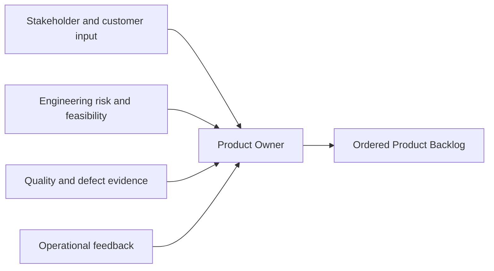

# Part 003 — Core Scrum Accountabilities and Decision Boundaries

## Positioning

Scrum memakai istilah **accountability**, bukan sekadar role atau job title.

Accountability menjawab empat pertanyaan:

1. Siapa yang wajib memastikan outcome tertentu terjadi?
2. Keputusan apa yang menjadi boundary utamanya?
3. Informasi apa yang harus ia buat transparan?
4. Kepada siapa ia harus berkolaborasi tanpa melepaskan ownership?

Dalam praktik enterprise, satu orang dapat memiliki beberapa job responsibility, sementara satu accountability Scrum dapat dijalankan oleh orang dengan title berbeda. Namun boundary accountability tidak boleh kabur.

> **Core thesis:** kolaborasi yang sehat bukan berarti semua orang memutuskan segala hal. Kolaborasi yang sehat berarti keputusan dibuat oleh owner yang tepat dengan input yang cukup, evidence yang relevan, dan consequence yang transparan.

---

## 1. Accountability, Responsibility, Authority, dan Execution

Empat istilah ini sering dicampur.

| Istilah | Arti |
|---|---|
| **Accountability** | Kewajiban akhir untuk memastikan suatu outcome atau sistem bekerja |
| **Responsibility** | Pekerjaan atau aktivitas yang dilakukan |
| **Authority** | Hak membuat keputusan dalam boundary tertentu |
| **Execution** | Tindakan konkret untuk menghasilkan hasil |

Satu orang dapat accountable tetapi tidak mengeksekusi semua aktivitas.

Contoh:

- Product Owner accountable atas effective Product Backlog management.
- Engineer dapat membantu menulis backlog item.
- QA dapat menemukan acceptance scenario.
- Architect dapat memberi constraint.
- Namun final ordering authority tetap perlu jelas.

Jika accountability tersebar tanpa owner, hasilnya bukan shared ownership. Hasilnya adalah **diffused ownership**.

### 1.1 Shared work bukan shared final decision

Banyak orang dapat berkontribusi pada:

- refinement;
- estimation;
- design;
- testing;
- release preparation;
- dan stakeholder communication.

Tetapi beberapa keputusan tetap membutuhkan final owner:

- product ordering;
- Sprint Goal;
- technical implementation plan;
- acceptance of residual risk;
- escalation;
- dan release authorization.

### 1.2 Decision boundary sebagai invariant

Gunakan invariant berikut:

```text
Input can be distributed.
Execution can be collaborative.
Accountability must remain explicit.
Final authority must not be ambiguous.
```

---

## 2. Product Owner: Accountable for Value

Product Owner accountable untuk memaksimalkan value dari product yang dihasilkan Scrum Team.

Ini tidak berarti Product Owner:

- selalu paling tahu solusi;
- menulis semua user story;
- menerima semua item secara manual;
- menentukan estimasi;
- membagikan task;
- atau menjadi satu-satunya orang yang berbicara dengan customer.

### 2.1 Core decision boundary

Product Owner secara praktis harus memastikan:

- Product Goal jelas;
- Product Backlog visible dan dipahami;
- backlog diurutkan secara efektif;
- trade-off product dibuat;
- stakeholder expectation diselaraskan;
- dan tim memahami mengapa work penting.

### 2.2 Value bukan hanya revenue

Dalam enterprise product, value dapat berupa:

- customer capability;
- reduced operational risk;
- faster delivery;
- regulatory compliance;
- lower support cost;
- improved reliability;
- compatibility protection;
- reduced manual work;
- atau future option value.

Namun semua value claim harus memiliki reasoning.

### 2.3 Product Owner tidak harus menulis backlog sendiri

Healthy collaboration:



Engineer dapat:

- menulis technical task;
- mengusulkan debt item;
- memperbaiki acceptance criteria;
- menemukan dependency;
- dan mengusulkan slicing.

Namun Product Owner tetap harus memahami consequence dan ordering.

### 2.4 Product Owner anti-patterns

#### Ticket secretary

PO hanya menyalin request stakeholder.

**Consequence:** backlog menjadi request queue tanpa outcome thinking.

#### Proxy tanpa authority

PO tampak memiliki role, tetapi semua keputusan harus disetujui pihak lain.

**Consequence:** decision latency tinggi, priority sering berubah, tim kehilangan arah.

#### Solution dictator

PO menentukan implementation detail.

**Consequence:** engineering judgment terhambat, alternative tidak dieksplorasi.

#### Acceptance bottleneck

Semua item menunggu PO untuk dianggap selesai.

**Consequence:** queue, role confusion, dan Definition of Done lemah.

#### Stakeholder pleaser

Semua request diterima.

**Consequence:** WIP, conflicting priority, dan Sprint Goal tidak stabil.

### 2.5 Senior engineer contribution kepada Product Owner

Senior engineer membantu dengan:

- menjelaskan option dan trade-off;
- menghubungkan technical risk ke customer/business impact;
- menunjukkan dependency;
- menyarankan thin slice;
- memperjelas non-functional requirement;
- dan memberi confidence range.

Senior engineer tidak:

- mengambil alih backlog ordering;
- memutuskan priority berdasarkan technical preference;
- atau memakai complexity untuk menolak work tanpa alternative.

### 2.6 Good conversation pattern

```text
Product intent:
What outcome or behavior matters?

Engineering reality:
What uncertainty, dependency, and risk exist?

Options:
What can be delivered first?

Trade-off:
What is gained or deferred?

Decision:
Who decides and by when?
```

---

## 3. Scrum Master: Accountable for Scrum Team Effectiveness

Scrum Master accountable untuk membangun pemahaman dan penggunaan Scrum serta meningkatkan effectiveness Scrum Team.

Scrum Master bukan project administrator.

### 3.1 Core contribution areas

Scrum Master membantu:

- team self-management;
- event effectiveness;
- impediment removal;
- empirical practice;
- stakeholder collaboration;
- organizational understanding of Scrum;
- dan continuous improvement.

### 3.2 Facilitation bukan ownership transfer

Scrum Master dapat memfasilitasi Sprint Planning, tetapi tidak memilih work untuk Developers.

Scrum Master dapat membantu retrospective, tetapi bukan owner semua action.

Scrum Master dapat mengangkat blocker, tetapi tidak menggantikan engineer yang memiliki technical action.

### 3.3 Impediment versus problem

Tidak semua problem harus “diselesaikan Scrum Master”.

Klasifikasi:

| Jenis | Contoh | Primary owner |
|---|---|---|
| Local execution issue | Test gagal | Engineer/team |
| Coordination blocker | Reviewer lintas tim tidak tersedia | Team + Scrum Master support |
| Structural impediment | Approval queue kronis | Scrum Master + management |
| Product ambiguity | Priority conflict | Product Owner |
| Capability gap | Tim tidak memahami domain | Team + manager enablement |
| Organizational constraint | Shared environment selalu unavailable | Leadership/system owner |

Scrum Master membantu memastikan problem tidak menjadi invisible atau abandoned.

### 3.4 Scrum Master anti-patterns

#### Ceremony administrator

Fokus pada calendar, attendance, dan board cleanup.

#### Status collector

Daily berubah menjadi reporting channel.

#### Process police

Rule ditegakkan tanpa memahami intent.

#### Team shield absolut

Semua stakeholder dijauhkan dari tim.

#### Impediment hero

Semua masalah diambil alih sehingga tim tidak belajar self-management.

#### Neutral facilitator tanpa accountability

Konflik dan dysfunction dibiarkan karena takut “memihak”.

### 3.5 Senior engineer collaboration dengan Scrum Master

Senior engineer membawa evidence:

- review latency;
- recurring blocker;
- late integration;
- dependency wait;
- unclear decision;
- atau repeated retro issue.

Scrum Master membantu:

- memfasilitasi system analysis;
- menghubungkan pihak;
- memperbaiki working agreement;
- dan mendorong organizational change.

Healthy pattern:

```text
Senior engineer identifies mechanism.
Scrum Master helps expose and improve the system.
Team co-owns the experiment.
```

---

## 4. Developers: Accountable for the Usable Increment

Dalam Scrum, Developers adalah orang-orang yang committed untuk menciptakan usable Increment.

Istilah ini lebih luas dari “programmer”.

Dapat mencakup:

- software engineer;
- QA;
- designer;
- analyst;
- data specialist;
- platform engineer;
- atau specialist lain,

selama mereka bersama-sama accountable menghasilkan increment.

### 4.1 Core accountability

Developers accountable untuk:

- membuat plan Sprint;
- menjaga quality melalui Definition of Done;
- mengadaptasi plan setiap hari;
- memegang satu sama lain accountable sebagai professional;
- dan menghasilkan usable Increment.

### 4.2 Developers memilih “how”

Product Owner terutama mengarahkan **why** dan **what outcome**.

Developers menentukan **how** berdasarkan professional judgment.

Namun pemisahan tidak absolut.

- Product decision dapat dipengaruhi feasibility.
- Technical choice dapat dipengaruhi product constraint.
- Acceptance behavior harus dipahami bersama.

### 4.3 Self-management

Self-management berarti tim menentukan:

- siapa melakukan apa;
- kapan work dilakukan;
- bagaimana collaboration;
- bagaimana plan berubah;
- dan bagaimana quality dijaga.

Self-management bukan:

- tidak ada accountability;
- tidak ada leadership;
- setiap orang bekerja sendiri;
- atau manager tidak boleh memberi context.

### 4.4 Collective accountability

Jika satu story blocked, itu bukan hanya masalah assignee.

Team bertanya:

- siapa dapat membantu;
- apakah scope dapat dipisah;
- apakah dependency perlu dieskalasi;
- apakah pairing diperlukan;
- dan apakah Sprint Goal terancam.

### 4.5 Developers anti-patterns

#### Individual ticket ownership

Setiap orang hanya peduli ticket sendiri.

#### “My code is done”

Integration, test, documentation, atau rollout dianggap tanggung jawab pihak lain.

#### Technical sovereignty

Engineer menolak product input karena “implementation decision”.

#### Passive planning

Team menerima scope tanpa challenge.

#### Hidden quality reduction

Test atau observability dikurangi untuk mengejar point.

#### Heroic senior dependency

Semua difficult decision menunggu senior engineer.

---

## 5. Scrum Team sebagai Satu Unit

Scrum Team adalah unit fundamental.

Ia harus cukup cross-functional untuk menghasilkan value tanpa dependency internal yang berlebihan.

### 5.1 Cross-functional bukan semua orang serba bisa

Cross-functional berarti tim secara kolektif memiliki capability yang dibutuhkan.

T-shaped skill tetap penting:

- kedalaman pada area tertentu;
- breadth yang cukup untuk collaboration;
- dan willingness untuk membantu flow.

### 5.2 Small team economics

Tim kecil membantu:

- communication;
- shared context;
- decision speed;
- dan accountability.

Tim terlalu besar menghasilkan:

- coordination overhead;
- subgroup;
- fragmented ownership;
- dan meeting expansion.

### 5.3 One Product Goal

Tim seharusnya fokus pada satu Product Goal.

Jika anggota dialokasikan ke banyak product:

- priority conflict meningkat;
- Sprint Goal lemah;
- context switching tinggi;
- dan capacity tidak stabil.

### 5.4 No internal sub-team

Secara Scrum, tidak ada sub-team seperti:

- dev team;
- QA team;
- backend team;
- frontend team.

Specialism tetap ada, tetapi ownership increment tidak boleh dipecah menjadi handoff.

---

## 6. Decision Rights Matrix

Gunakan matrix berikut sebagai baseline, lalu verifikasi internal.

| Decision | Product Owner | Scrum Master | Developers | Engineering Manager | Architect |
|---|---|---|---|---|---|
| Product Goal | A | C | C | C | C |
| Product Backlog ordering | A | C | C | C | C |
| Sprint Goal | A/C | C | A/C | I | I |
| Sprint scope forecast | C | F | A | I | C |
| Technical implementation | C | I | A | C | C |
| Definition of Done | C | F | A | C | C |
| Team process improvement | C | F/A | A | C | C |
| Staffing/performance | I | I | I | A | I |
| Architecture guardrail | C | I | A/C | C | A/C |
| Production release authorization | Varies | I | C | Varies | C |

Legend:

- **A** = accountable/final owner
- **C** = consulted
- **I** = informed
- **F** = facilitates
- **Varies** = internal governance specific

Matrix ini bukan standar internal CSG. Ia adalah starting hypothesis.

---

## 7. Role Confusion Patterns

### 7.1 Product Owner versus Engineering Manager

PO:

- product value;
- ordering;
- stakeholder trade-off.

Engineering Manager:

- people;
- capability;
- staffing;
- performance;
- organizational delivery support.

Smell:

- manager mengubah backlog tanpa PO;
- PO menentukan staffing;
- engineer menerima priority berbeda dari keduanya.

### 7.2 Scrum Master versus Engineering Manager

Scrum Master:

- team effectiveness;
- Scrum;
- impediment system;
- facilitation.

Engineering Manager:

- organizational accountability;
- performance;
- capability;
- career;
- resourcing.

Smell:

- Scrum Master menjadi line manager tersembunyi;
- manager memakai Daily Scrum sebagai status mechanism;
- process issue berubah menjadi performance judgment.

### 7.3 Architect versus Developers

Architect dapat memberi:

- system-wide constraint;
- reference pattern;
- risk review;
- dan cross-team alignment.

Developers tetap accountable pada implementation dan increment.

Smell:

- semua keputusan harus disetujui architect;
- architect tidak ikut menanggung delivery consequence;
- developers hanya mengimplementasi design yang sudah fixed.

### 7.4 QA versus Developers

QA bukan final quality gate.

Quality harus dibangun bersama.

Smell:

- engineer “melempar ke QA”;
- QA hanya terlibat setelah coding;
- bug dianggap failure QA.

### 7.5 Senior engineer versus Product Owner

Senior engineer memberi evidence dan option.

PO mengurutkan value.

Smell:

- technical debt selalu diprioritaskan tanpa business framing;
- engineer memveto product request berdasarkan preference;
- PO mengabaikan operational risk tanpa explicit acceptance.

---

## 8. Accountability without Blame

Accountability sehat:

- owner jelas;
- expectation jelas;
- evidence tersedia;
- consequence dipahami;
- dan system condition dianalisis.

Blame:

- mencari individu untuk menutup analisis;
- mengabaikan workload dan policy;
- menggunakan hindsight;
- dan menghukum transparency.

### 8.1 Blameless bukan consequence-free

Blamelessness tidak berarti:

- semua tindakan sama baik;
- professional negligence diabaikan;
- atau repeated unsafe behavior tidak ditangani.

Ia berarti analisis tidak berhenti pada “siapa salah”.

### 8.2 Review framework

```text
Expected:
What should have happened?

Observed:
What happened?

Context:
What information and constraints existed?

Decision:
Why did the action make sense at the time?

System:
What conditions enabled the outcome?

Improvement:
What changes reduce recurrence?
```

---

## 9. Escalation Boundaries

Escalation bukan kegagalan self-management.

Escalation tepat ketika:

- authority berada di luar tim;
- dependency tidak merespons;
- risk melewati tolerance;
- Sprint Goal terancam;
- atau decision latency lebih mahal daripada escalation.

### 9.1 Good escalation packet

```text
Context:
Current state:
Impact:
Evidence:
Options:
Recommendation:
Decision owner:
Decision deadline:
```

### 9.2 Poor escalation

- “Kami blocked.”
- “Tim lain belum selesai.”
- “Requirement tidak jelas.”
- “Butuh bantuan management.”

Escalation harus actionable.

---

## 10. Scenario: API Compatibility Change

### Context

Tim perlu mengubah API quote karena model baru.

### Weak role model

- PO meminta field baru.
- Architect menentukan schema.
- Engineer implement.
- QA test happy path.
- Consumer gagal setelah release.
- Semua pihak saling menyalahkan.

### Healthy accountability model

**Product Owner**

- menjelaskan behavior dan affected customer;
- memutuskan rollout priority;
- menerima trade-off.

**Developers**

- mengidentifikasi compatibility risk;
- mendesain versioning atau additive change;
- membuat contract test;
- memastikan observability.

**Scrum Master**

- membantu dependency consumer terlihat;
- memastikan impediment dan decision latency ditangani.

**Architect**

- memberi cross-system constraint dan compatibility guidance.

**Engineering Manager**

- membantu resourcing atau escalation bila dependency lintas tim.

**QA**

- membantu scenario dan regression strategy.

### Result

Keputusan tidak menjadi “milik semua orang”. Ownership tetap eksplisit.

---

## 11. Senior Engineer Operating Model

### 11.1 Clarify before solving

Tanyakan:

- keputusan siapa;
- outcome apa;
- evidence apa;
- dan constraint apa.

### 11.2 Offer options, not authority capture

Gunakan:

```text
Option:
Benefits:
Risks:
Reversibility:
Dependency:
Recommendation:
```

### 11.3 Preserve local ownership

Ketika membantu engineer lain:

- jangan otomatis mengambil ticket;
- pair;
- jelaskan heuristic;
- biarkan owner menyampaikan decision;
- dan beri safety net.

### 11.4 Make disagreement useful

Pisahkan:

- fact;
- assumption;
- preference;
- risk;
- dan decision.

### 11.5 Prevent boundary bypass

Jika stakeholder memberi request langsung:

1. pahami urgency;
2. jangan langsung commit;
3. hubungkan ke Product Owner;
4. jelaskan current Sprint Goal;
5. dokumentasikan trade-off.

---

## 12. Process Smells

### Product Owner smells

- backlog tidak benar-benar ordered;
- banyak pihak mengubah priority;
- tidak ada outcome language;
- acceptance menjadi bottleneck;
- roadmap tidak adaptif.

### Scrum Master smells

- event tepat waktu tetapi tidak efektif;
- impediment kronis;
- retro action hilang;
- metric misuse tidak ditantang;
- tim tidak berkembang self-management-nya.

### Developers smells

- tidak challenge scope;
- plan tidak berubah;
- quality dihandoff;
- WIP tinggi;
- blocked item tidak dimiliki kolektif.

### Team smells

- role overlap tidak eksplisit;
- shadow authority;
- decision dibuat di luar event/artifact;
- escalation terlambat;
- conflict menjadi personal.

---

## 13. Internal Verification Checklist

### Product Owner

- Siapa Product Owner formal?
- Siapa Product Owner efektif?
- Siapa final ordering authority?
- Apakah ada product manager, business owner, atau customer proxy lain?
- Siapa dapat mengubah priority?
- Bagaimana product decision dicatat?
- Apakah PO memiliki authority atau bergantung pada committee?

### Scrum Master

- Apakah Scrum Master dedicated?
- Apakah ia juga manager, developer, atau project manager?
- Bagaimana impediment dilacak?
- Contoh systemic improvement apa yang pernah dipimpin?
- Apakah event difasilitasi atau sekadar dijadwalkan?
- Bagaimana Scrum effectiveness diukur?

### Developers

- Siapa yang termasuk Developers dalam Scrum Team?
- Apakah QA, designer, analyst, dan specialist termasuk ownership increment?
- Siapa membuat Sprint plan?
- Siapa membagi task?
- Apakah team dapat mengadaptasi Sprint Backlog?
- Apa area yang masih bergantung pada satu orang?

### Decision rights

- Siapa memutuskan architecture?
- Siapa memutuskan release?
- Siapa menerima residual operational risk?
- Siapa memutuskan emergency interruption?
- Siapa dapat mengatakan scope tidak realistis?
- Siapa menjadi escalation point lintas tim?

### Engineering Manager

- Apa batas antara people management dan Sprint execution?
- Apakah manager mengubah priority?
- Bagaimana staffing dan capability gap ditangani?
- Apakah performance evaluation memakai metric Scrum?

### Role conflict

- Apakah ada shadow PO?
- Apakah architect menjadi approval gate?
- Apakah senior engineer menjadi default decision-maker?
- Apakah QA menjadi final gate?
- Apakah Scrum Master menjadi status collector?

---

## 14. Practical Exercises

### Exercise 1 — Accountability map

Buat matrix:

| Area | Formal owner | Effective owner | Contributors | Conflict |
|---|---|---|---|---|
| Product ordering | | | | |
| Sprint planning | | | | |
| Technical design | | | | |
| Quality | | | | |
| Release | | | | |
| Incident | | | | |

### Exercise 2 — Decision audit

Ambil tiga keputusan terakhir.

Tulis:

```text
Decision:
Final owner:
Inputs:
Evidence:
Where recorded:
Was ownership explicit?
Was decision timely?
```

### Exercise 3 — Role confusion diagnosis

Pilih satu pain point.

```text
Observed behavior:
Expected accountability:
Actual authority:
Missing information:
Boundary conflict:
Correction:
```

### Exercise 4 — Senior bottleneck check

- Keputusan apa yang selalu menunggu Anda?
- Apakah itu benar-benar boundary Anda?
- Siapa yang perlu diberi context atau guardrail?
- Bagaimana ownership dapat dipindahkan dengan aman?

---

## 15. Part Completion Checklist

Anda selesai jika mampu:

- membedakan accountability, responsibility, authority, dan execution;
- menjelaskan boundary Product Owner, Scrum Master, dan Developers;
- menjelaskan self-management tanpa menghilangkan leadership;
- mendeteksi shadow authority dan role confusion;
- menjelaskan collaboration tanpa diffused ownership;
- membangun decision-right matrix;
- melakukan escalation yang actionable;
- dan meningkatkan team ownership tanpa menjadi bottleneck.

---

## 16. Key Takeaways

1. Accountability harus eksplisit walaupun execution collaborative.
2. Product Owner accountable atas value dan backlog ordering.
3. Scrum Master accountable atas Scrum Team effectiveness.
4. Developers accountable atas plan, quality, adaptation, dan usable Increment.
5. Cross-functional tidak berarti semua orang ahli semua hal.
6. Self-management bukan absence of leadership.
7. Role confusion menciptakan decision latency dan hidden authority.
8. Senior engineer harus memperjelas boundary, bukan mengakumulasi authority.
9. Blamelessness tidak menghapus accountability.
10. Detail role dan decision rights internal harus diverifikasi.

---

## 17. References

Conceptual baseline:

- The Scrum Guide by Ken Schwaber and Jeff Sutherland.
- Agile Manifesto and principles.

These sources define general Scrum concepts, not internal CSG processes.
