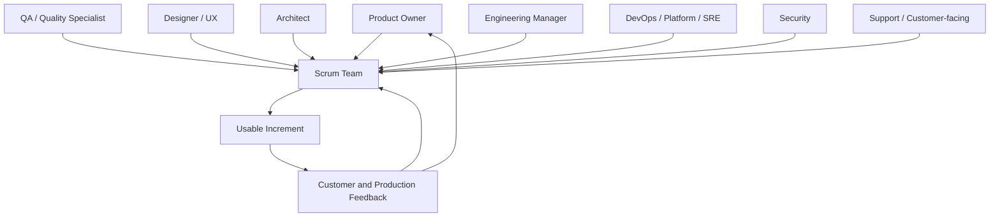
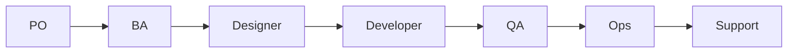
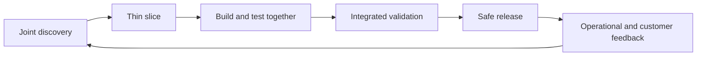

# Part 004 — QA, Design, Architecture, Engineering Management, DevOps, Support, and Team Dynamics

## Positioning

Scrum hanya mendefinisikan tiga accountabilities inti. Enterprise product organization biasanya memiliki banyak role lain:

- QA;
- Product Designer;
- Business Analyst;
- Domain Expert;
- Architect;
- Engineering Manager;
- DevOps atau Platform Engineer;
- SRE;
- Security;
- Support;
- Professional Services;
- Customer Success;
- Release Management;
- dan customer-facing stakeholder.

Role tersebut tidak salah. Masalah muncul ketika organisasi mengubah role menjadi **handoff boundary**, **approval queue**, atau **ownership escape hatch**.

> **Core thesis:** role enterprise harus memperkaya capability Scrum Team tanpa memecah accountability terhadap product increment.

---

## 1. Dari Role Map ke Delivery System

Jangan hanya mencatat siapa melakukan apa.

Petakan:

- siapa memiliki informasi;
- siapa memiliki authority;
- siapa mengeksekusi;
- siapa menanggung operational consequence;
- dan siapa sering menjadi queue.

### 1.1 Role topology



Diagram ini menunjukkan kontribusi, bukan reporting line.

### 1.2 Four delivery interfaces

Untuk setiap role, analisis empat interface:

1. **Discovery interface**  
   Bagaimana role membantu memahami problem dan constraint?

2. **Execution interface**  
   Bagaimana role terlibat selama build?

3. **Validation interface**  
   Bukti apa yang ia bantu hasilkan?

4. **Operational interface**  
   Bagaimana role terlibat setelah release?

Role yang hanya muncul pada satu titik akhir biasanya menjadi late feedback source.

---

## 2. QA dan Quality Engineering

QA tidak boleh diposisikan sebagai orang yang “menemukan bug developer”.

Quality adalah system property.

### 2.1 QA contribution

QA dapat memberi leverage melalui:

- example discovery;
- acceptance criteria;
- risk-based test strategy;
- negative scenario;
- regression design;
- exploratory testing;
- test automation;
- environment and data readiness;
- release evidence;
- dan defect pattern analysis.

### 2.2 Shift-left tanpa slogan

Shift-left berarti informasi quality masuk lebih awal.

Contoh:

- QA hadir saat refinement;
- negative scenario dibahas sebelum coding;
- testability menjadi design concern;
- test data disiapkan sebelum implementation selesai;
- dan observability requirement dimasukkan ke acceptance.

### 2.3 Shift-right

Quality juga divalidasi setelah release melalui:

- telemetry;
- canary;
- error trend;
- synthetic check;
- support signal;
- dan user behavior.

### 2.4 QA anti-patterns

#### Final gate

Semua work menunggu QA.

#### Manual regression dependency

Setiap release membutuhkan test manual besar.

#### Defect ownership silo

Bug dianggap masalah QA atau developer tertentu.

#### Automation vanity

Jumlah automated test tinggi tetapi feedback lambat dan flaky.

#### Environment hostage

QA tidak dapat bekerja karena environment shared tidak stabil.

### 2.5 Senior engineer collaboration

- design for testability;
- expose deterministic behavior;
- pair pada contract test;
- buat failure observable;
- dan prioritaskan flaky test sebagai delivery risk.

---

## 3. Product Designer dan UX

Designer membantu tim memahami:

- user goal;
- interaction;
- information architecture;
- usability;
- accessibility;
- dan journey coherence.

### 3.1 Designer bukan UI supplier

Weak pattern:

```text
PO writes requirement
-> designer creates screen
-> developer implements
```

Healthy pattern:

```text
PO + designer + engineer + QA
-> understand problem
-> explore journey and constraints
-> identify thin slice
-> validate behavior
```

### 3.2 Enterprise design complexity

Quote & Order style product dapat memiliki:

- dense workflow;
- expert user;
- role-based behavior;
- long-running process;
- exception handling;
- data-heavy form;
- dan customer configuration.

Design harus mencakup:

- state;
- error;
- empty condition;
- partial completion;
- permission;
- latency;
- retry;
- dan audit feedback.

### 3.3 Designer anti-patterns

- pixel-complete design sebelum feasibility;
- happy path only;
- handoff tanpa interaction explanation;
- design tidak mempertimbangkan existing pattern;
- accessibility ditunda;
- dan feedback baru datang setelah implementation.

### 3.4 Senior engineer contribution

- jelaskan technical constraint tanpa mematikan exploration;
- buat prototype behavior;
- challenge hidden state;
- dan hindari menjadikan current architecture sebagai batas product permanen.

---

## 4. Business Analyst dan Domain Expert

Enterprise product sering memiliki domain rule yang kompleks.

Business Analyst atau Domain Expert dapat membantu:

- terminology;
- rule;
- exception;
- process;
- customer variation;
- regulatory context;
- dan traceability.

### 4.1 Domain clarity

Gunakan:

- examples;
- decision table;
- state model;
- event timeline;
- rule matrix;
- dan domain glossary.

### 4.2 BA anti-patterns

- requirement document sebagai contract final;
- BA menjadi satu-satunya jalur ke business;
- ambiguity disembunyikan di prose;
- technical impact tidak dibahas;
- dan rule tidak memiliki example.

### 4.3 Senior engineer contribution

- ubah prose menjadi executable scenario;
- temukan state transition;
- identifikasi invariants;
- dan tanyakan temporal behavior.

---

## 5. Architect

Architect dapat berupa:

- solution architect;
- enterprise architect;
- domain architect;
- platform architect;
- atau senior/principal engineer dengan architecture responsibility.

### 5.1 Healthy architecture contribution

- memberi system context;
- menjaga cross-team constraint;
- membantu trade-off;
- menetapkan guardrail;
- memfasilitasi decision;
- dan menjaga evolutionary path.

### 5.2 Architecture as enablement

Architecture seharusnya mengurangi cost of change.

Bukan sekadar menghasilkan diagram.

Evidence architecture berguna:

- independent deployment meningkat;
- compatibility lebih jelas;
- diagnosis lebih mudah;
- blast radius turun;
- decision lebih cepat;
- atau duplicate solution berkurang.

### 5.3 Architect anti-patterns

#### Approval gate

Semua design menunggu architect.

#### Ivory tower

Decision dibuat tanpa delivery context.

#### Pattern enforcement

Standard dipakai tanpa risk-based judgment.

#### Document completeness bias

Architecture dianggap selesai ketika dokumen selesai.

#### No consequence ownership

Architect memberi keputusan tetapi tidak mengikuti outcome.

### 5.4 Architect versus senior engineer

Boundary harus jelas.

Architect mungkin accountable pada cross-system coherence.

Senior engineer sering accountable pada local design dan delivery.

Healthy relationship:

- architect memberi guardrail;
- team memilih implementation;
- exception didiskusikan;
- decision dicatat;
- dan feedback production memperbarui architecture.

---

## 6. Engineering Manager

Engineering Manager biasanya accountable pada:

- people;
- team capability;
- staffing;
- performance;
- career;
- organizational alignment;
- dan sustainable execution.

### 6.1 Manager bukan Sprint dispatcher

Manager dapat memberi:

- business context;
- organizational constraint;
- risk escalation;
- dan resourcing support.

Manager sebaiknya tidak:

- membagi task harian;
- mengubah Sprint Backlog sepihak;
- memakai Daily Scrum sebagai status collection;
- atau menjadi final reviewer semua work.

### 6.2 Delivery accountability

Engineering Manager tetap memiliki organizational delivery accountability, tetapi harus membangun sistem tempat team self-managing dapat berhasil.

Contoh:

- memastikan role cukup;
- mengatasi capability gap;
- menurunkan cross-team blocker;
- memperbaiki tooling investment;
- dan melindungi sustainable pace.

### 6.3 Manager anti-patterns

#### Shadow Product Owner

Mengubah priority.

#### Technical override

Membatalkan team decision tanpa context.

#### Hero reward system

Menghargai overtime dan rescue.

#### Individual metric management

Menggunakan point, commit, atau ticket count.

#### Conflict avoidance

Role confusion dibiarkan.

### 6.4 Senior engineer collaboration

Senior engineer memberi system evidence, bukan complaint personal.

Contoh:

> “Median review wait untuk module ini tiga hari karena hanya dua approver. Saya usulkan reviewer rotation dan guardrail checklist selama dua sprint.”

---

## 7. DevOps, Platform Engineering, dan SRE

Istilah dapat berbeda antarorganisasi.

### 7.1 DevOps adalah operating principle

DevOps bukan sekadar team yang menerima deployment ticket.

Prinsipnya:

- development dan operation concern terintegrasi;
- automation;
- fast feedback;
- shared ownership;
- dan reliable delivery.

### 7.2 Platform Engineering

Platform team menyediakan internal product:

- CI/CD;
- runtime platform;
- observability;
- secrets;
- environment;
- developer portal;
- dan deployment capability.

Healthy platform:

- self-service;
- documented;
- reliable;
- opinionated secukupnya;
- dan memiliki support model.

### 7.3 SRE

SRE membantu reliability melalui:

- SLI/SLO;
- error budget;
- incident response;
- toil reduction;
- capacity;
- dan operational engineering.

### 7.4 Handoff anti-pattern

```text
Developer finishes code
-> Ops deploys
-> SRE supports
```

Healthy model:

```text
Team designs operability
-> platform provides paved road
-> deployment is automated
-> runtime is observable
-> incident learning returns to backlog
```

### 7.5 Common failure modes

- environment request queue;
- production access ambiguity;
- deployment ownership terpisah;
- no rollback;
- alert tanpa actionability;
- platform roadmap tidak sinkron;
- dan reliability work tidak masuk product backlog.

### 7.6 Senior engineer contribution

- design for operability;
- use platform standard;
- memberi feedback sebagai platform customer;
- mengurangi bespoke pipeline;
- dan memastikan runtime evidence tersedia.

---

## 8. Support dan Customer-Facing Teams

Support, Customer Success, Professional Services, Implementation, dan Sales Engineering sering memiliki informasi yang tidak terlihat oleh product team.

### 8.1 Signal yang mereka bawa

- recurring customer pain;
- workaround;
- configuration complexity;
- adoption issue;
- integration variation;
- documentation gap;
- dan commercial urgency.

### 8.2 Request versus evidence

Customer-facing request harus diubah menjadi:

- affected customer;
- frequency;
- impact;
- workaround;
- urgency;
- contractual condition;
- dan broader applicability.

Jangan semua ticket support otomatis menjadi feature.

### 8.3 Support anti-patterns

- direct developer interruption;
- priority by escalation volume;
- no feedback closure;
- workaround tidak terdokumentasi;
- issue berulang tidak menjadi product learning;
- dan support menjadi diagnostic layer karena observability lemah.

### 8.4 Senior engineer contribution

- memperbaiki diagnosability;
- membantu support playbook;
- mengelompokkan defect pattern;
- dan menerjemahkan technical limitation secara jelas.

---

## 9. Security, Compliance, dan Risk

Role security dan compliance harus masuk cukup awal.

### 9.1 Risk-based collaboration

Tidak semua perubahan memerlukan level review sama.

Klasifikasi berdasarkan:

- data sensitivity;
- access;
- external exposure;
- privilege;
- audit;
- dependency;
- dan blast radius.

### 9.2 Anti-patterns

- security review di akhir;
- checklist tanpa threat context;
- exception tanpa owner;
- compliance evidence manual dan terlambat;
- atau security dianggap blocker eksternal.

### 9.3 Senior engineer contribution

- threat-aware refinement;
- secure default;
- evidence automation;
- dan explicit residual risk.

---

## 10. Release Management

Enterprise product mungkin memiliki release manager atau release governance.

### 10.1 Healthy contribution

- release calendar;
- change coordination;
- communication;
- readiness evidence;
- rollback plan;
- dan cross-team dependency.

### 10.2 Failure mode

- release menjadi batch besar;
- checklist hanya diisi menjelang cut-off;
- authority tidak jelas;
- missed window menghasilkan delay besar;
- dan team tidak belajar dari release failure.

### 10.3 Decouple deployment dan release

Gunakan bila sesuai:

- feature flag;
- configuration;
- staged rollout;
- dark launch;
- backward-compatible change.

---

## 11. Stakeholder

Stakeholder adalah pihak yang terdampak atau dapat memengaruhi product.

Tidak semua stakeholder memiliki authority yang sama.

### 11.1 Stakeholder map

Klasifikasikan:

| Type | Interest | Authority | Needed interaction |
|---|---|---|---|
| Customer | Outcome/use | Varies | Feedback and validation |
| Product leadership | Portfolio/value | High | Direction and trade-off |
| Support | Operability | Medium | Signal and readiness |
| Security | Risk | High in boundary | Early review |
| Sales | Commercial | Influence | Context and expectation |
| Other team | Dependency | Shared | Contract and sequencing |

### 11.2 Stakeholder anti-patterns

- bypass Product Owner;
- commitment dibuat tanpa team input;
- Sprint Review hanya ceremonial audience;
- stakeholder hadir terlambat;
- dan conflicting instruction.

### 11.3 Senior engineer stance

- respectful;
- evidence-based;
- no surprise;
- no premature commitment;
- dan clear decision boundary.

---

## 12. Working Agreement

Working agreement membuat collaboration policy eksplisit.

### 12.1 Areas

Working agreement dapat mencakup:

- core hours;
- async response expectation;
- code review;
- pairing;
- incident;
- meeting;
- decision record;
- Definition of Done;
- blocked work;
- escalation;
- leave;
- dan conflict.

### 12.2 Example agreement

```text
PR Review:
- Small PR preferred.
- First response within one working day.
- Blocking comments labeled explicitly.
- Author retains ownership until merged and validated.

Blocked Work:
- Mark blocked immediately.
- Record dependency owner and next checkpoint.
- Escalate after agreed threshold.

Decisions:
- Significant technical decisions recorded in ADR.
- Product trade-offs recorded in backlog or decision log.
```

### 12.3 Agreement anti-patterns

- terlalu panjang;
- tidak pernah dibaca;
- tidak memiliki review cadence;
- bertentangan dengan actual incentive;
- atau digunakan sebagai punishment.

### 12.4 Living agreement

Review ketika:

- team composition berubah;
- incident menunjukkan gap;
- remote pattern berubah;
- recurring retro issue;
- atau tool/process berubah.

---

## 13. Psychological Safety

Psychological safety adalah kondisi ketika orang dapat:

- mengangkat risk;
- bertanya;
- mengakui kesalahan;
- disagree;
- dan meminta bantuan,

tanpa takut dipermalukan atau dihukum secara tidak proporsional.

### 13.1 Safety bukan comfort

Diskusi tetap dapat tegas.

Safety berarti:

- challenge idea tanpa menyerang orang;
- consequence tetap ada;
- standard tetap tinggi;
- dan feedback actionable.

### 13.2 Signals

Healthy:

- junior menantang assumption;
- senior mengakui tidak tahu;
- blocker diangkat awal;
- incident dibahas factual;
- dan decision dapat direvisi.

Unsafe:

- silence;
- status optimistis;
- private complaint;
- blame;
- dan hero worship.

### 13.3 Senior engineer behavior

- model uncertainty;
- invite dissent;
- jangan menggunakan sarcasm;
- credit contributor;
- koreksi diri publik;
- dan pisahkan severity issue dari dignity orang.

---

## 14. Accountability without Blame across Roles

Gunakan system view.

Contoh defect lolos:

Weak:

> QA tidak menemukan bug.

Better questions:

- Apakah acceptance scenario lengkap?
- Apakah test data representatif?
- Apakah design observable?
- Apakah review mencakup failure path?
- Apakah deadline mendorong test reduction?
- Apakah environment berbeda?

Accountability tetap ada:

- siapa owner corrective action;
- kapan selesai;
- evidence apa;
- dan siapa memverifikasi.

---

## 15. Handoff Chain versus Collaborative Flow

### 15.1 Handoff chain



Setiap boundary menambah:

- queue;
- information loss;
- rework;
- dan local optimization.

### 15.2 Collaborative flow



Specialist tetap ada, tetapi feedback lebih awal.

---

## 16. Conflict and Disagreement

Conflict sehat diperlukan.

### 16.1 Types

- fact conflict;
- goal conflict;
- constraint conflict;
- value conflict;
- authority conflict;
- interpersonal conflict.

Jangan menyelesaikan semua sebagai “communication issue”.

### 16.2 Resolution protocol

```text
1. State the decision.
2. Separate facts and assumptions.
3. Clarify decision owner.
4. List options and consequences.
5. Identify time boundary.
6. Decide and record.
7. Revisit when evidence changes.
```

### 16.3 Disagree and commit

Useful ketika:

- owner jelas;
- dissent didengar;
- decision reversible atau bounded;
- dan safety constraint tidak dilanggar.

Tidak boleh dipakai untuk memaksa diam pada:

- security risk;
- ethical concern;
- compliance;
- atau unsafe production change.

---

## 17. Senior Engineer as Collaboration Multiplier

Senior engineer meningkatkan kualitas interface antarrole.

### 17.1 With QA

- convert risk into test strategy;
- improve testability;
- analyze defect pattern.

### 17.2 With Designer

- expose system state;
- explore feasibility;
- preserve user intent.

### 17.3 With Architect

- bring delivery evidence;
- test guardrail;
- record local exception.

### 17.4 With Engineering Manager

- surface capability and system bottleneck;
- avoid individual blame;
- propose investment.

### 17.5 With Platform/SRE

- adopt paved road;
- improve operability;
- reduce toil.

### 17.6 With Support

- improve diagnosis;
- close feedback loop;
- explain limitation.

### 17.7 With Product Owner

- frame technical concern as product consequence;
- offer options;
- preserve ordering authority.

---

## 18. Worked Scenario: Production-Sensitive Migration

### Context

Perubahan data model quote membutuhkan migration.

### Required roles

**PO**

- menentukan business urgency;
- menyetujui rollout scope.

**Developers**

- migration design;
- compatibility;
- test;
- rollback;
- observability.

**QA**

- data scenario;
- regression;
- validation evidence.

**Architect**

- cross-system compatibility.

**Platform/SRE**

- execution safety;
- monitoring;
- capacity.

**Support**

- customer impact;
- diagnostic instruction.

**Release Manager**

- window;
- communication;
- coordination.

**Engineering Manager**

- resourcing;
- escalation.

### Failure mode

Setiap role bekerja serial.

### Better model

- joint risk workshop;
- thin migration slice;
- dry-run;
- metrics;
- staged rollout;
- explicit go/no-go;
- post-release inspection.

---

## 19. Internal Verification Checklist

### Team topology

- Siapa anggota Scrum Team?
- Siapa specialist shared?
- Siapa formal versus de facto lead?
- Apakah anggota dialokasikan ke banyak team?
- Apa dependency paling sering?

### QA

- Apakah QA embedded?
- Kapan QA terlibat?
- Siapa memiliki automation?
- Apa regression model?
- Bagaimana defect triage?
- Apakah environment/data menjadi bottleneck?

### Design/domain

- Apakah designer atau BA dedicated?
- Bagaimana user research dan domain clarification dilakukan?
- Di mana design decision disimpan?
- Bagaimana accessibility divalidasi?
- Siapa domain expert?

### Architecture

- Siapa architect?
- Apa decision threshold?
- Kapan RFC/ADR diperlukan?
- Berapa review latency?
- Apakah exception process ada?
- Apakah architect menjadi gate?

### Engineering Manager

- Apa ekspektasi delivery versus people?
- Bagaimana manager berinteraksi dengan Sprint?
- Bagaimana capability gap ditangani?
- Metric apa untuk performance?
- Apa escalation boundary?

### DevOps/Platform/SRE

- Siapa owner CI/CD?
- Apakah deployment self-service?
- Siapa on-call?
- Bagaimana incident ditangani?
- Apa SLO atau operational signal?
- Bagaimana platform request diprioritaskan?

### Support/customer-facing

- Bagaimana ticket masuk ke product?
- Apa severity model?
- Siapa berkomunikasi dengan customer?
- Apakah support memiliki runbook?
- Bagaimana recurring issue dianalisis?
- Apakah developer sering diinterrupt langsung?

### Working agreement

- Apakah working agreement ada?
- Kapan terakhir direview?
- Apakah mencakup review, block, incident, decision, dan availability?
- Apakah actual behavior sesuai?
- Apa agreement yang perlu diperbaiki?

### Psychological safety

- Apakah orang aman mengangkat delay?
- Bagaimana disagreement ditangani?
- Apakah retro membahas authority-sensitive issue?
- Apakah blame muncul setelah incident?
- Apakah junior dapat challenge senior?

---

## 20. Practical Exercises

### Exercise 1 — Role interface map

Untuk setiap role:

```text
Information provided:
Decision authority:
Execution contribution:
Validation contribution:
Operational contribution:
Common queue:
```

### Exercise 2 — Handoff audit

Pilih satu story selesai.

Catat:

| Stage | Owner | Wait time | Information lost | Rework |
|---|---|---:|---|---|
| Refinement | | | | |
| Design | | | | |
| Build | | | | |
| Test | | | | |
| Release | | | | |

### Exercise 3 — Working agreement gap

Pilih satu recurring friction.

```text
Observed behavior:
Current implicit rule:
Desired explicit rule:
Owner:
Review date:
Success signal:
```

### Exercise 4 — Safety reflection

- Kapan terakhir seseorang mengangkat bad news early?
- Bagaimana response team?
- Perilaku apa yang memberi signal aman atau tidak aman?
- Apa yang dapat Anda modelkan sebagai senior?

### Exercise 5 — Bottleneck role

- Role mana paling sering menjadi queue?
- Apakah karena capacity, authority, skill, atau process?
- Apakah dapat di-shift left?
- Apakah dapat dibuat self-service?
- Apakah guardrail dapat menggantikan approval?

---

## 21. Part Completion Checklist

Anda selesai jika mampu:

- memetakan role enterprise tanpa merusak Scrum accountability;
- menjelaskan QA sebagai quality partner, bukan final gate;
- menjelaskan designer dan domain expert sebagai discovery collaborator;
- membedakan architecture enablement dari approval gate;
- membedakan Engineering Manager dari Sprint dispatcher;
- menjelaskan DevOps, platform, dan SRE sebagai delivery capability;
- memasukkan support dan customer-facing feedback ke product loop;
- membangun working agreement;
- mendeteksi handoff chain;
- dan berkontribusi sebagai senior engineer tanpa menjadi bottleneck.

---

## 22. Key Takeaways

1. Enterprise roles menambah capability, bukan alasan untuk memecah ownership.
2. Quality, operability, dan security harus masuk sebelum akhir.
3. Architect seharusnya memberi guardrail dan context, bukan mengambil semua keputusan.
4. Engineering Manager membangun capability dan system, bukan mengatur task harian.
5. Platform dan SRE harus mempercepat reliable delivery.
6. Support adalah source product learning, bukan hanya ticket channel.
7. Working agreement mengubah implicit expectation menjadi explicit policy.
8. Psychological safety memungkinkan transparency.
9. Accountability without blame tetap membutuhkan owner dan follow-through.
10. Senior engineer adalah collaboration multiplier ketika memperbaiki interface antarrole.

---

## 23. References

Conceptual baseline:

- The Scrum Guide.
- Agile Manifesto and principles.
- General DevOps, platform engineering, SRE, and team effectiveness practices.

These concepts must be adapted and verified against internal CSG and team-specific processes.
