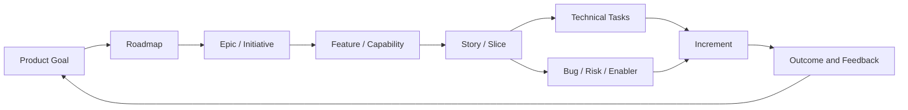
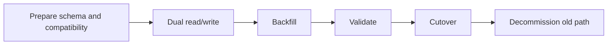
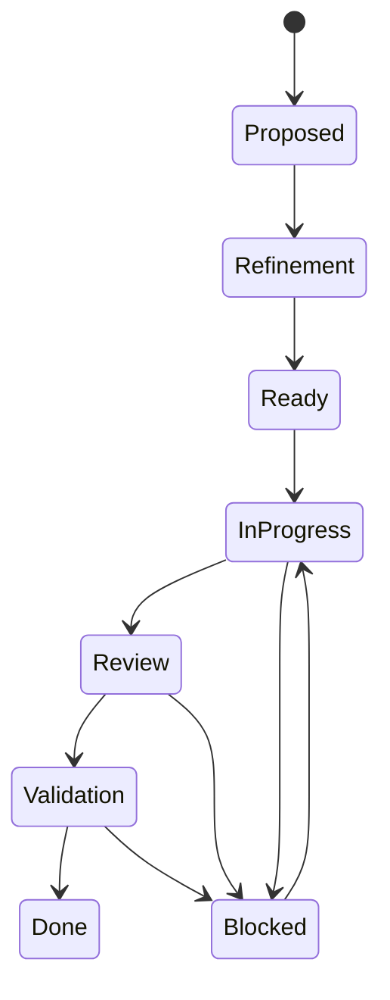

# Part 005 — Roadmap, Epic, Feature, Story, Task, Spike, Bug, Debt, and Enabler

## Positioning

Backlog yang sehat bukan sekadar daftar tiket. Ia adalah representasi kerja yang:

- terhubung ke outcome;
- memiliki scope yang dapat dipahami;
- mempunyai jenis kerja yang tepat;
- dapat diurutkan;
- dapat diinspeksi;
- dan dapat ditelusuri dari arah produk sampai bukti delivery.

Masalah umum di tim enterprise adalah semua hal dimasukkan sebagai "story", walaupun sifatnya berbeda:

- feature;
- technical task;
- bug;
- spike;
- incident action;
- migration;
- architecture work;
- atau operational improvement.

Akibatnya, backlog kehilangan makna. Estimation menjadi tidak konsisten, refinement membingungkan, dan stakeholder sulit memahami hubungan antara work item dengan value.

> **Core thesis:** taxonomy backlog yang baik bukan tujuan administratif. Ia adalah mekanisme untuk meningkatkan clarity, planning quality, traceability, dan decision-making.

---

## 1. Mental Model: Backlog sebagai Decision System

Backlog bukan inventory pasif.

Backlog adalah sistem yang menghubungkan:



Setiap level seharusnya menjawab pertanyaan berbeda.

| Level | Pertanyaan utama |
|---|---|
| Product Goal | Arah outcome apa yang ingin dicapai? |
| Roadmap | Dalam urutan strategis apa capability dikembangkan? |
| Epic/Initiative | Area perubahan besar apa yang diperlukan? |
| Feature | Capability apa yang akan tersedia? |
| Story/Slice | Behavior kecil apa yang dapat diselesaikan dan divalidasi? |
| Task | Aktivitas teknis konkret apa yang diperlukan? |
| Bug | Behavior salah apa yang harus dikoreksi? |
| Spike | Ketidakpastian apa yang harus dikurangi? |
| Enabler | Capability internal apa yang memungkinkan delivery lain? |
| Increment | Evidence nyata apa yang sudah usable? |

---

## 2. Product Backlog versus Sprint Backlog

### 2.1 Product Backlog

Product Backlog adalah ordered list dari semua hal yang diketahui perlu dilakukan untuk meningkatkan product.

Ia dapat berisi:

- feature;
- defect;
- technical work;
- discovery;
- migration;
- reliability work;
- security improvement;
- dan operational change.

Ia harus cukup transparan untuk menjelaskan:

- apa yang dipertimbangkan;
- mengapa item penting;
- priority relatif;
- risk;
- dependency;
- dan readiness.

### 2.2 Sprint Backlog

Sprint Backlog adalah:

- Sprint Goal;
- Product Backlog Items yang dipilih;
- dan plan untuk menghasilkan Increment.

Sprint Backlog bukan sekadar copy item dari Product Backlog.

Ia merepresentasikan **forecast dan execution plan** yang hidup.

### 2.3 Common confusion

| Confusion | Consequence |
|---|---|
| Product Backlog dianggap fixed scope | Adaptation sulit |
| Sprint Backlog dianggap immutable contract | Team tidak dapat replan |
| Semua task dimasukkan ke Product Backlog | Product context hilang |
| Semua item teknis disembunyikan sebagai subtask | Engineering work tidak visible |
| Semua bug otomatis masuk Sprint | Sprint Goal mudah rusak |

---

## 3. Roadmap

Roadmap menjelaskan arah dan sequencing outcome atau capability.

Roadmap bukan:

- daftar semua feature;
- kalender janji absolut;
- atau project plan detail.

### 3.1 Outcome-oriented roadmap

Lemah:

```text
Q1: Build approval UI
Q2: Add API
Q3: Add reporting
```

Lebih kuat:

```text
Q1: Reduce manual approval turnaround
Q2: Improve quote-to-order reliability
Q3: Increase visibility into failed order transitions
```

Feature tetap penting, tetapi diposisikan sebagai opsi untuk mencapai outcome.

### 3.2 Roadmap uncertainty

Roadmap enterprise harus menyatakan:

- confidence;
- dependency;
- assumption;
- dan commitment level.

Contoh:

| Item | Horizon | Confidence | Key dependency |
|---|---|---:|---|
| Approval workflow improvement | Near-term | High | Product rule confirmed |
| Multi-tenant rollout | Mid-term | Medium | Migration strategy |
| New catalog model | Long-term | Low | Architecture and customer validation |

### 3.3 Senior engineer contribution

Senior engineer membantu roadmap dengan:

- feasibility;
- sequencing;
- architecture constraint;
- integration dependency;
- operational risk;
- dan option value.

Bukan dengan memaksakan technical roadmap terpisah tanpa product connection.

---

## 4. Epic atau Initiative

Epic adalah container untuk perubahan besar yang terlalu luas untuk diselesaikan sebagai satu story.

### 4.1 Good epic

Good epic memiliki:

- problem;
- expected outcome;
- affected actor;
- scope boundary;
- major risk;
- dependency;
- dan success signal.

### 4.2 Epic anti-pattern

#### Feature bucket

Epic hanya menjadi folder banyak ticket.

#### Permanent epic

Epic tidak pernah selesai.

#### Solution-only epic

Judul berupa teknologi, tanpa product consequence.

Contoh lemah:

> Migrate to New Event Platform

Lebih kuat:

> Reduce failed and unrecoverable quote-to-order event processing through a resilient event delivery model

### 4.3 Epic decomposition

Epic dapat dipecah berdasarkan:

- workflow stage;
- customer segment;
- risk;
- integration boundary;
- rollout;
- atau data migration.

---

## 5. Feature

Feature adalah capability yang dapat dipahami dari perspektif user, customer, operator, atau business.

Contoh:

- support approval delegation;
- expose failed order status;
- allow configurable discount threshold;
- provide retry visibility;
- enable customer-specific product rule.

### 5.1 Feature versus epic

Epic:

- besar;
- multi-sprint;
- mungkin multi-team;
- outcome luas.

Feature:

- capability yang lebih konkret;
- masih dapat memerlukan beberapa story;
- harus dapat didemonstrasikan.

### 5.2 Feature quality test

Tanyakan:

- siapa yang menggunakan;
- behavior baru apa;
- apa limitation;
- bagaimana success dinilai;
- dan apakah feature dapat dirilis incrementally.

---

## 6. User Story

User story adalah alat untuk membahas kebutuhan dari perspektif value.

Template klasik:

```text
As a <role>
I want <capability>
So that <value>
```

Template bukan jaminan kualitas.

### 6.1 Story sebagai conversation token

Story yang baik:

- cukup kecil;
- memiliki business behavior;
- dapat diuji;
- dapat didiskusikan;
- dan memiliki acceptance criteria.

### 6.2 Weak story examples

```text
As a system, I want a database table.
```

```text
As a developer, I want to refactor the service.
```

```text
Implement quote API changes.
```

Masalah:

- actor tidak bermakna;
- value tidak jelas;
- technical action disamarkan sebagai product behavior;
- dan acceptance evidence tidak ada.

### 6.3 When not to use user story

Tidak semua item harus memakai format user story.

Gunakan bentuk lain jika lebih jelas:

- technical task;
- spike;
- bug;
- migration;
- incident action;
- operational improvement.

---

## 7. Technical Task

Technical task adalah pekerjaan konkret yang mendukung Increment atau engineering outcome.

Contoh:

- add compatibility test;
- configure alert;
- update migration script;
- implement idempotency guard;
- add deployment verification;
- split module boundary.

### 7.1 Good technical task

Harus menjelaskan:

- problem;
- scope;
- expected technical result;
- evidence;
- dependency;
- dan relation ke parent outcome.

### 7.2 Anti-pattern

- task terlalu granular;
- task menjadi checklist personal;
- task tidak memiliki parent atau rationale;
- technical task dipakai untuk menyembunyikan debt;
- atau task dianggap value delivery sendiri.

### 7.3 Task granularity

Task berguna jika membantu:

- coordination;
- visibility;
- dependency;
- atau ownership.

Jangan membuat task hanya karena tool mendukungnya.

---

## 8. Spike

Spike adalah timeboxed investigation untuk mengurangi uncertainty.

### 8.1 Spike harus menjawab question

Weak:

> Research Kafka.

Better:

> Determine whether the existing event contract can support backward-compatible order status enrichment without requiring coordinated consumer deployment.

### 8.2 Spike output

Spike bukan wajib menghasilkan production code.

Output dapat berupa:

- decision;
- prototype;
- benchmark;
- compatibility finding;
- risk map;
- recommendation;
- atau follow-up backlog.

### 8.3 Spike completion criteria

```text
Question:
Timebox:
Method:
Evidence:
Decision:
Remaining unknown:
Recommended next step:
```

### 8.4 Spike anti-patterns

- open-ended research;
- implementation tersembunyi;
- no decision;
- no timebox;
- spike untuk menghindari estimation;
- atau hasil tidak masuk backlog.

---

## 9. Bug

Bug adalah behavior aktual yang berbeda dari expected behavior.

### 9.1 Minimum bug information

- observed behavior;
- expected behavior;
- environment;
- reproduction;
- impact;
- frequency;
- severity;
- evidence;
- workaround;
- affected version;
- dan regression status.

### 9.2 Severity versus priority

Severity:

- besar dampak teknis atau customer.

Priority:

- urutan kapan dikerjakan.

Bug severity tinggi tidak selalu menjadi priority tertinggi jika:

- tidak ada exposure;
- workaround aman;
- atau issue hanya terjadi pada unsupported configuration.

Sebaliknya, bug severity sedang dapat diprioritaskan tinggi karena:

- customer commitment;
- frequency;
- atau release blocker.

### 9.3 Bug anti-pattern

- title tanpa reproduction;
- bug digunakan untuk feature request;
- semua bug dianggap urgent;
- no owner triage;
- dan duplicate symptom tidak dikelompokkan.

---

## 10. Incident Follow-Up

Incident follow-up berasal dari production incident.

Jenis:

- corrective action;
- preventive action;
- observability improvement;
- runbook;
- test gap;
- architecture change;
- atau operational process change.

### 10.1 Linkage

Setiap item harus terhubung ke:

- incident;
- root/contributing cause;
- risk reduction;
- owner;
- dan verification.

### 10.2 Anti-pattern

- action generik “improve monitoring”;
- no due horizon;
- incident closed sebelum action tracked;
- action tidak masuk normal backlog ordering;
- atau semua action diberi priority tertinggi tanpa capacity reasoning.

---

## 11. Technical Debt Item

Technical debt adalah future cost yang muncul dari keputusan teknis saat ini atau warisan sebelumnya.

### 11.1 Debt item structure

```text
Current condition:
Observed consequence:
Affected change path:
Risk:
Evidence:
Proposed reduction:
Scope boundary:
Success signal:
```

### 11.2 Debt classes

- maintainability debt;
- test debt;
- architecture debt;
- dependency debt;
- documentation debt;
- operational debt;
- security debt;
- data debt;
- dan process/tooling debt.

### 11.3 Debt anti-patterns

- “code is ugly”;
- no consequence;
- giant rewrite;
- preference masquerading as risk;
- dan debt list tanpa ordering.

---

## 12. Enabler Work

Enabler adalah work yang membuka capability lain.

Contoh:

- shared contract test framework;
- feature flag capability;
- migration tooling;
- observability foundation;
- test data provisioning;
- or deployment automation.

### 12.1 Enabler value

Enabler harus menjelaskan capability yang dibuka.

Weak:

> Build platform component.

Better:

> Enable safe tenant-by-tenant rollout and rollback for high-risk quote workflow changes.

### 12.2 Enabler anti-pattern

- platform for hypothetical future;
- no consumer;
- no adoption path;
- no measurable delivery improvement;
- dan unlimited scope.

---

## 13. Migration Work

Migration memiliki lifecycle unik:

- prepare;
- backfill;
- dual mode;
- validate;
- cut over;
- decommission.

### 13.1 Migration backlog

Pisahkan work berdasarkan risk dan reversibility.



### 13.2 Migration anti-pattern

- satu giant ticket;
- no rollback;
- no data validation;
- no ownership after cutover;
- dan decommission tidak pernah dilakukan.

---

## 14. Architecture Work

Architecture work dapat berupa:

- boundary change;
- decomposition;
- contract design;
- data ownership;
- resilience pattern;
- atau platform integration.

### 14.1 Architecture work as backlog item

Harus memiliki:

- decision context;
- risk;
- scope;
- expected capability;
- migration path;
- dan evidence.

### 14.2 Avoid architecture-only backlog

Architecture harus terhubung dengan:

- roadmap;
- recurring pain;
- operational risk;
- security;
- atau delivery capability.

---

## 15. Work Item Relationship Patterns

### 15.1 Parent-child

```text
Epic
  -> Feature
      -> Story
          -> Task
```

Berguna untuk traceability.

### 15.2 Dependency link

```text
Story A blocks Story B
```

Gunakan hanya bila dependency nyata.

### 15.3 Related link

Gunakan untuk:

- incident;
- ADR;
- design;
- test evidence;
- customer issue;
- release note.

### 15.4 Duplicate link

Penting untuk defect trend.

### 15.5 Avoid hierarchy abuse

Terlalu banyak level membuat:

- maintenance berat;
- artificial planning;
- dan context loss.

Gunakan level yang benar-benar membantu keputusan.

---

## 16. Work Item State Model

Workflow state harus merepresentasikan reality.

Contoh:



### 16.1 State anti-pattern

- state berbasis role, bukan flow;
- “Dev Done” dianggap complete;
- blocked tidak explicit;
- too many states;
- board berbeda dengan reality.

### 16.2 Entry and exit policy

Setiap state penting harus punya policy.

Contoh:

**Ready**

- acceptance cukup jelas;
- dependency known;
- test approach understood.

**Validation**

- code integrated;
- CI pass;
- test environment available.

**Done**

- memenuhi Definition of Done.

---

## 17. Traceability without Bureaucracy

Traceability penting untuk:

- customer commitment;
- release;
- compliance;
- incident;
- dan audit.

Namun traceability tidak harus berarti dokumentasi berlapis.

### 17.1 Minimum useful chain

```text
Outcome
-> Epic/Feature
-> Story/Technical work
-> Code/Configuration
-> Test evidence
-> Release
-> Operational feedback
```

### 17.2 Traceability smells

- link dibuat setelah selesai;
- parent tidak menjelaskan outcome;
- release tidak dapat dikaitkan ke change;
- incident tidak terhubung ke corrective action;
- atau ticket penuh link tetapi tidak memberi context.

---

## 18. Senior Engineer Operating Model

### 18.1 Classify correctly

Sebelum refinement, tanyakan:

- apakah ini behavior user;
- defect;
- uncertainty;
- platform enablement;
- debt;
- atau migration.

### 18.2 Improve backlog signal

Tambahkan:

- risk;
- dependency;
- evidence;
- scope boundary;
- dan expected capability.

### 18.3 Avoid taxonomy policing

Taxonomy adalah alat.

Jangan menghambat work hanya karena label tidak sempurna.

Perbaiki classification ketika membantu:

- planning;
- reporting;
- ownership;
- atau traceability.

### 18.4 Make hidden work visible

Visible work:

- review;
- migration;
- operational validation;
- release preparation;
- dan support fix.

Tetapi jangan membuat setiap micro-activity menjadi ticket.

---

## 19. Worked Example: Quote Approval Capability

### Roadmap outcome

Reduce manual exception handling.

### Epic

Configurable quote approval.

### Feature

Threshold-based approval for discount.

### Story

As a quote manager, I can submit a quote above the configured discount threshold for approval so that exception handling is controlled.

### Technical tasks

- add state transition;
- persist approval request;
- add audit event;
- integrate approver lookup;
- add metrics.

### Spike

Validate compatibility with existing quote status consumer.

### Bug

Approved quote returns to draft after unrelated edit.

### Enabler

Feature flag per tenant.

### Debt item

Duplicate approval rule evaluation causes inconsistent behavior.

### Increment

One tenant can execute end-to-end approval with audit evidence.

---

## 20. Process Smells

- semua item disebut story;
- epic tidak pernah selesai;
- technical work tersembunyi;
- spike tidak menghasilkan decision;
- bug tidak punya expected behavior;
- debt tidak punya consequence;
- parent-child hierarchy terlalu dalam;
- backlog tidak terhubung roadmap;
- state tidak merepresentasikan flow;
- dan closed ticket tidak memiliki evidence.

---

## 21. Internal Verification Checklist

### Tool taxonomy

- Tool apa yang digunakan: Jira, Azure DevOps, Linear, atau lainnya?
- Issue type apa yang tersedia?
- Apa hierarchy formal?
- Apa label convention?
- Apa field wajib?
- Apa state model?

### Backlog structure

- Bagaimana roadmap terhubung ke epic?
- Apakah feature level digunakan?
- Apakah story dan task dibedakan?
- Bagaimana spike ditandai?
- Bagaimana bug dan incident action masuk backlog?
- Di mana technical debt dicatat?

### Traceability

- Apakah ticket terhubung ke PR?
- Apakah PR terhubung release?
- Apakah incident terhubung action?
- Apakah customer request terhubung feature?
- Apakah ADR/design terhubung implementation?

### Governance

- Work item mana membutuhkan approval?
- Apa field untuk risk, security, atau release?
- Apakah customer-specific work ditandai?
- Bagaimana migration dilacak?

### Quality

- Apa minimum information untuk bug?
- Apa completion criteria untuk spike?
- Apa evidence untuk technical task?
- Apa Definition of Done per type?

---

## 22. Practical Exercises

### Exercise 1 — Reclassify backlog

Ambil 20 item backlog.

Kelompokkan:

- epic;
- feature;
- story;
- task;
- spike;
- bug;
- debt;
- enabler;
- incident action.

Catat item yang ambigu.

### Exercise 2 — Traceability audit

Pilih satu release.

Telusuri:

```text
Outcome:
Epic:
Feature:
Story:
PR:
Test evidence:
Release:
Operational evidence:
```

### Exercise 3 — Improve one debt item

Ubah:

> Refactor quote service

menjadi item dengan:

- current condition;
- consequence;
- evidence;
- scope;
- success signal.

### Exercise 4 — Spike quality

Ambil satu spike lama.

Tentukan:

- question;
- timebox;
- evidence;
- decision;
- remaining unknown.

### Exercise 5 — Workflow state audit

Untuk setiap state, tulis:

- entry condition;
- exit condition;
- owner;
- queue risk.

---

## 23. Part Completion Checklist

Anda selesai jika mampu:

- membedakan Product Backlog dan Sprint Backlog;
- menjelaskan roadmap, epic, feature, story, dan task;
- menulis spike yang decision-oriented;
- membedakan bug, debt, enabler, migration, dan incident action;
- membangun traceability tanpa birokrasi;
- mendeteksi taxonomy misuse;
- dan membuat hidden engineering work visible secara proporsional.

---

## 24. Key Takeaways

1. Backlog adalah decision system, bukan daftar tiket.
2. Setiap work item type memiliki fungsi berbeda.
3. Semua hal tidak perlu dipaksa menjadi user story.
4. Spike mengurangi uncertainty, bukan menjadi research tanpa akhir.
5. Technical debt harus dikaitkan ke consequence.
6. Enabler harus membuka capability nyata.
7. Migration perlu dipecah berdasarkan reversibility dan risk.
8. Workflow state harus merepresentasikan reality.
9. Traceability harus membantu decision dan learning.
10. Taxonomy internal CSG harus diverifikasi, bukan diasumsikan.

---

## 25. References

Conceptual baseline:

- The Scrum Guide.
- Agile product backlog management practices.
- General enterprise delivery and work-item modeling practices.

These concepts are not descriptions of internal CSG processes.
