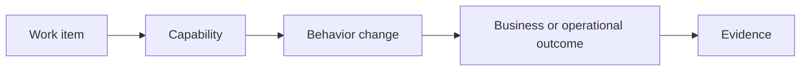
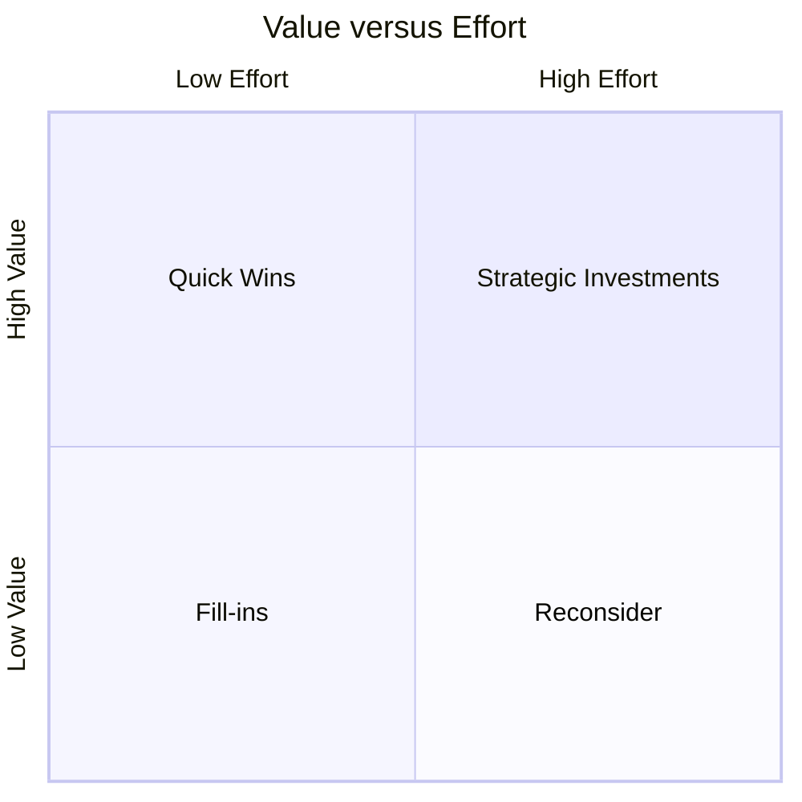

# Part 006 — Value, Effort, Customer Impact, Domain Risk, and Backlog Ordering

## Positioning

Backlog yang lengkap belum tentu backlog yang berguna.

Product Backlog harus **ordered**, bukan hanya prioritized.

Priority sering dianggap binary atau ordinal sederhana:

- high;
- medium;
- low.

Ordering lebih kuat. Ia memaksa organisasi menjawab:

> Jika capacity hanya cukup untuk satu item berikutnya, item mana yang harus diambil dan mengapa?

Ordering adalah product decision yang mempertimbangkan:

- expected value;
- customer impact;
- risk;
- effort;
- dependency;
- urgency;
- learning;
- dan strategic fit.

> **Core thesis:** backlog ordering adalah keputusan ekonomi dan risiko di bawah uncertainty, bukan voting popularitas atau urutan siapa yang paling keras meminta.

---

## 1. Output versus Outcome

### 1.1 Output

Output adalah hasil aktivitas.

Contoh:

- endpoint dibuat;
- screen selesai;
- dashboard tersedia;
- test ditambah;
- pipeline diperbarui.

### 1.2 Outcome

Outcome adalah perubahan pada behavior, capability, risk, atau result.

Contoh:

- quote processing lebih cepat;
- invalid order berkurang;
- support diagnosis lebih singkat;
- deployment failure turun;
- customer dapat mengaktifkan capability tanpa manual configuration.

### 1.3 Why output dominates

Output lebih mudah dihitung.

Outcome:

- membutuhkan waktu;
- dipengaruhi faktor lain;
- kadang sulit diukur;
- dan memerlukan feedback production.

Namun sulit bukan alasan untuk mengabaikannya.

### 1.4 Outcome chain



Setiap item penting sebaiknya dapat dijelaskan melalui chain ini.

---

## 2. Ordering Dimensions

Tidak ada satu formula sempurna.

Gunakan beberapa dimensi.

| Dimension | Question |
|---|---|
| Value | Manfaat apa yang tercipta? |
| Customer impact | Siapa terdampak dan seberapa besar? |
| Urgency | Apa konsekuensi jika ditunda? |
| Risk reduction | Risiko apa yang berkurang? |
| Learning | Assumption apa yang diuji? |
| Effort | Berapa besar capacity yang dibutuhkan? |
| Dependency | Apa yang dibuka atau diblokir? |
| Strategic fit | Apakah selaras Product Goal? |
| Reversibility | Seberapa mudah keputusan dibatalkan? |
| Confidence | Seberapa kuat evidence kita? |

### 2.1 Ordering is contextual

Item high value tidak selalu pertama jika:

- effort sangat besar;
- dependency belum ready;
- confidence rendah;
- atau thin slice lain dapat memberi learning lebih cepat.

---

## 3. Value

Value bukan properti absolut.

Value bergantung pada:

- actor;
- timing;
- scope;
- dan alternative.

### 3.1 Value categories

#### Customer value

- new capability;
- reduced friction;
- reliability;
- transparency;
- control.

#### Business value

- revenue;
- retention;
- reduced cost;
- compliance;
- strategic differentiation.

#### Operational value

- lower toil;
- faster diagnosis;
- fewer incidents;
- safer release.

#### Engineering value

- lower change cost;
- better testability;
- reduced coupling;
- platform leverage.

Engineering value harus diterjemahkan ke consequence.

### 3.2 Value trap

- semua item disebut high value;
- value tidak memiliki evidence;
- stakeholder importance disamakan dengan value;
- dan technical preference disebut strategic.

---

## 4. Customer Impact

Customer impact harus spesifik.

Tanyakan:

- berapa customer;
- segmen mana;
- frequency;
- severity;
- workaround;
- dan contract exposure.

### 4.1 Impact matrix

| Reach | Impact | Interpretation |
|---|---|---|
| High | High | Strong candidate for early ordering |
| Low | High | May still be urgent for strategic customer or severe risk |
| High | Low | Optimize through batch or scalable solution |
| Low | Low | Usually lower order unless cheap or prerequisite |

### 4.2 Avoid loudest-customer ordering

Customer escalation adalah signal, bukan otomatis priority.

Periksa:

- contractual obligation;
- reproducibility;
- broader applicability;
- workaround;
- opportunity cost;
- dan precedent.

---

## 5. Cost of Delay

Cost of Delay adalah consequence jika item tidak dilakukan sekarang.

Kategori:

- lost revenue;
- customer churn;
- regulatory exposure;
- operational risk;
- blocked roadmap;
- expiring dependency support;
- dan repeated manual cost.

### 5.1 Time-criticality

Item dapat memiliki value sama tetapi urgency berbeda.

Contoh:

- certificate expiration;
- end-of-support;
- customer launch;
- regulatory deadline.

### 5.2 Cost-of-delay questions

```text
What happens if delayed one sprint?
What happens if delayed one quarter?
Does impact accumulate?
Is there a fixed deadline?
Does delay block other work?
Does delay increase risk non-linearly?
```

---

## 6. Risk Reduction

Risk reduction adalah value.

Risk categories:

- product risk;
- technical risk;
- operational risk;
- security risk;
- compliance risk;
- delivery risk;
- dependency risk;
- dan reputation risk.

### 6.1 Exposure model

Secara konseptual:

```text
Risk exposure = probability × impact × duration
```

Tambahkan detectability bila diperlukan:

```text
Operational exposure ≈ probability × impact × time-to-detect × time-to-recover
```

### 6.2 Risk reduction item

Good:

> Add idempotency and duplicate detection because repeated order submission can create duplicate downstream orders, with high customer and reconciliation impact.

Weak:

> Improve robustness.

---

## 7. Learning Value

Beberapa item bernilai karena mengurangi uncertainty.

Contoh:

- prototype;
- customer validation;
- compatibility test;
- data profiling;
- load test;
- dan spike.

### 7.1 Learning as first-class outcome

Good learning item:

```text
Critical assumption:
Evidence required:
Decision unlocked:
Timebox:
```

### 7.2 Learning anti-pattern

- “do research”;
- no decision;
- no assumption;
- dan result tidak memengaruhi ordering.

---

## 8. Effort dan Complexity

Effort bukan hanya coding time.

Masukkan:

- analysis;
- design;
- review;
- test;
- integration;
- release;
- migration;
- coordination;
- dan operational readiness.

### 8.1 Local effort versus system effort

A change may be easy locally but expensive systemically.

Contoh:

- one-line schema change;
- but coordinated consumer release;
- migration;
- compatibility;
- dan support update.

### 8.2 Effort uncertainty

Gunakan range atau confidence.

```text
Small effort, high confidence
Medium effort, medium confidence
Large effort, low confidence
```

### 8.3 Effort trap

- angka dianggap presisi;
- hanya development effort;
- dependency wait diabaikan;
- dan rework risk tidak masuk.

---

## 9. Dependency Value

Item dapat diurutkan tinggi karena membuka work lain.

### 9.1 Enabling dependency

Contoh:

- test environment;
- feature flag;
- shared contract;
- migration foundation;
- security approval.

### 9.2 Dependency trap

Semua foundation disebut prerequisite.

Challenge:

- apakah benar harus selesai penuh;
- dapatkah thin path dibuat;
- apakah interface dapat distub;
- apakah sequencing dapat diubah;
- dan apakah dependency merupakan habit.

---

## 10. Strategic Fit

Product Goal memberi filter.

Item dapat bernilai tetapi tidak cocok untuk sekarang.

Tanyakan:

- apakah mendukung current Product Goal;
- apakah mengganggu focus;
- apakah opportunity cost dapat diterima;
- dan apakah stakeholder memahami trade-off.

### 10.1 Strategic dilution

Jika terlalu banyak goal aktif:

- ordering kehilangan makna;
- semua item tampak penting;
- dependency meningkat;
- dan outcome sulit diamati.

---

## 11. Confidence

Ordering seharusnya mempertimbangkan strength of evidence.

### 11.1 Confidence levels

High:

- production data;
- repeated customer signal;
- known regulatory requirement;
- proven technical path.

Medium:

- strong stakeholder evidence;
- representative example;
- known architecture.

Low:

- assumption;
- single anecdote;
- speculative platform need;
- unknown integration.

### 11.2 Confidence-adjusted value

Secara konseptual:

```text
Expected value = potential value × confidence
```

Jangan menjadikan ini angka palsu. Gunakan sebagai reasoning.

---

## 12. Ordering Techniques

### 12.1 Simple value-effort matrix



Kelemahan:

- subjective;
- risk dan urgency tersembunyi;
- dependency tidak terlihat.

### 12.2 Weighted scoring

Contoh:

```text
Score =
  3 × Customer Impact
+ 3 × Risk Reduction
+ 2 × Urgency
+ 2 × Strategic Fit
+ 1 × Learning
- 2 × Effort
- 1 × Dependency Risk
```

Gunakan untuk conversation, bukan truth machine.

### 12.3 RICE-like reasoning

- Reach
- Impact
- Confidence
- Effort

Berguna untuk feature comparison.

Kurang cocok bila:

- compliance;
- incident risk;
- atau platform dependency mendominasi.

### 12.4 WSJF-like reasoning

Konsep:

```text
Cost of Delay / Job Size
```

Berguna untuk sequencing.

Risiko:

- angka palsu;
- stakeholder gaming;
- dan hidden dependency.

### 12.5 Opportunity scoring

Bandingkan importance dan satisfaction.

Berguna untuk customer problem.

### 12.6 Risk-first ordering

Untuk migration atau production-sensitive work:

- reduce unknown;
- enable observability;
- validate contract;
- then expand scope.

---

## 13. Backlog Ordering Conversation

### 13.1 Input

- Product Goal;
- customer evidence;
- roadmap;
- incidents;
- dependencies;
- capacity;
- architecture constraints;
- dan operational risk.

### 13.2 Conversation structure

```text
Why now?
Who benefits?
What happens if delayed?
What is the smallest useful slice?
What risk or assumption dominates?
What dependency must be ready?
What evidence will change our view?
```

### 13.3 Product Owner authority

Product Owner owns ordering.

Team contributes evidence.

Senior engineer should not say:

> This technical work must be top priority because engineering says so.

Say:

> This work reduces a known failure mode that caused two incidents and currently adds three days to every release. If deferred, the next roadmap item inherits the same risk.

---

## 14. Ordering Technical Debt

Technical debt competes with feature work.

### 14.1 Debt prioritization dimensions

- change frequency;
- defect history;
- operational risk;
- security exposure;
- lead-time impact;
- support burden;
- dan roadmap intersection.

### 14.2 Debt intersection model

Debt becomes more urgent when:

```text
High debt severity
× High change frequency
× Near-term roadmap dependency
```

### 14.3 Debt options

- fix now;
- limit scope;
- contain risk;
- instrument first;
- accept temporarily;
- or redesign later.

Document accepted debt.

---

## 15. Ordering Reliability and Observability Work

Reliability work may not produce visible feature.

Frame through:

- outage risk;
- detection;
- recovery;
- customer impact;
- dan operational cost.

### 15.1 Example

Weak:

> Add more monitoring.

Strong:

> Add transition-age metrics and alerts because stuck orders are currently discovered through customer tickets after several hours. The target is detection within ten minutes and a runbook for recovery.

---

## 16. Ordering Bugs

Bug ordering considers:

- severity;
- frequency;
- reach;
- workaround;
- regression;
- customer commitment;
- risk of fix;
- dan release timing.

### 16.1 Bug debt

Low-priority bug accumulation can create:

- support cost;
- degraded trust;
- complex test matrix;
- dan architecture distortion.

Review bug trends, not only individual bug.

---

## 17. Domain Risk

Domain risk is the risk of misunderstanding business behavior.

In Quote & Order-like systems:

- state transition;
- pricing rule;
- approval;
- eligibility;
- effective date;
- customer variation;
- and downstream consequence.

### 17.1 Domain risk indicators

- many exceptions;
- temporal rules;
- high financial consequence;
- irreversible action;
- cross-system state;
- manual override;
- dan ambiguous ownership.

### 17.2 Ordering response

High domain-risk item may need:

- example mapping;
- domain workshop;
- state model;
- or thin-slice validation first.

---

## 18. Regulatory and Contractual Work

Do not automatically label all regulatory work as highest priority.

Clarify:

- legal requirement;
- effective date;
- jurisdiction;
- customer contract;
- evidence requirement;
- penalty;
- dan scope.

### 18.1 Compliance theater

- vague claim;
- no accountable owner;
- no deadline source;
- dan no acceptance evidence.

Senior engineer should ask for traceable requirement while avoiding legal interpretation beyond role.

---

## 19. Cross-Team Ordering

Cross-team work introduces coordination economics.

### 19.1 Joint ordering problem

Team A may value dependency differently from Team B.

Need:

- shared outcome;
- dependency owner;
- date;
- contract;
- dan escalation.

### 19.2 Anti-pattern

- “Team B has no capacity” as final answer;
- no portfolio decision;
- hidden queue;
- dan local backlog optimization.

---

## 20. Portfolio Pressure and Stakeholder Negotiation

Stakeholders often bring:

- commercial urgency;
- customer escalation;
- leadership request;
- incident pressure;
- dan roadmap commitment.

### 20.1 Senior engineer response

Do not say yes/no prematurely.

Provide:

- current goal;
- impact of interruption;
- options;
- risk;
- dan decision needed.

### 20.2 Trade-off packet

```text
Requested change:
Reason:
Current committed goal:
Impact if inserted:
Scope to remove:
Risk:
Recommendation:
Decision owner:
```

---

## 21. Worked Example: Competing Backlog Items

### Candidates

A. New approval feature  
B. Fix duplicate order defect  
C. Refactor quote rule engine  
D. Add observability for stuck transitions  
E. Customer-specific report

### Reasoning

| Item | Value | Risk | Urgency | Effort | Confidence |
|---|---|---|---|---|---|
| A | High | Medium | Medium | High | Medium |
| B | High | High | High | Medium | High |
| C | Medium | Medium | Low | High | High |
| D | Medium | High | High | Small | High |
| E | Medium | Low | High for one customer | Medium | Medium |

Possible ordering:

1. D — fast risk reduction and detection.
2. B — high customer and operational impact.
3. A thin slice — strategic capability.
4. E — subject to commercial decision.
5. C — schedule before next major rule expansion, not giant rewrite.

Ordering depends on context, but reasoning is explicit.

---

## 22. Backlog Ordering Anti-Patterns

### Highest-paid-person ordering

Decision follows hierarchy without evidence.

### Loudest customer wins

Escalation volume becomes priority.

### Everything high priority

No trade-off.

### FIFO backlog

Oldest item always first.

### Estimate-only ordering

Small items dominate despite low value.

### Feature-only ordering

Reliability, security, debt, dan support invisible.

### Architecture-first ordering

Foundation built before validating need.

### Deadline-only ordering

Quality and risk ignored.

### Score worship

Formula replaces judgment.

### Frozen roadmap

New evidence cannot change order.

---

## 23. Process Smells

- backlog top 20 tidak berubah;
- tidak ada Product Goal;
- banyak item high priority;
- dependency belum ready;
- outcome tidak tertulis;
- technical debt tidak pernah naik;
- incident action tertunda terus;
- stakeholder bypass PO;
- dan ordering berubah tanpa decision record.

---

## 24. Senior Engineer Operating Model

### 24.1 Bring evidence

- incident count;
- defect pattern;
- latency;
- support effort;
- deployment delay;
- dependency risk.

### 24.2 Explain consequence

Translate:

```text
Technical condition
-> delivery impact
-> customer/business risk
-> options
```

### 24.3 Protect Product Owner authority

Contribute strongly, but let product ordering remain explicit.

### 24.4 Challenge false urgency

Ask:

- deadline source;
- impact if delayed;
- affected customer;
- dan alternative.

### 24.5 Propose thin slices

Reduce contention by making option smaller.

### 24.6 Record accepted risk

If work is deferred:

- risk owner;
- review date;
- trigger;
- containment.

---

## 25. Internal Verification Checklist

### Product ordering

- Siapa final ordering authority?
- Seberapa sering backlog order direview?
- Apa horizon refinement?
- Bagaimana urgent request masuk?
- Bagaimana conflict diselesaikan?

### Evidence

- Customer data apa tersedia?
- Product metric apa digunakan?
- Incident dan defect trend tersedia?
- Apakah support volume terlihat?
- Apakah operational metric masuk planning?

### Scoring

- Apakah ada framework scoring?
- Apa dimension-nya?
- Apakah score menentukan keputusan atau hanya input?
- Apakah stakeholder dapat memahami reasoning?

### Technical work

- Bagaimana debt diprioritaskan?
- Apakah ada capacity policy?
- Bagaimana security, reliability, dan observability masuk backlog?
- Apa contoh non-feature work yang berhasil diprioritaskan?

### Roadmap

- Apakah roadmap outcome-oriented?
- Apa commitment level?
- Bagaimana confidence ditampilkan?
- Bagaimana dependency direpresentasikan?
- Seberapa mudah roadmap beradaptasi?

### Cross-team

- Bagaimana dependency diurutkan lintas team?
- Siapa portfolio owner?
- Apa escalation path?
- Bagaimana customer commitment dikoordinasikan?

---

## 26. Practical Exercises

### Exercise 1 — Outcome rewrite

Ambil lima backlog item.

Tulis:

```text
Output:
Capability:
Behavior change:
Outcome:
Evidence:
```

### Exercise 2 — Ordering rationale

Untuk top 10 item, isi:

| Item | Why now | Delay cost | Risk | Effort | Confidence |
|---|---|---|---|---|---|

### Exercise 3 — Debt prioritization

Pilih satu debt item.

Nilai:

- change frequency;
- defect history;
- roadmap dependency;
- operational impact;
- cost of deferral.

### Exercise 4 — Urgent request challenge

Simulasikan request:

> Customer needs this next sprint.

Tulis pertanyaan klarifikasi dan trade-off packet.

### Exercise 5 — Risk acceptance

Pilih item risk-reduction yang ditunda.

Catat:

- risk owner;
- containment;
- trigger;
- review date.

---

## 27. Part Completion Checklist

Anda selesai jika mampu:

- membedakan output dan outcome;
- menjelaskan dimensi backlog ordering;
- menggunakan value, impact, urgency, effort, risk, dan confidence;
- menilai Cost of Delay;
- mengurutkan debt, bug, reliability, dan learning work;
- challenge false urgency;
- dan memberi evidence tanpa mengambil alih authority Product Owner.

---

## 28. Key Takeaways

1. Ordered backlog lebih kuat daripada priority labels.
2. Outcome harus menjadi reasoning utama.
3. Value mencakup customer, business, operational, dan engineering value.
4. Cost of Delay menjelaskan urgency.
5. Risk reduction dan learning adalah value.
6. Effort harus mencakup system effort.
7. Confidence memengaruhi expected value.
8. Scoring adalah alat conversation, bukan mesin keputusan.
9. Senior engineer membawa evidence dan options.
10. Ordering process internal CSG harus diverifikasi.

---

## 29. References

Conceptual baseline:

- The Scrum Guide.
- Lean product and backlog management practices.
- General prioritization, Cost of Delay, risk, and product outcome practices.

These concepts are not descriptions of internal CSG processes.
