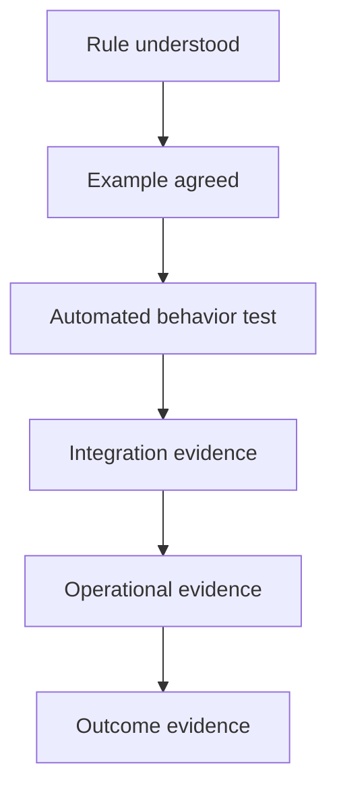

# Part 008 — Example Mapping, Negative Scenarios, NFRs, and Story Challenge

## Positioning

Acceptance criteria bukan daftar langkah QA.

Acceptance criteria adalah batas observable yang menjelaskan kapan behavior dianggap benar.

Ia menghubungkan:

- product intent;
- business rule;
- engineering implementation;
- test evidence;
- dan Definition of Done.

Acceptance criteria yang lemah membuat tim terlihat aligned di awal tetapi berbeda interpretation saat implementation dan validation.

> **Core thesis:** acceptance criteria yang baik mengubah ambiguity menjadi examples, membuat failure behavior terlihat, dan memasukkan quality attributes sebelum code selesai.

---

## 1. Acceptance Criteria versus Definition of Done

### Acceptance Criteria

Spesifik untuk backlog item.

Menjelaskan:

- behavior;
- rule;
- scenario;
- dan expected result.

### Definition of Done

Standard quality umum untuk Increment.

Menjelaskan hal seperti:

- code reviewed;
- test pass;
- integrated;
- documented;
- observable;
- dan release-ready.

### 1.1 Example

Acceptance criterion:

> Quote above the configured discount threshold enters Pending Approval.

Definition of Done:

> Automated tests pass, audit event emitted, metrics available, compatibility validated, and documentation updated.

Keduanya saling melengkapi.

---

## 2. Characteristics of Good Acceptance Criteria

Good acceptance criteria:

- observable;
- testable;
- concise;
- behavior-oriented;
- unambiguous enough;
- and tied to business intent.

### 2.1 Observable

Expected result dapat dilihat melalui:

- UI;
- API response;
- state;
- event;
- database effect;
- metric;
- audit;
- atau downstream behavior.

### 2.2 Testable

Kriteria memiliki:

- initial condition;
- action;
- dan result.

### 2.3 Behavior-oriented

Lemah:

> Add validation method.

Lebih baik:

> Submission is rejected when the quote has no active customer account.

### 2.4 Independent from implementation where possible

Acceptance criteria sebaiknya tidak mengunci implementation kecuali implementation adalah contract.

---

## 3. Formats

### 3.1 Rule-oriented bullets

```text
- Only quotes in Draft may be submitted.
- Quotes above the threshold require approval.
- Rejected submission does not change quote state.
```

### 3.2 Given / When / Then

```gherkin
Given a quote is in Draft
And its discount exceeds the configured threshold
When the user submits the quote
Then the quote enters Pending Approval
And an approval request is recorded
```

### 3.3 Decision table

| State | Discount | Action | Result |
|---|---:|---|---|
| Draft | <= threshold | Submit | Submitted |
| Draft | > threshold | Submit | Pending Approval |
| Approved | Any | Submit | Rejected |
| Expired | Any | Submit | Rejected |

### 3.4 State transition

Useful untuk lifecycle-heavy domain.

### 3.5 Choosing format

Gunakan format yang paling jelas.

- bullets untuk simple rule;
- Gherkin untuk scenario;
- decision table untuk combinations;
- state model untuk lifecycle;
- sequence diagram untuk integration behavior.

---

## 4. Example Mapping

Example Mapping membantu tim menghubungkan:

- story;
- rules;
- examples;
- dan questions.

Conceptual structure:

```text
Story
  Rule
    Example
    Example
  Rule
    Example
  Question
```

### 4.1 Why example mapping works

Natural language sering terlihat jelas sampai contoh konkret dibuat.

Rule:

> High discount requires approval.

Questions muncul:

- threshold inclusive atau exclusive;
- total atau line-level;
- currency conversion;
- bundle discount;
- customer exception;
- rounding.

### 4.2 Example mapping session

Participants:

- Product Owner/domain representative;
- Engineer;
- QA;
- designer atau specialist bila relevan.

Steps:

1. State story.
2. Identify rules.
3. Add representative examples.
4. Mark open questions.
5. Detect oversized scope.
6. Decide follow-up or split.

### 4.3 Stop condition

Jika terlalu banyak:

- rules;
- questions;
- examples;
- atau integration concerns,

story mungkin terlalu besar atau belum ready.

---

## 5. Positive, Negative, and Boundary Scenarios

### 5.1 Positive scenario

Expected success path.

### 5.2 Negative scenario

Action should be rejected or handled safely.

Contoh:

- unauthorized approver;
- invalid state;
- missing mandatory data;
- duplicate submission;
- expired quote.

### 5.3 Boundary scenario

Values at rule edge.

Contoh threshold 20%:

- 19.99%;
- 20%;
- 20.01%;
- rounding;
- null;
- negative;
- unexpected precision.

### 5.4 Recovery scenario

Setelah failure:

- can retry;
- must correct data;
- remains blocked;
- or requires manual intervention.

### 5.5 Concurrency scenario

- two approvers act;
- quote edited during approval;
- duplicate event arrives;
- retry overlaps with original request.

Senior engineer harus aktif mencari concurrency dan temporal edge pada distributed system.

---

## 6. Edge Case Discovery

Edge case bukan semua hal imajinatif.

Prioritaskan berdasarkan:

- likelihood;
- impact;
- detectability;
- irreversibility;
- dan historical evidence.

### 6.1 Edge categories

#### Data

- null;
- empty;
- maximum size;
- special character;
- invalid encoding;
- duplicate.

#### Time

- expiration;
- timezone;
- daylight transition;
- effective date;
- stale data.

#### State

- invalid transition;
- repeated action;
- partial completion;
- rollback.

#### Authorization

- role mismatch;
- revoked access;
- cross-tenant access.

#### Integration

- timeout;
- partial response;
- duplicate event;
- out-of-order event;
- contract mismatch.

#### Operational

- dependency unavailable;
- retry exhausted;
- alert triggered;
- manual recovery.

---

## 7. Non-Functional Requirements

NFR sering terlalu abstrak.

Lemah:

- system must be fast;
- system must be secure;
- solution must scale.

NFR harus dapat diverifikasi.

### 7.1 Quality attribute categories

- performance;
- availability;
- reliability;
- scalability;
- security;
- observability;
- compatibility;
- maintainability;
- auditability;
- accessibility;
- operability;
- recoverability.

### 7.2 NFR as scenario

Gunakan structure:

```text
Source:
Stimulus:
Environment:
Artifact:
Response:
Measure:
```

Contoh performance:

```text
Source: Quote user
Stimulus: Requests pricing
Environment: Normal production load
Artifact: Pricing workflow
Response: Returns calculated result
Measure: 95% within 2 seconds
```

---

## 8. Observability Requirements

Observability harus dirancang.

### 8.1 Questions

- bagaimana tahu success;
- bagaimana tahu stuck;
- correlation identifier apa;
- metric apa;
- log event apa;
- alert kapan;
- dan runbook action apa.

### 8.2 Acceptance example

```text
Given order submission fails after all retries
When the workflow enters Failed
Then a failure metric is incremented
And the trace contains the quote and order correlation identifiers
And support can identify the terminal reason without database access
```

### 8.3 Anti-pattern

> Logging is added.

Tidak jelas:

- apa;
- kapan;
- siapa consumer;
- dan apakah actionable.

---

## 9. Security Requirements

Security acceptance harus context-specific.

### 9.1 Areas

- authentication;
- authorization;
- tenant isolation;
- data confidentiality;
- integrity;
- audit;
- input validation;
- secret handling;
- rate abuse;
- dan privilege.

### 9.2 Example

```text
Given a user belongs to Tenant A
When the user requests a quote owned by Tenant B
Then access is denied
And no quote metadata is disclosed
And the denied attempt is auditable
```

### 9.3 Security smell

- “secured by existing framework”;
- only happy path;
- no abuse scenario;
- no audit;
- dan authorization confused with authentication.

---

## 10. Performance Requirements

### 10.1 Dimensions

- latency;
- throughput;
- concurrency;
- resource;
- payload;
- dan degradation behavior.

### 10.2 Context matters

A target without workload context is weak.

Specify:

- percentile;
- load;
- dataset;
- environment;
- dan duration.

### 10.3 Example

> Under 100 concurrent quote submissions with representative payloads, 95% complete within 3 seconds and no request exceeds 8 seconds.

### 10.4 Performance anti-pattern

- average only;
- no production-like data;
- no degradation expectation;
- test after release;
- dan local microbenchmark mistaken for end-to-end behavior.

---

## 11. Compatibility Requirements

Enterprise systems evolve incrementally.

Compatibility may include:

- API;
- event schema;
- database;
- configuration;
- stored data;
- UI behavior;
- and deployment sequencing.

### 11.1 Backward compatibility questions

- can old consumer continue;
- can new producer talk to old consumer;
- how default values behave;
- how unknown fields handled;
- and how long versions supported.

### 11.2 Example

```text
Given an existing consumer ignores the new optional field
When a quote event with the field is published
Then the consumer continues processing without failure
```

### 11.3 Compatibility acceptance evidence

- contract test;
- version matrix;
- consumer verification;
- replay;
- migration test.

---

## 12. Reliability and Recovery Requirements

Reliability includes behavior when things fail.

### 12.1 Questions

- timeout;
- retry;
- idempotency;
- duplicate;
- partial completion;
- fallback;
- and manual recovery.

### 12.2 Example

```text
Given the downstream order service times out
When submission is retried
Then at most one downstream order is created
And the quote retains a recoverable submission status
```

### 12.3 Failure behavior is product behavior

Error message, retry eligibility, and state after failure matter to users and operators.

---

## 13. Auditability Requirements

Audit requirement should define:

- actor;
- action;
- timestamp;
- before/after;
- reason;
- correlation;
- retention;
- dan access.

### Example

> Every approval decision records approver identity, decision, timestamp, quote version, and reason; later quote edits do not overwrite prior evidence.

---

## 14. Accessibility Requirements

For UI:

- keyboard;
- screen reader;
- contrast;
- focus;
- error association;
- semantic label;
- and zoom.

Accessibility should be part of acceptance, not late review.

---

## 15. Data Requirements

Acceptance criteria should consider:

- ownership;
- validation;
- retention;
- migration;
- privacy;
- lineage;
- and deletion.

### Example

```text
Given an existing quote lacks the new approval metadata
When it is loaded after deployment
Then it remains readable
And defaults to the documented legacy behavior
```

---

## 16. Integration Acceptance

Do not stop at mocked success.

### Levels

1. Unit behavior.
2. Component contract.
3. Integration environment.
4. End-to-end.
5. Production-like evidence.
6. Runtime monitoring.

Not every story needs all levels.

Risk determines evidence.

---

## 17. Acceptance Criteria and Test Strategy

Acceptance criteria are not identical to all tests.

Acceptance criteria answer:

- behavior apa yang diterima.

Test strategy menentukan:

- level test;
- automation;
- data;
- environment;
- and coverage.

One acceptance criterion can require:

- unit;
- contract;
- integration;
- exploratory;
- and operational validation.

---

## 18. Acceptance Criteria Anti-Patterns

### Implementation checklist

- create class;
- add method;
- update schema.

### Restating story

Acceptance criteria hanya mengulang title.

### Happy-path only

Tidak ada invalid state atau failure.

### Unbounded completeness

Puluhan edge case dimasukkan tanpa prioritization.

### UI screenshot as contract

Behavior, accessibility, and responsive state tidak terlihat.

### QA-owned criteria

Product dan engineer tidak ikut memahami.

### Late criteria

Ditulis setelah code.

### Vague NFR

“Fast, secure, scalable.”

### Copy-paste criteria

Tidak sesuai story.

---

## 19. Senior Engineer Story Challenge

### 19.1 Ask for examples

> Bisa berikan satu contoh sukses dan satu contoh yang harus ditolak?

### 19.2 Ask for state

> Setelah failure, state entity apa dan apakah retry aman?

### 19.3 Ask for authorization

> Siapa boleh melakukan action dan bagaimana cross-tenant access dicegah?

### 19.4 Ask for compatibility

> Consumer lama atau data lama bagaimana?

### 19.5 Ask for operability

> Bagaimana support membedakan timeout sementara dan terminal business rejection?

### 19.6 Ask for performance

> Pada load dan percentile berapa target ini berlaku?

### 19.7 Ask for scope

> Edge case mana yang wajib untuk first slice dan mana follow-up?

---

## 20. Worked Example: Safe Order Retry

### Story

> As a support analyst, I can retry an eligible failed order submission so that transient integration failures can be recovered without direct database intervention.

### Rules

- only terminal transient failures eligible;
- business rejection not eligible;
- retry requires permission;
- retry idempotent;
- previous attempt remains auditable.

### Positive example

```gherkin
Given an order submission failed due to a downstream timeout
And no downstream order was confirmed
When an authorized support analyst retries
Then submission is attempted again
And only one order may be created
```

### Negative example

```gherkin
Given an order was rejected for invalid product eligibility
When support requests retry
Then retry is denied
And the rejection reason remains visible
```

### Concurrency example

```gherkin
Given two analysts retry the same failed submission
When both actions occur concurrently
Then only one retry execution is accepted
And the other receives the current retry status
```

### Observability

- retry count;
- terminal reason;
- correlation ID;
- audit actor;
- outcome metric.

### Security

- support role;
- tenant boundary;
- audit.

### Performance

- action response threshold;
- asynchronous processing behavior.

---

## 21. Quality Attribute Trade-Offs

Quality attributes dapat konflik.

Contoh:

- security versus usability;
- consistency versus availability;
- latency versus durability;
- observability versus data privacy;
- backward compatibility versus simplification.

Acceptance criteria harus mencatat keputusan penting.

Jangan menyembunyikan trade-off.

---

## 22. Evidence Ladder



Semakin tinggi risk, semakin kuat evidence yang diperlukan.

---

## 23. Process Smells

- acceptance criteria kosong;
- criteria berubah saat QA;
- criteria hanya happy path;
- no examples;
- NFR tidak pernah muncul;
- compatibility issue ditemukan late;
- support tidak dapat diagnose;
- criteria sangat panjang karena story terlalu besar;
- dan QA menjadi satu-satunya interpreter.

---

## 24. Senior Engineer Operating Model

### Before refinement

- identify risky quality attributes;
- review incident and defect history;
- identify consumer and state.

### During refinement

- propose representative examples;
- ask failure and recovery;
- make compatibility visible;
- separate first-slice criteria from future scope.

### During implementation

- preserve acceptance intent;
- update criteria when learning changes;
- avoid silent interpretation.

### Before Done

- verify evidence;
- explain limitation;
- ensure operational acceptance;
- and avoid demo-only validation.

---

## 25. Internal Verification Checklist

### Acceptance format

- Apakah team memakai Given/When/Then?
- Apakah decision table digunakan?
- Siapa menulis criteria?
- Kapan criteria dianggap cukup?
- Apakah criteria berubah setelah Sprint dimulai?

### Quality attributes

- Apa checklist security?
- Apa performance baseline?
- Apa observability expectation?
- Apa compatibility matrix?
- Apa audit requirement?
- Apa accessibility standard?

### Testing

- Level test apa yang wajib?
- Apa test automation ownership?
- Bagaimana test data disiapkan?
- Apa environment constraint?
- Apa evidence yang disimpan?

### Operational readiness

- Apakah support dilibatkan?
- Apakah runbook diperlukan?
- Apakah alert memiliki owner?
- Bagaimana rollback atau retry divalidasi?
- Apa production verification?

### Historical evidence

- Defect apa berasal dari missing edge case?
- Incident apa berasal dari NFR yang tidak eksplisit?
- Apa recurring compatibility failure?
- Apa acceptance pattern yang sering menyebabkan rework?

---

## 26. Practical Exercises

### Exercise 1 — Rewrite vague criteria

Ubah:

> System should be fast.

Menjadi measurable scenario.

### Exercise 2 — Example map

Untuk satu story, buat:

- 3 rules;
- 2 examples per rule;
- open questions.

### Exercise 3 — Edge-case taxonomy

Cari scenario:

- data;
- time;
- state;
- authorization;
- concurrency;
- integration;
- recovery.

### Exercise 4 — NFR audit

Ambil satu feature dan isi:

| Attribute | Requirement | Evidence |
|---|---|---|
| Security | | |
| Performance | | |
| Observability | | |
| Compatibility | | |
| Recoverability | | |

### Exercise 5 — Acceptance versus DoD

Pisahkan existing checklist menjadi:

- story-specific acceptance;
- team-wide Definition of Done.

---

## 27. Part Completion Checklist

Anda selesai jika mampu:

- membedakan acceptance criteria dan Definition of Done;
- menulis testable behavior;
- menggunakan example mapping;
- menemukan positive, negative, boundary, concurrency, dan recovery scenario;
- membuat NFR measurable;
- menangkap observability, security, performance, compatibility, dan audit requirement;
- dan challenge story tanpa memperbesar scope secara tidak terkendali.

---

## 28. Key Takeaways

1. Acceptance criteria adalah behavioral boundary.
2. Example mengungkap ambiguity lebih baik daripada prose panjang.
3. Negative dan recovery behavior adalah product behavior.
4. Edge case harus risk-based.
5. NFR harus measurable dan context-specific.
6. Observability dan compatibility harus dirancang sebelum release.
7. Acceptance criteria bukan seluruh test strategy.
8. Criteria yang terlalu besar sering menandakan story terlalu besar.
9. Senior engineer harus membuat failure dan operational behavior terlihat.
10. Quality checklist internal harus diverifikasi.

---

## 29. References

Conceptual baseline:

- Agile acceptance and example-driven development practices.
- Example Mapping.
- Behavior-driven scenario formats.
- General software quality attribute and operational readiness practices.

These concepts are not descriptions of internal CSG processes.
