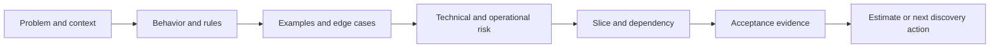

# Part 011 — Product, Domain, and Technical Refinement

## Positioning

Backlog refinement bukan ceremony resmi Scrum dengan timebox wajib, tetapi praktik penting untuk menjaga Product Backlog tetap transparan, terurut, dan cukup siap untuk dipertimbangkan pada Sprint Planning.

Refinement yang sehat bukan meeting untuk “membaca ticket”. Ia adalah loop discovery dan risk reduction yang melibatkan pihak yang relevan untuk mengubah item yang kabur menjadi kandidat work yang:

- dipahami;
- memiliki outcome;
- cukup kecil;
- memiliki acceptance evidence;
- dependency-nya terlihat;
- dan uncertainty-nya cukup rendah untuk diforecast.

> **Core thesis:** refinement adalah tempat organisasi membayar biaya murah untuk menemukan masalah sebelum biaya masalah tersebut menjadi implementation rework, integration delay, production defect, atau stakeholder surprise.

---

## 1. Refinement sebagai Continuous Activity

Refinement terjadi:

- saat Product Owner berdiskusi dengan stakeholder;
- saat engineer meninjau dependency;
- saat QA menemukan scenario;
- saat designer mengeksplorasi workflow;
- saat architect memvalidasi boundary;
- dan saat team menyusun backlog bersama.

Meeting refinement hanyalah salah satu mekanisme.

### 1.1 Why continuous refinement matters

Jika refinement hanya dilakukan menjelang Sprint Planning:

- context datang terlambat;
- dependency belum siap;
- estimation menjadi tebakan;
- planning menjadi discovery meeting;
- dan Sprint dimulai dengan hidden work.

### 1.2 Refinement horizon

Tim biasanya membutuhkan beberapa horizon.

| Horizon | Focus |
|---|---|
| Current Sprint | Clarification dan adaptation |
| Next Sprint | Readiness dan risk reduction |
| Near-term | Decomposition dan dependency |
| Longer-term | Discovery, architecture, roadmap uncertainty |

Jangan refine semua backlog dengan detail sama.

Semakin jauh horizon, semakin besar uncertainty yang dapat diterima.

---

## 2. Refinement Outcomes

Refinement tidak harus menghasilkan “Ready” setiap kali.

Possible outcomes:

- item cukup jelas untuk estimasi;
- item perlu spike;
- item perlu product decision;
- item harus di-split;
- dependency harus dikonfirmasi;
- design exploration diperlukan;
- item diturunkan prioritas;
- atau item dibuang.

Refinement yang baik dapat menghasilkan keputusan untuk **tidak melanjutkan**.

---

## 3. Product Refinement

Product refinement fokus pada:

- problem;
- actor;
- desired behavior;
- customer impact;
- outcome;
- scope;
- dan ordering.

### 3.1 Key questions

```text
What problem are we solving?
Who experiences it?
Why now?
What changes if solved?
What happens if delayed?
What is out of scope?
What evidence proves usefulness?
```

### 3.2 Product refinement anti-pattern

- discussion langsung masuk implementation;
- stakeholder request dianggap requirement final;
- outcome tidak jelas;
- dan semua variation dianggap wajib.

---

## 4. Domain Refinement

Domain refinement fokus pada:

- business rule;
- terminology;
- state;
- exception;
- temporal behavior;
- dan policy precedence.

### 4.1 Useful artifacts

- domain glossary;
- decision table;
- state transition;
- example map;
- event timeline;
- process model;
- and rule matrix.

### 4.2 Domain refinement question set

```text
What state exists before the action?
What rule allows or rejects it?
What exception exists?
What happens after partial failure?
Which terms are ambiguous?
Which behavior varies by tenant/customer?
```

### 4.3 Domain anti-pattern

- rule hanya ada di code lama;
- SME menjadi single source;
- prose panjang tanpa example;
- dan edge case baru ditemukan oleh support.

---

## 5. Technical Refinement

Technical refinement fokus pada:

- implementation options;
- architecture;
- compatibility;
- dependency;
- migration;
- observability;
- security;
- performance;
- dan operational readiness.

### 5.1 Technical refinement is not full design

Tujuannya bukan menyelesaikan seluruh design.

Tujuannya memastikan team memahami cukup banyak untuk:

- estimate;
- identify risk;
- choose slice;
- dan know whether spike is needed.

### 5.2 Technical questions

```text
Which system boundary changes?
What dependency exists?
What contract must remain compatible?
What data changes?
How is rollout performed?
How is failure detected?
How is rollback handled?
What test evidence is required?
```

### 5.3 Technical refinement anti-pattern

- architect memberi solution final;
- team over-design future;
- no operational concern;
- dan technical task tidak terhubung ke outcome.

---

## 6. Participants

Tidak semua orang harus hadir di semua refinement.

### Core participants

- Product Owner;
- Developers;
- QA;
- relevant domain/product representative.

### Conditional participants

- designer;
- architect;
- security;
- platform/SRE;
- support;
- external dependency team;
- customer-facing team.

### 6.1 Participant selection heuristic

Invite someone when:

- they own critical information;
- they own a dependency;
- they own a decision;
- or they will validate the Increment.

### 6.2 Anti-pattern

- terlalu banyak peserta;
- mandatory attendance tanpa relevance;
- atau missing specialist yang menyebabkan late surprise.

---

## 7. Refinement Cadence

Possible models:

- weekly session;
- twice-weekly smaller sessions;
- just-in-time refinement;
- async pre-refinement + sync decision;
- domain-specific workshop.

### 7.1 Cadence selection

Dipengaruhi oleh:

- Sprint length;
- backlog volatility;
- dependency complexity;
- domain complexity;
- dan team distribution.

### 7.2 Remote refinement

Gunakan:

- pre-read;
- asynchronous comments;
- written questions;
- decision log;
- and explicit owner.

Avoid:

- screen-sharing ticket satu per satu;
- no preparation;
- dan discussion yang hanya berguna bagi satu person.

---

## 8. Refinement Input

Healthy input:

- problem context;
- evidence;
- candidate scope;
- known rules;
- design reference;
- dependency status;
- dan open questions.

Unhealthy input:

- title only;
- solution command;
- urgency claim tanpa source;
- atau giant specification yang belum dibaca siapa pun.

---

## 9. Refinement Flow



### 9.1 Step 1 — Clarify intent

Jangan mulai dari “bagaimana implementasi”.

### 9.2 Step 2 — Identify behavior

Actor, state, action, result.

### 9.3 Step 3 — Explore examples

Positive, negative, boundary.

### 9.4 Step 4 — Surface risk

Domain, integration, data, operational.

### 9.5 Step 5 — Slice

Cari smallest useful increment.

### 9.6 Step 6 — Define evidence

Acceptance, test, metric, audit, demo.

### 9.7 Step 7 — Decide next action

Ready, split, spike, blocked, or defer.

---

## 10. Definition of Refined

“Refined” bukan Scrum artifact resmi.

Team dapat menggunakan working definition.

Example:

```text
A Product Backlog Item is refined enough when:
- intent and outcome are understood;
- primary rules and examples exist;
- scope is small enough;
- major dependency is known;
- critical risk is visible;
- acceptance evidence can be described;
- and the team can estimate with reasonable confidence.
```

### 10.1 Avoid gatekeeping

Definition of Refined harus membantu flow.

Jangan gunakan untuk:

- menolak discovery;
- memaksa detail palsu;
- atau menghilangkan team judgment.

---

## 11. Estimation Readiness

Item dapat diestimasi jika team memahami cukup untuk membandingkan complexity dan uncertainty.

Jika estimation divergen, tanyakan:

- apakah scope dipahami berbeda;
- apakah hidden dependency;
- apakah quality expectation berbeda;
- apakah ada unknown unknown signal;
- dan apakah story terlalu besar.

---

## 12. Refinement and Story Slicing

Slicing adalah core output refinement.

Signs item needs splitting:

- terlalu banyak rule;
- terlalu banyak actor;
- banyak independent integration;
- banyak rollout stage;
- dan acceptance criteria sangat panjang.

Good refinement tidak hanya memperjelas giant story. Ia juga mengecilkannya.

---

## 13. Refinement and Dependencies

Dependency categories:

- internal team;
- cross-team;
- vendor;
- customer;
- environment;
- access;
- data;
- API;
- release;
- dan decision.

For each dependency:

```text
Dependency:
Owner:
Status:
Expected date:
Contract/evidence:
Fallback:
Escalation trigger:
```

---

## 14. Refinement and Risk

Risk harus terlihat sebelum Sprint.

### 14.1 Risk dimensions

- probability;
- impact;
- detectability;
- reversibility;
- dan timing.

### 14.2 Risk response

- avoid;
- reduce;
- transfer;
- accept;
- monitor;
- or investigate.

### 14.3 Senior engineer role

Translate technical risk into delivery consequence.

---

## 15. Refinement and Non-Functional Requirements

NFR sering muncul terlambat.

Refinement harus menanyakan:

- security;
- performance;
- observability;
- compatibility;
- reliability;
- accessibility;
- dan audit.

Tidak semua item membutuhkan deep analysis semua attribute.

Use risk-based selection.

---

## 16. Refinement and Design

Design dapat dilakukan:

- before refinement;
- during refinement;
- after refinement;
- or iteratively during Sprint.

Decision depends on uncertainty.

### Design-before-refinement is useful when:

- workflow complex;
- usability risk high;
- architecture boundary unclear;
- or dependency contract needs alignment.

### Avoid

- pixel-perfect design before scope;
- full architecture before learning;
- dan design approval without implementation feedback.

---

## 17. Refinement and Spikes

Use spike when:

- critical question cannot be answered through discussion;
- external behavior unknown;
- performance uncertain;
- data shape unknown;
- or architecture feasibility uncertain.

Spike should have:

- question;
- timebox;
- evidence;
- decision;
- and next step.

---

## 18. Backlog Quality Signals

Healthy backlog:

- top items have context;
- order is meaningful;
- readiness decreases further down;
- dependencies visible;
- and stale items removed.

Unhealthy backlog:

- thousands of old items;
- priority labels same;
- top item not refined;
- repeated duplicate;
- and no Product Goal connection.

---

## 19. Refinement Anti-Patterns

### Ticket reading session

Facilitator membaca description.

### Solution-first

Implementation diputuskan sebelum problem.

### Estimation theater

Goal utama hanya memberi point.

### Over-refinement

Detail dibuat untuk work yang belum tentu dikerjakan.

### Under-refinement

Sprint dimulai dengan title-only item.

### Architecture takeover

Discussion berubah menjadi lecture.

### Product absence

Engineer menebak behavior.

### QA-at-the-end

Negative scenario muncul terlambat.

### No decision

Meeting panjang tanpa outcome.

---

## 20. Failure Modes

### Failure: Sprint Planning too long

Cause:

- refinement tidak dilakukan;
- top backlog tidak siap.

### Failure: Rework mid-Sprint

Cause:

- business rule belum jelas;
- examples kurang.

### Failure: Carry-over

Cause:

- dependency atau scope tersembunyi.

### Failure: Integration surprise

Cause:

- technical refinement tidak mencakup consumer.

### Failure: Operational defect

Cause:

- observability dan recovery tidak dibahas.

---

## 21. Senior Engineer Operating Model

### Before refinement

- review context;
- inspect existing architecture;
- identify likely dependency;
- prepare questions;
- avoid premature solution.

### During refinement

- make uncertainty visible;
- provide options;
- challenge giant scope;
- include operational concerns;
- and help team converge.

### After refinement

- record technical decision;
- ensure dependency owner;
- update risk;
- and avoid side-channel design divergence.

### Guardrail

Senior engineer should improve shared understanding, not become the only person who understands the story.

---

## 22. Worked Example: Quote Status Visibility

### Initial request

> Add order status visibility.

### Product refinement

- actor: support analyst;
- problem: customer asks why order is stuck;
- outcome: reduce diagnosis time.

### Domain refinement

- states;
- terminal vs recoverable;
- status precedence;
- customer-visible wording.

### Technical refinement

- status source;
- event delay;
- data ownership;
- compatibility;
- observability.

### Slice

First slice:

- one order type;
- current status;
- terminal reason;
- no manual retry.

### Evidence

- support can identify state without database access;
- status freshness is visible;
- audit/correlation available.

---

## 23. Refinement Facilitation Template

```md
## Objective

What decision must be enabled?

## Context

Problem, actor, outcome.

## Rules

Business and domain behavior.

## Examples

Positive, negative, boundary.

## Scope

In / out.

## Technical Considerations

Dependency, compatibility, migration, operations.

## Open Questions

Owner and due date.

## Decision

Ready / split / spike / defer / blocked.
```

---

## 24. Internal Verification Checklist

### Cadence

- Seberapa sering refinement dilakukan?
- Apakah ada separate product/domain/technical refinement?
- Siapa fasilitator?
- Apa expected preparation?

### Participants

- Apakah QA hadir?
- Kapan designer/architect/support dilibatkan?
- Apakah dependency team hadir bila perlu?
- Apakah PO memiliki authority?

### Artifacts

- Apa template story?
- Apakah example mapping digunakan?
- Di mana decision dicatat?
- Apa readiness checklist?
- Apakah dependency tracker ada?

### Effectiveness

- Berapa banyak story berubah setelah Sprint dimulai?
- Berapa banyak carry-over akibat hidden scope?
- Berapa banyak defect akibat misunderstood rules?
- Apakah Sprint Planning menjadi discovery?

### Remote

- Apakah pre-read tersedia?
- Apakah async comments digunakan?
- Bagaimana unresolved question ditangani?
- Apakah timezone menghambat decision?

---

## 25. Practical Exercises

### Exercise 1 — Refinement audit

Ambil lima item dan nilai:

| Dimension | Item 1 | Item 2 | Item 3 |
|---|---|---|---|
| Intent | | | |
| Rules | | | |
| Examples | | | |
| Risk | | | |
| Dependency | | | |
| Evidence | | | |

### Exercise 2 — Meeting redesign

Ambil refinement session terakhir.

Catat:

- preparation;
- participant;
- decision;
- unresolved;
- wasted time.

Design versi lebih baik.

### Exercise 3 — Risk-first refinement

Pilih item berisiko tinggi.

Tentukan:

- biggest uncertainty;
- cheapest evidence;
- slice;
- and fallback.

### Exercise 4 — Dependency readiness

Buat dependency card dengan owner, date, fallback, escalation.

---

## 26. Part Completion Checklist

Anda selesai jika mampu:

- menjelaskan refinement sebagai continuous activity;
- membedakan product, domain, dan technical refinement;
- menentukan participant yang tepat;
- menghasilkan clear refinement outcome;
- menggunakan readiness tanpa gatekeeping;
- menghubungkan refinement dengan slicing, estimation, dependency, dan NFR;
- serta meningkatkan refinement sebagai senior engineer tanpa mengambil alih discussion.

---

## 27. Key Takeaways

1. Refinement bukan ceremony wajib, tetapi capability delivery penting.
2. Refinement mengurangi uncertainty sebelum biaya meningkat.
3. Product, domain, dan technical refinement memiliki fokus berbeda.
4. Item tidak harus menjadi Ready; keputusan lain juga valid.
5. Slicing adalah hasil penting refinement.
6. Dependency dan NFR harus terlihat cukup awal.
7. Over-refinement sama buruknya dengan under-refinement.
8. Senior engineer memperjelas risk dan options.
9. Refinement harus menghasilkan keputusan, bukan hanya diskusi.
10. Praktik internal tim harus diverifikasi.

---

## 28. References

Conceptual baseline:

- The Scrum Guide.
- Agile backlog refinement and example-driven discovery practices.
- General enterprise product and technical refinement practices.

These references do not describe internal CSG processes.
