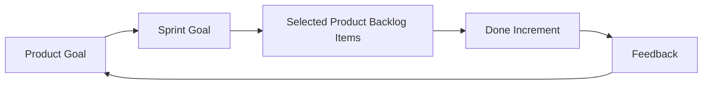

# Part 015 — Sprint Goal, Availability, Carry-Over, Priority, and Scope Negotiation

## Positioning

Sprint Planning bukan meeting untuk mengisi kapasitas sampai penuh.

Sprint Planning adalah proses kolaboratif untuk membentuk:

- alasan Sprint ini bernilai;
- Sprint Goal yang coherent;
- forecast scope yang realistis;
- dan plan awal untuk menghasilkan Increment.

> **Core thesis:** Sprint Planning yang baik mengoptimalkan peluang mencapai Sprint Goal, bukan memaksimalkan jumlah ticket yang dimasukkan.

---

## 1. Three Topics of Sprint Planning

Sprint Planning menjawab:

1. Why is this Sprint valuable?
2. What can be Done this Sprint?
3. How will the chosen work get Done?

Ketiga topik saling bergantung.

Tanpa **why**, Sprint menjadi queue.

Tanpa **what**, goal tidak operasional.

Tanpa **how**, team tidak melihat sequencing dan dependency.

---

## 2. Sprint Goal

Sprint Goal adalah objective tunggal Sprint.

Ia memberi:

- focus;
- flexibility;
- decision support;
- dan shared intent.

### Weak goal

> Complete tickets QO-101 to QO-110.

### Better goal

> Enable one pilot tenant to complete the new quote approval flow with auditable status and safe rollback.

Goal kedua membantu team memutuskan:

- work mana critical;
- scope mana dapat ditunda;
- dan bantuan ke mana harus diarahkan.

---

## 3. Properties of a Good Sprint Goal

Good Sprint Goal:

- outcome-oriented;
- understandable;
- cohesive;
- achievable;
- flexible in implementation;
- connected to Product Goal;
- dan useful for replanning.

### Goal test

```text
If one backlog item is removed, can the goal still be achieved?
If capacity drops, does the goal help prioritize?
Can stakeholders understand why it matters?
Can the team inspect progress against it?
```

---

## 4. Sprint Goal Anti-Patterns

### Ticket bundle

Goal hanya mengulang backlog.

### Multiple unrelated goals

Semua stakeholder mendapatkan satu item.

### Activity goal

> Refactor service and add tests.

Tidak menjelaskan consequence.

### Solution-locked goal

Mengunci implementation sebelum learning.

### Unverifiable goal

> Improve quality.

Tidak ada evidence.

---

## 5. Product Goal to Sprint Goal



Sprint Goal adalah langkah menuju Product Goal, bukan mini-project terpisah.

---

## 6. Capacity versus Availability

Availability adalah waktu nominal.

Capacity adalah kemampuan efektif team untuk menyelesaikan work.

### Availability includes

- working days;
- leave;
- holiday;
- allocation.

### Capacity also considers

- support;
- on-call;
- meetings;
- onboarding;
- reviews;
- incident;
- dependency;
- and existing WIP.

---

## 7. Capacity Model

```text
Nominal availability
- known absence
- fixed obligations
- support/on-call load
- carried WIP
- expected interruption
= realistic planning capacity
```

Do not treat this as precision math.

It is a conversation model.

---

## 8. Team Availability

Availability should be visible before planning.

Consider:

- leave;
- public holidays;
- workshops;
- training;
- customer sessions;
- release duty;
- support rotation;
- and timezone overlap.

Remote/distributed team capacity may be reduced by coordination latency even when total hours remain equal.

---

## 9. Carry-Over Work

Carry-over is unfinished work from previous Sprint.

It is not automatically selected again.

Re-evaluate:

- is it still highest priority;
- does it still support current Sprint Goal;
- what remains;
- why it was unfinished;
- and whether scope should be split.

### Carry-over anti-pattern

- automatically moved;
- no root-cause discussion;
- partial points credited;
- and unfinished assumptions preserved.

---

## 10. Carry-Over Diagnostic

```text
Was the item too large?
Was integration late?
Was QA delayed?
Was a dependency missing?
Did scope change?
Was WIP too high?
Was the Sprint Goal weak?
```

Carry-over is a system signal, not individual failure.

---

## 11. Candidate Backlog Selection

Candidate items should be:

- sufficiently refined;
- ordered;
- understood;
- aligned with Sprint Goal;
- and feasible within capacity.

### Selection sequence

```text
Sprint Goal
-> critical enabling item
-> supporting slices
-> risk-reduction work
-> optional scope
```

---

## 12. Must, Should, Could

Use scope tiers.

### Must

Required for Sprint Goal.

### Should

Important but removable.

### Could

Useful if flow and capacity allow.

This supports replanning.

Avoid pretending all selected items are equally mandatory.

---

## 13. Scope Negotiation

Scope negotiation balances:

- value;
- capacity;
- risk;
- quality;
- and timing.

Healthy negotiation changes:

- variation;
- rollout;
- actor;
- rule;
- or workflow extent.

Unhealthy negotiation removes:

- essential security;
- compatibility;
- test;
- or recoverability.

---

## 14. Negotiation Questions

```text
What is the minimum behavior needed for the goal?
Which variant can wait?
Which dependency is not ready?
What evidence is mandatory?
What risk cannot be deferred?
What item can be removed?
```

---

## 15. Bug and Incident Capacity

Teams with recurring unplanned work should model it.

Possible approaches:

- historical buffer;
- explicit support capacity;
- rotating responder;
- Kanban expedite lane;
- or separate support team.

Do not hide unplanned work outside capacity.

---

## 16. Technical Debt Capacity

Fixed percentage is one option, but not universal.

Better reasoning:

- debt intersects near-term roadmap;
- defect trend;
- operational risk;
- or delivery bottleneck.

Technical work should be selected because of consequence, not quota only.

---

## 17. Planning with Known Dependencies

For each dependency:

```text
Owner:
Status:
Expected date:
Evidence:
Fallback:
Escalation trigger:
```

If a critical dependency is not ready:

- change sequence;
- select a different slice;
- use a spike;
- or lower confidence.

---

## 18. Initial Sprint Plan

The Sprint Backlog includes a plan.

Plan may show:

- sequencing;
- pairing;
- integration point;
- test strategy;
- rollout;
- and ownership.

It does not need exhaustive tasks.

---

## 19. Self-Management

Developers determine:

- what they can forecast;
- how to organize work;
- how to adapt plan;
- and who works on what.

Managers and Product Owners provide context and constraints, not task assignment.

---

## 20. Planning and Definition of Done

Capacity must account for:

- code review;
- test;
- integration;
- documentation;
- observability;
- migration;
- and release readiness.

If planning counts only implementation, overcommitment is built in.

---

## 21. Planning and WIP

Sprint Planning should avoid starting everything.

A good plan can sequence:

1. finish critical slice;
2. validate;
3. then pull next item.

Do not allocate one ticket per engineer as default.

---

## 22. Risk Buffer

Buffer is justified when historical uncertainty exists.

Examples:

- production support;
- external integration;
- unstable environment;
- new domain;
- or migration.

Buffer should not become hidden idle time or permanent excuse.

---

## 23. Planning with Remote Teams

Use:

- pre-read;
- asynchronous clarification;
- visible availability;
- timezone-aware dependency;
- and written decision.

Avoid:

- discovering all context live;
- no break in long meeting;
- and relying on verbal memory.

---

## 24. Planning Facilitation Structure

```text
1. Reconfirm Product Goal and context.
2. Propose Sprint Goal.
3. Review capacity.
4. Select must-have slices.
5. Review risk and dependency.
6. Add optional scope.
7. Confirm initial plan.
8. State assumptions and confidence.
```

---

## 25. Planning Anti-Patterns

### Capacity stuffing

Every point filled.

### Manager assignment

Self-management removed.

### Velocity contract

Average becomes mandatory target.

### Goal after scope

Goal invented after ticket selection.

### Hidden WIP

Previous unfinished work ignored.

### No quality cost

Testing and release omitted.

### All-or-nothing scope

No flexibility.

### Planning as refinement

Stories understood for first time.

---

## 26. Failure Modes

### Goal fails despite high completion

Items were unrelated.

### Many carry-over items

WIP and scope too high.

### Last-day testing

Plan sequenced by phase.

### Dependency blocks Sprint

Readiness not verified.

### Team appears underutilized

Focus on individual allocation rather than flow.

---

## 27. Senior Engineer Operating Model

### Before planning

- review top backlog;
- inspect dependency;
- surface technical risk;
- understand availability.

### During planning

- help shape goal;
- expose hidden work;
- suggest sequencing;
- challenge overcommitment;
- and preserve quality.

### After planning

- align on early integration;
- ensure ownership is distributed;
- and track assumptions.

### Guardrail

Do not dominate estimates or assign work.

---

## 28. Worked Example: Approval Pilot Sprint

### Goal

Enable one pilot tenant to complete discount approval end-to-end with auditable state.

### Must

- threshold rule;
- pending approval state;
- authorized approval;
- audit event;
- pilot flag.

### Should

- support visibility;
- dashboard metric.

### Could

- configurable approval reason.

### Deferred

- delegation;
- multiple levels;
- category-specific threshold.

This creates a coherent Sprint.

---

## 29. Process Smells

- no Sprint Goal;
- goal is a ticket list;
- capacity assumes everyone full;
- carry-over normalized;
- support work hidden;
- testing planned last;
- all items begin day one;
- and team cannot explain scope flexibility.

---

## 30. Internal Verification Checklist

### Sprint Goal

- How is the goal written?
- Who contributes?
- Is it used in Daily Scrum?
- Can scope change while preserving goal?
- How is goal success reviewed?

### Capacity

- How are leave, support, and on-call counted?
- Is historical interruption considered?
- Is carried WIP visible?
- Is remote coordination cost considered?

### Scope

- Are must/should/could distinctions used?
- Who can add work mid-Sprint?
- What trade-off is required?
- Is technical debt capacity explicit?

### Carry-over

- How is unfinished work handled?
- Are points credited?
- Is root cause reviewed?
- Is priority reassessed?

### Planning mechanics

- How long is Planning?
- Is pre-read available?
- Are dependencies verified?
- Is Definition of Done included?
- Does the team create its own plan?

---

## 31. Practical Exercises

### Exercise 1 — Rewrite a Sprint Goal

Turn a ticket-list goal into an outcome goal.

### Exercise 2 — Capacity audit

List nominal and effective capacity for a sample Sprint.

### Exercise 3 — Scope tiers

Classify candidate items into must, should, could.

### Exercise 4 — Carry-over analysis

Review last three carry-over items and identify systemic cause.

### Exercise 5 — Planning assumptions

Write explicit assumptions and confidence for one Sprint forecast.

---

## 32. Part Completion Checklist

You are done if you can:

- write a coherent Sprint Goal;
- distinguish availability and capacity;
- evaluate carry-over;
- negotiate scope without cutting essential quality;
- model bug, incident, and debt capacity;
- create an initial Sprint plan;
- and protect self-management.

---

## 33. Key Takeaways

1. Sprint Goal is the main focus.
2. Scope is a forecast.
3. Capacity is less than nominal availability.
4. Carry-over requires re-evaluation.
5. Must/should/could supports flexibility.
6. Quality belongs in capacity.
7. Planning should enable flow.
8. Remote planning needs written context.
9. Senior engineers expose risk, not assign tasks.
10. Internal planning practice must be verified.

---

## 34. References

Conceptual baseline:

- The Scrum Guide.
- Agile capacity, forecasting, and Sprint Planning practices.
- General enterprise delivery planning practices.

These concepts do not describe internal CSG processes.
