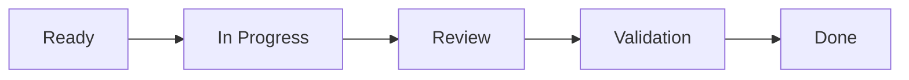

# Part 018 — WIP Limits, Aging Work, Pairing, Swarming, and Escalation

## Positioning

Sprint success depends not only on planning quality, but on how work flows through the system.

Flow management focuses on:

- finishing;
- reducing queues;
- limiting parallel work;
- shortening feedback;
- and resolving bottlenecks.

> **Core thesis:** starting work creates inventory; finishing work creates value and learning.

---

## 1. Flow Mental Model



Every state can contain:

- active work;
- waiting;
- blocked time;
- and rework.

Flow improvement targets total elapsed time, not only touch time.

---

## 2. Work in Progress

WIP is work started but not Done.

High WIP creates:

- context switching;
- queue;
- aging;
- hidden risk;
- delayed feedback;
- and more coordination.

---

## 3. Little's Law

Conceptually:

```text
WIP = Throughput × Cycle Time
```

If throughput is stable, increasing WIP increases cycle time.

The goal is not mathematical perfection, but system awareness.

---

## 4. WIP Limits

WIP limits constrain how much work can be active in a state or system.

Examples:

- max 3 items In Progress;
- max 2 items in Review;
- no new work while critical item blocked.

### Why limits work

They expose bottlenecks.

Without limit, teams hide queues by starting more.

---

## 5. WIP Limit Anti-Patterns

### Decorative limits

Displayed but ignored.

### Individual limits only

Team-level queue remains high.

### Limit as punishment

No analysis of bottleneck.

### Emergency override without record

Limit loses meaning.

### Too-low limit

Creates unnecessary idle time without collaboration.

---

## 6. Pull-Based Work

Pull means new work starts when capacity exists.

Not when someone is idle for five minutes.

Questions before pulling:

- can we help finish current work;
- can we review;
- can we test;
- can we unblock;
- or can we reduce risk.

---

## 7. Stop Starting, Start Finishing

This principle challenges local optimization.

An engineer waiting on review can:

- review another item;
- help test;
- improve evidence;
- pair on blocker;
- or update documentation.

Do not automatically start another story.

---

## 8. Cycle Time

Cycle time measures elapsed time from work start to completion.

Break down:

```text
Cycle time
= active time
+ waiting time
+ blocked time
+ rework time
```

Most delays often come from waiting, not coding.

---

## 9. Lead Time

Lead time starts earlier, often from request or commitment.

Useful for customer/stakeholder experience.

Difference:

- cycle time = execution system;
- lead time = end-to-end demand experience.

---

## 10. Aging Work Item

Aging measures how long current work has been active.

It is a leading indicator.

Completed cycle time is lagging.

### Aging questions

- is age above normal;
- why;
- what remains;
- what uncertainty appeared;
- and what intervention is needed.

---

## 11. Aging Thresholds

Use historical distribution.

Example:

- typical item: 3–5 days;
- warning: >5 days;
- critical: >8 days.

Thresholds should depend on work type.

---

## 12. Blocked Time

Track blocked time separately.

Reasons:

- dependency;
- access;
- environment;
- decision;
- review;
- defect;
- data;
- or vendor.

Repeated block reasons reveal system investment opportunities.

---

## 13. Queue Management

Common queues:

- code review;
- QA;
- security review;
- architecture review;
- environment;
- release;
- and customer validation.

Queue invisibility is a major process smell.

---

## 14. Handoffs

Each handoff can lose context.

Handoff cost increases with:

- document ambiguity;
- time zone gap;
- role silo;
- and delayed feedback.

### Better handoff

```text
Context:
Current state:
Evidence:
Remaining risk:
Expected action:
Owner:
Deadline:
```

---

## 15. Review Latency

Review latency can dominate cycle time.

Improve by:

- smaller PR;
- reviewer rotation;
- explicit SLA;
- pairing;
- automated checks;
- and clear blocking labels.

---

## 16. QA Queue

QA queue often arises from phase-based work.

Mitigations:

- QA in refinement;
- test strategy early;
- automated checks;
- continuous validation;
- and smaller slices.

---

## 17. Pairing

Pairing combines two people on one problem.

Benefits:

- faster feedback;
- knowledge sharing;
- risk reduction;
- and lower review rework.

Use pairing for:

- complex logic;
- unfamiliar code;
- incident fix;
- migration;
- or design uncertainty.

---

## 18. Mob or Ensemble Work

Several people collaborate on one work item.

Useful when:

- high-risk;
- cross-functional;
- urgent;
- or learning-intensive.

Avoid using mobbing for routine work without benefit.

---

## 19. Swarming

Swarming means multiple team members focus on finishing a critical or blocked item.

Trigger examples:

- Sprint Goal risk;
- aging item;
- production issue;
- integration bottleneck.

Swarming is temporary and outcome-focused.

---

## 20. Pairing versus Swarming

### Pairing

Usually two people, continuous collaboration.

### Swarming

Multiple people, coordinated around an outcome.

Both reduce handoff and distribute knowledge.

---

## 21. Specialist Bottleneck

Specialist bottleneck occurs when:

- one reviewer;
- one domain expert;
- one release operator;
- or one architect

controls flow.

Responses:

- pairing;
- training;
- guardrails;
- automation;
- rotation;
- and delegated authority.

---

## 22. Bus Factor and Flow

Low bus factor is not only resilience risk.

It is also flow risk.

If work waits for one person, cycle time grows.

---

## 23. Escalation

Escalate when:

- owner outside team;
- SLA missed;
- Sprint Goal threatened;
- risk exceeds tolerance;
- or no local option remains.

### Escalation packet

```text
Context:
Impact:
Evidence:
Actions taken:
Options:
Recommendation:
Decision needed by:
```

---

## 24. Aging-Based Escalation

Instead of waiting for deadline, escalate based on age or blocked duration.

Example:

- blocked 1 day: team action;
- blocked 2 days: cross-team follow-up;
- blocked 3 days: management escalation.

Threshold must fit context.

---

## 25. Classes of Service

Flow systems may distinguish:

- standard;
- fixed-date;
- expedite;
- intangible/risk-reduction.

Use explicit policy.

Avoid everything becoming expedite.

---

## 26. Expedite Work

Expedite work interrupts flow.

Require:

- severity threshold;
- decision owner;
- WIP impact;
- and post-event review.

---

## 27. Load Shedding in Delivery

When demand exceeds capacity:

- defer low-value work;
- reduce scope;
- stop starting;
- reject unready item;
- and protect critical flow.

Trying to accept everything increases total delay.

---

## 28. Flow Efficiency

Conceptually:

```text
Flow efficiency = active time / total elapsed time
```

Low flow efficiency often signals queues.

Do not optimize by making people constantly busy.

---

## 29. Utilization Paradox

High utilization increases waiting.

A system with no slack cannot absorb:

- incident;
- review;
- learning;
- or variation.

Sustainable delivery needs some capacity flexibility.

---

## 30. Flow Metrics

Useful metrics:

- WIP;
- throughput;
- cycle time;
- lead time;
- aging;
- blocked time;
- review latency;
- queue size;
- and flow distribution.

Use trends, not one point.

---

## 31. Cumulative Flow Diagram

CFD can reveal:

- growing queue;
- throughput change;
- and WIP imbalance.

A widening band indicates accumulation in that state.

---

## 32. Control Chart

Control chart visualizes cycle time distribution.

Useful for:

- predictability;
- outlier detection;
- and service expectation.

Do not use to pressure individuals.

---

## 33. Flow Review

A regular flow review may inspect:

- aging;
- blockers;
- WIP;
- queue;
- throughput;
- and policy.

Daily Scrum handles immediate adaptation.

Flow review can address broader system patterns.

---

## 34. Workflow Policies

Explicit policies should define:

- state entry;
- state exit;
- WIP limit;
- blocked behavior;
- review expectation;
- and expedite rule.

Policy reduces ambiguity.

---

## 35. Rework Loops

Rework can occur from:

- unclear acceptance;
- review feedback;
- failed test;
- integration mismatch;
- and production defect.

Track reason.

Repeated rework is a refinement or system issue.

---

## 36. Worked Example: Review Bottleneck

### Observed

- 8 items In Progress;
- 5 waiting review;
- one senior reviewer;
- cycle time rising.

### Intervention

1. stop pulling new stories;
2. swarm review queue;
3. classify blocking versus non-blocking comments;
4. pair less-experienced reviewers;
5. add reviewer rotation;
6. reduce PR size;
7. measure review latency.

### Expected result

- lower queue;
- distributed knowledge;
- reduced aging.

---

## 37. Worked Example: QA Bottleneck

### Observed

- QA receives batch on day 8;
- many defects;
- carry-over.

### Intervention

- QA joins refinement;
- test examples prepared;
- first slice validated day 3;
- WIP limit before QA;
- engineers help automation;
- and acceptance evidence continuous.

---

## 38. Flow Anti-Patterns

### Everyone busy

No one helps finish.

### Many nearly done items

High WIP.

### Assignee ownership

Team ignores blocked item.

### Queue hidden in status

“Ready for QA” appears as progress.

### WIP limit bypass

Every exception becomes normal.

### Senior as permanent swarm target

Dependency on one person persists.

### Metric gaming

Start date changed or item split artificially.

---

## 39. Failure Modes

### Sprint completes late

Queues accumulate.

### Review quality drops

Reviewer overloaded.

### QA becomes gate

Validation delayed.

### Remote handoff stalls

Context incomplete.

### Expedite dominates

No service policy.

---

## 40. Senior Engineer Operating Model

### Improve flow, not personal throughput

- help finish;
- review early;
- pair;
- reduce PR size;
- and expose queue.

### Build capability

- rotate reviewer;
- teach diagnostic heuristics;
- automate repetitive checks;
- and document guardrails.

### Avoid becoming bottleneck

- delegate;
- create decision boundary;
- and let others lead.

---

## 41. Process Smells

- WIP rises every Sprint;
- aging item normalized;
- blocked reason absent;
- review/QA queue hidden;
- all specialists overloaded;
- no pull policy;
- expedite lane always occupied;
- and people measured by utilization.

---

## 42. Internal Verification Checklist

### Workflow

- What states exist?
- Are entry/exit policies explicit?
- Are blocked states visible?
- Are WIP limits used?

### Metrics

- Is cycle time available?
- Is aging visible?
- Is blocked time tracked?
- Is review latency measured?
- Is CFD used?

### Review

- Who can review?
- Is reviewer rotation used?
- What is expected response time?
- Are PR size norms defined?

### QA

- Is QA embedded?
- Is validation continuous?
- Is there a QA queue?
- Can engineers help testing?

### Escalation

- What age/block threshold exists?
- Who owns cross-team escalation?
- What is expedite policy?
- How are recurring blockers improved?

---

## 43. Practical Exercises

### Exercise 1 — WIP audit

Count active work per workflow state.

### Exercise 2 — Aging analysis

Find the three oldest active items and intervention.

### Exercise 3 — Queue map

Map all waits from start to Done.

### Exercise 4 — WIP policy

Define a WIP limit and exception policy.

### Exercise 5 — Swarming plan

Choose one critical item and design a temporary swarm.

---

## 44. Part Completion Checklist

You are done if you can:

- explain WIP and flow;
- use WIP limits;
- inspect aging and blocked time;
- identify queues and handoffs;
- use pairing and swarming appropriately;
- escalate based on evidence;
- and optimize team flow rather than individual utilization.

---

## 45. Key Takeaways

1. Starting creates inventory.
2. Finishing creates value.
3. High WIP increases cycle time.
4. Aging is a leading risk indicator.
5. Queues should be visible.
6. Pairing and swarming reduce handoffs.
7. Specialists should not become permanent bottlenecks.
8. Escalation needs evidence and timing.
9. Slack improves responsiveness.
10. Internal flow policies must be verified.

---

## 46. References

Conceptual baseline:

- The Scrum Guide.
- The Kanban Guide.
- General flow, Little's Law, WIP, and probabilistic delivery practices.

These concepts do not describe internal CSG processes.
