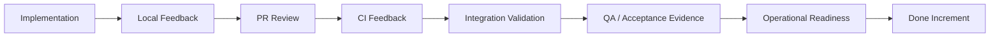
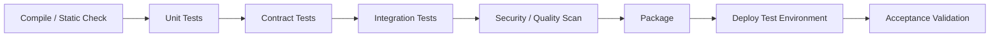

# Part 019 — Pull-Based Work, Review Latency, CI Feedback, Testing, and QA Collaboration

## Positioning

Sprint execution bukan fase setelah planning. Ia adalah sistem feedback berkelanjutan yang mengubah backlog forecast menjadi Increment yang benar-benar Done.

Dalam enterprise product, hambatan terbesar sering bukan coding speed, melainkan:

- PR menunggu review;
- CI lambat atau flaky;
- test dilakukan terlambat;
- QA menjadi handoff queue;
- environment tidak stabil;
- integration baru terjadi di akhir;
- dan evidence release readiness tidak tersedia.

> **Core thesis:** delivery yang cepat bukan hasil dari developer mengetik lebih cepat, tetapi dari feedback loop yang lebih pendek, batch lebih kecil, dan ownership end-to-end.

---

## 1. Execution as a Feedback System

Execution harus menghasilkan feedback dari beberapa layer:



Semakin lambat satu feedback loop, semakin mahal koreksi.

---

## 2. Pull-Based Execution

Pull-based execution berarti work baru dimulai ketika capacity tersedia.

Bukan ketika:

- seseorang selesai coding;
- seseorang tidak punya task pribadi;
- atau backlog masih berisi item.

Sebelum pull work baru, tanyakan:

```text
Can I help finish something already in progress?
Can I review?
Can I test?
Can I unblock a dependency?
Can I reduce risk on the Sprint Goal?
```

---

## 3. End-to-End Ownership

Assignee bukan berarti ownership berhenti pada coding.

End-to-end ownership mencakup:

- clarification;
- implementation;
- review;
- test;
- integration;
- documentation;
- observability;
- release evidence;
- dan follow-up.

Healthy statement:

> I own this item until it is Done, including coordination required to get it there.

Unhealthy statement:

> My code is complete. QA is handling the rest.

---

## 4. Pull Request as a Feedback Boundary

PR adalah unit collaboration, bukan sekadar approval gate.

PR yang baik membantu reviewer memahami:

- why;
- scope;
- design;
- risk;
- evidence;
- and follow-up.

### Useful PR structure

```md
## Context

Why this change exists.

## Scope

What is included and excluded.

## Design Notes

Important decisions and alternatives.

## Risk

Compatibility, migration, security, operational impact.

## Evidence

Tests, screenshots, traces, metrics, or contract results.

## Rollout

Flag, migration, deployment, rollback.
```

---

## 5. PR Size

Large PRs increase:

- review latency;
- cognitive load;
- defect risk;
- merge conflict;
- and rework.

Small PRs are easier to review, but over-fragmentation also has cost.

### Healthy PR size characteristics

- one coherent change;
- reviewable in a reasonable session;
- clear intent;
- limited unrelated refactoring;
- and enough context.

### PR size smell

- hundreds of unrelated changes;
- generated noise;
- formatting mixed with behavior change;
- or hidden migration.

---

## 6. Stacked and Incremental PRs

For large work:

- create preparatory refactor;
- add contract;
- add narrow implementation;
- add rollout control;
- then enable behavior.

Each PR should preserve system correctness.

Avoid long-lived branch accumulation.

---

## 7. Draft PRs

Draft PRs can provide early feedback on:

- direction;
- interface;
- and risk.

Use when:

- architecture uncertain;
- contract needs alignment;
- or reviewer input can prevent rework.

Avoid draft PRs that remain stale for days without clear question.

---

## 8. Review Latency

Review latency is elapsed time from review request to useful response.

High review latency creates:

- context switching;
- aging;
- branch drift;
- and delayed integration.

### Measure

```text
Review latency:
request timestamp -> first substantive review
```

Also track:

- time to final approval;
- number of review rounds;
- and time waiting on author.

---

## 9. Review Service Expectations

Working agreement may define:

- first response within one working day;
- blocking comments labeled;
- critical PR prioritized;
- reviewer rotation;
- and escalation for aging review.

Do not make SLA punitive.

Its purpose is flow transparency.

---

## 10. Review Comment Taxonomy

A useful taxonomy:

- **blocking** — correctness, security, compatibility, or significant maintainability issue;
- **important** — should be addressed unless explicitly deferred;
- **suggestion** — optional improvement;
- **question** — seeks understanding;
- **nit** — cosmetic.

This reduces ambiguity.

---

## 11. Review Quality

Good review inspects:

- correctness;
- domain behavior;
- failure mode;
- compatibility;
- testability;
- observability;
- security;
- performance;
- and maintainability.

Review should not focus only on style.

---

## 12. Preference versus Correctness

Senior engineers must distinguish:

```text
Correctness issue:
This can create duplicate downstream orders.

Maintainability issue:
This duplicates rule logic and increases divergence risk.

Preference:
I usually prefer another naming style.
```

Do not block on preference unless team standard requires it.

---

## 13. Reviewer Bottleneck

Warning signs:

- one senior approves everything;
- PR queue grows;
- review waits longer than coding;
- and team avoids ownership.

Mitigations:

- reviewer rotation;
- pairing;
- review guide;
- architecture guardrails;
- smaller PRs;
- and distributed module ownership.

---

## 14. Author Responsibility

Author should:

- self-review;
- remove noise;
- explain context;
- provide evidence;
- respond clearly;
- and update PR state.

A PR is not ready merely because code is pushed.

---

## 15. Continuous Integration

CI should provide fast and trustworthy feedback.

Core goals:

- detect regression;
- integrate often;
- maintain mainline health;
- and reduce manual validation.

---

## 16. CI Feedback Latency

CI latency includes:

- queue;
- checkout/setup;
- build;
- test;
- scanning;
- packaging;
- and result reporting.

Slow CI encourages:

- larger batches;
- fewer pushes;
- delayed feedback;
- and local bypass.

---

## 17. CI Pipeline Layers

Possible stages:



Order faster feedback earlier.

---

## 18. Fast-Fail Strategy

Run:

1. formatting/static checks;
2. compile;
3. fast unit tests;
4. targeted contract tests;
5. slower integration tests;
6. end-to-end tests.

Do not wait 40 minutes to discover formatting failure.

---

## 19. Flaky Tests

Flaky tests destroy trust.

Consequences:

- ignored failures;
- rerun culture;
- slow delivery;
- and real defect masking.

### Flaky test policy

```text
Detect:
Track:
Assign owner:
Quarantine only with visibility:
Fix within explicit horizon:
Re-enable:
```

Quarantine without follow-up is hidden debt.

---

## 20. Mainline Health

Broken mainline blocks team flow.

Define:

- who responds;
- expected recovery time;
- rollback versus forward fix;
- and communication.

A team that tolerates red mainline normalizes instability.

---

## 21. Branching Strategy

Common options:

- trunk-based development;
- short-lived feature branches;
- release branches;
- long-lived branches.

General flow principle:

- integrate frequently;
- keep branches short-lived;
- avoid divergence;
- and make release policy explicit.

---

## 22. Merge Strategy

Options:

- merge commit;
- squash;
- rebase;
- fast-forward.

Choose based on:

- traceability;
- rollback;
- release tooling;
- and team convention.

Merge strategy should not become ideological debate.

---

## 23. Test Pyramid and Beyond

A simple view:

- many fast unit tests;
- fewer contract/integration tests;
- limited end-to-end tests.

But real test strategy depends on architecture.

Important dimensions:

- speed;
- fidelity;
- determinism;
- coverage;
- and maintenance cost.

---

## 24. Unit Tests

Good for:

- domain logic;
- edge cases;
- deterministic behavior;
- and fast feedback.

Weak when:

- implementation-coupled;
- heavily mocked;
- or disconnected from behavior.

---

## 25. Contract Tests

Critical for:

- APIs;
- events;
- schemas;
- and cross-team integration.

They reduce late integration surprise.

Contract tests should validate:

- required fields;
- compatibility;
- error behavior;
- and version expectations.

---

## 26. Integration Tests

Useful for:

- database;
- messaging;
- external boundary;
- framework configuration;
- and runtime wiring.

Keep environment and data deterministic.

---

## 27. End-to-End Tests

E2E tests validate real workflow.

Use selectively because they are:

- slower;
- more brittle;
- and expensive to diagnose.

Focus on critical journeys.

---

## 28. Exploratory Testing

Exploratory testing discovers:

- unexpected behavior;
- usability issues;
- state combinations;
- and hidden assumptions.

It complements automation.

It should not be the only validation strategy.

---

## 29. QA Collaboration

QA should participate from refinement through validation.

Healthy model:

```text
Shared examples
-> test strategy
-> build for testability
-> continuous validation
-> exploratory testing
-> operational evidence
```

---

## 30. QA Handoff Anti-Pattern

Weak flow:

```text
Developer completes
-> marks Ready for QA
-> starts new story
-> QA finds issue
-> developer context-switches back
```

Consequences:

- queue;
- rework;
- and long cycle time.

---

## 31. Shared Quality Ownership

Engineer contributes to:

- test automation;
- test data;
- environment diagnosis;
- and reproduction.

QA contributes to:

- risk analysis;
- scenario discovery;
- exploratory testing;
- and quality strategy.

Quality is not transferred.

---

## 32. Test Data

Test data must be:

- representative;
- privacy-safe;
- reproducible;
- resettable;
- and versioned where needed.

Data bottleneck can invalidate otherwise good test strategy.

---

## 33. Environment Management

Environment issues include:

- drift;
- shared contention;
- stale deployment;
- unavailable dependency;
- and unclear ownership.

Useful controls:

- environment health;
- deployment traceability;
- synthetic checks;
- and self-service reset.

---

## 34. Validation Evidence

Evidence may include:

- automated test result;
- contract verification;
- screenshot;
- trace;
- metric;
- audit record;
- migration report;
- and exploratory notes.

Evidence should map to acceptance criteria and risk.

---

## 35. Definition of Done Integration

DoD should reflect actual quality expectation.

Possible elements:

- reviewed;
- CI green;
- integrated;
- acceptance criteria met;
- relevant NFR validated;
- documentation updated;
- observability present;
- and release-ready.

---

## 36. Scope Control during Execution

When hidden work appears:

1. make it visible;
2. classify whether essential;
3. assess Sprint Goal impact;
4. re-slice if possible;
5. negotiate scope;
6. update forecast.

Do not silently absorb scope.

---

## 37. Mid-Sprint Defect

A defect found during Sprint may be:

- part of the current item;
- a regression;
- unrelated existing bug;
- or production issue.

Handle based on:

- severity;
- goal impact;
- and ownership.

Not every defect must interrupt current work.

---

## 38. Review and Test Queues in Daily Scrum

Daily Scrum should inspect:

- PR waiting;
- CI blocked;
- validation queue;
- environment issue;
- and test failure.

These are flow states, not side details.

---

## 39. Last-Day Integration Hell

Symptoms:

- many branches merge near Sprint end;
- QA batch;
- environment contention;
- surprise contract mismatch;
- and incomplete DoD.

Prevention:

- integrate daily;
- validate thin slices early;
- limit WIP;
- and expose dependency.

---

## 40. Feature Flags and Incomplete Code

Feature flags can enable frequent merge.

But they require:

- clear owner;
- safe default;
- observability;
- cleanup plan;
- and test coverage.

Feature flag is not permission to accumulate incomplete architecture indefinitely.

---

## 41. Senior Engineer Operating Model

### During implementation

- promote small slices;
- protect mainline;
- reduce PR size;
- and surface hidden risk.

### During review

- prioritize correctness and system consequence;
- explain reasoning;
- avoid preference blocking;
- and distribute ownership.

### During CI failure

- treat red pipeline as flow problem;
- fix or rollback quickly;
- and prevent normalization.

### With QA

- share test strategy;
- improve testability;
- and validate failure behavior early.

### As a leader

- measure queue, not developer activity;
- coach reviewers;
- and avoid becoming permanent approval gate.

---

## 42. Worked Example: Approval Event Change

### Story

Publish approval status in quote event.

### Execution plan

1. Add optional contract field.
2. Add producer unit tests.
3. Add consumer compatibility contract test.
4. Merge behind configuration.
5. Deploy to test environment.
6. Validate trace and schema.
7. Enable pilot.
8. Inspect metrics.

### PR strategy

- PR 1: contract and compatibility test;
- PR 2: producer implementation;
- PR 3: observability and rollout config.

### QA collaboration

- examples defined before code;
- negative consumer behavior tested;
- pilot validation evidence captured.

---

## 43. Anti-Patterns

### Large PR culture

Review becomes ceremonial.

### Review as approval only

No shared learning.

### CI as afterthought

Pipeline trusted only sometimes.

### Rerun until green

Flaky failure ignored.

### QA as gate

Quality ownership fragmented.

### Testing after code complete

Feedback late.

### Environment blame

Recurring issue never enters backlog.

### Done means merged

Integration and validation omitted.

---

## 44. Failure Modes

### Review queue

Too few reviewers or oversized PRs.

### CI distrust

Flaky tests.

### Repeated rework

Acceptance or test strategy weak.

### Late integration defect

Contract validation delayed.

### Production diagnosability gap

Observability excluded from DoD.

---

## 45. Process Smells

- review wait longer than coding;
- PRs regularly exceed team norm;
- red mainline tolerated;
- flaky test reruns normalized;
- QA receives batch late;
- environment issues recur;
- and Done items fail release readiness.

---

## 46. Internal Verification Checklist

### PR process

- What PR size norm exists?
- Who can review?
- Is reviewer rotation used?
- Are comment severities explicit?
- What is review response expectation?

### CI

- What are pipeline stages?
- What is median duration?
- What failures are flaky?
- Who owns red mainline?
- Is quarantine policy explicit?

### Testing

- What test layers exist?
- Who owns automation?
- Are contract tests used?
- What critical E2E journeys exist?
- How is exploratory testing recorded?

### QA

- Is QA involved in refinement?
- Is there a QA queue?
- Can engineers help validation?
- What is test-data process?
- How are defects triaged?

### Environment

- Who owns each environment?
- How is version known?
- Is health visible?
- How is data reset?
- What recurring issue exists?

### Done

- Does Done include integration?
- Does it include operational evidence?
- Does it include documentation?
- Is release readiness explicit?

---

## 47. Practical Exercises

### Exercise 1 — PR latency audit

Measure:

- request to first review;
- approval time;
- review rounds;
- merge time.

### Exercise 2 — Pipeline feedback map

List each CI stage, duration, and failure value.

### Exercise 3 — QA handoff audit

Map waiting and rework between engineering and QA.

### Exercise 4 — Test strategy

For one feature, assign evidence to unit, contract, integration, E2E, and exploratory tests.

### Exercise 5 — Mainline recovery policy

Write a simple red-mainline response policy.

---

## 48. Part Completion Checklist

You are done if you can:

- explain pull-based execution;
- manage PR size and review latency;
- design fast CI feedback;
- handle flaky tests;
- build a risk-based test strategy;
- collaborate with QA without handoff;
- integrate Definition of Done into execution;
- and prevent late integration.

---

## 49. Key Takeaways

1. Execution is a feedback system.
2. Pull work only when capacity exists.
3. PRs are collaboration boundaries.
4. Review latency is a flow metric.
5. CI must be fast and trusted.
6. Flaky tests are delivery debt.
7. QA is a quality partner, not a gate.
8. Integration and operational evidence belong in Done.
9. Senior engineers should distribute review capability.
10. Internal engineering process must be verified.

---

## 50. References

Conceptual baseline:

- The Scrum Guide.
- Continuous integration and trunk-based development practices.
- General software testing, quality engineering, and flow-management practices.

These concepts do not describe internal CSG processes.
