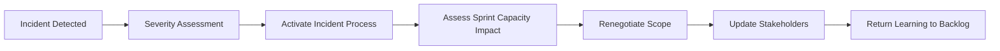

# Part 020 — Merge Strategy, Feature Flags, Incremental Delivery, and Urgent Work

## Positioning

Mid-Sprint change is inevitable.

The goal is not to freeze reality. The goal is to adapt without losing:

- Sprint Goal;
- quality;
- transparency;
- and operational safety.

Enterprise work adds integration and production risk that may only become visible after work starts.

> **Core thesis:** mature execution treats replanning as evidence-driven control, not as failure or chaos.

---

## 1. What Can Change during a Sprint

Possible changes:

- requirement clarification;
- dependency delay;
- integration discovery;
- production incident;
- capacity loss;
- defect;
- security finding;
- and stakeholder priority shift.

Not every change justifies scope change.

---

## 2. Sprint Invariants

During change, protect:

- Sprint Goal unless obsolete;
- Definition of Done;
- product integrity;
- security;
- and transparency.

Scope and implementation plan are more flexible.

---

## 3. Replanning Mental Model


---

## 4. Trigger Categories

### Clarification trigger

Story meaning changes.

### Delivery trigger

Capacity or dependency changes.

### Technical trigger

Architecture or integration assumption fails.

### Operational trigger

Incident or production risk appears.

### Product trigger

Priority or customer context changes.

---

## 5. Scope Control

Scope control means deliberate decisions about:

- what remains;
- what is removed;
- what is split;
- what is added;
- and what quality cannot be traded.

It does not mean resisting all change.

---

## 6. Scope Creep

Scope creep is unacknowledged expansion.

Examples:

- “small” extra rule;
- undocumented compatibility support;
- additional tenant variation;
- extra report;
- or migration edge case.

Make additions explicit.

---

## 7. Scope Clarification versus Scope Expansion

### Clarification

Makes intended behavior precise.

### Expansion

Adds new behavior, actor, rule, or quality requirement.

The distinction affects negotiation.

But if “clarification” reveals essential safety, it cannot simply be ignored.

---

## 8. Scope Negotiation Framework

```text
New requirement:
Why discovered:
Goal impact:
Capacity impact:
Risk if excluded:
Options:
Recommended scope:
Decision owner:
```

---

## 9. Re-Slicing Mid-Sprint

A large item may be split after learning.

Valid if:

- resulting slice is usable;
- acceptance remains coherent;
- incomplete part returns to backlog;
- and status is transparent.

Invalid:

- splitting only to claim points;
- marking technical fragments Done;
- or hiding incomplete behavior.

---

## 10. Sprint Goal Protection

When change appears:

1. restate Sprint Goal;
2. identify must-have behavior;
3. remove optional scope;
4. preserve integration and quality;
5. update forecast.

Goal is a decision filter.

---

## 11. When Sprint Goal Becomes Obsolete

Examples:

- product direction changes fundamentally;
- external event invalidates purpose;
- or a critical dependency disappears.

Only Product Owner can cancel a Sprint in Scrum.

Cancellation should be rare.

---

## 12. Integration Strategy

Integration should be continuous.

Key practices:

- small changes;
- short-lived branches;
- stable contracts;
- compatibility;
- and early environment validation.

---

## 13. Merge Strategy and Risk

Merge policy should support:

- traceability;
- rollback;
- and frequent integration.

Risk increases with:

- branch age;
- PR size;
- concurrent change;
- and hidden contract change.

---

## 14. Long-Lived Branch Failure Mode

Long-lived branches cause:

- merge conflict;
- delayed test;
- duplicated work;
- and big-bang integration.

Feature flags or branch-by-abstraction can allow earlier merge.

---

## 15. Feature Flags

Feature flags separate deployment from release.

Types:

- release flag;
- experiment flag;
- operational flag;
- permission flag;
- and kill switch.

Each has different lifecycle.

---

## 16. Feature Flag Governance

Every flag needs:

```text
Owner:
Purpose:
Default:
Target:
Observability:
Removal date:
Failure behavior:
```

A flag without owner becomes permanent complexity.

---

## 17. Flag Safety

Consider:

- secure default;
- stale configuration;
- cross-service consistency;
- evaluation latency;
- and audit.

Do not use flags to bypass authorization.

---

## 18. Flag Debt

Too many flags create:

- test combinations;
- dead code;
- unclear behavior;
- and operational confusion.

Track flag lifecycle as backlog work.

---

## 19. Branch by Abstraction

Useful for replacing internal implementation gradually.

Sequence:

1. introduce abstraction;
2. route existing behavior;
3. add new implementation;
4. switch gradually;
5. remove old implementation.

Supports incremental integration.

---

## 20. Expand and Contract

Useful for schema and contract evolution.

### Expand

Add backward-compatible capability.

### Migrate

Move producers/consumers.

### Contract

Remove old capability after evidence.

This avoids coordinated breaking change.

---

## 21. Integration Boundary Validation

Validate:

- contract;
- serialization;
- timeout;
- retry;
- ordering;
- duplicate;
- and error semantics.

Mock-only validation is insufficient for high-risk boundary.

---

## 22. Incremental Delivery

Incremental delivery means every step preserves a working system.

Example:

1. add optional field;
2. publish disabled;
3. validate consumer;
4. enable pilot;
5. expand;
6. remove old path.

---

## 23. Release versus Deployment

Deployment:

- technical artifact is installed.

Release:

- behavior is exposed.

A deployed but disabled feature can still be integrated and tested.

But it is not customer-released.

---

## 24. Rollout Strategy

Possible rollout:

- internal;
- test tenant;
- pilot customer;
- percentage;
- region;
- or role.

Each stage should have:

- success criteria;
- observation window;
- and rollback.

---

## 25. Production Validation

Production validation may include:

- metric;
- trace;
- synthetic check;
- audit;
- error rate;
- and support confirmation.

Do not rely only on “deployment succeeded”.

---

## 26. Rollback Strategy

Rollback is not always binary.

Options:

- disable flag;
- revert code;
- restore config;
- compensate data;
- or roll forward.

Plan based on reversibility.

---

## 27. Irreversible Changes

Examples:

- data deletion;
- external side effect;
- irreversible migration;
- and financial posting.

Need:

- stronger validation;
- staged exposure;
- backup/compensation;
- and explicit authority.

---

## 28. Urgent Production Work

Urgent work requires an explicit service policy.

Define:

- severity threshold;
- decision owner;
- response expectation;
- and Sprint impact.

---

## 29. Incident Interruption Model



---

## 30. Protecting Sprint Goal during Incident

Options:

- rotating responder handles incident;
- swarm temporarily;
- remove optional scope;
- split incomplete work;
- or reset forecast.

Do not maintain false commitment.

---

## 31. Hotfix versus Normal Fix

Hotfix may be justified by:

- high severity;
- broad exposure;
- no safe workaround;
- or contractual impact.

Hotfix still needs:

- review;
- test;
- rollback;
- and traceability.

“Urgent” does not mean uncontrolled.

---

## 32. Expedite Abuse

If everything is urgent:

- Product Backlog ordering has failed;
- service policy is weak;
- or stakeholder bypass exists.

Track expedite frequency.

---

## 33. Mid-Sprint Product Request

When new product request arrives:

```text
Does it support current Sprint Goal?
What is the delay cost?
What must be removed?
Who authorizes change?
What stakeholder expectation changes?
```

Do not accept direct stakeholder insertion without Product Owner involvement.

---

## 34. Mid-Sprint Architecture Discovery

If architecture assumption fails:

- stop affected work;
- expose finding;
- create options;
- assess slice;
- and decide whether spike or redesign is needed.

Avoid silently expanding implementation.

---

## 35. Mid-Sprint Dependency Failure

Options:

- use fallback;
- shift to contract test;
- work on another goal-supporting slice;
- escalate;
- or remove dependent scope.

Starting unrelated work may dilute Sprint Goal.

---

## 36. Mid-Sprint Capacity Loss

Examples:

- illness;
- incident;
- urgent support;
- or key specialist unavailable.

Response:

- reassess must-have work;
- reduce WIP;
- swarm critical path;
- remove optional scope;
- and update confidence.

---

## 37. Communication during Replanning

Useful update:

```text
What changed:
Impact:
Current goal status:
Scope adjustment:
Risk:
Decision:
Next checkpoint:
```

Avoid vague:

> We are still investigating.

---

## 38. Decision Rights

### Product Owner

- product priority;
- scope trade-off;
- and Sprint cancellation.

### Developers

- implementation plan;
- sequencing;
- and technical adaptation.

### Engineering Manager / leadership

- structural resource;
- cross-team escalation;
- and organizational risk.

### Release authority

- internal governance specific.

---

## 39. Replanning Anti-Patterns

### Silent scope absorption

Team works overtime.

### Quality reduction

Tests or observability removed.

### Ticket shuffle

Board changes without decision context.

### Goal abandonment

Unrelated urgent work accepted.

### No stakeholder update

Expectation diverges.

### Split for points

Incomplete work marked Done.

### Hero rescue

Senior takes everything.

---

## 40. Last-Day Integration Hell

Root causes:

- long-lived branches;
- horizontal slicing;
- delayed contract validation;
- review queues;
- QA batch;
- and no rollout plan.

Prevention is systemic, not heroic.

---

## 41. Integration Readiness Checklist

Before merging high-risk change:

- contract compatible;
- tests pass;
- migration safe;
- observability ready;
- flag/config ready;
- rollback understood;
- and environment evidence available.

---

## 42. Release Readiness Checklist

Before release:

- target scope clear;
- deployment artifact identified;
- feature exposure controlled;
- metrics and alerts ready;
- support informed;
- rollback/roll-forward prepared;
- and ownership clear.

---

## 43. Senior Engineer Operating Model

### Protect the system

- avoid big-bang merge;
- enforce compatibility;
- and design reversible steps.

### Protect the goal

- re-slice;
- remove optional work;
- and expose impact.

### Protect quality

- never trade security, integrity, or essential test silently.

### Protect the team

- avoid heroics;
- distribute incident work;
- and communicate reality.

### Build learning

- update backlog and working agreements after change.

---

## 44. Worked Example: Pricing Contract Break

### New evidence

Consumer rejects a new enum value.

### Options

#### Option A

Coordinate consumer release first.

#### Option B

Publish old value plus optional metadata.

#### Option C

Feature flag the new mapping.

### Decision

Use additive compatibility path.

### Sprint change

- remove optional reporting;
- prioritize contract test and rollout control;
- preserve goal of pilot pricing flow.

---

## 45. Worked Example: Production Incident Mid-Sprint

### Incident

Duplicate downstream order created.

### Response

- incident process activated;
- two engineers swarm;
- optional Sprint item removed;
- idempotency fix reviewed and tested;
- monitoring added;
- Sprint Goal confidence updated;
- corrective action added to backlog.

---

## 46. Process Smells

- frequent mid-Sprint insertion;
- no scope removal;
- flags never removed;
- long-lived branches;
- urgent fixes bypass tests;
- rollout not observable;
- and replanning not communicated.

---

## 47. Internal Verification Checklist

### Scope control

- Who can add work?
- Is scope removal required?
- How is Sprint Goal impact recorded?
- How are clarifications distinguished from expansion?

### Integration

- What branching strategy exists?
- Are long-lived branches common?
- Are contract tests used?
- How early is live integration validated?

### Feature flags

- What flag platform exists?
- Who owns flags?
- Is removal tracked?
- Are secure defaults defined?
- Is audit available?

### Incident/hotfix

- What severity interrupts Sprint?
- What hotfix process exists?
- Who authorizes release?
- What test and rollback are mandatory?

### Release

- How are deployment and release distinguished?
- What rollout stages exist?
- What production validation is required?
- Who informs support/customer-facing teams?

### Replanning

- How are changes communicated?
- Is forecast updated?
- Does Daily Scrum drive adaptation?
- Are systemic causes reviewed later?

---

## 48. Practical Exercises

### Exercise 1 — Mid-Sprint change simulation

Given a new urgent request, produce scope options and decision packet.

### Exercise 2 — Feature flag lifecycle

Define owner, default, metric, and removal for one flag.

### Exercise 3 — Integration risk map

Map branch, contract, environment, and rollout risks.

### Exercise 4 — Incident impact

Simulate capacity loss and replan while protecting Sprint Goal.

### Exercise 5 — Expand-contract design

Design a backward-compatible schema migration.

---

## 49. Part Completion Checklist

You are done if you can:

- distinguish clarification from scope expansion;
- replan based on evidence;
- protect Sprint Goal and quality;
- use feature flags safely;
- apply branch-by-abstraction and expand-contract;
- manage urgent production work;
- communicate scope changes;
- and prevent last-day integration hell.

---

## 50. Key Takeaways

1. Mid-Sprint change is normal.
2. Replanning is evidence-driven control.
3. Scope is flexible; quality is not silently negotiable.
4. Feature flags separate deployment and release.
5. Flags require lifecycle governance.
6. Compatibility enables incremental delivery.
7. Urgent work needs explicit policy.
8. Incident impact must change the forecast.
9. Senior engineers should create reversible paths.
10. Internal release and hotfix processes must be verified.

---

## 51. References

Conceptual baseline:

- The Scrum Guide.
- Continuous delivery, feature flag, branch-by-abstraction, and expand-contract practices.
- General incident, release, and production-readiness practices.

These concepts do not describe internal CSG processes.
