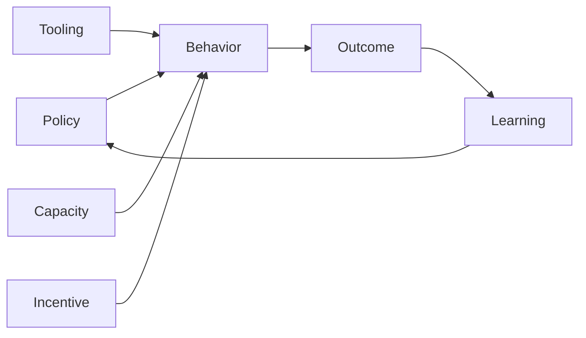

# Part 023 — Team, Process, and Engineering Bottleneck Discovery

## Positioning

Sprint Retrospective bukan sesi evaluasi personal, bukan forum menyalahkan, dan bukan ritual penutup Sprint.

Retrospective adalah mekanisme untuk:

- menginspeksi cara kerja;
- memahami bottleneck;
- menemukan pola;
- mengidentifikasi kondisi sistem;
- dan merencanakan perbaikan terhadap quality dan effectiveness.

> **Core thesis:** retrospective yang matang tidak berhenti pada “apa yang salah”, tetapi mencari kondisi sistem yang membuat outcome itu mungkin dan menentukan perubahan kecil yang dapat diuji.

---

## 1. Purpose of the Sprint Retrospective

Sprint Retrospective membantu Scrum Team meningkatkan:

- quality;
- effectiveness;
- collaboration;
- flow;
- technical practices;
- and psychological safety.

Pertanyaan dasarnya:

```text
What happened?
Why did it make sense at the time?
What system conditions shaped the result?
What should change next?
```

---

## 2. Retrospective versus Postmortem

### Sprint Retrospective

- cakupan: Sprint dan cara kerja tim;
- cadence: setiap Sprint;
- fokus: continuous improvement.

### Incident Postmortem

- cakupan: incident tertentu;
- cadence: berdasarkan event;
- fokus: failure mechanism, recovery, dan prevention.

Keduanya menggunakan system thinking, tetapi memiliki konteks berbeda.

---

## 3. Blamelessness

Blamelessness berarti analisis tidak berhenti pada individu.

Bukan berarti:

- tidak ada accountability;
- tidak ada consequence;
- tidak ada professional standard;
- atau semua tindakan dianggap sama baiknya.

### Blameless framing

Weak:

> Developer lupa menambahkan test.

Better:

> Perubahan melewati review tanpa test karena acceptance evidence tidak eksplisit, CI tidak mewajibkan coverage pada path tersebut, dan deadline pressure mendorong scope compression.

---

## 4. Accountability without Blame

Accountability yang sehat memiliki:

- owner;
- expectation;
- evidence;
- follow-through;
- dan learning.

Blame biasanya memiliki:

- hindsight;
- simplification;
- personal attribution;
- dan punishment without system correction.

---

## 5. Psychological Safety

Retrospective membutuhkan kondisi di mana orang dapat:

- mengangkat bad news;
- mengakui uncertainty;
- menyampaikan disagreement;
- meminta bantuan;
- dan membahas kesalahan.

Tanpa safety:

- data tidak lengkap;
- risk disembunyikan;
- senior voice mendominasi;
- dan retro menghasilkan superficial action.

---

## 6. Safety versus Comfort

Psychological safety bukan comfort tanpa challenge.

Healthy retro dapat membahas:

- missed expectation;
- poor judgment;
- quality failure;
- role confusion;
- dan unsafe behavior.

Perbedaannya adalah:

- fokus pada behavior dan system;
- bukan menyerang identitas.

---

## 7. System Thinking

System thinking melihat outcome sebagai hasil interaksi:

- policy;
- incentives;
- workflow;
- tooling;
- capacity;
- communication;
- architecture;
- and decision rights.



---

## 8. Local versus System Cause

### Local cause

Tindakan langsung.

### System cause

Kondisi yang memungkinkan atau memperkuat tindakan.

Example:

```text
Local:
PR merged without compatibility test.

System:
- No contract-test requirement.
- Consumer ownership unclear.
- Review checklist omitted compatibility.
- Release pressure.
```

System correction has greater leverage.

---

## 9. Five Levels of Analysis

1. Event.
2. Behavior.
3. Process.
4. Structure.
5. Incentive or belief.

Example:

```text
Event:
Story carried over.

Behavior:
Testing started late.

Process:
QA handoff after dev complete.

Structure:
Separate QA queue.

Belief:
Developers are responsible only for code.
```

---

## 10. Retrospective Inputs

Useful inputs:

- Sprint Goal outcome;
- carry-over;
- cycle time;
- aging work;
- review latency;
- defects;
- incidents;
- blocked time;
- stakeholder feedback;
- and team observations.

Metrics support discussion but do not replace context.

---

## 11. Retrospective Scope

Possible lenses:

- people and collaboration;
- process;
- engineering;
- product;
- dependency;
- tooling;
- environment;
- and organization.

Avoid covering everything in one session.

---

## 12. Retrospective Structure

A common flow:

```text
1. Set the stage.
2. Gather data.
3. Generate insights.
4. Decide what to do.
5. Close.
```

The sequence matters.

Jumping to solutions before shared data creates shallow actions.

---

## 13. Set the Stage

Purpose:

- define objective;
- establish safety;
- clarify scope;
- and invite participation.

Possible opening:

```text
Assume everyone made the best decision they could with the information, constraints, and incentives available at the time.
```

This is a working posture, not denial of responsibility.

---

## 14. Gather Data

Collect:

- events;
- facts;
- feelings;
- metrics;
- and observations.

Separate facts from interpretations.

Example:

Fact:

> PR waited 3.5 days for review.

Interpretation:

> Reviewers did not care.

Only the first is directly evidenced.

---

## 15. Timeline Technique

Create a Sprint timeline.

```text
Day 1: Planning
Day 3: Dependency delayed
Day 5: First integration
Day 8: QA queue
Day 10: Carry-over
```

Timeline helps reveal sequence and latency.

---

## 16. Start, Stop, Continue

Useful and simple.

Risk:

- creates generic lists;
- weak causal analysis;
- and too many actions.

Use as input, not final analysis.

---

## 17. Mad, Sad, Glad

Useful for emotional data.

Especially when:

- tension;
- frustration;
- or team morale matters.

Must be followed by system analysis.

---

## 18. FourLs

- Liked
- Learned
- Lacked
- Longed for

Good for balanced reflection.

---

## 19. Sailboat

Elements:

- destination;
- wind;
- anchors;
- rocks.

Useful for goal and risk framing.

Avoid spending too much time on metaphor.

---

## 20. Lean Coffee

Useful when team wants topic-driven discussion.

Need:

- voting;
- timebox;
- decision capture.

---

## 21. Five Whys

Five Whys explores causal chain.

Weak use:

- forcing exactly five;
- stopping at person;
- assuming one root cause.

Better use:

- branch when multiple causes;
- verify evidence;
- and stop at actionable system condition.

---

## 22. Fishbone Analysis

Categories may include:

- people;
- process;
- technology;
- environment;
- policy;
- and dependency.

Useful for multi-factor problems.

---

## 23. Causal Loop Thinking

Some problems reinforce themselves.

Example:

```text
High WIP
-> longer review queue
-> slower feedback
-> more parallel work
-> higher WIP
```

This is a reinforcing loop.

Retro should identify leverage point, such as WIP limit or review-first policy.

---

## 24. Bottleneck Discovery

Possible bottlenecks:

- refinement;
- product decision;
- review;
- QA;
- environment;
- architecture approval;
- release;
- or external dependency.

Ask:

```text
Where does work wait?
Where does rework occur?
Where is authority concentrated?
Where is information lost?
```

---

## 25. Team Bottleneck

Examples:

- unclear ownership;
- skill concentration;
- conflict avoidance;
- and meeting overload.

Avoid converting every issue into training need.

Sometimes policy or workload is the real cause.

---

## 26. Process Bottleneck

Examples:

- approval queue;
- batch QA;
- release cutoff;
- and slow refinement.

Process bottleneck often appears as repeated local frustration.

---

## 27. Engineering Bottleneck

Examples:

- slow CI;
- flaky tests;
- tightly coupled architecture;
- no local environment;
- and manual migration.

Engineering work should enter backlog with consequence.

---

## 28. Product Bottleneck

Examples:

- no decision authority;
- ambiguous outcome;
- stakeholder conflict;
- and overloaded Product Owner.

Retrospective should not assume every problem belongs to engineering.

---

## 29. Organizational Bottleneck

Examples:

- shared team dependency;
- approval hierarchy;
- staffing fragmentation;
- and metric pressure.

Team may not be able to solve it locally, but can:

- gather evidence;
- propose experiment;
- and escalate.

---

## 30. Repeated Pain as Signal

If the same issue appears repeatedly:

- action was weak;
- owner lacked authority;
- incentive contradicted action;
- or root mechanism was misunderstood.

Repeated retro topic is not “team negativity”.

It is system evidence.

---

## 31. Blame Language Patterns

Avoid:

- “They always...”
- “He forgot...”
- “QA missed...”
- “Product changed everything...”
- “Ops blocked us...”

Replace with:

```text
Observed:
Impact:
Condition:
Decision:
System gap:
```

---

## 32. Hindsight Bias

After failure, outcome looks obvious.

At decision time, people had:

- incomplete data;
- time pressure;
- assumptions;
- and competing goals.

Retro should reconstruct decision context.

---

## 33. Outcome Bias

A good outcome does not prove a good process.

Example:

- risky deployment succeeded;
- no rollback was prepared.

The absence of failure is not evidence of safety.

---

## 34. Survivorship Bias

Teams often analyze visible failures but ignore near misses.

Include:

- incidents avoided by luck;
- manual rescue;
- and heroic intervention.

Near misses reveal system fragility.

---

## 35. Seniority Bias

Senior interpretation can dominate.

Facilitator should:

- gather silent input first;
- invite junior voices;
- and separate authority from evidence.

Senior engineers should model uncertainty.

---

## 36. Retrospective Facilitation

Facilitator responsibilities:

- create safety;
- manage participation;
- keep focus;
- separate data from interpretation;
- prevent blame;
- and drive toward actionable insight.

Scrum Master may facilitate, but team capability should grow.

---

## 37. Retrospective Participation

Participants should generally be Scrum Team members.

External guests can inhibit safety.

Invite others only when:

- objective requires them;
- safety considered;
- and boundary clear.

---

## 38. Remote Retrospective

Remote retro needs:

- anonymous or silent input;
- shared board;
- clear timebox;
- breakout where useful;
- and written action record.

Watch for:

- camera fatigue;
- dominant voices;
- and timezone pressure.

---

## 39. Retrospective Data Ethics

Sensitive data should be handled carefully.

Do not expose:

- personal performance;
- confidential incidents;
- or customer data

beyond necessary scope.

---

## 40. What Should Not Be in a Retrospective

Avoid using retro for:

- performance review;
- disciplinary action;
- public shaming;
- compensation discussion;
- and unbounded architecture design.

These need different forums.

---

## 41. Retrospective Anti-Patterns

### Complaint session

No causal analysis.

### Action-item factory

Too many actions.

### Forced positivity

Real pain suppressed.

### Same format forever

Engagement declines.

### No follow-through

Trust erodes.

### Manager surveillance

People self-censor.

### Blame disguised as accountability

Person becomes root cause.

### Vague action

“Communicate better.”

---

## 42. Failure Modes

### Silence

Low safety or low relevance.

### Dominant senior

Authority suppresses data.

### Repeated topics

Weak action or no owner.

### No evidence

Discussion becomes opinion contest.

### External dependency blamed

No escalation path or joint analysis.

---

## 43. Senior Engineer Operating Model

### Before Retro

- gather evidence;
- reflect on own behavior;
- and avoid pre-solving.

### During Retro

- speak last when possible;
- invite dissent;
- separate fact from interpretation;
- own mistakes;
- and connect technical pain to system cause.

### After Retro

- support action;
- remove bottleneck;
- share knowledge;
- and avoid becoming sole owner of every improvement.

### Guardrail

Do not use technical credibility to win the narrative.

---

## 44. Worked Example: Repeated Carry-Over

### Observed

Three stories carried over.

### Initial blame

> Developers underestimated.

### System analysis

- stories entered Sprint unrefined;
- integration dependency not ready;
- all items started in parallel;
- QA received work late;
- and Sprint Goal had unrelated scope.

### Possible leverage points

- readiness check;
- WIP limit;
- dependency evidence;
- and goal-focused scope.

---

## 45. Worked Example: Production Defect

### Observed

Approval state became inconsistent.

### Immediate cause

Concurrent update race.

### System contributors

- no concurrency scenario in acceptance;
- no integration test;
- code ownership concentrated;
- release pressure;
- and insufficient runtime alert.

### Retro outcome

Not:

> Developer must be more careful.

But:

- add concurrency acceptance pattern;
- build state-transition invariant test;
- add alert;
- and review risky state changes earlier.

---

## 46. Worked Example: Review Bottleneck

### Observed

PR wait time increased.

### System contributors

- one senior reviewer;
- large PR;
- no review SLA;
- module knowledge silo;
- and developers start new work while waiting.

### Leverage points

- reviewer rotation;
- smaller PRs;
- stop-starting policy;
- and pairing.

---

## 47. System Insight Template

```md
## Observation

What happened?

## Evidence

What data supports it?

## Context

What conditions existed?

## Mechanism

How did the outcome emerge?

## Reinforcing Factors

What made it persist?

## Leverage Point

What small change may alter the system?
```

---

## 48. Process Smells

- retro notes repeat;
- action owner absent;
- blame language appears;
- metrics weaponized;
- sensitive topics avoided;
- senior voice dominates;
- and retro cancelled during pressure.

Cancelling retro during pressure removes the improvement loop when it is most needed.

---

## 49. Internal Verification Checklist

### Format and cadence

- When is Retrospective held?
- Who facilitates?
- Is attendance stable?
- Is format varied?
- Is time protected?

### Safety

- Can people discuss failure?
- Does manager attend?
- Are sensitive issues raised?
- Is anonymous input available?
- Are disagreements respected?

### Evidence

- Are flow and quality metrics used?
- Are incident and defect patterns reviewed?
- Are timelines available?
- Are near misses discussed?

### Follow-through

- Where are actions tracked?
- Are repeated topics visible?
- Who reviews prior actions?
- Are organizational issues escalated?

### Senior engineer behavior

- Do seniors speak first?
- Do they own mistakes?
- Do they invite challenge?
- Are they bottlenecks discussed honestly?

---

## 50. Practical Exercises

### Exercise 1 — Five-level analysis

Take one Sprint problem and analyze event, behavior, process, structure, and incentive.

### Exercise 2 — Timeline

Create a Sprint timeline and mark wait, rework, and decisions.

### Exercise 3 — Blame rewrite

Rewrite five blame statements into system observations.

### Exercise 4 — Bottleneck map

Identify team, process, engineering, product, and organizational bottlenecks.

### Exercise 5 — Near-miss review

Choose one heroic rescue and identify the hidden system risk.

---

## 51. Part Completion Checklist

You are done if you can:

- explain retrospective as system improvement;
- distinguish blamelessness from consequence-free behavior;
- create psychological safety;
- separate event from system cause;
- use multiple analysis techniques;
- discover bottlenecks;
- identify cognitive bias;
- and contribute as senior engineer without dominating.

---

## 52. Key Takeaways

1. Retrospective is a system-learning loop.
2. Blamelessness does not remove accountability.
3. Psychological safety improves data quality.
4. Local errors usually have system contributors.
5. Metrics support, but do not replace, context.
6. Repeated pain is important evidence.
7. Seniority can distort discussion.
8. Near misses deserve analysis.
9. The best action targets a leverage point.
10. Internal retrospective practice must be verified.

---

## 53. References

Conceptual baseline:

- The Scrum Guide.
- General blameless postmortem, system-thinking, and psychological-safety practices.
- Continuous-improvement and causal-analysis techniques.

These concepts do not describe internal CSG processes.
