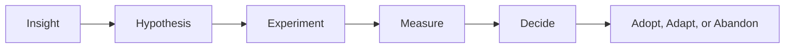

# Part 024 — Action Items, Experiments, Measurement, and Retro Anti-Patterns

## Positioning

Retrospective hanya menghasilkan value jika insight berubah menjadi tindakan, tindakan dijalankan, dan hasilnya diinspeksi.

Masalah umum:

- action terlalu banyak;
- action terlalu besar;
- owner tidak jelas;
- action tidak masuk workflow;
- dan hasil tidak pernah diukur.

> **Core thesis:** improvement action yang baik adalah eksperimen kecil dengan hypothesis, owner, success signal, review date, dan keputusan setelah evidence tersedia.

---

## 1. From Insight to Action

Flow improvement yang sehat:



Action tanpa hypothesis mudah berubah menjadi activity tanpa learning.

---

## 2. Action Item versus Experiment

### Action item

A task to complete.

Example:

> Add review checklist.

### Experiment

A change tested to see whether it improves a condition.

Example:

> For two Sprints, use a review checklist on contract-changing PRs and measure review rework plus escaped compatibility defects.

Experiments are stronger for process improvement.

---

## 3. Good Improvement Hypothesis

Structure:

```text
We believe:
By changing:
We expect:
We will know when:
```

Example:

```text
We believe review latency is driven by oversized PRs.
By limiting PRs to one coherent change and using stacked PRs,
we expect median first-review time to drop.
We will know when median review latency is below one working day for two Sprints.
```

---

## 4. Characteristics of a Good Retro Action

- small;
- specific;
- owned;
- observable;
- time-bounded;
- within influence;
- and connected to insight.

Avoid:

- “communicate better”;
- “be more careful”;
- “improve quality”;
- or “fix process”.

---

## 5. Action Scope

Good actions fit within a short horizon.

Prefer:

- one or two experiments;
- one clear owner;
- and one review point.

Too many actions dilute follow-through.

---

## 6. Action Ownership

Owner is accountable for moving the action, not doing everything personally.

Owner may:

- coordinate;
- gather evidence;
- update status;
- and bring result back.

Shared ownership without named owner often means no ownership.

---

## 7. Team-Owned versus External Actions

### Team-owned

Within team authority.

Example:

- change Daily Scrum format;
- introduce WIP limit;
- rotate reviewer.

### External

Requires organization or another team.

Example:

- environment capacity;
- release policy;
- security approval SLA.

External action needs:

- sponsor;
- escalation;
- evidence;
- and checkpoint.

---

## 8. Action Tracking

Track actions where normal work is visible.

Possible locations:

- Sprint Backlog;
- improvement backlog;
- team board;
- working agreement;
- or engineering backlog.

Avoid retro notes that no one revisits.

---

## 9. Improvement Backlog

An improvement backlog can contain:

- process experiment;
- tooling improvement;
- technical debt;
- team enablement;
- and organizational impediment.

It still needs ordering.

Do not create a second graveyard backlog.

---

## 10. Action Priority

Prioritize based on:

- impact;
- recurrence;
- feasibility;
- risk reduction;
- and team authority.

### Impact-effort lens

```text
High impact / low effort:
Do first.

High impact / high effort:
Create staged experiment.

Low impact / low effort:
Optional.

Low impact / high effort:
Avoid.
```

---

## 11. Success Signals

A success signal should be observable.

Examples:

- review latency;
- cycle time;
- carry-over;
- blocked duration;
- defect rate;
- flaky test rate;
- meeting duration;
- response rate;
- and qualitative team feedback.

Use one or two signals, not a dashboard for every action.

---

## 12. Baseline

Before experiment, capture current condition.

Example:

```text
Baseline:
Median review latency = 2.8 days
90th percentile = 5.1 days
```

Without baseline, improvement claim is subjective.

---

## 13. Leading and Lagging Signals

### Leading

- WIP reduced;
- review response faster;
- examples added earlier.

### Lagging

- fewer defects;
- lower carry-over;
- improved predictability.

Short experiments often rely on leading indicators first.

---

## 14. Qualitative Evidence

Not all improvements are numeric.

Qualitative signals:

- team reports clearer ownership;
- stakeholder confusion decreases;
- fewer repeated clarification questions;
- and support reports easier diagnosis.

Document source and sample.

---

## 15. Experiment Duration

Set enough time to observe.

Examples:

- one Sprint for meeting format;
- two to four Sprints for flow policy;
- longer for defect trend.

Avoid judging complex outcomes too quickly.

---

## 16. Adoption Decision

After experiment:

### Adopt

Evidence supports change.

### Adapt

Some benefit, but mechanism needs adjustment.

### Abandon

No benefit or cost too high.

### Extend

Evidence insufficient.

Always record the decision.

---

## 17. Action Review Cadence

At the start of Retrospective:

- review prior actions;
- inspect evidence;
- decide status;
- and close or adapt.

This reinforces trust.

---

## 18. Definition of Done for Improvement Action

Example:

```text
- Experiment executed.
- Evidence captured.
- Team reviewed result.
- Decision recorded.
- Working agreement or backlog updated.
```

“Checklist created” is not complete if no one tested it.

---

## 19. Working Agreement Update

If experiment becomes standard practice:

- update working agreement;
- communicate;
- and review later.

This turns learning into durable team memory.

---

## 20. Automation of Improvement

When action is validated, automate where useful.

Examples:

- PR size warning;
- contract test in CI;
- aging alert;
- deployment evidence;
- and environment health check.

Automation reduces reliance on memory.

---

## 21. Retrospective Action Anti-Patterns

### Too many actions

Nothing finishes.

### Vague action

No observable change.

### No owner

No follow-through.

### Permanent action without experiment

Process burden grows.

### Metric-only action

Behavior not understood.

### Action outside authority

No sponsor.

### Action hidden in notes

No visibility.

### Repeated restart

Same idea introduced every Sprint.

---

## 22. “Communicate Better” Anti-Pattern

Rewrite into mechanism.

Weak:

> Communicate blockers better.

Better:

> Mark blocked items immediately, include owner and next checkpoint, and escalate after one working day.

---

## 23. “Be More Careful” Anti-Pattern

Weak:

> Be more careful with event changes.

Better:

> Add provider-consumer compatibility test to CI for event-schema changes.

System control is stronger than attention demand.

---

## 24. “Add More Meetings” Anti-Pattern

Meetings can help, but often add coordination cost.

Before adding:

- what decision is missing;
- who needs to attend;
- why async fails;
- and when meeting can be removed.

---

## 25. “Create a Checklist” Anti-Pattern

Checklist helps only if:

- used at decision point;
- concise;
- owner clear;
- and integrated with workflow.

A document in a wiki is not behavior change.

---

## 26. Action Overload

Action capacity is limited.

Improvement work competes with feature work.

Make it visible and ordered.

If leadership expects improvement without capacity, that contradiction should be escalated.

---

## 27. Improvement Capacity

Possible models:

- one experiment per Sprint;
- explicit improvement item;
- fixed small capacity;
- or opportunistic low-cost changes.

Choose based on context.

---

## 28. Technical Improvement Experiments

Examples:

- smaller PRs;
- contract test;
- faster CI stage;
- flaky-test quarantine policy;
- local environment script;
- and deployment automation.

Connect to flow or risk.

---

## 29. Process Improvement Experiments

Examples:

- right-to-left Daily Scrum;
- refinement pre-read;
- WIP limit;
- review rotation;
- and blocker escalation threshold.

---

## 30. Collaboration Experiments

Examples:

- pairing rotation;
- Three Amigos;
- async handoff template;
- and decision-log practice.

---

## 31. Product Collaboration Experiments

Examples:

- outcome statement on top backlog items;
- customer evidence in refinement;
- review feedback classification;
- and Product Goal check in Planning.

---

## 32. Remote-Team Experiments

Examples:

- written daily update before overlap;
- meeting-free focus block;
- recorded technical walkthrough;
- and timezone handoff checklist.

Measure communication delay and meeting load.

---

## 33. Organizational Improvement Experiments

Harder because authority is external.

Use:

- evidence;
- sponsor;
- narrow pilot;
- and explicit decision.

Example:

> Pilot expedited architecture review for low-risk additive API changes using a predefined checklist.

---

## 34. Experiment Risk

An improvement experiment can cause harm.

Assess:

- delivery disruption;
- quality risk;
- team burden;
- stakeholder confusion;
- and reversibility.

Prefer reversible experiments.

---

## 35. Guardrails

Example WIP-limit experiment guardrails:

- expedite policy remains;
- production incident exempt;
- Product Owner informed;
- and review after two Sprints.

---

## 36. Metrics Misuse

Do not use improvement metrics to evaluate individuals.

Examples of misuse:

- reviewer ranking;
- developer cycle time;
- number of comments;
- or ticket throughput per person.

Measure system behavior.

---

## 37. Statistical Humility

Small teams have noisy data.

Do not claim causation from one Sprint.

Use:

- trend;
- qualitative context;
- and repeated observation.

---

## 38. Improvement Theatre

Signals:

- action list grows;
- many workshops;
- no behavior change;
- dashboards created but not used;
- and process complexity increases.

Improvement should reduce pain, not create ceremony.

---

## 39. Follow-Through Failure Modes

### Owner unavailable

No backup or sponsor.

### Action blocked externally

No escalation.

### Measurement missing

No result.

### Team forgets

Not in workflow.

### Action too large

Never completes.

### Incentive conflict

Behavior reverts.

---

## 40. Action Escalation

For external impediment, use:

```text
Observed issue:
Frequency:
Impact:
Evidence:
Attempted mitigation:
Requested change:
Sponsor:
Decision date:
```

---

## 41. Senior Engineer Operating Model

### Select leverage

Choose action that changes system behavior.

### Avoid overengineering

Do not turn every improvement into a platform project.

### Make technical pain measurable

Review latency, CI time, failure rate, or support toil.

### Share ownership

Coach others to own experiments.

### Protect capacity

Advocate explicit improvement work.

### Close the loop

Bring result back and record decision.

---

## 42. Worked Example: Review Latency Experiment

### Insight

PRs wait too long.

### Hypothesis

Smaller PRs and reviewer rotation will reduce wait.

### Experiment

For two Sprints:

- one coherent change per PR;
- daily reviewer rotation;
- first response expectation within one working day.

### Baseline

Median first review: 2.6 days.

### Success signal

Median below 1 day without increased rework.

### Decision

Adopt rotation; adapt PR guidance.

---

## 43. Worked Example: Refinement Quality Experiment

### Insight

Acceptance criteria change mid-Sprint.

### Hypothesis

Three Amigos on high-risk items will reduce rework.

### Experiment

Use example mapping for top three candidate stories.

### Measure

- number of mid-Sprint clarification changes;
- defect/rework;
- team feedback.

### Result

If effective, add to working agreement for high-risk items only.

---

## 44. Worked Example: Flaky Test Experiment

### Insight

CI reruns normalized.

### Hypothesis

Visible ownership and failure budget will reduce flakiness.

### Experiment

- tag flaky test;
- assign owner;
- publish count;
- fix within one Sprint;
- prevent indefinite quarantine.

### Measure

- rerun frequency;
- flaky test count;
- pipeline trust feedback.

---

## 45. Worked Example: Remote Handoff

### Insight

Blockers wait overnight.

### Hypothesis

Structured end-of-day handoff will reduce latency.

### Template

```text
Current state:
Evidence:
Blocker:
Decision needed:
Suggested next step:
Owner:
```

### Measure

- blocker response time;
- repeated clarification;
- and team feedback.

---

## 46. Improvement Experiment Canvas

```md
## Problem

What recurring pain exists?

## Evidence

What supports it?

## Hypothesis

What change may improve it?

## Experiment

What will be tried?

## Scope

Where and for how long?

## Guardrails

What must not be harmed?

## Success Signals

What will be observed?

## Owner

Who coordinates?

## Review Date

When will the team decide?

## Outcome

Adopt / Adapt / Abandon / Extend.
```

---

## 47. Action-Tracking Table

| Action | Owner | Baseline | Success Signal | Review Date | Status |
|---|---|---|---|---|---|
| Reviewer rotation | A | 2.6-day wait | <1 day median | Sprint 26 retro | Running |
| WIP limit | B | 9 active items | <=5 active | Sprint 26 retro | Planned |

---

## 48. Retrospective Close

Close with:

- selected action;
- owner;
- review date;
- and confidence.

Optional:

- appreciation;
- safety check;
- and facilitation feedback.

---

## 49. Process Smells

- actions not reviewed;
- same action re-created;
- owner is always Scrum Master;
- all actions require management;
- metrics absent;
- no actions adopted or abandoned;
- and improvement backlog grows indefinitely.

---

## 50. Internal Verification Checklist

### Tracking

- Where are retro actions stored?
- Are they visible in Sprint work?
- Who owns updates?
- Are prior actions reviewed first?

### Measurement

- What flow and quality data exist?
- Is baseline captured?
- Are qualitative signals documented?
- Are metrics used safely?

### Capacity

- Is improvement work planned?
- Is there explicit capacity?
- Can team stop low-value actions?
- Does leadership support improvement?

### Escalation

- How are organizational impediments raised?
- Who sponsors?
- What evidence is expected?
- Is decision latency visible?

### Working agreement

- How are successful experiments institutionalized?
- Is agreement versioned?
- When is it reviewed?
- Are obsolete policies removed?

---

## 51. Practical Exercises

### Exercise 1 — Rewrite actions

Convert five vague actions into measurable experiments.

### Exercise 2 — Experiment canvas

Create a full canvas for one recurring bottleneck.

### Exercise 3 — Baseline

Choose one metric and establish current baseline.

### Exercise 4 — Follow-through audit

Review last ten retro actions and classify:

- completed;
- abandoned;
- forgotten;
- blocked;
- or repeated.

### Exercise 5 — Working agreement update

Take one successful experiment and write the resulting policy.

---

## 52. Part Completion Checklist

You are done if you can:

- turn insight into hypothesis;
- design a small reversible experiment;
- assign clear ownership;
- capture baseline and success signal;
- review results;
- adopt, adapt, abandon, or extend;
- and integrate learning into working agreements or backlog.

---

## 53. Key Takeaways

1. Insight without follow-through has no value.
2. Experiments are stronger than vague actions.
3. One or two actions are usually enough.
4. Every action needs an owner.
5. Baseline and success signal matter.
6. Improvement work needs capacity.
7. Metrics must describe systems, not judge individuals.
8. Successful experiments should become durable policy or automation.
9. Senior engineers should choose leverage, not complexity.
10. Internal action-tracking practice must be verified.

---

## 54. References

Conceptual baseline:

- The Scrum Guide.
- Continuous-improvement, hypothesis-driven experimentation, and system-measurement practices.
- General retrospective facilitation and team-effectiveness practices.

These concepts do not describe internal CSG processes.
