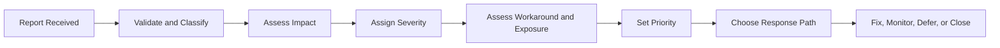

# Part 027 — Defect Classification, Customer Impact, SLA, and Production Fix Decisions

## Positioning

Bug triage bukan sekadar memberi label pada ticket.

Bug triage adalah proses decision-making untuk menentukan:

- apa yang benar-benar salah;
- siapa yang terdampak;
- seberapa besar risiko;
- apakah workaround tersedia;
- apakah perubahan harus menginterupsi Sprint;
- dan bagaimana fix dirilis dengan aman.

> **Core thesis:** severity menggambarkan dampak; priority menggambarkan urutan tindakan. Keduanya berkaitan, tetapi tidak identik.

---

## 1. What Is a Defect?

Defect adalah behavior yang berbeda dari expected behavior.

Expected behavior dapat berasal dari:

- acceptance criteria;
- documented contract;
- product rule;
- regulation;
- compatibility promise;
- established user expectation;
- atau production invariant.

Tidak semua unexpected behavior otomatis defect.

It may be:

- new requirement;
- ambiguous behavior;
- unsupported scenario;
- configuration issue;
- data issue;
- operational issue;
- or user misunderstanding.

---

## 2. Defect versus Enhancement

### Defect

Existing expected behavior is violated.

### Enhancement

New or changed behavior is requested.

Example:

```text
Defect:
An approved quote can be submitted twice.

Enhancement:
Support wants a bulk retry action.
```

Misclassifying enhancement as defect distorts urgency.

---

## 3. Defect versus Incident

### Defect

A product or system flaw.

### Incident

An event that disrupts service or creates material impact.

One defect can cause many incidents.

One incident can involve:

- defect;
- configuration;
- infrastructure;
- human action;
- or external dependency.

---

## 4. Defect versus Support Case

A support case is a customer-reported problem.

Investigation may conclude:

- defect;
- expected behavior;
- training gap;
- data issue;
- or external system issue.

Do not create duplicate defect tickets before classification.

---

## 5. Bug Triage Objectives

A triage session or process should produce:

- classification;
- severity;
- priority;
- owner;
- next action;
- customer communication need;
- release path;
- and follow-up evidence.

---

## 6. Triage Inputs

Useful inputs:

- reproducible steps;
- observed behavior;
- expected behavior;
- affected version;
- tenant/customer;
- frequency;
- exposure;
- logs/traces;
- workaround;
- and business impact.

---

## 7. Minimum Defect Record

```md
## Observed Behavior

What happened?

## Expected Behavior

What should happen?

## Reproduction

How can it be reproduced?

## Scope

Version, tenant, region, workflow, data.

## Impact

Customer, operational, financial, compliance.

## Evidence

Logs, traces, screenshots, payloads.

## Workaround

Available? Safe? Cost?

## Detection

How was it found?
```

---

## 8. Severity

Severity measures impact of the defect or incident.

Typical dimensions:

- service availability;
- data integrity;
- security;
- financial impact;
- customer breadth;
- compliance;
- recoverability;
- and workaround.

Severity should be based on consequence, not reporter seniority.

---

## 9. Example Severity Model

### Severity 1 — Critical

Possible characteristics:

- broad production outage;
- data corruption;
- major security exposure;
- financial posting failure;
- no safe workaround;
- or critical customer operation blocked.

### Severity 2 — High

Possible characteristics:

- major capability unavailable;
- important customers affected;
- high manual recovery;
- or risky workaround.

### Severity 3 — Medium

Possible characteristics:

- limited scope;
- workaround available;
- non-critical behavior degraded.

### Severity 4 — Low

Possible characteristics:

- cosmetic;
- minor usability;
- low-impact edge case.

Internal definitions must be verified.

---

## 10. Severity Dimensions

A stronger model evaluates:

| Dimension | Question |
|---|---|
| Breadth | How many users/tenants? |
| Depth | How severe is impact per user? |
| Integrity | Is data wrong or corrupted? |
| Security | Is confidentiality/integrity affected? |
| Financial | Is money or billing affected? |
| Recoverability | Can state be restored? |
| Workaround | Is it safe and practical? |
| Duration | How long has impact persisted? |
| Detectability | Can affected scope be known? |

---

## 11. Priority

Priority determines when work should be addressed.

Priority considers:

- severity;
- customer commitment;
- workaround;
- strategic importance;
- timing;
- fix risk;
- and available capacity.

A severe defect may have lower immediate priority if:

- exposure fully contained;
- safe workaround exists;
- and risky fix requires preparation.

A lower-severity defect may be prioritized due to:

- major customer launch;
- legal deadline;
- or broad recurring support cost.

---

## 12. Severity versus Priority

```text
Severity:
How bad is the impact?

Priority:
What should we do next?
```

Do not change severity merely to get higher priority.

That corrupts reporting and trust.

---

## 13. Urgency

Urgency is time sensitivity.

Useful distinction:

```text
Severity = impact
Urgency = how quickly action is needed
Priority = ordering decision
```

---

## 14. Impact Assessment

Assess:

- affected workflow;
- number of transactions;
- customer tier;
- revenue or contractual exposure;
- data state;
- support burden;
- and reputational consequence.

Avoid priority by “loudest stakeholder”.

---

## 15. Frequency

A low-impact defect occurring thousands of times may become high priority.

Frequency should include:

- occurrence count;
- affected transaction rate;
- recurrence trend;
- and growth projection.

---

## 16. Workaround Quality

A workaround is not binary.

Evaluate:

- safe;
- documented;
- repeatable;
- customer-accessible;
- operational cost;
- side effects;
- and duration.

Unsafe manual database changes are not a strong workaround.

---

## 17. Detectability

A defect discovered internally before customer exposure differs from silent production corruption.

Questions:

- Do we know all affected records?
- Can we alert?
- Does customer discover first?
- Can impact be bounded?

Low detectability increases risk.

---

## 18. Reproducibility

Reproducibility helps diagnosis but should not determine severity.

A non-reproducible data-corruption report may still be critical.

Capture:

- deterministic;
- intermittent;
- environment-specific;
- data-specific;
- race condition;
- and unknown.

---

## 19. Bug Triage Flow



---

## 20. Response Paths

Possible decisions:

- immediate incident response;
- hotfix;
- next planned release;
- normal backlog;
- workaround and monitor;
- close as expected behavior;
- convert to enhancement;
- or request more evidence.

---

## 21. Triage Roles

Possible roles:

- support;
- Product Owner;
- engineering;
- QA;
- operations/SRE;
- security;
- and incident commander.

Decision rights should be explicit.

---

## 22. Product Owner Role

Product Owner helps determine:

- product impact;
- customer importance;
- ordering;
- and scope trade-off.

Product Owner should not override technical severity evidence without discussion.

---

## 23. Engineer Role

Engineer provides:

- reproducibility;
- technical exposure;
- fix options;
- regression risk;
- and release safety.

Avoid using uncertainty as reason to minimize impact.

---

## 24. QA Role

QA can support:

- behavior comparison;
- reproduction;
- scope discovery;
- regression analysis;
- and validation strategy.

QA should not become sole owner of defect quality.

---

## 25. Support Role

Support provides:

- customer context;
- occurrence;
- workaround cost;
- communication need;
- and evidence.

Support signal is valuable product evidence.

---

## 26. Security Defects

Security triage may require:

- restricted access;
- separate severity framework;
- coordinated disclosure;
- remediation SLA;
- and careful communication.

Do not expose sensitive exploit details in broad backlog.

---

## 27. Data Integrity Defects

Data integrity issues need:

- affected-record identification;
- stop-the-bleeding action;
- correction strategy;
- reconciliation;
- and audit.

Code fix alone may not restore data.

---

## 28. Financial Defects

For pricing, billing, or order value:

- quantify affected transactions;
- stop further incorrect processing;
- identify correction;
- involve finance/business owner;
- and preserve audit.

---

## 29. Compatibility Defects

Examples:

- old consumer rejects new event;
- API field behavior changes;
- migration breaks legacy data;
- or configuration default changes.

Compatibility defects often have cross-team blast radius.

---

## 30. Intermittent and Concurrency Defects

Race conditions require:

- timestamps;
- correlation IDs;
- event order;
- thread or transaction context;
- and production-like reproduction.

Avoid closing as “cannot reproduce” without observability improvement.

---

## 31. Hotfix Definition

A hotfix is an expedited production change intended to address urgent impact.

Hotfix does not mean:

- no review;
- no test;
- direct code edit;
- or undocumented deployment.

Hotfix means compressed lead time with explicit risk control.

---

## 32. Hotfix Decision Criteria

Consider hotfix when:

- current impact is material;
- no safe workaround;
- delay cost is high;
- fix is understood;
- and release risk is acceptable.

Avoid hotfix if:

- issue is low impact;
- change is broad and uncertain;
- or safer containment exists.

---

## 33. Hotfix Options

- disable feature;
- configuration change;
- rollback;
- targeted patch;
- data correction;
- traffic routing;
- or roll-forward.

The safest option may not be code change.

---

## 34. Hotfix Workflow

```text
1. Confirm severity and scope.
2. Stabilize or contain.
3. Define smallest safe fix.
4. Review risk.
5. Test targeted and critical regression paths.
6. Prepare rollback/roll-forward.
7. Deploy with monitoring.
8. Validate production.
9. Communicate.
10. Create follow-up actions.
```

---

## 35. Stop the Bleeding

Before full fix:

- disable operation;
- pause rollout;
- stop retry;
- block invalid input;
- isolate tenant;
- or switch to safe mode.

Containment reduces exposure while diagnosis continues.

---

## 36. Smallest Safe Fix

A hotfix should minimize change surface.

But smallest code diff is not always safest.

The safest fix may include:

- validation;
- observability;
- config;
- and state correction.

---

## 37. Hotfix Testing

Minimum testing should be risk-based.

Possible evidence:

- reproduction test;
- regression test;
- contract test;
- integration test;
- migration validation;
- smoke test;
- and production verification.

Never skip the test that proves the original failure is fixed.

---

## 38. Hotfix Review

Review should focus on:

- correctness;
- blast radius;
- compatibility;
- rollback;
- and observability.

Use experienced reviewers, but avoid single-person dependency.

---

## 39. Hotfix Release

Prepare:

- exact artifact;
- target environment;
- release owner;
- approval;
- rollback;
- validation;
- and communication.

Do not rely on verbal memory.

---

## 40. Production Validation

After release:

- reproduce safe success;
- inspect metrics;
- confirm error rate;
- validate affected workflow;
- and monitor residual risk.

Deployment success is not fix success.

---

## 41. Customer Communication

Communication may need:

- impact;
- current status;
- workaround;
- resolution;
- and next update.

Do not include unsupported root-cause claims early.

---

## 42. Hotfix Follow-Up

A hotfix often creates follow-up:

- broader regression tests;
- permanent design fix;
- data correction;
- runbook;
- alert;
- and process improvement.

Do not close the learning loop when production stabilizes.

---

## 43. Defect Aging

Aging defect can become more expensive.

Track:

- open duration;
- recurrence;
- affected versions;
- workaround burden;
- and planned deadline.

Old low-priority defects should be periodically reviewed or closed.

---

## 44. Duplicate Defects

Duplicate handling should preserve:

- all affected customers;
- evidence;
- and occurrence counts.

Closing duplicate reports without aggregating impact hides frequency.

---

## 45. Reopened Defects

A reopened defect may indicate:

- incomplete fix;
- incorrect scope;
- insufficient test;
- or multiple root mechanisms.

Reopen should trigger analysis, not blame.

---

## 46. Escaped Defect

An escaped defect reaches a later stage or production.

Use it to inspect:

- refinement;
- acceptance criteria;
- test strategy;
- review;
- environment;
- and observability.

Do not assume more testing is always the only answer.

---

## 47. Defect Leakage Metrics

Possible metrics:

- production defects;
- escaped defect rate;
- reopen rate;
- time to triage;
- time to containment;
- time to resolution;
- and recurrence.

Metrics should improve system behavior, not rank individuals.

---

## 48. Severity Inflation

Symptoms:

- many defects marked critical;
- labels used to bypass backlog order;
- no distinction between impact and urgency.

Result:

- alert fatigue;
- mistrust;
- and poor focus.

---

## 49. Severity Deflation

Symptoms:

- customer impact minimized;
- production issue labeled normal bug;
- security or data risk ignored.

Often driven by pressure to protect metrics.

---

## 50. Priority by Customer Volume Only

One strategic or regulated customer may matter despite low volume.

Use broader impact context.

---

## 51. Bug Backlog Health

Healthy defect backlog:

- no untriaged items;
- severity consistent;
- stale items reviewed;
- duplicates linked;
- workaround visible;
- and customer impact aggregated.

---

## 52. Defect Review Cadence

Possible cadence:

- immediate for severe reports;
- daily triage;
- weekly backlog review;
- release-focused review.

Cadence should match product exposure.

---

## 53. Sprint Impact

When a defect enters during Sprint:

```text
Does it threaten production?
Does it threaten Sprint Goal?
What capacity is required?
What work should be removed?
Who decides priority?
```

Do not add urgent bug without scope trade-off.

---

## 54. Defects and Definition of Done

If a defect is found before item is Done, it may simply mean the item is incomplete.

Avoid creating separate bug tickets solely to preserve story completion metrics.

---

## 55. Known Defects at Release

A known defect release decision should include:

- severity;
- scope;
- workaround;
- customer impact;
- owner;
- and explicit risk acceptance.

Do not hide known defects.

---

## 56. Defect Root Cause versus Fix Cause

Fixing immediate code path is not the same as understanding why defect escaped.

Possible escape causes:

- ambiguous requirement;
- missing scenario;
- weak test;
- review gap;
- environment mismatch;
- and monitoring gap.

---

## 57. Senior Engineer Operating Model

### During triage

- clarify behavior;
- assess technical exposure;
- avoid premature minimization;
- and separate severity from fix complexity.

### During fix

- choose smallest safe path;
- include validation and rollback;
- and preserve traceability.

### During communication

- state facts and uncertainty;
- avoid blame;
- and translate impact.

### After fix

- create permanent prevention;
- improve test/observability;
- and share learning.

---

## 58. Worked Example: Duplicate Order Submission

### Observed

A timeout followed by retry creates two downstream orders.

### Severity dimensions

- financial and fulfillment impact;
- limited pilot tenant;
- manual reconciliation possible;
- issue intermittent.

### Immediate response

- disable automatic retry;
- identify affected orders;
- inform support.

### Hotfix

Add idempotency key and duplicate detection.

### Follow-up

- concurrency tests;
- alert;
- and reconciliation tool.

---

## 59. Worked Example: Incorrect Discount Display

### Observed

UI rounds discount differently from approved value.

### Impact

Potential user confusion, but submitted value remains correct.

### Workaround

View exact value in quote details.

### Decision

Medium severity, planned fix in next release.

If contractual document used wrong value, severity would change.

---

## 60. Worked Example: Cross-Tenant Access

### Observed

Authenticated user can query another tenant's quote by ID.

### Response

- security incident process;
- restrict detail;
- disable endpoint if necessary;
- assess exposure;
- patch authorization;
- audit access;
- and follow disclosure policy.

This is not ordinary backlog triage.

---

## 61. Worked Example: Unsupported Legacy Consumer

### Observed

New optional event enum crashes one legacy consumer.

### Impact

One downstream workflow halted.

### Response

- stop producer rollout;
- restore compatible mapping;
- validate all consumer versions;
- and improve contract matrix.

---

## 62. Bug Triage Template

```md
## Classification

Defect / enhancement / data / configuration / support.

## Severity

Level and rationale.

## Priority

Order and rationale.

## Exposure

Customers, tenants, versions, transactions.

## Workaround

Description and safety.

## Response

Contain / hotfix / next release / backlog / monitor.

## Owner

Engineering and product/support owner.

## Verification

How fix and affected data will be validated.
```

---

## 63. Hotfix Checklist

### Before change

- severity confirmed;
- affected scope bounded;
- containment active;
- fix reviewed;
- tests pass;
- rollback ready;
- and communication owner assigned.

### During change

- exact artifact used;
- release logged;
- monitoring active;
- and command ownership clear.

### After change

- production validated;
- affected data checked;
- customer/support updated;
- and follow-up backlog created.

---

## 64. Anti-Patterns

### Every bug is urgent

No triage.

### Severity equals customer seniority

Inconsistent impact model.

### Fix complexity determines severity

Wrong dimension.

### Hotfix bypasses controls

Creates secondary incident.

### Close as cannot reproduce

No observability follow-up.

### Bug ticket for incomplete story

Metric gaming.

### Workaround hides debt

Permanent manual cost.

### Production fix without data repair

Issue remains.

---

## 65. Failure Modes

### Repeated defect

Permanent cause not addressed.

### Hotfix regression

Testing or blast-radius analysis weak.

### Customer surprise

Communication delayed.

### Bug backlog explosion

No triage or stale cleanup.

### Priority conflict

Decision rights unclear.

---

## 66. Process Smells

- severity definitions vary by person;
- no customer exposure field;
- workaround undocumented;
- hotfixes are frequent;
- duplicate defects hide occurrence;
- known defects released silently;
- and defect learning never changes refinement or testing.

---

## 67. Internal Verification Checklist

### Severity and priority

- What severity model exists?
- Who can assign or change severity?
- Is urgency separate?
- How is customer tier considered?
- How is security handled?

### Triage

- What cadence exists?
- Who participates?
- What minimum evidence is required?
- How are duplicates handled?
- How are support cases linked?

### Hotfix

- What qualifies as hotfix?
- Who authorizes it?
- What testing is mandatory?
- What rollback evidence is required?
- How are releases communicated?

### Data and customer impact

- How are affected records identified?
- Who owns data correction?
- Who communicates to customer?
- Are contractual SLAs involved?

### Metrics

- Is time to triage measured?
- Are recurrence and reopen tracked?
- Are hotfix frequency and escaped defects reviewed?
- Are metrics used safely?

---

## 68. Practical Exercises

### Exercise 1 — Severity assessment

Classify five defects using breadth, depth, integrity, workaround, and recoverability.

### Exercise 2 — Severity versus priority

Create examples where:

- high severity has lower immediate priority;
- lower severity has higher near-term priority.

### Exercise 3 — Hotfix decision

Compare rollback, config containment, targeted patch, and full fix.

### Exercise 4 — Defect record

Write a complete defect ticket from a vague support report.

### Exercise 5 — Escape analysis

Take one production defect and identify refinement, test, review, environment, and observability contributors.

---

## 69. Part Completion Checklist

You are done if you can:

- distinguish defect, enhancement, support case, and incident;
- assign severity based on impact;
- separate severity, urgency, and priority;
- assess workaround quality;
- choose a response path;
- execute hotfix safely;
- handle data/security defects;
- and close the learning loop.

---

## 70. Key Takeaways

1. Bug triage is a decision process.
2. Severity describes impact.
3. Priority describes ordering.
4. Workaround quality changes urgency.
5. Fix complexity does not define severity.
6. Hotfix means expedited control, not no control.
7. Data repair may be separate from code repair.
8. Duplicate reports should preserve occurrence evidence.
9. Escaped defects should improve the system.
10. Internal defect and hotfix policies must be verified.

---

## 71. References

Conceptual baseline:

- General defect-management, severity, priority, incident, and hotfix practices.
- Software quality, production support, and risk-management concepts.
- Scrum Product Backlog ordering and Sprint adaptation principles.

These concepts do not describe internal CSG processes.
