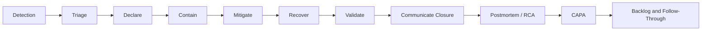

# Part 028 — Detection, Mitigation, Recovery, Postmortem, and Sprint Impact

## Positioning

Incident management adalah capability organisasi untuk:

- mendeteksi gangguan;
- memahami dampak;
- menstabilkan sistem;
- memulihkan layanan;
- berkomunikasi;
- belajar;
- dan mencegah recurrence.

Incident response yang baik tidak hanya memperbaiki service. Ia juga menjaga:

- decision clarity;
- customer trust;
- evidence;
- and sustainable team behavior.

> **Core thesis:** during an incident, restore safety first; understand fully later. After stability, turn evidence into corrective and preventive actions that re-enter normal product and engineering prioritization.

---

## 1. What Is an Incident?

Incident adalah unplanned event yang materially degrades:

- availability;
- correctness;
- performance;
- security;
- data integrity;
- or customer operations.

Examples:

- order submission outage;
- incorrect pricing;
- duplicate fulfillment;
- cross-tenant exposure;
- migration corruption;
- or severe latency.

---

## 2. Incident versus Defect

A defect is a flaw.

An incident is an impact event.

Relationship:

```text
Defect -> may cause incident
Incident -> may expose one or more defects
```

Not all incidents originate from code defects.

---

## 3. Incident versus Problem

In some operational frameworks:

- incident = restore service;
- problem = understand and remove underlying cause.

This distinction is useful even if internal terminology differs.

---

## 4. Incident Lifecycle



---

## 5. Lifecycle Objectives

### Detection

Know something is wrong.

### Triage

Understand scope and severity enough to act.

### Declaration

Activate the response model.

### Containment

Stop exposure from growing.

### Mitigation

Reduce customer impact.

### Recovery

Restore expected service.

### Validation

Confirm real health.

### Learning

Understand mechanisms and improve system.

---

## 6. Detection Sources

- automated alert;
- synthetic check;
- customer report;
- support;
- business reconciliation;
- security monitoring;
- deployment validation;
- and internal observation.

Customer-first detection is a signal of observability weakness.

---

## 7. Good Alerts

A good alert is:

- actionable;
- timely;
- scoped;
- low-noise;
- and connected to owner/runbook.

Weak alerts:

- CPU high with no service consequence;
- individual error log;
- or alert without action.

---

## 8. Incident Severity

Severity should consider:

- customer breadth;
- capability blocked;
- data/security impact;
- financial exposure;
- duration;
- workaround;
- and recoverability.

Severity may change as evidence improves.

---

## 9. Incident Declaration

Declaration creates shared recognition:

- this is an incident;
- this severity applies;
- these roles activate;
- and normal communication changes.

Delayed declaration creates coordination ambiguity.

---

## 10. Incident Roles

Possible roles:

### Incident Commander

Coordinates response and decisions.

### Technical Lead

Directs diagnosis and remediation.

### Operations Lead

Coordinates deployment, infrastructure, and monitoring.

### Communications Lead

Updates internal/external stakeholders.

### Scribe

Captures timeline, actions, and decisions.

One person may hold multiple roles in a small incident, but responsibilities should remain explicit.

---

## 11. Incident Commander

Incident Commander should:

- maintain overview;
- set priorities;
- assign actions;
- prevent duplicate work;
- manage communication cadence;
- and decide escalation.

The IC does not need to be the deepest technical expert.

---

## 12. Technical Lead

Technical Lead should:

- organize hypotheses;
- coordinate investigation;
- propose containment;
- and assess fix risk.

Avoid having every engineer independently try random changes.

---

## 13. Scribe and Timeline

The timeline should capture:

- detection;
- alerts;
- decisions;
- hypotheses;
- changes;
- customer updates;
- mitigation;
- and recovery.

Use timestamps.

This supports both live coordination and postmortem.

---

## 14. Incident Channel

Create a dedicated communication channel.

It should contain:

- current status;
- roles;
- actions;
- decisions;
- links;
- and update schedule.

Avoid fragmented side chats.

---

## 15. Command Structure

Use clear action statements:

```text
Owner:
Action:
Expected result:
Deadline/checkpoint:
```

Example:

> Rina: disable retry for pilot tenants and confirm error rate by 10:20.

---

## 16. First Response Questions

```text
What is the customer impact?
Is impact ongoing?
What changed?
Can exposure be contained?
Is data/security involved?
Who owns the response?
When is the next update?
```

---

## 17. Containment

Containment stops impact growth.

Examples:

- disable feature;
- halt deployment;
- pause traffic;
- isolate tenant;
- stop consumer;
- block invalid transition;
- or revoke credential.

Containment may reduce functionality to preserve safety.

---

## 18. Mitigation

Mitigation reduces impact without necessarily fixing root mechanism.

Examples:

- failover;
- manual processing;
- traffic rerouting;
- feature flag;
- queue drain;
- and temporary capacity.

---

## 19. Recovery

Recovery restores service or data.

Possible actions:

- rollback;
- roll-forward;
- restart;
- replay;
- reconcile;
- repair data;
- or switch dependency.

Recovery must be validated, not assumed.

---

## 20. Rollback Decision

Rollback is appropriate when:

- recent change likely cause;
- rollback safe;
- data compatible;
- and restoration faster than fix.

Rollback may be unsafe with:

- irreversible migration;
- changed external side effects;
- or incompatible schema.

---

## 21. Roll-Forward Decision

Use roll-forward when:

- rollback unsafe;
- fix narrow and understood;
- or system state has advanced.

Roll-forward still needs review and validation.

---

## 22. Data Incident Response

For data integrity:

1. stop further corruption;
2. identify affected records;
3. preserve evidence;
4. define correction;
5. validate reconciliation;
6. communicate;
7. audit.

Service recovery alone is insufficient.

---

## 23. Security Incident Boundary

Security incidents may require:

- restricted communication;
- legal/compliance involvement;
- evidence preservation;
- credential rotation;
- and disclosure process.

Do not mix open postmortem practice with sensitive exposure details without policy.

---

## 24. Customer Communication

Good incident communication includes:

- known impact;
- current action;
- workaround;
- next update time;
- and resolution state.

Avoid speculative cause.

---

## 25. Internal Communication

Internal stakeholders need:

- severity;
- scope;
- business impact;
- current status;
- decision needed;
- and update cadence.

Do not flood every channel.

---

## 26. Communication Cadence

Set cadence based on severity.

Example:

- critical: every 30 minutes;
- high: hourly;
- lower: on material change.

Internal policies may differ.

---

## 27. Status Vocabulary

Use precise states:

- investigating;
- identified;
- contained;
- mitigating;
- recovering;
- monitoring;
- resolved;
- closed.

“Resolved” should mean expected service restored and validation complete.

---

## 28. Incident Update Template

```md
## Status

Investigating / contained / monitoring / resolved.

## Impact

Who and what is affected?

## Current Understanding

Facts, not speculation.

## Actions

Completed and in progress.

## Workaround

If available.

## Next Update

Specific time.
```

---

## 29. Decision Log

Capture:

- decision;
- options;
- rationale;
- owner;
- and timestamp.

This is critical when pressure is high.

---

## 30. Hypothesis Management

During diagnosis:

```text
Hypothesis:
Evidence for:
Evidence against:
Test:
Owner:
Result:
```

Avoid random troubleshooting and premature convergence.

---

## 31. Change Correlation

Check:

- deployments;
- configuration;
- feature flags;
- traffic changes;
- data migration;
- certificates;
- dependency release;
- and infrastructure events.

Correlation is not proof, but it guides investigation.

---

## 32. Observability during Incident

Needed signals:

- service-level symptoms;
- logs;
- traces;
- metrics;
- event flow;
- data integrity;
- and dependency status.

Missing observability may become a CAPA item.

---

## 33. Runbooks

Runbooks should support:

- detection;
- diagnosis;
- containment;
- recovery;
- and escalation.

A runbook that no one can execute under pressure is not effective.

---

## 34. Manual Recovery

Manual recovery can be valid.

It should be:

- authorized;
- auditable;
- peer-checked;
- scripted where possible;
- and followed by validation.

Avoid ad hoc database edits.

---

## 35. Incident Fatigue

Long incidents create:

- cognitive overload;
- error risk;
- and poor decisions.

Use:

- shift handover;
- role rotation;
- breaks;
- and concise summaries.

Heroic endurance is not a reliability strategy.

---

## 36. Handover

A good handover includes:

```text
Current impact:
Current state:
Actions completed:
Open hypotheses:
Risks:
Next actions:
Decision points:
Key links:
```

---

## 37. Escalation

Escalate when:

- impact exceeds authority;
- customer or regulatory threshold triggered;
- expert needed;
- recovery stalled;
- or business decision required.

Escalation is not failure.

---

## 38. Incident Closure Criteria

Before closure:

- customer-facing service restored;
- error rate stable;
- affected data understood;
- workaround removed or documented;
- monitoring active;
- communication sent;
- and follow-up owner assigned.

---

## 39. Monitoring Period

After mitigation, observe:

- recurrence;
- error rate;
- queue;
- latency;
- data consistency;
- and customer reports.

Do not close immediately after first successful request.

---

## 40. Postmortem

A postmortem reconstructs:

- what happened;
- impact;
- timeline;
- response;
- contributing factors;
- detection gaps;
- and improvement actions.

It should be blameless and evidence-based.

---

## 41. Postmortem Timing

Run after:

- service stable;
- key evidence preserved;
- and relevant participants available.

Too early creates speculation.

Too late loses context.

---

## 42. Postmortem Structure

```md
## Summary

## Impact

## Detection

## Timeline

## Response

## Technical Mechanism

## Contributing Factors

## What Went Well

## What Made It Harder

## Corrective Actions

## Preventive Actions

## Owners and Dates
```

---

## 43. Root Cause Analysis

“Root cause” can imply one cause.

Complex incidents usually have multiple contributing factors.

Prefer questions:

- What conditions were necessary?
- What controls failed?
- Why did impact spread?
- Why was detection delayed?
- Why was recovery difficult?

---

## 44. Five Whys in RCA

Use carefully.

Avoid stopping at:

- human error;
- forgot;
- or did not follow process.

Continue to:

- workflow;
- incentive;
- tooling;
- ownership;
- and control design.

---

## 45. Fault Tree Thinking

Start with top event and branch contributing conditions.

Example:

```text
Duplicate order
AND
- retry occurred after timeout
- no idempotency key
- downstream response ambiguous
- duplicate alert absent
```

This exposes multiple control points.

---

## 46. Swiss Cheese Model

Failures pass through aligned gaps in multiple layers:

- requirement;
- design;
- test;
- review;
- deployment;
- monitoring;
- recovery.

Do not search for one person-shaped cause.

---

## 47. Contributing Factors

Possible categories:

- software;
- data;
- architecture;
- process;
- environment;
- communication;
- ownership;
- capacity;
- and organizational policy.

---

## 48. Detection Gap

Ask:

- Why did alert not fire?
- Why did customer report first?
- Was signal missing?
- Was threshold wrong?
- Was alert ignored?
- Was ownership unclear?

---

## 49. Response Gap

Ask:

- Was severity recognized?
- Were roles clear?
- Was runbook useful?
- Did decision latency matter?
- Did communication help?
- Was access available?

---

## 50. Recovery Gap

Ask:

- Was rollback possible?
- Was data repair understood?
- Did manual steps delay recovery?
- Was validation sufficient?
- Did dependencies cooperate?

---

## 51. CAPA

CAPA stands for:

- Corrective Action;
- Preventive Action.

### Corrective Action

Addresses the detected failure or immediate mechanism.

### Preventive Action

Reduces recurrence or similar classes of failure.

---

## 52. Corrective Action Examples

- patch defective logic;
- repair affected data;
- update configuration;
- add missing validation;
- or restore contract compatibility.

---

## 53. Preventive Action Examples

- idempotency standard;
- contract test;
- alert;
- runbook;
- reviewer guardrail;
- migration framework;
- or architecture change.

---

## 54. CAPA Quality

Good CAPA is:

- specific;
- risk-based;
- owned;
- measurable;
- time-bound;
- and linked to evidence.

Weak CAPA:

- be careful;
- improve communication;
- add more testing;
- or retrain everyone.

---

## 55. CAPA Prioritization

Not every action is equally valuable.

Prioritize by:

- recurrence risk;
- impact;
- leverage;
- cost;
- and generalizability.

Choose the smallest action that changes the failure mechanism.

---

## 56. CAPA Categories

### Detection

Find earlier.

### Containment

Limit blast radius.

### Recovery

Restore faster.

### Prevention

Stop recurrence.

### Resilience

Continue safely despite failure.

A balanced CAPA plan often includes more than prevention.

---

## 57. Action Owner

Each CAPA item needs:

- owner;
- backlog;
- due date or review date;
- evidence;
- and status.

The postmortem author should not automatically own every action.

---

## 58. CAPA Follow-Through

At future review:

- inspect completion;
- test effectiveness;
- and close only with evidence.

“Implemented” is not always “effective”.

---

## 59. Incident Learning into Product Backlog

Incident learning should create visible backlog items for:

- defect;
- observability;
- reliability;
- debt;
- runbook;
- migration;
- and process improvement.

Avoid a separate incident-action graveyard.

---

## 60. Unplanned Work

Incident response consumes capacity that had been planned elsewhere.

Unplanned work should be visible through:

- work item;
- time/capacity impact;
- Sprint Goal impact;
- and backlog consequences.

---

## 61. Sprint Impact

During incident:

1. assess severity;
2. activate response;
3. determine who participates;
4. estimate capacity loss;
5. protect Sprint Goal where possible;
6. remove optional scope;
7. update forecast;
8. communicate.

Do not preserve false commitment.

---

## 62. Incident Reserve

Teams with recurring support load may use:

- historical capacity reserve;
- responder rotation;
- expedite lane;
- or dedicated operations support.

Reserve should be based on evidence.

---

## 63. Rotation Model

A rotating responder can:

- handle alerts;
- triage support;
- and protect team focus.

Risks:

- knowledge silo;
- burnout;
- and uneven load.

Use handover and team swarm for severe incidents.

---

## 64. Expedite Lane

An expedite lane should have explicit entry criteria.

If always occupied, it is not an exception.

Inspect systemic demand.

---

## 65. Unplanned Work Metrics

Useful measures:

- incident count;
- severity distribution;
- time to detect;
- time to mitigate;
- time to recover;
- capacity consumed;
- recurrence;
- and action completion.

Do not use metrics to blame responders.

---

## 66. MTTD, MTTA, MTTR

### MTTD

Mean Time to Detect.

### MTTA

Mean Time to Acknowledge.

### MTTR

Can mean repair, restore, resolve, or recover depending on organization.

Always define the meaning.

Medians and percentiles may be more useful than averages.

---

## 67. Incident Frequency versus Impact

Many low-impact incidents and one catastrophic incident require different strategies.

Use:

- frequency;
- customer minutes;
- transaction impact;
- and severity.

---

## 68. Error Budget Concept

Error budget can connect reliability performance to delivery policy.

If reliability is within objective:

- normal delivery can continue.

If budget is exhausted:

- reliability actions gain priority.

Internal adoption must be verified.

---

## 69. Near Misses

Near miss:

- no customer impact;
- but failure almost propagated.

Examples:

- manual intervention prevented duplicate order;
- rollback occurred before broad rollout;
- or alert fired late but before SLA breach.

Near misses deserve learning.

---

## 70. Repeat Incidents

Repeat incident suggests:

- CAPA not completed;
- action ineffective;
- scope too narrow;
- or failure class misunderstood.

Track recurrence explicitly.

---

## 71. Incident Communication Anti-Patterns

### Overconfidence

Unverified root cause stated.

### Silence

No update while investigating.

### Technical dump

Stakeholders cannot understand impact.

### Vague status

“Working on it.”

### No next update

Uncertainty grows.

### Closure too early

Customer impact remains.

---

## 72. Incident Response Anti-Patterns

### Everyone joins

No role clarity.

### Random change

Hypothesis not tested.

### Multiple commanders

Conflicting direction.

### No scribe

Timeline lost.

### Hero culture

One person carries response.

### Fix before containment

Impact grows.

### Uncontrolled hotfix

Secondary failure.

---

## 73. Postmortem Anti-Patterns

### Root cause equals person

No system learning.

### Action overload

Nothing completes.

### Private postmortem

Learning not shared where safe.

### No impact data

Severity unclear.

### No follow-through

Trust erodes.

### Compliance-only document

No behavior change.

---

## 74. Senior Engineer Operating Model

### During incident

- remain calm;
- clarify role;
- use evidence;
- reduce change surface;
- and communicate uncertainty.

### As technical lead

- manage hypotheses;
- prevent random action;
- choose containment;
- and assess recovery risk.

### As participant

- follow command structure;
- document;
- and avoid side-channel decisions.

### After incident

- contribute blameless analysis;
- propose high-leverage CAPA;
- and follow through.

### Guardrail

Do not become permanent hero or sole incident authority.

---

## 75. Worked Example: Duplicate Order Incident

### Detection

Support reports two downstream orders for one quote.

### Impact

One pilot tenant, two transactions, financial reconciliation required.

### Containment

Disable automatic retry.

### Diagnosis

Timeout response ambiguous; retry lacks idempotency key.

### Recovery

Cancel duplicate order and reconcile state.

### Corrective action

Add idempotency for submission path.

### Preventive action

- contract invariant;
- duplicate metric;
- concurrency test;
- and rollout guardrail.

---

## 76. Worked Example: Pricing Latency Incident

### Detection

p95 alert after customer reports timeout.

### Contributing factors

- cache miss storm;
- recent catalog import;
- insufficient capacity;
- alert threshold too high.

### Mitigation

Scale service and pause import.

### Recovery

Latency returns below objective.

### CAPA

- load isolation;
- import rate limit;
- earlier alert;
- and representative performance test.

---

## 77. Worked Example: Cross-Tenant Exposure

### Detection

Security report.

### Response

- declare security incident;
- restrict channel;
- disable endpoint;
- preserve access logs;
- assess exposure;
- patch ownership validation;
- rotate if needed;
- and follow legal/compliance process.

### Learning

- authorization invariant tests;
- secure review checklist;
- and audit alert.

---

## 78. Worked Example: Bad Migration

### Incident

Migration writes incorrect approval state.

### Containment

Stop migration.

### Recovery

Restore from validated source and reconcile affected records.

### Contributors

- no dry-run report;
- insufficient sample;
- rollback untested;
- and validation query incomplete.

### CAPA

- staged migration framework;
- invariant checks;
- pilot requirement;
- and rollback exercise.

---

## 79. Incident Command Checklist

### Declare

- severity;
- roles;
- channel;
- update cadence.

### Stabilize

- containment;
- mitigation;
- customer protection.

### Diagnose

- hypotheses;
- evidence;
- change correlation.

### Recover

- fix/rollback;
- data repair;
- validation.

### Close

- communication;
- monitoring period;
- postmortem owner.

---

## 80. Postmortem Checklist

- summary;
- impact;
- timeline;
- detection;
- response;
- contributing factors;
- what helped;
- what hindered;
- corrective actions;
- preventive actions;
- owners;
- and review dates.

---

## 81. CAPA Action Template

```md
## Failure Mechanism

What mechanism is addressed?

## Action

What will change?

## Category

Detection / containment / recovery / prevention / resilience.

## Owner

Who coordinates?

## Evidence

How will effectiveness be proven?

## Due or Review Date

When will it be inspected?

## Residual Risk

What remains?
```

---

## 82. Unplanned Work Template

```md
## Incident

Reference and severity.

## Capacity Impact

People/time or Sprint impact.

## Scope Adjustment

What was removed or delayed?

## Follow-Up Work

Defect, reliability, observability, process.

## Forecast Update

Current confidence and next checkpoint.
```

---

## 83. Process Smells

- incidents detected by customers;
- no incident commander;
- same people always respond;
- no timestamped timeline;
- status updates vague;
- postmortem actions age indefinitely;
- Sprint impact hidden;
- and repeat incidents normalized.

---

## 84. Internal Verification Checklist

### Incident policy

- What qualifies as incident?
- What severity model exists?
- Who declares?
- Who acts as Incident Commander?
- What escalation exists?

### Communication

- What channel is used?
- What update cadence applies?
- Who communicates to customer?
- What status vocabulary is standard?
- Is there a public status process?

### Tooling

- Are alerts actionable?
- Is on-call available?
- Are runbooks maintained?
- Are logs/traces/metrics accessible?
- Is incident timeline tooling available?

### Security and data

- What restricted process exists?
- Who handles legal/compliance?
- How is evidence preserved?
- How is data correction approved?

### Postmortem and CAPA

- Which incidents require postmortem?
- Who facilitates?
- Where are actions tracked?
- How is effectiveness verified?
- Are repeat incidents reviewed?

### Scrum impact

- How is incident work represented?
- How is capacity adjusted?
- Who renegotiates Sprint scope?
- Is historical unplanned load used in planning?

---

## 85. Practical Exercises

### Exercise 1 — Incident simulation

Run a tabletop exercise for downstream-order outage.

### Exercise 2 — Role assignment

Assign IC, technical lead, communication lead, and scribe.

### Exercise 3 — Timeline reconstruction

Build a timestamped timeline from one past incident.

### Exercise 4 — RCA rewrite

Replace a person-focused root cause with system contributing factors.

### Exercise 5 — CAPA design

Create detection, containment, recovery, and prevention actions for one incident.

### Exercise 6 — Sprint replanning

Simulate a two-day high-severity incident and update Sprint forecast.

---

## 86. Part Completion Checklist

You are done if you can:

- explain the incident lifecycle;
- distinguish containment, mitigation, recovery, and resolution;
- operate with clear incident roles;
- communicate status;
- manage hypotheses;
- conduct blameless RCA;
- create corrective and preventive actions;
- and make unplanned Sprint impact transparent.

---

## 87. Key Takeaways

1. Restore safety first; analyze fully later.
2. Incident roles reduce coordination chaos.
3. Containment and mitigation are not root-cause fixes.
4. Communication needs facts and cadence.
5. Recovery must include data and customer validation.
6. RCA should identify contributing systems, not one person.
7. CAPA needs ownership and effectiveness evidence.
8. Near misses and repeat incidents matter.
9. Unplanned work must change the forecast transparently.
10. Internal incident and compliance practices must be verified.

---

## 88. References

Conceptual baseline:

- General incident-command, Site Reliability Engineering, blameless postmortem, RCA, and CAPA practices.
- Scrum Sprint adaptation and Product Backlog transparency principles.
- Reliability, observability, security-incident, and production-operations concepts.

These concepts do not describe internal CSG processes.
