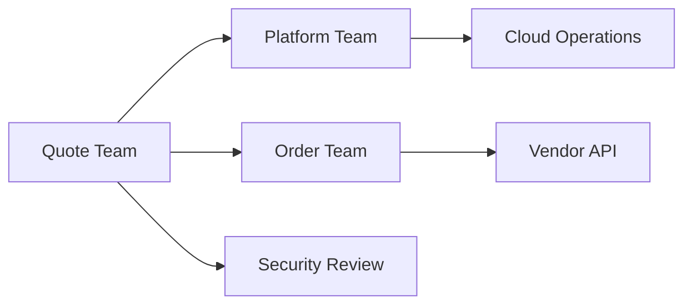

# Part 029 — Cross-Team Dependencies, Readiness Evidence, Ownership, and Escalation Triggers

## Positioning

Dependency bukan sekadar link antar-ticket.

Dependency adalah kondisi di mana progress, quality, atau release satu work item bergantung pada:

- keputusan;
- capability;
- contract;
- environment;
- data;
- akses;
- jadwal;
- atau delivery pihak lain.

Jika dependency hanya dicatat sebagai “blocked by Team X”, maka tim kehilangan informasi yang paling penting:

- apa yang sebenarnya dibutuhkan;
- kapan dibutuhkan;
- evidence apa yang menunjukkan ready;
- siapa yang berwenang;
- apa fallback-nya;
- dan kapan escalation harus terjadi.

> **Core thesis:** dependency yang matang dikelola sebagai contract dengan owner, readiness evidence, checkpoint, contingency, dan explicit risk—not as hope.

---

## 1. Why Dependency Management Matters

Dependency menciptakan delay melalui:

- waiting;
- coordination;
- clarification;
- approval;
- release sequencing;
- dan rework.

Semakin banyak dependency, semakin besar:

- variance;
- cycle time;
- forecast uncertainty;
- dan blast radius.

Namun tidak semua dependency buruk.

Beberapa dependency diperlukan karena:

- shared platform;
- domain ownership;
- security control;
- atau external integration.

Tujuannya bukan menghapus semua dependency.

Tujuannya adalah:

- membuatnya terlihat;
- mengurangi coupling;
- memvalidasi readiness;
- dan mengendalikan risk.

---

## 2. Dependency versus Coordination

### Coordination

Dua pihak perlu berkomunikasi.

### Dependency

Progress atau outcome satu pihak tidak dapat selesai tanpa input pihak lain.

Example:

```text
Coordination:
Team A informs Team B about a new optional event field.

Dependency:
Team A cannot enable the new producer because Team B must first support the new required field.
```

Not every coordination need should be tracked as blocking dependency.

---

## 3. Dependency Taxonomy Overview

A useful taxonomy includes:

1. Product dependency.
2. Decision dependency.
3. Domain dependency.
4. Technical dependency.
5. Contract dependency.
6. Data dependency.
7. Environment dependency.
8. Access dependency.
9. Release dependency.
10. External/vendor dependency.
11. Customer dependency.
12. Organizational dependency.
13. Knowledge dependency.
14. Capacity dependency.
15. Compliance or approval dependency.

Different dependency types need different readiness evidence.

---

## 4. Product Dependency

A product dependency exists when delivery needs:

- requirement decision;
- customer clarification;
- roadmap alignment;
- or scope approval.

Example:

> Approval delegation cannot be implemented until product decides whether delegation applies to existing in-flight approvals.

Readiness evidence:

- decision recorded;
- rule clarified;
- affected scope known;
- and decision owner identified.

---

## 5. Decision Dependency

A decision dependency is often hidden.

Examples:

- select migration path;
- choose compatibility policy;
- approve deprecation date;
- decide rollout tenant;
- or accept residual risk.

A decision dependency needs:

```text
Decision:
Options:
Evidence:
Owner:
Needed by:
Default if no decision:
```

Meeting scheduled is not readiness.

A decision made and recorded is readiness.

---

## 6. Domain Dependency

A domain dependency exists when team needs:

- business rule;
- terminology;
- state definition;
- policy precedence;
- or SME validation.

Risk:

- business rule remains tribal knowledge;
- SME availability becomes critical path;
- and implementation proceeds on assumption.

Readiness evidence:

- rule examples;
- decision table;
- glossary;
- or explicit assumption accepted by owner.

---

## 7. Technical Dependency

A technical dependency includes reliance on:

- shared library;
- service capability;
- infrastructure;
- component;
- or architecture change.

Example:

> Quote service requires platform-provided distributed lock before enabling concurrent amendment.

Readiness evidence:

- version;
- interface;
- availability;
- performance envelope;
- and support owner.

---

## 8. Contract Dependency

Contract dependency includes:

- API;
- event schema;
- protobuf;
- database view;
- file format;
- and protocol.

Readiness is not “endpoint exists”.

It may require:

- versioned specification;
- compatibility behavior;
- example payload;
- error semantics;
- authentication;
- test endpoint;
- and contract test.

---

## 9. Data Dependency

Data dependency includes:

- source data;
- test data;
- migration data;
- reference data;
- and ownership.

Questions:

```text
Is the data available?
Is it representative?
Is access permitted?
Is quality sufficient?
Is refresh cadence known?
Is lineage understood?
```

A schema without usable data is not ready.

---

## 10. Environment Dependency

Environment dependency includes:

- test environment;
- shared integration environment;
- staging;
- sandbox;
- and production window.

Readiness evidence:

- environment exists;
- correct version deployed;
- health check passes;
- required access works;
- dependencies reachable;
- and test data present.

---

## 11. Access Dependency

Access can involve:

- repository;
- environment;
- secret;
- database;
- support system;
- customer tenant;
- or vendor portal.

Access readiness should be verified before Sprint start for critical work.

“Request submitted” is not the same as “access available”.

---

## 12. Release Dependency

Release dependency occurs when work requires:

- coordinated deployment;
- release train;
- freeze exception;
- maintenance window;
- customer approval;
- or release authority.

Readiness evidence:

- window confirmed;
- artifact sequence defined;
- owner assigned;
- rollback understood;
- and communication prepared.

---

## 13. External or Vendor Dependency

External dependencies often have:

- longer feedback cycles;
- limited control;
- contract boundaries;
- and support escalation.

Track:

- vendor SLA;
- contact path;
- support ticket;
- expected response;
- workaround;
- and commercial escalation route.

---

## 14. Customer Dependency

Customer dependency can include:

- test participation;
- data sample;
- configuration;
- acceptance;
- deployment window;
- or business decision.

Avoid assuming customer availability.

Treat it as an explicit delivery dependency.

---

## 15. Organizational Dependency

Examples:

- architecture review board;
- security approval;
- legal review;
- procurement;
- finance approval;
- or staffing allocation.

These dependencies may have fixed lead times.

Include them in planning.

---

## 16. Knowledge Dependency

Knowledge dependency occurs when only one person knows:

- legacy rule;
- migration procedure;
- release process;
- customer customization;
- or recovery method.

This is both:

- delivery risk;
- resilience risk;
- and flow bottleneck.

Mitigation:

- pairing;
- walkthrough;
- documentation;
- rotation;
- and rehearsal.

---

## 17. Capacity Dependency

A team may depend on another team's capacity.

Example:

> Platform team must allocate an engineer to support pilot rollout.

Readiness evidence:

- named owner;
- confirmed allocation;
- planned window;
- and fallback.

“Team is aware” is not capacity commitment.

---

## 18. Compliance or Approval Dependency

Examples:

- security sign-off;
- data privacy review;
- legal approval;
- audit evidence;
- change advisory;
- or regulated validation.

Readiness should include:

- submission requirements;
- lead time;
- approver;
- status;
- and rework loop.

---

## 19. Hard versus Soft Dependency

### Hard dependency

Work cannot proceed or complete without it.

### Soft dependency

Work can proceed, but with cost or reduced confidence.

Example:

```text
Hard:
Required event schema is not available.

Soft:
Architecture reviewer feedback would reduce risk, but an approved guardrail already exists.
```

Classifying dependency helps choose response.

---

## 20. Internal versus External Dependency

### Internal

Within Scrum Team or organization.

### External

Vendor, customer, or outside organization.

External dependency often needs:

- earlier lead time;
- stronger fallback;
- and explicit escalation.

---

## 21. Upstream versus Downstream Dependency

### Upstream

Provides input or capability.

### Downstream

Consumes output and may constrain compatibility.

Teams often track upstream blockers but ignore downstream adoption.

Both matter.

---

## 22. Blocking versus Sequencing Dependency

### Blocking

No progress possible.

### Sequencing

Work must occur in order.

A sequencing dependency can often be reduced through:

- additive contract;
- feature flag;
- stub;
- adapter;
- or branch by abstraction.

---

## 23. Dependency Depth

Dependency depth is the number of layers between team and required outcome.

Example:

```text
Quote Team
-> Platform Team
-> Cloud Operations
-> Vendor Support
```

Deeper chains increase delay and communication loss.

---

## 24. Dependency Graph



Graph helps identify:

- hubs;
- critical path;
- shared bottlenecks;
- and single points of delay.

---

## 25. Critical Path

The critical path is the sequence of dependencies that determines earliest completion.

Not every dependency is critical.

Focus management effort on:

- high-impact;
- low-slack;
- and high-uncertainty dependencies.

---

## 26. Dependency Slack

Slack is time a dependency can slip before affecting target outcome.

Low-slack dependencies need:

- earlier checkpoint;
- stronger evidence;
- and explicit escalation.

---

## 27. Dependency Readiness

A dependency is ready when the required outcome is available with sufficient evidence.

Readiness is specific to need.

Example:

```text
API readiness for implementation:
- OpenAPI contract agreed.
- Authentication defined.
- Mock or test endpoint available.

API readiness for release:
- Provider deployed.
- Compatibility verified.
- Monitoring and support ownership ready.
```

---

## 28. Readiness Levels

A useful maturity model:

### Level 0 — Unknown

No owner or clear requirement.

### Level 1 — Identified

Need and provider known.

### Level 2 — Planned

Owner and expected date exist.

### Level 3 — Contracted

Interface, decision, or deliverable agreed.

### Level 4 — Available

Capability or input exists.

### Level 5 — Validated

Consumer has verified it works for intended use.

Do not confuse planned with validated.

---

## 29. Readiness Evidence by Dependency Type

| Dependency Type | Example Evidence |
|---|---|
| Decision | Recorded decision and owner |
| API | Versioned contract and contract test |
| Environment | Health check and access |
| Data | Representative sample and quality check |
| Release | Window, sequence, owner, rollback |
| Security | Review result or approved guardrail |
| Customer | Confirmed participant and scheduled window |
| Capacity | Named person and allocation |
| Vendor | Ticket status, response, or delivered capability |

---

## 30. Dependency Record

```md
## Dependency

What is needed?

## Type

Decision / contract / environment / data / external / etc.

## Provider

Who supplies it?

## Consumer

Who needs it?

## Needed By

Latest useful date.

## Current Readiness

Level and evidence.

## Risk

Likelihood, impact, and exposure.

## Fallback

What can happen if delayed?

## Escalation Trigger

When and to whom?

## Owner

Who coordinates?
```

---

## 31. Dependency Owner

Dependency owner coordinates the relationship.

They do not necessarily produce the dependency.

Responsibilities:

- clarify need;
- validate evidence;
- maintain status;
- follow up;
- activate fallback;
- and escalate.

---

## 32. Provider and Consumer Responsibilities

### Provider

- expose contract;
- communicate change;
- provide evidence;
- and state limitation.

### Consumer

- clarify need;
- validate early;
- avoid late assumption;
- and provide feedback.

Dependency management is bilateral.

---

## 33. Needed-By Date

A needed-by date should be based on:

- integration sequence;
- validation lead time;
- release window;
- and contingency.

Not only final release date.

Example:

```text
Release: 30 September
Contract needed: 10 September
Test environment needed: 16 September
Pilot validation needed: 23 September
```

---

## 34. Latest Responsible Date

The latest responsible date is when a decision or input must exist before options collapse.

It should include:

- implementation time;
- validation;
- rollout;
- and contingency.

---

## 35. Dependency Checkpoints

Useful checkpoints:

- contract review;
- environment smoke test;
- sample-data validation;
- integration test;
- release rehearsal;
- and go/no-go.

Checkpoints should produce evidence.

---

## 36. Fallback Strategy

Fallback options:

- re-slice;
- use mock for limited learning;
- adapter;
- manual process;
- alternate provider;
- defer integration;
- reduce rollout;
- or change Sprint Goal.

Fallback should be credible and safe.

---

## 37. Contingency versus Workaround

### Contingency

Planned response if risk occurs.

### Workaround

Alternative way to continue despite issue.

Both should include:

- owner;
- trigger;
- limit;
- and exit condition.

---

## 38. Dependency Risk Assessment

Assess:

- likelihood of delay;
- impact;
- detectability;
- control;
- substitutability;
- and timing.

Example:

```text
Likelihood: Medium
Impact: High
Control: Low
Fallback: Partial
Risk: High
```

---

## 39. Dependency Risk Register

A lightweight register:

| Dependency | Type | Owner | Needed By | Readiness | Risk | Fallback | Trigger |
|---|---|---|---|---|---|---|---|
| Approval event schema | Contract | A | 15 Jul | Contracted | Medium | Optional field | No contract test by 12 Jul |
| Test tenant | Environment | B | 17 Jul | Planned | High | Local simulation | Access not active by 16 Jul |
| Security review | Approval | C | 22 Jul | Identified | High | Reduce scope | Review slot unconfirmed by 18 Jul |

---

## 40. Risk Register Purpose

A risk register should support:

- prioritization;
- checkpoint;
- ownership;
- and action.

It is not a reporting spreadsheet that nobody uses.

---

## 41. Risk Aging

Track how long risk remains unresolved.

A dependency repeatedly marked “waiting” without progress needs:

- new action;
- fallback;
- or escalation.

---

## 42. Risk Trend

Status can be:

- improving;
- stable;
- worsening;
- realized;
- or closed.

This is more informative than red/amber/green alone.

---

## 43. Probability and Impact

Qualitative scales may be enough.

Example:

### Probability

- Low
- Medium
- High

### Impact

- Low
- Medium
- High
- Critical

Add rationale.

Do not pretend precise percentages without data.

---

## 44. Dependency Risk Burn-Down

Track whether exposure decreases.

Examples:

- contract agreed;
- consumer test passes;
- pilot succeeds;
- old version decommissioned.

Task completion is not always risk reduction.

---

## 45. Cross-Team Dependency Forum

A cross-team forum can help when:

- dependencies are numerous;
- teams share release;
- or platform bottlenecks exist.

A useful forum reviews:

- critical dependencies;
- readiness evidence;
- decisions;
- escalation;
- and changes.

Avoid status theater.

---

## 46. Scrum of Scrums

A Scrum of Scrums may coordinate multiple teams.

It should focus on:

- cross-team impediments;
- integration;
- dependencies;
- and combined outcome.

Not individual team status.

---

## 47. Dependency Board

A board may show:

- dependency;
- provider;
- consumer;
- status;
- needed date;
- risk;
- and owner.

Useful views:

- by release;
- by provider;
- by risk;
- and by age.

---

## 48. Contract-First Collaboration

For technical dependencies:

1. agree contract;
2. create examples;
3. validate compatibility;
4. implement independently;
5. integrate early;
6. evolve additively.

Contract-first reduces sequencing dependency.

---

## 49. Consumer-Driven Contract

Consumer-driven contract can expose:

- actual consumer expectations;
- breaking changes;
- and compatibility risk.

It is not a substitute for product or domain agreement.

---

## 50. Mock and Stub Use

Mocks can unblock local development.

But they can hide:

- protocol mismatch;
- timing behavior;
- real authentication;
- and error semantics.

Use mocks for early progress, then validate real boundary early.

---

## 51. Dependency Reduction Patterns

### Additive contract

Avoid synchronized release.

### Adapter

Isolate change.

### Feature flag

Control exposure.

### Branch by abstraction

Enable gradual replacement.

### Async messaging

Reduce temporal coupling, while adding delivery semantics.

### Self-service platform

Reduce queue dependency.

### Embedded expertise

Reduce knowledge dependency.

---

## 52. Dependency Elimination versus Management

Sometimes the best response is architectural:

- remove shared database;
- duplicate stable reference data;
- create clear ownership;
- or move capability into team boundary.

But elimination has cost.

Use evidence.

---

## 53. Dependency and Team Topology

A high number of recurring dependencies may indicate:

- unclear ownership;
- component teams;
- shared services with poor product model;
- or architecture misalignment.

This is an organizational design signal.

---

## 54. Dependency and Conway's Law

System structure often reflects communication structure.

Repeated coordination pain may reveal a mismatch between:

- team boundaries;
- service boundaries;
- and product flow.

Senior engineers should surface this without assuming immediate reorganization.

---

## 55. Shared Platform Dependency

A platform should reduce, not create, delivery friction.

Useful expectations:

- documented service;
- support model;
- roadmap;
- compatibility;
- self-service;
- and reliability target.

If every change needs manual platform intervention, dependency remains high.

---

## 56. Shared Database Dependency

Risks:

- schema coordination;
- data ownership ambiguity;
- release coupling;
- and hidden consumers.

Mitigations:

- ownership;
- API;
- views;
- schema contracts;
- and migration discipline.

---

## 57. Vendor Dependency

Vendor dependency needs:

- SLA;
- support level;
- version policy;
- escalation contact;
- and exit/contingency plan.

Do not discover commercial constraints during incident.

---

## 58. Customer Readiness Dependency

For customer rollout:

- configuration;
- training;
- test data;
- user availability;
- support process;
- and rollback agreement

may all be dependencies.

Customer readiness should be tracked alongside technical readiness.

---

## 59. Release Train Dependency

Release trains provide coordination but can create:

- batching;
- waiting;
- and missed-window delay.

If trains are required, plan:

- entry criteria;
- cutoff;
- fallback;
- and next window impact.

---

## 60. Approval Queue Dependency

Approval queues can hide in:

- architecture;
- security;
- change management;
- and legal.

Measure:

- request-to-response time;
- rework;
- and rejection reason.

Use pre-approved guardrails where possible.

---

## 61. Dependency Failure Modes

### Verbal dependency

No written contract.

### Ownerless dependency

Everyone assumes someone follows up.

### Date-only tracking

No evidence.

### Optimistic green status

Provider says “on track” without validation.

### Late consumer validation

Contract fails near release.

### No fallback

Delay becomes crisis.

### Escalation too late

All slack consumed.

### Dependency hidden in estimate

Risk not managed.

---

## 62. Escalation Trigger

An escalation trigger should be objective.

Examples:

- contract not agreed by date;
- environment smoke test fails;
- owner unresponsive for two working days;
- security slot not confirmed;
- readiness remains below level 3;
- or forecast impact exceeds one Sprint.

---

## 63. Escalation Path

Define:

1. owner-to-owner.
2. team-to-team lead.
3. product/engineering leadership.
4. governance/vendor/customer escalation.

Escalate with evidence and requested decision.

---

## 64. Dependency Escalation Packet

```md
## Dependency

What is required?

## Current Status

Readiness and evidence.

## Impact

Sprint Goal, release, customer, or risk.

## Actions Taken

What has already been tried?

## Options

Fallback or scope changes.

## Decision Needed

What should leadership/provider decide?

## Deadline

Latest responsible date.
```

---

## 65. Escalation Anti-Patterns

### Escalation as blame

Damages collaboration.

### Copying more people

No clear decision request.

### Executive surprise

Risk hidden until deadline.

### Escalation without local action

No evidence of attempted resolution.

### Endless patience

No trigger.

---

## 66. Dependency Communication

Good update:

```text
Dependency:
Readiness:
New evidence:
Risk trend:
Next action:
Owner:
Escalation date:
```

Avoid:

> Still waiting on Team B.

---

## 67. Dependency in Sprint Planning

Before selection:

- critical dependency identified;
- readiness evidence checked;
- fallback considered;
- and risk reflected in scope.

Do not select work on optimism alone.

---

## 68. Dependency in Daily Scrum

Inspect only active critical dependencies.

Ask:

- has readiness changed;
- is trigger reached;
- is fallback needed;
- and who acts today.

---

## 69. Dependency in Sprint Review

Review may inspect:

- integrated result;
- remaining cross-team risk;
- rollout readiness;
- and backlog adaptation.

---

## 70. Dependency in Retrospective

Look for patterns:

- recurring provider;
- repeated late approval;
- environment queue;
- and knowledge bottleneck.

The target is system improvement, not blaming another team.

---

## 71. Dependency Metrics

Useful metrics:

- dependency count;
- blocked time;
- time to decision;
- readiness lead time;
- missed needed-by date;
- recurrence by provider/type;
- and percentage with fallback.

Use metrics to improve system design.

---

## 72. Dependency Density

Dependency density = dependencies relative to delivered work.

A rising trend may indicate:

- growing coupling;
- fragmented ownership;
- or more complex product scope.

Interpret with context.

---

## 73. Dependency Wait Time

Measure:

```text
Request created
-> usable dependency evidence available
```

This may be more actionable than total story duration.

---

## 74. Decision Latency

Decision latency is a specific dependency metric.

Long decision latency may reveal:

- unclear authority;
- insufficient context;
- overloaded approver;
- or governance bottleneck.

---

## 75. Internal Service-Level Expectation

Teams may define service expectations for common dependencies.

Examples:

- contract review within two days;
- test environment request within one day;
- security triage within three days.

Use as collaboration agreement, not punitive contract.

---

## 76. Senior Engineer Operating Model

### Identify early

- map technical and knowledge dependencies;
- ask who owns decisions;
- and inspect compatibility.

### Clarify the contract

- define exact input/output;
- needed date;
- and evidence.

### Reduce coupling

- propose additive contract;
- adapter;
- or incremental rollout.

### Manage risk

- maintain fallback;
- set trigger;
- and escalate early.

### Build relationships

- collaborate directly with provider engineers;
- avoid ticket-only communication;
- and preserve trust.

### Improve the system

- identify recurring dependency patterns;
- automate;
- standardize;
- or redesign boundaries.

---

## 77. Worked Example: Approval Event Dependency

### Need

Quote Team needs Order Team to consume a new optional approval field.

### Type

Contract and downstream dependency.

### Evidence required

- schema agreed;
- old consumer compatibility;
- contract test;
- test-environment validation;
- rollout sequence.

### Fallback

Publish field only for pilot tenant behind flag.

### Escalation trigger

No consumer contract test by three days before pilot.

---

## 78. Worked Example: Shared Test Environment

### Need

Integration test with downstream ordering.

### Current state

Environment planned, but no health evidence.

### Risk

High because release window is fixed.

### Response

- request smoke-test proof;
- prepare local contract simulation;
- reserve alternate window;
- and escalate if access absent by checkpoint.

---

## 79. Worked Example: Product Decision

### Decision

Whether rejected approval can be resubmitted without editing.

### Risk

Implementation and state model diverge if unresolved.

### Readiness

- options documented;
- customer examples;
- Product Owner decision;
- state transition updated.

### Fallback

Exclude resubmission from first slice.

---

## 80. Worked Example: Vendor API

### Dependency

Vendor pricing API rate-limit increase.

### Risk

Current limit insufficient for launch.

### Evidence

- support case;
- written commitment;
- load-test result.

### Fallback

Throttle rollout and cache stable reference data.

### Escalation

Commercial owner if limit not active by latest responsible date.

---

## 81. Dependency Review Checklist

### Identification

- What exact dependency exists?
- Is it hard or soft?
- Is provider known?
- Is consumer known?

### Readiness

- What evidence is required?
- What level is current?
- Has consumer validated?
- Is needed-by date realistic?

### Risk

- Likelihood?
- Impact?
- Slack?
- Fallback?
- Trigger?

### Governance

- Owner?
- Checkpoint?
- Escalation path?
- Decision recorded?

---

## 82. Risk Register Review Checklist

- Are high risks actioned?
- Are statuses evidence-based?
- Are old risks reviewed?
- Are realized risks converted to issues?
- Are closed risks supported by evidence?
- Are fallbacks still valid?
- Are review dates current?

---

## 83. Process Smells

- dependency tracked only in comments;
- no owner;
- all statuses green until deadline;
- linked ticket considered evidence;
- customer availability assumed;
- environment readiness unchecked;
- and same cross-team dependency repeats every Sprint.

---

## 84. Internal Verification Checklist

### Tooling and records

- Where are dependencies tracked?
- Is there a dependency board?
- Are linked tickets sufficient?
- Is a risk register used?
- Who maintains it?

### Readiness

- Are readiness levels defined?
- What evidence is required by dependency type?
- Is consumer validation mandatory?
- Are needed-by dates distinct from release dates?

### Cross-team coordination

- Is there a Scrum of Scrums or dependency forum?
- Who attends?
- Are decisions captured?
- Are cross-team SLAs or service expectations defined?

### Escalation

- What trigger is used?
- What leadership path exists?
- How are vendor/customer dependencies escalated?
- Are risk owners explicit?

### Architecture

- Which recurring dependencies suggest boundary problems?
- Are shared databases or coordinated releases common?
- Is self-service platform capability available?
- Are contract tests used?

---

## 85. Practical Exercises

### Exercise 1 — Dependency inventory

List all dependencies for one feature and classify them by taxonomy.

### Exercise 2 — Readiness evidence

For five dependencies, define the exact evidence required for ready.

### Exercise 3 — Dependency graph

Draw upstream, downstream, and decision dependencies.

### Exercise 4 — Risk register

Create a lightweight register with fallback and escalation trigger.

### Exercise 5 — Elimination pattern

Choose one recurring dependency and propose architectural or process reduction.

### Exercise 6 — Escalation packet

Write a concise escalation request for a slipping external dependency.

---

## 86. Part Completion Checklist

You are done if you can:

- classify dependencies;
- distinguish coordination from dependency;
- define readiness evidence;
- assign owner and needed-by date;
- create fallback and escalation trigger;
- maintain a dependency risk register;
- reduce dependency through contract and architecture patterns;
- and communicate risk without blame.

---

## 87. Key Takeaways

1. A dependency is more than a linked ticket.
2. Different dependency types require different evidence.
3. Planned is not the same as ready.
4. Consumer validation matters.
5. Needed-by dates should account for validation and contingency.
6. Every critical dependency needs owner, fallback, and trigger.
7. Risk registers should drive action.
8. Repeated dependencies are architecture or organization signals.
9. Escalation should request a decision, not assign blame.
10. Internal dependency practices must be verified.

---

## 88. References

Conceptual baseline:

- General Agile dependency-management and enterprise delivery practices.
- Contract testing, incremental architecture, risk-register, and cross-team coordination concepts.
- Scrum transparency, inspection, adaptation, and Product Backlog ordering principles.

These concepts do not describe internal CSG processes.
