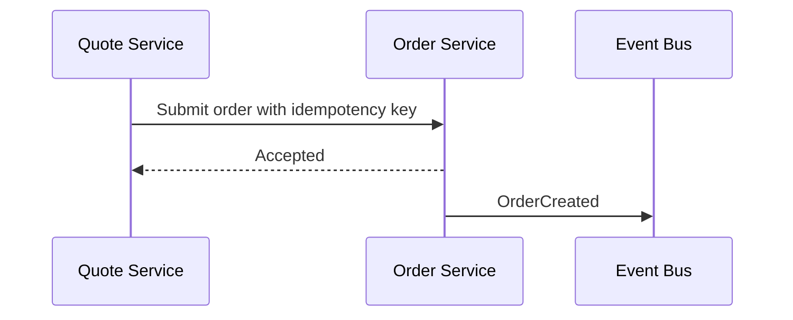

# Part 032 — Pull Request Communication, Design Review, ADRs, and Durable Async Notes

## Positioning

Kolaborasi teknis yang matang tidak bergantung pada meeting panjang atau pengetahuan yang hanya tersimpan di kepala senior engineer.

Ia menggunakan artifacts yang cukup ringan untuk:

- memperjelas intent;
- mengekspos risk;
- mempercepat review;
- mendokumentasikan keputusan;
- dan membantu orang lain melanjutkan pekerjaan tanpa mengulang discovery.

> **Core thesis:** technical communication yang efektif adalah context-rich, decision-oriented, durable, dan proportional terhadap risk.

---

## 1. Technical Collaboration Surfaces

Common surfaces:

- Pull Request;
- design note;
- Architecture Decision Record;
- Request for Comments;
- issue or backlog comment;
- chat summary;
- incident timeline;
- runbook;
- and code documentation.

Each serves a different purpose.

---

## 2. Match Artifact to Decision

Use:

### PR

For implementation review.

### Design note

For solution exploration before or during implementation.

### ADR

For durable architectural decision.

### RFC

For broader cross-team proposal.

### Ticket note

For scope, acceptance, and delivery context.

### Chat

For fast coordination, followed by durable summary when needed.

---

## 3. Proportional Documentation

Documentation depth should reflect:

- reversibility;
- blast radius;
- cross-team impact;
- security;
- data;
- migration;
- and expected lifetime.

Low-risk reversible change needs little ceremony.

High-risk irreversible change needs stronger record.

---

## 4. Technical Writing Principles

Good technical notes are:

- concise;
- specific;
- scoped;
- evidence-based;
- and action-oriented.

Avoid:

- history dumps;
- unexplained jargon;
- vague recommendations;
- and excessive context without decision.

---

## 5. Context First

Start with:

```text
Problem:
Why now:
Affected users/systems:
Constraints:
Decision needed:
```

Do not start with implementation details before explaining why they matter.

---

## 6. Pull Request as Collaboration

A PR is not only a merge gate.

It should help reviewers understand:

- intent;
- behavior;
- risk;
- evidence;
- and rollout.

---

## 7. PR Description Template

```md
## Context

Why this change exists.

## Scope

Included and excluded.

## Approach

How the change works.

## Risks

Compatibility, migration, security, performance, operations.

## Evidence

Tests, screenshots, traces, contract results.

## Rollout

Flag, migration, deployment order, rollback.

## Review Focus

What reviewers should inspect carefully.
```

---

## 8. Review Focus

A review request should guide attention.

Example:

> Please focus on idempotency behavior after ambiguous timeout and on backward compatibility of the event payload.

This is better than:

> Please review.

---

## 9. PR Size and Communication

Smaller PRs improve:

- comprehension;
- review quality;
- and feedback speed.

But every PR still needs enough context.

A tiny diff can have large blast radius.

---

## 10. Diff Size versus Risk

Do not equate few lines with low risk.

Examples:

- authorization condition;
- pricing formula;
- migration script;
- retry policy;
- feature flag default.

Risk should determine review depth.

---

## 11. Self-Review

Before requesting review:

- inspect diff;
- remove debug noise;
- explain non-obvious decisions;
- verify tests;
- and confirm generated files.

A reviewer should not be the first person to read the complete change.

---

## 12. PR Evidence

Evidence can include:

- automated test;
- contract result;
- before/after behavior;
- trace;
- screenshot;
- migration dry run;
- performance result;
- and rollback verification.

Do not say only:

> Tests pass.

State which behavior is proven.

---

## 13. PR Risk Section

A useful section:

```text
Risk:
Affected path:
Containment:
Rollback:
Residual risk:
```

Especially important for:

- production behavior;
- migration;
- event schema;
- security;
- and state transitions.

---

## 14. PR Rollout Section

Include:

- deployment order;
- feature flag;
- configuration;
- target tenant;
- observation window;
- and rollback/roll-forward.

Implementation review should not ignore release behavior.

---

## 15. PR Review Comment Taxonomy

Use labels:

- **blocking**
- **important**
- **suggestion**
- **question**
- **nit**

This clarifies response expectations.

---

## 16. Blocking Comments

Blocking comments should relate to:

- correctness;
- security;
- data integrity;
- compatibility;
- material maintainability;
- or agreed standard.

Do not block on personal preference.

---

## 17. Review Questions

A question can uncover hidden assumption.

Example:

> What happens if the downstream call succeeds but the response times out?

Questions should not be disguised commands.

---

## 18. Suggestion versus Requirement

Reviewer:

> Suggestion: extract this helper if we expect another rule variant. Not blocking for the current slice.

This preserves flow while recording improvement.

---

## 19. Review Tone

Use:

- behavior;
- consequence;
- and rationale.

Avoid:

- “obviously”;
- “wrong” without explanation;
- sarcasm;
- and identity-based judgment.

Weak:

> This is bad.

Stronger:

> This path can publish two events after retry because the idempotency boundary is inside the transaction.

---

## 20. Reviewer Responsibility

Reviewers should:

- respond within working agreement;
- inspect system impact;
- distinguish blocking from preference;
- and explain reasoning.

Approval without inspection is not collaboration.

---

## 21. Author Responsibility

Authors should:

- answer clearly;
- update code or explain trade-off;
- resolve discussion accurately;
- and summarize material decision.

Avoid silent resolution of important comments.

---

## 22. Disagreement in PR

When disagreement persists:

1. restate the problem;
2. identify constraint;
3. compare options;
4. involve decision owner;
5. use a short sync if cheaper;
6. record the result.

Do not debate indefinitely in comments.

---

## 23. Move to Sync, Return to Async

Use sync for high-bandwidth resolution.

Afterward, write:

```text
Decision:
Rationale:
Trade-off:
Follow-up:
```

This preserves durable context.

---

## 24. Review Latency

PR communication affects latency.

Improve with:

- clear description;
- review focus;
- small coherent change;
- named reviewers;
- and explicit urgency.

Avoid tagging many reviewers without ownership.

---

## 25. Design Review Purpose

Design review should:

- test assumptions;
- compare options;
- identify risk;
- and improve decision quality.

It should not exist only to gain senior approval.

---

## 26. When Design Review Is Needed

Useful when:

- change crosses boundaries;
- migration is involved;
- data ownership changes;
- security impact exists;
- behavior is hard to reverse;
- or architecture options materially differ.

Not every refactor needs a formal review.

---

## 27. Lightweight Design Note

```md
## Problem

## Context

## Constraints

## Goals

## Non-Goals

## Options

## Recommendation

## Risks

## Rollout

## Open Questions
```

---

## 28. Problem Statement

A good problem statement avoids solution.

Weak:

> We need Kafka.

Stronger:

> Quote state changes must be delivered asynchronously to multiple consumers without coupling the request path to their availability.

---

## 29. Goals and Non-Goals

### Goals

What the design must achieve.

### Non-goals

What is intentionally excluded.

Non-goals prevent scope drift.

---

## 30. Constraints

Examples:

- backward compatibility;
- tenant isolation;
- latency;
- existing vendor;
- release window;
- and operational skill.

A constraint should be real, not inherited assumption without review.

---

## 31. Option Analysis

For each option:

```text
Description:
Benefits:
Costs:
Risks:
Reversibility:
Operational impact:
Migration impact:
```

Avoid presenting only one “option”.

---

## 32. Recommendation

The author should recommend a path.

Do not dump options and force reviewers to reconstruct judgment.

A recommendation should include:

- why;
- trade-off;
- and residual risk.

---

## 33. Design Review Questions

Reviewers should ask:

- What problem is solved?
- What assumption is untested?
- What breaks?
- How is failure detected?
- How is rollout controlled?
- How is rollback handled?
- What remains compatible?
- Who owns operations?
- What is the simplest adequate option?

---

## 34. Architecture Decision Record

ADR captures a durable decision.

Typical structure:

```md
# Title

## Status

Proposed / Accepted / Superseded / Deprecated.

## Context

## Decision

## Consequences

## Alternatives Considered

## Follow-Up
```

---

## 35. ADR Scope

Use ADR for decisions that are:

- architecturally significant;
- long-lived;
- cross-cutting;
- or costly to reverse.

Do not create ADR for every class or library choice.

---

## 36. ADR Consequences

Consequences should include:

- positive;
- negative;
- operational;
- migration;
- and future constraints.

Avoid decision records that only celebrate benefits.

---

## 37. ADR Status Lifecycle

Possible statuses:

- proposed;
- accepted;
- rejected;
- superseded;
- deprecated.

Link replacement decisions.

Do not edit history silently.

---

## 38. RFC

RFC is useful for broader collaboration.

It may include:

- multiple teams;
- platform capability;
- public contract;
- or organization-wide standard.

RFC needs:

- review window;
- decision owner;
- and status.

---

## 39. RFC Anti-Pattern

- no decision deadline;
- unlimited comments;
- no owner;
- and no final outcome.

An RFC is not an eternal discussion document.

---

## 40. Concise Technical Notes

A concise note can be:

```text
Context:
Observation:
Impact:
Decision:
Follow-up:
```

This is often enough for a ticket or chat summary.

---

## 41. Async Investigation Note

```md
## Symptom

## Evidence

## Hypotheses

## Tests Performed

## Current Conclusion

## Next Step

## Owner
```

Useful for remote debugging and handoff.

---

## 42. Handoff Note

```text
Current state:
What changed:
Evidence:
Open question:
Suggested next action:
Owner:
Links:
```

Avoid “please continue” without context.

---

## 43. Decision Summary

After a meeting:

```text
Decision:
Why:
Rejected alternatives:
Risks:
Owner:
Review trigger:
```

Send promptly while context is fresh.

---

## 44. Meeting Notes

Good meeting notes capture:

- decisions;
- actions;
- owners;
- deadlines;
- and unresolved questions.

Do not transcribe every sentence.

---

## 45. Runbook Notes

Runbook should be action-oriented.

Include:

- trigger;
- diagnosis;
- safe action;
- validation;
- rollback;
- escalation;
- and ownership.

Avoid explanatory prose without executable steps.

---

## 46. Code Comments

Code comments should explain:

- why;
- invariant;
- constraint;
- or non-obvious trade-off.

Do not restate obvious code.

---

## 47. Commit Messages

Useful commit messages explain:

- intent;
- behavior;
- and context.

Example:

```text
Prevent duplicate order creation after ambiguous retry

Moves idempotency boundary before downstream invocation and records the submission key for replay-safe retries.
```

---

## 48. Ticket Comments

Use ticket comments for:

- scope clarification;
- acceptance decision;
- blocker;
- risk;
- and status change.

Do not hide architecture decisions only in ticket comments if they need durable reuse.

---

## 49. Chat Decisions

Chat is good for speed.

But important decisions should be copied into:

- ADR;
- ticket;
- risk register;
- or design note.

Chat history is not a reliable knowledge architecture.

---

## 50. Link Hygiene

Artifacts should link:

- backlog item;
- PR;
- design note;
- ADR;
- test evidence;
- deployment;
- and incident.

Traceability reduces rediscovery.

Avoid circular links with no clear source of truth.

---

## 51. Single Source of Truth

Define where each type of truth lives.

Example:

- scope in backlog;
- code change in PR;
- architecture decision in ADR;
- production behavior in runbook/dashboard;
- incident timeline in incident record.

---

## 52. Knowledge Half-Life

Technical notes become stale.

Include:

- owner;
- last reviewed;
- version;
- and superseded link.

Not all notes need permanent maintenance.

---

## 53. Temporary versus Durable Notes

### Temporary

- scratch investigation;
- meeting preparation;
- transient debugging.

### Durable

- architecture decision;
- operational procedure;
- public contract;
- or policy.

Choose effort accordingly.

---

## 54. Documentation Debt

Documentation debt occurs when:

- decisions not recorded;
- runbook stale;
- ownership unclear;
- and onboarding depends on oral history.

It creates:

- delay;
- mistakes;
- and knowledge bottleneck.

---

## 55. Overdocumentation

Too much documentation creates:

- review burden;
- stale detail;
- and slow decisions.

Prefer:

- concise;
- linked;
- and maintained artifacts.

---

## 56. Design by Document Anti-Pattern

A long design document does not guarantee good design.

Evidence should include:

- prototype;
- contract test;
- performance test;
- or thin implementation

when uncertainty requires it.

---

## 57. Diagram Use

Use diagrams when relationships matter.

Examples:

- sequence;
- state;
- dependency;
- deployment;
- and data flow.

Avoid decorative diagrams with no decision value.

---

## 58. Mermaid Example



A diagram should be supported by text explaining risk and behavior.

---

## 59. State Diagram Use

Useful for:

- lifecycle;
- invalid transitions;
- retries;
- and recovery.

State diagrams often reveal ambiguity earlier than prose.

---

## 60. Decision Table Use

Useful for:

- business rules;
- compatibility;
- authorization;
- and rollout combinations.

Do not force a diagram when a table is clearer.

---

## 61. Review Checklist for Design Notes

- Problem clear?
- Constraints real?
- Goals and non-goals clear?
- Multiple options?
- Recommendation explicit?
- Failure modes considered?
- Migration included?
- Observability included?
- Rollout included?
- Owner and decision date clear?

---

## 62. Review Checklist for PRs

- Intent clear?
- Scope coherent?
- Risk stated?
- Tests prove behavior?
- Compatibility considered?
- Security considered?
- Observability included?
- Rollout and rollback clear?
- Follow-up captured?

---

## 63. Security-Sensitive Notes

Do not place sensitive details broadly.

Use controlled storage for:

- exploit path;
- credentials;
- customer data;
- and security incident evidence.

The public record can still contain high-level decision and remediation status.

---

## 64. Customer-Specific Notes

Avoid leaking:

- confidential contract;
- production data;
- or customer configuration

into broad repositories.

Use references and access controls.

---

## 65. Remote Collaboration

Remote teams benefit from:

- pre-reads;
- async comments;
- written decisions;
- clear owners;
- and timezone handoffs.

A good note lets another engineer continue without waiting for the author to wake up.

---

## 66. Async Review Window

For design review:

- set start;
- deadline;
- decision owner;
- and response expectation.

Avoid open-ended “comments welcome”.

---

## 67. Silent Review

Silent initial review reduces anchoring.

Process:

1. distribute note;
2. participants comment independently;
3. group discusses high-value disagreements;
4. decision owner closes.

---

## 68. Technical Workshop

Use workshop when:

- domain is complex;
- multiple perspectives needed;
- or options cannot be resolved async.

Workshop output must still be durable.

---

## 69. Pair Design

Pair design can be efficient for:

- focused problem;
- unfamiliar area;
- and rapid feedback.

It should not exclude affected stakeholders from later review.

---

## 70. Senior Engineer in PR Collaboration

Senior engineer should:

- review system consequence;
- explain rationale;
- avoid preference blocking;
- coach;
- and distribute review capability.

Do not become the permanent merge gate.

---

## 71. Senior Engineer in Design Review

Senior engineer should:

- challenge assumptions;
- ask failure questions;
- expose trade-offs;
- and help choose the simplest adequate design.

Avoid turning review into architecture lecture.

---

## 72. Senior Engineer as Author

A senior author should:

- make context easy;
- state uncertainty;
- show alternatives;
- recommend;
- and document consequence.

Seniority should reduce reviewer effort, not increase document size unnecessarily.

---

## 73. Senior Engineer as Reviewer

Good reviewer behavior:

- asks before assuming;
- distinguishes correctness from preference;
- explains system impact;
- and helps unblock.

---

## 74. Mentoring through Reviews

Use comments that teach reasoning.

Example:

> This retry path needs an idempotency boundary because a downstream success can be followed by a client timeout. Without it, the caller may repeat a side effect.

This transfers mental model.

---

## 75. Avoiding Review Dependency

Build distributed capability through:

- review rotation;
- pairing;
- module walkthroughs;
- checklists;
- and ownership maps.

---

## 76. Difficult Review Conversation

Use:

```text
Shared goal:
Observed risk:
Evidence:
Options:
Recommendation:
Decision owner:
```

Avoid escalating style preferences.

---

## 77. “Looks Good to Me” Risk

Approval without substantive inspection can signal:

- unclear review focus;
- overload;
- lack of expertise;
- or ceremonial review.

Track outcomes, not comment count.

---

## 78. Review Fatigue

Review fatigue arises from:

- large PRs;
- too many reviewers;
- poor descriptions;
- and repeated low-value checks.

Automate what is mechanical.

Reserve human attention for reasoning.

---

## 79. Automation in Collaboration

Automate:

- formatting;
- linting;
- static analysis;
- contract validation;
- and dependency checks.

Do not ask humans to repeatedly enforce machine-checkable rules.

---

## 80. AI-Assisted Notes and Reviews

AI-generated technical content can help with:

- summarization;
- checklist generation;
- and draft structure.

But human reviewers must verify:

- correctness;
- security;
- context;
- and decision validity.

Do not treat generated explanation as evidence.

---

## 81. Technical Note Anti-Patterns

### No problem statement

Solution appears arbitrary.

### One-option design

No trade-off.

### Decision hidden at end

Review inefficient.

### No non-goals

Scope grows.

### No failure behavior

Happy-path architecture.

### No rollout

Implementation treated as completion.

### No owner or date

Decision stalls.

### Meeting-only decision

Knowledge disappears.

---

## 82. PR Anti-Patterns

### Empty description

Reviewer reconstructs context.

### Giant mixed change

High cognitive load.

### “Tests pass”

No behavior evidence.

### Style wars

Flow blocked by preference.

### Silent important resolution

No rationale.

### Too many reviewers

No ownership.

### Senior approval required for everything

Bottleneck.

---

## 83. Documentation Anti-Patterns

### Wiki graveyard

Stale and unowned.

### Duplicate truth

Conflicting sources.

### Screenshot-only knowledge

Not searchable or maintainable.

### Chat-only decisions

Context lost.

### Excessive detail

No one reads.

### No deprecation

Old guidance remains active.

---

## 84. Worked Example: Idempotency Design Note

### Problem

Ambiguous timeout allows duplicate order creation.

### Options

1. Caller-generated idempotency key.
2. Downstream duplicate detection.
3. Disable retries.
4. Distributed lock.

### Recommendation

Caller-generated key persisted before invocation.

### Risks

- key lifecycle;
- replay retention;
- legacy callers.

### Rollout

- optional header;
- pilot;
- metric;
- then required behavior.

### ADR

Record the idempotency boundary and retention decision.

---

## 85. Worked Example: Event Contract PR

### PR focus

- additive field;
- enum compatibility;
- legacy consumer behavior;
- producer flag.

### Evidence

- provider unit tests;
- consumer contract tests;
- replay test;
- trace.

### Review note

> Blocking: the new enum is serialized for all tenants even when the flag is off. This can break legacy consumers. Recommend preserving old value until tenant enablement.

---

## 86. Worked Example: Migration Note

### Context

Move approval metadata to a new schema.

### Required sections

- source and target;
- sample profile;
- validation query;
- mismatch handling;
- rollback;
- decommission;
- owner.

### Decision

Use expand-migrate-contract instead of one-step replacement.

---

## 87. Worked Example: Remote Handoff

```text
Current state:
Contract change merged and deployed to test.

Evidence:
Provider tests pass; legacy consumer replay fails on one enum.

Open question:
Should producer map the new enum to UNKNOWN for legacy tenants?

Suggested next action:
Product and Order Team decision before enabling the pilot.

Owner:
Nadia.

Links:
PR, contract result, decision note.
```

---

## 88. PR Template

```md
## Why

## What Changed

## What Did Not Change

## Risk

## Evidence

## Rollout and Rollback

## Review Focus

## Follow-Up
```

---

## 89. Design Note Template

```md
## Problem

## Context

## Constraints

## Goals

## Non-Goals

## Options

## Recommendation

## Consequences

## Failure Modes

## Migration and Rollout

## Observability

## Open Questions

## Decision Owner and Date
```

---

## 90. ADR Template

```md
# ADR-NNN: Title

## Status

## Context

## Decision

## Consequences

## Alternatives Considered

## Migration

## Review Trigger
```

---

## 91. Async Investigation Template

```md
## Symptom

## Impact

## Evidence

## Hypotheses

## Tests Performed

## Current Conclusion

## Unknowns

## Next Action

## Owner
```

---

## 92. Meeting Decision Summary Template

```md
## Decision

## Rationale

## Assumptions

## Rejected Alternatives

## Residual Risk

## Actions

## Owners and Dates
```

---

## 93. Internal Verification Checklist

### PR practice

- Is a PR template used?
- What review response time exists?
- Are blocking comments labeled?
- Who can approve?
- Is senior approval mandatory?

### Design review

- What changes require design review?
- Is a lightweight template available?
- Who owns decisions?
- Are async reviews used?
- What is the review deadline?

### ADR and RFC

- Where are ADRs stored?
- How are statuses managed?
- What requires RFC?
- How are superseded decisions linked?
- Are customer-specific details controlled?

### Documentation

- What is the source of truth?
- Who owns runbooks?
- How is staleness detected?
- Are decision summaries written after meetings?
- How are chat decisions preserved?

### Remote collaboration

- Is there a handoff template?
- Are pre-reads expected?
- What overlap hours exist?
- How are unresolved comments escalated?

---

## 94. Practical Exercises

### Exercise 1 — PR rewrite

Take one weak PR description and rewrite it with context, risk, evidence, and review focus.

### Exercise 2 — Comment classification

Classify review comments as blocking, important, suggestion, question, or nit.

### Exercise 3 — Design note

Write a lightweight design note for one cross-service change.

### Exercise 4 — ADR

Capture one existing architectural decision and its consequences.

### Exercise 5 — Meeting summary

Convert verbose meeting notes into decision, rationale, actions, and owners.

### Exercise 6 — Handoff

Write a timezone-safe technical handoff.

---

## 95. Part Completion Checklist

You are done if you can:

- choose the right collaboration artifact;
- write concise PR descriptions;
- provide behavior and risk evidence;
- distinguish blocking issues from preference;
- conduct proportional design review;
- write ADRs and RFCs;
- create durable async notes;
- and collaborate remotely without losing context.

---

## 96. Key Takeaways

1. Technical collaboration needs durable context.
2. Match artifact to decision.
3. Documentation depth should match risk.
4. PRs should explain intent, evidence, and rollout.
5. Review comments need severity and rationale.
6. Design reviews should compare options.
7. ADRs capture durable consequences.
8. Chat is not a long-term source of truth.
9. Senior engineers should distribute review capability.
10. Internal collaboration and documentation norms must be verified.

---

## 97. References

Conceptual baseline:

- General pull-request review, design-review, ADR, RFC, and technical-writing practices.
- Continuous delivery, architecture decision, and asynchronous collaboration concepts.
- Scrum transparency, self-management, and cross-functional collaboration principles.

These concepts do not describe internal CSG processes.
