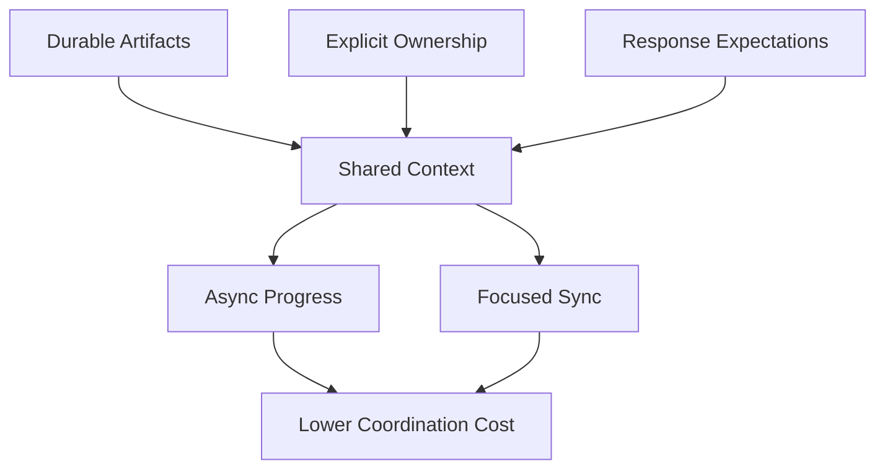

# Part 033 — Async Defaults, Time-Zone Coordination, Focus Time, and Meeting Discipline

## Positioning

Remote-first bukan sekadar bekerja dari lokasi berbeda.

Remote-first adalah desain sistem kerja yang mengasumsikan:

- orang tidak selalu online pada waktu yang sama;
- keputusan harus dapat ditemukan kembali;
- context tidak boleh hanya hidup dalam meeting;
- dan komunikasi harus mempertimbangkan fokus, timezone, serta latency.

> **Core thesis:** remote work yang sehat tidak menghilangkan komunikasi; ia memilih media, timing, dan level sinkronisasi yang paling murah untuk menghasilkan keputusan yang jelas.

---

## 1. Remote-First versus Remote-Friendly

### Remote-friendly

Remote participant dapat mengikuti proses yang sebenarnya dirancang untuk orang yang hadir secara langsung.

### Remote-first

Proses dirancang agar:

- informasi tersedia secara digital;
- keputusan terdokumentasi;
- async participation mungkin;
- dan tidak ada second-class participant.

Remote-first tetap dapat memiliki meeting.

Perbedaannya adalah meeting bukan satu-satunya tempat truth berada.

---

## 2. Core Remote-First Principles

1. Write before meeting.
2. Default to durable context.
3. Use sync for ambiguity, conflict, and rapid convergence.
4. Respect focus time.
5. Make ownership and deadlines explicit.
6. Design for timezone delay.
7. Summarize decisions after sync.
8. Minimize coordination tax.
9. Separate urgency from impatience.
10. Treat communication quality as part of delivery quality.

---

## 3. Communication Mode Selection

Choose among:

- async text;
- async document review;
- recorded walkthrough;
- chat;
- call;
- workshop;
- pair session;
- and incident channel.

Use the cheapest mode that can resolve the problem.

---

## 4. Media Selection Matrix

| Situation | Default Mode |
|---|---|
| Routine status | Async update |
| Simple clarification | Chat or comment |
| Durable decision | Decision note / ADR |
| Complex trade-off | Pre-read + sync |
| Sensitive conflict | Direct sync |
| Incident | Real-time incident channel |
| Design proposal | Async review + focused workshop |
| Knowledge transfer | Recorded walkthrough + Q&A |
| Quick pairing | Video/screen-share session |

---

## 5. Async-First

Async-first means information can be consumed later without losing essential context.

It does not mean:

- no meetings;
- no quick calls;
- or long documents for everything.

Use async when:

- topic is informational;
- input benefits from reflection;
- timezone overlap is limited;
- and decision is not urgent.

---

## 6. When Sync Is Better

Use synchronous communication when:

- conflict is escalating;
- ambiguity is high;
- rapid back-and-forth is cheaper;
- emotional nuance matters;
- incident is active;
- or multiple constraints need immediate convergence.

A useful heuristic:

> If five async exchanges still do not reduce uncertainty, switch mode.

---

## 7. Write Before Meeting

A pre-read should answer:

```text
Context:
Problem:
Evidence:
Options:
Recommendation:
Decision needed:
```

Benefits:

- participants arrive informed;
- intro time decreases;
- quieter voices can prepare;
- and decision quality improves.

---

## 8. Durable Context

Durable context means future participants can reconstruct:

- what happened;
- what was decided;
- why;
- and what remains.

Possible artifacts:

- ticket;
- ADR;
- decision log;
- meeting summary;
- runbook;
- risk register;
- and retrospective action.

---

## 9. Chat Is Not a Knowledge Base

Chat is excellent for:

- coordination;
- questions;
- and rapid updates.

It is weak for:

- long-term decision history;
- source of truth;
- and discoverability.

Important chat outcomes should move to durable artifacts.

---

## 10. Async Status Update

A concise format:

```text
Goal:
Current state:
Completed evidence:
Risk/blocker:
Decision/help needed:
Next checkpoint:
```

Avoid:

- long diary;
- every task detail;
- no clear ask;
- and updates copied into multiple channels.

---

## 11. Response Expectations

Remote teams need explicit expectations.

Example:

- urgent incident: immediate through on-call path;
- active Sprint blocker: within overlap window;
- PR review: within one working day;
- design review: within stated review period;
- routine message: no immediate response expected.

Without this, every notification feels urgent.

---

## 12. Urgency Channels

Define channels by urgency.

### Emergency

Incident or security path.

### Time-sensitive

Direct mention with deadline and impact.

### Normal

Team channel, ticket, or document.

### Informational

Broadcast or digest.

Avoid using direct message for every request.

---

## 13. Time-Zone Awareness

Timezone coordination must consider:

- local working hours;
- public holidays;
- daylight changes;
- recurring overlap;
- and handoff latency.

Do not treat total distributed hours as fully interchangeable capacity.

---

## 14. Overlap Window

An overlap window is shared time reserved for:

- Daily Scrum;
- pairing;
- decisions;
- and high-bandwidth collaboration.

Protect it from low-value recurring meetings.

---

## 15. Follow-the-Sun Work

Follow-the-sun can accelerate flow if handoffs are strong.

It can also create:

- incomplete context;
- overnight blocker;
- and ownership ambiguity.

A successful follow-the-sun model needs:

- clear handoff;
- next action;
- evidence;
- and responsible owner.

---

## 16. Time-Zone Handoff Template

```md
## Goal

## Current State

## What Changed

## Evidence

## Open Risk

## Decision Needed

## Suggested Next Action

## Owner

## Relevant Links
```

---

## 17. Handoff Quality

Good handoff:

- explains state;
- makes unknowns visible;
- and avoids forcing the next person to rediscover history.

Bad handoff:

> Please continue debugging.

---

## 18. Waiting-Time Design

For async systems, design what happens while waiting.

Examples:

- parallel safe work;
- fallback;
- clarification checklist;
- alternate reviewer;
- or escalation trigger.

Do not start unrelated WIP merely because someone is offline.

---

## 19. Decision Latency across Time Zones

Decision latency rises when:

- authority is in one timezone;
- context is incomplete;
- no deadline exists;
- or options are not prepared.

Reduce it by:

- pre-writing options;
- naming decision owner;
- setting latest responsible date;
- and defining default if no response.

---

## 20. Default Decision

For reversible low-risk decisions, a default can prevent waiting.

Example:

> Unless objections are raised before Thursday 15:00 Jakarta time, we will use the additive event field and retain the old enum mapping for legacy tenants.

Use carefully.

Do not use silence as approval for high-risk or irreversible decisions.

---

## 21. Meeting as an Expensive Tool

Meeting cost includes:

- participant time;
- context switching;
- scheduling delay;
- preparation;
- and loss of focus.

A 60-minute meeting with eight people consumes more than eight hours when transition cost is included.

---

## 22. Meeting Purpose

A meeting should primarily exist to:

- decide;
- solve;
- coordinate;
- or create shared understanding.

Information broadcast is usually async.

---

## 23. Meeting Invitation Quality

A good invitation contains:

```text
Purpose:
Expected outcome:
Decision owner:
Required participants:
Optional participants:
Pre-read:
Preparation:
```

If no outcome exists, question whether the meeting is needed.

---

## 24. Required versus Optional Participants

Required participants:

- own information;
- own decision;
- or are necessary for execution.

Optional participants:

- benefit from awareness;
- can read summary;
- or may contribute but are not required.

Do not use attendance as a proxy for inclusion.

---

## 25. Meeting Agenda

A decision-oriented agenda:

```text
1. Restate decision.
2. Confirm evidence and constraints.
3. Discuss unresolved differences.
4. Compare options.
5. Decide.
6. Assign actions.
```

Avoid round-robin status unless that is the explicit purpose.

---

## 26. Timeboxing

Use timeboxes for:

- each agenda item;
- discussion;
- and decision.

If no convergence occurs:

- identify missing evidence;
- assign owner;
- and schedule decision checkpoint.

Do not extend indefinitely by default.

---

## 27. Meeting Facilitation

The facilitator should:

- state goal;
- manage time;
- invite quieter voices;
- surface disagreement;
- prevent tangent;
- and close with decisions and actions.

Facilitator does not need to be the decision owner.

---

## 28. Meeting Notes

Capture:

- decisions;
- actions;
- owners;
- deadlines;
- unresolved questions;
- and relevant links.

Do not transcribe everything.

---

## 29. Decision Summary

After meeting:

```text
Decision:
Rationale:
Assumptions:
Residual risk:
Actions:
Owners:
Review trigger:
```

Send promptly.

---

## 30. Meeting Hygiene Rules

Possible working agreement:

- pre-read at least one working day before;
- no agenda, no meeting;
- start and end on time;
- optional means optional;
- decisions documented;
- cameras not mandatory unless context requires;
- and recurring meetings reviewed periodically.

---

## 31. Recurring Meeting Audit

For every recurring meeting, ask:

- What outcome does it produce?
- Is attendance still correct?
- Can frequency reduce?
- Can part become async?
- Is there duplicate forum?
- What would happen if cancelled?

---

## 32. Meeting Debt

Meeting debt occurs when recurring meetings persist after their original need ends.

Symptoms:

- no clear owner;
- no decisions;
- habitual attendance;
- duplicated status;
- and frequent multitasking.

---

## 33. Focus Time

Senior engineers need uninterrupted time for:

- deep debugging;
- design;
- code;
- and writing.

Protect focus with:

- calendar blocks;
- meeting clusters;
- async status;
- and no-notification windows.

---

## 34. Maker versus Manager Schedule

Deep technical work benefits from longer blocks.

Fragmenting a day into many short meetings can destroy effective engineering capacity.

Planning should consider this, not just total calendar availability.

---

## 35. Meeting Clustering

Cluster meetings into overlap windows where possible.

Benefits:

- larger focus blocks;
- predictable collaboration;
- and reduced context switching.

Risk:

- long meeting fatigue.

Balance duration and breaks.

---

## 36. No-Meeting Blocks

No-meeting blocks can protect:

- individual focus;
- team pairing;
- and asynchronous work.

They should not prevent urgent coordination.

---

## 37. Notification Hygiene

Possible rules:

- mute non-urgent channels;
- use mentions intentionally;
- avoid after-hours expectation;
- and use delayed send when appropriate.

Notification volume is a system issue, not only personal discipline.

---

## 38. Presence versus Availability

Online status does not always mean available.

Use explicit states:

- focus;
- available for pairing;
- on-call;
- away;
- or offline.

Do not expect immediate response from a green indicator alone.

---

## 39. After-Hours Communication

Remote/global teams must distinguish:

- sender convenience;
- recipient obligation.

A message sent after hours should not imply immediate response unless using the emergency path.

---

## 40. Public Holidays and Local Context

Capacity and response expectations should account for:

- local holidays;
- religious observance;
- family commitments;
- and regional disruptions.

Remote-first systems should not assume one country's calendar.

---

## 41. Inclusion in Remote Meetings

Inclusion practices:

- share pre-read;
- use chat and verbal input;
- invite silent writing;
- avoid interrupting;
- clarify acronyms;
- and document outcomes.

Remote inclusion is more than enabling video.

---

## 42. Camera Policy

Cameras can help social connection.

Mandatory camera policies may create:

- fatigue;
- bandwidth issues;
- privacy concerns;
- and exclusion.

Use context-based expectations.

---

## 43. Language and Accent Inclusion

For global teams:

- speak clearly;
- avoid idioms;
- define acronyms;
- pause;
- use written summary;
- and allow async clarification.

Do not equate fluency speed with expertise.

---

## 44. Silent Writing

Silent writing at the beginning of discussion can:

- reduce anchoring;
- include introverts;
- and improve idea diversity.

Useful for:

- retrospectives;
- design review;
- and option generation.

---

## 45. Polling and Decision Quality

Polls can collect preference.

They do not replace:

- authority;
- evidence;
- or decision rationale.

Use polling as input, not automatic governance.

---

## 46. Recording Meetings

Recording may help:

- absent participants;
- knowledge transfer;
- and workshop replay.

Risks:

- privacy;
- low discoverability;
- and false assumption that everyone will watch.

Always provide a written summary.

---

## 47. Recorded Walkthrough

A short recorded walkthrough is useful for:

- demo;
- design explanation;
- environment setup;
- and onboarding.

Keep it:

- focused;
- titled;
- indexed;
- and linked to durable notes.

---

## 48. Meeting-Free Status

Replace status meeting with:

- board updates;
- async goal summary;
- risk list;
- and explicit questions.

Do not simply remove the meeting without improving information quality.

---

## 49. Remote Daily Scrum

Possible model:

- async update before overlap;
- 10-minute sync for risk and decisions;
- follow-up huddles only for relevant people.

Avoid repeating written updates verbally.

---

## 50. Remote Refinement

Use:

- pre-read;
- async questions;
- examples;
- decision owner;
- and focused session for unresolved items.

---

## 51. Remote Sprint Planning

Preparation:

- availability;
- capacity;
- top backlog context;
- dependency readiness;
- and candidate Sprint Goal.

The meeting should focus on alignment and forecast.

---

## 52. Remote Sprint Review

Use:

- clear product narrative;
- realistic demo;
- shared feedback board;
- and explicit decisions.

Avoid passive webinar format.

---

## 53. Remote Retrospective

Use:

- silent or anonymous input;
- safe facilitation;
- clear action;
- and prior-action review.

Watch for low-energy participation caused by fatigue rather than lack of care.

---

## 54. Async Design Review

A strong pattern:

1. publish note;
2. define review deadline;
3. reviewers comment independently;
4. author summarizes disagreement;
5. sync only unresolved decisions;
6. record outcome.

---

## 55. Async PR Review

Good async review requires:

- context;
- review focus;
- reasonable response expectation;
- and clear comment severity.

Timezone can extend latency, so smaller PRs matter even more.

---

## 56. Async Incident Handoff

For long-running incidents:

- current impact;
- active hypotheses;
- actions completed;
- unsafe actions to avoid;
- next decision;
- and role transfer.

A verbal-only handoff is risky.

---

## 57. Remote Conflict

Do not resolve escalating relationship conflict through long chat threads.

Switch to direct conversation.

Then summarize:

- shared understanding;
- decision;
- and follow-up.

---

## 58. Async Misinterpretation

Text can lose:

- tone;
- urgency;
- and nuance.

Use explicit labels:

- blocking;
- suggestion;
- question;
- informational;
- and urgent.

---

## 59. Overcommunication

Remote teams may compensate by:

- too many messages;
- duplicate updates;
- and excessive meetings.

The goal is not maximum communication.

The goal is sufficient shared understanding at minimum coordination cost.

---

## 60. Undercommunication

Symptoms:

- silent blockers;
- decisions hidden;
- context only in one timezone;
- and repeated rediscovery.

Balance is achieved through explicit norms.

---

## 61. Remote Work Metrics

Useful system measures:

- meeting hours;
- focus-block availability;
- decision latency;
- blocker response time;
- PR review latency;
- and after-hours interruptions.

Do not measure:

- online time;
- message count;
- or camera usage as productivity.

---

## 62. Communication Health Survey

Qualitative questions:

- Can you find decisions?
- Do meetings have clear outcomes?
- Can you get focus time?
- Are response expectations clear?
- Do timezones create recurring blockers?
- Is it safe to be offline?

---

## 63. Remote Burnout Signals

- constant notifications;
- meeting-heavy days;
- after-hours responses;
- no focus time;
- and camera fatigue.

Sustainable pace is a delivery concern.

---

## 64. Boundary Setting

Healthy team norms:

- no response expectation outside hours;
- urgent path clearly defined;
- calendar availability respected;
- and leave status visible.

Senior engineers should model these boundaries.

---

## 65. Remote-First Architecture of Work

A useful model:



---

## 66. Meeting Anti-Patterns

### No-agenda meeting

Purpose unclear.

### Status round-robin

No adaptation.

### Decision without owner

No closure.

### Optional-but-not-really

Social pressure.

### Meeting as documentation

Absent people lose context.

### Recurring forever

No audit.

### Too many participants

Low participation and high cost.

### Meeting to read document

Preparation failure.

---

## 67. Async Anti-Patterns

### Wall of text

No scanability.

### Hidden question

No response.

### No deadline

Decision stalls.

### Too many channels

Truth fragments.

### Silence as approval for high risk

Unsafe.

### Chat-only decision

No durable record.

### Immediate-response culture

Async becomes pseudo-sync.

---

## 68. Time-Zone Anti-Patterns

### One timezone dominates

Others attend outside normal hours.

### Rotating inconvenience absent

Same people always sacrifice.

### Handoff without ownership

Work stalls.

### Holiday blindness

Capacity misplanned.

### Green-dot expectation

Boundaries ignored.

---

## 69. Senior Engineer Operating Model

### Default to durable context

Write decisions and constraints.

### Protect focus

Decline low-value meetings and improve async quality.

### Choose the right mode

Escalate from async to sync when needed.

### Design handoffs

Provide evidence, next action, and owner.

### Model boundaries

Do not normalize after-hours response.

### Improve meeting quality

Demand purpose, pre-read, and decision capture.

### Include global voices

Avoid speed and language dominance.

---

## 70. Worked Example: Async Dependency Decision

### Situation

Quote Team needs Order Team to confirm enum compatibility.

### Async note

```text
Decision needed:
Whether legacy consumers accept UNKNOWN for the new approval status.

Evidence:
Two consumer versions parse UNKNOWN; one version has not been replay-tested.

Recommendation:
Retain old mapping for legacy tenants until replay passes.

Decision owner:
Order Team service owner.

Deadline:
Thursday 15:00 Jakarta time.
```

### Sync trigger

If unresolved disagreement remains after review deadline, hold a 20-minute decision call.

---

## 71. Worked Example: Meeting Reduction

### Before

- daily 30-minute status;
- weekly delivery status;
- separate blocker call;
- duplicate written update.

### After

- async daily goal update;
- 10-minute risk-focused Daily Scrum;
- weekly decision review only;
- blocker huddle on demand.

### Evidence

- meeting hours reduced;
- same or lower blocker age;
- more focus blocks.

---

## 72. Worked Example: Time-Zone Handoff

```text
Goal:
Complete approval event compatibility test.

Current state:
Provider contract passes. Legacy consumer replay fails on missing default.

Evidence:
Replay log linked.

Open risk:
Fix may change behavior for current tenants.

Suggested next action:
Add tenant-scoped default and rerun replay.

Owner:
Singapore engineer during next timezone window.

Escalation:
Service owner if replay still fails by Friday.
```

---

## 73. Worked Example: Remote Retrospective

### Design

- pre-collect anonymous input;
- five minutes silent review;
- vote on one systemic issue;
- discuss evidence;
- select one experiment;
- assign owner and review date.

### Outcome

Less meeting time and stronger follow-through.

---

## 74. Remote-First Working Agreement Template

```md
## Core Hours and Time Zones

## Urgency Channels

## Response Expectations

## Meeting Rules

## Async Update Format

## Decision Recording

## Handoff Format

## Focus-Time Protection

## After-Hours Boundaries

## Review Cadence
```

---

## 75. Meeting Checklist

Before:

- purpose;
- outcome;
- participants;
- pre-read;
- decision owner.

During:

- timebox;
- inclusive participation;
- decision;
- action.

After:

- summary;
- owners;
- dates;
- durable record.

---

## 76. Async Message Checklist

- Context clear?
- Question or ask explicit?
- Owner named?
- Deadline with timezone?
- Evidence linked?
- Urgency labeled?
- Durable artifact needed?
- Concise enough to scan?

---

## 77. Time-Zone Checklist

- Local hours respected?
- Deadline includes timezone?
- Inconvenience rotated?
- Handoff owner clear?
- Public holidays checked?
- Default/fallback defined?
- Overlap used for high-value work?

---

## 78. Internal Verification Checklist

### Time zones

- Where are team members located?
- What overlap hours exist?
- Are recurring meetings fair?
- How are holidays handled?
- Is inconvenience rotated?

### Communication

- What is the source of truth?
- What channels indicate urgency?
- What response expectations exist?
- Are decisions summarized?
- Is chat used as archive?

### Meetings

- Is a pre-read expected?
- Are agendas mandatory?
- Are optional participants truly optional?
- Are recurring meetings audited?
- Are recordings and summaries used?

### Focus and wellbeing

- Are focus blocks protected?
- Are after-hours messages common?
- Are notifications excessive?
- Is camera use mandatory?
- Are burnout signals discussed?

### Scrum events

- Which parts are async?
- Is the Daily Scrum goal-focused?
- Are Review and Retro interactive?
- Are time-zone handoffs part of Sprint execution?

---

## 79. Practical Exercises

### Exercise 1 — Meeting inventory

Audit every recurring meeting by purpose, cost, output, and cancellation impact.

### Exercise 2 — Async rewrite

Convert one status meeting into an async update plus focused decision session.

### Exercise 3 — Time-zone map

Map overlap, holidays, handoffs, and critical decision owners.

### Exercise 4 — Working agreement

Write a remote-first working agreement.

### Exercise 5 — Decision latency

Measure time from decision request to recorded decision.

### Exercise 6 — Focus audit

Measure available uninterrupted blocks over one week.

---

## 80. Part Completion Checklist

You are done if you can:

- distinguish remote-first from remote-friendly;
- choose async or sync intentionally;
- create durable context;
- manage time-zone handoffs;
- define response expectations;
- improve meeting hygiene;
- protect focus time;
- and design inclusive remote Scrum events.

---

## 81. Key Takeaways

1. Remote-first is a work-system design.
2. Async-first does not mean meeting-free.
3. Write before meeting.
4. Important decisions need durable records.
5. Time-zone handoffs need owner and next action.
6. Meetings should produce decisions or coordination.
7. Focus time is delivery capacity.
8. Urgency channels and response expectations must be explicit.
9. Senior engineers should model healthy boundaries.
10. Internal remote-work norms must be verified.

---

## 82. References

Conceptual baseline:

- General distributed-team, asynchronous collaboration, meeting-facilitation, and remote-work practices.
- Scrum transparency, self-management, and event-purpose principles.
- Engineering leadership, knowledge management, and sustainable-pace concepts.

These concepts do not describe internal CSG processes.
