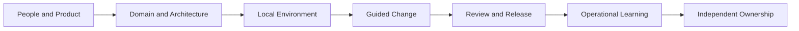

# Part 034 — Distributed Pairing, Remote Onboarding, Decision Workshops, and Knowledge Transfer

## Positioning

Remote teams membutuhkan lebih dari video calls.

Mereka memerlukan operating model untuk:

- bekerja bersama pada problem kompleks;
- mentransfer context;
- mempercepat onboarding;
- mengambil keputusan;
- dan membangun shared ownership tanpa mengandalkan kedekatan fisik.

> **Core thesis:** remote collaboration yang efektif memecah knowledge transfer menjadi artifacts, guided practice, feedback, dan repeated exposure—bukan satu kali walkthrough atau serangkaian meeting panjang.

---

## 1. Remote Collaboration Modes

Possible modes:

- pair programming;
- pair debugging;
- pair design;
- mob or ensemble programming;
- shadowing;
- reverse shadowing;
- recorded walkthrough;
- office hours;
- workshop;
- and async review.

Each mode solves a different problem.

---

## 2. Pair Programming

Pair programming combines two people on one work item.

Classic roles:

### Driver

Controls keyboard and implementation.

### Navigator

Maintains direction, checks assumptions, and reviews continuously.

Roles should rotate.

---

## 3. Remote Pairing Setup

Useful setup:

- reliable audio;
- screen sharing or shared IDE;
- shared terminal where allowed;
- clear session goal;
- working code state;
- and agreed duration.

Do not spend half the session fixing access.

---

## 4. Pairing Session Contract

Before starting:

```text
Goal:
Scope:
Expected outcome:
Roles:
Duration:
Break cadence:
Artifacts to update:
```

This prevents passive observation.

---

## 5. Pairing Cadence

Use short focused sessions:

- 45–90 minutes;
- with breaks;
- and explicit checkpoint.

Long uninterrupted pairing can create fatigue.

---

## 6. Driver-Navigator Rotation

Rotate:

- by time;
- by test;
- by small task;
- or by decision point.

If one person always drives, pairing becomes screen-sharing lecture.

---

## 7. Pair Programming Use Cases

Strong use cases:

- unfamiliar codebase;
- complex domain rule;
- high-risk migration;
- concurrency issue;
- incident fix;
- security-sensitive change;
- and onboarding.

Routine work may not always need pairing.

---

## 8. Pair Debugging

Pair debugging works well when one person:

- manipulates evidence;
- and another tracks hypotheses.

Use a shared hypothesis log:

```text
Hypothesis:
Evidence for:
Evidence against:
Test:
Result:
```

This reduces random troubleshooting.

---

## 9. Pair Design

Pair design can quickly explore:

- boundary;
- state;
- contract;
- migration;
- and trade-offs.

It should produce a lightweight note.

Conversation without artifact becomes temporary knowledge.

---

## 10. Remote Mob or Ensemble Programming

Several people collaborate on one problem.

Useful when:

- problem crosses specialties;
- risk is high;
- knowledge must spread;
- or urgent resolution needed.

Roles:

- driver;
- navigator;
- facilitator;
- domain expert;
- observer/learner.

---

## 11. Ensemble Anti-Patterns

- too many passive people;
- no role rotation;
- no session goal;
- senior dictates;
- and no follow-up artifact.

Use small groups and timeboxes.

---

## 12. Swarming Remotely

Remote swarming focuses team capacity on finishing critical work.

Needs:

- shared channel;
- current state;
- action board;
- role clarity;
- and checkpoints.

Avoid continuous all-day call unless incident severity requires it.

---

## 13. Screen Sharing versus Shared IDE

### Screen sharing

Simple and universal.

Limit:

- one active keyboard;
- possible resolution issues.

### Shared IDE/session

More interactive.

Limit:

- access;
- security;
- and tooling compatibility.

Choose based on task and policy.

---

## 14. Security and Access

Remote pairing tools may expose:

- source code;
- secrets;
- production data;
- and customer information.

Verify:

- approved tools;
- recording policy;
- environment;
- and screen-sharing hygiene.

---

## 15. Pairing Notes

After a session:

```text
What was completed:
Decision:
Open question:
Follow-up:
Owner:
Links:
```

A pair session should leave durable progress.

---

## 16. Pairing as Knowledge Distribution

Pairing reduces:

- bus factor;
- review bottleneck;
- and module ownership concentration.

Use planned rotation to spread critical knowledge.

---

## 17. Pairing as Mentoring

Mentoring pairing should balance:

- guidance;
- autonomy;
- and explanation.

Senior should not take keyboard permanently.

A useful technique:

1. explain goal;
2. ask learner to propose;
3. let learner drive;
4. ask reasoning questions;
5. summarize learning.

---

## 18. Reverse Pairing

The less-experienced engineer drives and explains.

The senior observes and asks questions.

This reveals understanding better than passive shadowing.

---

## 19. Onboarding as a System

Onboarding should help a new engineer build:

- product context;
- domain language;
- architecture model;
- delivery process;
- social network;
- and operational confidence.

It is not only environment setup.

---

## 20. Onboarding Outcomes

A new senior engineer should progressively become able to:

- explain the product flow;
- find source of truth;
- run the system;
- make a small change;
- review safely;
- diagnose common failure;
- participate in Scrum events;
- and identify internal verification questions.

---

## 21. Onboarding Phases

### Phase 1 — Orientation

People, product, tools, process.

### Phase 2 — Guided contribution

Small bounded tasks with pairing.

### Phase 3 — Independent delivery

Own a thin slice.

### Phase 4 — System contribution

Improve flow, quality, or design.

---

## 22. Onboarding Map



---

## 23. Onboarding Checklist Categories

- people and roles;
- product and customers;
- domain;
- architecture;
- repositories;
- local development;
- CI/CD;
- environments;
- testing;
- support and incident;
- Scrum practices;
- security;
- and decision records.

---

## 24. Role and Relationship Map

A new engineer should know:

- Product Owner;
- Scrum Master;
- Engineering Manager;
- senior engineers;
- QA;
- support;
- operations;
- architecture;
- security;
- and dependent teams.

A relationship map reduces “who do I ask?” latency.

---

## 25. Product Onboarding

Include:

- customer problem;
- Product Goal;
- key workflows;
- revenue or business model where appropriate;
- current roadmap;
- and known pain.

Do not begin only with repositories.

---

## 26. Domain Onboarding

Useful artifacts:

- glossary;
- state model;
- decision tables;
- example workflows;
- and common exceptions.

In Quote & Order context, clarify terms such as:

- quote;
- pricing;
- approval;
- acceptance;
- order submission;
- amendment;
- cancellation;
- and fulfillment state.

Internal meanings must be verified.

---

## 27. Architecture Onboarding

Provide:

- context diagram;
- service ownership;
- data ownership;
- event/API map;
- deployment model;
- and major constraints.

Avoid a one-hour slide dump with no hands-on reinforcement.

---

## 28. Environment Onboarding

The engineer should be able to:

- build;
- run;
- test;
- inspect logs;
- and reset data safely.

Use a verified setup guide.

Record common failure modes.

---

## 29. First Contribution

Choose a task that is:

- meaningful;
- bounded;
- low blast radius;
- and representative of the full flow.

Avoid:

- meaningless typo-only task as the entire onboarding experience;
- or critical high-risk ownership too early.

---

## 30. First Thin Slice

A strong first slice may include:

- small domain behavior;
- test;
- PR;
- CI;
- deployment to test;
- and demo.

This teaches the end-to-end system.

---

## 31. Buddy Model

A buddy helps with:

- daily questions;
- social context;
- and navigation.

Buddy is not solely responsible for all technical mentoring.

Use multiple contacts.

---

## 32. Onboarding Network

Create a network:

- domain buddy;
- technical buddy;
- delivery/process contact;
- and manager.

This reduces dependency on one person.

---

## 33. Office Hours

Office hours provide predictable access to:

- domain expert;
- platform team;
- or architect.

Useful for recurring questions.

Avoid making office hours the only way to get help.

---

## 34. Recorded Walkthroughs

Good walkthroughs are:

- short;
- topic-focused;
- indexed;
- accompanied by text;
- and reviewed for staleness.

Examples:

- local setup;
- release flow;
- order state diagnosis;
- and migration process.

---

## 35. Documentation plus Practice

Reading alone is insufficient.

Use:

```text
Read
-> Observe
-> Practice
-> Receive feedback
-> Explain back
-> Own a small task
```

---

## 36. Teach-Back

Ask the new engineer to explain:

- product flow;
- architecture boundary;
- or release process.

Teach-back reveals gaps without using tests as punishment.

---

## 37. Shadowing

Shadowing means observing an experienced person.

Useful for:

- incident;
- refinement;
- release;
- and support diagnosis.

It should have an observation guide.

---

## 38. Reverse Shadowing

The new engineer performs while an experienced person observes.

This is the bridge to independent ownership.

---

## 39. Onboarding Backlog

Create an onboarding backlog:

- setup;
- context;
- walkthrough;
- first task;
- pairing;
- release;
- and operational exposure.

Keep it adaptable.

Do not turn it into an enormous checklist with no prioritization.

---

## 40. Onboarding Metrics

Useful signals:

- time to first PR;
- time to first independently delivered slice;
- setup failures;
- unanswered-question latency;
- and qualitative confidence.

Avoid comparing individuals without context.

---

## 41. Time to First PR Limitations

A fast first PR may be trivial.

Measure meaningful capability, not only speed.

---

## 42. Onboarding Feedback

Ask:

- What was missing?
- What was stale?
- What was hard to find?
- Which terms were unclear?
- Where did access block progress?

New joiners reveal system documentation gaps.

---

## 43. Onboarding as Documentation Test

Every onboarding friction is evidence about:

- tooling;
- access;
- documentation;
- ownership;
- and architecture complexity.

Convert recurring friction into backlog improvement.

---

## 44. Senior Engineer Onboarding

A senior engineer needs both:

- local humility;
- and active system observation.

Do not assume industry experience equals internal domain knowledge.

Early focus:

- listen;
- map;
- verify;
- and avoid premature redesign.

---

## 45. First 30-Day Remote Onboarding

Possible goals:

- build relationship map;
- understand product and domain;
- run system;
- make one safe contribution;
- observe Scrum events;
- and document verification questions.

Detailed 30-60-90 coverage appears later in Parts 039–041.

---

## 46. Decision Workshops

A decision workshop is a focused synchronous session to resolve a defined decision.

It needs:

- pre-read;
- decision owner;
- options;
- participants;
- facilitation;
- and outcome record.

---

## 47. Workshop versus Meeting

A workshop requires active contribution.

Examples:

- mapping;
- option generation;
- example modeling;
- story slicing;
- and risk analysis.

A normal meeting may only share information or decide.

---

## 48. Workshop Types

- example mapping;
- event storming;
- story mapping;
- architecture trade-off;
- incident tabletop;
- risk workshop;
- retrospective;
- dependency mapping;
- and release readiness review.

---

## 49. Workshop Preparation

Prepare:

```text
Objective:
Decision or artifact:
Participants:
Pre-read:
Inputs:
Timebox:
Facilitation technique:
Owner:
```

---

## 50. Workshop Participant Design

Invite:

- information owners;
- decision owner;
- implementers;
- affected consumer;
- and relevant specialists.

Avoid spectator-heavy workshops.

---

## 51. Remote Workshop Tools

Possible tools:

- collaborative whiteboard;
- shared document;
- polling;
- breakout rooms;
- timer;
- and decision log.

Tool choice should not dominate facilitation.

---

## 52. Silent Start

Begin with silent reading or writing.

Benefits:

- equal participation;
- less anchoring;
- and better preparation.

---

## 53. Divergence and Convergence

Workshops often follow:

```text
Diverge:
Generate facts, risks, and options.

Converge:
Group, evaluate, decide, and assign.
```

Do not converge before enough alternatives exist.

---

## 54. Workshop Facilitation

Facilitator should:

- state objective;
- manage time;
- invite all voices;
- surface disagreement;
- and capture outcomes.

Facilitator should not manipulate the group toward an unstated preferred answer.

---

## 55. Decision Owner

The decision owner must be known before workshop.

Voting can inform the decision.

It does not replace authority.

---

## 56. Workshop Timeboxing

Timebox:

- context;
- individual input;
- discussion;
- option comparison;
- and decision.

If evidence is missing, create a follow-up action rather than forcing false consensus.

---

## 57. Breakout Rooms

Use when:

- group is large;
- parallel analysis helps;
- or multiple options need exploration.

Each breakout needs:

- clear question;
- recorder;
- and report-back format.

---

## 58. Event Storming Remotely

Remote event storming can explore domain flow.

Use:

- events;
- commands;
- actors;
- policies;
- aggregates;
- and hotspots.

Prepare a narrow scope.

Large remote boards can become unreadable.

---

## 59. Example Mapping Remotely

Use cards for:

- story;
- rule;
- example;
- and question.

A focused 30–45 minute session can expose hidden complexity.

---

## 60. Story Mapping Remotely

Map:

- user journey;
- backbone;
- tasks;
- releases;
- and slices.

Use clear ownership for updating the map after workshop.

---

## 61. Architecture Trade-Off Workshop

Inputs:

- problem;
- constraints;
- options;
- quality attributes;
- and evidence.

Outputs:

- decision;
- residual risk;
- ADR;
- and follow-up experiment.

---

## 62. Dependency Mapping Workshop

Map:

- provider;
- consumer;
- needed-by date;
- readiness;
- fallback;
- and escalation.

Focus on critical path, not every link.

---

## 63. Incident Tabletop

A tabletop exercise simulates:

- detection;
- roles;
- containment;
- communication;
- and recovery.

Useful for validating:

- runbook;
- access;
- decision rights;
- and gaps.

---

## 64. Workshop Output

Every workshop should produce one or more:

- decision;
- model;
- backlog item;
- risk;
- owner;
- and next step.

A whiteboard without follow-through is not an outcome.

---

## 65. Workshop Summary

```md
## Objective

## Participants

## Key Evidence

## Decisions

## Open Questions

## Actions

## Owners and Dates

## Artifacts
```

---

## 66. Decision-Making Techniques

Possible techniques:

- consent;
- advice process;
- decision owner after consultation;
- dot voting;
- weighted criteria;
- and reversible default.

Select based on authority and risk.

---

## 67. Consensus

Consensus can improve commitment.

But requiring unanimous agreement can cause:

- delay;
- lowest-common-denominator decisions;
- and hidden veto.

Clarify whether the goal is:

- understanding;
- consent;
- majority preference;
- or accountable decision.

---

## 68. Consent-Based Decision

Consent asks:

> Is there a reasoned objection that this option is unsafe or unworkable?

It is not the same as everyone preferring the option.

Useful for reversible decisions.

---

## 69. Advice Process

A decision maker seeks advice from:

- affected people;
- and subject experts.

Then decides and records rationale.

Useful for distributed authority.

---

## 70. Weighted Decision Matrix

Criteria may include:

- value;
- complexity;
- risk;
- reversibility;
- compatibility;
- and operational impact.

Weights should support discussion, not create fake mathematical certainty.

---

## 71. Decision Deadline

Every workshop decision should have:

- decision date;
- owner;
- and default or next action.

Avoid “we will revisit later” without trigger.

---

## 72. Decision Record

After workshop:

```text
Decision:
Evidence:
Alternatives:
Consequences:
Residual risk:
Owner:
Review trigger:
```

---

## 73. Knowledge Transfer

Knowledge transfer should be continuous.

Mechanisms:

- pairing;
- rotation;
- review;
- walkthrough;
- documentation;
- and shared incident response.

A single knowledge-transfer meeting is not enough.

---

## 74. Tacit versus Explicit Knowledge

### Explicit

Can be documented:

- command;
- architecture;
- workflow;
- policy.

### Tacit

Requires practice:

- debugging intuition;
- trade-off judgment;
- domain nuance;
- and stakeholder navigation.

Use guided practice for tacit knowledge.

---

## 75. Knowledge Map

A knowledge map can show:

| Area | Primary | Secondary | Learning Action |
|---|---|---|---|
| Approval rules | A | B | Pair on next change |
| Release process | C | None | Shadow and document |
| Order diagnosis | D | E | Rotate support |

This exposes bus-factor risk.

---

## 76. Ownership Map

Clarify:

- service;
- domain;
- operational;
- and decision ownership.

Ownership should not mean exclusive knowledge.

---

## 77. Rotation

Use rotation for:

- on-call;
- reviewer;
- release;
- domain support;
- and facilitation.

Rotation spreads knowledge but needs:

- documentation;
- handoff;
- and support.

---

## 78. Learning Backlog

Individuals and teams can maintain learning items:

- domain;
- architecture;
- tools;
- and process.

Link learning to real work.

Avoid training disconnected from product needs.

---

## 79. Community of Practice

A community of practice can share:

- patterns;
- incidents;
- standards;
- and tools.

It should not become another approval layer.

---

## 80. Demo and Teach Sessions

Short sessions can share:

- new capability;
- failure learning;
- and reusable technique.

Record and summarize when useful.

Avoid mandatory broad attendance for niche topics.

---

## 81. Documentation Sprint Anti-Pattern

Dedicated documentation effort may help cleanup.

But sustainable documentation should be part of normal work where relevant.

Do not allow documentation to decay until another cleanup project.

---

## 82. Onboarding Anti-Patterns

### Access after start

New hire blocked.

### Meeting marathon

Information overload.

### Repository-first

No product context.

### Single buddy

Knowledge bottleneck.

### Passive shadowing only

No skill validation.

### Stale checklist

False confidence.

### First task too trivial

No real system learning.

### First task too risky

Unsafe pressure.

---

## 83. Pairing Anti-Patterns

### Senior drives everything

No learning.

### No session goal

Conversation drifts.

### Pairing as surveillance

Safety decreases.

### Endless pairing

Fatigue.

### No artifact

Knowledge disappears.

### Forced pairing for all work

Low-value overhead.

---

## 84. Workshop Anti-Patterns

### No pre-read

Context dominates session.

### Too many participants

Low engagement.

### Hidden decision owner

Outcome unclear.

### Tool theater

Sticky notes without insight.

### Forced consensus

Decision delayed.

### No summary

Learning lost.

### No follow-up

Workshop becomes performance.

---

## 85. Remote Knowledge Anti-Patterns

### Video-only knowledge

Not searchable.

### Wiki-only learning

No practice.

### Expert office-hours dependency

Queue persists.

### Chat answers repeated

No FAQ or durable note.

### Ownership equals gatekeeping

Flow slows.

---

## 86. Senior Engineer Operating Model

### Pair with purpose

- high-risk work;
- onboarding;
- knowledge distribution;
- and debugging.

### Let others drive

- observe;
- ask;
- and coach.

### Design onboarding as a system

- context;
- practice;
- feedback;
- and progressive ownership.

### Facilitate decisions

- prepare options;
- include affected people;
- and record outcome.

### Spread knowledge

- rotate;
- document;
- and create secondary owners.

### Avoid becoming the hub

- build capability around you.

---

## 87. Worked Example: Remote Pairing on Retry Safety

### Goal

Implement idempotent order retry.

### Session 1

- new engineer drives;
- senior navigates;
- write failing concurrency test.

### Session 2

- roles rotate;
- implement idempotency boundary;
- inspect trace.

### Output

- passing test;
- PR;
- design note;
- and runbook update.

### Learning

New engineer can explain ambiguous timeout behavior and recovery path.

---

## 88. Worked Example: Senior Engineer Onboarding

### Week 1

- product and domain walkthrough;
- environment setup;
- relationship map;
- observe refinement and Review.

### Week 2

- pair on small defect;
- review PR;
- inspect incident history.

### Week 3

- own a thin slice;
- demo result;
- document one onboarding gap.

### Week 4

- facilitate part of refinement;
- propose one low-risk improvement.

---

## 89. Worked Example: Architecture Workshop

### Decision

How to add approval metadata without breaking legacy consumers.

### Pre-read

- consumer matrix;
- event schema;
- failure examples;
- options.

### Workshop

- silent review;
- identify constraints;
- compare additive field, new event version, and mapping adapter;
- decision owner selects additive field with legacy mapping.

### Output

- ADR;
- contract-test action;
- rollout flag;
- review trigger.

---

## 90. Worked Example: Incident Tabletop

### Scenario

Order service times out after accepting request.

### Exercise

- declare incident;
- assign roles;
- choose containment;
- communicate;
- recover;
- and identify evidence gaps.

### Findings

- no tested rollback;
- unclear support owner;
- missing duplicate metric.

### Backlog

Create runbook, metric, and idempotency validation actions.

---

## 91. Remote Pairing Checklist

Before:

- goal;
- access;
- environment;
- roles;
- duration.

During:

- rotate;
- explain reasoning;
- capture decisions;
- take breaks.

After:

- summary;
- artifact;
- follow-up;
- owner.

---

## 92. Onboarding Checklist

### Context

- product;
- customers;
- domain;
- roadmap.

### Technical

- architecture;
- repositories;
- environment;
- CI/CD;
- testing.

### Delivery

- Scrum events;
- backlog;
- DoD;
- release.

### Operations

- observability;
- incident;
- support;
- runbook.

### People

- roles;
- buddies;
- dependent teams.

### Progress

- first PR;
- first thin slice;
- first review;
- first operational exercise.

---

## 93. Workshop Checklist

Before:

- objective;
- decision owner;
- participants;
- pre-read;
- tool;
- timebox.

During:

- silent input;
- divergence;
- convergence;
- decision;
- actions.

After:

- summary;
- artifact;
- owners;
- review date.

---

## 94. Knowledge-Transfer Checklist

- Is knowledge explicit or tacit?
- Is practice included?
- Is secondary owner identified?
- Is artifact durable?
- Is teach-back used?
- Is future use likely?
- Is staleness owner clear?

---

## 95. Internal Verification Checklist

### Pairing and tools

- Which remote pairing tools are approved?
- Is shared IDE allowed?
- Are sessions recorded?
- What security restrictions apply?
- Is pairing voluntary or expected?

### Onboarding

- Is there an onboarding backlog?
- Who are buddies?
- What is the first meaningful contribution?
- Are access requests prepared before start?
- How is onboarding feedback captured?

### Knowledge

- Is a knowledge map maintained?
- Where are walkthroughs stored?
- Are runbooks owned?
- Is reviewer/on-call rotation used?
- What single-person dependencies exist?

### Workshops

- What workshop formats are common?
- Who facilitates?
- Are decision owners explicit?
- Where are outputs stored?
- Are remote whiteboards retained or summarized?

### Decision making

- Is consensus required?
- Is advice process used?
- How are decisions recorded?
- Are review triggers defined?
- How are disagreements escalated?

---

## 96. Practical Exercises

### Exercise 1 — Pairing plan

Design a two-session pairing plan for one high-risk story.

### Exercise 2 — Onboarding map

Create a four-week onboarding path with progressive outcomes.

### Exercise 3 — Teach-back

Choose one domain workflow and design a teach-back exercise.

### Exercise 4 — Workshop design

Prepare an architecture trade-off workshop with pre-read, participants, and outputs.

### Exercise 5 — Knowledge map

Identify primary and secondary owners for critical domains.

### Exercise 6 — Tabletop

Run a short incident simulation and record gaps.

---

## 97. Part Completion Checklist

You are done if you can:

- run focused remote pairing;
- use driver-navigator rotation;
- design remote onboarding as progressive capability;
- facilitate decision workshops;
- combine documentation with practice;
- spread tacit and explicit knowledge;
- and reduce single-person dependency.

---

## 98. Key Takeaways

1. Remote pairing needs purpose, roles, and artifacts.
2. Let learners drive.
3. Onboarding is more than setup.
4. Product and domain context should come before deep repository detail.
5. Guided practice transfers tacit knowledge.
6. Workshops need pre-read and decision ownership.
7. Voting is input, not authority.
8. Knowledge transfer must be continuous.
9. Senior engineers should reduce dependency on themselves.
10. Internal tools, security, and decision practices must be verified.

---

## 99. References

Conceptual baseline:

- General remote pairing, ensemble programming, onboarding, workshop facilitation, and knowledge-management practices.
- Architecture decision, event-storming, story-mapping, and incident-tabletop concepts.
- Scrum collaboration, self-management, and continuous-learning principles.

These concepts do not describe internal CSG processes.
