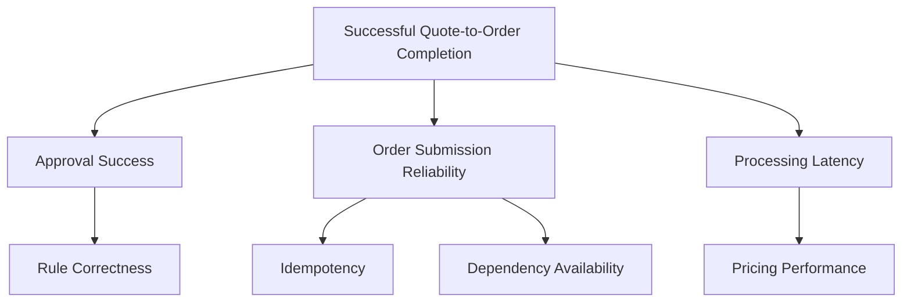

# Part 037 — Flow Metrics, Quality Signals, Reliability Indicators, Forecasting, and Decision Use

## Positioning

Metrics bukan alat untuk membuktikan bahwa team bekerja keras.

Metrics adalah alat untuk:

- memahami sistem delivery;
- mendeteksi bottleneck;
- memperkirakan outcome;
- mengevaluasi risk;
- dan menentukan perubahan yang layak dicoba.

> **Core thesis:** metric yang baik membantu team membuat keputusan. Metric yang tidak mengubah keputusan hanya menambah reporting cost.

---

## 1. What Delivery Health Means

Delivery health menggambarkan kemampuan sistem untuk:

- mengubah demand menjadi outcome;
- menjaga quality;
- merespons perubahan;
- dan tetap reliable.

Delivery health bukan satu angka.

Ia merupakan kombinasi:

- flow;
- quality;
- reliability;
- predictability;
- sustainability;
- dan learning.

---

## 2. Metrics as Signals, Not Truth

Metrics adalah representasi parsial.

Setiap metric memiliki:

- definition;
- scope;
- collection method;
- bias;
- dan blind spot.

Gunakan metric sebagai signal yang perlu diinterpretasikan bersama context.

---

## 3. Measurement Model

A healthy measurement model asks:

```text
What question are we trying to answer?
What decision will this metric influence?
What behavior could it accidentally incentivize?
What context is required?
```

---

## 4. Lagging versus Leading Indicators

### Lagging indicators

Menunjukkan outcome setelah terjadi.

Examples:

- escaped defects;
- incident count;
- customer impact;
- release success.

### Leading indicators

Memberi peringatan lebih awal.

Examples:

- aging WIP;
- review queue;
- flaky-test rate;
- dependency readiness;
- error-budget burn.

Gunakan keduanya.

---

## 5. Flow Metrics Overview

Core flow metrics:

- Work in Progress;
- cycle time;
- lead time;
- throughput;
- work-item age;
- blocked time;
- queue time;
- and flow efficiency.

---

## 6. Work in Progress

WIP adalah jumlah work item yang sudah dimulai tetapi belum Done.

High WIP biasanya menyebabkan:

- context switching;
- longer cycle time;
- hidden risk;
- dan queue.

WIP harus dilihat pada:

- team level;
- workflow state;
- dan work type.

---

## 7. Cycle Time

Cycle time mengukur:

```text
Work started -> Done
```

Gunakan definisi start dan Done yang konsisten.

Cycle time membantu:

- forecasting;
- bottleneck analysis;
- dan service expectation.

---

## 8. Lead Time

Lead time mengukur:

```text
Request or commitment -> Done
```

Lead time mencakup waiting sebelum execution.

Ia lebih dekat ke stakeholder experience.

---

## 9. Throughput

Throughput adalah jumlah item selesai dalam periode.

Gunakan throughput untuk:

- capacity trend;
- probabilistic forecasting;
- dan system comparison over time.

Hindari menggunakan throughput per person.

---

## 10. Work Item Age

Work-item age adalah usia item yang masih aktif.

Ini adalah leading indicator penting.

Ask:

- Apakah usia melebihi historical norm?
- Di state mana item menunggu?
- Apa intervention yang diperlukan?

---

## 11. Blocked Time

Blocked time mengukur waktu item tidak dapat maju.

Kategori blocker:

- dependency;
- environment;
- decision;
- access;
- review;
- data;
- and incident.

Recurring blocker categories reveal systemic problems.

---

## 12. Queue Time

Queue time adalah waktu menunggu tanpa active work.

Common queues:

- review;
- QA;
- security;
- release;
- and environment.

Queue time sering lebih besar daripada implementation time.

---

## 13. Flow Efficiency

Conceptually:

```text
Flow efficiency = active time / total elapsed time
```

Low flow efficiency menunjukkan waiting.

Do not use it to demand constant utilization.

---

## 14. Little's Law

Conceptually:

```text
WIP = Throughput × Cycle Time
```

Implication:

- if throughput stable;
- higher WIP usually increases cycle time.

Use as system reasoning, not exact daily arithmetic.

---

## 15. WIP by Workflow State

Example:

| State | WIP |
|---|---:|
| In Development | 4 |
| Review | 7 |
| Validation | 2 |
| Blocked | 3 |

Review queue is the likely bottleneck.

---

## 16. Aging Distribution

Do not only inspect average age.

Use:

- median;
- 75th percentile;
- 85th percentile;
- and outliers.

Averages can hide long-tail risk.

---

## 17. Cycle-Time Distribution

Delivery time is variable.

Use percentile-based service expectation.

Example:

```text
50% of items complete within 4 days.
85% complete within 8 days.
95% complete within 13 days.
```

This is more honest than a single deterministic estimate.

---

## 18. Service Level Expectation

An SLE may state:

> 85% of standard work items are expected to complete within eight working days after start.

SLE is not a punishment threshold.

It is a planning and risk signal.

---

## 19. Cumulative Flow Diagram

A CFD shows work accumulation across states.

A widening band may indicate:

- queue growth;
- bottleneck;
- or stalled flow.

Use trend, not decorative dashboard.

---

## 20. Control Chart

A control chart displays completed cycle times over time.

Useful for:

- variation;
- outlier investigation;
- and forecast calibration.

---

## 21. Throughput Run Chart

Throughput over time can reveal:

- stability;
- seasonal variation;
- incident impact;
- and process change.

Avoid celebrating raw increases without checking quality and item size.

---

## 22. Arrival Rate versus Completion Rate

If arrival rate exceeds throughput:

- backlog grows;
- aging increases;
- and response time worsens.

This may require:

- demand shaping;
- scope reduction;
- or capacity change.

---

## 23. Flow Load

Flow load compares incoming demand to available system capacity.

Useful for:

- support workload;
- defects;
- and unplanned work.

---

## 24. Work-Type Segmentation

Possible work types:

- feature;
- defect;
- incident;
- reliability;
- debt;
- migration;
- and support.

Segmentation can reveal different service behavior.

Avoid using categories as quota.

---

## 25. Class of Service

Possible classes:

- standard;
- fixed-date;
- expedite;
- risk reduction.

Track whether expedite use is truly exceptional.

---

## 26. Forecasting with Historical Data

Historical throughput or cycle time can support probabilistic forecasting.

Questions:

- How many items can likely finish by date?
- When will a known scope likely finish?
- What confidence range is reasonable?

---

## 27. Monte Carlo Forecasting Concept

Monte Carlo uses historical variation to simulate many possible futures.

Outputs may include:

- 50% confidence;
- 85% confidence;
- 95% confidence.

Use only when:

- data definitions are stable;
- work is reasonably comparable;
- and stakeholders understand confidence.

---

## 28. Forecast Assumptions

State:

- scope stability;
- team composition;
- work-type mix;
- incident load;
- and dependency assumptions.

Forecast without assumptions creates false precision.

---

## 29. Velocity

Velocity is team-specific historical story-point completion.

Useful only as:

- local planning input;
- and rough team history.

Not suitable for:

- cross-team comparison;
- productivity ranking;
- or performance target.

---

## 30. Commitment Reliability

A possible signal:

```text
Forecasted items versus Done items
```

But interpret carefully.

Low completion may indicate:

- poor slicing;
- high unplanned work;
- dependency;
- or goal adaptation.

Do not reward teams for under-forecasting.

---

## 31. Sprint Goal Success

A stronger outcome signal asks:

- Was Sprint Goal achieved?
- What evidence supports it?
- Was scope adapted?
- What prevented success?

Goal success should not become a simplistic percentage KPI.

---

## 32. Carry-Over

Carry-over can signal:

- too-large items;
- high WIP;
- late validation;
- weak dependencies;
- and poor planning.

Inspect pattern, not blame.

---

## 33. Scope Change

Track material mid-Sprint additions and removals.

Useful questions:

- Why did scope change?
- Was the Sprint Goal protected?
- Was added work offset?
- Is interruption load systemic?

---

## 34. Quality Metrics Overview

Possible quality signals:

- escaped defects;
- defect recurrence;
- reopen rate;
- change failure rate;
- test flakiness;
- review rework;
- and production rollback.

---

## 35. Escaped Defects

An escaped defect reaches production or later stage.

Track:

- severity;
- affected path;
- detection source;
- and escape mechanism.

Do not count all defects equally.

---

## 36. Defect Recurrence

Repeat defects indicate:

- narrow fix;
- incomplete CAPA;
- or misunderstood failure class.

Recurrence often matters more than total defect count.

---

## 37. Reopen Rate

Reopened defects may signal:

- incomplete reproduction;
- insufficient validation;
- or hidden variants.

Investigate pattern.

---

## 38. Change Failure Rate

Conceptually:

```text
Changes causing incident, rollback, hotfix, or material degradation
/
Total production changes
```

Definition must be explicit.

Do not count every minor post-release adjustment identically.

---

## 39. Deployment Failure Rate

Can measure:

- failed deployment;
- rollback;
- or pipeline abort.

Separate deployment mechanics from product behavior failure where useful.

---

## 40. Test Flakiness

Useful signals:

- flaky tests count;
- rerun frequency;
- quarantine age;
- and pipeline time lost.

A low test count with high trust may be healthier than high count with constant reruns.

---

## 41. Test Feedback Time

Track:

- local feedback;
- CI first failure;
- full pipeline;
- and environment validation.

Long feedback time increases batch size.

---

## 42. Review Rework

Possible signals:

- number of review rounds;
- major design changes after PR;
- and comments after integration.

Interpret with PR size and risk.

---

## 43. PR Review Latency

Measure:

```text
Review requested -> first substantive response
```

Also consider:

- time waiting on author;
- time to approval;
- and time to merge.

---

## 44. Code Coverage

Coverage can reveal untested code.

It does not prove:

- behavior quality;
- edge-case quality;
- or meaningful assertions.

Use coverage as a diagnostic, not quality target alone.

---

## 45. Mutation Testing

Mutation testing can test whether tests detect altered behavior.

Useful for critical domain logic.

It adds cost and should be targeted.

---

## 46. Reliability Metrics Overview

Possible reliability signals:

- availability;
- latency;
- error rate;
- saturation;
- MTTR;
- incident frequency;
- recurrence;
- and error-budget burn.

---

## 47. Service Level Indicator

An SLI is a measured service behavior.

Examples:

- successful order submission rate;
- quote-pricing latency;
- approval-event delivery delay;
- and data-correction rate.

---

## 48. Service Level Objective

An SLO is a target for an SLI.

Example:

> 99.9% of valid order submissions complete successfully within the monthly window.

Internal targets must be verified.

---

## 49. Error Budget

Error budget represents allowable unreliability under an SLO.

It can guide:

- rollout pace;
- reliability investment;
- and risk-taking.

Error budgets need shared policy.

---

## 50. Error-Budget Burn

Burn rate indicates how quickly reliability allowance is consumed.

Fast burn may trigger:

- rollout pause;
- investigation;
- or reliability work.

---

## 51. Availability

Availability alone can hide partial failure.

A service may be “up” while:

- one tenant fails;
- one workflow is broken;
- or latency is unusable.

Use user-journey SLIs where possible.

---

## 52. Latency

Use percentiles:

- p50;
- p95;
- p99.

Averages hide tail experience.

Tie latency to:

- workload;
- tenant;
- region;
- and transaction type.

---

## 53. Error Rate

Segment by:

- expected business rejection;
- technical failure;
- dependency failure;
- and customer input error.

Not all non-success responses mean system defect.

---

## 54. Saturation

Saturation measures resource pressure:

- CPU;
- memory;
- thread;
- connection;
- queue;
- and rate limit.

Use alongside user-facing symptoms.

---

## 55. Mean Time Metrics

Possible terms:

- MTTD;
- MTTA;
- MTTR;
- MTBF.

Always define what “R” means:

- repair;
- restore;
- resolve;
- or recover.

Prefer median and percentile when distribution is skewed.

---

## 56. Incident Frequency

Segment incidents by:

- severity;
- service;
- cause category;
- and recurrence.

Raw count alone can be misleading.

---

## 57. Customer Impact Minutes

A more outcome-oriented measure can include:

```text
Affected users × duration
```

But use carefully across different impact types.

---

## 58. Near Misses

Near misses reveal fragility before customer impact.

Track:

- manual rescue;
- rollback before broad exposure;
- and caught corruption.

Do not reward teams for hiding them.

---

## 59. Recovery Metrics

Useful signals:

- rollback time;
- data reconciliation time;
- runbook success;
- and time to full customer validation.

Service restoration may occur before data recovery.

---

## 60. Supportability Metrics

Possible signals:

- time to diagnose;
- escalation rate;
- manual intervention;
- and support-to-engineering handoff.

Support metrics connect observability to real outcome.

---

## 61. Deployment and Delivery Metrics

Potential DORA-style signals:

- deployment frequency;
- lead time for changes;
- change failure rate;
- time to restore.

Use as system indicators.

Do not apply mechanically across incomparable teams.

---

## 62. Deployment Frequency

Higher frequency may indicate smaller batches.

But frequent deployment can coexist with:

- low value;
- high failure;
- or hidden release gates.

Interpret with quality and outcome.

---

## 63. Lead Time for Changes

Definition may be:

```text
Code committed -> production
```

This differs from Product Backlog lead time.

Name the metric precisely.

---

## 64. Batch Size

Smaller batches generally improve:

- feedback;
- review;
- rollback;
- and risk containment.

Possible proxies:

- PR size;
- work-item size;
- release contents.

---

## 65. Release Frequency versus Deployment Frequency

Deployment:

- artifact placed in environment.

Release:

- user exposure.

Both may be useful.

Do not conflate them.

---

## 66. Product Outcome Metrics

Delivery health should eventually connect to:

- adoption;
- task completion;
- support reduction;
- customer satisfaction;
- revenue or cost;
- and product risk.

Engineering metrics are not substitutes for product outcomes.

---

## 67. Hypothesis Metrics

For a feature:

```text
We believe:
Expected behavior:
Leading signal:
Outcome signal:
Decision threshold:
```

Review metrics after release.

---

## 68. Value versus Activity Metrics

Activity metrics:

- commits;
- tickets;
- hours;
- messages.

Value or system metrics:

- cycle time;
- customer success;
- reliability;
- support reduction;
- and goal achievement.

Activity metrics are rarely useful for individual performance.

---

## 69. Sustainability Metrics

Possible signals:

- after-hours work;
- on-call interruptions;
- meeting load;
- focus time;
- leave disruption;
- and burnout survey.

Sustainable pace is part of delivery health.

---

## 70. Capacity Health

Inspect:

- planned versus unplanned work;
- support load;
- dependency waiting;
- and improvement capacity.

Do not interpret low utilization as waste.

---

## 71. Learning Metrics

Possible signals:

- experiment completion;
- retro action follow-through;
- repeat incidents;
- and onboarding friction resolved.

Learning quality is hard to reduce to one number.

---

## 72. Metric Portfolio

A balanced portfolio can include:

### Flow

- WIP;
- cycle time;
- aging;
- throughput.

### Quality

- escaped defects;
- change failure;
- flaky tests.

### Reliability

- SLO;
- incident recurrence;
- recovery.

### Outcome

- adoption;
- workflow completion.

### Sustainability

- unplanned load;
- after-hours interruption.

---

## 73. Metric Tree

A metric tree links outcome to drivers.



This prevents isolated dashboards.

---

## 74. North Star Metric Limits

A single north-star metric cannot represent:

- safety;
- reliability;
- fairness;
- and sustainability.

Use guardrail metrics.

---

## 75. Guardrail Metrics

Guardrails protect against local optimization.

Example:

- increase release frequency;
- while change failure rate remains below threshold;
- and incident burden does not rise.

---

## 76. Dashboard Design

A dashboard should answer a question.

Good dashboard sections:

- current health;
- trend;
- threshold;
- context;
- owner;
- and action.

Avoid vanity charts.

---

## 77. Metric Ownership

Each metric needs:

- definition;
- data source;
- owner;
- review cadence;
- and decision use.

Otherwise dashboards decay.

---

## 78. Metric Definition Sheet

```md
## Metric Name

## Question Answered

## Definition

## Start/End Conditions

## Segmentation

## Data Source

## Known Limitations

## Decision Use

## Owner

## Review Cadence
```

---

## 79. Data Quality

Metrics are only useful if data is trustworthy.

Check:

- missing events;
- inconsistent timestamps;
- changed workflow state;
- duplicate records;
- and manual updates.

---

## 80. Metric Drift

Definitions may change when:

- workflow changes;
- tooling changes;
- or team process changes.

Version definitions.

Do not compare periods blindly.

---

## 81. Baseline and Trend

Use baseline before an experiment.

Track trend over multiple periods.

One Sprint may be noisy.

---

## 82. Segmentation

Segment when it changes decisions.

Possible dimensions:

- work type;
- tenant;
- severity;
- service;
- team;
- environment;
- and release type.

Avoid over-segmentation that creates noise.

---

## 83. Aggregation Risk

Aggregate metrics can hide:

- one struggling tenant;
- one service bottleneck;
- or one high-severity workflow.

Use drill-down.

---

## 84. Median versus Mean

Median is robust to outliers.

Mean captures total effect but can be skewed.

Use both when relevant.

---

## 85. Percentiles

Percentiles describe distribution.

Useful for:

- latency;
- cycle time;
- review delay;
- and recovery time.

---

## 86. Counts versus Rates

A count may rise because volume rises.

Use rates when exposure changes.

Example:

```text
Defects per 1,000 transactions
```

But absolute count still matters for support load.

---

## 87. Normalization

Normalize only when denominator is meaningful.

Avoid complex formulas that stakeholders cannot explain.

---

## 88. Confidence Intervals

For noisy or sampled data, confidence intervals can show uncertainty.

Do not present precise estimates without sample context.

---

## 89. Metric Review Cadence

Possible cadence:

- Daily: operational health.
- Weekly: flow and blockers.
- Sprint: delivery and quality.
- Monthly/quarterly: product and reliability trends.

Do not review every metric every day.

---

## 90. Metric Review Questions

```text
What changed?
Is the change meaningful?
What hypothesis explains it?
What decision follows?
What additional evidence is needed?
```

---

## 91. Flow Review

A flow review can inspect:

- aging;
- queues;
- WIP;
- throughput;
- and blockers.

Output:

- intervention;
- policy change;
- or escalation.

---

## 92. Quality Review

A quality review can inspect:

- severe defects;
- recurrence;
- test trust;
- and release failures.

Avoid becoming a blame forum.

---

## 93. Reliability Review

Inspect:

- SLO;
- incident trend;
- error-budget burn;
- and CAPA.

Connect to delivery policy.

---

## 94. Sprint Review Metrics

Use product and operational evidence:

- adoption;
- success rate;
- latency;
- defects;
- and customer feedback.

Do not turn Sprint Review into metric presentation only.

---

## 95. Retrospective Metrics

Metrics can provide evidence for:

- WIP;
- review queue;
- incident load;
- and carry-over.

Team interpretation remains essential.

---

## 96. Metric and Experiment

For every process experiment:

- baseline;
- expected change;
- guardrail;
- duration;
- and review decision.

---

## 97. Senior Engineer Role in Metrics

A senior engineer should:

- clarify definitions;
- question misleading aggregation;
- connect technical signals to risk;
- and avoid weaponization.

They should not become dashboard administrator for every metric.

---

## 98. Senior Engineer as Translator

Example:

> Review latency increased from one to three days because two modules still require one specialist. This is a knowledge and ownership bottleneck, not an individual speed problem.

---

## 99. Senior Engineer as Skeptic

Ask:

- What behavior will this metric incentivize?
- Can it be gamed?
- Is the denominator stable?
- Does it help a decision?
- What is hidden?

---

## 100. Senior Engineer as Experimenter

Use metrics to test:

- WIP limit;
- reviewer rotation;
- contract-test placement;
- and incident reserve.

Do not treat correlation as proof.

---

## 101. Worked Example: Review Bottleneck

### Signals

- median review latency: 2.7 days;
- 85th percentile: 5.4 days;
- one reviewer handles 68% of approvals;
- PR size rising.

### Hypothesis

Knowledge concentration and large PRs drive delay.

### Experiment

- reviewer rotation;
- PR slicing;
- and pairing.

### Guardrail

Escaped defect rate should not increase.

---

## 102. Worked Example: Reliability Improvement

### Before

- duplicate-order incident twice per quarter;
- no idempotency metric;
- recovery manual.

### Change

- idempotency;
- duplicate detection;
- reconciliation runbook.

### Signals

- duplicate rate;
- alert detection time;
- recovery time;
- and support escalation.

---

## 103. Worked Example: Flaky CI

### Baseline

- 17% pipeline rerun;
- 42-minute average feedback;
- 11 quarantined tests.

### Intervention

- assign owners;
- move deterministic tests earlier;
- remove stale E2E dependency.

### Outcome signals

- rerun rate;
- pipeline p85;
- quarantine age;
- and developer trust survey.

---

## 104. Worked Example: Sprint Goal Health

### Signal

80% ticket completion, but Sprint Goal missed.

### Analysis

- work unrelated;
- dependency blocked key path;
- optional items finished first.

### Decision

Use goal-oriented board and must/should/could scope.

---

## 105. Worked Example: Platform Adoption

### Output metric

Three platform features built.

### Better metrics

- number of adopting teams;
- time to first deployment;
- support tickets;
- and manual steps removed.

---

## 106. Delivery Health Scorecard

A scorecard may summarize:

| Area | Signal | Trend | Decision |
|---|---|---|---|
| Flow | Cycle-time p85 | Worsening | Reduce WIP |
| Quality | Escaped high-severity defects | Stable | Continue |
| Reliability | Error-budget burn | Worsening | Pause rollout |
| Sustainability | After-hours incident load | Worsening | Adjust rotation |

Avoid collapsing into one weighted score without clear rationale.

---

## 107. Metric Selection Checklist

- Question clear?
- Decision clear?
- Definition stable?
- Data trusted?
- Behavior risk considered?
- Context available?
- Owner assigned?
- Review cadence appropriate?
- Can metric be retired?

---

## 108. Dashboard Checklist

- Current health visible?
- Trend visible?
- Threshold meaningful?
- Segmentation available?
- Owner clear?
- Action linked?
- Data freshness known?
- Metric definition linked?

---

## 109. Forecast Checklist

- Historical data relevant?
- Scope stable?
- Team context stable?
- Confidence stated?
- Assumptions listed?
- Unplanned work considered?
- Range preferred over false precision?
- Update trigger defined?

---

## 110. Reliability Checklist

- User-facing SLI?
- SLO explicit?
- Error budget policy?
- Incident severity trend?
- Detection and recovery measured?
- Data recovery included?
- Recurrence tracked?
- CAPA followed?

---

## 111. Process Smells

- dashboard has no owner;
- metrics are reviewed but no decisions change;
- velocity compared across teams;
- averages hide long tail;
- activity metrics dominate;
- quality metrics ignore severity;
- and product outcomes are absent.

---

## 112. Internal Verification Checklist

### Flow data

- What starts cycle time?
- What defines Done?
- Is aging visible?
- Is blocked time captured?
- Are workflow states accurate?

### Quality data

- How are defects classified?
- Is severity available?
- Are escaped and repeated defects tracked?
- Are flaky tests measured?
- Is review latency available?

### Reliability

- Are SLIs/SLOs defined?
- Is error-budget policy used?
- What does MTTR mean internally?
- Are near misses captured?
- Are data incidents included?

### Delivery

- Are deployment and release separate?
- Are DORA-like metrics used?
- Are batch size and rollback tracked?
- Is unplanned work visible?

### Governance

- Who owns metric definitions?
- Are metrics used in performance reviews?
- Are teams compared?
- How are metrics retired?
- What dashboards are trusted?

---

## 113. Practical Exercises

### Exercise 1 — Metric inventory

List all metrics currently used and the decision each supports.

### Exercise 2 — Definition audit

Write a definition sheet for cycle time and change failure rate.

### Exercise 3 — Flow analysis

Use WIP, age, and queue data to identify a bottleneck.

### Exercise 4 — Balanced scorecard

Create one flow, quality, reliability, outcome, and sustainability signal.

### Exercise 5 — Forecast

Create a probability-based forecast with assumptions.

### Exercise 6 — Metric retirement

Identify one vanity metric and propose removal.

---

## 114. Part Completion Checklist

You are done if you can:

- explain flow metrics;
- use distributions and percentiles;
- distinguish lead and cycle time;
- interpret quality and reliability signals;
- create balanced metric portfolios;
- support forecasting;
- detect metric blind spots;
- and connect every metric to a decision.

---

## 115. Key Takeaways

1. Metrics are decision signals.
2. Delivery health is multidimensional.
3. Aging and queue time are powerful leading indicators.
4. Distributions are more informative than averages.
5. Velocity is local and non-comparative.
6. Quality metrics need severity and context.
7. Reliability should reflect user journeys.
8. Product outcome and sustainability must not be ignored.
9. Senior engineers should challenge definitions and incentives.
10. Internal metric practices must be verified.

---

## 116. References

Conceptual baseline:

- General flow, Kanban, Little's Law, probabilistic forecasting, and delivery-metrics practices.
- Software quality, reliability, SLI/SLO, error-budget, and DORA-style measurement concepts.
- Scrum transparency, inspection, adaptation, and Sprint Goal principles.

These concepts do not describe internal CSG processes.
