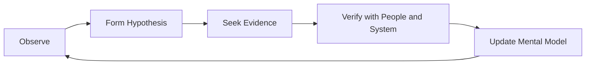
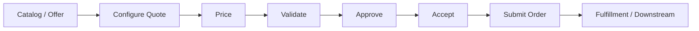
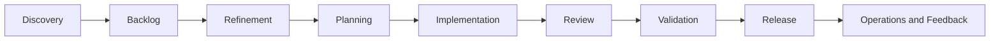

# Part 039 — Observation, Product Context, Domain Mapping, Relationship Building, and Safe First Contribution

## Positioning

Tiga puluh hari pertama senior engineer bukan periode untuk membuktikan bahwa dirinya paling cepat memahami sistem.

Periode ini digunakan untuk:

- memahami product dan customer;
- mempelajari domain language;
- memetakan architecture dan ownership;
- mengamati delivery system;
- membangun relationship;
- memvalidasi asumsi;
- dan memberikan kontribusi pertama yang aman.

> **Core thesis:** senior engineer yang matang menunda solusi besar sampai memiliki cukup context, tetapi tidak menunda kontribusi kecil yang meningkatkan pemahaman dan kepercayaan.

---

## 1. The First-30-Day Mission

Tujuan 30 hari pertama:

```text
Understand before optimizing.
Contribute before redesigning.
Verify before assuming.
Build trust before influencing broadly.
```

Outcome yang diharapkan:

- product map;
- domain map;
- architecture map;
- stakeholder and ownership map;
- delivery-flow map;
- risk and question register;
- working local environment;
- dan satu safe end-to-end contribution.

---

## 2. Common Senior-Onboarding Failure Modes

### Premature redesign

Menyimpulkan architecture buruk sebelum memahami constraints.

### Technology-first observation

Fokus pada framework, mengabaikan customer dan domain.

### Silent onboarding

Belajar sendiri tanpa membangun relationships.

### Meeting overload

Mengikuti semua meeting tetapi tidak menyusun mental model.

### Passive waiting

Menunggu semua context diberikan.

### Early judgment

Membandingkan setiap praktik dengan perusahaan sebelumnya.

### Heroic first task

Mengambil perubahan berisiko tinggi untuk membuktikan kemampuan.

### No written learning

Context hilang dan pertanyaan berulang.

---

## 3. Senior Humility

Industry experience membantu, tetapi tidak menggantikan local context.

Gunakan language:

> Di sistem sebelumnya, pattern ini digunakan karena constraint tertentu. Apa constraint utama yang membentuk design saat ini?

Bukan:

> Seharusnya ini menggunakan pattern X.

---

## 4. Observe, Hypothesize, Verify

A useful loop:



Jangan memperlakukan hypothesis sebagai fact.

---

## 5. Learning Layers

Pelajari sistem melalui beberapa layer:

1. Product.
2. Customer.
3. Domain.
4. Architecture.
5. Data and integration.
6. Delivery process.
7. Operations.
8. Organization and relationships.
9. Metrics and incentives.
10. History and constraints.

---

## 6. Product Context

Understand:

- product purpose;
- target customers;
- major workflows;
- revenue or business impact where appropriate;
- roadmap;
- current priorities;
- known customer pain;
- and Product Goal.

Questions:

```text
What customer problem does the product solve?
Which workflows are most critical?
What failures are most expensive?
What is changing this quarter?
What is intentionally not being built?
```

---

## 7. Quote-to-Order Product Context

For a Quote & Order domain, possible high-level flow:



Internal CSG implementation and terminology must be verified.

---

## 8. Customer Segmentation

Understand differences across:

- tenant;
- region;
- product line;
- deployment model;
- regulatory context;
- and customization level.

A workflow that is simple for one customer may be complex for another.

---

## 9. Customer Pain Sources

Useful inputs:

- support tickets;
- incidents;
- customer escalations;
- Product Backlog;
- Sprint Reviews;
- roadmap discussions;
- and operational metrics.

Do not infer customer priority only from code complexity.

---

## 10. Product Goal and Roadmap

Clarify:

- current Product Goal;
- near-term roadmap;
- customer commitment;
- and strategic constraints.

Ask:

- Which outcome matters now?
- Which capability unlocks future roadmap?
- Which technical risks threaten it?

---

## 11. Domain Language

Create a glossary.

Possible terms:

- quote;
- quote version;
- configuration;
- pricing;
- discount;
- approval;
- acceptance;
- order;
- amendment;
- cancellation;
- fulfillment;
- and orchestration.

Avoid assuming industry-standard meaning matches internal meaning.

---

## 12. Domain Glossary Template

| Term | Working Definition | Source | Open Question |
|---|---|---|---|
| Quote | Proposed commercial configuration and price | Product docs | Versioning semantics? |
| Approval | Authorization for a quote condition | PO discussion | Multi-level behavior? |
| Order | Accepted request sent downstream | Architecture note | Source of truth? |

---

## 13. Domain Events

Identify significant business events:

- QuoteCreated;
- QuotePriced;
- ApprovalRequested;
- QuoteApproved;
- QuoteAccepted;
- OrderSubmitted;
- OrderRejected;
- and FulfillmentStarted.

Names and event semantics must be verified internally.

---

## 14. State Model

Map state transitions.

Questions:

- What states exist?
- Which transitions are valid?
- Who initiates them?
- Which transitions are irreversible?
- How is failure represented?
- How is concurrency handled?

---

## 15. Decision Tables

Use decision tables for:

- approval thresholds;
- discount rules;
- authorization;
- and customer-specific variations.

They reveal hidden complexity better than prose alone.

---

## 16. Domain Invariants

Examples:

- one accepted quote version;
- approved amount must match submitted amount;
- tenant ownership must be preserved;
- one idempotent downstream order per submission key;
- and invalid state transition must be rejected.

Treat these as hypotheses until verified.

---

## 17. Architecture Context

Build a context diagram covering:

- product system;
- external actors;
- upstream systems;
- downstream systems;
- platform services;
- and operational interfaces.

---

## 18. Service Map

For every service or module, capture:

| Component | Responsibility | Owner | Data | Interfaces | Operational Criticality |
|---|---|---|---|---|---|

Do not confuse repository boundaries with domain boundaries.

---

## 19. Data Ownership Map

Questions:

- Who owns each business fact?
- Which service writes?
- Which services read?
- Are shared databases used?
- What is the source of truth?
- How is history stored?
- How is data corrected?

---

## 20. Integration Map

Capture:

- APIs;
- events;
- queues;
- files;
- database integrations;
- and vendor connections.

For each boundary:

```text
Producer:
Consumer:
Contract:
Version:
Failure behavior:
Retry:
Timeout:
Owner:
```

---

## 21. Deployment Map

Understand:

- cloud/on-prem variants;
- environments;
- CI/CD;
- configuration;
- feature flags;
- release train;
- and customer deployment constraints.

Do not assume one deployment model.

---

## 22. Runtime and Operational Map

Identify:

- dashboards;
- alerts;
- logs;
- traces;
- runbooks;
- on-call;
- incident process;
- and support handoff.

A senior engineer should understand how the system fails, not only how it builds.

---

## 23. Architecture History

Ask:

- Why was this boundary chosen?
- Which migration happened?
- Which customer constraint exists?
- Which previous incidents shaped the design?
- Which options were rejected?

History prevents repeating old mistakes.

---

## 24. Architecture Decision Records

Review:

- active ADRs;
- superseded decisions;
- and open architecture questions.

Validate whether the system still matches the documented decisions.

---

## 25. Technical Debt Context

Avoid creating a long debt list immediately.

For each observed issue, capture:

```text
Condition:
Evidence:
Recurring cost:
Affected roadmap:
Known reason:
Potential action:
Confidence:
```

---

## 26. Delivery System Map

Map the path from idea to production:



Identify:

- queues;
- handoffs;
- decision points;
- and ownership.

---

## 27. Observe Scrum Events

Attend and observe:

- refinement;
- Sprint Planning;
- Daily Scrum;
- Sprint Review;
- and Retrospective.

Do not evaluate only whether the event follows a textbook.

Inspect whether it achieves its purpose.

---

## 28. Refinement Observation

Observe:

- outcome clarity;
- examples;
- slicing;
- dependency readiness;
- risk;
- estimation;
- and decision ownership.

Questions:

- Which items repeatedly return?
- What information is missing?
- Where does ambiguity surface later?

---

## 29. Sprint Planning Observation

Observe:

- Sprint Goal formation;
- capacity;
- scope trade-off;
- dependencies;
- and quality work.

Look for:

- fixed scope;
- assignment by manager;
- and optimistic readiness.

---

## 30. Daily Scrum Observation

Observe:

- goal focus;
- WIP;
- blockers;
- coordination;
- and replanning.

Do not judge by whether three questions are used.

---

## 31. Sprint Review Observation

Observe:

- product evidence;
- stakeholder feedback;
- limitations;
- decisions;
- and backlog adaptation.

---

## 32. Retrospective Observation

Observe:

- psychological safety;
- system thinking;
- action ownership;
- and follow-through.

Do not quote sensitive retrospective content outside agreed boundaries.

---

## 33. Board and Workflow Observation

Inspect:

- actual workflow states;
- aging;
- queues;
- blocked work;
- carry-over;
- and hidden work.

Compare board representation with real work.

---

## 34. Delivery Metrics Baseline

Possible baseline:

- WIP;
- cycle time;
- review latency;
- blocked time;
- escaped defects;
- incident load;
- and release frequency.

Use as observational evidence, not early judgment.

---

## 35. Relationship Map

Identify:

- Product Owner;
- Scrum Master;
- Engineering Manager;
- developers;
- QA;
- architects;
- operations;
- support;
- security;
- platform;
- and dependent teams.

---

## 36. Relationship Map Template

| Person/Role | Responsibility | Decisions | Current Collaboration | Open Question |
|---|---|---|---|---|

---

## 37. One-on-One Learning Conversations

A useful structure:

```text
What are you responsible for?
What is working well?
What creates recurring pain?
What should a new senior engineer understand?
Where are decisions slow?
What should not be changed casually?
```

---

## 38. Listen for Contradictions

Examples:

- “Team owns service” but cannot deploy.
- “Product is stable” but refinement changes constantly.
- “Quality is high” but hotfixes frequent.
- “Remote-first” but decisions happen in private calls.

Contradictions are learning signals.

---

## 39. Trust Building

Trust grows through:

- curiosity;
- follow-through;
- accurate summaries;
- respect for existing knowledge;
- and helping without taking over.

---

## 40. Ask Better Questions

Good:

> What problem was this process intended to solve?

Better than:

> Why do we do this?

Good:

> Which failure would occur if this check were removed?

Better than:

> Is this approval necessary?

---

## 41. Internal Verification Register

Maintain questions that require internal confirmation.

Example:

| Question | Current Hypothesis | Evidence Needed | Owner | Status |
|---|---|---|---|---|
| Who owns order-state correction? | Support + service team | Runbook + interview | A | Open |
| Is Sprint Review a release gate? | Probably separate | PO/SM confirmation | B | Open |

---

## 42. Observation Journal

Daily notes can include:

```text
Observed:
Evidence:
Interpretation:
Question:
Potential implication:
Confidence:
```

Keep judgments provisional.

---

## 43. Learning Backlog

Create a prioritized list:

- critical workflow;
- service;
- incident;
- dependency;
- and process.

Do not try to learn everything equally.

---

## 44. Risk and Unknowns Register

Categories:

- product;
- domain;
- architecture;
- data;
- delivery;
- operations;
- and organization.

This becomes input for later contribution.

---

## 45. Local Environment

By early onboarding, be able to:

- clone;
- build;
- run;
- test;
- debug;
- inspect logs;
- and reset data safely.

Document setup gaps.

---

## 46. CI/CD Familiarity

Understand:

- pipeline stages;
- required checks;
- deployment process;
- artifact flow;
- and rollback.

Do not trigger production change without explicit permission and context.

---

## 47. Safe Access

Verify:

- repositories;
- environment;
- secrets;
- observability;
- support tools;
- and customer data policies.

Do not use production data casually for learning.

---

## 48. First Codebase Tour

Trace one user journey end-to-end.

Example:

```text
API
-> domain validation
-> pricing/approval rule
-> persistence
-> event
-> downstream consumer
-> observability
```

Avoid browsing repositories randomly.

---

## 49. Read Tests as Documentation

Tests reveal:

- expected behavior;
- edge cases;
- architecture;
- and gaps.

But they may be stale or incomplete.

Cross-check with domain owner and production evidence.

---

## 50. Read Incident History

Incident records reveal:

- real failure modes;
- operational ownership;
- and architecture weaknesses.

Start with:

- high severity;
- repeat incidents;
- and recent CAPA.

---

## 51. Read Support Signals

Support tickets can reveal:

- user confusion;
- hidden product gaps;
- and diagnostic difficulty.

Avoid treating every support ticket as engineering defect.

---

## 52. First Contribution Criteria

Choose work that is:

- meaningful;
- bounded;
- low blast radius;
- representative;
- reviewable;
- and end-to-end.

---

## 53. Good First Contributions

Examples:

- improve one diagnostic signal;
- fix a well-understood defect;
- add a missing contract test;
- improve onboarding docs;
- automate a safe repetitive step;
- or deliver a small product slice.

---

## 54. Weak First Contributions

- broad rewrite;
- replacing core framework;
- changing team process without evidence;
- criticizing architecture publicly;
- or taking ownership from existing maintainers.

---

## 55. First Contribution End-to-End

Aim to experience:

- backlog;
- refinement;
- implementation;
- review;
- CI;
- test;
- deployment to safe environment;
- demo;
- and feedback.

This teaches the delivery system.

---

## 56. Pairing for First Contribution

Pair with:

- domain expert;
- module owner;
- or operational owner.

Ask the partner to explain:

- why;
- failure;
- and history.

---

## 57. First PR

A good first PR:

- has clear context;
- follows local conventions;
- includes evidence;
- and invites focused review.

Do not optimize for impressive size.

---

## 58. First Review Contribution

Begin by:

- asking questions;
- checking behavior;
- and learning conventions.

Avoid enforcing previous-company style immediately.

---

## 59. First Demo

Explain:

- problem;
- behavior;
- evidence;
- limitation;
- and what you learned.

A first demo builds trust when it is accurate and humble.

---

## 60. First Improvement Suggestion

A good early suggestion:

- small;
- evidence-based;
- reversible;
- and locally useful.

Example:

> Add review-focus section to high-risk PRs for two Sprints and inspect review latency.

---

## 61. Avoiding Premature Process Change

Before proposing process change, understand:

- purpose;
- history;
- current pain;
- affected roles;
- and existing attempts.

---

## 62. Learn the Incentives

Ask what behavior is rewarded:

- velocity;
- date;
- incident avoidance;
- customer escalation reduction;
- or utilization.

Incentives often explain process behavior.

---

## 63. Learn Decision Rights

Map who decides:

- product scope;
- architecture;
- security exception;
- release;
- incident severity;
- and customer commitment.

Decision ambiguity is a common delivery bottleneck.

---

## 64. Learn Escalation Paths

Understand:

- cross-team escalation;
- incident escalation;
- security escalation;
- and product decision escalation.

Do not discover them during crisis.

---

## 65. Learn Quality Expectations

Verify:

- Definition of Done;
- test strategy;
- review expectations;
- observability;
- release readiness;
- and known exceptions.

---

## 66. Learn Remote Norms

Verify:

- overlap hours;
- async update format;
- response expectations;
- decision records;
- and after-hours boundaries.

---

## 67. Learn Release and Customer Cadence

Understand:

- release train;
- customer windows;
- cloud versus on-prem differences;
- rollout;
- and support communication.

---

## 68. Learn Operational Responsibility

Questions:

- Who is on-call?
- Who declares incidents?
- Who repairs data?
- Who communicates with customers?
- Who owns runbooks?
- Who validates recovery?

---

## 69. First-30-Day Weekly Plan

### Week 1 — Orientation

- people;
- product;
- tools;
- and working agreement.

### Week 2 — Domain and architecture

- critical flow;
- services;
- data;
- and integrations.

### Week 3 — Delivery and operations

- Scrum events;
- CI/CD;
- release;
- incidents;
- and metrics.

### Week 4 — Safe contribution and synthesis

- first end-to-end change;
- maps;
- questions;
- and next-phase plan.

---

## 70. Week 1 Outcomes

- access request status;
- local environment plan;
- stakeholder map;
- product overview;
- Scrum cadence;
- and onboarding backlog.

---

## 71. Week 2 Outcomes

- glossary;
- domain flow;
- service map;
- data ownership hypotheses;
- integration map;
- and key architecture questions.

---

## 72. Week 3 Outcomes

- delivery-flow map;
- pipeline understanding;
- release map;
- incident process;
- baseline metrics;
- and recurring bottleneck hypotheses.

---

## 73. Week 4 Outcomes

- one safe contribution;
- one Review/demo participation;
- updated verification register;
- 30-day learning summary;
- and 31–60-day contribution plan.

---

## 74. First-30-Day Deliverables

Recommended artifacts:

1. Product and domain overview.
2. Architecture context map.
3. Ownership and relationship map.
4. Delivery-flow map.
5. Risk and unknowns register.
6. Internal Verification Checklist.
7. First contribution evidence.
8. Next-phase focus.

---

## 75. 30-Day Summary Template

```md
## Product Understanding

## Domain Understanding

## Architecture Understanding

## Delivery and Scrum Observations

## Operational Understanding

## Relationships and Ownership

## Contribution Completed

## Current Risks and Unknowns

## What I Should Learn Next

## Proposed 31–60 Day Focus
```

---

## 76. Observation versus Recommendation

Keep two separate sections.

### Observations

Evidence-based facts.

### Recommendations

Options based on current confidence.

This prevents early opinions from becoming perceived mandates.

---

## 77. Confidence Levels

Mark hypotheses:

- High confidence;
- Medium confidence;
- Low confidence.

Example:

> Medium confidence: PR review latency appears driven by one specialist, based on two Sprints of data and team interviews.

---

## 78. Senior Engineer Operating Model

### Listen actively

- ask;
- summarize;
- verify.

### Build maps

- product;
- domain;
- architecture;
- ownership;
- and delivery.

### Contribute safely

- small end-to-end slice.

### Avoid premature authority

- propose, do not dictate.

### Close gaps

- document setup and decision ambiguity.

### Build trust

- be reliable;
- help;
- and credit local expertise.

---

## 79. Worked Example: Mapping Approval Flow

### Product question

Why is approval required?

### Domain map

- discount threshold;
- approver role;
- tenant policy;
- state transitions.

### Architecture map

- Quote Service;
- Approval Service;
- event;
- audit store;
- Order consumer.

### Delivery observation

Contract changes require cross-team replay.

### First contribution

Add a missing compatibility test for one approval-event path.

---

## 80. Worked Example: First Defect

### Defect

Rejection reason is missing from support view.

### Why suitable

- bounded;
- customer/support value;
- touches domain, API, test, and UI;
- low blast radius.

### Learning

- data ownership;
- release process;
- and support workflow.

---

## 81. Worked Example: Avoiding Premature Rewrite

### Observation

Approval rules duplicated.

### Early reaction

Create a centralized rules platform.

### Better first-30-day action

- map actual variants;
- inspect defect history;
- identify owners;
- measure change coupling;
- and capture options.

A redesign decision can follow later with evidence.

---

## 82. Worked Example: Remote Relationship Building

### Actions

- short one-on-one conversations;
- written summaries;
- attend key Scrum events;
- pair on one task;
- and thank people for context.

### Avoid

- scheduling long meetings with everyone;
- and asking questions already answered in available docs.

---

## 83. First-30-Day Anti-Patterns

### Solution tourism

Proposing patterns from previous company.

### Passive documentation consumption

No real work.

### Hidden confusion

Avoiding questions to appear senior.

### Overpromising

Taking large ownership without context.

### Process criticism

Judging before history.

### Relationship neglect

Focusing only on code.

### No operational learning

Ignoring support and incidents.

---

## 84. Personal Learning Metrics

Useful:

- critical workflows understood;
- environment independence;
- first end-to-end contribution;
- decisions you can locate;
- and key relationships established.

Avoid:

- meeting count;
- documents read;
- or number of repositories cloned.

---

## 85. Manager Check-In Topics

Discuss:

- product understanding;
- relationships;
- blockers;
- role expectations;
- initial observations;
- and next growth focus.

Do not wait for formal performance review.

---

## 86. Product Owner Check-In

Validate:

- customer context;
- Product Goal;
- roadmap;
- and priority assumptions.

---

## 87. Scrum Master Check-In

Understand:

- team agreements;
- event purpose;
- impediments;
- and organizational patterns.

---

## 88. Engineering Peer Check-In

Validate:

- architecture;
- ownership;
- quality;
- and historical context.

---

## 89. Support and Operations Check-In

Ask:

- what breaks;
- what is hard to diagnose;
- what recovery is manual;
- and what customers report.

---

## 90. Internal Verification Checklist

### Product and domain

- Product Goal?
- Critical customer workflows?
- Customer segmentation?
- Core domain terms?
- Irreversible state transitions?
- Key business invariants?

### Architecture

- Service and data owners?
- API/event contracts?
- Shared databases?
- Deployment models?
- Feature flags?
- Major architecture decisions?

### Delivery

- Scrum cadence?
- Definition of Done?
- Refinement and estimation model?
- Release process?
- Dependency tracking?
- Unplanned-work policy?

### Operations

- On-call?
- Incident roles?
- Runbooks?
- Data correction?
- SLOs or reliability targets?
- Customer communication?

### Organization

- Decision rights?
- Escalation paths?
- Key relationships?
- Specialist gates?
- Remote norms?
- Current incentives?

---

## 91. Practical Exercises

### Exercise 1 — Product map

Create a one-page customer-to-outcome map.

### Exercise 2 — Domain glossary

Capture 20 terms and validate them with domain experts.

### Exercise 3 — Architecture map

Trace one workflow across service, data, event, and operations.

### Exercise 4 — Delivery map

Measure one work item from refinement to release and mark waiting.

### Exercise 5 — Relationship map

Identify decision owners and cross-team dependencies.

### Exercise 6 — First contribution design

Choose a small end-to-end item and explain why it is safe and representative.

---

## 92. Part Completion Checklist

You are done if you can:

- explain current product and Product Goal;
- map critical domain flow;
- identify service, data, and decision ownership;
- describe delivery from backlog to production;
- locate operational evidence;
- understand Scrum practices contextually;
- complete one safe contribution;
- and produce a verified 31–60-day focus plan.

---

## 93. Key Takeaways

1. Observe before optimizing.
2. Senior humility accelerates trust.
3. Product and domain context come before technology judgment.
4. Architecture history matters.
5. Delivery and operations are part of the system.
6. Relationship maps reduce decision latency.
7. Hypotheses must be separated from facts.
8. The first contribution should be small and end-to-end.
9. Thirty-day output should include maps, evidence, and unknowns.
10. Internal product and team details must be verified.

---

## 94. References

Conceptual baseline:

- General senior-engineer onboarding, system-mapping, domain-learning, and relationship-building practices.
- Scrum transparency, product-goal, event, and self-management principles.
- Software architecture, operational readiness, and continuous-learning concepts.

These concepts do not describe internal CSG processes.
