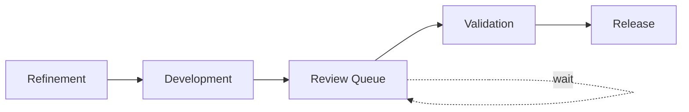

# Part 041 — Flow Improvement, Bottleneck Removal, Experiment Leadership, Mentoring, and Sustainable Influence

## Positioning

Hari 61–90 adalah fase ketika senior engineer mulai memberikan pengaruh sistemik.

Fokusnya bukan lagi sekadar memahami dan berkontribusi pada satu work item.

Fokusnya adalah:

- mengidentifikasi bottleneck nyata;
- memperbaiki flow;
- memimpin eksperimen kecil;
- mengurangi dependency;
- menyebarkan ownership;
- dan meningkatkan quality tanpa menjadi approval hub.

> **Core thesis:** pada hari 61–90, senior engineer harus mulai meninggalkan sistem dalam kondisi lebih mudah dipahami, lebih aman, dan lebih mandiri—bukan lebih bergantung pada dirinya.

---

## 1. Mission for Days 61–90

Expected outcomes:

- satu bottleneck prioritas dipilih;
- baseline dan evidence tersedia;
- satu improvement experiment dijalankan;
- satu recurring dependency dikurangi atau dikendalikan lebih baik;
- satu knowledge or ownership gap dikurangi;
- satu meaningful outcome dipimpin end-to-end;
- dan next-quarter operating plan disusun.

---

## 2. The 30–60–90 Progression

```text
Days 1–30:
Observe, map, verify.

Days 31–60:
Contribute, refine, estimate, and surface risk.

Days 61–90:
Improve flow, unblock systems, and build team leverage.
```

Senior engineer tetap belajar.

Perbedaannya adalah sekarang learning digunakan untuk mengubah sistem secara terukur.

---

## 3. What Not to Do in Days 61–90

Avoid:

- launching a broad transformation;
- rewriting architecture without staged evidence;
- replacing team process wholesale;
- becoming the mandatory reviewer;
- taking ownership away from existing maintainers;
- and declaring success based on activity.

Prefer:

- one focused experiment;
- one leverage point;
- and evidence-based adaptation.

---

## 4. From Observation to System Hypothesis

A system hypothesis connects:

```text
Observed pattern
-> Contributing condition
-> Expected consequence
-> Proposed intervention
-> Success signal
```

Example:

```text
Observed:
PRs wait 2–4 days.

Condition:
One senior reviewer owns two critical modules.

Consequence:
High aging and parallel WIP.

Intervention:
Reviewer rotation, focused PR descriptions, and pair review.

Success signal:
Median first-response time below one working day without higher defect escape.
```

---

## 5. Selecting the Right Improvement Area

Good candidates are:

- recurring;
- evidence-backed;
- material to delivery;
- within team influence;
- and small enough to test.

Weak candidates:

- vague cultural problems;
- organization-wide redesign;
- or issues with no clear decision path.

---

## 6. Improvement Portfolio

Possible focus areas:

### Flow

- WIP;
- review queue;
- late validation;
- blocked work.

### Quality

- escaped defects;
- flaky tests;
- repeat incidents;
- weak contract validation.

### Reliability

- diagnosis time;
- recovery;
- retry safety;
- operational visibility.

### Collaboration

- decision latency;
- handoff;
- dependency readiness;
- meeting load.

### Knowledge

- single-owner modules;
- release bottleneck;
- incident dependency.

---

## 7. Impact–Control Matrix

| Impact | Team Control | Suggested Action |
|---|---|---|
| High | High | Lead experiment now |
| High | Medium | Pilot with sponsor |
| High | Low | Escalate with evidence |
| Low | High | Improve opportunistically |
| Low | Low | Monitor or ignore |

Choose leverage, not merely visibility.

---

## 8. Bottleneck Identification

Ask:

```text
Where does work wait?
Where does rework occur?
Which decision takes too long?
What stops when one person is absent?
Which dependency repeatedly blocks the goal?
Where does risk become visible too late?
```

---

## 9. Bottleneck versus Symptom

### Symptom

Many items carry over.

### Possible bottlenecks

- oversized stories;
- review queue;
- late QA;
- unstable environment;
- unresolved product decision;
- or incident load.

Do not intervene before identifying the mechanism.

---

## 10. Flow Data Baseline

Possible baseline:

- WIP;
- cycle-time p50/p85;
- work-item age;
- review latency;
- blocked time;
- and carry-over.

Capture baseline before experiment.

---

## 11. Qualitative Baseline

Useful qualitative evidence:

- team reports unclear ownership;
- support escalates repeatedly;
- reviewers feel overloaded;
- and Product Owner lacks dependency visibility.

Use both quantitative and qualitative evidence.

---

## 12. Current-State Map

Create a map:



Annotate:

- average wait;
- owner;
- blocker type;
- and rework loop.

---

## 13. Constraint Theory

Throughput is limited by the current constraint.

Improving non-constraint stages may increase queue.

Example:

- development gets faster;
- review remains slow;
- WIP grows.

Focus first on the constraint.

---

## 14. Five Focusing Steps

A simplified constraint cycle:

1. Identify the constraint.
2. Exploit the constraint.
3. Subordinate other work.
4. Elevate the constraint.
5. Repeat after the constraint moves.

---

## 15. Exploit the Constraint

Use the existing bottleneck better.

Example for review:

- clear review focus;
- smaller PRs;
- prioritize aging items;
- remove automated style checks from humans.

---

## 16. Subordinate to the Constraint

Adjust upstream behavior.

Example:

- stop starting new PRs;
- swarm on review;
- limit WIP;
- and sequence work around reviewer availability.

---

## 17. Elevate the Constraint

Increase capability or capacity.

Examples:

- train secondary reviewers;
- automate checks;
- redesign ownership;
- or reduce architecture coupling.

---

## 18. WIP Improvement

A WIP experiment may include:

- explicit limits;
- right-to-left Daily Scrum;
- finish-before-start;
- and swarm policy.

Success should be measured by:

- aging;
- cycle time;
- and blocked work.

Not lower WIP alone.

---

## 19. Review Queue Improvement

Possible interventions:

- reviewer rotation;
- review SLA or service expectation;
- focused PR descriptions;
- smaller PRs;
- pair review;
- and automated style checks.

Guardrail:

- escaped defect rate does not increase.

---

## 20. Late Testing Improvement

Possible interventions:

- Three Amigos;
- acceptance examples earlier;
- test-first risk scenarios;
- continuous QA collaboration;
- and environment smoke checks.

Avoid simply “adding more QA”.

---

## 21. Dependency Delay Improvement

Possible interventions:

- readiness evidence;
- needed-by dates;
- contract-first collaboration;
- fallback;
- and escalation trigger.

---

## 22. Decision Latency Improvement

Possible interventions:

- name decision owner;
- one-screen decision brief;
- default for reversible decisions;
- and fixed review deadline.

---

## 23. CI Bottleneck Improvement

Possible interventions:

- move fast deterministic tests earlier;
- parallelize;
- reduce flakiness;
- cache safely;
- and remove redundant stages.

Measure:

- time to first useful failure;
- pipeline p85;
- and rerun rate.

---

## 24. Environment Bottleneck Improvement

Possible interventions:

- self-service provisioning;
- health checks;
- test-data automation;
- and alternate shared environment.

Before building a platform, quantify recurring pain.

---

## 25. Incident Load Improvement

Possible interventions:

- responder rotation;
- recurring-cause CAPA;
- better detection;
- runbooks;
- and operational backlog visibility.

---

## 26. Support Escalation Improvement

Possible interventions:

- support dashboard;
- terminal reason;
- correlation ID;
- self-service recovery;
- and clearer ownership.

---

## 27. Experiment Definition

An experiment is:

- bounded;
- reversible;
- time-limited;
- evidence-producing;
- and tied to a hypothesis.

It is not a permanent process mandate.

---

## 28. Experiment Canvas

```md
## Problem

What recurring pain exists?

## Evidence

What proves it?

## Hypothesis

What change may improve the system?

## Experiment

What exactly will be tried?

## Scope

Where and for how long?

## Guardrails

What must not worsen?

## Success Signals

What will be observed?

## Owner

Who coordinates?

## Review Date

When will the decision be made?

## Outcome

Adopt / Adapt / Abandon / Extend.
```

---

## 29. Experiment Selection Criteria

Choose experiments with:

- high learning value;
- low irreversibility;
- manageable coordination;
- and visible impact.

Avoid experiments that require many simultaneous policy changes.

---

## 30. Smallest Useful Experiment

Example:

Weak:

> Improve code review.

Stronger:

> For two Sprints, use one rotating reviewer per day and require a review-focus section on PRs affecting contracts.

---

## 31. Experiment Duration

Possible durations:

- one Sprint for meeting or board behavior;
- two to four Sprints for flow policy;
- longer for incident recurrence.

Set duration before starting.

---

## 32. Guardrails

A guardrail protects against harmful local optimization.

Examples:

- review latency decreases;
- while escaped defects do not rise.

- deployment frequency increases;
- while change failure remains stable.

---

## 33. Success Criteria

Good criteria are:

- observable;
- decision-relevant;
- and not overly precise for small samples.

Example:

> Median review response below one day for two Sprints, with no high-severity escaped defect attributable to review gaps.

---

## 34. Adoption Decision

### Adopt

Evidence supports the new practice.

### Adapt

Some benefit, but design needs change.

### Abandon

Cost exceeds value or hypothesis is unsupported.

### Extend

More evidence needed.

Record the decision.

---

## 35. Improvement Ownership

The senior engineer may lead the experiment.

But should involve:

- team;
- Scrum Master;
- Product Owner;
- and affected stakeholders.

Avoid making improvement a personal project.

---

## 36. Scrum Master Collaboration

A strong partnership:

- senior provides engineering-flow evidence;
- Scrum Master helps facilitation and systemic impediments;
- team co-designs experiment.

Do not bypass the Scrum Master when work affects Scrum effectiveness.

---

## 37. Product Owner Collaboration

Product Owner should understand:

- delivery consequence;
- capacity cost;
- and expected product benefit.

Improvement work should remain visible.

---

## 38. Engineering Manager Collaboration

Engineering Manager may help with:

- capacity;
- staffing;
- role clarity;
- and organizational escalation.

---

## 39. Team Involvement

Team participation improves:

- practicality;
- ownership;
- and adoption.

Do not announce a process change after privately designing it.

---

## 40. Experiment Kickoff

A kickoff should state:

```text
Problem:
Evidence:
What will change:
What will not change:
Duration:
Success signal:
Guardrail:
Owner:
Review date:
```

---

## 41. Experiment Communication

Keep updates concise:

```text
Current signal:
Observed behavior:
Unexpected effect:
Next checkpoint:
```

Avoid excessive reporting.

---

## 42. Experiment Review

At review:

- inspect evidence;
- hear qualitative experience;
- compare guardrails;
- and decide.

Do not declare success because participants liked the idea.

---

## 43. Avoiding Attribution Error

A metric change may be caused by:

- different work mix;
- team leave;
- incident;
- or scope shift.

State uncertainty.

One experiment rarely proves causation conclusively.

---

## 44. Sustainability of Improvement

A successful experiment should become:

- working agreement;
- automation;
- checklist;
- or standard.

But remove obsolete practices.

---

## 45. Improvement Debt

Every new process adds maintenance cost.

Ask:

- Is this still useful?
- Can it be automated?
- Can it be simplified?
- Can it be removed?

---

## 46. Unblocking Work

Unblocking is not solving every issue personally.

It may mean:

- clarifying decision;
- connecting owners;
- creating fallback;
- or escalating.

---

## 47. Blocker Triage

For each blocker:

```text
Blocked outcome:
Required input:
Owner:
Age:
Impact:
Fallback:
Escalation trigger:
```

---

## 48. Swarming

Swarm when:

- Sprint Goal is threatened;
- critical work is aging;
- or one path needs multiple skills.

Avoid starting new optional work.

---

## 49. Escalation

Escalate when:

- blocker exceeds team authority;
- trigger is reached;
- customer or security impact exists;
- or no local option remains.

Use a decision-ready packet.

---

## 50. Escalation Packet

```md
## Decision Needed

## Context

## Evidence

## Impact

## Actions Taken

## Options

## Recommendation

## Decision Deadline
```

---

## 51. Reducing a Recurring Dependency

A dependency reduction may use:

- contract-first;
- adapter;
- self-service;
- documentation;
- secondary ownership;
- or architecture boundary change.

---

## 52. Cross-Team Improvement

A cross-team experiment needs:

- shared outcome;
- provider/consumer owners;
- bounded scope;
- evidence;
- and decision path.

---

## 53. Contract Readiness Improvement

Example:

> For top cross-team items, require agreed schema, example payload, consumer test owner, and rollout sequence before Sprint selection.

---

## 54. Environment Readiness Improvement

Example:

> Add automated environment health check and require a passing result before Planning for integration-heavy items.

---

## 55. Knowledge Bottleneck Improvement

Possible interventions:

- pairing;
- reviewer rotation;
- release shadowing;
- teach-back;
- and secondary ownership.

---

## 56. Ownership Distribution

By day 90, senior engineer should help another engineer own:

- design;
- review;
- demo;
- incident role;
- or dependency coordination.

---

## 57. Mentoring during Days 61–90

Mentoring focus:

- judgment;
- trade-offs;
- communication;
- and ownership.

Avoid focusing only on code style.

---

## 58. Mentoring through Delegation

Delegate:

- bounded design;
- workshop facilitation;
- risk brief;
- or release coordination.

Provide guardrails.

---

## 59. Delegation Brief

```md
## Outcome

## Scope

## Constraints

## Decision Rights

## Evidence

## Checkpoints

## Escalation Triggers
```

---

## 60. Coaching Questions

```text
What outcome are you protecting?
What evidence supports the risk?
Which option is most reversible?
What should be escalated?
What can you decide without me?
```

---

## 61. Technical Leadership without Centralization

Lead through:

- principles;
- templates;
- examples;
- guardrails;
- and mentoring.

Not through approval on every item.

---

## 62. Review Bottleneck Self-Check

Ask:

- Are PRs waiting for me?
- Can another reviewer handle this?
- Is the issue automatable?
- Am I blocking on preference?
- Did I explain the mental model?

---

## 63. Design Bottleneck Self-Check

Ask:

- Did I let the author recommend?
- Is this decision reversible?
- Does it need my approval?
- Can the team use a principle instead?

---

## 64. Incident Bottleneck Self-Check

Ask:

- Can others lead?
- Is runbook usable?
- Is role rotation practiced?
- What stops when I am absent?

---

## 65. Leading a Meaningful Outcome

By this phase, own one meaningful outcome through:

- refinement;
- design;
- implementation;
- integration;
- release;
- and Review.

Ownership includes communication and follow-up.

---

## 66. Outcome Selection

Choose an outcome that:

- matters;
- is bounded;
- has cross-functional collaboration;
- and produces evidence.

Avoid selecting the largest initiative to appear senior.

---

## 67. Delivery Leadership

During execution:

- maintain goal;
- manage WIP;
- expose risk;
- coordinate dependency;
- and adapt scope.

Do not become task dispatcher.

---

## 68. Release Leadership

Ensure:

- readiness;
- rollout;
- observability;
- rollback;
- and stakeholder communication.

---

## 69. Review Leadership

At Sprint Review:

- explain problem;
- show evidence;
- disclose limits;
- and help capture feedback.

---

## 70. Post-Release Learning

Inspect:

- adoption;
- failures;
- support;
- and product outcome.

Do not stop at deployment.

---

## 71. Improvement and Architecture

Architectural improvement should be:

- staged;
- evidence-based;
- and tied to delivery pain.

Avoid broad target-state architecture without migration.

---

## 72. Architecture Experiment

Example:

> Route one approval-rule path through the authoritative evaluator and compare behavior in shadow mode before migrating other paths.

---

## 73. Architecture Fitness Check

Possible checks:

- compatibility;
- dependency rule;
- latency;
- and tenant isolation.

Automate validated architectural guardrails.

---

## 74. Flow and Quality Balance

A flow improvement is invalid if it creates unacceptable quality loss.

Pair:

- faster review with defect guardrail;
- smaller scope with usability guardrail;
- higher release frequency with change-failure guardrail.

---

## 75. Reliability Improvement

Possible day-90 reliability leadership:

- one recurring incident CAPA;
- one missing alert;
- one tested runbook;
- or one controlled failure exercise.

---

## 76. Operational Readiness Improvement

Examples:

- support dashboard;
- correlation ID;
- terminal reason;
- rollout checklist;
- and data-reconciliation procedure.

---

## 77. Sustainable Pace

Improvement should not depend on:

- after-hours work;
- one senior;
- or constant urgency.

Sustainable outcomes are repeatable.

---

## 78. Meeting and Coordination Reduction

A useful improvement may remove:

- duplicated status meeting;
- broad review attendance;
- or recurring decision forum.

Replace with durable information and explicit escalation.

---

## 79. Remote-First Improvement

Examples:

- async pre-read;
- timezone handoff;
- decision deadline;
- and written summary.

Measure decision latency and meeting load.

---

## 80. Days 61–90 Weekly Plan

### Week 9 — Select leverage point

- review evidence;
- align with team;
- define baseline.

### Week 10 — Launch experiment

- communicate;
- execute;
- observe early effects.

### Week 11 — Lead outcome and distribute ownership

- own one meaningful delivery;
- delegate one responsibility;
- and reduce one dependency.

### Week 12 — Review and institutionalize learning

- evaluate experiment;
- adopt/adapt/abandon;
- present 90-day summary;
- define next-quarter plan.

---

## 81. Week 9 Outcomes

- one bottleneck hypothesis;
- baseline;
- experiment canvas;
- and stakeholder alignment.

---

## 82. Week 10 Outcomes

- experiment running;
- guardrails visible;
- and first checkpoint recorded.

---

## 83. Week 11 Outcomes

- one meaningful slice or outcome led;
- one ownership delegation;
- one blocker or dependency reduced.

---

## 84. Week 12 Outcomes

- experiment decision;
- updated working agreement or automation;
- 90-day impact summary;
- and next-quarter mastery plan.

---

## 85. 90-Day Deliverables

Recommended outputs:

1. System bottleneck analysis.
2. Experiment canvas.
3. Baseline and outcome evidence.
4. One meaningful delivery outcome.
5. One dependency reduction.
6. One ownership-distribution action.
7. One quality or reliability improvement.
8. Updated architecture/delivery maps.
9. Internal Verification Checklist.
10. Next-quarter operating plan.

---

## 86. 90-Day Summary Template

```md
## Product and Domain Understanding

## Delivery Contributions

## Flow Bottleneck Identified

## Experiment Led

## Evidence and Outcome

## Risks and Dependencies Reduced

## Quality and Reliability Improvement

## Ownership and Mentoring Impact

## Remaining Systemic Risks

## Next-Quarter Focus
```

---

## 87. Evidence of Senior-Level Impact

Potential evidence:

- lower blocker age;
- faster review;
- clearer dependencies;
- reduced recurrence;
- distributed reviewer ownership;
- improved stakeholder decisions;
- and one validated process change.

Do not claim impact from meeting attendance or document count.

---

## 88. Impact Narrative

A useful narrative:

```text
Before:
Observed system condition.

Intervention:
What changed.

Evidence:
What improved or did not.

Learning:
What the team now knows.

Next:
What should happen next.
```

---

## 89. Handling an Unsuccessful Experiment

An unsuccessful experiment is valuable if it creates learning.

Document:

- hypothesis;
- actual result;
- unexpected effect;
- and next decision.

Do not hide failure to protect reputation.

---

## 90. Handling Resistance

Resistance may indicate:

- workload;
- low trust;
- unclear benefit;
- or previous failed initiative.

Respond by:

- listening;
- reducing scope;
- and making the experiment reversible.

---

## 91. Handling Leadership Pressure for Bigger Change

Use:

> We have evidence for a focused intervention in review latency. Broader process redesign would have lower confidence. I recommend testing this first and using the result to decide whether larger change is needed.

---

## 92. Handling “Why Not Fix Everything?”

Explain constraint and learning value.

> The highest current constraint is review wait. Changing estimation, meeting cadence, and release process simultaneously would make the outcome impossible to attribute.

---

## 93. Handling Noisy Data

Use:

- qualitative evidence;
- longer observation;
- and confidence statements.

Avoid fake statistical certainty.

---

## 94. Handling Cross-Team Non-Response

Use:

- clear need;
- owner;
- deadline;
- impact;
- fallback;
- and escalation.

Do not rely on repeated “ping”.

---

## 95. Handling Your Own Bottleneck Risk

Actively:

- document;
- delegate;
- rotate;
- and take planned absence.

A system that fails when you are away is not mature ownership.

---

## 96. Senior Engineer Operating Model

### Diagnose

- use data and observation.

### Select leverage

- focus on the constraint.

### Experiment

- small, reversible, measurable.

### Collaborate

- involve team and role owners.

### Lead outcomes

- maintain goal and transparency.

### Distribute ownership

- delegate decisions and practice.

### Institutionalize

- automate or update agreement.

### Step back

- ensure the system works without you.

---

## 97. Worked Example: Review Latency Experiment

### Baseline

- median first review: 2.8 days;
- 72% reviews handled by one senior;
- p85 cycle time: 11 days.

### Hypothesis

Reviewer rotation and smaller PRs reduce waiting.

### Experiment

For two Sprints:

- daily reviewer rotation;
- review-focus section;
- one coherent change per PR;
- swarm on items older than two days.

### Guardrails

- escaped defects;
- review rework;
- and reviewer load.

### Result

- median response: 0.9 day;
- p85 cycle time: 8 days;
- no rise in escaped defects.

### Decision

Adopt rotation; adapt PR-size guidance.

---

## 98. Worked Example: Dependency Readiness

### Problem

Cross-team stories repeatedly enter Sprint without usable contract.

### Experiment

Top dependency-heavy candidates require:

- agreed contract;
- consumer owner;
- needed-by date;
- and fallback.

### Result

One item was deliberately deferred before Planning.

This is a success because false commitment was avoided.

---

## 99. Worked Example: Incident Recurrence

### Observation

Two duplicate-order incidents.

### Improvement

- idempotency;
- duplicate metric;
- recovery runbook;
- and tabletop.

### Evidence

- controlled duplicate simulation;
- alert fires;
- recovery executed by a secondary owner.

### Outcome

Both technical risk and knowledge bottleneck decrease.

---

## 100. Worked Example: Senior Review Bottleneck

### Observation

Team waits for one senior.

### Intervention

- review taxonomy;
- pair review;
- secondary owner;
- automated architecture rule.

### Result

Three engineers can approve normal-risk changes.

Senior reviews only high-risk contracts and migrations.

---

## 101. Worked Example: Remote Decision Latency

### Baseline

Cross-timezone product decisions take four days.

### Experiment

- one-screen decision note;
- named owner;
- explicit deadline;
- reversible default.

### Result

Median decision latency falls to 1.5 days.

### Guardrail

No increase in reopened decisions.

---

## 102. Worked Example: Failed Experiment

### Hypothesis

Daily 30-minute cross-team sync will reduce dependency delay.

### Result

Meeting hours rise, dependency age unchanged.

### Learning

The problem is absent decision authority, not communication frequency.

### Next

Introduce decision owner and escalation trigger.

---

## 103. Experiment Checklist

- Problem recurring?
- Evidence available?
- Hypothesis explicit?
- Scope bounded?
- Reversible?
- Guardrail?
- Owner?
- Review date?
- Adoption decision planned?

---

## 104. Flow-Improvement Checklist

- Constraint identified?
- WIP visible?
- Aging visible?
- Queue measured?
- Upstream behavior adjusted?
- Bottleneck capability increased?
- Quality guardrail present?

---

## 105. Unblocking Checklist

- Exact blocked outcome?
- Required input?
- Owner?
- Age?
- Impact?
- Fallback?
- Trigger?
- Decision requested?

---

## 106. Mentoring and Ownership Checklist

- Meaningful responsibility delegated?
- Guardrails clear?
- Mentee decides within boundary?
- Feedback given?
- Secondary owner established?
- Dependency on senior reduced?

---

## 107. Internal Verification Checklist

### Flow

- Are WIP and aging visible?
- Is cycle time trusted?
- Are review and validation queues measured?
- What is the current bottleneck?
- Who owns flow improvement?

### Experiments

- How are improvement experiments approved?
- Where are they tracked?
- Is capacity allocated?
- Who reviews outcomes?
- How are successful experiments institutionalized?

### Ownership

- Are review, release, and incident roles rotated?
- Are secondary owners expected?
- Which areas remain single-person dependencies?
- Can senior engineers delegate decision authority?

### Cross-team

- How are dependencies escalated?
- Are readiness criteria used?
- Are shared service expectations defined?
- Who can change organizational policy?

### 90-day expectations

- What impact is expected by day 90?
- Is a formal review held?
- What evidence matters?
- How is next-quarter focus agreed?

---

## 108. Practical Exercises

### Exercise 1 — Constraint analysis

Identify one bottleneck and apply the five focusing steps.

### Exercise 2 — Experiment canvas

Design a two-Sprint experiment with guardrails.

### Exercise 3 — Ownership distribution

Choose one responsibility you currently centralize and delegate it safely.

### Exercise 4 — Dependency reduction

Convert one recurring dependency into contract, self-service, or secondary ownership.

### Exercise 5 — 90-day summary

Write a concise before–intervention–evidence–learning narrative.

### Exercise 6 — Failed experiment review

Analyze an improvement that did not work and identify the wrong assumption.

---

## 109. Part Completion Checklist

You are done if you can:

- identify the current delivery constraint;
- establish a baseline;
- design and lead a bounded experiment;
- protect quality with guardrails;
- reduce a blocker or dependency;
- distribute meaningful ownership;
- lead a delivery outcome end-to-end;
- and produce a credible 90-day impact plan.

---

## 110. Key Takeaways

1. Days 61–90 are about system leverage.
2. Improve the constraint, not everything.
3. Baseline before intervention.
4. Experiments should be small and reversible.
5. Guardrails prevent local optimization.
6. Unblocking does not mean doing everything yourself.
7. Ownership must spread.
8. Failed experiments can still create value.
9. Senior impact should be visible in system behavior.
10. Internal expectations and authority must be verified.

---

## 111. References

Conceptual baseline:

- General 30–60–90 onboarding, Theory of Constraints, flow improvement, and experiment-leadership practices.
- Scrum transparency, inspection, adaptation, and self-management principles.
- Engineering leadership, distributed ownership, reliability, and continuous-improvement concepts.

These concepts do not describe internal CSG processes.
